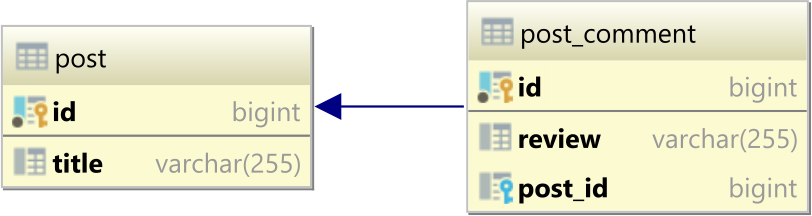
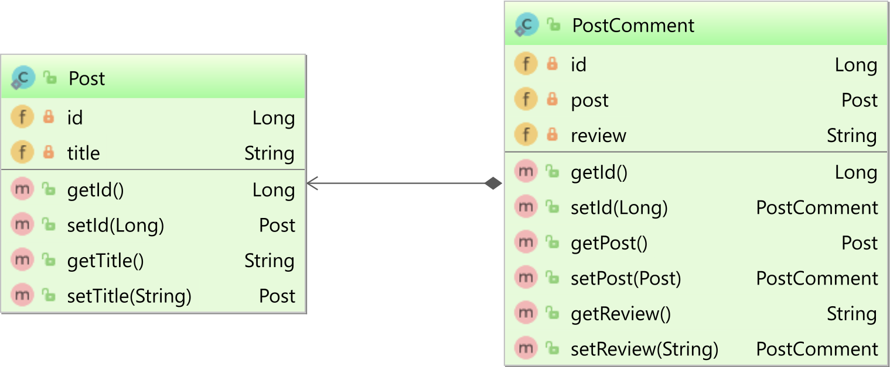

<!-- TOC -->
* [Hibernate](#hibernate)
  * [Каковы основные преимущества Hibernate Framework?](#каковы-основные-преимущества-hibernate-framework)
  * [Каковы преимущества использования Hibernate перед JDBC?](#каковы-преимущества-использования-hibernate-перед-jdbc)
  * [Зачем использовать Hibernate Framework?](#зачем-использовать-hibernate-framework)
  * [Назовите некоторые из важных интерфейсов фреймворка Hibernate?](#назовите-некоторые-из-важных-интерфейсов-фреймворка-hibernate)
  * [Что такое Session в Hibernate и как её получить?](#что-такое-session-в-hibernate-и-как-её-получить)
  * [Что такое Hibernate SessionFactory?](#что-такое-hibernate-sessionfactory)
  * [Какая разница между методами Hibernate Session get() и load()?](#какая-разница-между-методами-hibernate-session-get-и-load)
  * [В чем разница между openSession и getCurrentSession?](#в-чем-разница-между-opensession-и-getcurrentsession)
  * [Какие шаблоны проектирования используются в среде Hibernate?](#какие-шаблоны-проектирования-используются-в-среде-hibernate)
  * [Объясните, что такое Proxy в Hibernate и как он помогает при Lazy-loading?](#объясните-что-такое-proxy-в-hibernate-и-как-он-помогает-при-lazy-loading)
  * [Как мы можем увидеть SQL, сгенерированный Hibernate, на консоли?](#как-мы-можем-увидеть-sql-сгенерированный-hibernate-на-консоли)
  * [Когда вы используете merge() и update() в Hibernate?](#когда-вы-используете-merge-и-update-в-hibernate)
  * [Что вы знаете о кэшировании в Hibernate? Объясните понятие кэш первого уровня в Hibernate?](#что-вы-знаете-о-кэшировании-в-hibernate-объясните-понятие-кэш-первого-уровня-в-hibernate)
  * [Кэш второго уровня](#кэш-второго-уровня)
  * [Разница между кешем первого и второго уровня в Hibernate?](#разница-между-кешем-первого-и-второго-уровня-в-hibernate)
  * [@Cacheable и @Cache](#cacheable-и-cache)
      * [@Cache принимает три параметра:](#cache-принимает-три-параметра)
      * [Стратегий одновременного доступа к объектам в кэше в hibernate существует четыре:](#стратегий-одновременного-доступа-к-объектам-в-кэше-в-hibernate-существует-четыре)
  * [Кэш запросов](#кэш-запросов)
  * [В чем разница между Hibernate save(), saveOrUpdate() и persist()?](#в-чем-разница-между-hibernate-save-saveorupdate-и-persist)
  * [Каковы преимущества Named SQL Query?](#каковы-преимущества-named-sql-query)
  * [BEST PRACTICES](#best-practices)
  * [Преимущества Hibernate над JDBC](#преимущества-hibernate-над-jdbc)
  * [Транзакции в Hibernate](#транзакции-в-hibernate)
  * [Операции над транзакциями](#операции-над-транзакциями)
  * [Блокировки в Hibernate](#блокировки-в-hibernate)
  * [Optimistic lock](#optimistic-lock)
      * [Есть несколько правил, которым мы должны следовать при объявлении атрибутов версии:](#есть-несколько-правил-которым-мы-должны-следовать-при-объявлении-атрибутов-версии)
      * [Режимы блокировки](#режимы-блокировки)
      * [OPTIMISTIC (READ)](#optimistic-read)
      * [OPTIMISTIC_INCREMENT (WRITE)](#optimistic_increment-write)
      * [Использование Optimistic lock](#использование-optimistic-lock)
  * [OptimisticLockException](#optimisticlockexception)
  * [Pessimistic lock](#pessimistic-lock)
  * [Проблема N+1 query](#проблема-n1-query)
      * [Проблема запроса N + 1 с простым SQL](#проблема-запроса-n--1-с-простым-sql)
      * [Проблема запроса N + 1 с JPA и Hibernate](#проблема-запроса-n--1-с-jpa-и-hibernate)
      * [FetchType.EAGER](#fetchtypeeager)
      * [FetchType.LAZY](#fetchtypelazy)
      * [Кэш второго уровня](#кэш-второго-уровня-1)
      * [Вывод](#вывод)
  * [Полезные ссылки](#полезные-ссылки)
<!-- TOC -->

# Hibernate

`Hibernate` - один из самых популярных фреймворков в Java, который упрощает разработку приложений Java для взаимодействия с базой данных. Это инструмент 
`объектно-реляционного сопоставления (ORM)`. Это легкий инструмент с открытым кодом, что дает ему преимущество перед другими фреймворками.

## Каковы основные преимущества Hibernate Framework?

- Открытый исходный код.
- Производительность `Hibernate` очень быстрая.
- Помогает в создании независимых запросов к базе данных.
- Предоставляет возможности для автоматического создания таблицы.
- Он предоставляет статистику запросов и статус базы данных.

## Каковы преимущества использования Hibernate перед JDBC?

- `Hibernate `исключает много шаблонного кода, который поставляется с `JDBC API`, код выглядит более чистым и читаемым.
- Эта структура `Java` поддерживает наследование, ассоциации и коллекции. Эти функции фактически отсутствуют в `JDBC`.
- `HQL (Hibernate Query Language)` более объектно-ориентирован и близок к `Java`. Но для `JDBC` вам нужно писать собственные `SQL`-запросы.
- `Hibernate` неявно обеспечивает управление транзакциями, тогда как в `JDBC API` вам нужно написать код для управления транзакциями с использованием `commit` и
`rollback`.
- `JDBC` генерирует `SQLException`, которое является `checked` исключением, поэтому вам нужно написать много блоков `try-catch`. `Hibernate` обертывает исключения 
`JDBC` и генерирует `JDBCException` или `HibernateException`, которые являются `unchecked` исключениями, поэтому вам не нужно писать код для его обработки. Имеется 
встроенное управление транзакциями, которое помогает устранить использование блоков `try-catch`.
- Он поддерживает автоматические операции DDL.
- Также поддерживает автоматическое создание первичного ключа.
- Поддерживает кеш-память.

## Зачем использовать Hibernate Framework?

`Hibernate` преодолевает недостатки других технологий, таких как `JDBC`.

- Он не зависит от базы данных, в отличии от `JDBC`.
- Работа с `JDBC` требует больших затрат на изменение баз данных, `Hibernate` отлично справляется с этой проблемой.
- Переносимость кода невозможна при работе с `JDBC`. С этим легко справляется `Hibernate`.
- Он преодолевает часть обработки исключений, которая является обязательной при работе с `JDBC`.
- Он сокращает длину кода и повышает удобочитаемость за счет устранения `boilerplate` кода.

## Назовите некоторые из важных интерфейсов фреймворка Hibernate?

- `org.hibernate.SessionFactory`
- `org.hibernate.Session`
- `org.hibernate.Transaction`

## Что такое Session в Hibernate и как её получить?

`Hibernate Session` - это интерфейс между уровнем приложения `Java` и `Hibernate`. Он используется для получения физического соединения с базой данных. 
Созданный объект `Session` является легковесным и новый экземпляр создаётся каждый раз, когда требуется взаимодействие с базой данных. `Session` предоставляет 
методы для создания, чтения, обновления и удаления операций для `persistent` объектов.

## Что такое Hibernate SessionFactory?

`SessionFactory` - это фабричный класс, который используется для получения объектов `Session`. `SessionFactory` отвечает за считывание параметров конфигурации 
`Hibernate` и подключение к базе данных. `SessionFactory` - это тяжелый объект, поэтому обычно он создается во время запуска приложения и сохраняется для 
дальнейшего использования. `SessionFactory` является потокобезопасным объектом, который используется всеми потоками приложения. Если вы используете несколько баз 
данных, вам придется создать несколько объектов `SessionFactory`. Внутреннее состояние `SessionFactory` неизменно (`immutable`). `SessionFactory` также 
предоставляет методы для получения метаданных класса и статистики, вроде данных о втором уровне кэша, выполняемых запросах и т.д.

## Какая разница между методами Hibernate Session get() и load()?

`Hibernate session` обладает различными методами для загрузки данных из базы данных. Наиболее часто используемые методы для этого — `get()` и `load()`.

- `get()` загружает данные сразу при вызове, в то время как `load()` использует прокси объект и загружает данные только тогда, когда это требуется на самом деле. 
В этом плане `load()` имеет преимущество в плане ленивой загрузки данных.
- `load()` бросает исключение, когда данные не найдены. Поэтому его нужно использовать только при уверенности в существовании данных.
Нужно использовать метод `get()`, если необходимо удостовериться в наличии данных в БД.

Поэтому иногда использование `load()` может быть быстрее, чем метод `get()`.

## В чем разница между openSession и getCurrentSession?

Метод `getCurrentSession()` возвращает сессию, привязанную к контексту, и для того, чтобы это работало, вам необходимо настроить его в файле конфигурации 
`Hibernate`. Поскольку этот объект сессии принадлежит контексту `Hibernate`, ничего страшного, если вы не закроете его. После закрытия `SessionFactory` этот объект 
сессии закрывается.

Метод `openSession()` помогает открыть новую сессию. Вы должны закрыть этот объект сеанса после завершения всех операций с базой данных. Кроме того, вы должны 
открывать новую сессию для каждого запроса в многопоточной среде.

## Какие шаблоны проектирования используются в среде Hibernate?

В `Hibernate` используется несколько шаблонов проектирования, а именно:

- `Domain Model`: объектная модель предметной области, которая включает как поведение, так и данные.
- `Proxy`: используется для отложенной загрузки.
- `Factory`: используется в SessionFactory.

## Объясните, что такое Proxy в Hibernate и как он помогает при Lazy-loading?

- `Hibernate` использует прокси-объект для поддержки `lazy-loading`.
- Когда вы пытаетесь загрузить данные из таблиц, `Hibernate` не загружает все сопоставленные объекты.
- Когда вы пытаетесь получить child объект с помощью методов получения, если связанная сущность отсутствует в кэше, тогда будет выполнен реальный запрос в базу 
данных.

## Как мы можем увидеть SQL, сгенерированный Hibernate, на консоли?

Чтобы просмотреть сгенерированный `SQL` запрос в консоли, вам необходимо добавить следующее в файл конфигурации `Hibernate`:

```xml
<property name = "show_sql">true</property>
```

## Когда вы используете merge() и update() в Hibernate?

- `update()`: если вы уверены, что в сессии `Hibernate` не содержится экземпляра `persistent` объекта с тем же идентификатором.
- `merge()`: помогает объединить ваши модификации в любое время без учета состояния сессии.

## Что вы знаете о кэшировании в Hibernate? Объясните понятие кэш первого уровня в Hibernate?

`Hibernate` использует кэширование, чтобы сделать наше приложение быстрее. Кэш `Hibernate` может быть очень полезным в получении высокой производительности 
приложения при правильном использовании. Идея кэширования заключается в сокращении количества запросов к базе данных.

Кэш первого уровня `Hibernate` связан с объектом `Session`. Кэш первого уровня у `Hibernate`  включен по умолчанию и не существует никакого способа, чтобы его 
отключить. Соответственно, при запросах того же самого объекта несколько раз в рамках одного `persistence context`, запрос в `БД` будет выполнен один раз, а все
остальные загрузки будут выполнены из кэша. Интересно поведение кэша первого уровня при использовании ленивой загрузки. При загрузке объекта методом `load()` или
объекта с лениво загружаемыми полями, лениво загружаемые данные в кэш не попадут. При обращении к данным будет выполнен запрос в базу и данные будут загружены и в
объект и в кэш. А вот следующая попытка лениво загрузить объект приведёт к тому, что объект сразу вернут из кэша и уже полностью загруженным.

Однако `Hibernate` предоставляет методы, с помощью которых мы можем удалить выбранные объекты из кэша или полностью очистить кэш.
Любой объект закэшированный в `session` не будет виден другим объектам `session`. После закрытия объекта сессии все кэшированные объекты будут потеряны.

## Кэш второго уровня

Если кэш первого уровня существует только на уровне сессии и `persistence context`, то кэш второго уровня находится выше — на уровне `SessionFactory` и,
следовательно, один и тот же кэш доступен одновременно в нескольких `persistence context`. Кэш второго уровня требует некоторой настройки и поэтому не включен по
умолчанию. Настройка кэша заключается в конфигурировании реализации кэша и разрешения сущностям быть закэшированными.

`Hibernate` не реализует сам никакого `in-memory сache`, а использует существующие реализации кэшей. Раньше `Hibernate` самостоятельно поддерживал интерфейс с 
этими кэшами, но сейчас существует `JCache` и корректнее будет использовать этот интерфейс. Реализаций у `JCache` множество, но одна из самых распространённых 
`ehcache`.

## Разница между кешем первого и второго уровня в Hibernate?

Кэш первого уровня поддерживается на уровне сессии, в то время как кэш второго уровня поддерживается на уровне `SessionFactory` и используется всеми сеансами.

## @Cacheable и @Cache

- `@Cacheable` это аннотация `JPA` и позволяет объекту быть закэшированным. `Hibernate` поддерживает эту аннотацию в том же ключе.
- `@Cache` это аннотация `Hibernate`, настраивающая тонкости кэширования объекта в кэше второго уровня `Hibernate`. Аннотации `@Cacheable` достаточно, чтобы объект 
начал кэшироваться с настройками по умолчанию. При этом `@Cache` использованная без `@Cacheable` не разрешит кэширование объекта

#### @Cache принимает три параметра:

- `include`, имеющий по умолчанию значение `all` и означающий кэширование всего объекта. Второе возможное значение, `non-lazy`, запрещает кэширование лениво 
загружаемых объектов. Кэш первого уровня не обращает внимания на эту директиву и всегда кэширует лениво загружаемые объекты.
- `region` позволяет задать имя региона кэша для хранения сущности. Регион можно представить как разные кэши или разные части кэша, имеющие разные настройки на
уровне реализации кэша. Например, я мог бы создать в конфигурации `ehcache` два региона, один с краткосрочным хранением объектов, другой с долгосрочным и 
отправлять часто изменяющиеся объекты в первый регион, а все остальные во второй.
- `usage` задаёт стратегию одновременного доступа к объектам.

```java
@Cache(usage=CacheConcurrencyStrategy.READ_ONLY, region="employee")
```

`usage` достаточно объёмен, чтобы рассматривать его внутри списка. Проблема заключается в том, что кэш второго уровня доступен из нескольких сессий сразу и 
несколько потоков программы могут одновременно в разных транзакциях работать с одним и тем же объектом. Следовательно надо как-то обеспечивать их одинаковым 
представлением этого объекта.

#### Стратегий одновременного доступа к объектам в кэше в hibernate существует четыре:

- `transactional` — полноценное разделение транзакций. Каждая сессия и каждая транзакция видят объекты, как если бы только они с ним работали последовательно одна 
транзакция за другой. Плата за это — блокировки и потеря производительности.
- `read-write` — полноценный доступ к одной конкретной записи и разделение её состояния между транзакциями. Однако суммарное состояние нескольких объектов в разных 
транзакциях может отличаться.
- `nonstrict-read-write` — аналогичен `read-write`, но изменения объектов могут запаздывать и транзакции могут видеть старые версии объектов. Рекомендуется 
использовать в случаях, когда одновременное обновление объектов маловероятно и не может привести к проблемам.
- `read-only` — объекты кэшируются только для чтения и изменение удаляет их из кэша.

Список выше отсортирован по нарастанию производительности, `transactional` стратегия самая медленная, `read-only` самая быстрая. Недостатком `read-only` стратегии 
является её бесполезность, в случае если объекты постоянно изменяются, так как в этом случае они не будут задерживаться в кэше.

Использование кэша второго уровня требует изменений в конфигурации `Hibernate` и в коде сущностей, но не требует изменения кода запросов и управления сущностями:

```java
session = sessionFactory.openSession();
session.beginTransaction();
 
// Database will be queried
System.out.println(session.get(Person.class, 3L));
 
session.getTransaction().commit();
session.close();
 
session = sessionFactory.openSession();
session.beginTransaction();
 
// Database will not be queried, 2nd level cache will provide the data
System.out.println(session.get(Person.class, 3L));
 
session.getTransaction().commit();
session.close();
```

## Кэш запросов

Кэши первого и второго уровней работают с объектами загружаемыми по `id`. Но в дикой природе к базе чаще выполняются запросы с условиями, чем загружаются какие-то 
заранее известные объекты:

И результат выполнения таких запросов тоже может потребоваться кэшировать. Например если вы делаете поисковый сайт по автозапчастям, то можете кэшировать запросы 
пользователей, которые, скорее всего, ищут одни запчасти гораздо чаще других. У кэша запросов есть и своя цена — `Hibernate` будет вынужден отслеживать сущности 
закешированные с определённым запросом и выкидывать запрос из кэша, если кто-то поменяет значение сущности. То есть для кэша запросов стратегия параллельного 
доступа всегда `read-only`.
 
```xml
<property name="hibernate.cache.use_query_cache">true</property>
```

Но даже с этим разрешением `Hibernate` не будет кэшировать все запросы, а только те, кэширование которых явно запрошено методом `setCacheable()`.

## В чем разница между Hibernate save(), saveOrUpdate() и persist()?

- `save()` используется для сохранения сущности в базу данных. Проблема с использованием метода `save()` заключается в том, что он может быть вызван без
транзакции. А следовательно если у нас имеется отображение нескольких объектов, то только первичный объект будет сохранен и мы получим несогласованные данные. 
Также `save()` немедленно возвращает сгенерированный идентификатор.
- `persist()` аналогичен `save()` с транзакцией. `persist()` не возвращает сгенерированный идентификатор сразу.
- `saveOrUpdate()` использует запрос для вставки или обновления, основываясь на предоставленных данных. Если данные уже присутствуют в базе данных, то будет 
выполнен запрос обновления. Метод `saveOrUpdate()` можно применять без транзакции, но это может привести к аналогичным проблемам, как и в случае с методом 
`save()`.

## Каковы преимущества Named SQL Query?

Именованный запрос Hibernate позволяет собрать множество запросов в одном месте, а затем вызывать их в любом классе. Синтаксис `Named Query` проверяется при 
создании `session factory`, что позволяет заметить ошибку на раннем этапе, а не при запущенном приложении и выполнении запроса. `Named Query` глобальные, т.е. 
заданные однажды, могут быть использованы в любом месте. Однако одним из основных недостатков именованного запроса является то, что его очень трудно отлаживать 
(могут быть сложности с поиском места определения запроса). 

## BEST PRACTICES

- Всегда проверяйте доступ к primary key. Если он создается базой данных, то вы не должны иметь сеттера.
- По умолчанию `hibernate` устанавливает значения в поля напрямую без использования сеттеров. Если необходимо заставить хибернейт их применять, то проверьте 
использование аннотации `@Access(value=AccessType.PROPERTY)` над свойством.
- Если тип доступа — `property`, то удостоверьтесь, что аннотация используется с геттером. Избегайте смешивания использования аннотации над обоими полями и 
геттером.
- Используйте нативный `sql` запрос только там, где нельзя использовать `HQL`.
- Используйте `ordered list` вместо сортированного списка из `Collection API`, если вам необходимо получить отсортированные данные.
- Применяйте именованные запросы разумно — держите их в одном месте и используйте только для часто применяющихся запросов. Для специфичных запросов пишите их 
внутри конкретного бина.
- В веб приложениях используйте `JNDI DataSource` вместо файла конфигурации для соединения с `БД`.
- Избегайте отношений `многие-ко-многим`, т.к. это можно заменить двунаправленной `One-to-Many` и `Many-to-One` связью.
- Для `collections` попробуйте использовать `Lists`, `maps` и `sets`. Избегайте массивов (`array`), т.к. они не дают преимуществ ленивой загрузки.
- Не обрабатывайте исключения, которые могут откатить транзакцию и закрыть сессию. Если это проигнорировать, то `Hibernate` не сможет гарантировать, что состояние 
в памяти соответствует состоянию персистентности (могут быть коллизии данных).
- Применяйте шаблон `DAO` для методов, которые могут использоваться в `entity` бинах.
- Предпочитайте ленивую выборку для ассоциаций.

## Преимущества Hibernate над JDBC

- `Hibernate` удаляет множество повторяющегося кода из `JDBC API`, а следовательно его легче читать, писать и поддерживать.
- `Hibernate` поддерживает наследование, ассоциации и коллекции, что не доступно в `JDBC API`.
- `Hibernate` неявно использует управление транзакциями. Большинство запросов нельзя выполнить вне транзакции. При использовании `JDBC API` для управления 
транзакциями нужно явно использовать `commit` и `rollback`.
- `JDBC API throws SQLException`, которое относится к `checked` исключениям, а значит необходимо постоянно писать множество блоков `try-catch`. В большинстве
случаев это не нужно для каждого вызова `JDBC` и используется для управления транзакциями. `Hibernate` оборачивает исключения `JDBC` через `unchecked` 
`JDBCException` или `HibernateException`, а значит нет необходимости проверять их в коде каждый раз. Встроенная поддержка управления транзакциями в `Hibernate` 
убирает блоки `try-catch`.
- `Hibernate Query Language (HQL)` более объектно ориентированный и близкий к `Java` язык запросов, чем `SQL` в `JDBC`.
- `Hibernate` поддерживает кэширование, а запросы `JDBC` - нет, что может понизить производительность.
- `Hibernate` предоставляет возможность управления `БД` (например создания таблиц), а в `JDBC` можно работать только с существующими таблицами в базе данных.
- Конфигурация `Hibernate` позволяет использовать `JDBC` вроде соединения по типу `JNDI DataSource` для пула соединений. Это важная фича для энтерпрайз приложений, 
которая полностью отсутствует в `JDBC API`.
- `Hibernate` поддерживает аннотации `JPA`, а значит код является переносимым на другие `ORM` фреймворки, реализующие стандарт, в то время как код `JDBC` сильно 
привязан к приложению.

## Транзакции в Hibernate

`Hibernate` построен поверх `JDBC API` и реализует модель транзакций `JDBC`. Если быть точным, `Hibernate` способен работать или с `JDBC` транзакциями или с `JTA` 
транзакциями. Пока сосредоточимся на `JDBC` транзакциях, тем более что с точки зрения использования их отличий не так и много.

Транзакцию можно начать вызовом `beginTransaction()` объекта `Session`, либо запросить у `Session` связанный с ней объект `Transaction` и позвать у последнего 
метод `begin()`. С объектом `Session` всегда связан ровно один объект `Transaction`, доступ к которому может быть получен вызовом `getTransaction()`:

```java
Session session = sessionFactory.openSession();
Transaction t=session.getTransaction();
```

Методов для подтверждения или отката транзакции у объекта `Session` нет, необходимо всегда обращаться к объекту `Transaction`:

```java
session.beginTransaction();
session.getTransaction().commit();
 
session.beginTransaction();
session.getTransaction().rollback();
```

Код выше подтверждает первую транзакцию и откатывает вторую. В отличие от `JDBC` в `Hibernate` не поддерживаются `Savepoints` и транзакция может только быть 
подтверждена или откачена, без промежуточных вариантов.

## Операции над транзакциями

У объекта `Transaction` есть ещё несколько методов, кроме `commit()` и `rollback()`, которые позволяют тонко управлять поведением транзакции. Метод `isActive()` 
позволяет проверить, есть ли в рамках объекта `Transaction` управляемая им транзакция. Очевидно, что такая транзакция существует в промежутке времени между 
вызовами `begin()` и `commit()/rollback()`.

Метод `setRollbackOnly()` помечает транзакцию как откаченную в будущем. В отличие от `rollback()` этот метод не закрывает транзакцию и все последующие запросы к 
базе будут продолжать выполняться в рамках той же самой транзакции, но завершить эту транзакцию можно будет только откатом и вызовом `rollback()`. Вызов `commit()` 
на такой транзакции выбросит исключение. Проверить состояние транзакции можно вызовом `getRollbackOnly()`.

## Блокировки в Hibernate

Транзакции, как средство разграничения параллельной работы с данными, идут рядом с аналогичным средством разграничения, блокировками.

Блокировки, это механизм, позволяющий параллельную работу с одними и теми же данными в базе данных. Когда более чем одна транзакция пытается получить доступ к 
одним и тем же данным в одно и то же время, в дело вступают блокировки, которые гарантируют, что только одна из этих транзакций изменит данные.

**Почему это так важно?** Классический пример: вы разработали систему покупки билетов. И в жизни этой системы настаёт момент, когда в наличии остаётся последний 
билет, на который претендуют два покупателя. Если эти два покупателя одновременно начнут покупать билет, то первый покупатель увидит, что есть один билет и купит 
его, то есть обновит базу данных и запишет, что билетов больше нет. Однако второй покупатель так же увидит, что есть один билет и так же купит его, то есть обновит 
базу данных и запишет, что билетов больше нет. В результате параллельного выполнения транзакций один и тот же билет продастся два раза, что приведёт к неминуемому 
скандалу, при попытке его использовать. Поэтому важно, чтобы только одна транзакция могла изменять данные и именно это и обеспечивает механизм блокировок.

Существует два основных подхода к блокированию транзакций: `оптимистичный` и `пессимистичный`. 

- `Оптимистичный` подход предполагает, что параллельно выполняющиеся  транзакции редко обращаются к одним и тем же данным и позволяет им спокойно и свободно 
выполнять любые чтения и обновления данных. Но, при окончании транзакции, то есть записи данных в базу, производится проверка, изменились ли данные в ходе 
выполнения данной транзакции и если да, транзакция обрывается и выбрасывается исключение.
- `Пессимистичный` подход напротив, ориентирован на транзакции, которые постоянно или достаточно часто конкурируют за одни и те же данные и поэтому блокирует 
доступ к данным превентивно, в тот момент когда читает их. Другие транзакции останавливаются, когда пытаются обратиться к заблокированным данным и ждут снятия 
блокировки (или кидают исключение).

Разница в том, что в первом случае обеспечивается более высокий уровень конкурентности при доступе к базе, который оплачивается необходимостью переповтора 
транзакций, в случае коллизии. Во втором случае транзакции гарантируется, что только она будет иметь полный доступ к данным, но за счёт понижения уровня 
конкурентности и затрат времени на ожидание блокировки.

## Optimistic lock

Как и в `JPA`, оптимистичное блокирование выполнено на уровне `Hibernate`, а не базы данных. Для поддержки таких блокировок в класс вводится специально поле 
версии, которое анализирует `Hibernate` при сохранении изменений.

```java
@Entity
public class Company extends AbstractIdentifiableObject {
    @Version
    private long version;
 
    @Getter
    @Setter
    private String name;
 
    @Getter
    @Setter
    @ManyToMany(mappedBy = "workingPlaces")
    private Collection<Person> workers;
}
```

#### Есть несколько правил, которым мы должны следовать при объявлении атрибутов версии:

- у каждого класса сущности должен быть только один атрибут версии.
- он должен быть помещен в основную таблицу для объекта, сопоставленного с несколькими таблицами.
- Тип атрибута версии должен быть одним из следующих: `int`, `Integer`, `long`, `Long`, `short`, `Short`, `java.sql.Timestamp`.

Мы должны знать, что можем получить значение атрибута `version` через объект, но мы не должны его обновлять или увеличивать. Это может сделать только `persistence 
provider`, поэтому данные остаются согласованными.

Стоит отметить, что `persistence provider` могут поддерживать оптимистичную блокировку для сущностей, у которых нет атрибутов версии. Тем не менее, при работе с 
оптимистической блокировкой рекомендуется всегда включать атрибуты версии. Если мы попытаемся заблокировать объект, который не содержит такого атрибута, а 
`persistence provider` его не поддерживает, это приведет к исключению `PersitenceException`.

`Hibernate` разрешает доступ к объектам всем транзакциям сразу, без каких-либо ограничений, но при сохранении объектов проверяет, не поменялось ли поле version 
другими транзакциями. В случае, если обнаружится конкурирующее изменение, транзакция откатывается и пробрасывается `OptimisticLockException`. После этого можно 
попробовать повторно выполнить упавшую транзакцию.

Мы можем представить, что этот механизм подходит для приложений, которые выполняют гораздо больше операций чтения, чем обновления или удаления. Более того, это 
полезно в ситуациях, когда сущности необходимо отсоединить (`detach`) от сессии на некоторое время, а блокировки нельзя удерживать.

#### Режимы блокировки

`JPA` предоставляет нам два разных оптимистичных режима блокировки (и два псевдонима):

- `OPTIMISTIC` - получает оптимистичную блокировку чтения для всех сущностей, содержащих атрибут версии.
- `OPTIMISTIC_FORCE_INCREMENT` - получает оптимистическую блокировку, такую же, как `OPTIMISTIC`, и дополнительно увеличивает значение атрибута версии.
- `READ` - это синоним `OPTIMISTIC`.
- `WRITE` - это синоним `OPTIMISTIC_FORCE_INCREMENT`.

Мы можем найти все перечисленные выше типы в классе `LockModeType`.

#### OPTIMISTIC (READ)

Как мы уже знаем, режимы блокировки `OPTIMISTIC` и `READ` - синонимы. Однако спецификация `JPA` рекомендует нам использовать `OPTIMISTIC` в новых приложениях.

Всякий раз, когда мы запрашиваем режим блокировки `OPTIMISTIC`, `persistence provider` предотвращает грязное чтение (`dirty read`) наших данных, а также 
неповторяющееся чтение (`non-repeatable read`).

Проще говоря, он должен гарантировать, что ни одна транзакция не сможет закоммитить какие-либо изменения данных, над которыми другая транзакция провела обновление 
или удаление.

#### OPTIMISTIC_INCREMENT (WRITE)

Как и раньше, `OPTIMISTIC_INCREMENT` и `WRITE` являются синонимами, но первое предпочтительнее.

`OPTIMISTIC_INCREMENT` должен соответствовать тем же условиям, что и режим блокировки `OPTIMISTIC`. Кроме того, он увеличивает значение атрибута версии. 
Однако не указано, следует ли это сделать немедленно или можно отложить до `commit`-а или `flush`-а.

Стоит знать, что `persistence provider` разрешено предоставлять функциональность `OPTIMISTIC_INCREMENT`, когда запрашивается режим блокировки `OPTIMISTIC`.

#### Использование Optimistic lock

Следует помнить, что для версионных сущностей оптимистическая блокировка доступна по умолчанию. Тем не менее, есть несколько способов явно запросить его.

Чтобы запросить оптимистическую блокировку, мы можем передать правильный `LockModeType` в качестве аргумента для метода `find()` в `EntityManager`:

```java
entityManager.find(Student.class, studentId, LockModeType.OPTIMISTIC);
```

Другой способ включить блокировку - использовать метод `setLockMode` объекта `Query`:

```java
Query query = entityManager.createQuery ("from student, where id =: id");
query.setParameter("id", studentId);
query.setLockMode(LockModeType.OPTIMISTIC_INCREMENT);
query.getResultList()l
```

Мы можем установить блокировку, вызвав метод блокировки `EnitityManager`:

```java
Student student = entityManager.find(Student.class, id);
entityManager.lock(student, LockModeType.OPTIMISTIC);
```

Последний вариант - использовать `@NamedQuery` со свойством `lockMode`:

```java
@NamedQuery(name="optimisticLock",
  query="SELECT s FROM Student s WHERE s.id LIKE :id",
  lockMode = WRITE)
```

## OptimisticLockException

Когда `persistence provider` обнаруживает оптимистичные конфликты блокировок на объектах, он генерирует исключение `OptimisticLockException`. Следует знать, что 
из-за исключения активная транзакция всегда помечается для отката.

Полезно знать, как мы можем реагировать на `OptimisticLockException`. Для удобства это исключение содержит ссылку на конфликтующий объект. Однако `persistence 
provider` не обязательно должен предоставлять его в каждой ситуации. Нет гарантии, что объект будет доступен.

Однако существует рекомендуемый способ обработки описанного исключения. Мы должны снова получить объект, перезагрузив или обновив. Желательно в новой транзакции.
После этого мы можем попробовать обновить его еще раз.

## Pessimistic lock

Пессимистичное блокирование выполняется на уровне базы и поэтому не требует вмешательств в код сущности. Блокировка в случае пессимистичного блокирование всегда 
запрашивается для конкретного объекта во время его загрузки или позднее:

```java
Person p = session.load(Person.class, 3L, LockMode.PESSIMISTIC_READ);
 
session.lock(p, LockMode.PESSIMISTIC_WRITE);
 
session.createCriteria(Person.class)
  .setLockMode(LockMode.PESSIMISTIC_READ)
  .uniqueResult();
```

В примере выше блокировка запрашивается при загрузке объекта методом `load()`, накладывается другая блокировка на уже загруженный объект методом `lock()` и, 
наконец, все объекты, соответствующие критерию будут загружены с блокировкой, указанной в `setLockMode()`.

Если не говорить о тонкостях, в `Hibernate` поддерживаются две главных пессимистичных блокировки:

- `LockMode.PESSIMISTIC_READ` — данные блокируются в момент чтения и это гарантирует, что никто в ходе выполнения транзакции не сможет их изменить. Остальные 
транзакции, тем не менее, смогут параллельно читать эти данные. Использование этой блокировки может вызывать долгое ожидание блокировки или даже 
выкидывание `OptimisticLockException`.
- `LockMode.PESSIMISTIC_WRITE` — данные блокируются в момент записи и никто с момента захвата блокировки не может в них писать и не может их читать до 
окончания транзакции, владеющей блокировкой. Использование этой блокировки может вызывать долгое ожидание блокировки.

`LockMode.PESSIMISTIC_READ` может поддерживаться не всеми базами данных и в этом случае автоматически будет применён `LockMode.PESSIMISTIC_WRITE`

Каждая транзакция может получить блокировку данных. Пока он удерживает блокировку, транзакция не может читать, удалять или обновлять заблокированные данные. 
Можно предположить, что использование пессимистической блокировки может привести к `deadlock`-ам. Однако он обеспечивает большую целостность данных, чем 
оптимистическая блокировка.

## Проблема N+1 query

`N+1` проблема в `Hibernate` состоит в том, в некоторых ситуациях один `HQL select` преобразуется `N+1 SQL select`-ов. Это отрицательно влияет на 
производительность,  поэтому такого поведения нужно избегать.

Эти дополнительные `SQL select`-ы нужны для заполнения поля, ссылающегося на другую сущность(и). Здесь `N` – количество объектов, возвращаемых первым явным 
`select`-ом. Для каждого из них надо заполнить поле, вот и получается еще `N select`-ов.

Предположим, у нас есть следующие таблицы базы данных `post` и `post_comments`, которые образуют отношение таблиц "`один ко многим`":



Мы собираемся создать следующие 4 строки в таблице `post`:

```sql
INSERT INTO post (title, id)
VALUES ('High-Performance Java Persistence - Part 1', 1)
  
INSERT INTO post (title, id)
VALUES ('High-Performance Java Persistence - Part 2', 2)
  
INSERT INTO post (title, id)
VALUES ('High-Performance Java Persistence - Part 3', 3)
  
INSERT INTO post (title, id)
VALUES ('High-Performance Java Persistence - Part 4', 4)
```

И мы также создадим 4 дочерних записи `post_comment`:

```sql
INSERT INTO post_comment (post_id, review, id)
VALUES (1, 'Excellent book to understand Java Persistence', 1)
  
INSERT INTO post_comment (post_id, review, id)
VALUES (2, 'Must-read for Java developers', 2)
  
INSERT INTO post_comment (post_id, review, id)
VALUES (3, 'Five Stars', 3)
  
INSERT INTO post_comment (post_id, review, id)
VALUES (4, 'A great reference book', 4)
```

#### Проблема запроса N + 1 с простым SQL

Как уже объяснялось, проблема запроса `N+1` может быть запущена с использованием любой технологии доступа к данным, даже с использованием простого `SQL`. Если 
вы выберете `post_comments` с помощью этого `SQL`-запроса:

```java
List<Tuple> comments = entityManager.createNativeQuery("""
    SELECT
        pc.id AS id,
        pc.review AS review,
        pc.post_id AS postId
    FROM post_comment pc
    """, Tuple.class)
.getResultList();
```

А позже вы решаете получить связанный `post` для каждого `post_comment`:

```java
for (Tuple comment : comments) {
    String review = (String) comment.get("review");
    Long postId = ((Number) comment.get("postId")).longValue();
 
    String postTitle = (String) entityManager.createNativeQuery("""
        SELECT
            p.title
        FROM post p
        WHERE p.id = :postId
        """)
    .setParameter("postId", postId)
    .getSingleResult();
 
    LOGGER.info("The Post '{}' got this review '{}'", postTitle, review);
}
```

Вы получите проблему запроса `N+1`, потому что вместо одного запроса `SQL` вы выполнили `5 (1 + 4)`:

```sql
SELECT
    pc.id AS id,
    pc.review AS review,
    pc.post_id AS postId
FROM post_comment pc
 
SELECT p.title FROM post p WHERE p.id = 1
-- The Post 'High-Performance Java Persistence - Part 1' got this review
-- 'Excellent book to understand Java Persistence'
    
SELECT p.title FROM post p WHERE p.id = 2
-- The Post 'High-Performance Java Persistence - Part 2' got this review
-- 'Must-read for Java developers'
     
SELECT p.title FROM post p WHERE p.id = 3
-- The Post 'High-Performance Java Persistence - Part 3' got this review
-- 'Five Stars'
     
SELECT p.title FROM post p WHERE p.id = 4
-- The Post 'High-Performance Java Persistence - Part 4' got this review
-- 'A great reference book'
```

Исправить проблему с запросом `N+1` очень просто. Все, что вам нужно сделать, это извлечь все данные, которые вам нужны, в исходном `SQL`-запросе, например:

```java
List<Tuple> comments = entityManager.createNativeQuery("""
    SELECT
        pc.id AS id,
        pc.review AS review,
        p.title AS postTitle
    FROM post_comment pc
    JOIN post p ON pc.post_id = p.id
    """, Tuple.class)
.getResultList();
 
for (Tuple comment : comments) {
    String review = (String) comment.get("review");
    String postTitle = (String) comment.get("postTitle");
    
    LOGGER.info("The Post '{}' got this review '{}'", postTitle, review);
}
```

На этот раз выполняется только один `SQL`-запрос для извлечения всех данных, которые мы в дальнейшем хотим использовать.

#### Проблема запроса N + 1 с JPA и Hibernate

При использовании `JPA` и `Hibernate` есть несколько способов вызвать проблему с запросом `N + 1`, поэтому очень важно знать, как избежать таких ситуаций.

Для следующих примеров рассмотрим, что мы сопоставляем таблицы `post` и `post_comments` со следующими объектами:



Сопоставления `JPA` выглядят так:

```java
@Entity(name = "Post")
@Table(name = "post")
public class Post {
 
    @Id
    private Long id;
 
    private String title;
 
    //Getters and setters omitted for brevity
}
 
@Entity(name = "PostComment")
@Table(name = "post_comment")
public class PostComment {
 
    @Id
    private Long id;
 
    @ManyToOne
    private Post post;
 
    private String review;
 
    //Getters and setters omitted for brevity
}
```

#### FetchType.EAGER

Использование `FetchType.EAGER` явно или неявно для ваших ассоциаций `JPA` - плохая идея, потому что вы собираетесь получить гораздо больше данных, которые вам 
нужны. Более того, стратегия `FetchType.EAGER` также подвержена проблемам с запросом `N + 1`.

К сожалению, ассоциации `@ManyToOne` и `@OneToOne` по умолчанию используют `FetchType.EAGER`, поэтому, если ваши сопоставления выглядят так:

```java
@ManyToOne
private Post post;
```

Вы используете стратегию `FetchType.EAGER`, и каждый раз, когда вы забываете использовать `JOIN FETCH` при загрузке некоторых сущностей `PostComment` с 
запросом `JPQL` или `Criteria API`:

```java
List<PostComment> comments = entityManager
   .createQuery("select pc from PostComment pc", PostComment.class)
   .getResultList();
```

Вы собираетесь вызвать проблему с запросом `N + 1`:

```sql
SELECT
    pc.id AS id1_1_,
    pc.post_id AS post_id3_1_,
    pc.review AS review2_1_
FROM
    post_comment pc
 
SELECT p.id AS id1_0_0_, p.title AS title2_0_0_ FROM post p WHERE p.id = 1
SELECT p.id AS id1_0_0_, p.title AS title2_0_0_ FROM post p WHERE p.id = 2
SELECT p.id AS id1_0_0_, p.title AS title2_0_0_ FROM post p WHERE p.id = 3
SELECT p.id AS id1_0_0_, p.title AS title2_0_0_ FROM post p WHERE p.id = 4
```

Обратите внимание на дополнительные операторы `SELECT`, которые выполняются, потому что ассоциация `post` должна быть получена до возврата списка `PostComment` 
сущностей.

В отличие от плана выборки по умолчанию, который вы используете при вызове метода поиска `EntityManager`, запрос `JPQL` или `Criteria API` определяет явный 
план, который `Hibernate` не может изменить, автоматически вводя `JOIN FETCH`. Значит, делать это нужно вручную.

Если вам вообще не нужна была связь с постом, вам не повезло с использованием `FetchType.EAGER`, потому что нет способа избежать его получения. Вот почему по 
умолчанию лучше использовать `FetchType.LAZY`.

Но если вы хотите использовать ассоциацию сообщений, вы можете использовать `JOIN FETCH`, чтобы избежать проблемы с запросом `N + 1`:

```java
List<PostComment> comments = entityManager.createQuery("""
    select pc
    from PostComment pc
    join fetch pc.post p
    """, PostComment.class)
.getResultList();
 
for(PostComment comment : comments) {
    LOGGER.info("The Post '{}' got this review '{}'", comment.getPost().getTitle(), comment.getReview());
}
```

На этот раз `Hibernate` выполнит один оператор `SQL`:

```sql
SELECT
    pc.id as id1_1_0_,
    pc.post_id as post_id3_1_0_,
    pc.review as review2_1_0_,
    p.id as id1_0_1_,
    p.title as title2_0_1_
FROM
    post_comment pc
INNER JOIN
    post p ON pc.post_id = p.id
     
-- The Post 'High-Performance Java Persistence - Part 1' got this review
-- 'Excellent book to understand Java Persistence'
 
-- The Post 'High-Performance Java Persistence - Part 2' got this review
-- 'Must-read for Java developers'
 
-- The Post 'High-Performance Java Persistence - Part 3' got this review
-- 'Five Stars'
 
-- The Post 'High-Performance Java Persistence - Part 4' got this review
-- 'A great reference book'
```

#### FetchType.LAZY

Даже если вы переключитесь на использование `FetchType.LAZY` явно для всех ассоциаций, вы все равно можете столкнуться с проблемой `N + 1`. На этот раз связь 
`post` отображается следующим образом:

```java
@ManyToOne(fetch = FetchType.LAZY)
private Post post;
```

Теперь, когда вы получаете объекты `PostComment`:

```java
List<PostComment> comments = entityManager
  .createQuery("select pc from PostComment pc", PostComment.class)
  .getResultList();
```

`Hibernate` выполнит один оператор `SQL`:

```sql
SELECT
    pc.id AS id1_1_,
    pc.post_id AS post_id3_1_,
    pc.review AS review2_1_
FROM
    post_comment pc
```

Но, если позже вы собираетесь ссылаться на ленивую загрузку `post`-ассоциации:

```java
for(PostComment comment : comments) {
    LOGGER.info("The Post '{}' got this review '{}'", comment.getPost().getTitle(), comment.getReview());
}
```

Вы получите проблему с запросом `N+1`:

```sql
SELECT p.id AS id1_0_0_, p.title AS title2_0_0_ FROM post p WHERE p.id = 1
-- The Post 'High-Performance Java Persistence - Part 1' got this review
-- 'Excellent book to understand Java Persistence'
 
SELECT p.id AS id1_0_0_, p.title AS title2_0_0_ FROM post p WHERE p.id = 2
-- The Post 'High-Performance Java Persistence - Part 2' got this review
-- 'Must-read for Java developers'
 
SELECT p.id AS id1_0_0_, p.title AS title2_0_0_ FROM post p WHERE p.id = 3
-- The Post 'High-Performance Java Persistence - Part 3' got this review
-- 'Five Stars'
 
SELECT p.id AS id1_0_0_, p.title AS title2_0_0_ FROM post p WHERE p.id = 4
-- The Post 'High-Performance Java Persistence - Part 4' got this review
-- 'A great reference book'
```

Поскольку `post` ассоциация выбирается лениво, при доступе к ленивой ассоциации будет выполняться вторичный оператор `SQL`, чтобы создать сообщение журнала.

Опять же, исправление заключается в добавлении предложения `JOIN FETCH` к запросу `JPQL`:

```java
List<PostComment> comments = entityManager.createQuery("""
    select pc
    from PostComment pc
    join fetch pc.post p
    """, PostComment.class)
.getResultList();
 
for(PostComment comment : comments) {
    LOGGER.info("The Post '{}' got this review '{}'", comment.getPost().getTitle(), comment.getReview());
}
```

И, как и в примере `FetchType.EAGER`, этот запрос `JPQL` будет генерировать один оператор `SQL`.

#### Кэш второго уровня

Например, если вы выполните следующий запрос `JPQL`, который использует кэш запросов:

```java
List<PostComment> comments = entityManager.createQuery("""
    select pc
    from PostComment pc
    order by pc.post.id desc
    """, PostComment.class)
.setMaxResults(10)
.setHint(QueryHints.HINT_CACHEABLE, true)
.getResultList();
```

Если `PostComment` не хранится в кэше второго уровня, будет выполнено `N` запросов для извлечения каждой отдельной ассоциации `PostComment`:

```sql
-- Checking cached query results in region: org.hibernate.cache.internal.StandardQueryCache
-- Checking query spaces are up-to-date: [post_comment]
-- [post_comment] last update timestamp: 6244574473195524, result set timestamp: 6244574473207808
-- Returning cached query results
  
SELECT pc.id AS id1_1_0_,
       pc.post_id AS post_id3_1_0_,
       pc.review AS review2_1_0_
FROM post_comment pc
WHERE pc.id = 3
  
SELECT pc.id AS id1_1_0_,
       pc.post_id AS post_id3_1_0_,
       pc.review AS review2_1_0_
FROM post_comment pc
WHERE pc.id = 2
  
SELECT pc.id AS id1_1_0_,
       pc.post_id AS post_id3_1_0_,
       pc.review AS review2_1_0_
FROM post_comment pc
WHERE pc.id = 1
```

В кэше запросов хранятся только идентификаторы сущностей соответствующих сущностей `PostComment`. Итак, если объекты `PostComment` также не кэшированы, они 
будут извлечены из базы данных. Следовательно, вы получите `N` дополнительных операторов `SQL`.

#### Вывод

Знание, в чем заключается проблема запроса `N + 1`, очень важно при использовании любой инфраструктуры доступа к данным, а не только `JPA` или `Hibernate`.

Хотя для запросов сущностей, таких как `JPQL` или `Criteria API`, предложение `JOIN FETCH` - лучший способ избежать проблемы с запросом `N + 1`, для кеша 
запросов вам необходимо убедиться, что базовые сущности хранятся в кеше.

## Полезные ссылки

[Top 50 Hibernate Interview Questions - edureka](https://www.edureka.co/blog/interview-questions/hibernate-interview-questions/#Q1._What_is_Hibernate?)

[Вопросы на собеседование - jsehelper](https://jsehelper.blogspot.com/2016/01/object-relational-mapping-orm-hibernate.html)

[Транзакции и блокировки в Hibernate - easy java](https://easyjava.ru/data/hibernate/tranzakcii-i-blokirovki-v-hibernate/)

[Optimistic Locking in JPA - Baeldung](https://www.baeldung.com/jpa-optimistic-locking)

[N+1 query problem - vladmihalcea](https://vladmihalcea.com/n-plus-1-query-problem/#:~:text=The%20N%2B1%20query%20problem%20happens%20when%20the%20data%20access,the%20larger%20the%20performance%20impact.)

[How to detect the Hibernate N+1 query problem during testing - vladmihalcea](https://vladmihalcea.com/how-to-detect-the-n-plus-one-query-problem-during-testing/)
