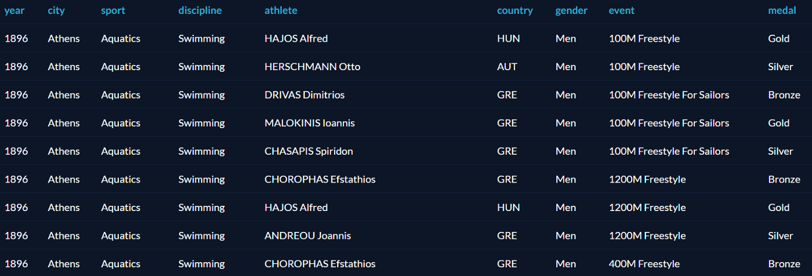
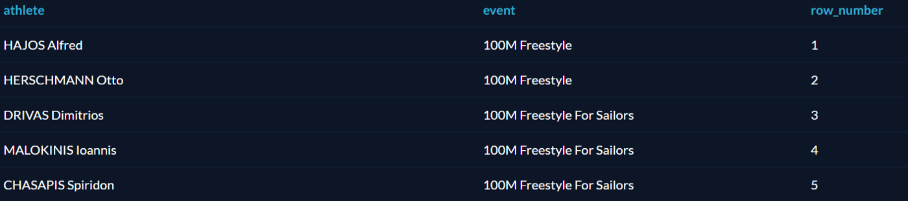
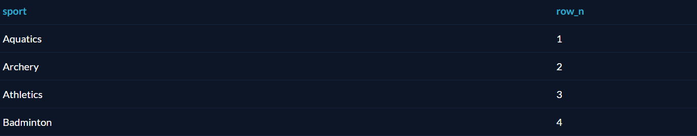
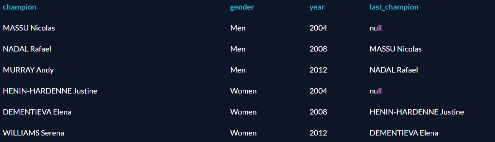
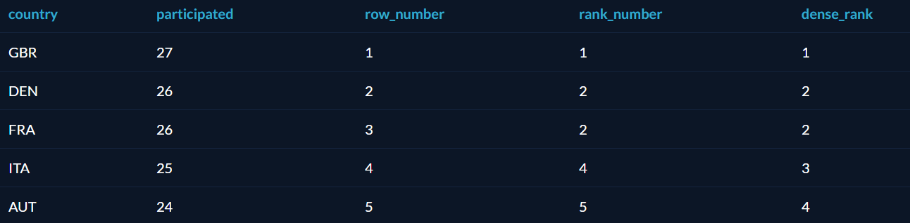

<!-- TOC -->
* [SQL](#sql)
  * [Какая разница между TRUNCATE TABLE table_name и DELETE FROM table_name?](#какая-разница-между-truncate-table-table_name-и-delete-from-table_name)
  * [Какая разница между типами CHAR и VARCHAR?](#какая-разница-между-типами-char-и-varchar)
  * [Какая разница между типами VARCHAR и NVARCHAR?](#какая-разница-между-типами-varchar-и-nvarchar)
  * [Какая разница между выражениями WHERE и HAVING?](#какая-разница-между-выражениями-where-и-having)
  * [Какие есть типы JOIN?](#какие-есть-типы-join)
  * [А что такое Self JOIN?](#а-что-такое-self-join)
  * [Какими бывают подстановочные знаки?](#какими-бывают-подстановочные-знаки)
  * [Для чего нужен оператор INSERT INTO SELECT?](#для-чего-нужен-оператор-insert-into-select)
  * [Что такое DDL?](#что-такое-ddl)
  * [Что такое DML?](#что-такое-dml)
  * [Про NULL в SQL](#про-null-в-sql)
  * [В чем разница между COUNT (*) и COUNT (столбец)?](#в-чем-разница-между-count--и-count-столбец)
  * [Для чего нужны операторы UNION, INTERSECT, EXCEPT?](#для-чего-нужны-операторы-union-intersect-except)
  * [Что делает функция EXISTS?](#что-делает-функция-exists)
  * [Как найти дубли в поле email?](#как-найти-дубли-в-поле-email)
  * [Выберите только уникальные имена](#выберите-только-уникальные-имена)
  * [Замените в таблице зарплату работника на 1000, если она равна 900, и на 1500 в остальных случаях](#замените-в-таблице-зарплату-работника-на-1000-если-она-равна-900-и-на-1500-в-остальных-случаях)
  * [При выборке из таблицы пользователей создайте поле, которое будет включать в себя и имена, и зарплату](#при-выборке-из-таблицы-пользователей-создайте-поле-которое-будет-включать-в-себя-и-имена-и-зарплату)
  * [Переименуйте таблицу](#переименуйте-таблицу)
  * [Использование оператора PIVOT.](#использование-оператора-pivot)
      * [Пример 1](#пример-1)
      * [Пример 2](#пример-2)
  * [Опишите разницу типов данных DATETIME и TIMESTAMP.](#опишите-разницу-типов-данных-datetime-и-timestamp)
  * [SQL индексы](#sql-индексы)
    * [Преимущества и Недостатки индексов](#преимущества-и-недостатки-индексов)
      * [Преимущества](#преимущества)
      * [Недостатки](#недостатки)
    * [Опишите различные типы индексов.](#опишите-различные-типы-индексов)
    * [В чем разница между кластеризованным и некластеризованным индексами в SQL?](#в-чем-разница-между-кластеризованным-и-некластеризованным-индексами-в-sql)
  * [Что такое нормализация и каковы ее преимущества?](#что-такое-нормализация-и-каковы-ее-преимущества)
  * [Первая нормальная форма](#первая-нормальная-форма)
  * [Вторая нормальная форма](#вторая-нормальная-форма)
  * [Третья нормальная форма](#третья-нормальная-форма)
  * [Нормальная форма Бойса-Кодда (НФБК) (частная форма третьей нормальной формы)](#нормальная-форма-бойса-кодда-нфбк-частная-форма-третьей-нормальной-формы)
      * [Тарифы](#тарифы)
      * [Бронирование](#бронирование)
  * [Что вы подразумеваете под денормализацией?](#что-вы-подразумеваете-под-денормализацией)
  * [Что вы подразумеваете под «триггером» в SQL?](#что-вы-подразумеваете-под-триггером-в-sql)
  * [Какие бывают типы подзапросов?](#какие-бывают-типы-подзапросов)
  * [Оконные функции](#оконные-функции)
      * [Почему не GROUP BY и не JOIN](#почему-не-group-by-и-не-join)
      * [Для начала](#для-начала)
      * [ROW_NUMBER и ORDER BY](#row_number-и-order-by)
      * [PARTITION BY и LAG, LEAD и RANK](#partition-by-и-lag-lead-и-rank)
      * [LAG](#lag)
      * [LEAD](#lead)
      * [RANK](#rank)
  * [Что такое VIEW (представление)?](#что-такое-view-представление)
  * [Команда CREATE VIEW](#команда-create-view)
  * [Модифицирование View](#модифицирование-view)
  * [Именование столбцов](#именование-столбцов)
  * [Групповые View](#групповые-view)
  * [Представления и подзапросы](#представления-и-подзапросы)
  * [Что не могут VIEW](#что-не-могут-view)
  * [Удаление VIEW](#удаление-view)
  * [Полезные ссылки](#полезные-ссылки)
<!-- TOC -->

# SQL

## Какая разница между TRUNCATE TABLE table_name и DELETE FROM table_name?

Фактически обе эти команды вызовут удаление всех строк из таблицы под названием `table_name`, но вот произойдет это совсем по-разному:

1. При вызове команды `TRUNCATE` таблица полностью сбрасывается и создается снова, в то время как команда `DELETE` удаляет каждую строку таблицы по отдельности. 
Из-за этого `TRUNCATE` отрабатывает значительно быстрее.
2. Как следствие первого пункта, команда `TRUNCATE` не вызывает срабатывание триггеров и правил внешних ключей, то есть, очищая таблицу таким способом, можно не 
бояться каскадного удаления или изменения данных в других таблицах.
3. В отличие от `DELETE` команда `TRUNCATE` не транзакционная. То есть, если в момент ее вызова, таблица `table_name` будет заблокирована какой-либо транзакцией — 
может возникнуть ошибка.

## Какая разница между типами CHAR и VARCHAR?

Оба эти типа используются для хранения текстовой информации ограниченной длины, а различия между ними следующие:

- Тип `CHAR` хранит значение фиксированной длины. Если строка, помещаемая в колонку данного типа, имеет меньшую длину, чем длина типа — строка будет дополнена
пробелами. Например, если в колонку типа `CHAR(10)` записать строку `SQL`, то она сохранится как `SQL       `.
- Тип `VARCHAR` хранит значение переменной длины. Под каждое значение этого типа выделяется столько памяти, сколько нужно для этого конкретного значения.

Для типа `CHAR` используется статическое распределение памяти, из-за чего операции с ним быстрее, чем с `VARCHAR`.

Таким образом, тип `CHAR` подходит для хранения строковых данных фиксированной длины (например, инвентарных номеров, хешей), а для остальных строк больше подойдут 
`VARCHAR` или `NVARCHAR`.

## Какая разница между типами VARCHAR и NVARCHAR?

- Тип `NVARCHAR`, пожалуй, самый универсальный из строчных типов данных в БД. Он позволяет хранить строки переменной длины в формате `Unicode`. В этом формате 
каждый символ занимает `2 байта`, а сама кодировка содержит `65 536` символов и включает в себя все языки мира, в том числе иероглифы.
- Тип `VARCHAR` хранит данные в формате `ASCII`. В этом формате каждый символ занимает `1 байт`, но отельная кодировка содержит всего `256` символов. Из-за этого
для каждого мирового языка выделяется своя кодировка.

Таким образом, в формате `VARCHAR` стоит хранить строчные данные, которые точно не придется переводить (например, адреса электронной почты). Для других случаев
больше подойдет `NVARCHAR`.

## Какая разница между выражениями WHERE и HAVING?

Вопрос, который задают практически на каждом собеседовании по базам данных: про `HAVING`.

Выражения `WHERE` и `HAVING` используются для фильтрации результата запроса и ожидают после себя некоторое условие, по которому нужно отфильтровать данные. Но, если 
`WHERE` работает само по себе и фильтрует данные каждой строки результата по отдельности и срабатывает еще до того, как будет получен результат операции, то 
выражение `HAVING` имеет смысл только в сочетании с выражением `GROUP BY` и фильтрует уже сгруппированные значения.

## Какие есть типы JOIN?

Чтобы объединить две таблицы в одну, следует использовать оператор `JOIN`. Соединение таблиц может быть внутренним (`INNER`) или внешним (`OUTER`), причём внешнее 
соединение может быть левым (`LEFT`), правым (`RIGHT`) или полным (`FULL`).

- `INNER JOIN` — получение записей с одинаковыми значениями в обеих таблицах, т.е. получение пересечения таблиц.
- `FULL OUTER JOIN` — объединяет записи из обеих таблиц (если условие объединения равно `true`) и дополняет их всеми записями из обеих таблиц, которые не имеют 
совпадений. Для записей, которые не имеют совпадений из другой таблицы, недостающее поле будет иметь значение `NULL`.
- `LEFT JOIN` — возвращает все записи, удовлетворяющие условию объединения, плюс все оставшиеся записи из внешней (левой) таблицы, которые не удовлетворяют условию 
объединения.
`RIGHT JOIN` — работает точно так же, как и левое объединение, только в качестве внешней таблицы будет использоваться правая.


Рассмотрим пример соединения SQL таблиц с использованием INNER JOIN. Следующий запрос выбирает все заказы с информацией о клиенте:

```sql
SELECT Orders.OrderID, Customers.CustomerName
FROM Orders
INNER JOIN Customers ON Orders.CustomerID = Customers.CustomerID;
```

## А что такое Self JOIN?

Такой вопрос тоже может прозвучать на собеседовании по `SQL`. Это выражение используется для того, чтобы таблица объединилась сама с собой, словно это две разные 
таблицы. Чтобы такое реализовать, одна из таких «таблиц» временно переименовывается.

Например, следующий `SQL-запрос` объединяет клиентов из одного города:

```sql
SELECT A.CustomerName AS CustomerName1, B.CustomerName AS CustomerName2, A.City
FROM Customers A, Customers B
WHERE A.CustomerID <> B.CustomerID
AND A.City = B.City
ORDER BY A.City;
```

## Какими бывают подстановочные знаки?

- `%` — заменить ноль или более символов;
- `_` — заменить один символ.

Данный запрос позволяет найти данные всех пользователей, имена которых содержат в себе `test`:

```sql
SELECT * FROM user WHERE name LIKE '%test%';
```

А в этом случае имена искомых пользователей начинаются на `t`, после содержат какой-либо символ и `est` в конце.

```sql
SELECT * FROM user WHERE name LIKE 't_est';
```

## Для чего нужен оператор INSERT INTO SELECT?

Данный оператор копирует данные из одной таблицы и вставляет их в другую, при этом типы данных в обеих таблицах должны соответствовать.

Пример использования:

```sql
INSERT INTO second_table
SELECT * FROM first_table
WHERE condition;
```

## Что такое DDL?

`DDL(Data Definition Language)` - Команды определения структуры данных. В состав `DDL-группы` входят команды, позволяющие определять внутреннюю структуру базы 
данных. Перед тем, как сохранять данные в БД, необходимо создать в ней таблицы и, возможно, некоторые другие сопутствующие объекты. Пример некоторых команд:

```sql
CREATE TABLE users;
DROP TABLE users;
```

## Что такое DML?

`DML(Data Manipulation Language)` - Команды манипулирования данными. `DML-группа` содержит команды, позволяющие вносить, изменять, удалять и извлекать данные из 
таблиц. Пример некоторых команд:

```sql
SELECT * FROM users;
DELETE * FROM users;
```

## Про NULL в SQL

Необходимо отметить, что язык `SQL`, в отличие от языков программирования, имеет встроенные средства поддержки факта отсутствия каких-либо данных. 
Осуществляется это с помощью `NULL-концепции`. `NULL` не является каким-то фиксированным значением, хранящимся в поле записи вместо реальных данных. Значение 
`NULL` не имеет определенного типа. `NULL` — это индикатор, говорящий пользователю (и `SQL`) о том, что данные в поле записи отсутствуют. Поэтому его нельзя 
использовать в операциях сравнения. Для проверки факта наличия-отсутствия данных в `SQL` введены специальные выражения.

## В чем разница между COUNT (*) и COUNT (столбец)?

Форма `COUNT(столбец)` подсчитывает количество значений в "столбце". При подсчете количества значений столбца эта форма функции `COUNT` не принимает во внимание
значение `NULL`. функция `COUNT(*)` подсчитывает количество строк в таблице, не игнорируя значение `NULL`, поскольку эта функция оперирует строками, а не столбцами.

## Для чего нужны операторы UNION, INTERSECT, EXCEPT?

- Оператор `UNION` - применяется для объединения результатов двух `SQL`-запросов в единую таблицу, состоящую из похожих срок. Оба запроса должны возвращать 
одинаковое число столбцов и совместимые типы данных в соответствующих столбцах.
- Оператор `INTERSECT` - используется для нахождения пересечения двух множеств. Результатом его выполнения будет множество строк, которые присутствуют в обоих 
множествах.
- Оператор `EXCEPT` - используется для нахождения разности двух множеств. Результатом выполнения является множество строк из множества 1, которые отсутствуют в 
множестве 2.

## Что делает функция EXISTS?

Аргументом функции `EXISTS` есть внутренний запрос. Она возвращает истину, если запрос возвращает один или более строк, и возвращает ложь если запрос вернет ноль 
строк.

## Как найти дубли в поле email?

```sql
SELECT email, COUNT(email)
FROM customers
GROUP BY email
HAVING COUNT(email) > 1;
```

Функция `COUNT(email)` возвращает количество строк из поля `email`. Оператор `HAVING` работает почти так же, как и `WHERE`, вот только применяется не для всех
столбцов, а для набора, созданного оператором `GROUP BY`.

## Выберите только уникальные имена

`SELECT DISTINCT` возвращает разные значения, даже если в выбранном столбце есть дубли.

```sql
SELECT DISTINCT name FROM users;
```

## Замените в таблице зарплату работника на 1000, если она равна 900, и на 1500 в остальных случаях

Замена значений — одна из наиболее часто встречаемых задач по `SQL` на собеседованиях. Решить её несложно:

```sql
UPDATE table SET salary =
CASE
WHEN salary = 900 THEN 1000
ELSE 1500
END;
```

Оператор `UPDATE` используется для изменения существующих записей. Но ответы на подобные вопросы с собеседований по `SQL` должны быть более развёрнутыми. 
Уточните,что после `UPDATE` следует указать, какие записи должны быть обновлены. В противном случае обновятся все записи в таблице.

В нашем примере условие задаётся через оператор `CASE`: если текущая зарплата равна 900, изменяем её на 1000, в остальных случаях — на 1500.

## При выборке из таблицы пользователей создайте поле, которое будет включать в себя и имена, и зарплату

Функция `CONCAT()` используется для конкатенации (объединения) строк, неявно преобразуя при этом любые типы данных в строки.

```sql
SELECT CONCAT(name, salary) AS new_field FROM users;
```

## Переименуйте таблицу

С помощью оператора `ALTER TABLE` можно добавлять, удалять, изменять столбцы, а также изменять название таблицы.

```sql
ALTER TABLE first_table RENAME second_table;
```

## Использование оператора PIVOT.

Реляционный оператор `PIVOT` можно использовать для изменения возвращающего табличное значение выражения в другой таблице. Оператор `PIVOT` разворачивает 
возвращающее табличное значение выражение, преобразуя уникальные значения одного столбца выражения в несколько выходных столбцов, а также, в случае 
необходимости, объединяет оставшиеся повторяющиеся значения столбца и отображает их в выходных данных.

#### Пример 1

Для каждого производителя из таблицы `Product` определить число моделей каждого типа продукции.

```sql
SELECT maker,
SUM(CASE type WHEN 'pc' THEN 1 ELSE 0 END) PC, 
SUM(CASE type WHEN 'laptop' THEN 1 ELSE 0 END) Laptop, 
SUM(CASE type WHEN 'printer' THEN 1 ELSE 0 END) Printer
FROM Product
GROUP BY maker;
```

Теперь через `PIVOT`

```sql
SELECT maker, -- столбец (столбцы), значения из которого формируют заголовки строк
[pc], [laptop], [printer] -- значения из столбца, который указан в предложении type, формирующие заголовки столбцов 
FROM Product -- здесь может быть подзапрос
PIVOT -- формирование пивот-таблицы
(COUNT(model) -- агрегатная функция, формирующая содержимое сводной таблицы
FOR type -- указывается столбец, уникальные значения в котором будут являться заголовками столбцов
IN([pc], [laptop], [printer]) --указываются конкретные значения в столбце type, которые следует использовать в качестве заголовков, т.к. нам могут 
потребоваться не все
) pvt ;-- алиас для сводной таблицы
```

#### Пример 2

Посчитать среднюю цену на ноутбуки в зависимости от размера экрана.

```sql
SELECT screen, AVG(price) avg_ 
FROM Laptop 
GROUP BY screen;
```

|screen|avg_|
|------|----|
|11    |700 |
|12    |960 |
|14    |1175|
|15    |1050|

Теперь через `PIVOT`

```sql
SELECT [avg_],
 [11],[12],[14],[15]
 FROM (SELECT 'average price' AS 'avg_', screen, price FROM Laptop) x
 PIVOT
 (AVG(price)
 FOR screen
 IN([11],[12],[14],[15])
 ) pvt;
```

|avg_         |11 |12 |14  |15  |
|-------------|---|---|----|----|
|average price|700|960|1175|1050|

## Опишите разницу типов данных DATETIME и TIMESTAMP.

- `DATETIME` предназначен для хранения целого числа: `YYYYMMDDHHMMSS`. И это время не зависит от временной зоны настроенной на сервере. `Хранит: 8 байт`. 
- `TIMESTAMP`  хранит значение равное количеству секунд, прошедших с полуночи `1 января 1970 года` по усреднённому времени Гринвича. При получении из базы 
отображается с учётом часового пояса. `Хранит: 4 байта`.

## SQL индексы

Индексы относятся к методу настройки производительности, позволяющему быстрее извлекать записи из таблицы. Индекс создает отдельную структуру для индексируемого 
поля и, следовательно, позволяет быстрее получать данные.

### Преимущества и Недостатки индексов

При добавлении новых индексов следует иметь в виду некоторые нюансы.

#### Преимущества
- очевидно что индексы увеличивают (в большинстве случаев) скорость извлечения данных, при выборке по индексированным полям (колонкам)

#### Недостатки
- **замедляет** мутабельные операции (вставку, обновление и удаление), потому что механизм базы данных должен записывать не только данные, но и индекс
- для индекса нужно **место** на жестком диске и (что гораздо важнее) в оперативной памяти. Индекс, который не может храниться в оперативной памяти, довольно бесполезен.
- индекс столбца всего с несколькими вариантами разных значений не ускоряет выборку, потому что он не может отсортировать большое количество строк (например, столбец «пол», который обычно имеет только два разных значения — мужской, женский).

### Опишите различные типы индексов.

Есть три типа индексов, а именно:

- `Уникальный индекс (Unique Index)`: этот индекс не позволяет полю иметь повторяющиеся значения, если столбец индексируется уникально. Если первичный ключ 
определен, уникальный индекс может быть применен автоматически.
- `Кластеризованный индекс (Clustered Index)`: этот индекс меняет физический порядок таблицы и выполняет поиск на основе значений ключа. Каждая таблица может иметь 
только один кластеризованный индекс.
- `Некластеризованный индекс (Non-Clustered Index)`: не изменяет физический порядок таблицы и поддерживает логический порядок данных. Каждая таблица может иметь 
много некластеризованных индексов.

### В чем разница между кластеризованным и некластеризованным индексами в SQL?

- Кластерный индекс используется для простого и быстрого извлечения данных из базы данных, тогда как чтение из некластеризованного индекса происходит относительно
  медленнее.
- Кластеризованный индекс изменяет способ хранения записей в базе данных — он сортирует строки по столбцу, который установлен как кластеризованный индекс, тогда
  как в некластеризованном индексе он не меняет способ хранения, но создает отдельный объект внутри таблицы, который указывает на исходные строки таблицы при поиске.
- Одна таблица может иметь только один кластеризованный индекс, тогда как некластеризованных у нее может быть много.

## Что такое нормализация и каковы ее преимущества?

`Нормализация` — процесс организации данных, цель которого избежать дублирования и избыточности. Некоторые из преимуществ:

- Лучшая организация базы данных
- Больше таблиц с небольшими строками
- Эффективный доступ к данным
- Большая гибкость для запросов
- Быстрый поиск информации
- Проще реализовать безопасность данных
- Позволяет легко модифицировать
- Сокращение избыточных и дублирующихся данных
- Более компактная база данных
- Обеспечивает согласованность данных после внесения изменений

## Первая нормальная форма

Отношение находится в `1НФ`, если все его атрибуты являются простыми, все используемые домены должны содержать только скалярные значения. Не должно быть повторений 
строк в таблице.

Например, есть таблица `Автомобили`:

|Фирма |Модели     |
|------|-----------|
|BMW   |M5, X5M, M1|
|Nissan|GT-R       |

Нарушение нормализации `1НФ` происходит в моделях `BMW`, т.к. в одной ячейке содержится список из 3 элементов: `M5, X5M, M1`, т.е. он не является атомарным. 
Преобразуем таблицу к `1НФ`:

|Фирма |Модели|
|------|------|
|BMW   |M5    |
|BMW   |X5M   |
|BMW   |M1    |
|Nissan|GT-R  |

## Вторая нормальная форма

Отношение находится во `2НФ`, если оно находится в `1НФ` и каждый не ключевой атрибут неприводимо зависит от Первичного Ключа(ПК).

Неприводимость означает, что в составе потенциального ключа отсутствует меньшее подмножество атрибутов, от которого можно также вывести данную функциональную 
зависимость.

Например, дана таблица:

|Модель|Фирма |Цена   |Скидка|
|------|------|-------|------|
|M5    |BMW   |500000 |5%    |
|X5M   |BMW   |6000000|5%    |
|M1    |BMW   |2500000|5%    |
|GT-R  |Nissan|5000000|10%   |

Таблица находится в первой нормальной форме, но не во второй. Цена машины зависит от модели и фирмы. Скидка зависят от фирмы, то есть зависимость от первичного 
ключа неполная. Исправляется это путем декомпозиции на два отношения, в которых не ключевые атрибуты зависят от ПК.

|Модель|Фирма |Цена   |
|------|------|-------|
|M5    |BMW   |5500000|
|X5M   |BMW   |6000000|
|M1    |BMW   |2500000|
|GT-R  |Nissan|5000000|

|Фирма |Скидка|
|------|------|
|BMW   |5%    |
|Nissan|10%   |

## Третья нормальная форма

Отношение находится в `3НФ`, когда находится во `2НФ` и каждый не ключевой атрибут нетранзитивно зависит от первичного ключа. Проще говоря, второе правило требует 
выносить все не ключевые поля, содержимое которых может относиться к нескольким записям таблицы в отдельные таблицы.

Рассмотрим таблицу:

|Модель|Магазин	  |Телефон |
|------|----------|--------|
|BMW	 |Риал-авто	|87-33-98|
|Audi	 |Риал-авто	|87-33-98|
|Nissan|Некст-Авто|94-54-12|

Таблица находится во `2НФ`, но не в `3НФ`.
В отношении атрибут `Модель` является первичным ключом. Личных телефонов у автомобилей нет, и телефон зависит исключительно от магазина.
Таким образом, в отношении существуют следующие функциональные зависимости: `Модель → Магазин`, `Магазин → Телефон`, `Модель → Телефон`.
Зависимость `Модель → Телефон` является транзитивной, следовательно, отношение не находится в `3НФ`.
В результате разделения исходного отношения получаются два отношения, находящиеся в `3НФ`:

|Магазин	 |Телефон |
|----------|--------|
|Риал-авто |87-33-98|
|Некст-Авто|94-54-12|

|Модель|Магазин   |
|------|----------|
|BMW	 |Риал-авто |
|Audi	 |Риал-авто |
|Nissan|Некст-Авто|

## Нормальная форма Бойса-Кодда (НФБК) (частная форма третьей нормальной формы)

Определение `3НФ` не совсем подходит для следующих отношений:
- отношение имеет два или более потенциальных ключа;
- два и более потенциальных ключа являются составными;
- они пересекаются, т.е. имеют хотя бы один общий атрибут.

Для отношений, имеющих один первичный ключ, `НФБК` является `3НФ`.

Отношение находится в `НФБК`, когда каждая нетривиальная и неприводимая слева функциональная зависимость обладает потенциальным ключом в качестве детерминанта.

Предположим, рассматривается отношение, представляющее данные о бронировании стоянки на день:

|Номер стоянки|Время начала|Время окончания|Тариф     |
|-------------|------------|---------------|----------|
|1	          |09:30	     |10:30	         |Бережливый|
|1	          |11:00	     |12:00	         |Бережливый|
|1	          |14:00	     |15:30	         |Стандарт  |
|2	          |10:00	     |12:00	         |Премиум-В |
|2	          |12:00	     |14:00	         |Премиум-В |
|2	          |15:00	     |18:00	         |Премиум-А |

Тариф имеет уникальное название и зависит от выбранной стоянки и наличия льгот, в частности:

- `Бережливый`: стоянка 1 для льготников
- `Стандарт`: стоянка 1 для не льготников
- `Премиум-А`: стоянка 2 для льготников
- `Премиум-B`: стоянка 2 для не льготников.

Таким образом, возможны следующие составные первичные ключи: `{Номер стоянки, Время начала}`, `{Номер стоянки, Время окончания}`, `{Тариф, Время начала}`, 
`{Тариф, Время окончания}`.

Отношение находится в `3НФ`. Требования второй нормальной формы выполняются, так как все атрибуты входят в какой-то из потенциальных ключей, а неключевых атрибутов 
в отношении нет. Также нет и транзитивных зависимостей, что соответствует требованиям третьей нормальной формы. Тем не менее, существует функциональная зависимость 
`Тариф → Номер стоянки`, в которой левая часть (детерминант) не является потенциальным ключом отношения, то есть отношение не находится в нормальной форме Бойса — 
Кодда.

Недостатком данной структуры является то, что, например, по ошибке можно приписать тариф «Бережливый» к бронированию второй стоянки, хотя он может относиться 
только к первой стоянке.

Можно улучшить структуру с помощью декомпозиции отношения на два и добавления атрибута `Имеет льготы`, получив отношения, удовлетворяющие `НФБК` (подчёркнуты 
атрибуты, входящие в первичный ключ.):

#### Тарифы

|Тариф     |Номер стоянки|Имеет льготы|
|----------|-------------|------------|
|Бережливый|1            |Да          |
|Стандарт  |1 	         |Нет         |
|Премиум-А |2	           |Да          |
|Премиум-В |2	           |Нет         |

#### Бронирование

|Тариф	   |Время начала|Время окончания|
|----------|------------|---------------|
|Бережливый|09:30	      |10:30          |
|Бережливый|11:00       |12:00          |
|Стандарт	 |14:00	      |15:30          |
|Премиум-В |10:00	      |12:00          |
|Премиум-В |12:00	      |14:00          |
|Премиум-А |15:00	      |18:00          |


## Что вы подразумеваете под денормализацией?

`Денормализация` — техника, которая используется для преобразования из высших к низшим нормальным формам. Она помогает разработчикам баз данных повысить 
производительность всей инфраструктуры, поскольку вносит избыточность в таблицу. Она добавляет избыточные данные в таблицу, учитывая частые запросы к базе данных,
которые объединяют данные из разных таблиц в одну.

## Что вы подразумеваете под «триггером» в SQL?

`Триггер в SQL` — особый тип хранимых процедур, которые предназначены для автоматического выполнения в момент или после изменения данных. Это позволяет вам 
выполнить пакет кода, когда вставка, обновление или любой другой запрос выполняется к определенной таблице.

## Какие бывают типы подзапросов?

Существует два типа подзапросов, а именно: коррелированные и некоррелированные.

- `Коррелированный подзапрос`: это запрос, который выбирает данные из таблицы со ссылкой на внешний запрос. Он не считается независимым запросом, поскольку 
ссылается на другую таблицу или столбец в таблице.
- `Некоррелированный подзапрос`: этот запрос является независимым запросом, в котором выходные данные подзапроса подставляются в основной запрос.

## Оконные функции

#### Почему не GROUP BY и не JOIN

Сразу проясним, что оконные функции — это не то же самое, что `GROUP BY`. 
- Они не уменьшают количество строк, а возвращают столько же значений, сколько получили на вход. 
- Во-вторых, в отличие от `GROUP BY`, `OVER` может обращаться к другим строкам. 
- В-третьих, они могут считать скользящие средние и кумулятивные суммы.

Оконные функции не изменяют выборку, а только добавляют некоторую дополнительную информацию о ней. Для простоты понимания можно считать, что `SQL` сначала 
выполняет весь запрос (кроме сортировки и `limit`), а уже потом считает значения окна.

Окей, с `GROUP BY` разобрались. Но в `SQL` практически всегда можно пойти несколькими путями. К примеру, может возникнуть желание использовать подзапросы или 
`JOIN`. Конечно, `JOIN` по производительности предпочтительнее подзапросов, а производительность конструкций `JOIN` и `OVER` окажется одинаковой. Но `OVER` даёт 
больше свободы, чем жёсткий `JOIN`. Да и объём кода в итоге окажется гораздо меньше.

#### Для начала

Оконные функции начинаются с оператора `OVER` и настраиваются с помощью трёх других операторов: `PARTITION BY`, `ORDER BY` и `ROWS`. Про `ORDER BY`, `PARTITION BY` 
и его вспомогательные операторы `LAG`, `LEAD`, `RANK` мы расскажем подробнее.

Все примеры будут основаны на датасете олимпийских медалистов от `Datacamp`. Таблица называется `summer_medals` и содержит результаты Олимпиад с 1896 по 2010: 



#### ROW_NUMBER и ORDER BY

Как уже говорилось выше, оператор `OVER` создаёт оконную функцию. Начнём с простой функции `ROW_NUMBER`, которая присваивает номер каждой выбранной записи:

```sql
SELECT athlete, event, ROW_NUMBER() OVER() AS row_number
FROM Summer_Medals
ORDER BY row_number ASC;
```



Каждая пара `спортсмен — вид спорта` получила номер, причём к этим номерам можно обращаться по имени `row_number`.
`ROW_NUMBER` можно объединить с `ORDER BY`, чтобы определить, в каком порядке строки будут нумероваться. Выберем с помощью `DISTINCT` все имеющиеся виды спорта и 
пронумеруем их в алфавитном порядке:

```sql
SELECT sport, ROW_NUMBER() OVER(ORDER BY sport ASC) AS Row_N
FROM (
  SELECT DISTINCT sport
  FROM Summer_Medals
) AS sports
ORDER BY sport ASC;
```



#### PARTITION BY и LAG, LEAD и RANK

`PARTITION BY` позволяет сгруппировать строки по значению определённого столбца. Это полезно, если данные логически делятся на какие-то категории и нужно что-то 
сделать с данной строкой с учётом других строк той же группы (скажем, сравнить теннисиста с остальными теннисистами, но не с бегунами или пловцами). Этот оператор 
работает только с оконными функциями типа `LAG`, `LEAD`, `RANK` и т. д.

#### LAG

Функция `LAG` берёт строку и возвращает ту, которая шла перед ней. Например, мы хотим найти всех олимпийских чемпионов по теннису (мужчин и женщин отдельно), 
начиная с 2004 года, и для каждого из них выяснить, кто был предыдущим чемпионом.

Решение этой задачи требует нескольких шагов. Сначала надо создать табличное выражение, которое сохранит результат запроса «чемпионы по теннису с 2004 года» как 
временную именованную структуру для дальнейшего анализа. А затем разделить их по полу и выбрать предыдущего чемпиона с помощью `LAG`:

– Табличное выражение ищет теннисных чемпионов и выбирает нужные столбцы
```sql
WITH Tennis_Gold AS (
  SELECT Athlete, Gender, Year, Country
    FROM Summer_Medals
    WHERE Year >= 2004 AND Sport = 'Tennis' AND event = 'Singles' AND Medal = 'Gold'
)
```

– Оконная функция разделяет по полу и берёт чемпиона из предыдущей строки
```sql
SELECT Athlete as Champion, Gender, Year, LAG(Athlete) OVER (PARTITION BY gender ORDER BY Year ASC) AS Last_Champion
FROM Tennis_Gold
ORDER BY Gender ASC, Year ASC;
```



Функция `PARTITION BY` в таблице вернула сначала всех мужчин, потом всех женщин. Для победителей `2008` и `2012` года приведён предыдущий чемпион; так как данные 
есть только за 3 олимпиады, у чемпионов `2004` года нет предшественников, поэтому в соответствующих полях стоит `null`.

#### LEAD

Функция `LEAD` похожа на `LAG`, но вместо предыдущей строки возвращает следующую. Можно узнать, кто стал следующим чемпионом после того или иного спортсмена:

– Табличное выражение ищет теннисных чемпионов и выбирает нужные столбцы
```sql
WITH Tennis_Gold AS (
  SELECT Athlete, Gender, Year, Country
  FROM Summer_Medals
  WHERE Year >= 2004 AND Sport = 'Tennis' AND event = 'Singles' AND Medal = 'Gold'
)
```

– Оконная функция разделяет по полу и берёт чемпиона из следующей строки
```sql
SELECT Athlete as Champion, Gender, Year, LEAD(Athlete) OVER (PARTITION BY gender ORDER BY Year ASC) AS Future_Champion
FROM Tennis_Gold
ORDER BY Gender ASC, Year ASC;
```


#### RANK

Оператор `RANK` похож на `ROW_NUMBER`, но присваивает одинаковые номера строкам с одинаковыми значениями, а «лишние» номера пропускает. Есть также `DENSE_RANK`, 
который не пропускает номеров. Звучит запутанно, так что проще показать на примере. Вот ранжирование стран по числу олимпиад, в которых они участвовали, разными 
операторами:



- `Row_number` — ничего интересного, строки просто пронумерованы по возрастанию.
- `Rank_number` — строки ранжированы по возрастанию, но нет номера 3. Вместо этого, 2 строки делят номер 2, а за ними сразу идёт номер 4.
- `Dense_rank` — то же самое, что и `rank_number`, но номер 3 не пропущен. Номера идут подряд, но зато никто не оказался пятым из пяти.

-- Табличное выражение выбирает страны и считает годы
```sql
WITH countries AS (
  SELECT Country, COUNT(DISTINCT year) AS participated 
  FROM Summer_Medals
  WHERE Country in ('GBR', 'DEN', 'FRA', 'ITA','AUT') 
  GROUP BY Country
)
```

-- Разные оконные функции ранжируют страны
```sql
SELECT
  Country,
  participated,
  ROW_NUMBER() OVER(ORDER BY participated DESC) AS Row_Number,
  RANK() OVER(ORDER BY participated DESC) AS Rank_Number,
  DENSE_RANK() OVER(ORDER BY participated DESC) AS Dense_Rank
FROM countries
ORDER BY participated DESC;
```

## Что такое VIEW (представление)?

Типы таблиц, с которыми вы имели дело до сих пор, назывались - `базовыми таблицами`. Это - таблицы, которые содержат данные. Однако имеется другой вид таблиц: - 
представления. `Представления` - это таблицы чье содержание выбирается или получается из других таблиц. Они работают в запросах и операторах `DML` точно также как 
и основные таблицы, но не содержат никаких собственных данных. `Представления` - подобны окнам, через которые вы просматриваете информацию (как она есть, или в 
другой форме, как вы потом увидите), которая фактически хранится в базовой таблице. Представление - это фактически запрос, который выполняется всякий раз, когда 
представление становится темой команды. Вывод запроса при этом в каждый момент становится содержанием представления.

## Команда CREATE VIEW
Вы создаете представление командой `CREATE VIEW`. Она состоит из слов `CREATE VIEW`, имени представления которое нужно создать, слова `AS`, и далее запроса, как в 
следующем примере:

```sql
       CREATE VIEW Londonstaff
          AS SELECT *
          FROM Salespeople
          WHERE city = 'London';
```

Теперь Вы имеете представление, называемое `Londonstaff`. Вы можете использовать это представление точно так же как и любую другую таблицу. Она может быть 
запрошена, модифицирована, вставлена в, удалена из, и соединена с, другими таблицами и представлениями. Давайте сделаем запрос такого представления.

```sql
SELECT * FROM Londonstaff;

         ===============  SQL Execution Log ============
        |                                               |
        | SELECT *                                      |
        | FROM  Londonstaff;                            |
        |                                               |
        | ==============================================|
        |   snum      sname         city         comm   |
        | ------    ----------   -----------   -------  |
        |   1001      Peel         London       0.1200  |
        |   1004      Motika       London       0.1100  |
        |                                               |
         ===============================================
```

Когда вы приказываете `SQL` выбрать все строки из представления, он выполняет запрос содержащий в определении - `Londonstaff`, и возвращает все из его вывода. Имея 
предикат в запросе представления, можно вывести только те строки из представления, которые будут удовлетворять этому предикату. Преимущество использования 
представления, по сравнению с основной таблицы, в том, что представление будет модифицировано автоматически всякий раз, когда таблица лежащая в его основе 
изменяется. Содержание представления не фиксировано, и переназначается каждый раз когда вы ссылаетесь на представление в команде. Если вы добавите завтра другого, 
живущего в Лондоне продавца, он автоматически появится в представлении.

Представления значительно расширяют управление вашими данными. Это - превосходный способ дать публичный доступ к некоторой, но не всей информации в таблице. Если 
вы хотите чтобы ваш продавец был показан в таблице Продавцов, но при этом не были показаны комиссии других продавцов, вы могли бы создать представление с 
использованием следующего оператора:

```sql
CREATE VIEW Salesown AS SELECT snum, sname, city FROM Salespeople:

             ===============  SQL Execution Log ============
            |                                               |
            | SELECT *                                      |
            | FROM  Salesown;                               |
            |                                               |
            | ==============================================|
            |   snum      sname         city                |
            | ------    ----------   -----------            |
            |   1001      Peel         London               |
            |   1002      Serres       San Jose             |
            |   1004      Motika       London               |
            |   1007      Rifkin       Barcelona            |
            |   1003      Axelrod      New York             |
             ===============================================
```

Другими словами, это представление - такое же как для таблицы Продавцов, за исключением того, что поле `comm`, не упоминалось в запросе, и следовательно не было 
включено в представление.

## Модифицирование View

Представление может изменяться командами модификации `DML`, но модификация не будет воздействовать на само представление. Команды будут на самом деле 
перенаправлены к базовой таблице:

```sql
         UPDATE Salesown
            SET city = 'Palo Alto'
            WHERE snum = 1004;
```

Его действие идентично выполнению той же команды в таблице `Продавцов`. Однако, если значение комиссионных продавца будет обработано командой `UPDATE`

```sql
         UPDATE Salesown
            SET comm = .20
            WHERE snum = 1004;
```

она будет отвергнута, так как поле `comm` отсутствует в представлении `Salesown`. Это важное замечание, показывающее что не все представления могут быть 
модифицированы.

## Именование столбцов

В нашем примере, пол наших представлений имеют свои имена, полученные прямо из имен полей основной таблицы. Это удобно. Однако, иногда вам нужно снабжать ваши 
столбцы новыми именами:

- когда некоторые столбцы являются выводимыми, и поэтому не имеющими имен.
- когда два или более столбцов в объединении, имеют те же имена что в их базовой таблице.

Имена, которые могут стать именами полей, даются в круглых скобках, после имени таблиц. Они не будут запрошены, если совпадают с именами полей запрашиваемой 
таблицы. Тип данных и размер этих полей будут отличаться от запрашиваемых полей которые "передаются" в них. Обычно вы не указываете новых имен полей, но если вы 
все таки сделали это, вы должны делать это для каждого пол в представлении.

## Групповые View

`Групповые представления` - это представления, который содержит предложение `GROUP BY`, или который основывается на других групповых представлениях. Групповые 
представления могут стать превосходным способом обрабатывать полученную информацию непрерывно. Предположим, что каждый день вы должны следить за порядком номеров 
заказчиков, номерами продавцов принимающих порядки, номерами порядков, средним от порядков, и общей суммой приобретений в порядках.

Чем конструировать каждый раз сложный запрос, вы можете просто создать следующее представление:

```sql
   CREATE VIEW Totalforday
        AS SELECT odate, COUNT (DISTINCT cnum), COUNT
                (DISTINCT snum), COUNT (onum), AVG
                (amt), SUM (amt)
                FROM Orders
        GROUP BY odate;
```

Теперь вы сможете увидеть всю эту информацию с помощью простого запроса:

```sql
SELECT * FROM Totalforday;
```

Как мы видели, `SQL` запросы могут дать вам полный комплекс возможностей, так что представления обеспечивают вас чрезвычайно гибким и мощным инструментом чтобы 
определить точно, как ваши данные могут быть использованы. Они могут также делать вашу работу более простой, переформатируя данные удобным для вас способом и 
исключив двойную работу.

## Представления и подзапросы

`Представления` могут также использовать и подзапросы, включая соотнесенные подзапросы. Предположим ваша компания предусматривает премию для тех продавцов которые 
имеют заказчика с самым высоким порядком для любой указанной даты. Вы можете проследить эту информацию с помощью представления:

```sql
           CREATE VIEW Elitesalesforce
              AS SELECT b.odate, a.snum, a.sname,
                 FROM Salespeople a, Orders b
                 WHERE a.snum = b.snum
                   AND b.amt =
                     (SELECT MAX (amt)
                         FROM Orders c
                         WHERE c.odate = b.odate);
```

Если, с другой стороны, премия будет назначаться только продавцу который имел самый высокий порядок за последние десять лет, вам необходимо будет проследить их в 
другом представлении основанном на первом:

```sql
            CREATE VIEW Bonus
               AS SELECT DISTINCT snum, sname
                  FROM Elitesalesforce a
                  WHERE 10 <=
                     (SELECT COUNT (*)
                         FROM Elitesalestorce b
                         WHERE a.snum = b.snum);
```

Извлечение из этой таблицы продавца, который будет получать премию - выполняется простым вопросом:

```sql
SELECT * FROM Bonus;
```

Теперь мы видим истинную мощность `SQL`. В `SQL`, это - только вопрос из двух комплексных команд, сохраненных, как представление совместно с простым запросом. При 
самостоятельном запросе - мы должны заботится об этом каждый день, потому что информация которую извлекает запрос, непрерывно меняется чтобы отражать текущее 
состояние базы данных.

## Что не могут VIEW

Имеются большое количество типов представлений которые являются доступными только для чтения. Это означает, что их можно запрашивать, но они не могут подвергаться 
действиям команд модификации. Имеются также некоторые виды запросов, которые не допустимы в определениях представлений. Одиночное представление должно основываться 
на одиночном запросе; `UNION` и `UNION ALL` не разрешаются. `ORDER BY` никогда не используется в определении представлений. Вывод запроса формирует содержание 
представления, которое напоминает базовую таблицу и является - по определению - неупорядоченным.

## Удаление VIEW

Синтаксис удаления представления из базы данных подобен синтаксису удаления базовых таблиц:

```sql
DROP VIEW  <view name>
```

## Полезные ссылки

[27 распространённых вопросов по SQL - tproger](https://tproger.ru/articles/sql-interview-questions/)

[Вопросы по SQL - habr](https://habr.com/ru/company/otus/blog/461067/)

[Нормализация отношений. Шесть нормальных форм - habr](https://habr.com/ru/post/254773/)

[Оконные функции в SQL — что это и зачем они нужны - tproger](https://tproger.ru/translations/sql-window-functions/)

[Введение во VIEW - postgresql.men](https://postgresql.men/gruber/ch20.html)

[Оператор Pivot - sql-tutorial](http://www.sql-tutorial.ru/ru/book_operator_pivot.html)
