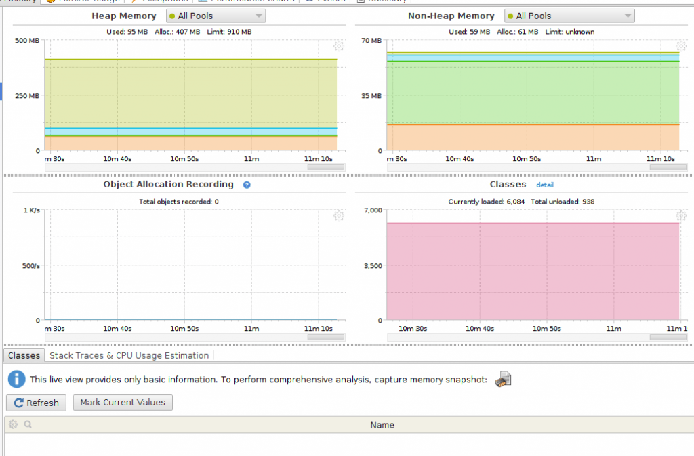
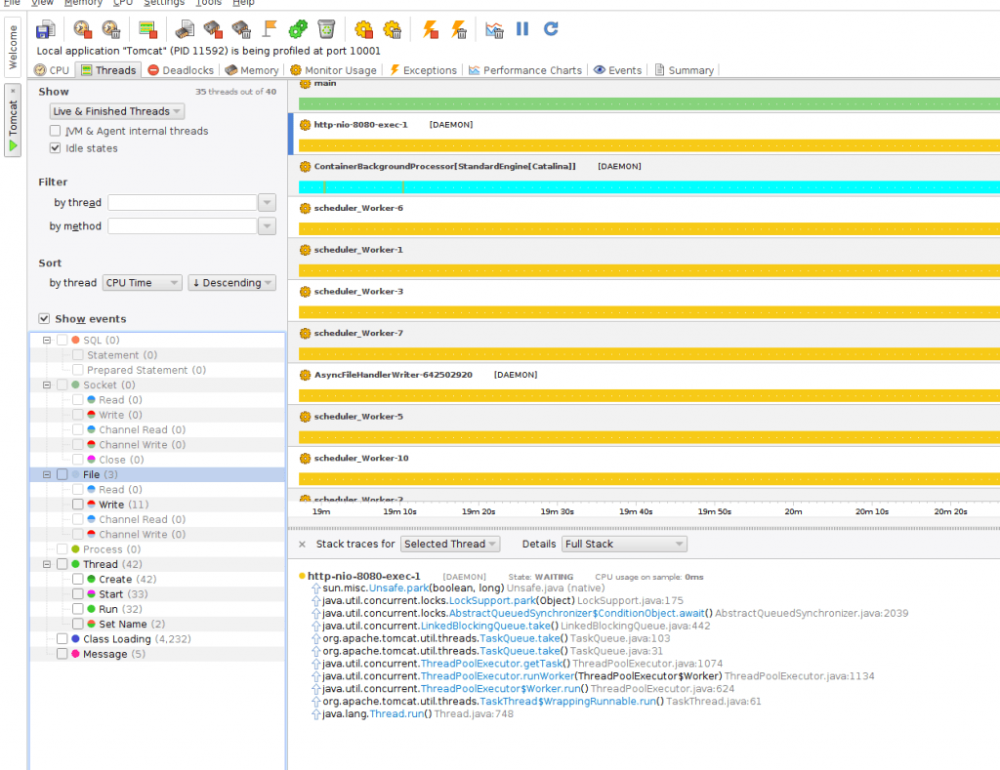

<!-- TOC -->
* [Profilers (Профилировщики)](#profilers-профилировщики)
* [JProfiler](#jprofiler)
  * [YourKit](#yourkit)
  * [Java VisualVM](#java-visualvm)
  * [JConsole](#jconsole)
      * [JDK поставляется с профайлером](#jdk-поставляется-с-профайлером)
      * [JConsole или VisualVM?](#jconsole-или-visualvm)
      * [Дистанционное подключение к процессам](#дистанционное-подключение-к-процессам)
      * [Отслеживание статистики](#отслеживание-статистики)
      * [Использование статистики](#использование-статистики)
      * [Создание дампа кучи для автономного анализа](#создание-дампа-кучи-для-автономного-анализа)
      * [JConsole ― не предел мечтаний](#jconsole--не-предел-мечтаний)
  * [Полезные ссылки](#полезные-ссылки)
<!-- TOC -->

# Profilers (Профилировщики)

Иногда написать код, который просто запускается, недостаточно. Возможно, нам захочется узнать, что происходит внутри, например, как распределяется память, 
последствия использования одного подхода к написанию кода над другим, последствия одновременного выполнения, области для повышения производительности и т.д. 
Мы можем использовать для этого профилировщики.

Профилировщик Java - это инструмент, который отслеживает конструкции и операции байт-кода Java на уровне JVM. Эти конструкции кода и операции включают создание
объекта, итеративное выполнение (включая рекурсивные вызовы), выполнение методов, выполнение потоков и сборку мусора.

# JProfiler

`JProfiler` - лучший выбор для многих разработчиков. Благодаря интуитивно понятному пользовательскому интерфейсу `JProfiler` предоставляет интерфейсы для 
просмотра производительности системы, использования памяти, потенциальных утечек памяти и профилирования потоков.

Обладая этой информацией, мы можем легко узнать, что нам нужно оптимизировать, исключить или изменить в базовой системе.

Вот как выглядит интерфейс `JProfiler`:

Как и большинство профилировщиков, мы можем использовать этот инструмент как для локальных, так и для удаленных приложений. Это означает, что можно
профилировать приложения Java, работающие на удаленных машинах, без необходимости устанавливать на них что-либо.

`JProfiler` также обеспечивает расширенное профилирование для баз данных `SQL` и `NoSQL`. Он обеспечивает специальную поддержку для профилирования баз данных 
`JDBC, JPA / Hibernate, MongoDB, Casandra и HBase`.

На приведенном ниже снимке экрана показан интерфейс проверки `JDBC` со списком текущих подключений:

Если мы заинтересованы в изучении дерева вызовов взаимодействий с нашей базой данных и видим соединения, которые могут являться утечками, `JProfiler` прекрасно
справится с этим.

`Live Memory` - это одна из функций `JProfiler`, которая позволяет нам видеть текущее использование памяти нашим приложением. Мы можем просмотреть 
использование памяти для объявлений и экземпляров объектов или для всего дерева вызовов.

В случае дерева вызовов распределения мы можем выбрать просмотр дерева вызовов живых объектов, объектов со сборкой мусора или и того, и другого. 
Мы также можем решить, должно ли это дерево распределения быть для определенного класса или пакета или для всех классов.

На приведенном ниже экране показано использование оперативной памяти всеми объектами с количеством экземпляров:

`JProfiler` поддерживает интеграцию с популярными `IDE`, такими как Eclipse, NetBeans и IntelliJ. Можно даже переходить от снимка к исходному коду!

## YourKit

`YourKit Java Profiler` работает на многих различных платформах и обеспечивает отдельные установки для каждой поддерживаемой операционной системы 
(Windows, MacOS, Linux, Solaris, FreeBSD и т. Д.).

Как и `JProfiler`, `YourKit` имеет основные функции для визуализации потоков, сборок мусора, использования памяти и утечек памяти с поддержкой локального и
удаленного профилирования через туннелирование `ssh`.

Вот краткий обзор результатов профилирования памяти серверного приложения `Tomcat`:

`YourKit` также пригодится в тех случаях, когда мы хотим профилировать генерируемые исключения. Мы можем легко узнать, какие типы исключений были выданы и 
сколько раз возникло каждое исключение.

`YourKit` имеет интересную функцию профилирования ЦП, которая позволяет целенаправленно профилировать определенные области нашего кода, такие как методы или 
поддеревья в потоках. Это очень мощный инструмент, позволяющий выполнять условное профилирование с помощью функции «что, если».

На рисунке показан пример интерфейса профилирования потоков:

Мы также можем профилировать вызовы баз данных `SQL` и `NoSQL` с помощью `YourKit`. Он даже обеспечивает представление фактических выполненных запросов.

Хотя это не является техническим соображением, модель разрешающего лицензирования `YourKit` делает его хорошим выбором для многопользовательских или 
распределенных групп.

## Java VisualVM

`Java VisualVM` - это упрощенный, но надежный инструмент профилирования для приложений Java. По умолчанию этот инструмент входит в комплект `Java Development 
Kit (JDK)`. Его работа зависит от других автономных инструментов, предоставляемых в `JDK`, таких как `JConsole, jstat, jstack, jinfo и jmap`.

Ниже мы можем увидеть простой обзорный интерфейс текущего сеанса профилирования с использованием `Java VisualVM`:

Одним из интересных преимуществ `Java VisualVM` является то, что мы можем расширить его для разработки новых функций в виде плагинов. 
Затем мы можем добавить эти плагины во встроенный центр обновлений `Java VisualVM`.

`Java VisualVM` поддерживает локальное и удаленное профилирование, а также профилирование памяти и ЦП. Для подключения к удаленным приложениям требуется 
предоставить учетные данные (имя хоста / IP-адрес и пароль, если необходимо), но не поддерживает туннелирование `ssh`. Мы также можем включить профилирование 
в реальном времени с мгновенными обновлениями (обычно каждые 2 секунды).

Ниже мы можем увидеть внешний вид памяти приложения Java, профилированного с помощью `Java VisualVM`:

## JConsole

Когда приложение работает медленно, большинство разработчиков впадает в панику, и тому есть веская причина. Поиск причин узких мест в `Java`-приложениях всегда 
было головной болью ― как потому, что виртуальная машина `Java` имеет свойства "черного ящика", так и потому, что на платформе `Java` традиционно недоставало 
инструментов профилирования.

Однако с появлением `JConsole` в `Java 5` все изменилось. `JConsole` – это встроенный профайлер производительности `Java`, который работает из командной строки и в 
`GUI`-оболочке. Он не идеален, но служит более чем достаточной первой линией обороны, когда босс указывает вам на проблему производительности — и это гораздо 
лучше, чем консультироваться у `Google`.

#### JDK поставляется с профайлером

Многие Java-программисты не знают, что, начиная с `Java 5`, в JDK включен инструмент профилирования. `JConsole` (или, в более поздних версиях платформы `Java`, 
`VisualVM`) — это встроенный профайлер, запустить который так же легко, как компилятор `Java`. Достаточно вызвать `jconsole` из командной строки при наличии `JDK` 
в переменной `PATH`. В `GUI`-оболочке перейдите в каталог установки `JDK`, откройте папку `bin` и дважды щелкните на `jconsole`.

Когда профайлер появится (время зависит от версии `Java` и количества других `Java`-программ, работающих в данный момент), откроется диалоговое окно с запросом 
`URL-адреса` процесса, к которому следует подключиться, или списком локальных процессов `Java` — иногда содержащим сам процесс `JConsole`.

#### JConsole или VisualVM?

В `Java 5` Java-процессы по умолчанию не настроены на профилирование. При запуске аргумент командной строки `-Dcom.sun.management.jmxremote` указывает ВМ Java 5, 
что нужно открыть соединения, чтобы профайлер мог их найти.

Профайлеры вносят свои собственные издержки, так что полезно потратить несколько минут на то, чтобы оценить их. Простейший способ обнаружить издержки `JConsole` - 
сначала запустить приложение отдельно, а затем под профайлером, и измерить разницу в производительности. (Приложение не должно быть слишком большим или слишком 
маленьким, мой любимый пример - `SwingSet2`, который поставляется с `JDK`). Я сначала попробовал запустить `SwingSet2` с параметром `-verbose:gc`, чтобы увидеть 
циклы сбора мусора, а затем запустил то же приложение с подключенным к нему профайлером `JConsole`. С `JConsole` наблюдалась регулярная последовательность циклов 
`GC`, которой в противном случае не было. Это издержки производительности профайлера.

#### Дистанционное подключение к процессам

Профайлеры `Web`-приложений предполагают связь через сокет, поэтому достаточно небольшой настройки, чтобы `JConsole` (или любой профайлер на основе `JVMTI`) 
контролировал/профилировал удаленные приложения.

Например, если `Tomcat` работает на компьютере с именем `webserver`, и `JMX` на этой `JVM` включен и прослушивает порт `9004`, то чтобы подключить к нему 
`JConsole` (или любой другой `JMX`-клиент), нужно указать `URL-адрес JMX` `service:jmx:rmi:///jndi/rmi://webserver:9004/jmxrmi`.

По сути, все, что требуется для профилирования сервера приложений, работающего в удаленном центре обработки данных, — это `URL-адрес JMX`.

#### Отслеживание статистики

В `JConsole` есть несколько вкладок, полезных для сбора статистических данных, в том числе:

- `Memory`: для наблюдения за работой различных куч в сборщике мусора `JVM`;
- `Threads`: для изучения текущей работы потоков в целевой `JVM`;
- `Classes`: для наблюдения за общим количеством загруженных классов ВМ.

Эти вкладки (и соответствующие графики) основаны на объектах `JMX`, которые каждая ВМ Java 5 и выше регистрирует в `JMX`-сервере, встроенном в `JVM`. Полный список 
модулей в составе данной `JVM` приведен на вкладке `MBeans` вместе с некоторыми метаданными и ограниченным пользовательским интерфейсом для просмотра этих данных и 
выполнения операций. 

#### Использование статистики

Допустим, что процесс `Tomcat` "тормозит" из-за ошибок типа `OutOfMemoryError`. Чтобы узнать, что происходит, откройте `JConsole`, щелкните на вкладке `Classes` и 
следите за количеством классов. Если их число неуклонно возрастает, можно предположить, что где-то в сервере приложений или вашем коде есть утечка `ClassLoader`, и 
в скором времени пространство `PermGen` будет исчерпано. Если требуется дальнейшее подтверждение проблемы, проверьте вкладку `Memory`.

#### Создание дампа кучи для автономного анализа

В производственной среде часто все происходит очень быстро, и нет времени на то, чтобы поработать над приложением с профайлером. Вместо этого можно сделать снимок 
текущего состояния всего содержимого среды `Java` и сохранить его для последующего анализа. Это можно сделать в `JConsole`, а еще лучше ― в `VisualVM`.

Начните с перехода на вкладку `MBeans`, где нужно раскрыть узел `com.sun.management`, а затем `HotSpotDiagnostic`. Выберите `Operations`, и вы увидите кнопку 
`dumpHeap` на правой панели. Если в первом поле ввода (`String`) указать `dumpHeap` имя файла для дампа, он сделает снимок текущего состояния всей кучи `JVM` и 
сохранит его в этом файле.

Позднее можно использовать различные коммерческие профайлеры для анализа файла или `VisualVM` ― для анализа снимка. 

#### JConsole ― не предел мечтаний

Профайлер `JConsole` хорош, но есть инструменты получше. Некоторые содержат аналитические дополнения или отличаются удобным пользовательским интерфейсом, другие по 
умолчанию отслеживают больше данных, чем `JConsole`.

В `JConsole` хорошо то, что вся программа написана на «старом добром языке `Java`»: такую утилиту мог бы написать любой `Java`-программист. В `JDK` даже входит 
пример того, как настроить `JConsole`, создав новый плагин для него. В `VisualVM`, построенном поверх `NetBeans`, концепция плагинов идет гораздо дальше.

Если `JConsole` (а также `VisualVM` или любой другой инструмент) ― совсем не то, что вам нужно, или отслеживает не то, что вы ищете, или не так, как вам хочется, 
то можно попробовать написать свой собственный.

На самом деле достаточно простого инструмента на основе командной строки, подключенного через `JMX`, который позволяет точно отслеживать интересующие вас данные, 
именно так, как вам нужно.

## Полезные ссылки

[Гид по профилировщикам - Baeldung](https://www.baeldung.com/java-profilers)

[Пять секретов... контроля производительности Java, часть 1 - ibm.com](https://www.ibm.com/developerworks/ru/library/j-5things7/index.html)
