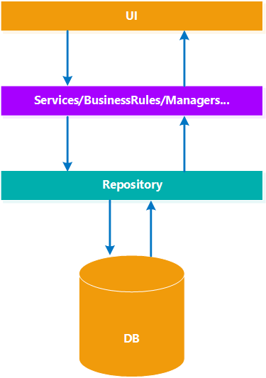

<!-- TOC -->
* [CQRS](#cqrs)
  * [Типовой подход к проектированию приложения](#типовой-подход-к-проектированию-приложения)
  * [Command and Query Responsibility Segregation (CQRS)](#command-and-query-responsibility-segregation-cqrs)
  * [С чего начать при работе с CQRS?](#с-чего-начать-при-работе-с-cqrs)
      * [Стек команд](#стек-команд)
      * [Стек запросов](#стек-запросов)
  * [Вызов команд и запросов](#вызов-команд-и-запросов)
  * [Достоинства CQRS](#достоинства-cqrs)
  * [Ограничения CQRS](#ограничения-cqrs)
  * [Где не подходит](#где-не-подходит)
  * [Заключение](#заключение)
  * [Полезные ссылки](#полезные-ссылки)
<!-- TOC -->

# CQRS

Системы управления предприятиями, проектами, сотрудниками давно вошли в нашу жизнь. И пользователи таких enterprise приложений все более требовательны: 
возрастают требования к масштабируемости, сложность бизнес-логики, требования к системам меняются быстро, да и отчетность требуется в реальном времени.

Поэтому при разработке зачастую можно наблюдать одни и те же проблемы в организации кода и архитектуры, а также в их усложнении. При неправильном подходе к 
проектированию рано или поздно может наступить момент, когда код становится настолько сложным и запутанным, что каждое внесение изменений требует все больше 
времени и ресурсов.

## Типовой подход к проектированию приложения



Многослойная архитектура – один из самых популярных способов организации структуры веб-приложений. В простой её вариации, как на приведенной выше схеме, 
приложение делится на 3 части: слой данных, слой бизнес-логики и слой пользовательского интерфейса.

В слое данных имеется некий `Repository`, который абстрагирует нас от хранилища данных.
В слое бизнес-логики есть объекты, которые инкапсулируют бизнес-правила (обычно их названия варьируются в пределах `Services/BusinessRules/Managers/Helpers`). 
Запросы пользователя проходят от `UI` сквозь бизнес-правила, и дальше через `Repository` производится работа с хранилищем данных.

С такой архитектурой запросы на получение и изменение данных, как правило, производятся в одном и том же месте – в слое бизнес-логики. Это довольно простой и 
привычный способ организации кода, и такая модель может подойти для большинства приложений, если в этих приложениях количество пользователей со временем 
значительно не меняется, приложение не испытывает больших нагрузок и не требует значительного расширения функционала

Но если веб-ресурс становится достаточно популярным, может стать вопрос о том, что одного сервера для него недостаточно. И тогда встает вопрос о распределении 
нагрузки между несколькими серверами. Простейший вариант быстро распределить нагрузку – использовать несколько копий ресурса и репликацию базы данных. А 
учитывая, что все действия такой системы никак не разделены, это порождает новые проблемы.

Классическая многослойная архитектура не обеспечивает лёгкого решения подобных проблем. Поэтому неплохо было бы использовать подходы, в которых эти проблемы 
решены с самого начала. Одним из таких подходов является `CQRS`.

## Command and Query Responsibility Segregation (CQRS)

`CQRS` – подход проектирования программного обеспечения, при котором код, изменяющий состояние, отделяется от кода, просто читающего это состояние. Подобное 
разделение может быть логическим и основываться на разных уровнях. Кроме того, оно может быть физическим и включать разные звенья (`tiers`), или уровни.

В основе этого подхода лежит принцип `Command-query separation` (`CQS`).

Основная идея `CQS` в том, что в объекте методы могут быть двух типов:
- `Queries`: Методы возвращают результат, не изменяя состояние объекта. Другими словами, у `Query` нет никаких побочных эффектов.
- `Commands`: Методы изменяют состояние объекта, не возвращая значение.

Для примера такого разделения рассмотрим класс `User` с одним методом `IsEmailValid`:

```.net
public class User {

    public string Email { get; private set; }
 
    public bool IsEmailValid(string email) {
        bool isMatch = Regex.IsMatch("email pattern", email);
 
        if (isMatch) {
            Email = email; // Command
        }
 
        return isMatch; // Query
    }
}
```

В данном методе мы спрашиваем (делаем `Query`), является ли валидным переданный `email`. Если да, то получаем в ответ `True`, иначе `False`. Кроме возврата 
значения, здесь также определено, что в случае валидного email сразу присваивать его значение (делаем `Command`) полю `Email`.

Несмотря на то что пример довольно простой, вероятна и менее тривиальная ситуация, если представить себе метод `Query`, который при вызове в нескольких уровнях 
вложенности меняет состояние разных объектов. В лучшем случае повезет, если не придется столкнуться с подобными методами и их долгой отладкой. Подобные 
побочные эффекты от вызова `Query` часто обескураживают, так как сложно разобраться в работе системы.

Если воспользоваться принципом `CQS` и разделить методы на `Command` и `Query`, получим следующий код:

```.net
public class User {

    public string Email { get; private set; }
 
    // Query 
    public bool IsEmailValid(string email) {
        return Regex.IsMatch("email pattern", email);
    }
 
    // Command
    public void ChangeEmail(string email) {
        if (IsEmailValid(email) == false)
            throw new ArgumentOutOfRangeException(email);
 
        Email = email;
    }
}
```

Теперь пользователь нашего класса не увидит никаких изменений состояния при вызове `IsEmailValid`, он лишь получит результат – валиден ли `email` или нет. А в 
случае вызова метода `ChangeEmail` пользователь явно поменяет состояние объекта.

В `CQS` у `Query` есть одна особенность. Раз `Query` никак не меняет состояние объекта, то методы типа `Query` можно хорошо распараллелить, разделяя 
приходящуюся на операции чтения нагрузку.

Если `CQS` оперирует методами, то `CQRS` поднимается на уровень объектов. Для изменения состояния системы создается класс `Command`, а для выборки данных – 
класс `Query`. Таким образом, мы получаем набор объектов, которые меняют состояние системы, и набор объектов, которые возвращают данные.

Типовой дизайн системы, где есть `UI`, бизнес-логика и база данных:


`CQRS` говорит, что не надо смешивать объекты `Command` и `Query`, нужно их явно выделить. Система, разделенная таким образом, будет выглядеть уже так:


Разделение, преследуемое `CQRS`, достигается группированием операций запроса в одном уровне, а команд – в другом. Каждый уровень имеет свою модель данных, свой 
набор сервисов и создается с применением своей комбинации шаблонов и технологий. Еще важнее, что эти два уровня могут находиться даже в двух разных звеньях 
(`tiers`) и оптимизироваться раздельно, никак не затрагивая друг друга.

Простое понимание того, что команды и запросы являются разными вещами, оказывает глубокое влияние на архитектуру ПО. Например, вдруг становится легче 
предвидеть и кодировать каждый уровень предметной области. Уровень предметной области (`domain layer`) в стеке команд нуждается лишь в данных, бизнес-правилах 
и правилах безопасности для выполнения задач. С другой стороны, уровень предметной области в стеке запросов может быть не сложнее прямого `SQL`-запроса.

## С чего начать при работе с CQRS?

#### Стек команд

В `CQRS` на стек команд возлагается только выполнение задач, которые модифицируют состояние приложения. Команде присущи следующие свойства:
- Изменяет состояние системы.
- Ничего не возвращает.
- Контекст команды хранит нужные для ее выполнения данные.

Объявление и использование команды условно можно поделить на 3 части:
- Класс команды, представляющий собой данные;
- Класс обработчика команд;
- Класс с методом или методами, которые принимают команду на вход и вызывают именно тот обработчик, который реализует команду с данным типом.

Суть команд и запросов заключается в том, что они имеют общий признак, по которому они могут быть объединены. Иначе говоря, у них имеется общий тип. В случае 
команд это будет выглядеть следующим образом:

```.net
public interface ICommand{}
```

Первым шагом объявляется интерфейс, который, как правило, ничего не содержит. Он будет использоваться как параметр, который может быть получен на стороне 
сервера непосредственно из пользовательского интерфейса (`UI`), или же быть сформирован иным образом, для передачи обработчику команды.

Далее объявляется интерфейс обработчика команды.

```.net
public interface ICommandHandler<in TCommand> where TCommand : ICommand {
    void Execute(TCommand command);
}
```

Он содержит лишь 1 метод, принимающий данные с типом интерфейса, объявленным ранее.

После этого остается определить способ централизованного вызова обработчиков команд в зависимости от конкретного типа переданной команды (`ICommand`). Эту роль 
могут выполнять сервисная шина или диспетчер.

```.net
public interface ICommandDispatcher {
    void Execute<TCommand>(TCommand command) where TCommand : ICommand;
}
```

В зависимости от потребностей может иметь как один, так и более методов. В простых случаях может быть достаточно и одного метода, задача которого заключается в 
том, чтобы по типу переданного параметра определить, какую реализацию обработчика команды вызывать. Тем самым пользователю не придется делать это вручную.

Пример команды. Допустим, есть интернет-магазин, для него нужно создать команду, которая создаст товар в хранилище. В начале создадим класс, где в его имени 
указываем то, какое действие производит данная команда.

```.net
public class CreateInventoryItem : ICommand {

    public Guid InventoryItemid { get; }
    public string Name { get; }
 
    public CreateInventoryItem(Guid inventoryItemld, string name) {
        InventoryItemId = inventoryItemId;
        Name = name;
    }
}
```

Все классы, реализующие `ICommand`, содержит данные – свойства и конструктор с установкой их значений при инициализации – и больше ничего.

Реализация обработчика, то есть уже непосредственно самой команды, сводится к довольно простым действиям: создается класс, который реализует интерфейс 
`ICommandHandler`. Аргументом типа указывается команда, объявленная ранее.

```.net
public class InventoryCommandHandler : ICommandHandler<CreateInventoryItem> {

    private readonly IRepository<InventoryItem> _repository;
 
    public InventoryCommandHandlers(IRepository<InventoryItem> repository) {
        _repository = repository;
    }
 
    public void Execute(CreateInventoryItem message) {
        var item = new InventoryItem(message.InventoryItemld, message.Name);
        _repository.Save(item);
    }
 
    // ...
}
```

Тем самым мы реализуем метод, принимающий на вход эту команду, и указываем, какие действия на основе переданных данных хотим произвести. Обработчики команд 
можно объединять логически и реализовывать в одном таком классе несколько интерфейсов `ICommandHandler` с разным типом команд. Получится перегрузка методов, и 
при вызове метода `Execute` будет выбран подходящий по типу команды.

Теперь, чтобы вызывать подходящий обработчик команды, нужно создать класс, реализующий интерфейс `ICommandDispatcher`. В отличие от прошлых двух, данный класс 
создается единожды и может иметь разные реализации в зависимости от стратегии регистрации и вызова обработчиков команд.

```.net
public class CommandDispatcher : ICommandDispatcher {

    private readonly IDependencyResolver _resolver;
 
    public CommandDispatcher(IDependencyResolver resolver) {
        _resolver = resolver;
    }
 
    public void Execute<TCommand>(TCommand command) where TCommand : ICommand {
        if (command == null) throw new ArgumentNullException("command");
 
        var handler = _resolver.Resolve<ICommandHandler<TCommand>>();
 
        if (handler == null) throw new CommandHandlerNotFoundException(typeof(TCommand));
 
        handler.Execute(command);
    }
}
```

Одним из способов вызова нужного обработчика команды является использование `DI`-контейнера, в котором регистрируются все реализации обработчиков. В 
зависимости от переданной команды будет создаваться тот экземпляр, который обрабатывает данный тип команды. Затем диспетчер просто вызывает его метод 
`Execute`.

#### Стек запросов

Стек запросов имеет дело только с извлечением данных. Запросы используют модель данных, максимально соответствующую данным, применяемым на презентационном 
уровне. Вам вряд ли нужны какие-либо бизнес-правила – обычно они применяются к командам, которые изменяют состояние.

Запросу присущи следующие свойства:
- Не изменяет состояние системы;
- Контекст запроса хранит нужные для ее выполнения данные (пейджинг, фильтры и т.п.);
- Возвращает результат.

Объявление и использование запросов также можно условно поделить на 3 части:
- Класс запроса, представляющий собой данные с типом возвращаемого результата;
- Класс обработчика запросов;
- Класс с методом или методами, которые принимают запрос на вход и вызывают именно тот обработчик, который реализует запрос с данным типом.

Как и для команд, для запросов объявляются похожие интерфейсы. Единственное отличие – в них указывается то, что должно быть возвращено.

```.net
public interface IQuery<TResult>{}
```

Здесь в качестве аргумента типа указывается тип возвращаемых данных. Это может быть произвольный тип, например, `string` или `int[]`.

После объявляется обработчик запросов, где также указывается тип возвращаемого значения.

```.net
public interface IQueryHandler<in TQuery, out TResult> where TQuery : IQuery<TResult> {
    TResult Execute(TQuery query);
}
```

По аналогии с командами объявляется диспетчер для вызова обработчиков запросов.

```.net
public interface IQueryDispatcher {
    TResult Execute<TQuery, TResult>(TQuery query) where TQuery : IQuery<TResult>;
}
```

**Пример запроса**. Допустим, нужно создать запрос, возвращающий пользователей по поисковому критерию. Здесь также с помощью осмысленного имени класса 
указываем, что за запрос будет производится.

```.net
public class FindUsersBySearchTextQuery : IQuery<User[]> {

    public string SearchText { get; }
    public bool InactiveUsers { get; }
 
    public FindUsersBySearchTextQuery(string searchText, bool inactiveUsers)
    {
        SearchText = searchText;
        InactiveUsers = inactiveUsers;
    }
}
```

Далее создаём обработчик, реализующий `IQueryHandler` с аргументами типа запроса и типа его возвращаемого значения.

```.net
public class UserQueryHandler : IQueryHandler<FindUsersBySearchTextQuery, User[]> {

    private readonly IRepository<User> _repository;
 
    public UserQueryHandler(IRepository<User> repository)
    {
        _repository = repository;
    }
 
    public User[] Execute(FindUsersBySearchTextQuery query)
    {
        var users = _repository.GetAll();
        return users.Where(user => user.Name.Contains(query.SearchText)).ToArray();
    }
}
```

После чего остается создать класс для вызова обработчиков запросов.

```.net
public class QueryDispatcher : IQueryDispatcher {

    private readonly IDependencyResolver _resolver;
 
    public QueryDispatcher(IDependencyResolver resolver)
    {
        _resolver = resolver;
    }
 
    public TResult Execute<TQuery, TResult>(TQuery query) where TQuery : IQuery<TResult>
    {
        if (query == null) throw new ArgumentNullException("query");
 
        var handler = _resolver.Resolve<IQueryHandler<TQuery, TResult>>();
 
        if (handler == null) throw new QueryHandlerNotFoundException(typeof(TQuery));
 
        return handler.Execute(query);
    }
}
```

## Вызов команд и запросов

Чтобы можно было вызывать команды и запросы, достаточно использовать соответствующие диспетчеры и передать конкретный объект с необходимыми данными. На примере 
это выглядит следующим образом:

```.net
public class UserController : Controller {

    private IQueryDispatcher _queryDispatcher;
 
    public UserController(IQueryDispatcher queryDispatcher) {
       _queryDispatcher = queryDispatcher;
    }
 
    public ActionResult SearchUsers(string searchString) {
        var query = new FindUsersBySearchTextQuery(searchString);
        User[] users =_queryDispatcher.Execute(query);
        return View(users);
    }
}
```

Имея контроллер для обработки запросов пользователя, достаточно передать в качестве зависимости объект нужного диспетчера, после чего сформировать объект 
запроса или команды и передать методу диспетчера `Execute`.

Так мы избавляемся от необходимости постоянного увеличения зависимостей при увеличении количества функций системы и уменьшаем количество потенциальных ошибок.

## Достоинства CQRS

- Меньше зависимостей в каждом классе;
- Соблюдается принцип единственной ответственности (`SRP`);
- Подходит практически везде;
- Проще заменить и тестировать;
- Легче расширяется функциональность.

## Ограничения CQRS

- При использовании `CQRS` появляется много мелких классов;
- При использовании простой реализации `CQRS` могут возникнуть сложности с использованием группы команд в одной транзакции;
- Если в `Command` и `Query` появляется общая логика, нужно использовать наследование или композицию. Это усложняет дизайн системы, но для опытных 
разработчиков не является препятствием;
- Сложно целиком придерживаться `CQS` и `CQRS`. Самый простой пример – метод выборки данных из стека. Выборка данных – это `Query`, но нам надо обязательно 
поменять состояние и сделать размер стека `-1`. На практике вы будете искать баланс между жестким следованием принципами и производственной необходимостью;
- Плохо ложится на `CRUD`-приложения.

## Где не подходит
- В небольших приложениях/системах;
- В преимущественно `CRUD`-приложениях.

## Заключение

Чтобы приложения были по-настоящему эффективными, они должны подстраиваться под требования бизнеса. Архитектура, основанная на `CQRS`, значительно упрощает 
расширение и модификацию рабочих бизнес-процессов и поддерживает новые сценарии. Вы можете управлять расширениями в полной изоляции. Для этого достаточно 
добавить новый обработчик, зарегистрировать и сообщить ему, как обрабатывать сообщения только требуемого типа. Новый компонент будет автоматически вызываться 
только при появлении соответствующего сообщения и работать бок о бок с остальной частью системы. Легко, просто и эффективно.

`CQRS` позволяет оптимизировать конвейеры команд и запросов любым способом. При этом оптимизация одного конвейера не нарушит работу другого. В самой базовой 
форме `CQRS` используется одна общая база данных и вызываются разные модули для операций чтения и записи из прикладного уровня.

## Полезные ссылки

[Основы CQRS - habr](https://habr.com/ru/company/simbirsoft/blog/329970/)
