<!-- TOC -->
* [Kafka](#kafka)
  * [Kafka](#kafka-1)
  * [Что такое система обмена сообщениями?](#что-такое-система-обмена-сообщениями)
  * [Система обмена сообщениями `peer-to-peer`](#система-обмена-сообщениями-peer-to-peer)
  * [Система обмена сообщениями `pub-sub`](#система-обмена-сообщениями-pub-sub)
  * [Что такое Кафка?](#что-такое-кафка)
  * [Преимущества](#преимущества)
  * [Случаи применения](#случаи-применения)
  * [Нужно для кафки](#нужно-для-кафки)
  * [Основы](#основы)
  * [Кто такой лидер и последователь в Кафке?](#кто-такой-лидер-и-последователь-в-кафке)
  * [Что такое реплика? Почему репликации считаются критическими в среде Кафки?](#что-такое-реплика-почему-репликации-считаются-критическими-в-среде-кафки)
  * [Что такое Zookeeper в Кафке? Можно ли использовать Кафку без Zookeeper?](#что-такое-zookeeper-в-кафке-можно-ли-использовать-кафку-без-zookeeper)
  * [Как сообщения потребляются потребителем в Кафке?](#как-сообщения-потребляются-потребителем-в-кафке)
  * [Что такое офсет?](#что-такое-офсет)
  * [Kafka vs Queue](#kafka-vs-queue)
  * [Теперь посмотрим как работает Кафка](#теперь-посмотрим-как-работает-кафка)
  * [Сравнение того как работает Кафка и RabbitMQ на примере регистрации пользователя на сайте](#сравнение-того-как-работает-кафка-и-rabbitmq-на-примере-регистрации-пользователя-на-сайте)
  * [Структура данных в Кафка](#структура-данных-в-кафка)
  * [Consumer groups](#consumer-groups)
  * [ZooKeeper](#zookeeper)
  * [Структура партиции](#структура-партиции)
  * [Конфигурация](#конфигурация)
  * [Полезные ссылки](#полезные-ссылки)
<!-- TOC -->

# Kafka

Кафка предназначена для распределенных высокопроизводительных систем. `Kafka` имеет тенденцию работать очень хорошо как замена более традиционному брокеру 
сообщений. По сравнению с другими системами обмена сообщениями, `Kafka` имеет лучшую пропускную способность, встроенное разбиение, репликацию и собственную 
отказоустойчивость, что делает его подходящим для крупномасштабных приложений обработки сообщений.

## Kafka

Распределенное хранилище - система, которая как правило работает на нескольких машинах, каждая из этих машин в свою очередь является кусочком хранилища. Для пользователей это всё представляется в виде единого целого.

Преимущества таких хранилищ:
- Хорошее горизонтальное масштабирование
- Высокая отказоустойчивость

Вертикальное масштабирование - увеличение ресурсов для одной машины (cpu, ram и тд). Вертикальное масштабирование имеет пределы в виде ресурсов. Мы не можем скейлиться бесконечно.
Горизонтальное масштабирование - техника, в которой мы вместо увеличения мощностей одной машины, добавляем в систему дополнительные машины и тем самым увеличиваем доступные ресурсы.

Отказоустойчивость - свойство системы, позволяющее ей не иметь единую точку отказа. То есть если что-то пошло не так и какая-то машина вышла из строя, система сможет продолжить работу. Вплоть до того, что потеря целого датацентра не нарушит работу системы.

Кроме хранения данных и передачи их между разными частями инфраструктуры, Кафка также имеет поддержку потоковой обработки данных. Это нативный Kafka Streams или внешние фреймворки. Преимущество в том, что данные обрабатываются сразу как только попадают в Кафка.

Кафка - это распределенное, отказоустойчивое, горизонтально масштабируемое хранилище, основной структурой данных в котором является append-only лог, которое поддерживает потоковую обработку данных и имеет развитую систему коннекторов для интеграции с базами данных и другими хранилищами.

Почему Кафка, а не другие системы?
- Кафка может работать с большим числом продюсеров, не зависимо от того используют они один топик или несколько. Это делает технологию идеальной для агрегирования данных из внешних систем.
- Разработана таким образом, чтобы несколько консюмеров могли читать любой поток сообщений не мешая друг другу. Это отличает кафку от многих других систем очередей (где сообщение, полученное одним потребителем больше недоступно для других потребителей).
- Все сообщения хранятся на диске и имеют настраиваемые правила хранени (retention). Это дает возможность консюмерам перечитать данные из прошлого, вернуться назад. Даже если консюмер не будет успевать обрабатывать сообщения из-за скорости обработки или упавшей системы, то мы не потеряем данные.
- Положение консюмеров тоже сохраняется на диске. То есть мы всегда знаем на каком событии мы остановились.
- Может обрабатывать огромные потоки сообщений. Продюсеров, консюмеров и брокеров можно масштабировать горизонтально.

Примеры использование:
- Обычный брокер сообщений
- Клик стрим - обработка и отслеживание действий пользователей. Если кратко это сведения о просмотре страниц или отслеживании кликов пользователей на сайте или какие-то более сложные действия. Мы можем как просто сохранять эти данные, так и обрабатывать их в реальном времени.
- Журналирование и сбор метрик - передача данных в эластик или системы логирования
- База данных. Например, The New-York Times все свои статьи и правки за последние 166 лет хранит в Кафке. Данные там можно хранить вечно, вообще ничего не удаляя 

## Что такое система обмена сообщениями?

Система обмена сообщениями отвечает за передачу данных из одного приложения в другое, поэтому приложения могут сосредоточиться на данных, но не беспокоиться о
том, как ими обмениваться. Распределенный обмен сообщениями основан на концепции надежной очереди сообщений. Сообщения помещаются в очередь асинхронно между
клиентскими приложениями и системой обмена сообщениями. Доступны два типа шаблонов обмена сообщениями: один — «`точка-точка`» (`peer-to-peer`, `P2P`), а другой — система обмена
сообщениями «`публикация-подписка`» (`pub-sub`). Большинство шаблонов сообщений следуют `pub-sub`.

## Система обмена сообщениями `peer-to-peer`

В системе `peer-to-peer` сообщения сохраняются в очереди. Один или несколько потребителей могут потреблять сообщения в очереди, но конкретное сообщение может
потреблять максимум один консюмер. Как только консюмер прочитает сообщение в очереди, оно исчезнет из этой очереди. Типичным примером этой системы
является система обработки заказов, где каждый заказ обрабатывается одним обработчиком заказов, но несколько процессоров заказов могут работать одновременно.
Следующая диаграмма изображает структуру.

## Система обмена сообщениями `pub-sub`

В системе `pub-sub` сообщения сохраняются в топике. В отличие от двухточечной системы, консюмеры могут подписаться на один или несколько топиков и
использовать все сообщения в этой топике. В системе «`pub-sub`» продюсеры сообщений называются издателями, а консюмеры сообщений — подписчиками.
Примером из реальной жизни является `Dish TV`, который публикует различные каналы, такие как спортивные состязания, фильмы, музыка и т. Д., И любой может
подписаться на свой собственный набор каналов и получать их, когда доступны их подписанные каналы.

## Что такое Кафка?

`Apache Kafka` — это распределенная система обмена сообщениями «`pub-sub`» и надежная очередь, которая может обрабатывать большой объем данных и
позволяет передавать сообщения из одной конечной точки в другую. Кафка подходит как для автономного, так и для онлайн-рассылки сообщений. Сообщения `Kafka`
сохраняются на диске и реплицируются в кластере для предотвращения потери данных. `Kafka` построен поверх службы синхронизации `ZooKeeper`. Он очень хорошо
интегрируется с `Apache Storm` и `Spark` для анализа потоковых данных в реальном времени.

## Преимущества

- **Надежность** — Кафка распределяется, разбивается, тиражируется и отказоустойчива.
- **Масштабируемость** — Kafka легко масштабируется без простоев.
- **Долговечность** — Kafka использует распределенный журнал фиксации, который означает, что сообщения сохраняются на диске настолько быстро, насколько это
  возможно, а значит, и долговечны
- **Производительность** — Кафка обладает высокой пропускной способностью для публикации и подписки сообщений. Он поддерживает стабильную производительность
  даже при хранении многих ТБ сообщений.

`Kafka` очень быстрая и **гарантирует нулевое время простоя и нулевую потерю данных**.

## Случаи применения
- **Метрики** — Кафка часто используется для оперативного мониторинга данных. Это включает в себя агрегирование статистики из распределенных приложений для
  получения централизованных потоков оперативных данных.
- **Решение для агрегации журналов** — Kafka может использоваться в рамках всей организации для сбора журналов от нескольких служб и предоставления их в
  стандартном формате нескольким потребителям.
- **Потоковая обработка** — популярные платформы, такие как `Storm` и `Spark Streaming`, считывают данные из топика, обрабатывают их и записывают обработанные
  данные в новый топик, где они становятся доступными для пользователей и приложений. Высокая прочность Kafka также очень полезна в контексте потоковой обработки.

## Нужно для кафки

`Kafka` — это унифицированная платформа для обработки всех потоков данных в реальном времени. `Kafka` поддерживает доставку сообщений с низкой задержкой и дает
гарантию отказоустойчивости при наличии отказов машины. Он способен обрабатывать большое количество разнообразных потребителей. Кафка очень быстрая, выполняет
2 миллиона операций записи в секунду. Кафка сохраняет все данные на диск, что, по сути, означает, что все записи идут в кеш страниц ОС (ОЗУ). Это позволяет
очень эффективно передавать данные из кэша страниц в сетевой сокет.

## Основы

Прежде чем углубляться в `Kafka`, вы должны знать основные термины, такие как топики, брокеры, продюсеры и консюмеры. Следующая диаграмма иллюстрирует
основные термины, а таблица подробно описывает компоненты диаграммы.

На приведенной выше диаграмме топик разбит на три части (партишена). `Partition 1` имеет два офсета - 0 и 1. `Partition 2` имеет четыре офсета - 0,
1, 2 и 3. `Partition 3` имеет один коэффициент смещения - 0. Идентификатор реплики совпадает с идентификатором сервера, на котором она размещена.

Предположим, если коэффициент репликации для топика установлен на 3, то Kafka создаст 3 одинаковые реплики каждого партишена и поместит их в кластер, чтобы сделать
доступными для всех своих операций. Чтобы сбалансировать нагрузку в кластере, каждый брокер хранит один или несколько таких партишенов. Несколько производителей
и потребителей могут публиковать и получать сообщения одновременно.

- **Топик**: Поток сообщений, относящихся к определенной категории, называется топиком. Данные хранятся в топиках. Топики разбиты на партишены. Для каждого топика Кафка
  хранит минимум один партишен. Каждый такой партишен содержит сообщения в неизменной упорядоченной последовательности. Партишен реализован как набор файлов сегментов
  одинакового размера.
- **Партишен**: Топики могут иметь много партишенов, поэтому он может обрабатывать произвольный объем данных.
- **Офсет партишена**: Каждое секционированное сообщение имеет уникальный идентификатор последовательности, называемый офсетом.
- **Реплики партишена**: Реплики — это не что иное, как резервные копии партишена. Реплики никогда не читают и не записывают данные. Они используются для
  предотвращения потери данных.
- **Брокеры**: они действуют как канал между производителями и потребителями. Это набор серверов, на которых хранятся опубликованные сообщения.
- **Кафка кластер**: Kafka с несколькими брокерами называется кластером Kafka. Кластер Kafka может быть расширен без простоев. Эти кластеры используются для
  управления сохранением и репликацией данных сообщений.
- **Продюсеры**: это издатели сообщений на одну или несколько топиков Кафки. Продюсеры отправляют данные брокерам Kafka. Каждый раз, когда продюсер
  публикует сообщение для брокера, он просто добавляет сообщение в последний файл сегмента. На самом деле, сообщение будет добавлено в партишен. Продюсер
  также может отправлять сообщения в партишен по своему выбору.
- **Консюмеры**: Консюмеры читают данные от брокеров. Консюмеры подписываются на одну или несколько топиков и используют опубликованные сообщения, извлекая

## Кто такой лидер и последователь в Кафке?

Кафка создает партишены на основе офсетных и консюмерских групп. Каждый партишен в Кафке имеет сервер, который играет роль лидера. Один из них, являющийся
лидером, не может быть ни одного или нескольких серверов, которые будут выполнять функции последователя. Лидер назначил себе задачи, которые читают и пишут
запросы на партишены. Последователи, с другой стороны, должны следовать за лидером и копировать то, что говорит лидер. Если лидер вообще терпит неудачу, как в
реальной жизни, один из последователей должен взять на себя роль лидера. Это может произойти во время сбоев сервера. Это обеспечивает правильную балансировку
нагрузки на сервере, а также обеспечивает стабильность системы.

## Что такое реплика? Почему репликации считаются критическими в среде Кафки?

Список основных узлов, отвечающих за ведение журнала для любого конкретного партишена, называется репликой. Узел реплики не имеет значения, играет ли он роль
лидера или последователя. Жизненно важной причиной необходимости репликации является то, что они могут быть использованы снова в любом неопределенном случае
машинной ошибки, сбоя программы или сбоя системы из-за обычных частых обновлений. Чтобы убедиться, что никакие данные не потеряны или повреждена репликация,
убедитесь, что все сообщения опубликованы правильно и не потеряны.

## Что такое Zookeeper в Кафке? Можно ли использовать Кафку без Zookeeper?

Это основной вопрос интервью Кафки, заданный в интервью. `Zookeeper` используется для распределенных приложений, адаптированных Kafka. Это помогает Кафке
правильно управлять всеми источниками. `Zookeeper` - это высокопроизводительная программа с открытым исходным кодом, предоставляющая полный сервис координации.

Нет, невозможно пропустить `Zookeeper` и перейти непосредственно к брокеру Kafka. `Zookeeper` управляет всеми ресурсами Kafka и, следовательно, если
`Zookeeper` не работает, он не может обслуживать запросы клиентов на обслуживание. Основная задача `zookeeper` - быть каналом связи для различных узлов,
существующих в кластере. `Zookeeper` в Кафке используется для фиксации смещения. Если узел вообще выходит из строя, его можно легко извлечь из смещения,
которое было ранее зафиксировано. В дополнение к этому `zookeeper` также заботится о таких действиях, как обнаружение лидеров, распределенная синхронизация,
управление конфигурацией и т. Д. Кроме того, он также выполняет работу по идентификации нового узла, который покидает или присоединяется к узлам кластера,
состоянию всех узлов., и т.д.

## Как сообщения потребляются потребителем в Кафке?

С помощью `API` отправки файлов передача сообщений осуществляется в Kafka. Используя этот файл, передача байтов происходит из сокета на диск через копии,
сохраняющие пространство в ядре, и вызовы между пользователем ядра и обратно в ядро.

## Что такое офсет?

Офсет можно назвать уникальным идентификатором, который присваивается всем различным партишенам. Эти партишены содержат сообщения. Наиболее важным
использованием смещения является то, что он может помочь идентифицировать сообщения через идентификатор смещения. Эти идентификаторы смещения доступны во всех
разделах.

## Kafka vs Queue

Системы очередей обычно состоят из 3 базовых компонентов:
- Сервера
- Продюсеров, которые отправляют сообщения в одну из очередей
- Консюмеров, которые читают сообщения. Они получают сообщения используя две разные модели в зависимости от технологий. Во-первых это pull модель, в которой консюмеры сами отправляют запрос раз в N времени на сервер для получения сообщений. При таком подходе консюмеры сами регулируют свою нагрузку, кроме того pull модель позволяет эффективно группировать сообщения в батчи, достигая лучшей пропускной способности. Минус этой модели - потенциальная разбалансированность нагрузки между разными консьюмерами, а также более высокая задержка обработки данных. Вторая модель - push модель. В которой сервер сам отправляет сообщения консюмеру (по такой модели работает RabbitMQ). Такой подход снижает задержку обработки сообщений и позволяет эффективно балансировать нагрузку между консюмерами.

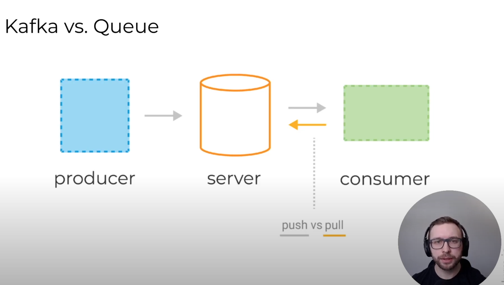

Жизненный цикл сообщений в очереди:
- Продюсер отправляет сообщение
- Консюмер фетчит сообщение и его айди из сервера. Сервер в этот момент помечает сообщение как InFlight, сообщения в таком состоянии всё еще хранятся на сервере, но временно не доставляются другим консюмерам. Таймаут этого состояния обычно контролируется специальной настройкой.
- Консюмер обрабатывает сообщение
- Консюмер отправляет ack или nack запрос на сервер используя айди ранее полученного сообщения, тем самым либо подтверждая успешную обработку сообщения, либо сигнализируя об ошибке. В случае успешной обработки сообщение удаляется из очереди навсегда. В случае ошибки или таймаута состояния InFlight сообщение доставляется другому консюмеру для обработки.

## Теперь посмотрим как работает Кафка

Кафка также состоит из 3 базовых компонентов:
- Кафка брокера (тот же самый сервер)
- Продюсеров
- Консьюмеров, которые считывают эти сообщения используя модель pull 

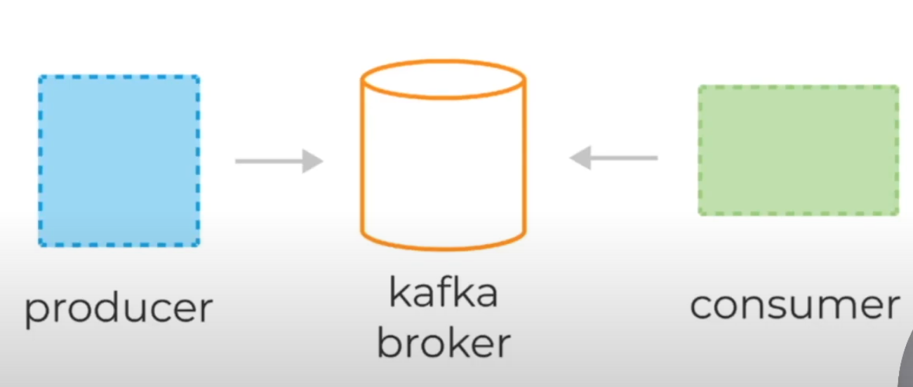

Главное фундаментальное отличие Кафки от очередей кроется в том, как сообщения хранятся на брокере и как потребляются консюмерами. 
В отличии от очередей сообщения в Кафке не удаляются по мере их обработки консюмерами. Благодаря этому одно и то же сообщение может быть обработано сколько угодно раз разными консьюмерами и в разных контекстах. В этом и кроется главная мощь и главное отличие Кафки от традиционных очередей.

## Сравнение того как работает Кафка и RabbitMQ на примере регистрации пользователя на сайте

Для каждой регистрации мы должны отправить письмо пользователю, пересчитать дневную статистику регистраций пользователей и сохранить пользователя в БД. 

В случае ребита или SQS нам нужно будет конфигурировать новую очередь для разных задач (отправка письма, подбор статистики и тд).

По сравнению с очередями Кафка делает эту задачу проще - посылаем сообщение один раз в топик, и все консюмеры подписанные на топик получают это уведомление и делают что-то с ним. 

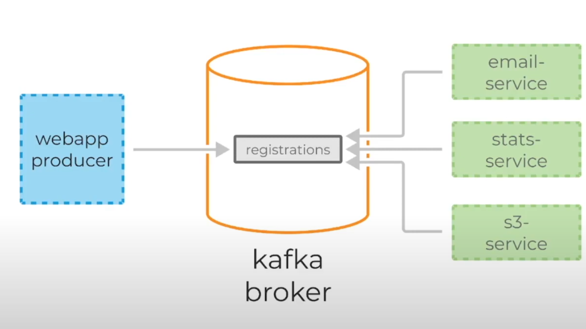

## Структура данных в Кафка

Каждое сообщение состоит из:
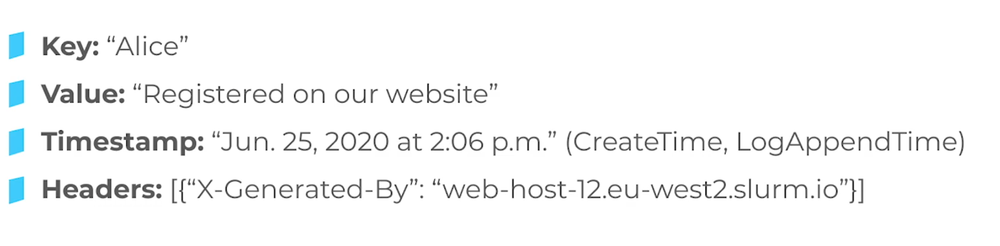

Cообщения в Кафке хранятся в топиках (Topics), каждый топик состоит из 1 или более партиций (Partition) распределенных между брокерами внутри одного кластера.

Когда новое сообщение добавляется в топик оно записывается в одну из партиций этого самого топика.
Сообщение с одинаковыми ключами записываются в одну и ту же партицию - MurmurHash, если ключ отсутсвует -  RoundRobin. 
Кафка гарантирует очередность записи и чтения в рамках одной партиции. Для гарантии сохранности данных каждая партиция в Кафке может быть реплицирована N раз. Где N - replication factor.
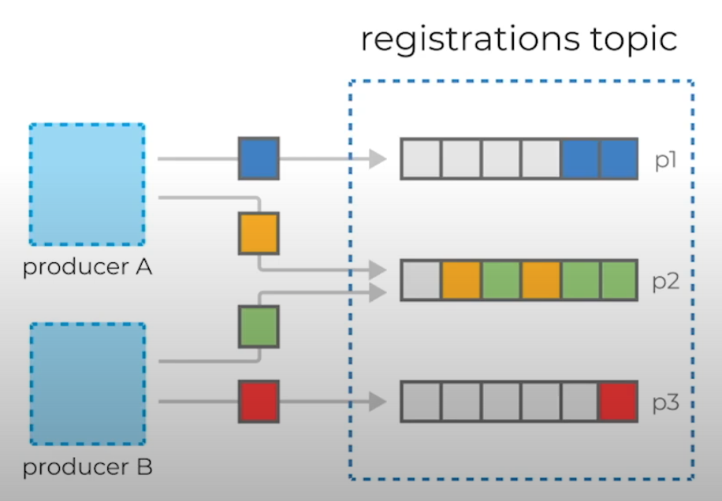

Партиция - распределенный отказоустойчивый лог. 
У каждой партиции есть 1 брокер лидер. Именно он работает с клиентами, принимает сообщения от продюсеров и отдает сообщения консюмерам.  
К лидеру осуществляют запросы фолловеры. То есть брокеры, которые хранят реплику всех данных партиции. У лидера может быть 0..N фолловеров.

Для того чтобы понять кто является лидером партиции перед записью и чтением, клиент делает запрос метаданных от брокера, при чем они могут подключиться к любому брокеру кластера, чтобы сделать этот запрос. 

Сообщения всегда отправляются лидеру и, в общем случае, читаются из него.
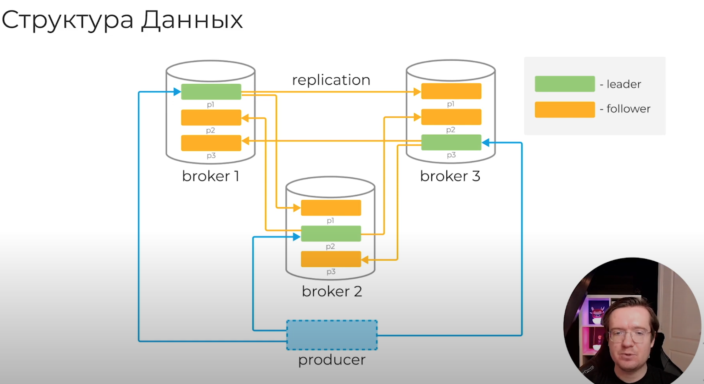

Каждое новое сообщение отправленное продюсером в партицию сохраняется в голову этого лога и получает свой уникальный, монотонно возрастающий offset 64-bit unsigned int, который назначается брокером.

Данные удаляются согласно заданной конфигурации ретеншена (retention):
- retention.ms - минимальное время хранения сообщений
- retention.bytes - максимальный размер партиции

Длительность хранения сообщений не влияет на производительность системы, поэтому можно хранить их очень долго.

## Consumer groups

Каждый консюмер кафки обычно является частью какой-то консюмер группы. Каждая группа имеет уникальное название и регистрируется брокерами в кластере кафки. Данные из одного и того же топика могут читаться множеством консюмер групп одновременно. Когда несколько консюмеров из одной группы читают данные из кафки каждый из консюмеров получает сообщения из разных партиций топика, таким образом распределяя нагрузку.

Если в группе есть только 1 консюмер, то он будет получать сообщения из всех партиций топика.
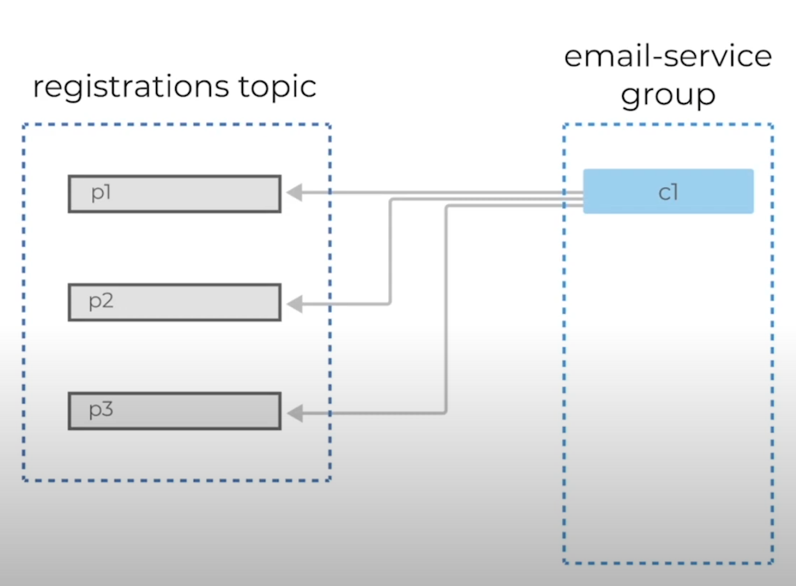

При добавлении еще одного консюмера партиции перераспределятся

При добавлении 3-го консюмера мы добьемся идеального распределения нагрузки

Если мы добавим еще одного консюмера, то он вообще не будет задействован в обработке сообщений.
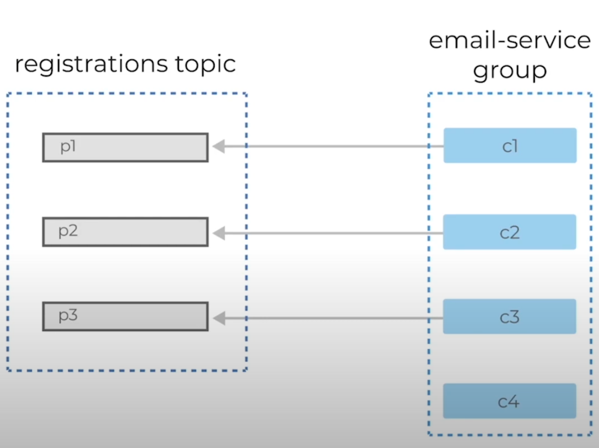

Если наши консюмеры не справляются с текущим объемом данных, мы должны добавить еще одну партицию в топик. И только после этого добавлять консюмера. 
Таким образом, масштабирование партиций кафки является основным инструментом масштабирования.
Если один из консюмеров в группе упадет, партиции перераспределятся между оставшимися консюмерами.

Добавлять партиции можно на лету, без перезапуска клиентов или брокеров. Но нужно помнить про гарантию очередности в рамках одной партиции и что партиции нельзя удалить после создания (можно удалить только топик целиком).

Нужно помнить про конфигурацию auto.offset.reset в консюмерах: при добавлении новой партиции “на проде” вы наверняка захотите прочитать данные с начала лога (auto.offset.reset=earliest). Когда запускается консюмер, он будет считывать только новые сообщения, которые поступят в Кафку. Чтобы считать все предыдущие сообщения, нужно установить эту конфигурацию.

Партиции не “бесплатны”. Каждая увеличивает время старта брокера и выбора лидеров после падения. Теоретический лимит на кластер 200К партиций для Кафки 2.0+

**Партиции ВНУТРИ ОДНОЙ ГРУППЫ назначаются консюмерам уникально.**
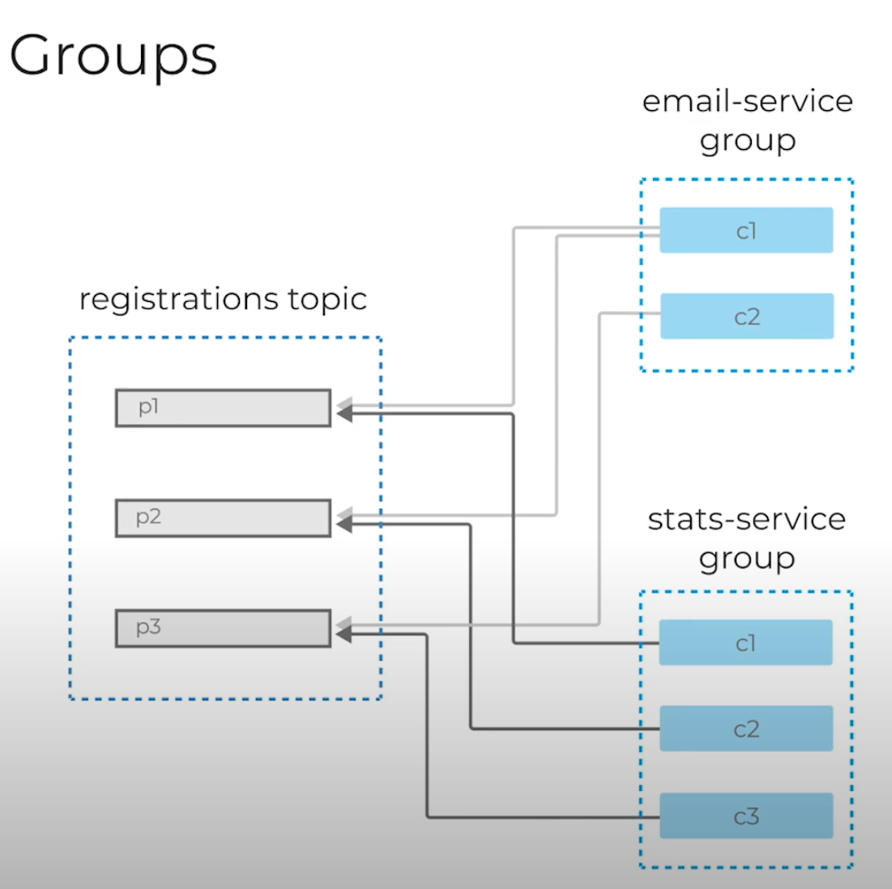

Как обозначить сообщение в партиции как обработанное?
Для этого у нас есть механизм консюмер оффсетов.
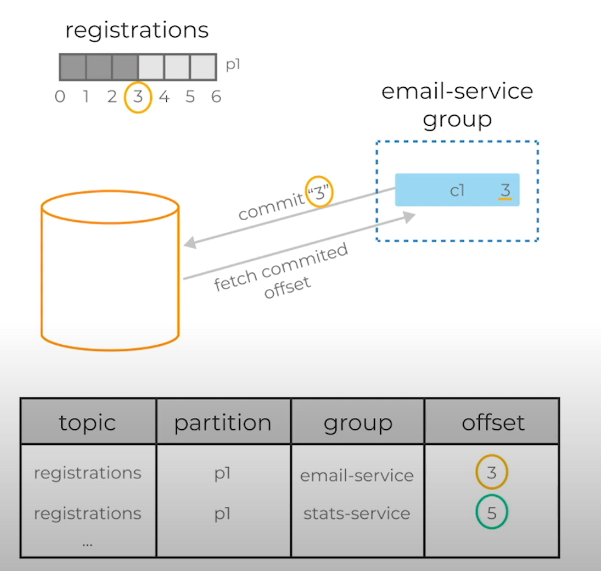

После обработки сообщения консюмер делает специальный запрос к брокеру - offset commit, с указание своей группы, айдишника топика и партиции и оффсета.
Брокер сохраняет эту инфу в своём специальном топике “__consumer_offsets” . При рестарте консюмера он запрашивает у брокера последний закоммиченый оффсет для нужной партиции из топика. И продолжает чтение сообщений из нужной партиции.

## ZooKeeper

ZooKeeper выполняет роль консистентного хранилища метаданных, конфигураций топиков и партиций, а также распределенного service log. 
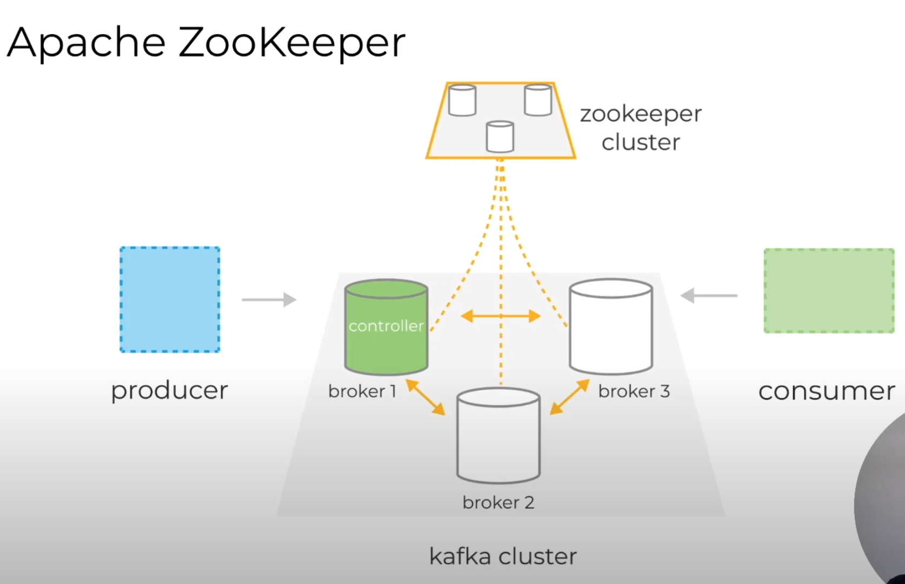

Именно он способен сказать живы ли наши брокеры, какой из брокеров является контроллером, то есть брокером, отвечающим за выбор лидеров партиций и в каком состоянии находятся лидеры партиций и их реплики. В случае падения брокера именно в ZooKeeper будет записана информация о новых лидерах партиций (будет записана контроллером).

Самый простой сценарий превратить данные в тыкву, потерять инфу из зукипера, потому что именно в нем хранится инфа что и откуда читать. В настоящее время ведутся работы по избавлению зависимости кафки от зукипера. 

Зукипер является еще одной распределенной системой хранения данных, за которой также необходимо следить, поддерживать и обновлять. Традиционно зукипер разворачивается отдельно от брокеров кафки, чтобы разделить границы возможных отказов. 

Падение зукипера почти равно падению всего кластера кафки.

## Структура партиции

Состоят они из набора файлов, которые называются сегментами.

Данные, которые продюсер присылает брокеру сохраняются в открытый (головной от head) сегмент. Который через некоторое время согласно некоторому набору правил закрывается (роллап) и вместо него открывается новый. Закрытые сегменты хранятся на диске, но при этом в них больше никогда не происходит запись. Они становятся неизменяемыми. Лог клинер (джоба которая очищает Кафку) удаляет записи из неё исключительно посегментно, то есть удаляет файлы целиком. И чтобы ему понять стоит удалять файл или нет (например retention по времени), то он делает следующее:
- смотрит и находит максимальный timestamp сообщения внутри одного сегмента
- находит разницу между этим максимальным таймстампом и текущем временем
- затем проверяет больше ли эта разница, чем retention ms, который мы установили
- если да, удаляем этот сегмент

## Конфигурация

retention.ms - минимальное время хранения данных, после которого Кафка может их удалить
retention.bytes - максимальный размер партиции на диске
segment.ms - период роллапа (через какое время закроется сегмент) сегмента после открытия (по-умолчанию 1 неделя)
segment.bytes - максимальный размер сегмента (по-умолчанию 1ГБ)

Большая часть настроек Кафки может быть определена на 2-х уровнях:
- Broker-level config - уровень сервера, используется по-умолчанию (часто имеют префикс log.*). Например, log.retention.ms - глобальный ретеншн для всех топиков, которые мы создаем
- Topic-level config - оверрайды для отдельных топиков, имеют более высокий приоритет. Значения этих конфигов хранятся в зукипере.

Помимо функционала удаления данных по retention конфигам, Кафка предоставляет еще и другой механизм удаления данных, который называется Log Compaction. Этот механизм использует ключи сообщений чтобы решить нужно ли удалить какие-то данные или нет. 

cleanup.policy - delete для ретеншена по времени/размеру (включен по-умолчанию), compact для включения compaction
Не самый очевидный момент: у cleanup.policy одновременно могут быть включены оба значения: cleanup.policy=compact, delete

После завершения compaction процесса останется только одна запись с ключом foo и его последним значением.

Помимо этого compaction также позволяет выборочно удалять данные из партиции.

Если мы отправим сообщение с ключом foo и значением NULL (так называемый delete маркер), то после compaction значение для этого ключа удалится.

Log compaction работает только для закрытых сегментов. Активные (открытые) сегменты он не цепляет. Также Log compaction не блокирует чтение данных. 
Log compaction довольно трудоемкий процесс для брокера, он нагружает память, процессор и диск потому что ему нужно перезаписывать сегменты.
Log compaction не атомарен! В определенные моменты времени внутри партиции по-прежнему могут одновременно находиться несколько записей с одинаковым ключом.
Этот механизм позволяет “удалять” записи по ключу. Например у какой-то компании из ЕС в Кафке хранилась инфа о пользователях, которая нарушала gdpr. Так как механизм кафки не позволяет напрямую удалить записи из неё в этой ситуации помог compaction.

Офсеты не меняются, порядок записи остается прежним.
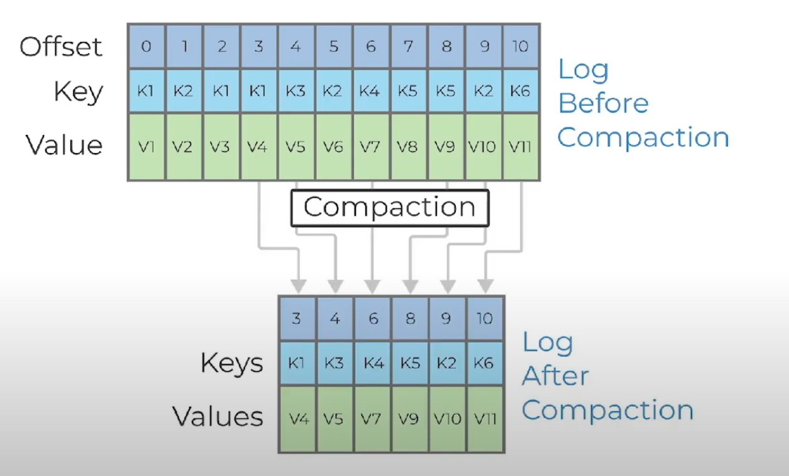

## Полезные ссылки

[Полезное видео о кафке](https://www.youtube.com/watch?v=Kgq4YLa9Jdw&list=PL8D2P0ruohOAR7DAkEjhOqlQreg9rxBMu&index=3)

[Apache Kafka — Краткое руководство - coderlessons](https://coderlessons.com/tutorials/bolshie-dannye-i-analitika/vyuchit-apache-kafka/apache-kafka-kratkoe-rukovodstvo)

[10 вопросов на собеседование по кафка](https://ru.photo-555.com/8985150-kafka-interview-questions)
