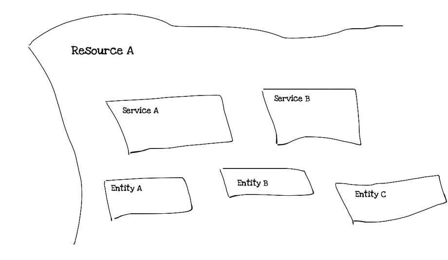

<!-- TOC -->
* [REST](#rest)
  * [REST и WWW](#rest-и-www)
  * [Архитектурный стиль](#архитектурный-стиль)
  * [Базовые понятия](#базовые-понятия)
      * [Ресурсы и представления ресурсов](#ресурсы-и-представления-ресурсов)
      * [Единообразные идентификаторы ресурсов — URI](#единообразные-идентификаторы-ресурсов--uri)
      * [URL, URN, URI](#url-urn-uri)
      * [HATEOAS](#hateoas)
  * [Моделирование ресурсов](#моделирование-ресурсов)
  * [Стандарты](#стандарты)
  * [Готовые решения](#готовые-решения)
  * [Best practices](#best-practices)
      * [Конечные точки в URL – имя существительное, не глагол](#конечные-точки-в-url--имя-существительное-не-глагол)
      * [Множественное число](#множественное-число)
      * [Документация](#документация)
      * [Версия вашего приложения](#версия-вашего-приложения)
      * [Пагинация](#пагинация)
      * [Использование SSL](#использование-ssl)
      * [HTTP методы](#http-методы)
      * [Эффективное использование кодов ответов HTTP](#эффективное-использование-кодов-ответов-http)
  * [Версионирование API](#версионирование-api)
  * [Пагинация](#пагинация-1)
      * [Offset пагинация](#offset-пагинация)
      * [Keyset пагинация](#keyset-пагинация)
      * [Seek пагинация](#seek-пагинация)
  * [Сортировка](#сортировка)
      * [Многоколоночная сортировка](#многоколоночная-сортировка-)
  * [Фильтрация](#фильтрация)
      * [LHS Brackets](#lhs-brackets)
      * [RHS colon](#rhs-colon)
      * [Search query param](#search-query-param)
  * [Полезные ссылки](#полезные-ссылки)
<!-- TOC -->

# REST

## REST и WWW

Можно сколько угодно говорить о преимуществах и недостатках текущей архитектуры `WWW`, но ее применимость, устойчивость к развитию и работоспособность доказана 
годами практического применения. Этим Рой Филдинг и воспользовался. Он предложил использовать `Web` не только для общения между человеком и машиной, но и для 
общения между машинами.

Примерно, преобразовав это:

```xml
<div class="account">
	<div class="identifier">12345</div>
	<div class="balance">500</div>
</div>
```

В это:

```
{
	"account": {
		"identifier": "12345", 
		"balance": 500
	}
}
```

`REST` задуман так, что если правильно применять, то можно построить приложение (с `API`), которое будет работать и масштабироваться веками.

## Архитектурный стиль

Я очень люблю названия и аббревиатуры в `IT`. Я уверен, что правильные названия в разработке — это уже 80% успеха.

`REST` — `REpresentational State Transfer`. Я перевожу это так — `передача/изменения состояния через представления`. `REST` — это архитектурный стиль, 
некоторое множество ограничений, для построения распределенных приложений. Здесь нет ни слова об `API`, `HTTP` или красивых `URL`.


Если бы меня спросили, что нужно запомнить про REST и всегда держать в голове, я бы ответил — «расшифровку» аббревиатуры, каждое её слово.

## Базовые понятия

Продолжим разговор о названиях. Нам нужно что-то, что имеет состояние, нам нужно его как-то передавать или изменять, и еще шла речь о представлениях.

#### Ресурсы и представления ресурсов

> "The key abstraction of information in REST is a resource. Any information that can be named can be a resource: a document or image, a temporal service (e.g. 
„today’s weather in Los Angeles“), a collection of other resources, a non-virtual object (e.g. a person), and so on. In other words, any concept that might be 
the target of an author’s hypertext reference must fit within the definition of a resource. A resource is a conceptual mapping to a set of entities, not the 
entity that corresponds to the mapping at any particular point in time" — Roy Fielding’s dissertation



Ключевое понятие в `REST` — это ресурс. Ресурс имеет состояние, и мы можем его получать или изменять при помощи представлений. Наше приложение отвечает за 
некоторое множество таких ресурсов. Кстати, совокупное состояние ресурсов — это и есть состояние приложения.

Под `представлением` можно понимать `JSON/HTML/XML/текст в определенном формате` или что угодно, что позволяет нам понимать состояние ресурса или его 
модифицировать. Достаточно помнить, что `REST` про общение между машинами.

Представление, которое модифицирует состояние ресурса, и представление, которое что-то говорит нам о состоянии, не обязательно должны друг другу 
соответствовать.

#### Единообразные идентификаторы ресурсов — URI

Плавно подходим к практической стороне вопроса. Мы понимаем, что состояние нашего приложения — это состояние ресурсов, за которые отвечает приложение, и мы 
знаем, что мы можем изменять его через представления (ресурсов).

Как нам изменить состояние конкретного ресурса? Как найти этот конкретный ресурс? Для это и придуманы `URI`, чтобы идентифицировать ресурсы.


Об `URI` лучше всего думать как об имени или псевдониме ресурса. `U` — это `unified`, а не `unique`. Имен у одного и того же ресурса может быть много. Главное, 
чтобы они были понятными для машин. Например, «`bank.account.1`» и «`bank.accs.first`» могут быть вполне реальными идентификаторами в определенной системе.

#### URL, URN, URI

- `URL` – адрес ресурса в сети, определяет местонахождение и способ обращения к нему https://wiki.merionet.ru
- `URN` – имя ресурса в сети, определяет только название ресурса, но не говорит как к нему подключиться - `images/vse-chto-vam-nuzhno-znat-pro-devops/1.png`
- `URI` – адрес и имя ресурса в сети, включает в себя и `URL` и `URN` - https://wiki.merionet.ru/images/vse-chto-vam-nuzhno-znat-pro-devops/1.png

Как вы видите – первая и третья сточки в вашем браузере отобразились как ссылки и по ним можно перейти, однако по второй сточке нельзя, потому что непонятно как и 
куда.

#### HATEOAS

Мы понимаем, что такое состояние ресурсов, можем идентифицировать ресурсы, знаем, что можем менять состояние через представления. Эти понятия не меняют правила 
игры принципиально и не предлагают чего-то, что позволит нам взойти на новый уровень разработки распределенных приложений.

А вот `Hypermedia as the Engine of Application State` всё меняет, и эта концепция в `REST` мне нравится больше всего. Я бы сказал, что это одно из ключевых 
понятий `REST`, которое действительно отличает `REST` от других сетевых архитектур.

Давайте предоставим клиенту возможность понимать, в какое состояние он может перевести ресурс, и как он может получить эти состояния:

```xml
<?xml version="1.0"?>
<account>
   <accountIdentifier>12345</accountIdentifier>
   <balance currency="USD">100.00</balance>
   <link rel="deposit" href="http://somebank.org/account/12345/deposit" />
   <link rel="withdraw" href="http://somebank.org/account/12345/withdraw" /> 
   <link rel="transfer" href="http://somebank.org/account/12345/transfer" />
   <link rel="close" href="http://somebank.org/account/12345/close" />
 </account>
```

Это состояние представление счета в банке от сервера, которое содержит ссылки на действия, которые можно совершить со счетом. Например, счет можно пополнить 
или закрыть.


В данном случае действия, которые можно произвести над счетом, вычислил сервер. Обратите внимание, что клиенту не нужно содержать логики для вычисления 
возможных операций и ему не нужно знать `URL` операции. Это сильно «развязывает руки» серверу. Например, в начале мы разрешали снимать деньги со счета, только 
если баланс положительный, а что если мы потом позволить уходить в минус?

Есть еще некоторые неочевидные преимущества. Например, у вас есть меню ресторана, в нем есть перечень блюд и цен. Вы можете отдавать представление меню только 
с именованием блюд и в этом же меню ссылаться на цены. Тогда представление с наименованиями можно закэшировать надолго, а цены закэшировать в соответствии с 
частотой их изменения.

Самое важное здесь, что клиент знает только одну точку входа, только один `URL`. А дальше он получает представления и видит набор возможных действия, и он 
может принимать уже соответствующие решения. Это в разы может упростить клиент, так как ему не нужно хранить логики, а он может полностью опираться на ссылки. 
И, кстати, да нет такого понятия, как красивые `URL` (может, только в `SEO`), ваш клиент полностью отвязан от `URL`, и вы вольны именовать их как угодно. Да, 
хоть преобразуйте в `Base64`, если вам так удобно.

## Моделирование ресурсов

Одна из самых тонких тем в `REST` — это моделирование ресурсов. Здесь не существует какого-то единого подхода или простого правила, которое вам поможет точно 
подобрать границы ресурса. Старайтесь проектировать `API` так, чтобы оно не могло привести приложение в неработоспособный вид.

Например, вы пишете `API` для управления блогом. Если у вас есть требование, что к каждой статье обязательно должны быть указаны тэги, то вам необходимо 
спроектировать `API` так, чтобы клиент не смог нарушить этого свойства. Как вариант, при запросе на создание статьи необходимо дополнительно передать список 
тэгов.

А как бы вы реализовали операцию изменения состояния счета? Верно, через транзакции. Транзакция на пополнение счета, транзакция на перевод средств и т.д.

Моделирование ресурсов также не просто, как и моделирование предметной области.

## Стандарты

Не существует какого-то единого стандарта, который бы полностью описывал `REST`. Мы можем брать за основу часть диссертации Роя Филдинга о `REST`.

Но существует множество маленьких стандартов, которые дополняют данный стиль со стороны:
— `URI` и `URI Template` — об единообразных идентификаторах ресурсов;
— `HTTP` — как протокол передачи «гипертекста»;
— `HAL`, `Siren` — для реализация `HATEOAS`;
— `JSON`, `XML` и «семья» могут использоваться для представлений;
— `HTML` можно использовать не только для представлений, но и черпать из него идеи для гипермедиа компонент.

## Готовые решения

В `REST` примечательно то, что этот архтитектурный стиль полностью ложиться на `HTTP` — соответственно, любая библиотека, понимающая `HTTP`, подойдет.

И есть еще кое-что, это `HATEOAS`, и здесь индустрия не стоит на месте. Есть библиотеки, которые упрощают работу с построением ссылок в разы.

Если вы программируете с использованием `Java`, то обратите внимание на `Spring HATEOAS`.

## Best practices

#### Конечные точки в URL – имя существительное, не глагол

Одна из самых распространённых ошибок, которую делают разработчики `REST` приложений, — использование глаголов при именовании конечных точек. Однако, это не 
лучшая практика. Вы должны всегда использовать существительные вместо глаголов.

Пример сценария:

Мы имеем заказ на разработку `REST` веб сервисов, которые предоставляют информацию об Индийских фермерах. Сервис также должен реализовывать функционал, 
предоставляющий такую информацию как доход фермера, названия культур, адреса ферм и другую информацию, относящуюся к каждому фермеру. Каждый фермер имеет 
уникальный `id`.

Таким же образом должны быть реализованы сервисы, предоставляющие информацию о культурах и какой фермер владеет ими.

**Best Practice**:

Имеем единственную конечную точку, которая отвечает за все действия. В примере ниже представлена только одна конечная точка `/farmers` для всех операций таких 
как добавление, обновление, удаление. Базовые реализации имеют различные `HTTP` методы, которые правильно маршрутизируются для разных операций.

```
/farmers
/crops
```

**Не рекомендуется**:

Постарайтесь избегать использования глаголов. Рекомендуется представлять операции внутри таких форматах как `JSON`, `XML`, `RAML` или использовать `HTTP` 
методы. Не используйте представленные ниже обозначения:

```
/getFarmers
/updateFarmers
/deleteFarmers
/getCrops
/updateCrops
/deleteCrops
```

#### Множественное число

Используйте множественное число для названия своих `REST` сервисов. Это еще одна горячая тема для обсуждений среди `REST` дизайнеров – выбор между 
единственными или множественными формами существительных для обозначения сервисов.

**Best Practice**:

```
/farmers
/farmers/{farmer_id}
/crops
/crops/{crop_id}
```

**Не рекомендуется**:

```
/farmer
/farmer/{farmer_id}
```

**Примечание**:

Хотя я упоминаю, что использование множественного числа является `best practice`, по какой-то причине, если вы придерживаетесь единственного числа, то 
придерживайтесь этого во всех своих сервисах. Не смешивайте использование множественного и единственного чисел. Поэтому я и не говорю здесь про `bad practice`, 
а просто говорю, что это не рекомендуется. Пожалуйста, решайте сами, что лучше подходит для вашего приложения.

#### Документация

Документирование программного обеспечения является общей практикой для всех разработчиков. Этой практики стоит придерживаться и при реализации `REST` 
приложений. Если писать полезную документацию, то она поможет другим разработчикам понять ваш код.

Наиболее распространенным способом документирования `REST` приложений – это документация с перечисленными в ней конечными точками, и описывающая список 
операций для каждой из них. Есть множество инструментов, которые позволяют сделать это автоматически.

Ниже представлены приложения, которые помогают документировать `REST` сервисы:

``` 
DRF Docs
Swagger
Apiary
```

#### Версия вашего приложения

Любое программное обеспечение развивается с течением времени. Это может потребовать различных версий для всех существенных изменений в приложении. Когда дело 
доходит до версии `REST` приложения, то оно становится одной из самых обсуждаемых тем среди сообщества разработчиков `REST`.

Существует два общих способа для управления версиями `REST` приложений:
- `URI` версии.
- Мультимедиа версии.

---

`URI версии`:

```
host/v2/farmers
host/v1/farmers
```


Ниже приведены основные недостатки способа создания версий с использованием `URI`:
- Разбиваются существующие `URIs`, все клиенты должны обновить до нового `URI`.
- Увеличивается количество `URI` версий для управления, что в свою очередь увеличивает размер `HTTP` кэша для хранения нескольких версий `URI`. Добавление 
большого числа дубликатов `URI` может повлиять на количество обращений к кэшу и тем самым может снизить производительность вашего приложения.
- Он крайне негибкий, мы не можем просто изменить ресурс или небольшой их набор.

--- 

`Мультимедийный способ управления версиями`:

Этот подход отправляет информацию о версии в заголовке каждого запроса. Когда мы изменим тип и язык мультимедиа `URI`, мы перейдем к рассмотрению контента на 
основе заголовка. Этот способ является наиболее предпочтительным вариантом для управления версиями `REST` приложений.

Пример информации в заголовке:

```
GET /account/5555 HTTP/1.1
Accept: application/vnd.farmers.v1+json

HTTP/1.1 200 OK
Content-Type: application/vnd.farmers.v1+json
```

В мультимедийном подходе управления версиями клиент имеет возможность выбрать, какую версию запрашивать с сервера. Этот способ выглядит предпочтительней, чем 
подход с `URI`, но сложность возникает при кэшировании запросов с различными версиями, которые передаются через заголовок. Говоря простыми словами, когда 
клиент кэширует на основе `URI`, это просто, но, кэширование с ключом в качестве мультимедийного типа добавляет сложности.

#### Пагинация

Отправка большого объема данных через `HTTP` не очень хорошая идея. Безусловно, возникнут проблемы с производительностью, поскольку сериализация больших 
объектов `JSON` станет дорогостоящей. `Best practice` является разбиение результатов на части, а не отправка всех записей сразу. Предоставьте возможность 
разбивать результаты на странице с помощью предыдущих или следующих ссылок.

Если вы используете пагинацию в вашем приложении, одним из хороших способов указать ссылку на пагинацию является использование опции `Link HTTP` заголовка.

#### Использование SSL

`SSL` должен быть! Вы всегда должны применять `SSL` для своего `REST` приложения. Доступ к вашему приложения будет осуществляется из любой точки мира, и нет 
никакой гарантии, что к нему будет обеспечен безопасный доступ. С ростом числа инцидентов с киберпреступностью мы обязательно должны обеспечить безопасность 
своему приложению.

Стандартные протоколы проверки аутентификации облегчают работу по защите вашего приложения. Не используйте базовый механизм аутентификации. Используйте 
`Oauth1` или `Oauth2` для лучшей безопасности ваших сервисов. Я бы рекомендовал `Oauth2` лично из-за его новейших функций.

#### HTTP методы

Проектирование операций на `HTTP` методы становится легче, когда вы знаете характеристики всех методов `HTTP`. В одном из предыдущих разделов этой статьи я 
настаивал на использовании `HTTP` методов для операций вместо написания различных наименований сервисов для каждой операции. В этом разделе в основном 
рассматривается поведение каждого `HTTP` метода.

Ниже представлены две характеристики, которые должны быть определены перед использованием `HTTP` метода:
- `Безопасность`: `HTTP` метод считается безопасным, когда вызов этого метода не изменяет состояние данных. Например, когда вы извлекаете данные с помощью 
метода `GET`, это безопасно, потому что этот метод не обновляет данные на стороне сервера.
- `Идемпотентность`: когда вы получаете один и тот же ответ, сколько раз вы вызываете один и тот же ресурс, он известен как идемпотентный. Например, когда вы 
пытаетесь обновить одни и те же данные на сервере, ответ будет таким же для каждого запроса, сделанного с одинаковыми данными.

Не все методы являются безопасными и идемпотентными. Ниже представлен список методов, которые используются в `REST` приложениях и показаны их свойства:


#### Эффективное использование кодов ответов HTTP

`HTTP` определяет различные коды ответов для указания клиенту различной информации об операциях. Ваше `REST` приложение могло бы эффективно использовать все 
доступные `HTTP`-коды, чтобы помочь клиенту правильно настроить ответ. Далее представлен список кодов ответов `HTTP`:

- `200 OK` — это ответ на успешные `GET`, `PUT`, `PATCH` или `DELETE`. Этот код также используется для `POST`, который не приводит к созданию.
- `201 Created` — этот код состояния является ответом на `POST`, который приводит к созданию.
- `204 No content` - Это ответ на успешный запрос, который не будет возвращать тело (например, запрос `DELETE`)
- `304 Not Modified` — используйте этот код состояния, когда заголовки `HTTP`-кеширования находятся в работе
- `400 Bad Request` — этот код состояния указывает, что запрос искажен, например, если тело не может быть проанализировано
- `401 Unauthorized` — Если не указаны или недействительны данные аутентификации. Также полезно активировать всплывающее окно `auth`, если приложение 
используется из браузера
- `403 Forbidden` — когда аутентификация прошла успешно, но аутентифицированный пользователь не имеет доступа к ресурсу
- `404 Not found` — если запрашивается несуществующий ресурс
- `405 Method Not Allowed` — когда запрашивается `HTTP`-метод, который не разрешен для аутентифицированного пользователя
- `410 Gone` — этот код состояния указывает, что ресурс в этой конечной точке больше не доступен. Полезно в качестве защитного ответа для старых версий `API`
- `415 Unsupported Media Type` - Если в качестве части запроса был указан неправильный тип содержимого
- `422 Unprocessable Entity` — используется для проверки ошибок
- `429 Too Many Requests` — когда запрос отклоняется из-за ограничения скорости

## Версионирование API

Хороший `API` должен быть версионирован: изменения и новые возможности реализуются в новых версиях `API`, а не в одной и той же версии. В отличие от `Web`-
приложений, где у вас есть полный контроль и над серверным, и над клиентским кодом, `API` используются клиентами, код которых вы не контролируете. Поэтому, 
обратная совместимость должна по возможности сохраняться. Если ломающее её изменение необходимо, делать его нужно в новой версии `API`. Существующие клиенты 
могут продолжать использовать старую, совместимую с ними версию `API`. Новые или обновлённые клиенты могут использовать новую версию.

Общей практикой при реализации версионирования `API` является включение номера версии в `URL`-адрес вызова `API`-метода. Например, http://example.com/v1/users 
означает вызов `API /users` версии `1`. Другой способ версионирования `API`, получивший недавно широкое распространение, состоит в добавлении номера версии в 
`HTTP`-заголовки запроса, обычно в заголовок `Accept`:

```
// как параметр
Accept: application/json; version=v1
// как тип содержимого, определенный поставщиком API
Accept: application/vnd.company.myapp-v1+json
```

Оба способа имеют достоинства и недостатки, и вокруг них много споров. Ниже мы опишем реально работающую стратегию версионирования `API`, которая является 
некоторой смесью этих двух способов:
- Помещать каждую мажорную версию реализации `API` в отдельный модуль, чей `ID` является номером мажорной версии (например, `v1`, `v2`). Естественно, `URL`-
адреса `API` будут содержать в себе номера мажорных версий.
- В пределах каждой мажорной версии (т.е. внутри соответствующего модуля) использовать `HTTP`-заголовок `Accept` для определения номера минорной версии и 
писать условный код для соответствующих минорных версий.

В каждый модуль, обслуживающий мажорную версию, следует включать классы ресурсов и контроллеров, обслуживающих эту конкретную версию. Для лучшего разделения 
ответственности кода вы можете составить общий набор базовых классов ресурсов и контроллеров, и субклассировать их в каждом отдельно взятом модуле версии. 
Внутри дочерних классов реализуйте конкретный код вроде метода `Model::fields()`.

Ваш код может быть организован примерно следующим образом:

```
api/
    common/
        controllers/
            UserController.php
            PostController.php
        models/
            User.php
            Post.php
    modules/
        v1/
            controllers/
                UserController.php
                PostController.php
            models/
                User.php
                Post.php
            Module.php
        v2/
            controllers/
                UserController.php
                PostController.php
            models/
                User.php
                Post.php
            Module.php
```

## Пагинация

Для большинства конечных точек, возвращающих список сущностей, потребуется какая-то разбивка на страницы.

Без разбивки на страницы простой поиск мог бы вернуть миллионы или даже миллиарды обращений, вызывая посторонний сетевой трафик.

Пейджинг требует подразумеваемого упорядочивания. По умолчанию это может быть уникальный идентификатор элемента, но могут быть и другие упорядоченные поля, 
например дата создания.

#### Offset пагинация

Это простейшая форма разбиения на страницы. `Limit/offset` стало популярным в приложениях, использующих базы данных `SQL`, которые уже имеют `LIMIT` и 
`OFFSET` как часть синтаксиса `SQL SELECT`. Для реализации разбиения по страницам с `limit/offset` требуется очень мало бизнес-логики.

Пейджинг `Limit/Offset` будет выглядеть как `GET /items?Limit=20&offset=100`. Этот запрос вернет 20 строк, начиная со 100-й строки.

Предположим, что запрос упорядочен по дате создания по убыванию

1. Клиент запрашивает самые последние элементы: `GET /items?Limit=20` 
2. При прокрутке/следующей странице клиент делает второй запрос: `GET /items?Limit=20&offset=20` 
3. При прокрутке/следующей странице клиент делает третий запрос: `GET /items?Limit=20&offset=40`

В качестве оператора `SQL` третий запрос будет выглядеть так:

```sql
SELECT * FROM Items ORDER BY Id LIMIT 20 OFFSET 40;
```

**Преимущества**

- Самый простой в реализации, почти не требует программирования, кроме передачи параметров непосредственно в `SQL`-запрос.
- Stateless.
- Работает независимо от пользовательских параметров `sort_by`.

**Недостатки**

- Не работает для больших значений смещения. Допустим, вы выполняете запрос с большим значением смещения (`offset`) `1000000`. База данных должна сканировать и 
подсчитывать строки, начинающиеся с `0`, и будет пропускать (то есть отбрасывать данные) для первых `1000000` строк.
- Непоследовательно, когда в таблицу добавляются новые элементы (т. е. Смещение страниц). Это особенно заметно, когда мы упорядочиваем элементы сначала по 
новейшим. Рассмотрим следующее, что упорядочивает по уменьшению `Id`:
1. Запрос `GET /items?Offset=0&limit=15`
2. 10 новых позиций добавлены в таблицу
3. Запрос `GET /items?Offset=15&limit=15` Второй запрос вернет только 5 новых элементов, поскольку добавление 10 новых элементов сдвинуло смещение назад на 10 
элементов. Чтобы исправить это, клиенту действительно нужно было бы смещение на 25 для второго запроса `GET /items?Offset=25&limit=15`, но клиент, возможно, не 
мог знать, что другие объекты вставляются в таблицу.

Даже с ограничениями `offset` пагинация легко реализовывается и понятна, ее можно использовать в приложениях, где набор данных имеет небольшие верхние границы.

#### Keyset пагинация

При разбивке на страницы по набору ключей используются значения фильтра последней страницы для выборки следующего набора элементов. Эти столбцы будут 
проиндексированы.

Предположим, что запрос упорядочен по дате создания по убыванию:
1. Клиент запрашивает самые последние элементы: `GET /items?Limit=20`
2. При прокрутке/следующей странице клиент находит минимальную дату создания `2018-01-20T00:00:00` из ранее возвращенных результатов, а затем выполняет второй 
запрос, используя дату в качестве фильтра: `GET /items?limit=20&created:lte:2018-01-20T00:00:00`
3. При прокрутке/следующей странице клиент находит минимальную дату создания `2018-01-19T00:00:00` из ранее возвращенных результатов. а затем выполняет третий 
запрос, используя дату в качестве фильтра: `GET / items?limit=20&created:lte:2018-01-19T00:00:00`

```sql
SELECT * FROM Items WHERE created <= '2018-01-20T00:00:00' ORDER BY Id LIMIT 20
```

**Преимущества**
- Работает с существующими фильтрами без дополнительной внутренней логики. Требуется только дополнительный параметр `URL`-адреса ограничения.
- Последовательный заказ, даже когда в таблицу добавляются новые элементы. Хорошо работает при сортировке по самым последним.
- Стабильная производительность даже при больших смещениях.

**Недостатки**
- Тесная связь механизма подкачки с фильтрами и сортировкой. Заставляет пользователей `API` добавлять фильтры, даже если фильтры не предназначены.
- Не работает для полей с низкой мощностью, таких как строки перечисления.
- Сложно для пользователей `API` при использовании настраиваемых полей `sort_by`, поскольку клиенту необходимо настроить фильтр на основе поля, используемого 
для сортировки.

Пагинация набора ключей может очень хорошо работать для данных с одним естественным ключом высокой мощности, таких как временные ряды или данные журнала, 
которые могут использовать временную метку.

#### Seek пагинация

`Seek Paging` - это расширение пейджинга `Keyset`. Добавляя параметр `URL` `after_id` или `start_id`, мы можем устранить тесную связь разбиения на страницы с 
фильтрами и сортировкой. Поскольку уникальные идентификаторы имеют естественно высокую мощность, мы не столкнемся с проблемами, в отличие от сортировки по полю 
с низкой мощностью, например по перечислениям состояний или имени категории.

Проблема с разбивкой на страницы на основе поиска заключается в том, что ее трудно реализовать, когда требуется настраиваемый порядок сортировки.

Предположим, что запрос упорядочен по дате создания по убыванию:
1. Клиент запрашивает самые последние элементы: `GET / items?Limit=20`
2. При прокрутке/следующей странице клиент находит последний идентификатор «`20`» из ранее возвращенных результатов, а затем выполняет второй запрос, используя 
его в качестве начального идентификатора: `GET /items?limit=20&after_id=20`
3. При прокрутке/следующей странице клиент находит последний идентификатор «`40`» из ранее возвращенных результатов, а затем выполняет третий запрос, используя 
его в качестве начального идентификатора: `GET /items?limit=20&after_id=40`

```sql
SELECT * FROM Items WHERE Id > 20 LIMIT 20
```

Приведенный выше пример отлично работает, если сортировка выполняется по идентификатору, но что, если мы хотим выполнить сортировку по полю электронной почты? 
Для каждого запроса серверная часть должна сначала получить значение электронной почты для элемента, идентификатор которого совпадает с `after_id`. Затем 
выполняется второй запрос с использованием этого значения в качестве фильтра `where`.

Давайте рассмотрим запрос `GET /items?Limit=20&after_id=20&sort_by=email`, серверной части потребуется два запроса. Первым запросом может быть поиск `O(1)` с 
хеш-таблицами, чтобы получить значение сводной электронной почты. Это вводится во второй запрос, чтобы получить только те элементы, электронная почта которых 
находится после нашего `after_email`. Мы сортируем по обоим столбцам, электронной почте и идентификатору, чтобы обеспечить стабильную сортировку в случае, если 
два электронных письма одинаковы. Это критично для полей с более низкой мощностью.

```sql
SELECT email AS AFTER_EMAIL FROM Items WHERE Id = 20
SELECT * FROM Items WHERE Email >= [AFTER_EMAIL] ORDER BY Email, Id LIMIT 20
```

**Преимущества**
- Нет связи логики разбиения на страницы с логикой фильтра.
- Последовательный заказ, даже когда в таблицу добавляются новые элементы. Хорошо работает при сортировке по самым последним.
- Стабильная производительность даже при больших смещениях.

**Недостатки**
- Более сложный для серверной части реализовать относительно разбивки на страницы на основе смещения или набора ключей
- Если элементы удаляются из базы данных, `start_id` может быть недействительным идентификатором.

`Seek` пагинация - это хорошая общая стратегия разбиения по страницам, которую мы реализовали в публичном `API Moesif`. Это требует немного больше работы над 
серверной частью, но гарантирует, что клиентам/пользователям `API` не будет добавлена дополнительная сложность, а производительность останется даже при больших 
запросах.

## Сортировка

Как и фильтрация, сортировка является важной функцией для любой конечной точки `API`, которая возвращает большой объем данных. Если вы возвращаете список 
пользователей, пользователи вашего `API` могут захотеть выполнить сортировку по дате последнего изменения или по электронной почте.

Чтобы включить сортировку, многие `API`-интерфейсы добавляют параметр `URL` `sort` или `sort_by`, который может принимать имя поля в качестве значения.

Однако хороший дизайн `API` дает возможность указывать возрастающий или убывающий порядок. Как и в случае с фильтрами, указание порядка требует кодирования 
трех компонентов в пару ключ/значение.

**Примеры форматов**

```
GET /users?sort_by=asc(email) and GET /users?sort_by=desc(email)
GET /users?sort_by=+email and GET /users?sort_by=-email
GET /users?sort_by=email.asc and GET /users?sort_by=email.desc
GET /users?sort_by=email&order_by=asc and GET /users?sort_by=email&order_by=desc
```

#### Многоколоночная сортировка 

Не рекомендуется использовать последний подход, если сортировка и порядок не связаны. Со временем вы можете разрешить сортировку по двум или более столбцам:

```sql
SELECT email FROM Items ORDER BY Last_Modified DESC, Email ASC LIMIT 20
```

Чтобы закодировать эту сортировку по нескольким столбцам, вы можете разрешить несколько имен полей, например

```
GET /users?sort_by=desc(last_modified),asc(email) or
GET /users?sort_by=-last_modified,+email
```

Если поле сортировки и порядок не были объединены, необходимо сохранить порядок параметров `URL`; в противном случае неясно, какой порядок следует сочетать с 
каким именем поля. Однако многие серверные инфраструктуры могут не сохранять порядок после десериализации в карту.

Вы также должны убедиться, что порядок параметров `URL`-адресов учитывается для любых ключей кеша, но это окажет давление на размеры кеша.

## Фильтрация

Параметры `URL`-адреса - это самый простой способ добавить базовую фильтрацию к `REST API`. Если у вас есть конечная точка `/items`, которая представляет собой 
товары для продажи, вы можете фильтровать по имени свойства, например `GET / items?State=active` или `GET /items?State=active&seller_id=1234`. Однако это 
работает только для точных совпадений. Что, если вы хотите указать диапазон, например диапазон цен или дат?

Проблема в том, что параметры `URL`-адреса имеют только ключ и значение, а фильтры состоят из трех компонентов:
- Имя свойства или поля
- Оператор, такой как `eq`, `lte`, `gte`
- Значение фильтра

Существуют различные способы кодирования трех компонентов в пары "ключ-значение" `URL`-адреса.

#### LHS Brackets

Один из способов кодирования операторов - использование квадратных скобок `[]` в имени ключа. Например, `GET /items?Price[gte]=10&price[lte]=100` найдет все 
товары, цена которых больше или равна 10, но меньше или равна 100.

У нас может быть столько операторов, сколько нужно, таких как `[lte], [gte], [exists], [regex], [before] и [after]`.

Скобки `LHS` немного сложнее анализировать на стороне сервера, но они обеспечивают большую гибкость в выборе значения фильтра для клиентов. Нет необходимости 
обрабатывать специальные символы иначе.

**Преимущества**
- Удобство использования для клиентов. Существует множество доступных библиотек синтаксического анализа строки запроса, которые легко кодируют вложенные 
объекты `JSON` в квадратные скобки. `qs` - одна из таких библиотек, которая автоматически кодирует / декодирует квадратные скобки:
```js
var qs = require('qs');
var assert = require('assert');

assert.deepEqual(qs.parse('price[gte]=10&price[lte]=100'), {
    price: {
        gte: 10,
        lte: 100
    }
});
```
- Простой синтаксический анализ на стороне сервера. Ключ параметра `URL`-адреса содержит как имя поля, так и оператор. Легко группировать по (имя свойства, 
оператор), не глядя на значения параметров `URL`.
- Нет необходимости экранировать специальные символы в значении фильтра, если оператор используется как буквальный термин фильтра. Это особенно верно, когда 
ваши фильтры включают дополнительные настраиваемые поля метаданных, которые может устанавливать ваш пользователь.

**Недостатки**
- На стороне сервера может потребоваться дополнительная работа для анализа и группировки фильтров. Возможно, вам придется написать настраиваемый связыватель 
или анализатор параметра `URL`, чтобы разделить ключ строки запроса на два компонента: имя поля и оператор. Затем вам потребуется `GROUP BY` (имя свойства, 
оператор).
- Специальные символы в именах переменных могут быть неудобными. Возможно, вам придется написать настраиваемое связующее, чтобы разделить ключ строки запроса 
на два компонента: имя поля и оператор.
- Сложно управлять пользовательскими комбинационными фильтрами. Несколько фильтров с одним и тем же именем свойства и оператором приводят к неявному `AND`. 
Что, если бы пользователь `API` вместо этого захотел использовать фильтры `OR`. т.е. найти все товары, цена которых меньше 10 `ИЛИ` больше 100?

#### RHS colon

Подобно подходу с использованием скобок, вы можете разработать `API`, принимающий оператора на `RHS` вместо `LHS`. Например, `GET /items?
Price=gte:10&price=lte:100` найдет все товары, цена которых больше или равна 10, но меньше или равна 100.

**Преимущества**
- Легче всего анализировать на стороне сервера, особенно если не поддерживаются повторяющиеся фильтры. Никаких специальных папок не требуется. Многие платформы 
`API` уже обрабатывают массивы параметров `URL`. Несколько `price` фильтров будут находиться под одной и той же переменной «цена», которая может быть 
последовательностью или картой.

**Недостатки**
- Литералы значения требуют особой обработки. Например, `GET /items?User_id=gt:100` будет переводить, чтобы найти все элементы, у которых `user_id` больше 100. 
Однако что, если мы хотим найти все элементы, у которых `user_id` равен `gt:100`, поскольку это может быть действительный идентификатор ?

#### Search query param

Если вам нужен поиск на вашей конечной точке, вы можете добавить поддержку фильтров и диапазонов непосредственно с помощью параметра поиска. Если вы уже 
используете `ElasticSearch` или другую технологию на основе `Lucene`, вы можете напрямую поддерживать синтаксис `Lucene` или простые строки запроса 
`ElasticSearch`.

Например, мы могли бы искать товары, содержащие слова красный стул, а цена больше или равна 10 и меньше или равна 100: `GET /items?q=title:red chair AND price:
[10 TO 100]`

Такие `API`-интерфейсы могут обеспечивать сопоставление по нечеткости, усиление определенных терминов и многое другое.

**Преимущества**
- Максимально гибкие запросы для пользователей `API`
- На бэкэнде почти не требуется синтаксический анализ, может передаваться напрямую в поисковую систему или базу данных (только будьте осторожны с дезинфекцией 
входных данных для безопасности)

**Недостатки**
- Новичкам сложнее начать работать с `API`. Необходимо ознакомиться с синтаксисом `Lucene`.
- Полнотекстовый поиск подходит не для всех ресурсов. Например, нечеткость и усиление терминов не имеют смысла для метрических данных временных рядов.
- Требуется процентное кодирование `URL`, что усложняет использование `cURL` или `Postman`.

## Полезные ссылки

[Синхронизируем понимание REST - dou](https://dou.ua/lenta/articles/rest-conception/)

[URL И URI - В ЧЕМ РАЗЛИЧИЕ? - wiki.merionet](https://wiki.merionet.ru/servernye-resheniya/36/url-i-uri-v-chem-razlichie/)

[REST API Best Practices - habr](https://habr.com/ru/post/351890/)

[Версионирование - yiiframework](https://www.yiiframework.com/doc/guide/2.0/ru/rest-versioning)

[REST API Design: Filtering, Sorting, and Pagination - moesif](https://www.moesif.com/blog/technical/api-design/REST-API-Design-Filtering-Sorting-and-Pagination/)
