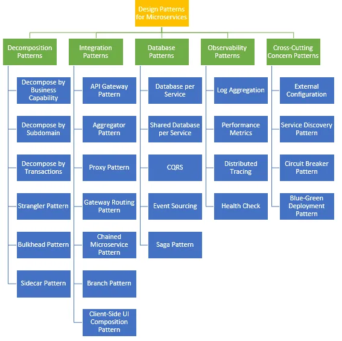

# Microservice patterns

## Decomposition patterns

1. **Decompose by Business Capability** - principle in microservices architecture. This approach involves structuring a
   system as a set of loosely coupled services, where each service is aligned with a specific business capability.
2. **Decompose by Subdomain** - Follows Domain-Driven Design (DDD) approach, decomposing systems by subdomain.
3. **Decompose by Transactions**
4. **Strangler Fig pattern**
5. **Bulkhead pattern**
6. **Sidecar pattern**

## Integration patterns

- **API Gateway Pattern:** A single entry point for all clients, routing requests to appropriate microservices.
- **Backend For Frontend (BFF):** Customized backends for different types of clients, like mobile, web, etc.
- **Service Mesh:** A dedicated infrastructure layer for handling service-to-service communication.

## Database Patterns

- **Database per Service:** Each microservice has its own database, ensuring loose coupling.
- **Shared Database:** Multiple services share the same database, which can simplify data management but reduces
  independence.
- **SAGA Pattern:** A way to manage data consistency across services in distributed transactions.

## Observability Patterns

- **Log Aggregation:** Consolidating logs from all services into a central tool for analysis.
- **Distributed Tracing:** Tracking requests across various microservices for performance monitoring.
- **Health Check API:** Implementing APIs to report the health and performance of microservices.

## Deployment Patterns

- **Blue-Green Deployment:** Reduces downtime and risk by running two identical environments.
- **Canary Releases:** Gradually rolling out changes to a small subset of users before a full rollout.
- **Containerization:** Using Docker or similar technologies for deploying microservices.

## Cross-cutting Concerns Patterns

- **Externalized Configuration:** Managing application configuration outside the service.
- **Service Discovery:** Mechanisms for services to find and communicate with each other.
- **Circuit Breaker:** Handling failures gracefully and preventing system failure due to cascading issues.

## Security Patterns

- **Access Token:** Using tokens for securing service-to-service communication.
- **Identity Propagation:** Ensuring the user's identity is passed across service boundaries for access control.

## Communication Patterns

- **Synchronous Communication (REST, gRPC):** Services communicate using synchronous protocols like REST, HTTP, gRPC.
- **Asynchronous Communication (Event-driven):** Services communicate using asynchronous messaging or event-driven
  architectures.

## Design Patterns

- **Strangler Pattern:** Gradually replacing parts of a monolithic application with microservices.
- **Anti-corruption Layer:** A way to prevent a legacy system from corrupting the design of new services.
- **Sidecar Pattern:** Deploying helper services alongside your application service, often used in service meshes.

### Testing Patterns

- **Service Virtualization:** Simulating service behavior for testing purposes.
- **Consumer-Driven Contract:** A pattern where service providers use contracts defined by service consumers.