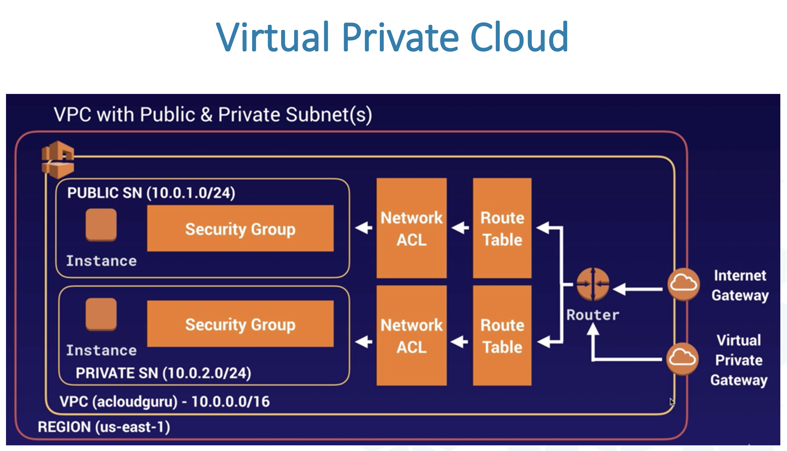
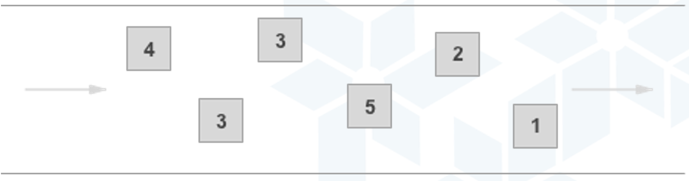

# AWS

## AWS CLI

Интерфейс командной строки AWS (AWS CLI) - это инструмент с открытым исходным кодом, который позволяет взаимодействовать со службами AWS с помощью команд в 
оболочке командной строки. При минимальной настройке интерфейс командной строки AWS позволяет запускать команды, реализующие функциональность, эквивалентную той, 
которая предоставляется консолью управления AWS на основе браузера, из командной строки в программе терминала.

Все функции администрирования, управления и доступа IaaS (Infrastructure as a service) AWS в Консоли управления AWS доступны через API AWS и интерфейс командной 
строки. Новые функции и сервисы AWS IaaS обеспечивают полную функциональность Консоли управления AWS через API и интерфейс командной строки при запуске или в 
течение 180 дней после запуска.

### Access key ID and secret access key

Ключи доступа состоят из идентификатора ключа доступа и секретного ключа доступа, которые используются для подписи программных запросов, отправляемых вами в AWS. 
Если у вас нет ключей доступа, вы можете создать их в Консоли управления AWS. Не рекомендуется использовать ключи доступа корневого пользователя учетной записи 
AWS для любых задач, где это не требуется. Вместо этого создайте нового администратора IAM с ключами доступа для себя.

Единственный раз, когда вы можете просмотреть или загрузить секретный ключ доступа, - это когда вы создаете ключи. Вы не сможете восстановить их позже. Однако вы 
можете создать новые ключи доступа в любое время. У вас также должны быть разрешения для выполнения необходимых действий IAM.

## IAM

AWS Identity and Access Management (IAM) - это веб-сервис, который помогает безопасно контролировать доступ к ресурсам AWS. Вы используете IAM, чтобы 
контролировать, кто аутентифицирован (вошел в систему) и авторизован (имеет разрешения) на использование ресурсов.

Когда вы впервые создаете учетную запись AWS, вы начинаете с единого идентификатора входа, который имеет полный доступ ко всем сервисам и ресурсам AWS в этой 
учетной записи. Это удостоверение называется root пользователем учетной записи AWS, и доступ к нему осуществляется путем входа в систему с адресом электронной 
почты и паролем, которые вы использовали для создания учетной записи. Мы настоятельно рекомендуем не использовать пользователя root для повседневных задач, даже 
для административных. Вместо этого придерживайтесь передовой практики использования пользователя root только для создания вашего первого пользователя IAM. Затем 
надежно заблокируйте учетные данные пользователя root и используйте их для выполнения лишь нескольких задач управления учетными записями и службами.

## EC2

### Security groups

- Группа безопасности действует как виртуальный брандмауэр, который контролирует трафик для одного или нескольких экземпляров EC2.
- При запуске экземпляра вы можете указать одну или несколько групп безопасности; в противном случае мы используем группу безопасности по умолчанию.
- Вы можете добавить правила к каждой группе безопасности, которые разрешают трафик к связанным экземплярам или от них.
- Вы можете изменить правила для группы безопасности в любое время; новые правила автоматически применяются ко всем экземплярам, связанным с группой безопасности.
- Правила группы безопасности всегда разрешающие; вы не можете создавать правила, запрещающие доступ.
- Правила группы безопасности позволяют фильтровать трафик на основе протоколов и номеров портов.
- Группы безопасности всегда стейтфул - если вы отправляете запрос из своего экземпляра, ответный трафик для этого запроса может поступать независимо от правил группы безопасности для входящего трафика.
- Вы можете добавлять и удалять правила в любое время. Ваши изменения автоматически применяются к экземплярам, связанным с группой безопасности.
- Когда вы связываете несколько групп безопасности с экземпляром ЕС2, правила из каждой группы безопасности эффективно объединяются для создания одного набора правил. Amazon EC2 использует этот набор правил, чтобы определить, разрешить ли доступ.

## Auto Scaling groups

Группа Auto Scaling содержит набор инстансов Amazon EC2, которые рассматриваются как логическая группа для целей автоматического масштабирования и управления.

Группа Auto Scaling также позволяет использовать такие функции Amazon EC2 Auto Scaling, как замены при проверке работоспособности и политики масштабирования. 
Как поддержание количества экземпляров в группе Auto Scaling, так и автоматическое масштабирование являются ключевыми функциями сервиса Amazon EC2 Auto Scaling.

ASG состоит из трех основных компонентов:
- Группы - логическая составляющая. Группа веб-серверов или группа приложений или группа базы данных и т. Д.
- Configuration template - группы используют шаблон запуска или конфигурацию запуска в качестве шаблона конфигурации для своих экземпляров EC2. Вы можете указать информацию в виде идентификатора AMI, типа экземпляра, пары ключей, групп безопасности и т. Д. Для ваших экземпляров.
- Параметры масштабирования - параметры масштабирования предоставляют несколько способов масштабирования ASG. Например, вы можете настроить группу для масштабирования в зависимости от наступления определенных условий (динамическое масштабирование или по расписанию.

- Варианты масштабирования:
- Всегда поддерживать текущее кол-во экземпляров
- Масштабировать вручную
- Масштабирование по расписанию
- Масштаб по запросу
- Используйте прогнозирующее масштабирование

#### Всегда поддерживать текущее кол-во экземпляров
Вы можете настроить свою ASG на постоянное поддержание определенного количества запущенных экземпляров.
Для поддержания текущего количества инстансов Amazon EC2 Auto Scaling выполняет периодическую проверку работоспособности запущенных инстансов в ASG.
Когда Amazon EC2 Auto Scaling обнаруживает неисправный инстанс, он завершает работу этого инстанса и запускает новый.

#### Масштабировать вручную
Ручное масштабирование - это самый простой способ масштабирования ваших ресурсов, при котором вы указываете только изменение максимальной, минимальной или желаемой емкости вашей группы Auto Scaling.
Amazon EC2 Auto Scaling управляет процессом создания или завершения инстансов для поддержания обновленной емкости.

#### Масштабирование по расписанию
Масштабирование по расписанию означает, что действия масштабирования выполняются автоматически в зависимости от времени и даты.
Это полезно, когда вы точно знаете, когда увеличивать или уменьшать количество экземпляров в вашей группе, просто потому, что необходимость возникает по предсказуемому графику.

#### Масштаб по запросу
Более продвинутый способ масштабирования ресурсов - использование политик масштабирования - позволяет определять параметры, управляющие процессом масштабирования.
Например, предположим, что у вас есть веб-приложение, которое в настоящее время выполняется в двух экземплярах, и вы хотите, чтобы загрузка ЦП группой Auto Scaling оставалась на уровне около 50% при изменении нагрузки на приложение.
Этот метод полезен для масштабирования в ответ на изменение условий, когда вы не знаете, когда эти условия изменятся.

## S3

Amazon S3 имеет простой интерфейс веб-сервисов, который можно использовать для хранения и извлечения любого объема данных в любое время из любого места в Интернете. Файлы могут иметь размер от 0 байт до 5 ТБ. Файлы хранятся в бакетах.

#### S3 Buckets

Бакет - это контейнер для объектов, хранящихся в Amazon S3. Каждый объект находится в бакете.

Например, если объект с именем **photos/puppy.jpg** хранится в корзине **awsbucket1** в регионе Запад США (Орегон), то для него можно использовать URL-адрес https://awsbucket1.s3.us-west-2.amazonaws.ru/photos/puppy.jpg.

#### S3 Objects
Объекты - это основные сущности, хранящиеся в Amazon S3. Думайте об объектах как о файлах.

Объект состоит из следующего:
- Key - название объекта
- Value - данные и состоит из последовательности байтов
- Version ID - для управления версиями
- Metadata - данные о данных, которые вы храните.

Управление версиями в Amazon S3 - это средство хранения нескольких вариантов объекта в одной корзине. По умолчанию управление версиями S3 отключено для сегментов, и вы должны явно включить его.

#### S3 Keys

Ключ - это уникальный идентификатор объекта в корзине. У каждого объекта в бакете есть ровно один ключ.

Сочетание бакета, ключа и идентификатора версии однозначно идентифицирует каждый объект.

Таким образом, вы можете рассматривать Amazon S3 как базовую карту данных между «бакет + ключ + версия» и самим объектом.

Каждому объекту в Amazon S3 можно присвоить URL с помощью комбинации энжпоинта, имени бакета, ключа и, при необходимости, версии.

Например, в URL-адресе https://doc.s3.amazonaws.com/2006-03-01/AmazonS3.wsdl «doc» - это имя бакета, а «2006-03-01/AmazonS3.wsdl» - ключ.

#### S3 data consistency model

Amazon S3 обеспечивает надежную согласованность операций чтения после записи для операций PUT и DELETE объектов в бакете Amazon S3 во всех регионах AWS.

Это относится как к записи в новые объекты, так и к PUT, которые перезаписывают существующие объекты, и к DELETE.

Обновления одного ключа атомарны. Например, если вы PUT к существующему ключу из одного потока и одновременно выполняете GET для того же ключа из второго потока, вы получите либо старые данные, либо новые данные, но никогда не будете частичными или поврежденными.

Amazon S3 обеспечивает высокую доступность за счет репликации данных на нескольких серверах в центрах обработки данных AWS. Если запрос PUT выполнен успешно, ваши данные будут надежно сохранены.

#### S3 storage classes

Каждый объект в Amazon S3 имеет связанный с ним класс хранилища.

Например, если вы просмотрите объекты в корзине S3, консоль показывает класс хранилища для всех объектов в списке.

Amazon S3 предлагает ряд классов хранения для хранимых вами объектов. Вы выбираете класс в зависимости от сценария использования и требований доступа к производительности.

Все эти классы хранения обеспечивают высокую долговечность.

Для случаев, когда нам нужен быстрый доступ к данным (в миллисекунды) и часто используемых данных, Amazon S3 предоставляет следующие классы хранения:
- S3 Standard - класс хранения по умолчанию. Если вы не укажете класс хранилища при загрузке объекта, Amazon S3 назначит класс хранилища S3 Standard.
- Reduced Redundancy Storage - класс хранилища с уменьшенной избыточностью (RRS) разработан для некритических, воспроизводимых данных, которые могут храниться с меньшей избыточностью, чем класс хранилища S3 Standard. AWS рекомендует НЕ использовать этот класс хранилища. Класс хранилища S3 Standard более экономичен. Для долговечности объекты RRS имеют среднегодовой ожидаемый убыток 0,01 процента объектов. Если объект RRS потерян, при запросе к этому объекту Amazon S3 возвращает ошибку 405.
- S3 Intelligent-Tiering - это класс хранилища Amazon S3, предназначенный для оптимизации затрат на хранение за счет автоматического перемещения данных на наиболее экономичный уровень доступа без дополнительных затрат на эксплуатацию. S3 Intelligent-Tiering - это идеальный класс хранилища, если вы хотите оптимизировать затраты на хранение данных с неизвестными или изменяющимися схемами доступа. Плата за поиск для S3 Intelligent-Tiering не взимается. За небольшую ежемесячную плату за мониторинг и автоматизацию объектов S3 Intelligent-Tiering отслеживает схемы доступа и автоматически перемещает объекты с одного уровня на другой.
- Классы хранения S3 Standard-IA и S3 One Zone-IA предназначены для долгоживущих и редко используемых данных. (IA означает infrequent access - нечастый доступ.). Объекты S3 Standard-IA и S3 One Zone-IA доступны для миллисекундного доступа (аналогично классу хранения S3 Standard). Amazon S3 взимает плату за извлечение этих объектов, поэтому они наиболее подходят для редко используемых данных. Например, вы можете выбрать классы хранения S3 Standard-IA и S3 One Zone-IA, чтобы сделать следующее: Для хранения резервных копий или для более старых данных, к которым обращаются нечасто, но для этого по-прежнему требуется доступ за миллисекунды. Например, при загрузке данных вы можете выбрать класс хранилища S3 Standard и использовать конфигурацию жизненного цикла, чтобы сообщить Amazon S3 о необходимости перехода объектов в класс S3 Standard-IA или S3 One Zone-IA.
- S3 Glacier и S3 Glacier Deep Archive предназначены для недорогого архивирования данных. Эти классы хранения обеспечивают такую же надежность и отказоустойчивость, как и класс хранилища S3 Standard. S3 Glacier - используется для архивов, где часть данных может потребоваться за считанные минуты. Данные, хранящиеся в классе хранилища S3 Glacier, имеют минимальный период хранения 90 дней и могут быть доступны всего за 1-5 минут с использованием ускоренного извлечения. S3 Glacier Deep Archive - используется для архивирования данных, доступ к которым требуется редко. Данные, хранящиеся в классе хранилища S3 Glacier Deep Archive, имеют минимальный период хранения 180 дней и время извлечения по умолчанию 12 часов.

## Amazon RDS

Amazon Relational Database Service упрощает настройку, эксплуатацию и масштабирование реляционной базы данных в облаке. Он обеспечивает экономичную емкость с изменяемым размером, автоматизируя трудоемкие административные задачи, такие как выделение оборудования, настройка базы данных, установка исправлений и резервное копирование.

RDS работает на виртуальных машинах. Однако вы не можете войти на эти машины. За установку исправлений для операционной системы и БД RDS отвечает Amazon. RDS не serverless. Amazon Aurora - Serverless.

#### Multi AZ deployments

Развертывания Amazon RDS в нескольких зонах доступности обеспечивают повышенную доступность и надежность для инстансов баз данных RDS, что делает их естественным образом подходящим для рабочих нагрузок рабочих баз данных.

При инициализации инстанса БД в нескольких зонах доступности Amazon RDS автоматически создает основной инстанс БД и синхронно реплицирует данные в резервный инстанс в другой зоне доступности (AZ).

В случае планового обслуживания базы данных, падения инстанса БД или отказа зоны доступности Amazon RDS автоматически переключится на резервный, чтобы операции с базой данных могли быстро возобновиться без вмешательства администратора.

Он не используется в первую очередь для повышения производительности. Для повышения производительности нам нужно использовать реплики чтения (Read Replicas).

#### Read Replicas

Реплики чтения Amazon RDS обеспечивают повышенную производительность и надежность для инстансов баз данных RDS. Они позволяют эластично масштабировать за пределы ограничений емкости одного инстанса БД для рабочих нагрузок с большим количеством операций чтения.

Вы можете создать одну или несколько реплик данного исходного инстанса БД и обслуживать большой объем трафика чтения приложений из нескольких копий ваших данных, тем самым увеличивая совокупную пропускную способность чтения.

Для движков баз данных MySQL, MariaDB, PostgreSQL, Oracle и SQL Server Amazon RDS создает второй инстанс БД, используя моментальный снимок исходного инстанса БД. Затем он использует собственную асинхронную репликацию движков для обновления реплики чтения всякий раз, когда происходит изменение исходного экземпляра БД.

#### RDS Proxy

Amazon RDS Proxy - это fully managed высокодоступный прокси-сервер базы данных для Amazon Relational Database Service (RDS), который делает приложения более масштабируемыми, более устойчивыми к сбоям базы данных и более безопасными.

Многие приложения, в том числе построенные на современных бессерверных архитектурах, могут иметь большое количество открытых подключений к серверу базы данных и могут открывать и закрывать подключения к базе данных с высокой скоростью, истощая память базы данных и вычислительные ресурсы.

Прокси-сервер Amazon RDS позволяет приложениям объединять и совместно использовать соединения, установленные с базой данных, повышая эффективность базы данных и масштабируемость приложений.

Прокси-сервер Amazon RDS можно включить для большинства приложений без изменения кода, и вам не нужно выделять дополнительную инфраструктуру или управлять ею.

#### Amazon Aurora

Amazon Aurora - это реляционная база данных, совместимая с MySQL и PostgreSQL, созданная для облака, которая сочетает в себе производительность и доступность традиционных корпоративных баз данных с простотой и экономичностью баз данных с открытым исходным кодом.

Amazon Aurora до пяти раз быстрее стандартных баз данных MySQL и в три раза быстрее стандартных баз данных PostgreSQL. Он обеспечивает безопасность, доступность и надежность коммерческих баз данных за 1/10 стоимости.

Amazon Aurora полностью управляется Amazon Relational Database Service (RDS), который автоматизирует трудоемкие административные задачи, такие как выделение оборудования, настройка базы данных, установка исправлений и резервное копирование.

Amazon Aurora имеет распределенную отказоустойчивую систему хранения с самовосстановлением, которая автоматически масштабируется до 128 ТБ на каждый экземпляр базы данных.

#### Amazon Aurora Serverless

Amazon Aurora Serverless - это конфигурация Amazon Aurora с автоматическим масштабированием по запросу. Он автоматически запускается, выключается и масштабирует емкость вверх или вниз в зависимости от потребностей вашего приложения. Это позволяет вам запускать вашу базу данных в облаке, не управляя емкостью базы данных.

Управление емкостью базы данных вручную может занять драгоценное время и может привести к неэффективному использованию ресурсов базы данных. Используя Aurora Serverless, вы просто создаете конечную точку базы данных, при желании указываете желаемый диапазон емкости базы данных и подключаете свои приложения.

Вы платите посекундно за емкость базы данных, которую используете, когда база данных активна, и переходите между стандартной и бессерверной конфигурациями с помощью нескольких щелчков мышью в консоли управления Amazon RDS.

## DynamoDB

Amazon DynamoDB - это база данных «ключ-значение» и документов, которая обеспечивает производительность в миллисекундах, измеряемую одним числом, в любом масштабе. Это полностью управляемая, многорегиональная, многоактивная, надежная база данных со встроенными функциями безопасности, резервного копирования и восстановления, а также кэширования в памяти для приложений интернет-масштаба.

DynamoDB может обрабатывать более 10 триллионов запросов в день и может поддерживать пики более 20 миллионов запросов в секунду.

DynamoDB является serverless - с DynamoDB нет серверов, которые нужно предоставлять, исправлять или управлять, и нет программного обеспечения для установки, обслуживания или эксплуатации. DynamoDB автоматически масштабирует таблицы в соответствии с емкостью и поддерживает производительность без необходимости администрирования. Доступность и отказоустойчивость встроены, что устраняет необходимость в архитектуре ваших приложений для этих возможностей.

#### How does DynamoDB work?

DynamoDB выглядит так же, как JSON, с той лишь разницей, что каждая запись JSON должна включать KEY записи. Это имеет то преимущество, что позволяет вам обновлять запись.

В базе данных JSON, такой как MongoDB, вы не можете обновлять записи. Вместо этого вы должны удалить их, а затем снова добавить измененную версию, чтобы произвести такое же изменение.

DynamoDB также позволяет работать с транзакциями, что также поддерживает MongoDB.

Вы работаете с базой данных с помощью клиента командной строки AWS, API-интерфейсов для различных языков программирования, их рабочего стола NoSQL Workbench или на веб-сайте Amazon AWS.

Обратите внимание, что вы просто создали ключ. Это потому, что это JSON, что означает отсутствие структуры или схемы. Так что все остальные атрибуты могут быть любыми.

#### DynamoDB Definitions

- Table: набор предметов
- Item: набор атрибутов. (В других базах данных эти записи называются документами.)
- Stream: как кеш, в котором хранятся изменения в памяти до тех пор, пока они не будут сброшены в хранилище.
- Partition key: первичный ключ. Он должен быть уникальным.
- Partition key and sort key: составной первичный ключ, то есть ключ раздела с несколькими атрибутами, такими как имя сотрудника и идентификатор сотрудника (необходимо, потому что два сотрудника могут иметь одно и то же имя).
- Secondary indices: вы можете индексировать другие атрибуты, которые вы часто запрашиваете, для ускорения чтения.

#### API and SDK

Как и большинство облачных систем, DynamoDB предоставляет свои сервисы через веб-сервисы.

Но это не значит, что вам нужно отформатировать данные в JSON, а затем опубликовать их с помощью HTTP. Вместо этого они предоставляют комплекты для разработки программного обеспечения (SDK).

SDK принимает запросы, которые вы ему отправляете, а затем незаметно преобразует их в HTTP-вызовы. Таким образом, SDK обеспечивает более естественный и менее многословный способ работы с базой данных.

SDK позволяет работать с DynamoDB так же, как и с обычными объектами.

Как и в случае с другими продуктами Amazon, вы можете использовать клиент командной строки AWS. Это позволяет запускать операции с базой данных из командной строки без необходимости писать программу. Вы используете JSON для работы с DynamoDB.

Например, вот эти операции:
aws Dynamodb create-table
aws Dynamodb put-item

## VPC

Amazon Virtual Private Cloud (Amazon VPC) - это сервис, который позволяет запускать ресурсы AWS в логически изолированной виртуальной сети, которую вы определяете.

У вас есть полный контроль над виртуальной сетевой средой, включая выбор собственного диапазона IP-адресов, создание подсетей и настройку таблиц маршрутизации и сетевых шлюзов.

Amazon VPC - один из основных сервисов AWS, который упрощает настройку конфигурации сети вашего VPC. Вы можете создать общедоступную подсеть для своих веб-серверов, имеющих доступ к Интернету. Он также позволяет размещать серверные системы, такие как базы данных или серверы приложений, в частной подсети без доступа к Интернету. Взаимодействие с другими людьми

Amazon VPC позволяет использовать несколько уровней безопасности, включая группы безопасности и списки управления доступом к сети, чтобы контролировать доступ к инстансам Amazon EC2 в каждой подсети.

С помощью VPC можно:
- Запускать экземпляры в выбранной вами подсети (subnet).
- Назначать настраиваемые диапазоны IP-адресов в каждой подсети.
- Настраивать таблицы маршрутизации между подсетями.
- Создать интернет-шлюз и подключите его к нашему VPC
- Намного лучший контроль безопасности над вашими ресурсами AWS.
- Группы безопасности инстансов.
- Списки управления доступом к сети подсети

#### Default vs Custom VPC
- VPC по умолчанию удобен для пользователя, что позволяет немедленно развертывать экземпляры,
- Все подсети в VPC по умолчанию имеют отношение к Интернету.
- Каждый экземпляр EC2 имеет как публичный, так и частный IP-адрес.

## SQS

Amazon Simple Queue Service (SQS) - это полностью управляемая служба очередей сообщений, которая позволяет разделять и масштабировать микросервисы, распределенные системы и бессерверные приложения.

SQS предлагает два типа очередей сообщений:
- Стандартные очереди предлагают максимальную пропускную способность, упорядоченность не гарантированна и доставку по крайней мере один раз (at least once).
- Очереди SQS FIFO предназначены для того, чтобы гарантировать, что сообщения обрабатываются ровно один раз (exactly once) в точном порядке их отправки.

#### Standard queues

- Неограниченная пропускная способность: стандартные очереди поддерживают почти неограниченное количество транзакций в секунду (TPS) на каждое действие API.
- Доставка по крайней мере один раз (at least once): сообщение доставляется хотя бы один раз, но иногда доставляется более одной копии сообщения.
- Упорядочивание с максимальной эффективностью: иногда сообщения могут доставляться в порядке, отличном от того, в котором они были отправлены.

Вы можете использовать стандартные очереди сообщений во многих сценариях, если ваше приложение может обрабатывать сообщения, которые поступают более одного раза и не по порядку, например:
- Отделите текущие запросы пользователей от интенсивной фоновой работы: разрешите пользователям загружать медиафайлы, изменяя их размер или кодируя.
- Распределите задачи по нескольким рабочим нодам: обрабатывайте большое количество запросов на проверку кредитных карт.
- Пакетные сообщения для обработки в будущем: запланировать добавление нескольких записей в базу данных.

#### FIFO queues

- Высокая пропускная способность: по умолчанию очереди FIFO поддерживают до 300 сообщений в секунду (300 операций отправки, получения или удаления в секунду).
- Точно-однократная обработка: сообщение доставляется один раз и остается доступным до тех пор, пока потребитель не обработает и не удалит его. Дубликаты не помещаются в очередь.
- Доставка в порядке очереди: порядок отправки и получения сообщений строго сохраняется.

Очереди FIFO предназначены для улучшения обмена сообщениями между приложениями, когда порядок операций и событий является критическим или когда дублирование недопустимо, например:
- Убедитесь, что команды, вводимые пользователем, выполняются в правильном порядке.
- Отображайте правильную цену продукта, отправляя изменения цен в правильном порядке.
- Запретить студенту записаться на курс до регистрации учетной записи.

## SNS

Amazon Simple Notification Service (Amazon SNS) - это полностью управляемая служба обмена сообщениями для обмена сообщениями между приложениями (application-to-application A2A) и между приложениями и человеком (application-to-person A2P).

Функциональность A2A pub/sub предоставляет топики для высокопроизводительного обмена сообщениями типа «многие ко многим» между распределенными системами, микросервисами и бессерверными приложениями, управляемыми событиями.

Используя топики Amazon SNS, ваши publisher-ы могут разветвлять сообщения большому количеству систем подписчиков, включая очереди Amazon SQS, функции AWS Lambda и конечные точки HTTPS, для параллельной обработки и Amazon Kinesis Data Firehose. Взаимодействие с другими людьми

Функциональность A2P позволяет отправлять сообщения пользователям в любом масштабе с помощью SMS, мобильных push-уведомлений и электронной почты.

#### Standard topic

- Стандартные топики могут использоваться во многих сценариях, если ваше приложение может обрабатывать сообщения, которые поступают более одного раза и не по порядку, например: разветвление сообщений для кодирования мультимедиа, обнаружение мошенничества, расчет налогов, поисковый индекс и критические системы оповещения.
- Максимальная пропускная способность: стандартные темы поддерживают почти неограниченное количество сообщений в секунду.
- Оптимальный порядок: иногда сообщения могут доставляться в порядке, отличном от того, в каком они были опубликованы.
- Максимальная дедупликация: сообщение доставляется хотя бы один раз, но иногда доставляется более одной копии сообщения.
- Несколько типов подписки: сообщения можно отправлять на различные конечные точки (Amazon SQS, AWS Lambda, веб-перехватчики HTTPS, SMS, мобильные push-уведомления и электронная почта).
- Разветвление сообщений: каждая учетная запись может поддерживать 100 000 стандартных топиков, а каждая тема поддерживает до 12,5 миллионов подписок.

#### FIFO topic

- Темы FIFO предназначены для улучшения обмена сообщениями между приложениями, когда порядок операций и событий является критическим или когда дублирование недопустимо, например: разветвление сообщений для ведения журнала банковских транзакций, мониторинг запасов, отслеживание полетов, управление запасами.
- Высокая пропускная способность: темы FIFO поддерживают до 300 сообщений в секунду или 10 МБ в секунду для каждой темы FIFO (в зависимости от того, что наступит раньше).
- Строгий порядок: порядок, в котором сообщения публикуются и доставляются, строго сохраняется (т. Е. В порядке очереди).
- Строгая дедупликация: повторяющиеся сообщения не доставляются. Дедупликация происходит в течение 5-минутного интервала с момента публикации сообщения.
- Подписки SQS FIFO: сообщения можно отправлять в очереди FIFO.
- Разветвление сообщений: каждая учетная запись может поддерживать 1000 топиков FIFO, а каждая тема поддерживает до 100 подписок.

#### SQS vs SNS

- Amazon Simple Queue Service (SQS) и Amazon SNS - это сервисы обмена сообщениями в AWS, которые предоставляют разработчикам разные преимущества.
- Amazon SNS позволяет приложениям отправлять критические по времени сообщения нескольким подписчикам с помощью механизма «push», устраняя необходимость периодической проверки или «опроса» обновлений.
- Amazon SQS - это служба очереди сообщений, используемая распределенными приложениями для обмена сообщениями с помощью модели опроса, и может использоваться для разделения компонентов отправки и получения.
- Amazon SQS обеспечивает гибкость распределенных компонентов приложений для отправки и получения сообщений, не требуя, чтобы каждый компонент был одновременно доступен.
- Распространенным шаблоном является использование SNS для публикации сообщений в очередях Amazon SQS для надежной асинхронной отправки сообщений одному или нескольким системным компонентам.
