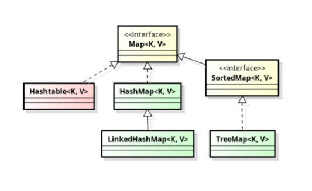

# Collections API

## Иерархия




## Что такое коллекция?
Структура данных для хранения однотипных элементов.

## Что такое Java Collections framework? Преимущества

Java Collections framework предоставляет стандартный способ управления группой объектов.

**Преимущества**:
- Производительность. Такие классы как `ArrayList`, `LinkedList`, `HashSet` и тд. являются очень эффективными.
- Дефолтная реализация основных сценариев. Не нужно изобретать велосипед.
- Обеспечивает совместимость. К примеру если вы используете интерфейс `List`, любая реализация, реализующая интерфейс `List`, может быть заменена 
на существующую.
- Если мы хотим реализовать кастомную коллекцию это просто сделать - нужно всего-лишь реализовать один из интерфейсов `Collections API`.

## Интерфейс Collection

Интерфейс `Collection` — это то место, откуда берут начало все коллекции. `Collection` — это идея, это представление о том, как должны себя вести 
все коллекции. Поэтому, термин "коллекция" выражен в виде интерфейса. Естественно, интерфейсу нужны реализации.

## Почему дженерики полезны в коллекциях?

До  java 5 в коллекциях всё хранилось в виде ссылок на объекты. Это было небезопасно (в коллекции можно было хранить сущности разных типов) и при этом 
нужно было вручную типизировать объекты при получении. С  дженериками появилась возможность хранить данные в коллекции только указанных типов. 
Тем самым мы обеспечиваем **Type Safety**. 

## Чем полезен autoboxing?

Коллекции не могут хранить примитивы. Поэтому при добавлении примитивного типа происходит `autoboxing` до типа объекта. `list.add(1)` = `list.add(new Integer(1));`. До java 5 это нужно было делать вручную.

## Какое условие использования foreach?
		
Любая коллекция должна реализовать интерфейс `Iterable`.

## Что нового пришло с Java 8?

- Stream API.
- Новые методы добавлены к утилитному классу `Collections`: `replaceAll()`, `getOrDefault()`, `putIfAbsent()` для `Map`.
- Реализация `HashMap`, `LinkedHashMap` и `ConcurrentHashMap` изменена для уменьшения коллизий хешей. Вместо связанного списка используется 
сбалансированное дерево для хранения записей после достижения определенного порога.

## Что такое RandomAccess interface?

Интерфейс `RandomAccess` - это интерфейс маркер, используемый реализациями `List` для указания того, что они поддерживают быстрый произвольный доступ 
(обычно за константное время). Обратите внимание, что использование его с последовательным списком доступа, таким как `LinkedList`, 
приведет к увеличению времени доступа к определенному элементу.

Реализации: `ArrayList`, `CopyOnWriteArrayList`, `Stack`, `Vector`.

## В чем разница между Collection и Collections?

`Collection` - базовый интерфейс. 

`Collections` - утилитный класс со статическими методами для работы с коллекциями. Примеры методов: `sort()`, `reverse()`, `binarySearch()`.

## Потокобезопасность

До Java 1.2 все классы коллекций были потокобезопасными (все методы были синхронизированы) - `Vector`, `Stack`, `HashTable`. 
С выходом Java 1.2 всё изменилось, добавились новые классы, которые были не потокобезопасными - `ArrayList`, `HashSet` и тд.
Классы в пакете `java.util.concurrent`, такие как `ConcurrentHashMap`, `CopyOnWriteArrayList` также потокобезопасны, но с другой реализацией, 
которая не требует синхронизации всех методов.

## Как сделать коллекцию thread safety?

Каждый класс из классов коллекций содержит статический метод для преобразования:

```java
public static <T> Collection<T> synchronizedCollection(Collection<T> c);
public static <T> Set<T> synchronizedSet(Set<T> s);
public static <T> List<T> synchronizedList(List<T> list);
public static <K,V> Map<K,V> synchronizedMap(Map<K,V> m);
public static <T> SortedSet<T> synchronizedSortedSet(SortedSet<T> s);
public static <K,V> SortedMap<K,V> synchronizedSortedMap(SortedMap<K,V> m);
```

## Как сделать коллекцию immutable?
Та же самая история.

```java
public static <T> Collection<T> unmodifiableCollection(Collection<? extends T> c);
public static <T> Set<T> unmodifiableSet(Set<? extends T> s);
public static <T> List<T> unmodifiableList(List<? extends T> list);
public static <K,V> Map<K, V> unmodifiableMap(Map<? extends K, ? extends V> m);
public static <T> SortedSet<T> unmodifiableSortedSet(SortedSet<? extends T> s);
public static <K,V> SortedMap<K, V> unmodifiableSortedMap(SortedMap<K, ? extends V> m);
```

## Как удалить дубликаты из коллекции?

Создать `Set` из этой коллекции, потом очистить оригинальную коллекцию с помощью `clear()`, затем добавить в неё все элементы из set с помощью `addAll()`. 
При этом стоить помнить, что порядок вставки в таком случае сохранен не будет из-за использования `HashSet`.

## Как отсортировать лист?

```java
List<Lol> lol = List.of(........);
lol.sort(Comparator.comparing(Lol::getName).reversed());
```

## Что за интерфейс Deque?

`Deque` - это интерфейс в Java, который расширяет интерфейс очереди и обеспечивает поддержку вставки и удаления элементов на обоих направлениях. 
Название `deque` является сокращением от «**двусторонняя очередь**».
Некоторыми из реализующих классов интерфейса `Deque` являются `LinkedList`, `ConcurrentLinkedDeque`, `LinkedBlockingDeque`. 
Обратите внимание, что методы `addFirst()` и `addLast()`, предоставляемые в реализации `LinkedList`, определяются интерфейсом `Deque`.

## Упорядоченные и неупорядоченные коллекции (ordered)

`List` - упорядоченные (поддерживается порядок вставки), `Set` - неупорядоченные. В отсортированных коллекциях порядок зависит от значения элемента. 

## Iterator VS ListIterator

- `Iterator` может быть получен в любом классе `Collection`, например, `List` или `Set`. Но `ListIterator` может использоваться только для обхода списков.
- `Iterator` перемещается только в одном направлении, используя метод `next()`. `ListIterator` может выполнять итерацию в обоих направлениях, 
используя методы `next()` и `previous()`.
- `Iterator` всегда запускается в начале коллекции. `ListIterator` можно получить в любом месте: `ListIterator<Integer> ltr = numberList.listIterator(3);`
- `ListIterator` предоставляет метод `add(E e)`, которого нет в `Iterator`. `add(E e)` вставляет указанный элемент в список. Метод `add(E e)` отсутствует 
в `Iterator`, потому что итератор может использоваться для любых коллекций - к примеру `Set` не гарантирует порядок вставки элементов. 
Именно поэтому метод и отсутствует. В то время как все коллекции `List` гарантируют порядок вставки.
- `ListIterator` также предоставляет метод `set(E e)`, он заменяет последний элемент, возвращаемый функцией `next()` или `previous()`, указанным элементом.

## Что значит fail-fast iterator? (не отказоустойчивый)

**Fail-fast** `iterator` это не отказоустойчивый итератор. То есть он **генерирует** `ConcurrentModificationException` исключение при одном 
из следующих двух условий:
- В многопоточной среде, если один поток пытается изменить коллекцию, в то время как другой поток итерирует по ней.
- Даже с одним потоком, если поток изменяет коллекцию напрямую, в то время как он выполняет итерацию по коллекции с помощью итератора, 
работающего без сбоев, итератор сгенерирует это исключение.

Не отказоустойчивый итератор сгенерирует исключение `ConcurrentModificationException`, если базовая коллекция будет изменена структурно каким-либо образом,
кроме как через собственные методы удаления или добавления итератора (если применимо, как в `ListIterator`).

Обратите внимание, что **структурная модификация** - это любая операция, которая добавляет или удаляет один или несколько элементов; 
простая установка значения элемента (в случае списка) или изменение значения, связанного с существующим ключом (в случае карты), 
не является структурной модификацией.

## Что значит fail-safe iterator? (отказоустойчивый)

В случае **fail-safe** итератора `ConcurrentModificationException` **не генерируется**, так как отказоустойчивый итератор делает копию базовой структуры, 
и итерация выполняется над этим снимком. Поскольку итерация выполняется над копией коллекции, вмешательство невозможно, и итератор гарантированно 
не генерирует исключение `ConcurrentModificationException`.

**Недостатком** использования копии коллекции, а не исходной коллекции, является то, что итератор может не отражать добавления, удаления или изменения 
в коллекции с момента создания итератора. Операции изменения элементов на самих итераторах (удаление, установка и добавление) не поддерживаются. 
Эти методы генерируют исключение `UnsupportedOperationException`.

Итератор `CopyOnWriteArrayList` является примером **fail-safe** итератора в Java, также итератор, предоставляемый `ConcurrentHashMap keySet`, 
является fail-safe и никогда не вызывает исключение `ConcurrentModificationException`.

## fail-fast VS fail-safe iterators

- fail-fast итератор создает исключение `ConcurrentModificationException`, если базовая коллекция структурно модифицирована, 
тогда как fail-safe не создает исключение `ConcurrentModificationException`.
- fail-fast не создает копию коллекции, тогда как fail-safe итератор создает копию базовой структуры, и итерация выполняется над этим снимком.
- fail-fast предоставляет такие операции, как `remove()`, (`set()` и `add()` в случае `ListIterator`), тогда как в случае fail-safe итераторов операции 
по изменению элемента на самих итераторах (`remove()`, `set()` и `add()`) не поддерживаются. Эти методы генерируют исключение `UnsupportedOperationException`.

# List

## ArrayList

`List` представляет собой упорядоченную последовательность значений, в которой некоторое значение может встречаться более одного раза.

`ArrayList` - одна из реализаций `List`, построенных на основе массива, который может динамически увеличиваться и уменьшаться по мере добавления/удаления
элементов. К элементам можно было легко получить доступ по их индексам, начиная с нуля. Элементы ArrayList могут быть абсолютно любых типов в том числе и
`null`.

Если размер текущих элементов (включая новый элемент, добавляемый в список `ArrayList`) больше максимального размера массива, размер массива увеличивается
автоматически. Но, как мы знаем, размер массива в java нельзя увеличивать динамически. Под капотом `ArrayList` создается новый массив, 
а старый массив копируется в новый.


#### Какая структура используется внутри?

Внутри `ArrayList` использует массив `Object[]`. Все операции добавления, удаления и обхода происходят в этом массиве.

```java
/**
 * The array buffer into which the elements of the ArrayList are stored.
 * The capacity of the ArrayList is the length of this array buffer. Any
 * empty ArrayList with elementData == DEFAULTCAPACITY_EMPTY_ELEMENTDATA
 * will be expanded to DEFAULT_CAPACITY when the first element is added.
 */
transient Object[] elementData; // non-private to simplify nested class access
```

В Java 8 ключевое слово `private` перед объйвлением этого массива удалено для обеспечения доступа к вложенному классу, то есть `Itr`, `ListItr`, `SubList`.
 
#### Что такое capacity?

`capacity` для `ArrayList` - это длина массива `elementData`.

#### Инициализация листа

Если вызывается конструктор без параметров, то по умолчанию будет создан массив из 0 элементов (`capacity`) типа `Object` (с приведением к дженерик типу,
разумеется). Но при добавлении первого элемента будет выделиться память для 10 элементов.

Вы можете использовать конструктор `ArrayList(int capacity)` и указать свою начальную емкость списка. Если передать значение меньше 0, то будет проброшено 
`IllegalArgumentException("Illegal Capacity: ")`

#### Добавление элементов

Внутри метода `add(value)` происходят следующие вещи:

1. проверяется, достаточно ли места в массиве для вставки нового элемента. `ensureCapacityInternal(size + 1);`
2. добавляется элемент в конец (согласно значению `size`) массива. `elementData[size++] = element;`

Весь метод `ensureCapacityInternal(minCapacity)` рассматривать не будем, остановимся только на паре интересных мест. Если места в массиве не достаточно, 
новая емкость рассчитывается по формуле: `oldCapacity + (oldCapacity>>1)`. То есть каждый раз + 50% от предыдущей емкости.

#### Добавление элементов в середину

1. проверяется, достаточно ли места в массиве для вставки нового элемента. `ensureCapacityInternal(size + 1);`
2. подготавливается место для нового элемента. Все элементы переносятся на один индекс вперед.
3. перезаписывается значение у элемента с указанным индексом. `elementData[index] = element;`

Как можно догадаться, в случаях, когда происходит вставка элемента по индексу и при этом в вашем массиве нет свободных мест, то копирование массива случится
дважды: первый раз в `ensureCapacityInternal()`, второй в самом методе `add(index, value)`, что явно скажется на скорости всей операции добавления.
В случаях, когда в исходный список необходимо добавить другую коллекцию, да еще и в «середину», стоит использовать метод `addAll(index, Collection)`. 
Это будет гораздо быстрее поэлементного добавления.

#### Удаление элементов

С удалением элемента по индексу всё достаточно просто

1. Сначала определяется какое количество элементов надо скопировать: `int numMoved = size - index - 1;`
2. Затем копируем сдвигаем эти элементты на `n` позиций влево. 
3. Уменьшаем размер массива и забываем про последниe элементs `elementData[--size] = null; // Let gc do its work`

При удалении по значению, в цикле просматриваются все элементы списка, до тех пор пока не будет найдено соответствие. 
Удален будет лишь первый найденный элемент.

При удалении элементов текущая величина `capacity` не уменьшается, что может привести к своеобразным утечкам памяти. 
Поэтому не стоит пренебрегать методом `trimToSize()`.

#### Производительность

- `add("val")` - если массив не нужно расширять, значит константное время `O(1)`. Если нужно расширить, то в худшем случае `O(n)`.
- `add(1, "val")` - линейное время `O(n)` 
- `get(1)` - всегда константное время `O(1)`.
- `remove(1)` - линейное время `O(n)`.
Удаление по индексу. Если вы удаляете, используя метод `remove(int index)`, то в случае `ArrayList` получение этого индекса происходит быстро, но удаление 
будет означать перетасовку оставшихся элементов, чтобы заполнить пробел, созданный удаленным элементом в базовом массиве. Он варьируется от `O(1)` для удаления последнего элемента до `O(n)`.
- `indexOf()` - линейное время `O(n)`
Он выполняет итерацию по внутреннему массиву и проверяет каждый элемент один за другим. Таким образом, временная сложность для этой операции всегда 
требует `O(n)` времени.
- `contains()` – реализация основана на `indexOf()`. Таким образом, он также будет работать за линейное время `O(n)`. 

## LinkedList

`LinkedList` — реализует интерфейс `List` и интерфейс `Deque`. Является представителем двунаправленного списка, где каждый элемент структуры содержит 
указатели на предыдущий и следующий элементы. Итератор поддерживает обход в обе стороны. Реализует методы получения, удаления и вставки в начало, 
середину и конец списка. Позволяет добавлять любые элементы в том числе и `null`.


При добавлении первого элемента, first and last ссылки ссылаются на него, т.е. они равны.

В реализации класса `LinkedList` в Java есть `private class Node`, который обеспечивает структуру для узла в двусвязном списке. 
Он имеет переменную `item` для хранения значения и две ссылки на сам класс `Node` для подключения к следующему и предыдущему элементам.

#### Метод linkFirst() 

`linkFirst()` используется для добавления элемента в начало списка и реализован в классе `LinkedList` следующим образом

```java
private void linkFirst(E e) {
    final Node<E> f = first;
    final Node<E> newNode = new Node<>(null, e, f);
    first = newNode;
    if (f == null)
        last = newNode;
    else
        f.prev = newNode;
    size++;
    modCount++;
}
```

Здесь еще одна важная вещь, о которой следует упомянуть, - это ссылки на первый и последний элемент класса `Node`, 
которые всегда относятся к первому и последнему элементу связанного списка.

```java
/**
 * Pointer to first node.
 * Invariant: (first == null && last == null) ||
 *            (first.prev == null && first.item != null)
 */
transient Node<E> first;

/**
 * Pointer to last node.
 * Invariant: (first == null && last == null) ||
 *            (last.next == null && last.item != null)
 */
transient Node<E> last;
```

С помощью этой информации легко увидеть, что в методе `linkFirst()`, когда самый первый элемент вставляется в список, то ссылки `first` и `last` будут ссылаться на него.

#### Метод linkLast()

`linkLast()` используется для вставки элемента в качестве последнего элемента списка. В этом случае элемент, который в настоящее время является последним 
элементом связанного списка, станет предпоследним узлом.

```java
void linkLast(E e) {
    final Node<E> l = last;
    final Node<E> newNode = new Node<>(l, e, null);
    last = newNode;
    if (l == null)
        first = newNode;
    else
        l.next = newNode;
    size++;
    modCount++;
}
```

#### Метод add()

`add(int index, E element)` используется для вставки указанного элемента в указанную позицию в этом списке.

```java
public void add(int index, E element) {
    checkPositionIndex(index);

    if (index == size)
        linkLast(element);
    else
        linkBefore(element, node(index));
}

void linkBefore(E e, Node<E> succ) {
    // assert succ != null;
    final Node<E> pred = succ.prev;
    final Node<E> newNode = new Node<>(pred, e, succ);
    succ.prev = newNode;
    if (pred == null)
        first = newNode;
    else
        pred.next = newNode;
    size++;
    modCount++;
}
```

Метод `node(index)` - используется для получения существующего элемента по заданному индексу:

```java
Node<E> node(int index) {
   // assert isElementIndex(index);

   if (index < (size >> 1)) {
      Node<E> x = first;
      for (int i = 0; i < index; i++)
          x = x.next;
      return x;
   } else {
      Node<E> x = last;
      for (int i = size - 1; i > index; i--)
          x = x.prev;
      return x;
   }
}
```

#### В чем же заключаются выгоды от использования LinkedList?

Прежде всего, **в работе с серединой списка**. Вставка и удаление в середину `LinkedList` устроены гораздо проще, чем в `ArrayList`. 
Мы просто переопределяем ссылки соседних элементов, а ненужный элемент “выпадает” из цепочки ссылок.

В то время как в `ArrayList` мы:
- проверяем, хватает ли места (при вставке)
- если не хватает — создаем новый массив и копируем туда данные (при вставке)
- удаляем/вставляем элемент, и сдвигаем все остальные элементы вправо/влево (в зависимости от типа операции). Причем сложность этого процесса сильно зависит
от размера списка. Одно дело — скопировать/сдвинуть 10 элементов, и совсем другое — сделать то же самое с миллионом элементов.
То есть, если в твоей программе чаще происходят операции вставки/удаления с серединой списка, `LinkedList` должен быть быстрее, чем `ArrayList`.

На практике дела обстоят следующим образом

```java
public class Main {
   public static void main(String[] args) {
       listTest(new LinkedList<>());
       listTest(new ArrayList<>());
   }
   
   public static void listTest(List<Integer> list) {
       for (int i = 0; i < 5_000_000; i++) {
           list.add(new Integer(i));
       }

       long start=System.currentTimeMillis();

       for(int i=0;i<100;i++){
           list.add(2_000_000, new Integer(Integer.MAX_VALUE));
       }
       System.out.println("Время работы (в милисекундах) = " + (System.currentTimeMillis()-start));
   }
}

// Вывод
// Время работы (в милисекундах) = 1873  #LinkedList
// Время работы (в миллисекундах) = 181  #ArrayList
```

Неожиданно! Казалось бы, мы проводили операцию, где `LinkedList` должен быть намного эффективнее — вставку 100 элементов в середину списка. Да и список у нас
огромный — 5000000 элементов: `ArrayList`’у приходилось сдвигать по паре миллионов элементов каждый раз при вставке!

В чем же причина его победы?
Во-первых, доступ к элементу осуществляется в `ArrayList` за фиксированное время. Когда ты указываешь: 

```java
list.add(2_000_000, new Integer(Integer.MAX_VALUE));
```

то в случае с `ArrayList` `2_000_000` это конкретный адрес в памяти, ведь у него внутри массив.

В то время как у `LinkedList` массива нет. Он будет искать элемент номер `2_000_000` по цепочке ссылок. Для него это не адрес в памяти, 
а ссылка, до которой еще надо дойти:

```java
fistElement.next.next.next.next.next.next.next.next.next.next.next.next.next.next.next.next.next.next........
```

В итоге при каждой вставке (удалении) в середине списка `ArrayList` уже знает точный адрес в памяти, к которому он должен обратиться, 
а вот `LinkedList`’у еще надо до нужного места “дотопать”.

Во-вторых, дело в структуре самого `ArrayList`’a. Расширение внутреннего массива, копирование всех элементов и сдвиг элементов осуществляет специальная 
внутренняя функция — `System.arrayCopy()`. Она работает очень быстро, потому что специально оптимизирована для этой работы.

А вот в ситуациях, когда “топать” до нужного индекса не нужно, `LinkedList` действительно показывает себя лучше. Например, если вставка происходит в начало
списка.

Попробуем вставить туда миллион элементов:

```java
public class Main {

   public static void main(String[] args) {
       getTimeMsOfInsert(new ArrayList());
       getTimeMsOfInsert(new LinkedList());
   }

   public static long getTimeMsOfInsert(List list) {
       //напишите тут ваш код
       Date currentTime = new Date();
       insert1000000(list);
       Date newTime = new Date();
       long msDelay = newTime.getTime() - currentTime.getTime(); //вычисляем разницу
       System.out.println("Результат в миллисекундах: " + msDelay);
       return msDelay;

   }

   public static void insert1000000(List list) {
       for (int i = 0; i < 1000000; i++) {
           list.add(0, new Object());
       }
   }

}

// Вывод
// Результат в миллисекундах: 43448  #ArrayList
// Результат в миллисекундах: 107    #LinkedList
```

Совсем другой результат! На вставку миллиона элементов в начало списка `ArrayList` затратил больше 43 секунд, в то время как `LinkedList` справился за 
0,1 секунды!

Сказался именно тот факт, что в этой ситуации `LinkedList`’у не пришлось “пробегать” каждый раз по цепочке ссылок до середины списка. 
Он сразу находил нужный индекс в начале списка, а там уже разница в принципах работы была на его стороне.

Главное, что нужно запомнить:
- Не все преимущества той или иной коллекции “на бумаге” будут действовать в реальности.
- Не стоит бросаться в крайности при выборе коллекции (“`ArrayList` всегда быстрее, используй его и не ошибешься. `LinkedList` давно никто не пользуется”).

Хотя даже создатель `LinkedList` Джошуа Блох так говорит.

Тем не менее, эта точка зрения верна далеко не на 100%, и мы в этом убедились. В нашем предыдущем примере `LinkedList` отработал в 400 (!) раз быстрее. 
Другое дело, что ситуаций, когда `LinkedList` будет лучшим выбором, действительно немного. Но они есть, и в нужный момент `LinkedList` может тебя серьезно
выручить.

## ArrayList VS LinkedList

- `LinkedList` реализован с использованием концепции двусвязного списка, в то время как `ArrayList` внутри использует массив объектов, 
размер которых можно динамически изменять.
- У `ArrayList` есть понятие `capacity` и соответствующий конструктор для этого, в `LinkedList` такого нет.
Это означает, что если элементы добавляются в конец, а емкость не нарушается, то `ArrayList` будет работать быстрее, поскольку у него уже есть начальная
емкость, и ему просто нужно добавить этот элемент в индекс в базовом массиве. В то время как в `LinkedList`, должен быть создан новый объект класса `Node`, 
и ссылки на `next` и `prev` должны быть скорректированы с учетом нового элемента.
- Еще одно отличие состоит в том, что реализация `LinkedList` предоставляет `descendingIterator()`, который происходит от реализации интерфейса `Deque`.
`descendingIterator()` возвращает итератор для элементов в этой очереди в обратной последовательности. В `ArrayList` такого итератора нет.

#### Сравнение производительности

- Добавление элемента в конец
для `LinkedList О(1)` потому что мы берем последний элемент, создаем ноду и линкуем её с последним элементом
для `ArrayList` от `О(1)` до `O(n)`. Eсли не нужно менять `capacity` тогда константное время, иначе линейное.
- Вставка в середину
Для `LinkedList O(n)` потому что нам нужно проитерироваться по (n/2) кол-ву элементов. Либо от начала до середины, либо от конца до середины. 
Потом нужно создать ноду и залинковать её с соседними элементами.
Для `ArrayList O(n)` потому что нужно сместить все элементы справа на одну ячейку. и потом записать наш элемент.
- Вставка в начало
Для `LinkedList O(1)` потому что мы просто берем первый элемент и линкуем его с новой нодой.
Для `ArrayList О(n)` потому что нужно сместить все объекты на одну ячейку. и потом записать наш элемент.
- Получение 
Для `ArrayList` всегда `O(1)`
Для `LinkedList` первый и последний `O(1)`, по индексу `O(n/2) ~ O(n)`
- Удаление
Для `ArrayList` последний `O(1)`, остальные `O(n)` потому что нужно каждый раз смещать объекты на один индекс. В целом можно сказать, что это `O(n - index)`
Для `LinkedList` первый и последний `O(1)`, остальные `O(n)` по индексу `O(n/2) ~ O(n)`
- Удаление через итератор
Для `ArrayList` последний `O(1)`, остальные `O(n)` потому что нужно каждый раз смещать объекты на один индекс. В целом можно сказать, что это `O(n - index)`
Для `LinkedList` первый и последний `O(1)`. Тут быстрее, потому что итератор уже содержит текущий элемент в себе.


## ArrayList VS Vector 

`Vector` - устаревший класс, является потокобезопасным (он синхронизирован) - из-за этого работает медленно. `ArrayList` каждый раз увеличивается на 50%,
вектор в два раза.

Для обхода `ArrayList` используется итератор. Для обхода вектора можно использовать `Iterator/Enumerator`. Обратите внимание, что `Iterator` является 
`fail-fast` как для `Vector`, так и для `ArrayList`. `Enumerator` (not fail-fast), который можно использовать с `Vector`, не работает быстро.

## ArrayList VS Array

- Массив имеет фиксированный размер, который предоставляется во время создания массива. `ArrayList` растет динамически и также известен как динамически 
растущий массив.
- Массив может хранить примитивные типы, а также объекты. В `ArrayList` могут храниться только объекты.
- Массивы могут быть многомерными, тогда как `ArrayList` всегда одномерный.
- По производительности и `Array`, и `ArrayList` практически одинаковы, поскольку внутренне `ArrayList` также использует `Array`. Но в случае `ArrayList`
возникают накладные расходы по изменению размера массива и копированию элементов в новый массив.

## CopyOnWriteArrayList

Это очень полезная конструкция в многопоточных программах - когда мы хотим перебрать список потоко-безопасным способом без явной синхронизации.

В конструкции `CopyOnWriteArrayList` используется интересная техника, позволяющая сделать его потокобезопасным без необходимости синхронизации. 
Когда мы используем любой из методов изменения, например `add()` или `remove()`, все содержимое `CopyOnWriteArrayList` копируется в новую внутреннюю копию.

Благодаря этому простому факту мы можем безопасно перебирать список даже при одновременном изменении.

Когда мы вызываем метод `iterator()` для `CopyOnWriteArrayList`, мы возвращаем `Iterator`, зарезервированный неизменным моментальным снимком содержимого
`CopyOnWriteArrayList`.

Его содержимое является точной копией данных, находящихся внутри `ArrayList` с момента создания `Iterator`. Даже если тем временем какой-то другой поток 
добавляет или удаляет элемент из списка, эта модификация создает новую копию данных, которые будут использоваться при любом дальнейшем поиске данных из 
этого списка.

Характеристики этой структуры данных делают ее особенно полезной в случаях, когда мы итерируемся по ней чаще, чем изменяем. Если добавление элементов -
обычная операция в нашем сценарии, то `CopyOnWriteArrayList` не будет хорошим выбором, потому что дополнительные копии определенно приведут к 
производительности ниже номинальной.

## Iterating Over CopyOnWriteArrayList While Inserting

Допустим, мы создаем экземпляр `CopyOnWriteArrayList`, в котором хранятся целые числа:

```java
CopyOnWriteArrayList<Integer> numbers = new CopyOnWriteArrayList<>(new Integer[]{1, 3, 5, 8});
```

Затем мы хотим перебрать этот массив, поэтому мы создаем экземпляр `Iterator` и после создания итератора мы добавляем новый элемент в список:

```java
Iterator<Integer> iterator = numbers.iterator();
numbers.add(10);
```

Имейте в виду, что, когда мы создаем итератор для `CopyOnWriteArrayList`, мы получаем неизменяемый снимок данных в списке во время вызова `iterator()`.
Из-за этого во время итерации мы не увидим число 10 в итерации:

```java
List<Integer> result = new LinkedList<>();
iterator.forEachRemaining(result::add);
assertThat(result).containsOnly(1, 3, 5, 8);
```

Последующая итерация с использованием вновь созданного `Iterator` также вернет добавленное число 10:

```java
Iterator<Integer> iterator2 = numbers.iterator();
List<Integer> result2 = new LinkedList<>();
iterator2.forEachRemaining(result2::add);
assertThat(result2).containsOnly(1, 3, 5, 8, 10);
```

#### Removing While Iterating Is Not Allowed

`CopyOnWriteArrayList` был создан для обеспечения возможности безопасного перебора элементов даже при изменении базового списка.
Из-за механизма копирования операция `remove()` в возвращаемом `Iterator` не разрешена - в результате возникает исключение `UnsupportedOperationException`:

```java
@Test(expected = UnsupportedOperationException.class)
public void whenIterateOverItAndTryToRemoveElement_thenShouldThrowException() {
    
    CopyOnWriteArrayList<Integer> numbers = new CopyOnWriteArrayList<>(new Integer[]{1, 3, 5, 8});
 
    Iterator<Integer> iterator = numbers.iterator();
    while (iterator.hasNext()) {
        iterator.remove();
    }
    
}
```

# Map

## Почему Map не реализует Collection?

Потому что мапа хранит объекты в виде пар ключ-значение. Нет методов `add(E e)`, `get(index)`.

## Реализации Map

- `HashMap` - хранит значения в произвольном порядке, но позволяет быстро искать элементы карты. Позволяет задавать ключ или значение ключевым словом `null`.
- `LinkedHashMap` - хранит значения в порядке добавления.
- `TreeMap` - сама сортирует значения по заданному критерию. `TreeMap` используется либо с `Comparable` элементами, либо в связке с `Comparator`. 
- `Hashtable` - как `HashMap`, только не позволяет хранить `null` и синхронизирован с точки зрения многопоточности - это значит, что много потоков могут
работать безопасно с `Hashtable`. Но данная реализация старая и медленная, поэтому сейчас уже не используется в новых проектах.

## Хэширование

Хэширование это процесс преобразования объекта в целочисленную форму, выполняется с помощью метода `hashCode()`. Очень важно правильно реализовать метод 
`hashCode()` для обеспечения лучшей производительности.

## HashMap

- Построен на **хеш-таблицах**. 
- **Неупорядоченный** (не гарантирует порядок элементов). 
- Реализует `Serializable` и `CLoneable`.
- Разрешается много `null values` и только один `null key`.
- **Ключи должны быть уникальны**. Иначе предыдущее значение перезапишется.
- `HashMap` работает по концепции хеширования, ключ используется для вычисления хеш-кода. Этот хеш-код указывает, где будет храниться пара ключ-значение. 
По хеш-коду определяется бакет.
- В случае **коллизий** бакеты превращаются в **односвязные списки**. в Java 8, если класс ключа реализует `Comparable`, для бакетов с большим числом коллизий,
внутри будут не связные списки, а **сбалансированные деревья**. 
- Задать количество бакетов равное количеству объектов с которыми будем работать не всегда удастся, т.к. количество бакетов должно быть степенью двойки
(заданный руками `capacity` округляется до ближайшей степени двойки).
- `HashMap` в Java **не синхронизирован**, поэтому он **не является потокобезопасным**. Если доступ к `HashMap` осуществляется одновременно несколькими 
потоками, и хотя бы один из потоков структурно изменяет карту, то `HashMap` должен быть синхронизирован извне.
- Не реализует `Iterable`. Однако можно итерироваться по `keySet`, `values`, `entrySet`.
- При `resize` позволяет только увеличить массив `table[]`. Уменьшить его обратно нельзя.

#### Свойства

- `capacity` - по-умолчанию 16.
- `table` — массив типа `Node[]`, который является хранилищем ссылок на списки (цепочки) значений.
- `loadFactor` — коэффициент загрузки. Значение по умолчанию `0.75` является хорошим компромиссом между временем доступа и объемом хранимых данных.
- `threshold` — предельное количество элементов, при достижении которого, размер хэш-таблицы увеличивается вдвое. Рассчитывается по формуле 
`(capacity * loadFactor)`.
- `size` — количество элементов `HashMap`.

#### Вычисление индекса в HashMap

- Сначала получаем хеш-код ключа.
- Затем, на основе полученного хеш-кода, генерируем новый чтобы предотвратить некорректную функцию хеширования ключа, который поместил бы все данные 
в один и тот же бакет.
- На основе хеш-код из второго пункта рассчитываем индекс. Эта операция гарантирует, что индекс не может быть больше размера массива. 
Вы можете видеть это как очень вычислительно оптимизированную функцию по модулю.

#### Map.Entry Interface

Этот интерфейс предоставляет запись карты (пара ключ-значение). `HashMap` в Java хранит как объект ключа, так и объект значения в так называемом 
**бакете** (корзине) как объект класса `Node`, который реализует этот вложенный интерфейс `Map.Entry`.

#### Использование null в качестве ключа

`HashMap` в Java также допускает использование `null` в качестве ключа, хотя в `HashMap` может быть только один `null` ключ. При сохранении объекта `Entry`
реализация `HashMap` проверяет, является ли ключ `null`, в случае, если ключ равен `null`, он всегда сопоставляется с бакетом 0, поскольку хэш не вычисляется
для `null` ключей.

#### Изменения в Java 8

Как мы уже знаем в случае возникновения коллизий объект `node` сохраняется в структуре данных "`связанный список`" и метод `equals()` используется для
сравнения ключей. Это сравнения для поиска верного ключа в связанном списке - линейная операция и в худшем случае сложность равнa `O(n)`.

Для исправления этой проблемы в Java 8 после достижения определенного порога вместо связанных списков используются сбалансированные деревья. 
Это означает, что `HashMap` в начале сохраняет объекты в связанном списке, но после того, как количество элементов в хэше достигает определенного порога -
`TREEIFY_THRESHOLD = 8` происходит переход к сбалансированным деревьям. Что улучшает производительность в худшем случае с `O(n)` до `O(log n)`. 
Если для заданного индекса во внутренней таблице меньше 6 узлов, дерево преобразуется обратно в связанный список.

Это изменение затронуло не всех а лишь : `java.util.HashMap`, `java.util.LinkedHashMap` и `java.util.concurrent.ConcurrentHashMap`. 
Например `java.util.HashTable` - исключили из списка изменений, по причине что в некоторых приложениях как раз таки необходимо сохранять историю заполнения
бакета.

## HashMap VS ConcurrentHashMap

- `ConcurrentHashMap` - потокобезопасна по умолчанию
- `HashMap` можно синхронизировать с помощью `Collections.synchronizedMap()`. Но в таком случае синхронизация будет по всем методам мапы. 
То есть одновременно с мапой может работать только 1 поток. В `ConcurrentHashMap` синхронизация идет по бакетам. То есть одновременно с мапой может работать 
несколько потоков, но только 1 поток в одно время с одним бакетом.
- В `ConcurrentHashMap` производительность дополнительно улучшается за счет одновременного доступа к чтению без каких-либо блокировок. 
Операции извлечения (включая `get()`) обычно не блокируются.
- В `ConcurrentHashMap` нельзя хранить `null` key.
- Если не нужна синхронизация, `HashMap` работает быстрее. Иначе `ConcurrentHashMap` работает быстрее.
- Итератор `ConcurrentHashMap fail-safe`, `HashMap - fail-fast`.

## Когда использовать LinkedHashMap?

Когда нужно гарантировать порядок вставки.

Класс `LinkedHashMap` во многих аспектах очень похож на `HashMap`. Однако `LinkedHashMap` основана как на `HashTable`, так и на `LinkedList`, чтобы улучшить 
функциональность `HashMap`.

Он поддерживает двусвязный список, проходящий через все его записи, в дополнение к базовому массиву размером по умолчанию `16`.

Чтобы сохранить порядок элементов, `LinkedHashMap` изменяет класс `Map.Entry` из `HashMap`, добавляя указатели на следующую и предыдущую записи:

```java
static class Entry<K,V> extends HashMap.Node<K,V> {
    Entry<K,V> before, after;
    Entry(int hash, K key, V value, Node<K,V> next) {
        super(hash, key, value, next);
    }
}
```

Обратите внимание, что класс `Entry` просто добавляет два указателя: `before` и `after`, которые позволяют ему подключаться к связанному списку. 
Во всём остальном он использует реализацию класса `Entry` объекта `HashMap`.

Наконец, помните, что этот связанный список определяет порядок итерации, который по умолчанию является порядком вставки элементов (порядок вставки).

#### Insertion-Order LinkedHashMap

Давайте посмотрим на `LinkedHashMap`, который упорядочивает свои записи в соответствии с тем, как они вставлены в карту. 
Это также гарантирует, что этот порядок будет поддерживаться на протяжении всего жизненного цикла карты:

```java
@Test
public void givenLinkedHashMap_whenGetsOrderedKeyset_thenCorrect() {
    LinkedHashMap<Integer, String> map = new LinkedHashMap<>();
    map.put(1, null);
    map.put(2, null);
    map.put(3, null);
    map.put(4, null);
    map.put(5, null);
 
    Set<Integer> keys = map.keySet();
    Integer[] arr = keys.toArray(new Integer[0]);
 
    for (int i = 0; i < arr.length; i++) {
        assertEquals(new Integer(i + 1), arr[i]);
    }
}
```

Здесь мы просто проводим элементарный, не окончательный тест на порядок записей в `LinkedHashMap`.

Мы можем гарантировать, что этот тест всегда будет проходить успешно, поскольку порядок размещения всегда будет поддерживаться. 
Мы не можем дать такую же гарантию для `HashMap`.

Этот атрибут может иметь большое преимущество в API, который получает любую карту, создает копию для управления и возвращает ее вызывающему коду. 
Если клиенту необходимо, чтобы возвращенная карта была упорядочена таким же образом перед вызовом API, то лучшим вариантом будет связанная хэш-карта.

Если ключ повторно вставляется в карту, порядок вставки не изменяется.

#### Access-Order LinkedHashMap

`LinkedHashMap` предоставляет специальный конструктор, который позволяет нам указать среди `loadFactor` и `initialCapacity` другой механизм / стратегию
упорядочивания, называемый `access-order`:

```java
LinkedHashMap <Integer, String> map = new LinkedHashMap<>(16, .75f, true);
```

Первый параметр - это `initialCapacity`, за ним следует `loadFactor`, а последний параметр - это `order mode`. Итак, передав `true`, мы переключились на
порядок доступа (`access-order`), тогда как по умолчанию был порядок вставки.

Этот механизм гарантирует, что порядок итерации элементов соответствует порядку, в котором к элементам был осуществлен последний доступ. То есть сперва будут
элементы, к которым доступ был реже всего, а в конце те, которые только недавно использовались при получении.

Таким образом, создание кэша `Least Recently Used (LRU)` довольно просто и практично с этим типом карты. Успешная операция `put` или `get` приводит к доступу 
для записи:

```java
@Test
public void givenLinkedHashMap_whenAccessOrderWorks_thenCorrect() {
    LinkedHashMap<Integer, String> map = new LinkedHashMap<>(16, .75f, true);
    map.put(1, null);
    map.put(2, null);
    map.put(3, null);
    map.put(4, null);
    map.put(5, null);
 
    Set<Integer> keys = map.keySet();
    assertEquals("[1, 2, 3, 4, 5]", keys.toString());
 
    map.get(4);
    assertEquals("[1, 2, 3, 5, 4]", keys.toString());
 
    map.get(1);
    assertEquals("[2, 3, 5, 4, 1]", keys.toString());
 
    map.get(3);
    assertEquals("[2, 5, 4, 1, 3]", keys.toString());
}
```

Обратите внимание, как изменяется порядок элементов в наборе ключей, когда мы выполняем операции доступа на карте.

Проще говоря, любая операция доступа к карте приводит к такому порядку, что элемент, к которому был осуществлен доступ, будет отображаться последним, 
если итерация должна быть выполнена сразу.

После приведенных выше примеров должно быть очевидно, что операция `putAll `генерирует доступ к одной записи для каждого сопоставления в указанной карте.

Естественно, итерация не влияет на порядок элементов в карте; только операции явного доступа `get()` к карте будут влиять на порядок.

`LinkedHashMap` также предоставляет механизм для поддержания фиксированного количества записей и для постоянного удаления самых старых записей в случае, 
если необходимо добавить новое.

Метод `removeEldestEntry()` можно переопределить, чтобы принудительно применить эту политику для автоматического удаления устаревших сопоставлений.

Чтобы увидеть это на практике, давайте создадим наш собственный класс `LinkedHashMap` с единственной целью - принудительно удалить устаревшие записи
путем расширения `LinkedHashMap`:

```java
public class MyLinkedHashMap<K, V> extends LinkedHashMap<K, V> {
 
    private static final int MAX_ENTRIES = 5;
 
    public MyLinkedHashMap(
      int initialCapacity, float loadFactor, boolean accessOrder) {
        super(initialCapacity, loadFactor, accessOrder);
    }
 
    @Override
    protected boolean removeEldestEntry(Map.Entry eldest) {
        return size() > MAX_ENTRIES;
    }
 
}
```

Наше переопределение выше позволит карте увеличиться до максимального размера в 5 записей. Когда размер превышает это значение, каждая новая запись будет 
вставлена за счет потери самой старой записи на карте, то есть записи, время последнего доступа которой предшествует всем другим записям:

```java
@Test
public void givenLinkedHashMap_whenRemovesEldestEntry_thenCorrect() {
    LinkedHashMap<Integer, String> map = new MyLinkedHashMap<>(16, .75f, true);
    map.put(1, null);
    map.put(2, null);
    map.put(3, null);
    map.put(4, null);
    map.put(5, null);
    Set<Integer> keys = map.keySet();
    assertEquals("[1, 2, 3, 4, 5]", keys.toString());
 
    map.put(6, null);
    assertEquals("[2, 3, 4, 5, 6]", keys.toString());
 
    map.put(7, null);
    assertEquals("[3, 4, 5, 6, 7]", keys.toString());
 
    map.put(8, null);
    assertEquals("[4, 5, 6, 7, 8]", keys.toString());
}
```

Обратите внимание, как самые старые записи в начале набора ключей продолжают удаляться, когда мы добавляем новые.

#### Производительность LinkedHashMap

Так же, как `HashMap`, `LinkedHashMap` выполняет базовые операции `Map` `add`, `remove` и `contains` за константное время `O(1)`, если хеш-функция правильно
написана. Он также принимает `null` ключ, а также `null` значения.

Однако общая производительность `LinkedHashMap`, вероятно, будет немного хуже, чем у `HashMap` из-за дополнительных накладных расходов на поддержку 
двусвязного списка.

Итерация по коллекции `LinkedHashMap` также занимает линейное время `O(n)`, аналогичное таковому для `HashMap`. С другой стороны, линейное время в 
`LinkedHashMap` во время итерации лучше, чем у `HashMap`.

`LoadFactor` и `InitialCapacity` определяются точно так же, как для `HashMap`. Однако обратите внимание, что штраф за выбор слишком высокого значения для
начальной емкости менее серьезен для `LinkedHashMap`, чем для `HashMap`, поскольку время итерации для этого класса не зависит от емкости.

Как и `HashMap`, реализация `LinkedHashMap` не синхронизируется. Поэтому, если вы собираетесь обращаться к нему из нескольких потоков, и хотя бы один из этих 
потоков, вероятно, изменит его структурно, тогда он должен быть синхронизирован извне. Лучше всего это сделать при создании:

```java
Map m = Collections.synchronizedMap(new LinkedHashMap());
```

Разница с `HashMap` заключается в том, что влечет за собой структурную модификацию. В `LinkedHashMap` с упорядоченным доступом простой вызов API получения 
приводит к структурной модификации.

## TreeMap

`TreeMap` - это красно-чёрное дерево, в которой записи отсортированы в соответствии с естественным порядком ключей или, что еще лучше, с использованием
компаратора, если он предоставлен пользователем во время создания.

Не разрешено хранить `null` ключи, т.к. это `sorted map`. При вставке элементы сразу сортируются по ключам.
Ключи должны реализовывать `Comparable`. Наследуется от `AbstractMap` и реализовывает `NavigableMap`. Гарантирует сложность `O(log n)` для `get()`, `add()`,
`contains()`, `remove()`.

#### Default sorting

По умолчанию `TreeMap` сортирует все свои записи в соответствии с их естественным порядком. Для целого числа это будет означать порядок возрастания, 
а для строк - алфавитный порядок. Давайте посмотрим на естественный порядок в тесте:

```java
@Test
public void givenTreeMap_whenOrdersEntriesNaturally_thenCorrect() {
    TreeMap<Integer, String> map = new TreeMap<>();
    map.put(3, "val");
    map.put(2, "val");
    map.put(1, "val");
    map.put(5, "val");
    map.put(4, "val");
 
    assertEquals("[1, 2, 3, 4, 5]", map.keySet().toString());
}
```

Обратите внимание, что мы разместили целочисленные ключи неупорядоченным образом, но при получении набора ключей мы подтверждаем, что они действительно 
поддерживаются в порядке возрастания. Это естественный порядок целых чисел.

`TreeMap`, в отличие от `HashMap` и `LinkedHashMap`, нигде не использует принцип хеширования, поскольку не использует массив для хранения своих записей.

#### Custom sorting

Если нас не устраивает естественный порядок `TreeMap`, мы также можем определить собственное правило для упорядочивания с помощью компаратора во время 
построения `TreeMap`. В приведенном ниже примере мы хотим, чтобы целочисленные ключи были упорядочены в порядке убывания:

```java
@Test
public void givenTreeMap_whenOrdersEntriesByComparator_thenCorrect() {
    TreeMap<Integer, String> map = new TreeMap<>(Comparator.reverseOrder());
    map.put(3, "val");
    map.put(2, "val");
    map.put(1, "val");
    map.put(5, "val");
    map.put(4, "val");
        
    assertEquals("[5, 4, 3, 2, 1]", map.keySet().toString());
}
```

`HashMap` не гарантирует порядок хранимых ключей и, в частности, не гарантирует, что этот порядок будет оставаться неизменным с течением времени, 
но `TreeMap` гарантирует, что ключи всегда будут отсортированы в соответствии с указанным порядком.

#### Когда использовать

Теперь мы знаем, что `TreeMap` хранит все свои записи в отсортированном порядке. Благодаря этому атрибуту древовидных карт мы можем выполнять такие запросы,
как; найти «самый большой», «самый маленький», найти все ключи меньше или больше определенного значения и т. д.

Приведенный ниже код охватывает лишь небольшой процент этих случаев:

```java
@Test
public void givenTreeMap_whenPerformsQueries_thenCorrect() {
    TreeMap<Integer, String> map = new TreeMap<>();
    map.put(3, "val");
    map.put(2, "val");
    map.put(1, "val");
    map.put(5, "val");
    map.put(4, "val");
        
    Integer highestKey = map.lastKey();
    Integer lowestKey = map.firstKey();
    Set<Integer> keysLessThan3 = map.headMap(3).keySet();
    Set<Integer> keysGreaterThanEqTo3 = map.tailMap(3).keySet();
 
    assertEquals(new Integer(5), highestKey);
    assertEquals(new Integer(1), lowestKey);
    assertEquals("[1, 2]", keysLessThan3.toString());
    assertEquals("[3, 4, 5]", keysGreaterThanEqTo3.toString());
}
```

#### Внутренняя реализация 

`TreeMap` реализует интерфейс `NavigableMap` и основывает свою внутреннюю работу на принципах 
[красно-черных деревьев](https://www.baeldung.com/cs/red-black-trees):

```java
public class TreeMap<K,V> extends AbstractMap<K,V> implements NavigableMap<K,V>, Cloneable, java.io.Serializable
```

Принцип красно-черных деревьев выходит за рамки этой статьи, однако есть ключевые моменты, которые следует помнить, чтобы понять, как они вписываются в 
`TreeMap`.

Прежде всего, **красно-черное дерево** - это структура данных, состоящая из узлов; Представьте себе перевернутое манговое дерево с корнем в небе и ветвями, 
растущими вниз. Корень будет содержать первый элемент, добавленный к дереву.

Правило состоит в том, что, начиная с корня, любой элемент в левой ветви любого узла всегда меньше, чем элемент в самом узле. Все кто справа - всегда больше. 
Что определяет большее или меньшее, чем определяется естественным порядком элементов или определенным компаратором при построении, как мы видели ранее.

Это правило гарантирует, что записи древовидной карты всегда будут отсортированы и предсказуемы.

Во-вторых, **красно-черное дерево** - это **самобалансирующееся двоичное дерево поиска**. Этот атрибут и приведенные выше гарантируют, что основные операции,
такие как поиск, получение, размещение и удаление, занимают логарифмическое время `O(log n)`.

Ключевым моментом здесь является **самобалансировка**. По мере того, как мы продолжаем вставлять и удалять записи, представьте, что дерево становится длиннее
с одной стороны или короче с другой.

Это означало бы, что операция займет меньше времени на более короткой ветви и больше времени на ветви, наиболее удаленной от корня, чего мы бы не хотели.

Поэтому в оформлении красно-черных деревьев об этом позаботились. Для каждой вставки и удаления максимальная высота дерева на любом ребре поддерживается на 
уровне `O(log n)`, то есть дерево **непрерывно балансирует себя**.

Как и `HashMap` и `LinkedHashMap`, `TreeMap` не синхронизируется, и поэтому правила ее использования в многопоточной среде аналогичны правилам в двух других
реализациях карты.

## Какую реализацию Map выбрать?

`HashMap` хороша как реализация карты общего назначения, которая обеспечивает быстрые операции хранения и извлечения. Однако он терпит неудачу из-за 
хаотичного и неупорядоченного расположения записей. Это приводит к тому, что он плохо работает в сценариях, где много итераций, поскольку вся емкость 
базового массива влияет на обход, а не только на количество записей.

`LinkedHashMap` обладает хорошими атрибутами хеш-карт и добавляет порядок к записям. Он лучше работает там, где много итераций, потому что учитывается 
только количество записей, независимо от емкости (`capacity`).

`TreeMap` переводит порядок на следующий уровень, обеспечивая полный контроль над сортировкой ключей. С другой стороны, он предлагает худшую общую
производительность, чем две другие альтернативы.

Можно сказать, что `LinkedHashMap` уменьшает хаос в упорядочивании `HashMap`, не вызывая потери производительности `TreeMap`.

## IdentityHashMap

`java.util.IdentityHashMap` реализует интерфейс `Map` с помощью `Hashtable`, используя равенство ссылок вместо равенства объектов при сравнении ключей 
и значений. Этот класс не является универсальной реализацией `Map`. Хотя этот класс реализует интерфейс `Map`, он намеренно нарушает общий контракт `Map`, 
который требует использования метода `equals()` при сравнении объектов. Этот класс используется, когда пользователь требует, чтобы объекты сравнивались по 
ссылке.

#### Особенности `IdentityHashMap`

- Он следует ссылочному равенству, вместо использования метода `equals()` он использует оператор `==`.
- Он не синхронизирован и должен быть синхронизирован извне.
- Итераторы являются `fail-fast`, генерируют исключение `ConcurrentModificationException` при попытке изменения во время итерации.
- Этот класс обеспечивает `O(1)` для основных операций (`get` и `put`), предполагая, что хеш-функция системной идентификации 
(`System.identityHashCode (Object)`) правильно распределяет элементы по сегментам. `IdentityHashMap` не использует метод `hashCode()`, вместо этого он
использует метод `System.identityHashCode()`. Это существенная разница, потому что теперь вы можете использовать изменяемые объекты в качестве ключа на карте,
чей `хэш-код`, вероятно, изменится, когда сопоставление сохраняется внутри `IdentityHashMap`.

## WeakHashMap

Чтобы понять структуру данных, мы будем использовать ее здесь, чтобы развернуть простую реализацию кеширования. Однако имейте в виду, что это предназначено 
для понимания того, как работает мапа, и создание собственной реализации кеша почти всегда является плохой идеей.

Проще говоря, `WeakHashMap` - это реализация интерфейса `Map` на основе хэш-таблицы с ключами типа `WeakReference`.

`Entry` в `WeakHashMap` будет автоматически удалена, когда нет ссылки, указывающей на этот ключ. Когда процесс сборки мусора (GC) удаляет ключ, 
его запись эффективно удаляется с карты, поэтому `WeakHashMap` ведет себя несколько иначе, чем другие реализации `Map`.

Подробнее о типах ссылок на объекты можно посмотреть [здесь](References.md)

#### Пример

Допустим, мы хотим создать кеш, в котором большие объекты изображений будут храниться в качестве значений, а имена изображений - в качестве ключей. 
Мы хотим выбрать правильную реализацию карты для решения этой проблемы.

Использование простого `HashMap` не будет хорошим выбором, поскольку объекты значений могут занимать много памяти. Более того, они никогда не будут извлечены
из кеша процессом GC, даже если они больше не используются в нашем приложении.

В идеале нам нужна реализация `Map`, которая позволяет GC автоматически удалять неиспользуемые объекты. Когда ключ большого объекта изображения не 
используется в нашем приложении в любом месте, эта запись будет удалена из памяти.

К счастью, `WeakHashMap` обладает именно этими характеристиками. Давайте протестируем нашу `WeakHashMap` и посмотрим, как она себя ведет:

```java
WeakHashMap<UniqueImageName, BigImage> map = new WeakHashMap<>();
BigImage bigImage = new BigImage("image_id");
UniqueImageName imageName = new UniqueImageName("name_of_big_image");
 
map.put(imageName, bigImage);
assertTrue(map.containsKey(imageName));
 
imageName = null;
System.gc();
 
await().atMost(10, TimeUnit.SECONDS).until(map::isEmpty);
```

Мы создаем экземпляр `WeakHashMap`, в котором будут храниться наши объекты `BigImage`. Мы помещаем объект `BigImage` в качестве значения и ссылку на объект
`imageName` в качестве ключа. `ImageName` будет храниться на карте как тип `WeakReference`.

Затем мы устанавливаем для ссылки `imageName` значение `null`, поэтому больше нет ссылок, указывающих на объект `bigImage`. Поведение `WeakHashMap` 
по умолчанию - вернуть запись, которая не имеет ссылки на нее, в следующем GC, поэтому эта запись будет удалена из памяти следующим процессом GC.

Мы вызываем `System.gc()`, чтобы дать рекомендацию JVM запустить процесс GC. После цикла GC наша `WeakHashMap` будет пустой:

```java
WeakHashMap<UniqueImageName, BigImage> map = new WeakHashMap<>();
BigImage bigImageFirst = new BigImage("foo");
UniqueImageName imageNameFirst = new UniqueImageName("name_of_big_image");
 
BigImage bigImageSecond = new BigImage("foo_2");
UniqueImageName imageNameSecond = new UniqueImageName("name_of_big_image_2");
 
map.put(imageNameFirst, bigImageFirst);
map.put(imageNameSecond, bigImageSecond);
 
assertTrue(map.containsKey(imageNameFirst));
assertTrue(map.containsKey(imageNameSecond));
 
imageNameFirst = null;
System.gc();
 
await().atMost(10, TimeUnit.SECONDS).until(() -> map.size() == 1);
await().atMost(10, TimeUnit.SECONDS).until(() -> map.containsKey(imageNameSecond));
```

Обратите внимание, что только ссылка `imageNameFirst` имеет значение `null`. Ссылка `imageNameSecond` остается неизменной. 
После срабатывания GC мапа будет содержать только одну запись - `imageNameSecond`.

## ConcurrentMap

`HashMap` не является поточно-ориентированной реализацией, в то время как `Hashtable` обеспечивает безопасность потоков за счет синхронизации операций. Хотя
`Hashtable` и является потокобезопасным, он не очень эффективен. Другая полностью синхронизированная `Map`, `Collections.synchronizedMap()`, также не 
демонстрирует большой эффективности. Если мы хотим обеспечить безопасность потоков с высокой пропускной способностью при высоком параллелизме, 
эти реализации не подходят. Чтобы решить эту проблему, Java Collections Framework представил `ConcurrentMap` в Java 1.5.

`ConcurrentMap` является расширением интерфейса `Map`. Переопределяя несколько методов интерфейса по умолчанию, `ConcurrentMap` дает рекомендации для 
правильных реализаций, чтобы обеспечить атомарную безопасность потока и согласованность с памятью.

Несколько реализаций по умолчанию переопределяются, отключая поддержку `null` для ключа и значения:

```java
getOrDefault
forEach
replaceAll
computeIfAbsent
computeIfPresent
compute
merge
```

Следующие APIs также переопределяются для поддержки атомарности без реализации интерфейса по умолчанию:

```java
putIfAbsent
remove
replace(key, oldValue, newValue)
replace(key, value)
```

## ConcurrentHashMap

`ConcurrentHashMap` - это готовая реализация `ConcurrentMap`.

`ConcurrentHashMap` был представлен как альтернатива Hashtable в Java 1.5 как часть пакета многопоточности. C `ConcurrentHashMap` у вас есть лучший выбор, 
не только потому, что это безопасно в многопоточном окружении, но так же предоставляет лучшую производительность по сравнению с `Hashtable` и 
`synchronizedMap`. `ConcurrentHashMap` работает производительнее, потому что блокирует лишь часть `Map`. Позволяет одновременные операции чтения и в тоже в
ремя обеспечивает целостность, синхронизируя операции записи.

#### Как реализован ConcurrentHashMap в Java

`ConcurrentHashMap` был разработан как альтернатива `Hashtable` и обеспечивает всю функциональность, предоставляемой Hashtable, с дополнительными
возможностями, называемые уровень одновременности (`concurrency level`). `ConcurrentHashMap` позволяет множеству читателей одновременное чтение без 
использования блокировок. Это достигается разделением `Map` на различные части, основываясь на «уровне одновременности» и блокированием только части `Map` 
при обновлении. По умолчанию, `concurrency level = 16`, и соответственно `Map` разделяется на `16` частей (сегментов) и каждая часть управляется отдельной 
блокировкой. Это означает, что `16 потоков` могут работать с `Map` одновременно, пока они работают с разными частями `Map`. Это делает `ConcurrentHashMap`
высокопроизводительным, в тоже время не ухудшая потоко-безопасность.

#### Некоторые важные свойства ConcurrentHashMap

Но существует особенности. Поскольку операции обновления не синхронизирующие, одновременная выборка данных может не показать недавние изменения.

Так же стоит помнить об особенностях итерации по `Map`. Итератор, возвращаемый `keySet`, несогласованный и отражает состояние `ConcurrentHashMap` 
на определенный момент и может не отражать недавние изменения. Он так же является `fail-safe` и не выбрасывает исключение `ConcurrentModificationException`.

Уровень параллельности по умолчанию равен `16` и может быть изменен во время создания `ConcurrentHashMap`. Поскольку данный уровень используется «под капотом»
и указывает на число одновременных обновлений без конкуренции, в случае наличия лишь нескольких обновляющих потоков, имеет смысл использовать небольшое
значение.

`ConcurrentHashMap` не позволяет хранить `null` ни для ключа, ни для значения.

`ConcurrentHashMap` предоставляет метод `putIfAbsent(key, value)`, который позволяет добавить в `Map` ключ-значение, в случае отсутствия данной записи, 
причем сделать это атомарно, недопустив состояния гонки. Известный подход проверить-на-отсутствие-и-вставить (get, put) для `ConcurrentHashMap` не работает,
поскольку во время операции вставки `put()` вся `Map` не заблокирована, и пока один поток добавляет значение, вызов `get()` в другом потоке все еще может
вернуть `null`, и как следствие — один поток может переписать значение, добавленное другим потоком. Конечно, вы можете обернуть код синхронизирующим блоком, 
сделав его потоко-безопасным, но это лишь сделает ваш код одно-поточным.

#### Когда следует использовать ConcurrentHashMap

`ConcurrentHashMap` отлично подходит, когда у вас множество читающих потоков и несколько пишущих. Если число пишущих превосходит или даже равно числу читающих,
то производительность `ConcurrentHashMap` уменьшается до уровня `synchronizedMap` и `Hashtable`. Производительность `ConcurrentHashMap` падает, поскольку 
происходит блокировка всей `Map`, и каждый читающий поток ждет пишущего, который работает с этой областью `Map`.

`ConcurrentHashMap` хороший выбор для кэшей, которые могут быть инициализированы во время старта приложения и позже предоставлять доступ запрашивающим потокам.

`ConcurrentHashMap` хороший заменитель `Hashtable` и может быть использован повсеместно, однако следует помнить об особенностях синхронизации у 
`ConcurrentHashMap` по сравнению с `Hashtable`.

## ConcurrentHashMap vs Collections.synchronizedMap()

`ConcurrentHashMap` и `Collections.synchronizedMap()` обеспечивают потокобезопасные операции с коллекциями данных. Они используются в многопоточных программах 
для обеспечения безопасности потоков и повышения производительности. Во многих случаях мы можем использовать любой из них.

Основное различие между этими двумя состоит в том, что `ConcurrentHashMap` блокирует только часть данных, которые обновляются, в то время как другая часть 
данных может быть доступна другим потокам. Однако `Collections.synchronizedMap()` заблокирует все данные во время обновления, другие потоки могут получить
доступ к данным только после снятия блокировки. Если операций обновления много и операций чтения относительно мало, следует выбрать `ConcurrentHashMap`.

Еще одно отличие состоит в том, что `ConcurrentHashMap` не сохраняет порядок элементов в переданной карте. Это похоже на `HashMap` при хранении данных. 
Нет гарантии, что порядок элементов сохраняется. В то время как `Collections.synchronizedMap` сохранит порядок элементов передаваемой карты. Например, 
если вы передаете `TreeMap` в `ConcurrentHashMap`, порядок элементов в `ConcurrentHashMap` может не совпадать с порядком в `TreeMap`, но 
`Collections.synchronizedMap()` сохранит порядок.

Кроме того, `ConcurrentHashMap` может гарантировать отсутствие исключения `ConcurrentModificationException`, когда один поток обновляет карту, а другой поток 
проходит через итератор, полученный из карты. Однако `Collections.synchronizedMap()` в этом случае не гарантирует. Если мы получаем `Iterator` из 
`Collections.synchronizedMap()`, вызывая `map.keySet().iterator()`, а затем обходим итератор, в то же время, если другой поток пытается обновить карту,
вызывая `map.put(K, V)`, мы получим `ConcurrentModificationException`.

```java
Map<String,String> map = Collections.synchronizedMap(new TreeMap<String,String>());
 
map.put("key1","value1");
map.put("key2","value2");
map.put("key3","value3");
 
Set<Entry<String,String>> entries = map.entrySet();
 
Iterator<Entry<String,String>> iter = entries.iterator();
 
while(iter.hasNext()){
    System.out.println(iter.next()); //Will throw ConcurrentModificationException
    map.remove("key2");  
}
```

## Queue


Представьте, что мы только что открыли наш первый бизнес - киоск с хот-догами. Мы хотим обслуживать наших новых потенциальных клиентов наиболее эффективным
способом для нашего малого бизнеса - один клиент за раз. Во-первых, мы просим их выстроиться в упорядоченную очередь перед нашим стендом, а новые клиенты 
присоединятся к задней части. Благодаря нашим организационным навыкам теперь мы можем честно распределить наши вкусные хот-доги.

Очереди в Java работают аналогичным образом. После того, как мы объявим нашу очередь, мы можем добавить новые элементы сзади и удалить их спереди.

Фактически, большинство очередей, с которыми мы встретимся в Java, работают по принципу «первым пришел - первым обслужен» - часто сокращенно `FIFO`.

Однако есть одно исключение, о котором мы поговорим позже.

#### Core methods

В `Queue` объявляется ряд мет
одов, которые должны быть реализованы всеми реализующими классами. Давайте теперь обрисуем несколько наиболее важных из них:

- `offer()` - вставляет новый элемент в очередь
- `poll()` - удаляет элемент из начала очереди
- `peek()` - проверяет элемент в начале очереди, не удаляя его

#### AbstractQueue

`AbstractQueue` - это простейшая из возможных реализаций очереди, предоставляемая Java. Он включает в себя реализацию некоторых методов интерфейса `Queue`, 
за исключением `offer()`.

Когда мы создаем настраиваемую очередь, расширяющую класс `AbstractQueue`, мы должны предоставить реализацию метода `offer()`, которая не позволяет вставлять
`null` элементы. Кроме того, мы должны предоставить методы `peek()`, `poll()`, `size()` и `iterator()`.

Давайте соберем простую реализацию очереди с использованием `AbstractQueue`.

Во-первых, давайте определим наш класс с помощью `LinkedList` для хранения элементов нашей очереди:

```java
public class CustomBaeldungQueue<T> extends AbstractQueue<T> {
 
    private LinkedList<T> elements;
 
    public CustomBaeldungQueue() {
      this.elements = new LinkedList<T>();
    }
 
}
```

Затем давайте переопределим необходимые методы:

```java
@Override
public Iterator<T> iterator() {
    return elements.iterator();
}
 
@Override
public int size() {
    return elements.size();
}
 
@Override
public boolean offer(T t) {
    if(t == null) return false;
    elements.add(t);
    return true;
}
 
@Override
public T poll() {
    Iterator<T> iter = elements.iterator();
    T t = iter.next();
    if(t != null){
        iter.remove();
        return t;
    }
    return null;
}
 
@Override
public T peek() {
    return elements.getFirst();
}
```

Отлично, давайте проверим, что он работает с помощью быстрого unit теста:

```java
customQueue.add(7);
customQueue.add(5);
 
int first = customQueue.poll();
int second = customQueue.poll();
 
assertEquals(7, first);
assertEquals(5, second);
```

#### Sub-interfaces

Как правило, интерфейс очереди наследуется тремя основными интерфейсами. `BlockingQueue`, `TransferQueue` и `Deque`.

Вместе эти 3 интерфейса реализуются подавляющим большинством доступных очередей Java. Давайте кратко рассмотрим, для чего предназначены эти интерфейсы.

#### BlockingQueue

Интерфейс `BlockingQueue` поддерживает дополнительные операции, которые заставляют потоки ждать в очереди в зависимости от текущего состояния. 
Поток может ожидать, что очередь будет непустой при попытке извлечения, или пока она не станет пустой при добавлении нового элемента.

Стандартные `BlockingQueue` включают `LinkedBlockingQueue`, `SynchronousQueue` и `ArrayBlockingQueue`.

#### TransferQueue

Интерфейс `TransferQueue` расширяет интерфейс `BlockingQueue`, но адаптирован к шаблону `producer-consumer`. Он контролирует поток информации от 
производителя к потребителю.

Java поставляется с одной реализацией интерфейса `TransferQueue` - ` LinkedTransferQueue`.

#### Deque

`Deque` - это сокращение от `Double-Ended Queue` и аналог колоды карт - элементы могут быть взяты как из начала, так и из конца `Deque`. Подобно 
традиционной очереди, `Deque` предоставляет такие методы как `add()`, `retrieve()` и `peek()` для просмотра элементов, удерживаемых как вверху, так и внизу.

#### PriorityQueue

Ранее мы видели, что большинство очередей, с которыми мы сталкиваемся в Java, следуют принципу `FIFO`.

Одним из таких исключений из этого правила является `PriorityQueue`. Когда новые элементы вставляются в `PriorityQueue`, они упорядочиваются на основе их
естественного порядка (natural order) или с помощью определенного Компаратора, предоставленного при создании `PriorityQueue`.

Давайте посмотрим, как это работает, с помощью простого unit теста:

```java
PriorityQueue<Integer> integerQueue = new PriorityQueue<>();
 
integerQueue.add(9);
integerQueue.add(2);
integerQueue.add(4);
 
int first = integerQueue.poll();
int second = integerQueue.poll();
int third = integerQueue.poll();
 
assertEquals(2, first);
assertEquals(4, second);
assertEquals(9, third);
```

Несмотря на порядок, в котором наши целые числа были добавлены в `PriorityQueue`, мы видим, что порядок извлечения изменяется в соответствии с 
естественным порядком чисел.

Мы видим, что то же самое верно и в применении к строкам:

```java
PriorityQueue<String> stringQueue = new PriorityQueue<>();
 
stringQueue.add("blueberry");
stringQueue.add("apple");
stringQueue.add("cherry");
 
String first = stringQueue.poll();
String second = stringQueue.poll();
String third = stringQueue.poll();
 
assertEquals("apple", first);
assertEquals("blueberry", second);
assertEquals("cherry", third);
```

#### Потокобезопасность

Добавление элементов в очереди особенно полезно в многопоточных средах. Очередь может быть разделена между потоками и использоваться для блокировки выполнения 
до тех пор, пока не освободится место, что помогает нам преодолеть некоторые распространенные многопоточные проблемы.

Например, запись на один диск из нескольких потоков создает конфликт ресурсов и может привести к увеличению времени записи. Создание единого записывающего 
потока с `BlockingQueue` может решить эту проблему и значительно улучшить скорость записи.

К счастью, Java предлагает `ConcurrentLinkedQueue`, `ArrayBlockingQueue` и `ConcurrentLinkedDeque`, которые являются потокобезопасными и идеально подходят 
для многопоточных программ.

## BlockingQueue

Мы можем выделить два типа `BlockingQueue`: 
- `unbounded queue` (неограниченная очередь) - может расти практически бесконечно 
- `bounded queue` (ограниченная очередь) - с заданной максимальной емкостью

#### Unbounded queue

Создать неограниченные очереди просто:

```java
BlockingQueue<String> blockingQueue = new LinkedBlockingDeque<>();
```

Емкость `blockingQueue` будет установлена на `Integer.MAX_VALUE`. Все операции, которые добавляют элемент в неограниченную очередь, никогда не будут 
блокироваться, поэтому она может вырасти до очень большого размера.

Самая важная вещь при разработке программы `producer-consumer` с использованием неограниченной `BlockingQueue` - это то, что потребители должны иметь
возможность получать сообщения так же быстро, как производители добавляют сообщения в очередь. В противном случае память может заполниться, и мы получим 
исключение `OutOfMemory`.

#### Bounded queue

Второй тип очередей - это очереди с ограничениями. Мы можем создать такие очереди, передав емкость в качестве аргумента конструктору:

```java
BlockingQueue<String> blockingQueue = new LinkedBlockingDeque<>(10);
```

Здесь у нас есть `blockingQueue`, емкость которого равна 10. Это означает, что когда производитель пытается добавить элемент в уже полную очередь, 
в зависимости от метода, который использовался для его добавления (`offer()`, `add()` или `put()`), он будет блокироваться до тех пор, пока не 
освободится место для вставки объекта. В противном случае операция завершится неудачно.

Использование ограниченной очереди - хороший способ разрабатывать параллельные программы, потому что, когда мы вставляем элемент в уже заполненную очередь, 
этим операциям необходимо дождаться, пока потребители не догонят и не освободят место в очереди. Это дает нам возможность троттлинга без каких-либо усилий 
с нашей стороны.

#### BlockingQueue API

В интерфейсе `BlockingQueue` есть два типа методов: методы, отвечающие за добавление элементов в очередь, и методы, которые получают эти элементы. 
Каждый метод из этих двух групп ведет себя по-разному, если очередь заполнена / пуста.

Методы добавления:
- `add()` - возвращает `true`, если вставка прошла успешно, в противном случае выдает исключение `IllegalStateException`
- `put()` - вставляет указанный элемент в очередь, при необходимости ожидает пока появится свободное место
- `offer()` - возвращает `true`, если вставка прошла успешно, иначе `false`
- `offer(E e, long timeout, TimeUnit unit)` - пытается вставить элемент в очередь и ждет доступного слота в течение указанного таймаута

Методы получения
- `take()` - ожидает head очереди и удаляет его. Если очередь пуста, она блокируется и ждет, пока элемент станет доступным.
- `poll(long timeout, TimeUnit unit)` - извлекает и удаляет head очереди, ожидая до указанного времени, если необходимо, чтобы элемент стал доступным. 
Возвращает `null` после тайм-аута

Эти методы являются наиболее важными строительными блоками интерфейса `BlockingQueue` при построении программ `producer-consumer`.

#### Пример многопоточного Producer-Consumer

Давайте создадим программу, состоящую из двух частей - производителя (producer) и потребителя (consumer).

Производитель создаст случайное число от 0 до 100 и поместит это число в `BlockingQueue`. У нас будет 4 потока-производителя, и мы будем использовать метод 
`put()` для блокировки до тех пор, пока в очереди не останется свободного места.

Важно помнить, что нам нужно запретить нашим потребительским потокам ждать, пока элемент появится в очереди на неопределенное время.

Хороший способ сообщить от производителя потребителю, что сообщений для обработки больше нет, - это отправить специальное сообщение, называемое `poison pill` 
(заглушка). Нам нужно отправить столько заглушек, сколько у нас есть потребителей. Затем, когда потребитель получит это специальное сообщение о заглушке 
из очереди, он корректно завершит выполнение.

Давайте посмотрим на класс производителя:

```java
public class NumbersProducer implements Runnable {
    private BlockingQueue<Integer> numbersQueue;
    private final int poisonPill;
    private final int poisonPillPerProducer;
    
    public NumbersProducer(BlockingQueue<Integer> numbersQueue, int poisonPill, int poisonPillPerProducer) {
        this.numbersQueue = numbersQueue;
        this.poisonPill = poisonPill;
        this.poisonPillPerProducer = poisonPillPerProducer;
    }
    public void run() {
        try {
            generateNumbers();
        } catch (InterruptedException e) {
            Thread.currentThread().interrupt();
        }
    }
    
    private void generateNumbers() throws InterruptedException {
        for (int i = 0; i < 100; i++) {
            numbersQueue.put(ThreadLocalRandom.current().nextInt(100));
        }
        for (int j = 0; j < poisonPillPerProducer; j++) {
            numbersQueue.put(poisonPill);
        }
     }
}
```

Наш конструктор производителя принимает в качестве аргумента `BlockingQueue`, который используется для координации обработки между производителем и 
потребителем. Мы видим, что метод `generateNumbers()` поместит 100 элементов в очередь. Также конструктор принимает `poisonPill` (заглушку), чтобы знать,
какое сообщение должно быть помещено в очередь, когда выполнение будет завершено. Это сообщение должно быть помещено в очередь `poisonPillPerProducer` раз.

Каждый потребитель будет брать элемент из `BlockingQueue` с помощью метода `take()`, поэтому он будет блокироваться до тех пор, пока не появится элемент в 
очереди. После получения целого числа из очереди он проверяет, является ли сообщение заглушкой, если да, то выполнение потока завершено. 
В противном случае он выведет результат на стандартный вывод вместе с именем текущего потока.

Это даст нам представление о внутренней работе наших потребителей:

```java
public class NumbersConsumer implements Runnable {
    private BlockingQueue<Integer> queue;
    private final int poisonPill;
    
    public NumbersConsumer(BlockingQueue<Integer> queue, int poisonPill) {
        this.queue = queue;
        this.poisonPill = poisonPill;
    }
    public void run() {
        try {
            while (true) {
                Integer number = queue.take();
                if (number.equals(poisonPill)) {
                    return;
                }
                System.out.println(Thread.currentThread().getName() + " result: " + number);
            }
        } catch (InterruptedException e) {
            Thread.currentThread().interrupt();
        }
    }
}
```

Важно отметить использование очереди. Как и в конструкторе производителя, очередь передается в качестве аргумента. Мы можем это сделать, 
потому что `BlockingQueue` может совместно использоваться потоками без какой-либо явной синхронизации.

Теперь, когда у нас есть производитель и потребитель, мы можем запустить нашу программу. Нам нужно определить емкость очереди, и мы устанавливаем ее в 100
элементов.

Мы хотим иметь 4 потока-производителя, а количество потоков-потребителей будет равно количеству доступных процессоров:

```java
int BOUND = 10;
int N_PRODUCERS = 4;
int N_CONSUMERS = Runtime.getRuntime().availableProcessors();
int poisonPill = Integer.MAX_VALUE;
int poisonPillPerProducer = N_CONSUMERS / N_PRODUCERS;
int mod = N_CONSUMERS % N_PRODUCERS;
 
BlockingQueue<Integer> queue = new LinkedBlockingQueue<>(BOUND);
 
for (int i = 1; i < N_PRODUCERS; i++) {
    new Thread(new NumbersProducer(queue, poisonPill, poisonPillPerProducer)).start();
}
 
for (int j = 0; j < N_CONSUMERS; j++) {
    new Thread(new NumbersConsumer(queue, poisonPill)).start();
}
 
new Thread(new NumbersProducer(queue, poisonPill, poisonPillPerProducer + mod)).start();
```

`BlockingQueue` создается с использованием конструкции с емкостью. Мы создаем 4 производителей и N потребителей. Мы указываем, что наше сообщение о заглушке
должно быть `Integer.MAX_VALUE`, потому что такое значение никогда не будет отправлено нашим производителем при нормальных рабочих условиях. 
Самое важное, что здесь следует отметить, это то, что `BlockingQueue` используется для координации работы между ними.

Когда мы запускаем программу, 4 потока-производителя будут помещать случайные целые числа в `BlockingQueue`, а потребители будут брать эти элементы из
очереди. Каждый поток выводит в консоль имя потока вместе с результатом.

## ArrayDeque

`ArrayDeque` (также известный как «Array double ended queue») - это особый вид растущего массива, который позволяет нам добавлять или удалять элемент с 
обеих сторон.

#### Краткий разбор АПИ

Для каждой операции у нас в основном есть два варианта. 

- Первая группа состоит из методов, которые генерируют исключение в случае сбоя операции. 
- Другая группа возвращает статус или значение.

|Operation		|Method		|Method throwing Exception	|
|-----------------------|---------------|-------------------------------|
|Insertion from Head	|offerFirst(e)	|addFirst(e)			|
|Removal from Head	|pollFirst()	|removeFirst()			|
|Retrieval from Head	|peekFirst()	|getFirst()			|
|Insertion from Tail	|offerLast(e)	|addLast(e)			|
|Removal from Tail	|pollLast()	|removeLast()			|
|Retrieval from Tail	|peekLast()	|getLast()			|

#### ArrayDeque как Stack

Мы начнем с примера того, что мы можем рассматривать класс как стек - и протолкнуть элемент:

```java
@Test
public void whenPush_addsAtFirst() {
    Deque<String> stack = new ArrayDeque<>();
    stack.push("first");
    stack.push("second");
 
    assertEquals("second", stack.getFirst());
}
```

Давайте также посмотрим, как мы можем извлечь элемент из `ArrayDeque` - при использовании в качестве стека:

```java
@Test
public void whenPop_removesLast() {
    Deque<String> stack = new ArrayDeque<>();
    stack.push("first");
    stack.push("second");
 
    assertEquals("second", stack.pop());
}
```

Метод `pop()` выдает исключение `NoSuchElementException`, когда стек пуст.

#### ArrayDeque как Очередь

Давайте теперь начнем с простого примера, показывающего, как мы можем предложить элемент в `ArrayDeque` - когда он используется как простая очередь:

```java
@Test
public void whenOffer_addsAtLast() {
    Deque<String> queue = new ArrayDeque<>();
    queue.offer("first");
    queue.offer("second");
 
    assertEquals("second", queue.getLast());
}
```

И давайте посмотрим, как мы можем опросить элемент из `ArrayDeque`, также когда он используется как `Queue`:

```java
@Test
public void whenPoll_removesFirst() {
    Deque<String> queue = new ArrayDeque<>();
    queue.offer("first");
    queue.offer("second");
 
    assertEquals("first", queue.poll());
}
```

Метод опроса возвращает `null`, если очередь пуста.

#### Как реализована


Под капотом `ArrayDeque` поддерживается массивом, который удваивает свой размер при заполнении.

Изначально массив инициализируется размером `16`. Он реализован как двусторонняя очередь, в которой хранятся два указателя, а именно голова и хвост.

Давайте посмотрим на эту логику в действии - на высоком уровне.

#### Как Stack


Как видно, когда пользователь добавляет элемент с помощью метода `push()`, он перемещает указатель головы на единицу.

Когда мы вызываем метод `pop()`, он устанавливает элемент в позиции заголовка как `null`, чтобы элемент мог быть собран с помощью сборщика мусора, 
а затем перемещает указатель заголовка на единицу назад.

#### Как Queue


Когда мы добавляем элемент с помощью метода `offer()`, он перемещает указатель хвоста на единицу.

В то время как, когда пользователь вызывает метод `poll()`, он устанавливает для элемента в позиции заголовка значение `null`, чтобы элемент мог быть собран 
с помощью сборки мусора, а затем перемещает указатель заголовка.

#### Заметки по ArrayDeque

Наконец, еще несколько замечаний, которые стоит понять и запомнить об этой конкретной реализации:

- Это не потокобезопасная реализация
- `null` элементы не принимаются
- Работает значительно быстрее, чем синхронизированный стек (`synchronized Stack`)
- Это более быстрая очередь, чем `LinkedList`, из-за лучшей локализации ссылок
- Большинство операций гарантируют постоянную временную сложность `O(1)`
- `iterator`, возвращаемый `ArrayDeque`, `fail-fast`
- `ArrayDeque` автоматически удваивает размер массива, когда указатели головы и хвоста встречаются друг с другом при добавлении элемента.


## Полезные ссылки

[Всё о коллекциях в Java - Baeldung](https://www.baeldung.com/java-collections)

[Сложности в коллекциях Java. Big O. - Baeldung](https://www.baeldung.com/java-collections-complexity)

[Структуры данных в картинках. ArrayList - habr](https://habr.com/ru/post/128269/)

[Как работает ArrayList - codenuclear](https://codenuclear.com/how-arraylist-works-internally-java/)

[Как устроен LinkedList - netjstech](https://www.netjstech.com/2015/08/how-linked-list-class-works-internally-java.html)

[ArrayList VS LinkedList - netjstech](https://www.netjstech.com/2015/08/difference-between-arraylist-and-linkedlist-in-java.html)

[LinkedList - javarush](https://javarush.ru/groups/posts/1938-linkedlist)

[CopyOnWriteArrayList - Baeldung](https://www.baeldung.com/java-copy-on-write-arraylist)

[Структуры данных в картинках. HashMap - habr](https://habr.com/en/post/128017/) 

[Как устроен HashMap - netjstech](https://www.netjstech.com/2015/05/how-hashmap-internally-works-in-java.html)

[Как использовать ConcurrentHashMap - poltora](https://poltora.info/ru/blog/kak-ispolzovat-concurrenthashmap-v-java/)

[IdentityHashMap - geeksforgeeks](https://www.geeksforgeeks.org/identityhashmap-class-java/)

[Queue - Baeldung](https://www.baeldung.com/java-queue)

[BlockingQueue - Baeldung](https://www.baeldung.com/java-blocking-queue)

[ArrayDeque - Baeldung](https://www.baeldung.com/java-array-deque)

