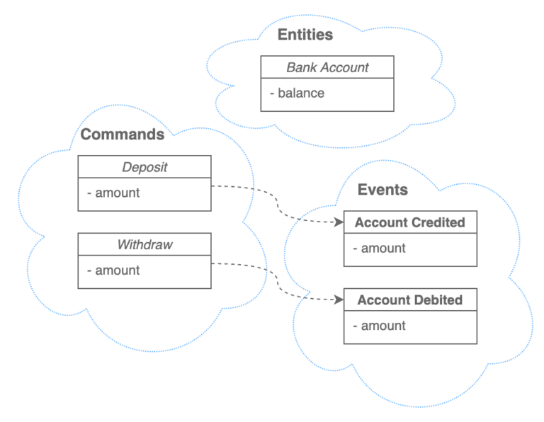
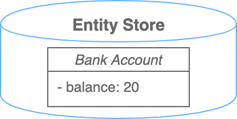

# Event sourcing

`Event sourcing` (источники событий, регистрация событий, генерация событий) — это мощный архитектурный шаблон, при котором все изменения, вносимые в состояние 
приложения, сохраняются в той последовательности, в которой они происходили. Эти записи служат как источником для получения текущего состояния, так и журналом 
аудита того, что происходило в приложении за время его существования. `Event sourcing` способствует децентрализованному изменению и чтению данных. Такая архитектура 
хорошо масштабируется и подходит для систем, которые уже работают с обработкой событий или хотят перейти на такую архитектуру.

## Что такое Event Sourcing

Эксперты предметной области обычно описывают свои системы как совокупность сущностей (`entity`), представляющих собой контейнеры для хранения состояния и событий 
(`event`), отображающих изменения сущностей в результате обработки входных данных в рамках различных бизнес-процессов. Часто события инициируется командами 
(`command`), исходящими от пользователей, фоновых процессов или интеграций с внешними системами.

По сути, `Event sourcing` фокусируется на событиях, связанных с изменениями в системе.

Многие архитектурные шаблоны рассматривают сущности как первоочередную концепцию. Эти шаблоны описывают то, как их сохранять, как к ним получать доступ и как их 
модифицировать. В рамках такого архитектурного стиля события часто находятся «сбоку»: являются последствиями изменения сущностей.

Обычно в основе подобных архитектур лежит хранилище сущностей, например, реляционная база данных или документное хранилище. Хотя в такой архитектуре могут 
присутствовать события, но они, по своей сути, не являются первоочередной концепцией, и могут быть отделены от сущностей, с которыми они связаны, а также скрыты за 
слоями бизнес-логики.

`Event Sourcing` переворачивает этот подход, фокусируясь на реализации событий: на том как они сохраняются и как могут быть использованы для получения состояния 
сущности. В данном случае в базе данных будет последовательный журнал всех событий, которые произошли за время существования системы.

Ниже показано сравнение хранилища событий (`Event Store`) с хранилищем сущностей (`Entity Store`):


`Event sourcing`, используя события в качестве основной архитектурной концепции, также является парадигмой моделирования предметной области, лучше отражающей 
представление заказчика о системе. Проектирование систем с акцентом на события и журналы событий дает следующие преимущества:
- Помогает уменьшить несоответствие импеданса и необходимость в сопоставлении концепций, позволяя технологическим командам «говорить на одном языке» с бизнесом при 
обсуждении системы.
- Поощряет разделение ответственности на команды и запросы (`command/query responsibility` - `CQRS`), позволяя оптимизировать запись и чтение независимо друг от 
друга.
- Обеспечивает темпоральность и историю изменений, как само собой разумеющееся, позволяя отвечать на вопросы о том, как система выглядела в определенные моменты в 
прошлом и какие события происходили до этого момента.

## Принцип работы Event Sourcing

Рассмотрим простой пример с банковским счетом. У нас будет сущность (`entity`), представляющая собой банковский счет (`Bank Account`). Для простоты сделаем только 
один счет без его идентификации с помощью номера счета или каким-либо другим способом. Счет будет хранить текущий остаток средств.

Для счета будут доступны две команды (`command`): внести деньги (`deposit`) и снять деньги (`withdraw`). В командах будет указываться сумма для внесения или снятия. 
Также определим бизнес-правило, которое проверяет, что команда на снятие средств может быть обработана только в том случае, если запрашиваемая сумма равна или 
меньше текущего остатка на счете.

При таком подходе можно выделить два события (`event`) — `Account Credited` (Счет пополнен) и `Account Debited` (Средства списаны со счета). В этих событиях есть 
информация о сумме (`amount`), которая была внесена или снята. Здесь можно было бы упростить до одного события с положительной или отрицательной суммой, но в данном 
примере мы их разделим.

На диаграмме ниже показана модель данных.



Обратите внимание, что события — это «прошедшее время». Они указывают на то, что произошло в системе в момент их записи, и сохраняются только в том случае, если 
обработка команды прошла успешно. При таком подходе необходимо проявлять осторожность, чтобы не перепутать команды с событиями. Особенно если они зеркально похожи 
друг на друга.

Последовательность команд может выглядеть следующим образом:

```
1. deposit { amount: 100 } — внести 100
2. withdraw { amount: 80 } — снять 80
3. withdraw { amount: 50 } — снять 50
```

Самая простая реализация `Event Sourcing` требует журнала событий (`event log`), который представляет собой просто последовательность событий. При обработке команд, 
приведенных выше, получится такой журнал.


Третья команда не может быть выполнена, так как запрошенная сумма превышает доступный баланс.

Для получения текущего баланса система должна обработать или «сгенерировать» события в порядке их возникновения. Для нашего примера это может выглядеть следующим 
образом:

```
- bank account { current balance: 0 } (starting state)
- bank account { current balance: 100 } (processed: Account Credited, +100)
- bank account { current balance: 20 } (processed: Account Debited, -80)
```

Текущий баланс вычисляется через обработку всех событий до текущего момента. Так как каждое событие имеет неявную метку времени, то можно вычислить состояние счета 
на любой момент времени, обработав все события за необходимый промежуток времени.

Это законченный (хоть и тривиальный) пример `Event Sourcing`. В реальной системе, скорее всего, этот пример придется расширить.

Возможно, потребуется сохранять последовательность команд, чтобы была возможность идентифицировать, как возникло событие, а также сделать отдельный журнал 
«ошибочных событий» (`error event`), в который записывать команды, которые не удалось выполнить, для дальнейшей обработки ошибок и ведения полной истории успешных и 
неуспешных команд.

Со временем, при увеличении количества команд, может потребоваться сохранять текущий баланс счета, чтобы при получении команды на снятие средств не нужно было 
обрабатывать полный список событий для определения возможности выполнения команды (т. е. имеется ли на счете достаточно средств). Это пример производного хранилища 
и, по сути, то же самое, что и хранилище сущностей.

Ниже показано, как будет выглядеть хранилище сущностей для нашего примера после обработки всех команд.



Очевидно, что по сравнению с полноценным хранилищем событий (`Event Store`), это очень примитивный пример. И это одна из причин, по которой многие разработчики 
используют только хранилище сущностей. В этом случае текущий остаток на счете доступен сразу и нет необходимости обрабатывать все исторические события.

Однако `Event Sourcing` не исключает хранилища сущностей. Часто хранилища сущностей присутствуют и в `Event Sourcing` — проектах.

## Особенности реализации Event Sourcing

С технической точки зрения для `Event Sourcing` требуется только реализация записи событий в журнал и чтения из журнала.

В простейшем случае в качестве хранилища событий может использоваться файл, в котором в каждой строке записывается отдельное событие, или несколько файлов, когда 
каждое событие сохраняется в отдельный файл. Но как правило, в больших системах, требовательных к параллелизму и масштабируемости, используются более надежные 
способы хранения.

Журнал событий (`event log`) — очень распространенный паттерн, используемый совместно с системами обмена сообщениями (`Message broker`, `Message-oriented 
middleware`) и системами обработки потоков событий. Брокер сообщений, используемый как журнал событий, при необходимости может хранить всю историю сообщений.

Реляционные и документные модели обычно фокусируются на моделировании сущностей. В таких моделях текущее состояние легко получить, прочитав одну или несколько 
строк или документов. Стоит отметить, что `Event Sourcing` и реляционная модель не исключают друг друга. `Event Sourcing`-системы часто включают в себя и то и 
другое. Ключевое отличие `Event Sourcing` заключается в том, что к хранилищу сущностей уже не относятся как к исходным данным. Его можно заменить или перестроить 
через повторную обработку журнала событий.

В более сложных `Event Sourcing`-системах должны присутствовать производные хранилища состояния для эффективных запросов на чтение, так как получение текущего 
состояния через обработку всего журнала событий со временем может перестать масштабироваться. И реляционные, и документные БД могут использоваться и как журнал 
событий и как хранилище производных сущностей, через которые можно быстро получить текущее состояние. Фактически такое разделение задач представляет собой `CQRS` 
(`Command Query Responsibility Segregation`, разделение ответственности на команды и запросы). Все запросы направляются в производное хранилище, что позволяет 
оптимизировать его независимо от операций записи.

Помимо технической части есть и другие моменты, на которые стоит обратить внимание.

## Потенциальные проблемы Event Sourcing

Несмотря на преимущества `Event Sourcing`, у него есть и недостатки.

Самые большие сложности обычно связаны с мышлением разработчиков. Разработчики должны выйти за рамки обычных `CRUD`-приложений и хранилищ сущностей. Теперь 
основной концепцией должны стать события.

При `Event Sourcing` много сил тратится на моделирование событий. После записи событий в журнал они должны считаться неизменными, иначе, и история и состояние 
могут быть повреждены или искажены. `Журнал событий` — это исходные данные, а это значит, что необходимо очень внимательно следить за тем, чтобы они содержали всю 
информацию, необходимую для получения полного состояния системы на определенный момент времени. Также необходимо учитывать, что события могут интерпретироваться 
повторно, поскольку система (и бизнес, который она представляет) со временем изменяются. И не надо забывать про ошибочные и подозрительные события с корректной 
обработкой валидации данных.

Для простых моделей предметных областей такое изменение мышления может быть довольно легким, но для более сложных может стать проблемой (особенно с большим 
количеством зависимостей и отношений между сущностями). Могут возникнуть сложности интеграции с внешними системами, которые не предоставляют данные на определенный 
момент времени.

`Event Sourcing` может хорошо работать в больших системах, так как паттерн «`журнал событий`» естественным образом масштабируется горизонтально. Например, журнал 
событий одной сущности необязательно должен физически находиться вместе с журналом событий другой сущности. Однако, такая легкость масштабирования приводит к 
дополнительным проблемам в виде асинхронной обработки и согласования данных в конечном счете (`eventually consistent`). Команды на изменение состояния могут 
приходить на любой узел, после чего системе необходимо определить, какие узлы отвечают за соответствующие сущности и направить команду на эти узлы, после чего 
обработать команду, а затем реплицировать сгенерированные события на другие узлы, где хранятся журналы событий. И только после завершения этого процесса новое 
событие становится доступным как часть состояния системы. Таким образом, `Event Sourcing` фактически требует, чтобы обработка команд была отделена от запроса 
состояния, то есть `CQRS`.

Поэтому `Event Sourcing`-системам необходимо учитывать промежуток времени между выдачей команды и получением уведомления об успешной записи события в журнал. 
Состояние системы, которое пользователи видят в это время, может быть «неправильным». Или, точнее, немного устаревшим. Для уменьшения влияния этого фактора 
необходимо его учитывать при проектировании интерфейса пользователя и в других компонентах. Также необходима правильная обработка ситуаций, когда команда 
завершается ошибкой, отменяется в процессе выполнения или одно событие заменяется более новым при корректировке данных.

Еще одна проблема возникнет, когда со временем накопятся события и с ними нужно будет работать. Одно дело только записывать их после обработки, другое — работать 
со всей историей. Без этого функционала журнал событий полностью теряет свою ценность. Особенно это актуально для восстановления после сбоя или при миграциях 
производных хранилищ, когда для актуализации данных может потребоваться повторная обработка всех событий. Для систем с большим количеством событий повторная 
обработка всего журнала может превысить допустимое время восстановления. Здесь могут помочь периодические снимки состояния системы (`snapshot`), чтобы можно было 
начать восстановление с более позднего исправного состояния. 

Также необходимо учитывать структуру событий. Структура событий может изменяться с течением времени. Может изменяться набор полей. Возможны ситуации, когда старые 
события должны быть обработаны текущей бизнес-логикой. И наличие расширяемой схемы событий поможет в будущем при необходимости отличать новые события от старых. 
Периодические снимки также помогают отделить серьезные изменения структуры событий.

## Выводы

`Event Sourcing` — это мощный подход, имеющий свои преимущества. Одно из которых — упрощение расширения системы в будущем. Поскольку журнал событий хранит все 
события, то их можно использовать во внешних системах. Довольно легко интегрироваться через добавление новых обработчиков событий.

Однако, как и в случае с любым серьезным архитектурным решением, необходимо проявлять осторожность и убедиться, что оно подходит для вашей ситуации. Ограничения, 
связанные со сложностью предметной области, требованиями к согласованности и доступности данных, а также увеличение объема хранимых данных и масштабируемость в 
долгосрочной перспективе — все это необходимо учитывать (и это ни в коем случае не исчерпывающий список). Не менее важно уделять внимание разработчикам, которые 
будут разрабатывать и поддерживать такую систему на протяжении всего ее жизненного цикла.

И напоследок, не забывайте самый важный принцип программной инженерии — стремиться к тому, чтобы все было как можно проще (принцип `KISS`).

## Полезные ссылки

[Знакомимся с Event Sourcing. Часть 1 - habr](https://habr.com/ru/company/otus/blog/518282/)

[Знакомимся с Event Sourcing. Часть 2 - habr](https://habr.com/ru/company/otus/blog/520538/)
