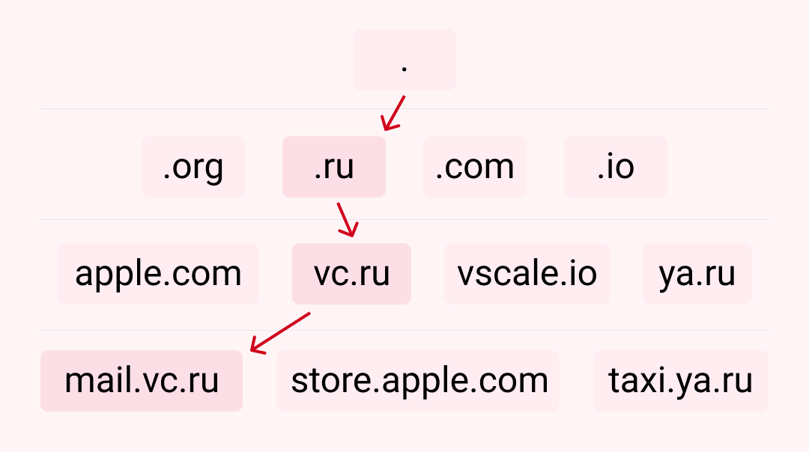
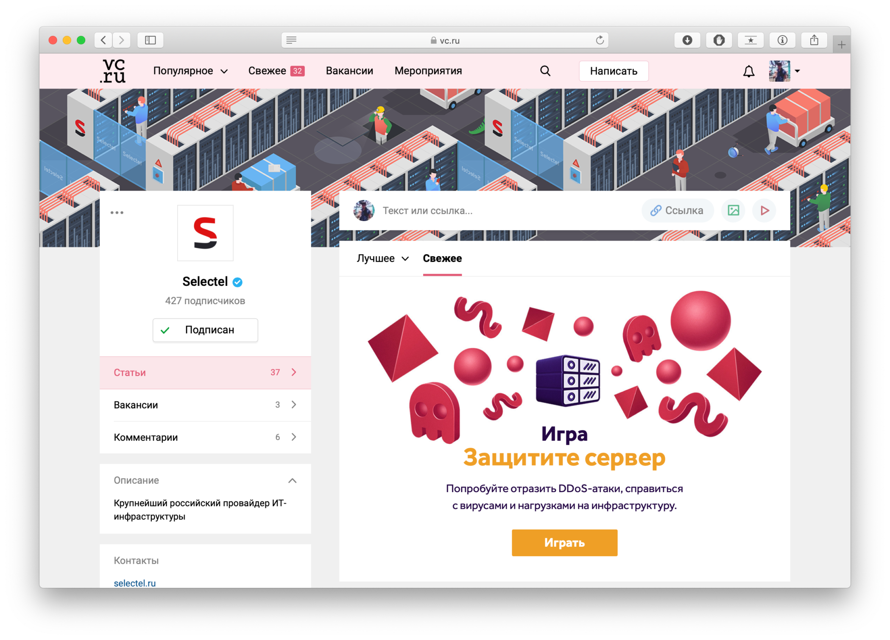
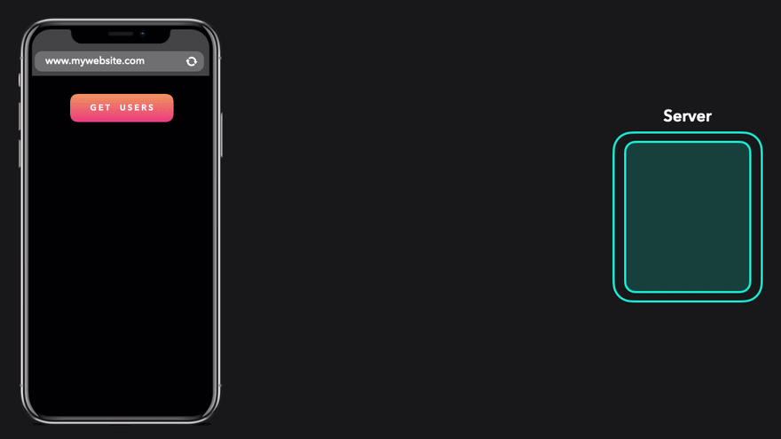
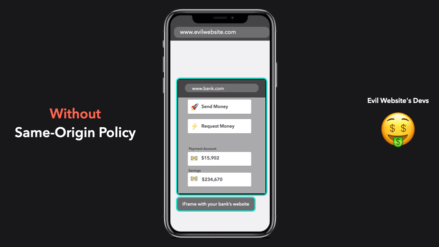
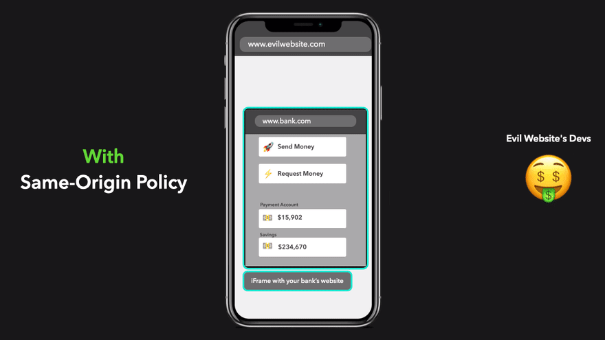
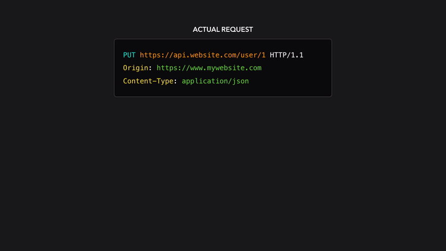
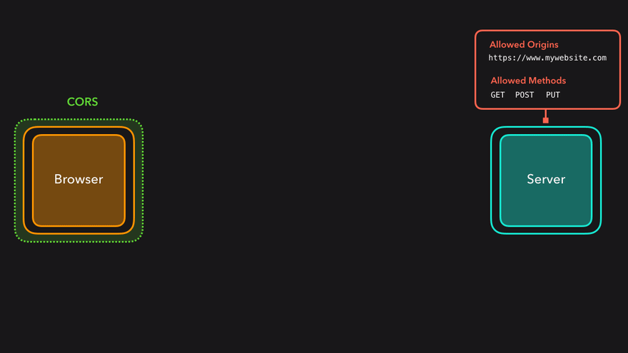
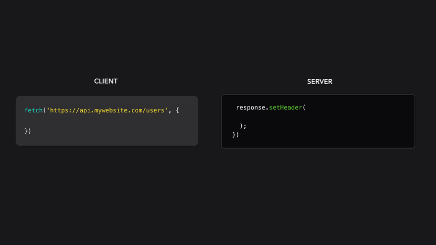

# HTTP

`HTTP` — широко распространённый протокол передачи данных, изначально предназначенный для передачи гипертекстовых документов (то есть документов, которые могут 
содержать ссылки, позволяющие организовать переход к другим документам).

Аббревиатура `HTTP` расшифровывается как `HyperText Transfer Protocol`, «протокол передачи гипертекста». В соответствии со спецификацией `OSI`, `HTTP` является 
протоколом прикладного (верхнего, 7-го) уровня.

Протокол `HTTP` предполагает использование клиент-серверной структуры передачи данных. Клиентское приложение формирует запрос и отправляет его на сервер, после 
чего серверное программное обеспечение обрабатывает данный запрос, формирует ответ и передаёт его обратно клиенту. После этого клиентское приложение может 
продолжить отправлять другие запросы, которые будут обработаны аналогичным образом.

Задача, которая традиционно решается с помощью протокола `HTTP` — обмен данными между пользовательским приложением, осуществляющим доступ к веб-ресурсам 
(обычно это веб-браузер) и веб-сервером. На данный момент именно благодаря протоколу `HTTP` обеспечивается работа Всемирной паутины.

Также `HTTP` часто используется как протокол передачи информации для других протоколов прикладного уровня, таких как `SOAP`, `XML-RPC` и `WebDAV`. В таком 
случае говорят, что протокол `HTTP` используется как «транспорт».

`API` многих программных продуктов также подразумевает использование `HTTP` для передачи данных — сами данные при этом могут иметь любой формат, например, 
`XML` или `JSON`.

Как правило, передача данных по протоколу `HTTP` осуществляется через `TCP/IP`-соединения. Серверное программное обеспечение при этом обычно использует `TCP`-
порт 80 (и, если порт не указан явно, то обычно клиентское программное обеспечение по умолчанию использует именно 80-й порт для открываемых `HTTP`-соединений), 
хотя может использовать и любой другой.

## Ключевые отличия HTTP2 и HTTP1.1

- `HTTP2` является двоичным, а не текстовым
- `HTTP2` полностью мультиплексирован, а не упорядочен и блокирован
- `HTTP2` Следовательно, может использовать одно соединение для параллелизма
- `HTTP2` использует сжатие заголовков для уменьшения накладных расходов
- `HTTP2` позволяет серверам активно «проталкивать» ответы в кеши клиентов

## Как отправить HTTP-запрос?

Самый простой способ разобраться с протоколом `HTTP` — это попробовать обратиться к какому-нибудь веб-ресурсу вручную. Представьте, что вы браузер, и у вас 
есть пользователь, который очень хочет прочитать статьи Анатолия Ализара.

Предположим, что он ввёл в адресной строке следующее:

```
http://alizar.habrahabr.ru/
```

Соответственно вам, как веб-браузеру, теперь необходимо подключиться к веб-серверу по адресу `alizar.habrahabr.ru`.

Для этого вы можете воспользоваться любой подходящей утилитой командной строки. Например, `telnet`:

```
telnet alizar.habrahabr.ru 80
```

Сразу уточню, что если вы вдруг передумаете, то нажмите `Ctrl + «]»`, и затем ввод — это позволит вам закрыть `HTTP`-соединение.

После того, как вы подключитесь к серверу, нужно отправить `HTTP`-запрос. Это, кстати, очень легко — `HTTP`-запросы могут состоять всего из двух строчек.

Для того, чтобы сформировать `HTTP`-запрос, необходимо составить стартовую строку, а также задать по крайней мере один заголовок — это заголовок `Host`, 
который является обязательным, и должен присутствовать в каждом запросе. Дело в том, что преобразование доменного имени в `IP`-адрес осуществляется на стороне 
клиента, и, соответственно, когда вы открываете `TCP`-соединение, то удалённый сервер не обладает никакой информацией о том, какой именно адрес использовался 
для соединения: это мог быть, например, адрес `alizar.habrahabr.ru`, `habrahabr.ru` или `m.habrahabr.ru` — и во всех этих случаях ответ может отличаться. 
Однако фактически сетевое соединение во всех случаях открывается с узлом `212.24.43.44`, и даже если первоначально при открытии соединения был задан не этот 
`IP`-адрес, а какое-либо доменное имя, то сервер об этом никак не информируется — и именно поэтому этот адрес необходимо передать в заголовке `Host`.

## А что с безопасностью?

Сам по себе протокол `HTTP` не предполагает использование шифрования для передачи информации. Тем не менее, для `HTTP` есть распространённое расширение, 
которое реализует упаковку передаваемых данных в криптографический протокол `SSL` или `TLS`.

Название этого расширения — `HTTPS` (`HyperText Transfer Protocol Secure`). Для `HTTPS`-соединений обычно используется `TCP`-порт 443. `HTTPS` широко 
используется для защиты информации от перехвата, а также, как правило, обеспечивает защиту от атак вида `man-in-the-middle` — в том случае, если сертификат 
проверяется на клиенте, и при этом приватный ключ сертификата не был скомпрометирован, пользователь не подтверждал использование неподписанного сертификата, и 
на компьютере пользователя не были внедрены сертификаты центра сертификации злоумышленника.

На данный момент `HTTPS` поддерживается всеми популярными веб-браузерами.

## Методы

`HTTP` определяет множество методов запроса, которые указывают, какое желаемое действие выполнится для данного ресурса. Несмотря на то, что их названия могут 
быть существительными, эти методы запроса иногда называются `HTTP` глаголами. Каждый реализует свою семантику, но каждая группа команд разделяет общие 
свойства: так, методы могут быть безопасными, идемпотентными или кэшируемыми.

- `GET` - запрашивает представление ресурса. Запросы с использованием этого метода могут только извлекать данные.
- `HEAD` - запрашивает ресурс так же, как и метод `GET`, но без тела ответа.
- `POST` - используется для отправки сущностей к определённому ресурсу. Часто вызывает изменение состояния или какие-то побочные эффекты на сервере.
- `PUT` - заменяет все текущие представления ресурса данными запроса.
- `PATCH` - используется для частичного изменения ресурса.
- `DELETE` - удаляет указанный ресурс.
- `CONNECT` - устанавливает "туннель" к серверу, определённому по ресурсу.
- `OPTIONS` - используется для описания параметров соединения с ресурсом.
- `TRACE` - выполняет вызов возвращаемого тестового сообщения с ресурса.

## Безопасные методы 

Метод `HTTP` является безопасным, если он не меняет состояние сервера. Другими словами, безопасный метод проводит операции "только чтение" (`read-only`). 
Несколько следующих методов `HTTP` безопасные: `GET`, `HEAD` или `OPTIONS`. **Все безопасные методы являются также идемпотентными**, как и некоторые другие, но 
при этом небезопасные, такие как PUT или DELETE.

Даже если безопасные методы являются по существу "только для чтения", сервер всё равно может сменить своё состояние: например, он может сохранять статистику. 
Что существенно, так то, когда клиент вызывает безопасный метод, то он не запрашивает никаких изменений на сервере, и поэтому не создаёт дополнительную 
нагрузку на сервер. Браузеры могут вызывать безопасные методы, не опасаясь причинить вред серверу: это позволяет им выполнять некоторые действия, например, 
предварительная загрузка без риска. Поисковые роботы также полагаются на вызовы безопасных методов.

Безопасные методы не обязательно должны обрабатывать только статичные файлы; сервер может генерировать ответ "на-лету", пока скрипт, генерирующий ответ, 
гарантирует безопасность: он не должен вызывать внешних эффектов, таких как формирование заказов, отправка писем и др..

Правильная реализация безопасного метода - это ответственность серверного приложения, потому что сам веб-сервер, будь то `Apache`, `nginx`, `IIS` это соблюсти 
не сможет. В частности, приложение не должно разрешать изменение состояния сервера запросами `GET`.

Вызов безопасного метода, не меняющего состояния сервера:

```
GET /pageX.html HTTP/1.1
```

Вызов небезопасного метода, который может поменять состояние сервера:

```
POST /pageX.html HTTP/1.1 
```

Вызов идемпотентного, но небезопасного метода:

```
DELETE /idX/delete HTTP/1.1
```

## Идемпотентный метод

Метод `HTTP` является идемпотентным, если повторный идентичный запрос, сделанный один или несколько раз подряд, имеет один и тот же эффект, не изменяющий 
состояние сервера. Другими словами, идемпотентный метод не должен иметь никаких побочных эффектов (`side-effects`), кроме сбора статистики или подобных 
операций. Корректно реализованные методы `GET`, `HEAD`, `PUT` и `DELETE` идемпотентны, но не метод `POST`. Также все безопасные методы являются идемпотентными.

Для идемпотентности нужно рассматривать только изменение фактического внутреннего состояния сервера, а возвращаемые запросами коды статуса могут отличаться: 
первый вызов `DELETE` вернёт код 200, в то время как последующие вызовы вернут код `404`. Из идемпотентности `DELETE` неявно следует, что разработчики не 
должны использовать метод `DELETE` при реализации `RESTful API` с функциональностью удалить последнюю запись.

Обратите внимание, что идемпотентность метода не гарантируется сервером, и некоторые приложения могут нарушать ограничение идемпотентности.

`GET /pageX HTTP/1.1` идемпотентен. Вызвавший несколько раз подряд этот запрос, клиент получит тот же результат:

```
GET /pageX HTTP/1.1   
GET /pageX HTTP/1.1   
GET /pageX HTTP/1.1   
GET /pageX HTTP/1.1   
```

`POST /add_row HTTP/1.1` не идемпотентен; если его вызвать несколько раз, то он добавит несколько строк:

```
POST /add_row HTTP/1.1
POST /add_row HTTP/1.1   -> Adds a 2nd row
POST /add_row HTTP/1.1   -> Adds a 3rd row
```

`DELETE /idX/delete HTTP/1.1` идемпотентен, даже если возвращаемый код отличается:

```
DELETE /idX/delete HTTP/1.1   -> Returns 200 if idX exists
DELETE /idX/delete HTTP/1.1   -> Returns 404 as it just got deleted
DELETE /idX/delete HTTP/1.1   -> Returns 404
```

## Кэшируемые методы

Кэшируемые ответы - это `HTTP`-ответы, которые могут быть закэшированы, то есть сохранены для дальнейшего восстановления и использования позже, тем самым 
снижая число запросов к серверу. Не все `HTTP`-ответы могут быть закэшированы. Вот несколько ограничений:
- Метод, используемый в запросе, кэшируемый, если это `GET` или `HEAD`. Ответ для `POST` или `PATCH` запросов может также быть закэширован, если указан признак 
"свежести" данных и установлен заголовок `Content-Location`, но это редко реализуется. (Например, Firefox не поддерживает это). Другие методы, такие как `PUT` 
и `DELETE` не кэшируемые, и результат их выполнения не кэшируется.
- Коды ответа, известные системе кэширования, которые рассматриваются как кэшируемые: `200, 203, 204, 206, 300, 301, 404, 405, 410, 414, 501`.
- Отсутствуют специальные заголовки в ответе, которые предотвращают кэширование: например, `Cache-Control`.

Обратите внимание, что некоторые некэшируемые запросы-ответы к определённым `URI` могут сделать недействительным (инвалидируют) предыдущие закэшированные 
ответы на тех же `URI`. Например, `PUT` к странице `pageX.html` инвалидируют все закэшированные ответы `GET` или `HEAD` запросов к этой странице.

Когда и метод запроса и статус ответа кэшированы, то ответ к запросу тоже может быть закэширован:

```
GET /pageX.html HTTP/1.1
(…) 

200 OK
(…)
```

Запрос `PUT` не может быть закэширован. Более того, он инвалидирует закэшированные данные запросов к тому же `URI`, сделанных через `HEAD` или `GET`:

```
PUT /pageX.html HTTP/1.1
(…)

200 OK
(…)
```

Специальный заголовок `Cache-Control` в ответе может предотвратить кэширование:

```
GET /pageX.html HTTP/1.1
(…)

200 OK
Cache-Control: no-cache
(…)
```

## Коды ответа

Код ответа (состояния) `HTTP` показывает, был ли успешно выполнен определённый `HTTP` запрос. Коды сгруппированы в 5 классов:

|Группа           |Коды     |
|-----------------|---------|
|Информационные   |100 - 199|
|Успешные         |200 - 299|
|Перенаправления  |300 - 399|
|Клиентские ошибки|400 - 499|
|Серверные ошибки |500 - 599|

Если Вы получли код ответа (состояния), которого нет в данном списке, в таком случае он является не стандартизированным кодом ответа (состояния), вероятней 
всего это кастомный код ответа сервера.

## Заголовки

Заголовки - это специальные параметры, которые несут определенную служебную информацию о соединении по `HTTP`. Некоторые заголовки имеют лишь информационный 
характер для пользователя или для компьютера, другие передают определенные команды, исходя из которых, сервер или клиент будет выполнять какие-то действия.

В зависимости от того, где эти заголовки могут находиться, они разделяются на:

- `General Headers` (Основные заголовки) — должны быть и в запросах и в ответах клиента и сервера.
- `Request Headers` (Заголовки запроса) — используются только в запросах клиента.
- `Response Headers` (Заголовки ответа) — используются только в ответах сервера.
- `Entity Headers` (Заголовки сущности) — сопровождают каждую сущность сообщения.

Каждый заголовок имеет следующий вид:

```
параметр: значение
```

Немного о правилах написания, что нужно иметь в виду:

- Регистр (большие или маленькие буквы) здесь не учитываются. Можно писать и так и так.
- Пишутся латинскими буквами.
- После параметра должен идти символ двоеточия (`:`)
- Окончанием пары «`параметр:значение`» служит символ переноса строки.

Вот, примеры некоторых заголовков:

```
Host: webkyrs.info
User-Agent: Mozilla/5.0 (Windows NT 6.1; rv:18.0) Gecko/20100101 Firefox/18.0
Accept: text/html,application/xhtml+xml,application/xml;q=0.9,*/*;q=0.8
Accept-Language: ru-RU,ru;q=0.8,en-US;q=0.5,en;q=0.3
```

## Cookies

#### Что такое файлы cookies и зачем они нужны

`Cookies` — это небольшие текстовые файлы у нас на компьютерах, в которых хранится информация о наших предыдущих действиях на сайтах. Кроме входов в аккаунты 
они умеют запоминать:

- предпочтения пользователей, например, язык, валюту или размер шрифта.
- товары, которые мы просматривали или добавили в корзину;
- текст, который мы вводили на сайте раньше;
- IP-адрес и местоположение пользователя;
- дату и время посещения сайта;
- версию ОС и браузера;
- клики и переходы.

#### Как работают cookies

Когда мы совершаем на сайте какое-то действие, например, добавляем товар в корзину или вводим детали входа в аккаунт, сервер записывает эту информацию в куки и 
отправляет браузеру вместе со страницей. Когда мы переходим на другую страницу сайта или заходим на него через время, браузер отправляет куки обратно.

Куки бывают временными и постоянными. Постоянные куки остаются на компьютере, когда мы закрываем вкладку с сайтом, а временные удаляются. Какие именно куки 
использовать на конкретном сайте — временные или постоянные — решает его разработчик. Именно поэтому на одних сайтах мы не выходим из аккаунтов, даже когда 
заходим на них раз спустя несколько дней, а на других вводим пароль заново, хотя отошли от компьютера на пять минут.

#### Cookies и безопасность

Сами по себе куки не опасны — это обычные текстовые файлы. Они не могут запускать процессы на компьютере и вообще взаимодействовать с операционной системой. Но 
их могут попытаться перехватить или украсть, чтобы отследить ваши предыдущие действия в сети или входить в ваши аккаунты без авторизации.

Обычно информацию, которую записывают в куки, зашифровывают перед отправкой, а сами куки передают по `HTTPS`-протоколу. Это помогает защитить пользовательские 
данные, но за внедрение шифрования и безопасную отправку отвечает разработчик сайта. Посетителям остаётся только надеяться, что всё настроили грамотно. Со 
своей стороны пользователь может только запретить браузеру использовать куки или время от времени чистить их самостоятельно.

Совсем отключать куки — не всегда хорошая идея. Например, все интернет-магазины работают с помощью куки. Если запретить браузеру их использовать, сервер не 
сможет запомнить, что именно вы добавили в корзину. Чистить куки вручную практичнее, но придётся каждый раз заново настраивать внешний вид сайта и входить в 
аккаунты.

## Что происходит, когда пользователь набирает в браузере адрес сайта

#### Пользователь вводит в браузере адрес сайта

```
vc.ru
```

#### Браузер начинает искать сервер

За работу любого сайта обычно отвечает один из миллионов серверов, подключенных к интернету. Адрес сервера — это уникальный набор цифр, который называется 
`IP`-адресом. Например, для `vc.ru` — это сервер `85.119.149.83`.

Поэтому первым делом браузеру нужно понять, какой `IP`-адрес у сервера, на котором находится сайт.

Такая информация хранится в распределенной системе серверов — `DNS` (`Domain Name System`). Система работает как общая «контактная книга», хранящаяся на 
распределенных серверах и устройствах в интернете.

Однако перед тем, как обращаться к `DNS`, браузер пытается найти запись об `IP`-адресе сайта в ближайших местах, чтобы сэкономить время:
- Сначала в своей истории подключений. Если пользователь уже посещал сайт, то в браузере могла сохраниться информация c `IP`-адресом сервера.
- В операционной системе. Не обнаружив информации у себя, браузер обращается к операционной системе, которая также могла сохранить у себя `DNS`-запись. 
Например, если подключение с сайтом устанавливалось через одно из установленных на компьютере приложений.
- В кэше роутера, который сохраняет информацию о последних соединениях, совершенных из локальной сети.

#### Браузер отправляет запрос к DNS-серверам

Не обнаружив подходящих записей в кэше, браузер формирует запрос к `DNS`-серверам, расположенным в интернете.

Например, если нужно найти `IP`-адрес сайта `mail.vc.ru`, браузер спрашивает у ближайшего `DNS`-сервера «Какой IP-адрес у сайта mail.vc.ru?».

Сервер может ответить: «Я не знаю про mail.vc.ru, но знаю сервер, который отвечает за vc.ru». Запрос переадресовывается дальше, на сервер «выше», пока в итоге 
один из серверов не найдет ответ об `IP`-адресе для сайта.



#### Браузер устанавливает соединение с сервером

Как только браузер узнал `IP`-адрес нужного сервера, он пытается установить с ним соединение. В большинстве случаев для этого используется специальный протокол 
— `TCP`.

`TCP` — это набор правил, который описывает способы соединения между устройствами, форматы отправки запросов, действия в случае потери данных и так далее.

Например, для установки соединения между браузером и сервером в стандарте `TCP` используется система «трёх рукопожатий». Работает она так:
- Устройство пользователя отправляет специальный запрос на установку соединения с сервером — называется `SYN`-пакет.
- Сервер в ответ отправляет запрос с подтверждением получения `SYN`-пакета — называется `SYN/ACK`-пакет.
- В конце устройство пользователя при получении `SYN/ACK`-пакета отправляет пакет с подтверждением — `ACK`-пакет. В этот момент соединение считается 
установленным.

#### Браузер отправляет HTTP-запрос, чтобы получить контент сайта

После установки соединения браузер отправляет специальный запрос, в котором просит сервер отправить данные для отображения страницы. В этом запросе содержится 
информация о самом браузере, временные файлы, требования к соединению и так далее.

Задача браузера — как можно подробнее объяснить серверу, какая именно информация ему нужна.

В общении браузера и сервера выделяют два типа запросов. `GET`-запрос используется для получения данных с сервера — например, отобразить картинку, текст или 
видео. `POST`-запрос — используется для отправки данных из браузера на сервер, например, когда пользователь отправляет сообщение, картинку или загружает файл.


> Почти все сайты обмениваются информацией с сервером в зашифрованном формате — с помощью `HTTPS`-протокола. В отличие от `HTTP`-протокола, в `HTTPS` 
используется шифрование, а безопасность подключения подтверждается специальным сертификатом.

#### Сервер обрабатывает запрос

Сервер получил запрос от браузера с подробным описанием того, что ему требуется. Теперь ему нужно обработать этот запрос. Этой задачей занимается специальное 
серверное программное обеспечение — например, `nginx` или `Apache`. Чаще всего такие программы принято называть веб-серверами.

Веб-сервер в свою очередь перенаправляет запрос на дальнейшую обработку к программе-обработчику — например, `PHP`, `Ruby` или `ASP.NET`. Программа внимательно 
изучает содержимое запроса — например, понимает, в каком формате нужно отправить ответ и какие именно файлы нужны. И собирает ответ.

#### Сервер отправляет ответ браузеру

Когда ответ сформирован, он отправляется веб-сервером обратно браузеру. В ответе как правило содержится контент для отображения веб-страницы, информация о типе 
сжатия данных, способах кэширования, файлы cookie, которые нужно записать и так далее.

> Чтобы обмен данными был быстрым, браузер и сервер обмениваются сразу множеством небольших пакетов данных — как правило, в пределах `8 КБ`. Все пакеты имеют 
специальные номера, которые помогают отслеживать последовательность отправки и получения данных.

#### Браузер обрабатывает полученный ответ и «рисует» веб-страницу

Браузер распаковывает полученный ответ и постепенно начинает отображать полученный контент на экране пользователя — этот процесс называется `рендерингом`.

Сначала браузер загружает только основную структуру `HTML`-страницы. Затем последовательно проверяет все теги и отправляет дополнительные `GET`-запросы для 
получения с сервера различных элементов — картинки, файлы, скрипты, таблицы стилей и так далее. Поэтому по мере загрузки страницы браузер и сервер продолжают 
обмениваться между собой информацией.

Параллельно с этим на компьютер как правило сохраняются статичные файлы пользователя — чтобы при следующем посещении не загружать их заново и быстрее 
отобразить пользователю содержимое страницы.

Как только рендеринг завершен — пользователю отобразится полностью загруженная страница сайта.



## Как отправить файл по HTTP?

Аттрибут `enctype="multipart/form-data"`

```html
<form action="upload" method="POST" enctype="multipart/form-data">
    <input type="file" name="myfile">
    <br/>
    <input type="submit" name="Submit">
</form>
```

```java
public class PostFile {
  public static void main(String[] args) throws Exception {
    HttpClient httpclient = new DefaultHttpClient();
    httpclient.getParams().setParameter(CoreProtocolPNames.PROTOCOL_VERSION, HttpVersion.HTTP_1_1);

    HttpPost httppost = new HttpPost("http://localhost:9000/upload");
    File file = new File("C:\\Users\\joao\\Pictures\\bla.jpg"");

    MultipartEntity mpEntity = new MultipartEntity();
    ContentBody cbFile = new FileBody(file, "image/jpeg");
    mpEntity.addPart("userfile", cbFile);

    httppost.setEntity(mpEntity);
    System.out.println("executing request " + httppost.getRequestLine());
    HttpResponse response = httpclient.execute(httppost);
    HttpEntity resEntity = response.getEntity();

    System.out.println(response.getStatusLine());
    if (resEntity != null) {
      System.out.println(EntityUtils.toString(resEntity));
    }
    if (resEntity != null) {
      resEntity.consumeContent();
    }

    httpclient.getConnectionManager().shutdown();
  }
}
```

## Что такое CORS (Cross-origin resource sharing)?

Во фронтенде часто требуется отобразить данные, которые хранятся в другом месте. Перед этим браузер должен направить запрос серверу: клиент отправляет `HTTP`-
запрос со всей информацией, которая нужна серверу, чтобы вернуть данные.

Представим, что нам надо получить информацию о пользователях для нашего сайта `www.mywebsite.com` с сервера, который находится по адресу `api.website.com`.



Сработало. Мы отправили `HTTP`-запрос на сервер, который вернул нужные нам данные в формате `JSON`. А теперь давайте попытаемся отправить точно такой же 
запрос, но с другого домена: вместо `www.mywebsite.com` возьмём `www.anotherdomain.com`.


Что произошло? Мы отправили такой же запрос, но на этот раз браузер выдал странную ошибку. Мы только что увидели `CORS` в действии. Давайте разберёмся, почему 
возникла эта ошибка, и что она означает.

#### Правило одинакового источника (Same-Origin Policy)

В веб внедрено так называемое правило одинакового источника. По умолчанию мы можем получить доступ к ресурсам только в том случае, если источник этих ресурсов 
и источник запроса совпадают. К примеру, мы сможем без проблем загрузить изображение, которое находится по адресу `https://mywebsite.com/image1.png`.

Ресурс считается принадлежащим к другому источнику (`cross-origin`), если он располагается на другом домене/поддомене, протоколе или порте.


Это, конечно, здорово, но для чего правило одинакового источника вообще существует?

Представим, что это правило не работает, а вы случайно нажали на какую-то вирусную ссылку, которую прислала ваша тётушка на Фейсбуке. Ссылка перенаправляет вас 
на мошеннический сайт, который с помощью фрейма загружает интерфейс сайта вашего банка и успешно залогинивает вас с помощью сохранённых куки.

Разработчики этого мошеннического сайта сделали так, чтобы он имел доступ к фрейму и мог взаимодействовать с `DOM` сайта вашего банка — так они смогут 
переводить деньги на свой счёт от вашего имени.



Да, это огромная угроза безопасности — мы ведь не хотим, чтобы кто угодно имел доступ к чему угодно.

К счастью, здесь приходит на помощь правило одинакового источника: оно гарантирует, что мы можем получить доступ только к ресурсам из того же самого источника.



В данном случае сайт `www.evilwebsite.com` попытался получить доступ к ресурсам из другого источника — `www.bank.com`. Правило одинакового источника 
заблокировало это действие. В результате разработчики мошеннического сайта не смогли добраться до нашей банковской информации.

> Но какое отношение всё это имеет к `CORS`?

#### CORS на стороне клиента

Несмотря на то, что правило одинакового источника применяется исключительно к скриптам, браузеры распространили его и на `JavaScript`-запросы: по умолчанию 
можно получить доступ к ресурсам только из одинакового источника.


Но нам ведь часто нужно обращаться к ресурсам из других источников. Может, тогда фронтенду стоит взаимодействовать с `API` на бэкенде, чтобы загружать данные? 
Чтобы обеспечить безопасность запросов к другим источникам, браузеры используют механизм под названием `CORS`.

Аббревиатура `CORS` расшифровывается как `Cross-Origin Resource Sharing` (Технология совместного использования ресурсов между разными источниками). Несмотря на 
то, что браузеры не позволяют получать доступ к ресурсам из разных источников, можно использовать `CORS`, чтобы внести небольшие коррективы в эти ограничения и 
при этом быть уверенным, что доступ будет безопасным.

Пользовательские агенты (к примеру, браузеры) на основе значений определённых заголовков для `CORS` в `HTTP`-запросе могут проводить запросы к другим 
источникам, которые без `CORS` были бы заблокированы.

Когда происходит запрос к другому источнику, клиент автоматически подставляет дополнительный заголовок `Origin` в `HTTP`-запрос. Значение этого заголовка 
отражает источник запроса.


Чтобы браузер разрешил доступ к ресурсам из другого источника, он должен получить определённые заголовки в ответе от сервера, которые указывают, разрешает ли 
сервер запросы из других источников.

#### CORS на стороне сервера

Разрабатывая бэкенд, мы, чтобы разрешить запросы из других источников, можем добавить в `HTTP`-ответ дополнительные заголовки, начинающиеся с 
`Access-Control-*`. На основе значений этих `CORS`-заголовков браузер сможет разрешить определённые запросы из других источников, которые обычно блокируются 
правилом одинакового источника.

Существует несколько `CORS`-заголовков, но браузеру нужен всего один из них, чтобы разрешить доступ к ресурсам из разных источников — 
`Access-Control-Allow-Origin`. Его значение определяет, из каких источников можно получить доступ к ресурсам на сервере.
Если мы создаём сервер, к которому должен иметь доступ сайт `https://mywebsite.com`, то нужно внести этот домен в значение заголовка 
`Access-Control-Allow-Origin.`


Отлично, теперь мы можем получать ресурсы из другого источника. А что будет, если мы попытаемся получить к ним доступ из источника, который не указан в 
заголовке `Access-Control-Allow-Origin`?


```
Allowed Origins - Разрешённые источники
The request has an allowed origin - Источник запроса разрешён
```

Да, теперь `CORS` выдаёт эту печально известную ошибку, которая иногда всех нас так расстраивает. Но сейчас нам понятно, какой смысл она несет.

```
The 'Access-Control-Allow-Origin' header has a value 'https://www.mywebsite.com' that is not equal 
to the supplied origin.
(Значение 'https://www.mywebsite.com' заголовка 'Access-Control-Allow-Origin' не совпадает с представленным источником)
```

В данном случае в качестве источника выступал сайт `https://www.anotherwebsite.com` — его не было в списке разрешённых источников в заголовке `Access-Control-
Allow-Origin`. `CORS` успешно заблокировал запрос, и мы не можем получить доступ к запрашиваемым данным.

> В качестве значения разрешённых источников CORS позволяет указать спецсимвол `*`. Он означает, что доступ к ресурсам открыт из всех источников, поэтому 
используйте его с осторожностью.

Кроме `Access-Control-Allow-Origin`, мы можем использовать и многие другие `CORS`-заголовки. Бэкенд-разработчик может изменить правила `CORS` на сервере так, 
чтобы разрешать/блокировать определённые запросы.

Ещё один довольно распространённый заголовок — `Access-Control-Allow-Methods`. С ним будут разрешены только те запросы из других источников, которые выполнены 
с применением перечисленных методов.


```
Allowed Origins - Разрешённые источники
Allowed Methods - Разрешённые методы
```

В данном случае разрешены только запросы с методами `GET`, `POST`, или `PUT`. Запросы с другими методами (например, `PATCH` или `DELETE`) будут блокироваться.

С `PUT`, `PATCH` и `DELETE` CORS работает с по-другому. В этих “непростых” случаях используются так называемые предварительные запросы (`preflight requests`).

#### Предварительные запросы

Существует два типа `CORS`-запросов: **простые** и **предварительные**. Тип запроса зависит от хранящихся в нём значений (не волнуйтесь, здесь не надо будет 
ничего запоминать).

Запрос считается простым, если в нём используются методы `GET` и `POST` и нет никаких пользовательских заголовков. Любые другие запросы (например, с методами 
`PUT`, `PATCH` или `DELETE`) — предварительные.

Но что означают и почему существуют “предварительные запросы”?

Перед отправкой текущего запроса клиент сначала генерирует предварительный запрос: в своих заголовках `Access-Control-Request-*` он содержит информацию о 
текущем запросе. Это позволяет серверу узнать метод, дополнительные заголовки и другие параметры запроса, который браузер пытается отправить.



```
Actual Request — Текущий запрос
Preflighted Request — Предварительный запрос
```

Сервер получает этот предварительный запрос и отправляет обратно пустой `HTTP`-ответ с `CORS`-заголовками сервера. Браузер в свою очередь получает 
предварительный ответ (только `CORS`-заголовки) и проверяет, разрешён ли `HTTP`-запрос.


```
The request has an allowed origin - Источник запроса разрешён
The request has an allowed method - Метод запроса разрешён
Preflight Response - Предварительный ответ
```

Если всё в порядке, браузер посылает текущий запрос на сервер, а тот в ответ присылает данные, которые мы запрашивали.



Если же возникает проблема, `CORS` блокирует предварительный запрос, а текущий вообще уже не будет отправлен. Предварительный запрос — отличный способ уберечь 
нас от получения доступа или изменения ресурсов на серверах, у которых (пока что) не настроены правила `CORS`. Сервера защищены от потенциально нежелательных 
запросов из других источников.

> Чтобы уменьшить число обращений к серверу, можно кэшировать предварительные ответы, добавив к `CORS`-запросам заголовок `Access-Control-Max-Age`. Так браузеру не придётся каждый раз отправлять новый предварительный запрос.

#### Учётные данные

Куки, заголовки авторизации, `TLS`-сертификаты по умолчанию включены только в запросы из одинакового источника. Однако нам может понадобиться исполь
зовать учётные данные и в запросах из разных источников. Возможно, мы захотим включить куки в запрос, который сервер сможет использовать для идентификации 
пользователя.

В `CORS` по умолчанию отсутствуют учётные данные, но это можно изменить, добавив `CORS`-заголовок `Access-Control-Allow-Credentials`.

Если необходимо включить куки и другие заголовки авторизации в запрос из другого источника, нужно установить значение `true` в поле `withCredentials` запроса, 
а также добавить в ответ заголовок `Access-Control-Allow-Credentials`.



Готово — теперь мы можем включать учётные данные в запрос из другого источника.

Думаю, мы все согласимся с тем, что появление ошибок `CORS` порой расстраивает, но, тем не менее, здорово, что `CORS` позволяет безопасно отправлять запросы из 
разных источников в браузере — считаю, что мы должны любить эту технологию чуточку сильнее :)

## Полезные ссылки

[Простым языком об HTTP - habr](https://habr.com/ru/post/215117/)

[Методы HTTP запроса - developer.mozilla](https://developer.mozilla.org/ru/docs/Web/HTTP/Methods)

[Безопасный метод - developer.mozilla](https://developer.mozilla.org/ru/docs/%D0%A1%D0%BB%D0%BE%D0%B2%D0%B0%D1%80%D1%8C/safe)

[Идемпотентный метод - developer.mozilla](https://developer.mozilla.org/ru/docs/%D0%A1%D0%BB%D0%BE%D0%B2%D0%B0%D1%80%D1%8C/Idempotent)

[Кэшируемые методы - developer.mozilla](https://developer.mozilla.org/ru/docs/%D0%A1%D0%BB%D0%BE%D0%B2%D0%B0%D1%80%D1%8C/cacheable)

[HTTP статус коды - developer.mozilla](https://developer.mozilla.org/ru/docs/Web/HTTP/Status)

[Что такое файлы cookies и зачем они нужны - ssl.com.ua](https://ssl.com.ua/blog/what-are-cookies/)

[Что происходит, когда пользователь набирает в браузере адрес сайта - vc.ru](https://vc.ru/selectel/76371-chto-proishodit-kogda-polzovatel-nabiraet-v-brauzere-adres-sayta)

[Что стоит за простой загрузкой веб-странички в браузере. (Очень подробно) - medium](https://medium.com/genesis-media/%D1%87%D1%82%D0%BE-%D1%81%D1%82%D0%BE%D0%B8%D1%82-%D0%B7%D0%B0-%D0%BF%D1%80%D0%BE%D1%81%D1%82%D0%BE%D0%B9-%D0%B7%D0%B0%D0%B3%D1%80%D1%83%D0%B7%D0%BA%D0%BE%D0%B9-%D0%B2%D0%B5%D0%B1-%D1%81%D1%82%D1%80%D0%B0%D0%BD%D0%B8%D1%87%D0%BA%D0%B8-%D0%B2-%D0%B1%D1%80%D0%B0%D1%83%D0%B7%D0%B5%D1%80%D0%B5-3933c96467a)

[Безопасность наглядно: CORS - medium](https://medium.com/nuances-of-programming/%D0%BA%D0%BE%D0%BC%D0%BF%D1%8C%D1%8E%D1%82%D0%B5%D1%80%D0%BD%D0%B0%D1%8F-%D0%BD%D0%B0%D1%83%D0%BA%D0%B0-%D0%BD%D0%B0%D0%B3%D0%BB%D1%8F%D0%B4%D0%BD%D0%BE-cors-20a97786c18c)

[HTTP/2: the difference between HTTP/1.1, benefits and how to use it - medium](https://medium.com/@factoryhr/http-2-the-difference-between-http-1-1-benefits-and-how-to-use-it-38094fa0e95b)
