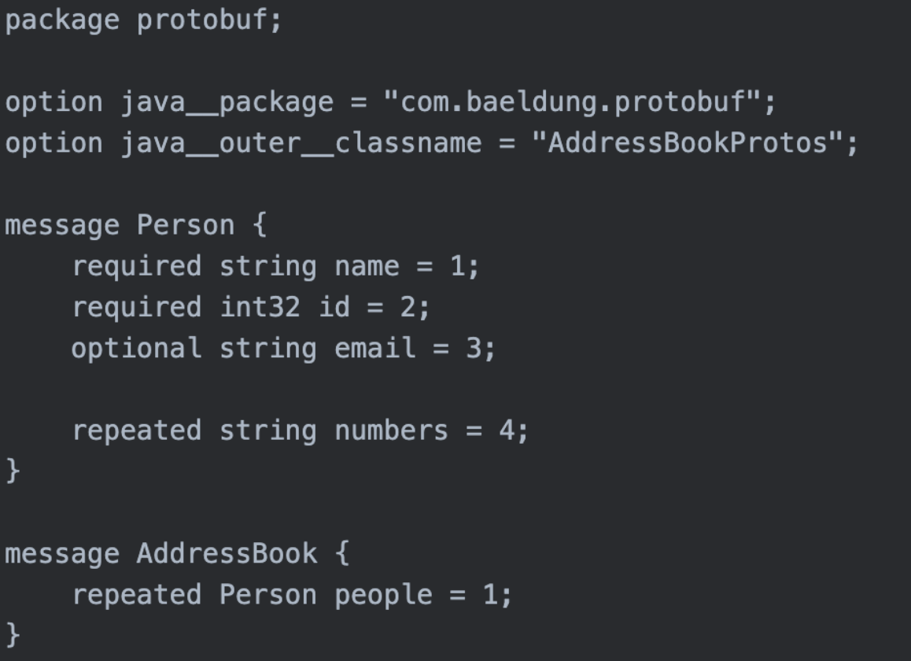
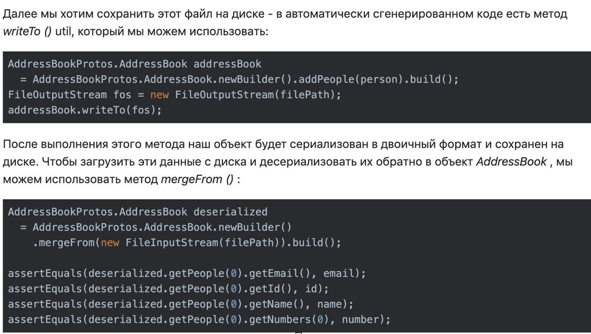
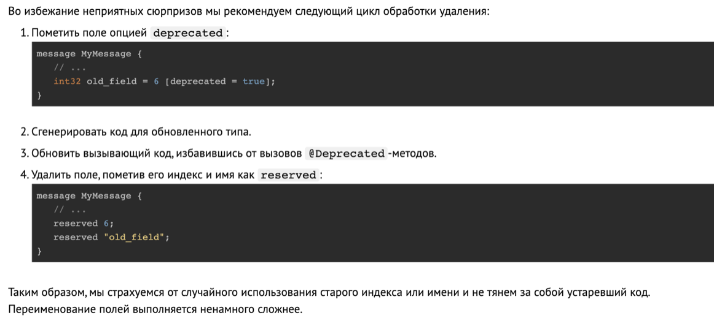
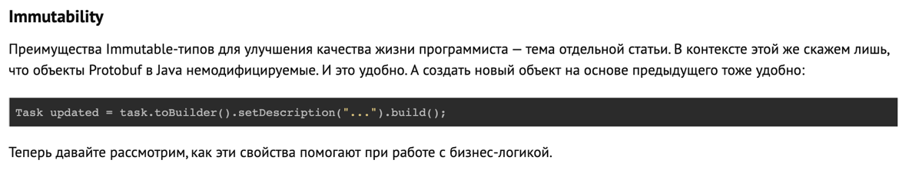

# Protobuf



Наш протокол состоит из двух типов данных: `Person` и `AddressBook`. После генерации кода (подробнее об этом в следующем разделе) эти классы будут внутренними 
классами внутри класса `AddressBookProtos`.

## Ключевые слова
- `required` - Когда мы хотим определить обязательное поле - это означает, что создание объекта без такого поля вызовет исключение `Exception`, нам нужно 
использовать  ключевое слово `required`.
- `optional` - Создание поля с ключевым словом `optional` означает, что это поле не нужно устанавливать. 
- `repeated` - это тип массива переменного размера.

> As you can see, each field in the message definition has a unique number. These field numbers are used to identify your fields in the message binary format, 
and should not be changed once your message type is in use. Note that field numbers in the range 1 through 15 take one byte to encode, including the field 
number and the field's type (you can find out more about this in Protocol Buffer Encoding). Field numbers in the range 16 through 2047 take two bytes. So you 
should reserve the numbers 1 through 15 for very frequently occurring message elements. Remember to leave some room for frequently occurring elements that 
might be added in the future.

## Генерация Java-кода из файла Protobuf

```
protoc -I=. --java__out=. Addressbook.proto
```

- Команда `protoc` создаст выходной файл `Java` из нашего файла `addressbook.proto`. 
- Опция `-I` указывает каталог, в котором находится файл `proto` `.` 
- `Java-out` указывает каталог, в котором будет создан сгенерированный класс. `_`

Сгенерированный класс будет иметь сеттеры, геттеры, конструкторы и конструкторы для наших определенных сообщений. Он также будет иметь несколько утилит для 
сохранения файлов `protobuf` и десериализации их из двоичного формата в класс `Java`.

## Создание экземпляра сообщений, определенных для `Protobuf`




## Удаление полей

С удалением полей надо обходиться деликатнее. Можно просто удалить поле, и, скорее всего, все будет работать. Но в таком кавалеристском наскоке есть риски.
Может статься, что при следующей модификации типа кто-то добавит поле с таким же индексом, как недавно удаленное. Это поломает бинарную совместимость. Если же 
в будущем кто-то добавит поле с таким же именем, но с другим типом, то это поломает совместимость с вызывающим кодом.

Авторы `Protobuf` рекомендуют такие поля переименовывать, прибавляя префикс `OBSOLETE_`, или удалять, помечая индекс этого поля с помощью инструкции 
`reserved`.

```proto
message Foo {
  reserved 2, 15, 9 to 11;
  reserved "foo", "bar";
}
```



## Переименование полей

Поскольку сериализация основывается на индексах полей, а не на их именах, то, если что-то было названо неудачно, переименование не будет влечь за собой 
конвертацию данных или необходимость обновлять ПО на всех узлах. Если переименовать поле, то обновленный тип будет бинарно совместим.




## Полезные ссылки

[Зарезервированные поля](https://developers.google.com/protocol-buffers/docs/proto3#reserved)

[Введение в буфер протокола Google - codeflow](https://www.codeflow.site/ru/article/google-protocol-buffer)

[Документация Гугл](https://developers.google.com/protocol-buffers/docs/proto3)

[Protobuf — не только сериализация. Генерация кода и другие прикладные аспекты - dou](https://dou.ua/lenta/articles/protobuf-guide/)
