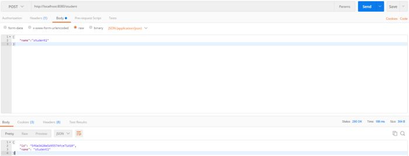

# Spring

`Spring Framework` (или коротко Spring) — универсальный open-source фреймворк с для Java. Несмотря на то, что Spring Framework не обеспечивает какую-либо 
конкретную модель программирования, он стал широко распространённым в Java-сообществе главным образом как альтернатива и замена модели Enterprise JavaBeans.

## Особенности и преимущества
- `Внедрение зависимостей (DI) и инверсия управления (IoC)` позволяют писать независимые друг от друга компоненты, что дает преимущества в командной 
разработке, переносимости модулей и т.д..
- `Spring IoC` контейнер управляет жизненным циклом `Spring Bean` и настраивается наподобие `JNDI lookup` (поиска).
- Проект `Spring` содержит в себе множество подпроектов, которые затрагивают важные части создания софта, такие как веб сервисы, работа с базами данных, 
загрузка файлов, обработка ошибок и многое другое. Всё это настраивается в едином формате и упрощает поддержку приложения.

## Inversion of Control (IoC)

`Инверсия управления` - это принцип в разработке программного обеспечения, при котором управление объектами или частями программы передается в контейнер или
framework. Чаще всего он используется в контексте объектно-ориентированного программирования.

В отличие от традиционного программирования, в котором наш пользовательский код выполняет вызовы библиотеки, IoC позволяет инфраструктуре управлять потоком 
программы и выполнять вызовы нашего пользовательского кода в зависимости от событий, которые были выполнены. Чтобы включить это, фреймворки используют 
абстракции со встроенным дополнительным поведением.

Если мы хотим добавить наше собственное поведение, нам нужно расширить классы фреймворка или подключить наши собственные классы.

**Преимущества этой архитектуры:**
- Отделение выполнения задачи от ее реализации.
- Облегчить переключение между различными реализациями.
- Полезно при разработке модульных систем. Вы можете заменить компоненты без перекомпиляции.
- Более легкое тестирование программы путем изоляции компонента или проверки его зависимостей и обеспечения взаимодействия компонентов через контракты.

Инверсия управления может быть достигнута с помощью различных механизмов, таких как: 
`Strategy design pattern`, `ServiceLocator pattern`, `Factory pattern` и внедрение зависимостей (`DI`).

## Dependency Injection

Класс должен полностью сосредоточиться на выполнении своих обязанностей, а не на создании объектов, необходимых для выполнения этих обязанностей. 
И именно здесь начинается внедрение зависимостей: `она предоставляет классу требуемые объекты`.

`Dependency Injection (DI)`  – один из видов инверсии управления (`Inversion of Control – IoC`). Он означает то, что мы передаем задачу создания и управления 
зависимостями кому-то со стороны. В случае спринга это будет его контейнер (`Application Context`).

**Существует три основных типа внедрения зависимостей:**
- `constructor injection`: все зависимости передаются через конструктор класса.
- `setter injection`: разработчик добавляет setter-метод, с помощью которого инжектор внедряет зависимость
- `field injection`: создаем поле и навешиваем `@Autowired`

## IoC container

Контейнер IoC - это общая характеристика фреймворков, реализующих IoC.

В среде `Spring` контейнер `IoC` представлен интерфейсом `ApplicationContext`. Контейнер `Spring` отвечает за создание экземпляров, настройку и сборку бинов, 
а также за управление их жизненным циклом.

Для сборки бинов контейнер использует метаданные конфигурации, которые могут быть в форме конфигурации `XML` или `аннотаций`.

Вот один из способов создания экземпляра контейнера вручную:
```java
ApplicationContext context = new ClassPathXmlApplicationContext("applicationContext.xml");
```

## Типы контейнеров

- Spring `BeanFactory` Container
Это самый простой контейнер, который обеспечивает базовую поддержку `DI` и который основан на интерфейсе `org.springframework.beans.factory.BeanFactory`. Такие
интерфейсы, как `BeanFactoryAware` и `DisposableBean` всё ещё присутствуют в `Spring` для обеспечения обратной совместимости. `BeanFactory` обычно используется
тогда, когда ресурсы ограничены (мобильные устройства). Поэтому, если ресурсы не сильно ограничены, то лучше использовать `ApplicationContext`.

- Spring `ApplicationContext` Container
`ApplicationContext` является более сложным и более продвинутым `Spring Container-ом`. Так же, как `BeanFactory`, `ApplicationContext` загружает бины,
связывает их вместе и конфигурирует их определённым образом. Но кроме этого, `ApplicationContext` обладает дополнительной функциональностью: распознавание
текстовых сообщений из файлов настройки и отображение событий, которые происходят в приложении различными способами. Этот контейнер определяется интерфейсом 
`org.springframework.context.ApplicationContext`.

**Чаще всего используются следующие реализации AppicationContext:**
- `FileSystemXmlApplicationContext`
Загружает данные о бине из `XML` файла. При использовании этой реализации в конструкторе необходимо указать полный адрес конфигурационного файла.
- `ClassPathXmlApplicationContext`
Этот контейнер также получает данные о бине из `XML` файла. Но в отличие от `FileSystemApplicationContext`, в этом случае необходимо указать относительный 
адрес конфигурационного файла (`CLASSPATH`).
- `WebXmlApplicationContext`
Эта реализация `ApplicationContext` получает необходимую информацию из веб-приложения.

## Что такое бин Bean?

`Бины` – это объекты, которые являются основой приложения и управляются `Spring IoC` контейнером. Определение бина содержит метаданные конфигурации, 
которые необходимы управляющему контейнеру для получения следующей информации:
- Как создать бин;
- Информацию о жизненном цикле бина;
- Зависимости бина.

## Области видимости бинов

Когда мы определяем `bean` в Spring Framework, у нас есть возможность объявить область видимости этого компонента. 
В `Spring Framework` имеются пять возможных значений свойства `scope`:
- `singleton`: Определяет один единственный бин для каждого контейнера `Spring IoC` (**используется по умолчанию**). Этот экземпляр помещается в кэш таких 
же бинов (синглтонов) и все последующие вызовы бина с таким именем будут возвращать объект из кэша.
- `prototype`: Когда мы присваиваем свойству scope значение `prototype`, контейнер `Spring IoC` создаёт новый экземпляр бина на каждый полученный запрос.
- `request`: Создаётся один экземпляр бина на каждый `HTTP` запрос. Касается исключительно `ApplicationContext`.
- `session`: Создаётся один экземпляр бина на каждую `HTTP` сессию. Касается исключительно `ApplicationContext`.
- `global-session`: Создаётся один экземпляр бина на каждую глобальную `HTTP` сессию. Касается исключительно `ApplicationContext`.

## Жизненный цикл бинов

`Spring бины` инициализируются при инициализации `Spring` контейнера и происходит внедрение всех зависимостей. Когда контейнер уничтожается, то уничтожается 
и всё содержимое.

После создания экземпляра бина, могут понадобиться некоторые действия для того, чтобы сделать его работоспособным. Также при удалении бина из контейнера, 
необходима очистка. В документации указан список того, что происходит с бином от момента создания до момента уничтожения. Но для начального понимания нам 
необходимо разобраться в двух наиболее важных методах, которые вызываются во время инициализации бина и его уничтожения.

Для управления созданием и уничтожением бина у нас есть параметры `init-method` и `destroy-method` для `xml`-файлов. 

В качестве альтернативы есть интерфейсы `InitializingBean` c методом `afterPropertiesSet()` и `DisposableBean` с методом `destroy()`. Эти интерфейсы просто 
нужно реализовать в классе бина.

Еще один вариант аннотации `@PostConstruct` и `@PreDestroy`.

## Является ли бин потокобезопасным?

По умолчанию бин задается как `синглтон` в Spring. Таким образом все публичные переменные класса могут быть изменены одновременно из разных мест. 
Так что — нет, не является. Однако поменяв область действия бина на `request`, `prototype`, `session` он станет потокобезопасным, но это скажется на 
производительности.

## field injection VS constructor injection

Второй вариант лучше потому что:
- зависимости четко определены. При тестировании или создании экземпляров объекта в любых других обстоятельствах (например, явное создание экземпляров 
компонента в классе конфигурации).
- в таком случае поле можно сделать финальным.
- вам не нужно использовать рефлексию, чтобы установить зависимость.

## Что такое controller в Spring MVC?

Ключевым интерфейсом в `Spring MVC` является `Controller`. Контроллер обрабатывает запросы к действиям, осуществляемые пользователями в пользовательском 
интерфейсе, взаимодействуя с уровнем обслуживания, обновляя модель и направляя пользователей на соответствующие представления в зависимости от результатов 
выполнения. `Controller` — управление, связь между моделью и видом.

Основным контроллером в `Spring MVC` является `org.springframework.web.servlet.DispatcherServlet`. Задается аннотацией `@Controller` и часто используется с 
аннотацией `@RequestMapping`, которая указывает какие запросы будут обрабатываться этим контроллером.

## Что такое DispatcherServlet

Вся логика `Spring MVC` построена вокруг `DispatcheerServlet`, который принимает и обрабатывает все `HTTP`-запросы и ответы на них. Рабочий процесс обработки 
запроса `DispatcherServlet'ом` проиллюстрирован на следующей диаграмме:


Ниже приведена последовательность событий, соответствующая входящему `HTTP`-запросу:

1. После получения запроса `DispatcherServlet` обращается к интефейсу `HandlerMapping`, который определяет, какой контроллер должен быть вызван, после чего, 
отправляет запрос в нужный контроллер.
2. `Controller` принимает запрос и вызывает соответствующий метод. Вызванный метод определяет данные модели, основанные на определённой бизнес-логике и 
возвращает в `DispatcherServlet` имя `View`.
3. При помощи интерфейса `ViewResolver` `DispatcherServlet` определяет, какой `View` нужно использовать на основании полученного имени.
4. После того, как `View` создан, `DispatcherServlet` отправляет данные модели в виде атрибутов во `View`, который в конечном итоге отображается в браузере.

Все вышеупомянутые компоненты, а именно, `HandlerMapping`, `Controller` и `ViewResolver`, являются частями интерфейса `WebApplicationContext`.

## Какая разница между аннотациями @Component, @Repository и @Service в Spring?

- `@Component` используется для указания класса в качестве компонента спринг. При использовании поиска аннотаций, такой класс будет сконфигурирован как 
spring bean. Пользовательские аннотации, производные от `@Component`, могут добавлять специальную логику в бинах.
- `@Controller` специальный тип класса, применяемый в `MVC` приложениях. Обрабатывает запросы и часто используется с аннотацией `@RequestMapping`.
- `@Repository` указывает, что класс используется для работы с поиском, получением и хранением данных. Аннотация может использоваться для реализации шаблона
`DAO`. Например, бины, созданные при помощи `@Repository`, дополнительно имеют обработку для `JDBC Exception`.
- `@Service` указывает, что класс является сервисом для реализации бизнес логики (на самом деле не отличается от `Component`, но просто помогает разработчику 
указать смысловую нагрузку класса).

Для указания контейнеру на класс-бин можно использовать любую из этих аннотаций. Но различные имена позволяют различать назначение того или иного класса.

## Для чего нужна аннотация @ComponentScan?

Первый шаг для описания Spring Beans это добавление аннотации — `@Component`, или `@Service`, или `@Repository`.

Однако, Spring ничего не знает об этих бинах, если он не знает где искать их. То, что скажет `Spring` где искать эти бины и называется `Component Scan`. 
В `@ComponentScan` вы указываете пакеты, которые должны сканироваться.

Spring будет искать бины не только в пакетах для сканирования, но и в их подпакетах.

## Как вы добавите Component Scan в Spring Boot?

```java
@SpringBootApplication
public class Application {
    public static void main(String[] args) {
        SpringApplication.run(Application.class, args);
    }
}
```

`@SpringBootApplication` определяет автоматическое сканирование пакета, где находится класс `Application`. Всё будет в порядке, ваш код целиком находится в 
указанном пакете или его подпакетах.

Однако, если необходимый вам компонент находится в другом пакете, вы должны использовать дополнительно аннотацию `@ComponentScan`, где перечислите все
дополнительные пакеты для сканирования.

```java
@SpringBootApplication
@ComponentScan(basePackages = "com.baeldung.componentscan.springbootapp.animals")
```

## В чём отличие между @Component и @ComponentScan?

`@Component` и `@ComponentScan` предназначены для разных целей:
- `@Component` помечает класс в качестве кандидата для создания Spring бина.
- `@ComponentScan` указывает где Spring искать классы, помеченные аннотацией `@Component` или его производной.

## В чём разница между @Bean и @Component?

- `@Bean` используется в конфигурационных классах Spring. Он используется для непосредственного создания бина.
- `@Component` используется со всеми классами, которыми должен управлять Spring. Когда Spring видит класс с `@Component`, Spring определяет этот класс как
кандидата для создания bean.

## Можем ли мы использовать @Component вместо @Service для бизнес логики?

Да. Конечно.

Если `@Component` является универсальным стереотипом для любого Spring компонента, то `@Service` в настоящее время является его псевдонимом. Однако, 
в официальной документации `Spring` рекомендуется использовать именно `@Service` для бизнес логики.

## В чем различие между web.xml и servlet.xml?

- `web.xml` — Метаданные и конфигурация любого веб-приложения, совместимого с Java EE. Java EE стандарт для веб-приложений.
- `servlet.xml` — файл конфигурации, специфичный для Spring Framework.

## В чем разница между Сквозной Функциональностью (Cross Cutting Concerns) и АОП (аспектно оринтированное программирование)?

- `Сквозная Функциональность` — функциональность, которая может потребоваться вам на нескольких различных уровнях — логирование, управление 
производительностью, безопасность и т.д.
- `АОП` — один из подходов к реализации данной проблемы.

## В чем разница между IOC (Inversion of Control) и Application Context?

- `IOC` - инверсия управления. Вместо ручного внедрения зависимостей, фреймворк забирает ответственность за это.
- `ApplicationContext` — реализация IOC спрингом.

## В чем разница между classPathXmlApplicationContext и annotationConfigApplicationContext?

- `classPathXmlApplicationContext` — если вы хотите инициализировать контекст Spring при помощи `xml`
- `annotationConfigApplicationContext` — если вы хотите инициализировать контекст Spring при помощи конфигурационного класса `java`

## Как вы решаете какой бин инжектить, если у вас несколько подходящих бинов. Расскажите о @Primary и @Qualifier?

Если есть бин, который вы предпочитаете большую часть времени по сравнению с другими, то используйте `@Primary`, и используйте `@Qualifier` для нестандартных 
сценариев.

Если все бины имеют одинаковый приоритет, мы всегда будем использовать `@Qualifier`

Если бин надо выбрать во время исполнения программы, то эти аннотации вам не подойдут. Вам надо в конфигурационном классе создать метод, пометить его 
аннотацией `@Bean`, и вернуть им требуемый бин.

## Как мы можем выбрать подходящий бин при помощи application.properties?

Рассмотрим пример:

```java
interface GreetingService {
    public String sayHello();
}


@Component(value="real")
class RealGreetingService implements GreetingService {
    public String sayHello() {
        return "I'm real";
    }
}

@Component(value="mock")
class MockGreetingService implements GreetingService {
    public String sayHello() {
        return "I'm mock";
    }
}
```

Тогда в `application.properties` добавим свойство:

```java
application.greeting: real
```

Воспользуемся данным решением:

```java
@RestController
public class WelcomeController {
    @Resource(name="${application.greeting}")
    private GreeterService service1;
}
```

## В чём разница между @Controller и @RestController?

`@RestController = @Controller + @ResponseBody`

`@RestController` превращает помеченный класс в Spring-бин. Этот бин для конвертации входящих/исходящих данных использует `Jackson message converter`. 
Как правило целевые данные представлены в `json` или `xml`.

## Почему иногда мы используем @ResponseBody, а иногда ResponseEntity?

`@ResponseEntity` необходим, только если мы хотим кастомизировать ответ, добавив к нему статус ответа. Во всех остальных случаях будем использовать 
`@ResponseBody`.

```java
@GetMapping(value=”/resource”) 
@ResponseBody 
public Resource sayHello() { 
  return resource; 
}

@PostMapping(value=”/resource”) 
public ResponseEntity createResource() { 
  return ResponseEntity.created(resource).build(); 
}
```

Для `@ResponseBody` единственные состояния статуса это `SUCCESS(200)`, если всё ок и `SERVER ERROR(500)`, если произошла какая-либо ошибка.

Допустим мы что-то создали и хотим отправить статус `CREATED(201)`. В этом случае мы используем `@ResponseEntity`.

## Почему для конфиденциальных данных рекомендуется использовать POST, а не GET запросы?

- В случае `GET` запроса передаваемые параметры являются частью `url`, и все маршрутизаторы, через которые пройдет наш `GET` запрос, смогут их прочитать.
- В случае `POST` запроса передаваемые параметры являются частью тела запроса. При использовании `HTTPS`, тело запроса шифруется. Следовательно, 
использование `POST` запросов является более безопасным.

## Можно ли передать в запросе один и тот же параметр несколько раз?

Да, можно принять все значения, используя массив в методе контроллера: 

```java
http://localhost:8080/login?name=Ranga&name=Ravi&name=Sathish

public String method(@RequestParam(value="name") String[] names){   
}
```

## Схема ServletFilter и HandlerInterceptor


## Что такое ServletFilter?

Фильтр выполняет задачи фильтрации либо для запроса к ресурсу, либо для ответа от ресурса, либо для обоих случаев. Каждый фильтр имеет доступ к объекту 
`FilterConfig`, из которого он может получить свои параметры инициализации, ссылку на `ServletContext`, который он может использовать.

Контейнер сервлета вызывает метод инициализации ровно один раз после создания экземпляра фильтра. Метод инициализации должен успешно завершиться, прежде чем 
фильтру будет предложено выполнить какие-либо действия по фильтрации.

Фильтр выполняет операцию фильтрации в методе `doFilter()`, и он вызывается контейнером каждый раз, когда пара запрос/ответ проходит через цепочку запрос-ответ.

Метод `destroy()` вызывается только после завершения всех потоков в методе фильтра `doFilter()` или по истечении таймаута. Этот метод дает фильтру возможность 
очистить любые ресурсы, которые удерживаются (например, память, дескрипторы файлов, потоки), и убедиться, что любое постоянное состояние синхронизируется с 
текущим состоянием фильтра в памяти.

Вот некоторые примеры использования фильтров:
1. Аутентификация
2. Ведение журнала и аудит
3. Преобразование изображений
4. Сжатие данных
5. Шифрование

## Что такое HandlerInterceptor?

`HandlerInterceptor` вызывается до того, как соответствующий `HandlerAdapter` инициирует выполнение самого `handler-а`. Этот механизм может использоваться для
большого количества аспектов предварительной обработки, например для проверок авторизации или общего поведения обработчика, такого как изменение языка или темы. 
Его основная цель - выделить повторяющийся код `handler-a`.

`HandlerInterceptor` очень похож на `ServletFilter`, но он просто позволяет настраивать предварительную обработку с возможностью запрета выполнения самого 
`handler-a` и настраиваемой пост-обработки. **Фильтры являются более мощными, поскольку они позволяют обмениваться объектами запроса и ответа**, которые передаются 
по цепочке. Обратите внимание, что фильтр настраивается в `web.xml`, `HandlerInterceptor` в контексте приложения.

`DispatcherServlet` обрабатывает `handler` в цепочке выполнения, состоящей из любого количества `interceptor-ов`, с самим `handler-ом` в конце. С помощью метода 
`preHandle()` каждый перехватчик может решить прервать цепочку выполнения, обычно отправляя ошибку `HTTP` или записывая собственный ответ.

Перехватчики, работающие с `HandlerMapping` на платформе, должны реализовывать интерфейс `HandlerInterceptor`.

Этот интерфейс содержит три основных метода:
- `preHandle()` - вызывается перед выполнением фактического обработчика, но представление еще не создано
- `postHandle()` - вызывается после выполнения обработчика
- `afterCompletion()` - вызывается после завершения полного запроса и создания представления

## ServletFilter VS HandlerInterceptor

|Servlet filter|Handler interceptor|
|--------------|-------------------|
|Фильтры настраиваются в `web.xml`|Интерсепторы настраиваются в `application context`. Это концепция отностится сугубо к Spring|
|Фильтр это Java класс, который выполняется сервлет контейнером для каждого `HTTP` запроса и ответа|Spring интерсепторы похожи на фильтры, но они работают в Spring контексте|
|Дает возможность управлять входящим `HTTP` запросом до того, как он достигнет ресурса - `JSP` страничку, эндпоинт и тд.|Он более мощный для управления `HTTP` запросом и ответом, но они могут реализовать более сложное поведение, потому что могут получить доступ ко всему контексту Spring|
|Фильтр сервлетов обычно применяется ко всем запросам, способным учитывать только параметры каждого запроса|Имеет доступ только к конкретному хендлеру - это означает, что любое действие, которое вы выполняете, может варьироваться в зависимости от того, что делает этот запрос.|
|`doFilter()` более универсален, чем `postHandle()`. Вы можете изменить объект запроса и ответа и подложить этот измененный обхект в цепочку запросов или даже заблокировать обработку запроса|Предоставляет 3 разных метода, поэтому мы можем применить нужное действие в определенный момент|
|Может содержать цепочку фильтров и порядок их выполнения, но они не могут быть сконфигурированы на уровне `handler mapping`|Можно устанавливать разные интерсепторы для разных груп хендлеров, они сконфигурированы на уровне `handler mapping`|
|Фильтр хорошо подходит для обработки запросов и просмотра содержимого, например для составных форм и сжатия GZIP.|Подробные задачи предварительной обработки, связанные с обработчиком, являются кандидатами для реализаций `HandlerInterceptor`, особенно с учетом кода общего обработчика и проверок авторизации.|

## Как реализовать Filter?

```java
@Component
@Order(1)
public class TransactionFilter implements Filter {

	@Autowired
	private HttpServletReqUtil reqUtil;

	@Override
	public void doFilter(ServletRequest request, ServletResponse response, FilterChain chain) throws IOException, ServletException {
		final MyHttpServletRequestWrapper wrappedRequest = new MyHttpServletRequestWrapper((HttpServletRequest) request);
		System.out.println("Inside Servlet Filter");
		System.out.println("User IP address: " + reqUtil.getRemoteAddress(wrappedRequest));
		System.out.println("Request Params: " + reqUtil.getRequestParams(wrappedRequest));
		System.out.println("Request Payload: " + reqUtil.getPayLoad(wrappedRequest));
		System.out.println("Exiting Servlet Filter");
		chain.doFilter(wrappedRequest, response);
	}
}
```

Реализация `ServletFilter` действительно проста, мы реализуем `javax.servlet.Filter`, `@Order` указывает порядок, в котором фильтры должны выполняться. 
Мы указали порядок как 1, поэтому это будет первый фильтр, который будет выполнен. `chain.doFilter`, передает объект запроса и ответа следующему фильтру в цепочке
или обработчику, если это последний фильтр.

Внутри метода `doFilter()` я проверил, могу ли я получить доступ к `IP`-адресу пользователя, параметрам запроса из запроса, пейлоду, то есть к телу запроса из 
объекта запроса. Но проблема, с которой мы сталкиваемся, заключается в том, что **запрос может быть прочитан только один раз**, и если мы попытаемся получить к 
нему доступ в фильтре, он выдаст ошибку при доступе к нему в контроллере. Поэтому, чтобы предотвратить это, я создал оболочку, которая расширяет 
`HttpServletRequestWrapper`, чтобы возвращать копию запроса через его конструктор.

```java
public class MyHttpServletRequestWrapper extends HttpServletRequestWrapper {
	private ByteArrayOutputStream cachedBytes;

	public MyHttpServletRequestWrapper(HttpServletRequest request) {
		super(request);
	}

	@Override
	public ServletInputStream getInputStream() throws IOException {
		if (cachedBytes == null)
			cacheInputStream();
		return new CachedServletInputStream();
	}

	@Override
	public BufferedReader getReader() throws IOException {
		return new BufferedReader(new InputStreamReader(getInputStream()));
	}

	private void cacheInputStream() throws IOException {
		cachedBytes = new ByteArrayOutputStream();
		IOUtils.copy(super.getInputStream(), cachedBytes);
	}

	/* An inputstream which reads the cached request body */
	public class CachedServletInputStream extends ServletInputStream {
		private ByteArrayInputStream input;

		public CachedServletInputStream() {
			/* create a new input stream from the cached request body */
			input = new ByteArrayInputStream(cachedBytes.toByteArray());
		}

		@Override
		public int read() throws IOException {
			return input.read();
		}

		@Override
		public boolean isFinished() {
			return false;
		}

		@Override
		public boolean isReady() {
			return false;
		}
		
		@Override
		public void setReadListener(ReadListener listener) {
		}
	}
}
```

Теперь, когда мы можем обращаться к объекту запроса несколько раз, я создал класс для возврата параметров из объекта запроса, который я использовал как в 
`ServletFilter`, так и в `HandlerInterceptor` для демонстрационных целей.

```java
@Service
public class HttpServletReqUtil {

	public String getRemoteAddress(HttpServletRequest request) {
		String ipAddress = request.getHeader("X-FORWARDED-FOR");
		if (ipAddress == null) {
			ipAddress = request.getRemoteAddr();
		}
		return ipAddress;
	}

	public String getPayLoad(HttpServletRequest request) {
		final String method = request.getMethod().toUpperCase();
		if ("POST".equals(method) || "PUT".equals(method)) {
			return extractPostRequestBody(request);
		}
		return "Not a POST or PUT method";
	}

	public String getRequestParams(HttpServletRequest request) {
		final StringBuilder params = new StringBuilder();
		Enumeration<String> parameterNames = request.getParameterNames();
		for (; parameterNames.hasMoreElements();) {
			String paramName = parameterNames.nextElement();
			String paramValue = request.getParameter(paramName);
			if ("password".equalsIgnoreCase(paramName) || "pwd".equalsIgnoreCase(paramName)) {
				paramValue = "*****";
			}
			params.append(paramName).append(": ").append(paramValue).append(System.lineSeparator());
		}
		return params.toString();

	}

	private static String extractPostRequestBody(HttpServletRequest request) {
		if ("POST".equalsIgnoreCase(request.getMethod())) {
			Scanner s = null;
			try {
				s = new Scanner(request.getInputStream(), "UTF-8").useDelimiter("\\A");
			} catch (IOException e) {
				e.printStackTrace();
			}
			return s.hasNext() ? s.next() : "";
		}
		return "";
	}
}
```

Итак, в `TransactionFilter` я автоматически подключил этот класс и передал завернутый объект `Request` в каждую из функций и распечатал возвращенные из них 
значения.

## Как реализовать HandlerInterceptor?

```java
@Component
public class GeneralInterceptor implements HandlerInterceptor {

	@Autowired
	private HttpServletReqUtil reqUtil;

	@Override
	public boolean preHandle(HttpServletRequest request, HttpServletResponse response, Object handler) throws Exception {
		final MyHttpServletRequestWrapper wrappedRequest = new MyHttpServletRequestWrapper(request);
		System.out.println("Pre handle method has been called");
		System.out.println("User IP address: " + reqUtil.getRemoteAddress(wrappedRequest));
		System.out.println("Request Params: " + reqUtil.getRequestParams(wrappedRequest));
		System.out.println("Request Payload: " + reqUtil.getPayLoad(wrappedRequest));
		System.out.println("Exiting Pre handle method");
		return true;
	}

	@Override
	public void postHandle(HttpServletRequest request, HttpServletResponse response, Object handler, ModelAndView modelAndView) throws Exception {
		   System.out.println("Post handle method has been called");
	}

	@Override
	public void afterCompletion(HttpServletRequest request, HttpServletResponse response, Object handler, Exception exception) throws Exception {
		   System.out.println("After Completion method has been called");
	}
}
```

`Interceptor` реализует интерфейс `HandlerInterceptor`, который имеет 3 основных метода:

- `prehandle()` - вызывается перед выполнением фактического обработчика, но представление еще не создано
- `postHandle()` - вызывается после выполнения обработчика
- `afterCompletion()` - вызывается после завершения полного запроса и создания представления

Я распечатал элементы из объекта запроса так же, как и в случае фильтра. Теперь, когда перехватчик готов, нам нужно зарегистрироваться в `InterceptorRegistry`.

```java
@Component
public class InterceptorAppConfig extends WebMvcConfigurationSupport {
	@Autowired
	GeneralInterceptor generalInterceptor;

	@Override
	public void addInterceptors(InterceptorRegistry registry) {
		registry.addInterceptor(generalInterceptor);
	}
}
```

Теперь, когда мы написали наш фильтр и интерспетор, давайте посмотрим на иерархию, в которой эти методы перехватывают остальные вызовы api. Я создал контроллер,
чтобы добавить ученика и получить ученика по идентификатору, давайте отправим запрос и посмотрим, как работают фильтр и перехватчик.




Мы видим последовательность операторов печати, `HTTP`-запрос сначала попадает в фильтр сервлета, где печатаются `IP`-адрес пользователя и payload, поскольку в 
запросе нет никаких параметров запроса, он их не печатал. Затем запрос достиг метода `preHandle()` в `handler interceptor`, где он распечатывает те же данные, 
а затем он достигает фактического контроллера, где объект ученика сохраняется в базе данных.

Таким образом, порядок выполнения следующей:
```
1. Фильтр -> 2. Перехватчик -> 3. Контроллер HTTP-запроса.
```

От контроллера ответ сначала поступает в метод `postHandle()`, а затем в метод `afterCompletion()` в интерсепторе. Давайте также проверим пример для 
`requestparams`.


Последовательность такая же, как и раньше, с той лишь разницей, что мы не видим пейлод из тела запроса, поскольку это запрос на получение, а идентификатор, который
был отправлен в параметрах запроса, виден.

## Полезные ссылки

[Inversion of Control Containers and the Dependency Injection pattern - Martin Fowler](https://www.martinfowler.com/articles/injection.html#ComponentsAndServices)

[Intro to Inversion of Control and Dependency Injection - Baeldung](https://www.baeldung.com/inversion-control-and-dependency-injection-in-spring)

[Краткое введение во внедрение зависимостей](https://medium.com/@xufocoder/a-quick-intro-to-dependency-injection-what-it-is-and-when-to-use-it-de1367295ba8)

[Spring: вопросы к собеседованию - habr](https://habr.com/ru/post/350682/)

[Introduction To Servlet Filter and Handler Interceptor - Medium](https://medium.com/techno101/introduction-to-servlet-filter-and-handler-interceptor-ba1167b1f52c)

[Servlet Filter and Handler Interceptor- Spring boot Implementation - Medium](https://medium.com/techno101/servlet-filter-and-handler-interceptor-spring-boot-implementation-b58d397d9dbd)
