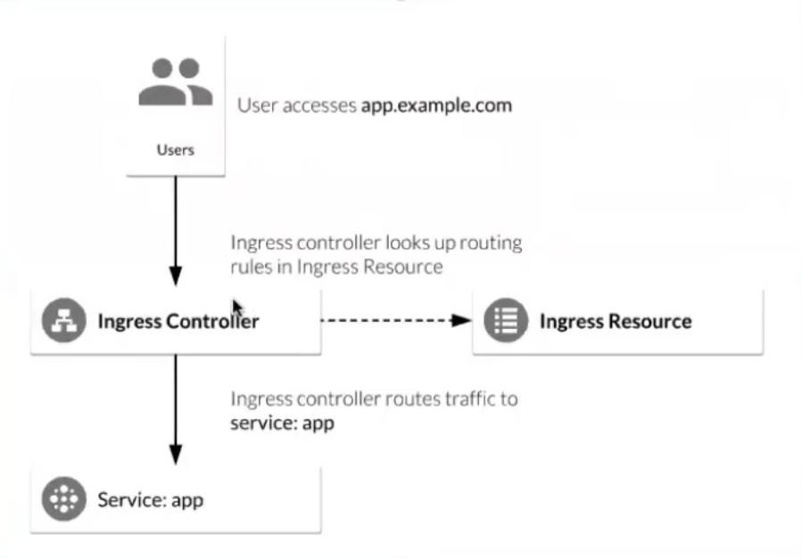

# Kubernetes

Для существования кластера в кубере должна быть управляющая нода (обычно она наззывается мастер), а также нужны workers - это ноды, на которых будет выполнятся 
работа, которая нам нужна. Например, запуск приложения и тд. Различие мастера от воркеров в гугл клауд в том, что физического доступа к мастеру нет. 
Мастер создается гуглом со всеми необходимыми настройками. Гугл предоставляет нам апи с доступом к этому мастеру. Есть некоторый нюанс с мастером, 
если мы уже подняли весь наш проект и мастер упал это не означает, что наш проект также упал. Всё что делает мастер - управляет всей инфраструктурой кубера. 
Без мастера мы не можем повлиять на состояние кубернетеса и посмотреть текущее состояние. 

Кубернетес сам управляет ресурсами, распределяет нагрузку.

`Кубернетес мастер` это апи сервис, с которым мы можем общаться с помощью http запросов.

## Nodes

`Нода` это виртуальная машина, на которой поднят докер сервис.

`kubectl get nodes` - показывает список нод и их статус

```
NAME                                        STATUS  ROLES   AGE   VERSION          
gke-k8s-course-1-default-pool-1e138f52-b7kr Ready   <none>  109m  v1.16.15-gke.4901
```
  
`kubectl describe nodes` - показывает всё что происходит с нодой, что запущено и тд

## Namespace

`Неймспейс` это группа внутри кластера, которая используется для разграничения ресурсов. Например разные неймспейсы для разных пул риквестов. При удалении 
неймспейса все ресурсы внутри также удаляются. 

`kubectl get ns` или `kubectl get namespaces` - получить список неймспейсов

`kubectl config set-context --current --namespace=homework-2` - переключиться между неймспейсами 

`kubectl config view --minify | grep namespace` - просмотреть текущий неймспейс

## Pods

`Под` - основная, самая маленькая и простая единица кубера. Это пространство, которое в скоупе кубера имеет свой айпишник 
(который находится в приватной сети кубера, его не видно снаружи). Пода внутри может содержать `volume` (какие-то хранилища данных) и наши приложения в виде 
контейнеров. Обычно это один контейнер, но также их может быть и несколько.

`kubectl get pods` - показывает список всех под из текущего неймспейса

`kubectl get pods -n another-namespace` - показывает список всех под из заданного неймспейса

`kubectl logs python-app` - посмотреть логи на поде `python-app`. Проблема в том, что при рестарте пода логи и volume могут очищаться. То есть мы видим информацию, 
которая относится к конкретному текущему поду, без инфы, которая была связана с этим же подом до рестарта.

`kubectl port-forward python-app 8081:80` - прокинуть порт на поде `python-app`, где 8081 это порт на нашей локальной поде, а 80 это порт приложения внутри 
контейнера.

`kubectl describe pod python-app` - получить описание поды `python-app`. Describe показывает поле `events` это всё, что происходило с подой. Если пода находится в 
статусе `Running` и долго не поднимается, в ней может не быть логов. А значит будет полезно посмотреть эти `events`.
```
Events:
  Type    Reason     Age   From               Message
  ----    ------     ----  ----               -------
  Normal  Scheduled  28m   default-scheduler  Successfully assigned default/python-app to gke-k8s-course-1-default-pool-1e138f52-b7kr
  Normal  Pulling    28m   kubelet            Pulling image "gcr.io/kuber-course-300812/python-app:0.1"
  Normal  Pulled     28m   kubelet            Successfully pulled image "gcr.io/kuber-course-300812/python-app:0.1"
  Normal  Created    28m   kubelet            Created container python-app
  Normal  Started    28m   kubelet            Started container python-app
```
 
`kubectl delete pod python-app` - удалить под `python-app`.

`kubectl logs python-app-76f945759-wtpsd -c redis` - логи конкретного контейнера на поде

`kubectl exec -it mysql-d795f5db9-df4pb -c mysql -- /bin/bash` - зайти в баш конкретного контейнера нужной поды

## Services

Т.к. поды являются смертными, мы не можем рассчитывать на них в полной мере. Для этого существуют сервисы. Это абстракции, которая определяет 
набор подов и правила доступа к ним.

```yaml
apiVersion: v1
kind: Service
metadata:
  name: flask-app-service
spec:
  type: LoadBalancer
  ports:
  - port: 80
    protocol: TCP
    targetPort: 80
  selector:
    app: flask-app
```

`kubectl get svc` - получить все сервисы
`kubectl expose deployment/redis-deployment --name=redis-service` - пример как заэкспоузить сервис на основе деплоймента

Есть 4 вида сервисов:
- ClusterIP - cамый простой, дефолтный тип сервиса. Он предоставляет сервис внутри кластера, который могут использовать другие приложения внутри кластера. К нему 
невозможно достучаться извне.
- NodePort - это самый простой способ прокинуть внешний трафик напрямую к нашим сервисам. 
- LoadBalancer - стандартный способ открыть доступ к нашим приложениям. 
- ExternalName

## Labels and Selectors

Лейблы дают возможность организации ресурсов в кубере. Это пары ключ-значение, которые прикреплены к любым ресурсам (например, подам).
С помощью лейблов и селекторов мы можем идентифицировать группу объектов. 

На основе лейблов сервис понимает куда ему переправлять запросы. То есть, если есть три поды с лейблом flask-app, то сервис load balancer будет перенаправлять
запросы на эти поды.

`kubectl get pod --show-labels` - Просмотреть поды с лейблами

## Controllers

`Кубернетес контроллеры` - могут создавать поды и управлять ими, менеджить группу под, обрабатывать реплики и развертывания, а также обеспечивать возможность 
самовосстановления на уровне кластера. Например, если нода выходит из строя, контроллер может автоматически заменить под, запланировав идентичную замену на 
другой ноде. Есть несколько основных контроллеров:
- Deployment
- ReplicaSet
- DemonSet
- StatefulSet

### Deployment

Deployment контроллер развертывания обеспечивает декларативные обновления для под и ReplicaSets. Мы описываем желаемое состояние в deployment файле, а контроллер 
deployment изменяет фактическое состояние на желаемое.

Деплоймент автоматически подымает поды за нас. Не нужно это делать вручную.

```yaml
apiVersion: apps/v1
kind: Deployment
metadata:
  name: python-app
#  namespace: my-app
# Эта спецификация описывает спецификацию самого деплоймента.
spec:
  # Указывает какое кол-во реплик (наших подов) будет поднято в следствии выполнения этого деплоймента.
  replicas: 1
  template:
    metadata:
      labels:
        app: python-app
    # Эта спецификация описывает спецификацию наших под.
    spec:
      containers:
        - name: python-app
          image: gcr.io/kuber-course-300812/python-app:0.1
          # Без этого свойства мы не будем пулить имедж каждый раз, а будем переиспользовать тот,
          # который был закэширован. Со значением Always мы будем пулить
          # имедж каждый раз. Еще есть значения IfNotPresent и Never.
          imagePullPolicy: Always
          ports:
            - containerPort: 80
          env:
            - name: REDIS_NAME
              value: redis
          readinessProbe:
            # Проверяем будет ли доступен порт внутри нашего контейнера.
            # Помимо tcp сокетов можно еще использовать get на http.
            tcpSocket:
              port: 80
            # Кол-во секунд перед тем, как начнет выполняться проба.
            initialDelaySeconds: 5
            # Кол-во секунд, через которое будет повторно опрошен контейнер на то жив он или нет.
            # В нашем случае он будет опрашиваться tcp сокетом по 80 порту.
            periodSeconds: 10
          livenessProbe:
            tcpSocket:
              port: 80
            initialDelaySeconds: 15
            periodSeconds: 20
      # Инит контейнеры говорят о том, что пока не выполнятся все инит контейнеры,
      # основные контейнеры стартовать не будут.
      initContainers:
        - name: redis
          image: redis
          ports:
            - containerPort: 6379
          command: ['sh', '-c', 'until redis-cli -h redis-service -p 6379 ping; do echo waiting for redis; sleep 2; done;']
  selector:
    matchLabels:
      app: python-app
```

`kubectl get deployment` - получить деплоймент
 ```
NAME         READY   UP-TO-DATE   AVAILABLE   AGE
python-app   1/1     1            1           3m47s
```

`kubectl describe deployment` - описание деплоймента
```
Name:                   python-app
Namespace:              default
CreationTimestamp:      Fri, 08 Jan 2021 12:48:00 +0200
Labels:                 <none>
Annotations:            deployment.kubernetes.io/revision: 1
Selector:               app=python-app
Replicas:               1 desired | 1 updated | 1 total | 1 available | 0 unavailable
StrategyType:           RollingUpdate
MinReadySeconds:        0
RollingUpdateStrategy:  25% max unavailable, 25% max surge
Pod Template:
  Labels:  app=python-app
  Containers:
   python-app:
    Image:        gcr.io/kuber-course-300812/python-app:0.1
    Port:         80/TCP
    Host Port:    0/TCP
    Liveness:     tcp-socket :80 delay=15s timeout=1s period=20s #success=1 #failure=3
    Readiness:    tcp-socket :80 delay=5s timeout=1s period=10s #success=1 #failure=3
    Environment:  <none>
    Mounts:       <none>
  Volumes:        <none>
Conditions:
  Type           Status  Reason
  ----           ------  ------
  Available      True    MinimumReplicasAvailable
  Progressing    True    NewReplicaSetAvailable
OldReplicaSets:  <none>
NewReplicaSet:   python-app-5688ff5d45 (1/1 replicas created)
Events:
  Type    Reason             Age   From                   Message
  ----    ------             ----  ----                   -------
  Normal  ScalingReplicaSet  11m   deployment-controller  Scaled up replica set python-app-5688ff5d45 to 1
```
 
`kubectl delete deployment python-app` - удалить деплоймент

`kubectl rollout status deployment python-app` - ожидает пока не поднимутся все поды в деплойменте
```
Waiting for deployment "python-app" rollout to finish: 0 of 3 updated replicas are available...
Waiting for deployment "python-app" rollout to finish: 1 of 3 updated replicas are available...
Waiting for deployment "python-app" rollout to finish: 2 of 3 updated replicas are available...
deployment "python-app" successfully rolled out
```

Если поменять кол-во реплик с 1 на 3, то команда `kubectl get pods` покажет, что у нас создалось три поды вместо одной.
```
NAME                          READY   STATUS    RESTARTS   AGE
python-app-5688ff5d45-gltk9   1/1     Running   0          2m4s
python-app-5688ff5d45-qkcgp   1/1     Running   0          2m4s
python-app-5688ff5d45-svl4v   1/1     Running   0          2m4s
```

Если мы удалим какую-то из под `kubectl delete pod python-app-5688ff5d45-gltk9`, то на замену ей сразу создатся новая.
```
NAME                          READY   STATUS        RESTARTS   AGE
python-app-5688ff5d45-8n8tn   0/1     Pending       0          13s
python-app-5688ff5d45-gltk9   1/1     Terminating   0          10m
python-app-5688ff5d45-qkcgp   1/1     Running       0          10m
python-app-5688ff5d45-svl4v   1/1     Running       0          10m
```

### ReplicaSet

Когда мы создаем поду, кубер не отвечает за её жизненный цикл. То есть она может умереть и всё. Для этого существует некий уровень абстракций, который следит за 
жизнедеятельностью этих ресурсов. Изначально такая штука называлась Replication Controller. Он использовался для обеспечения жизнедеятельности этих ресурсов.
На сегодняшний день вместо Replication Controller используется ReplicaSet. Replication Controller умел работать с подами по лейблам, но только если лейбла 
**равна** заданному значению. ReplicaSet умеет работать с лейблами по условию `IN`.

В ReplicaSet, в отличии от деплоймент, нельзя добавлять стратегию RollingUpdate. То есть ReplicaSet убьет все поды, и переподнимет их. В продокшене такое, 
естественно, недопустимо.

```yaml
apiVersion: apps/v1
kind: ReplicaSet
metadata:
  name: flask-app-rs
  namespace: pr-testing2
spec:
  selector:
    matchExpressions:
      - { key: app, operator: In, values: [ flask-app ] }
  replicas: 1
  template:
    metadata:
      labels:
        app: flask-app
    spec:
      containers:
        - name: flask-app
          image: us.gcr.io/kuber-course-300812/flask-app:test-1
          env:
            - name: DB_PASSWORD
              value: "secret"
            - name: REDIS_NAME
              value: redis-service
            - name: DB_NAME
              value: mysql-service
            - name: MYSQL_DATABASE
              value: db
          ports:
            - containerPort: 80
          readinessProbe:
            tcpSocket:
              port: 80
            initialDelaySeconds: 5
            periodSeconds: 5
```

## StatefulSet

StatefulSet позволяет контролировать имена подов, порядок их запуска и удаления, в отличии от ReplicaSet.

```yaml
apiVersion: apps/v1
kind: StatefulSet
metadata:
  name: flask-app-rs
  namespace: pr-testing2
spec:
  selector:
    matchExpressions:
      - { key: app, operator: In, values: [ flask-app ] }
  replicas: 1
  serviceName: "flask-app-ss"
  template:
    metadata:
      labels:
        app: flask-app
    spec:
      containers:
        - name: flask-app
          image: us.gcr.io/kuber-course-300812/flask-app:test-1
          env:
            - name: DB_PASSWORD
              value: "secret"
            - name: REDIS_NAME
              value: redis-service
            - name: DB_NAME
              value: mysql-service
            - name: MYSQL_DATABASE
              value: db
          resources:
            requests:
              memory: "512Mi"
              cpu: "1m"
          ports:
            - containerPort: 80
          readinessProbe:
            tcpSocket:
              port: 80
            initialDelaySeconds: 5
            periodSeconds: 5
```

## ConfigMap

Это объекты кубернетеса, которые позволяют хранить данные конфигурации контейнеров отдельно от image.

```yaml
apiVersion: v1
kind: ConfigMap
metadata:
  name: db-config
data:
  mysqlHost: mysql-service
  mysqlName: db

---
apiVersion: v1
kind: ConfigMap
metadata:
  name: redis-config
data:
  redisHost: redis-service

---
apiVersion: v1
kind: Pod
metadata:
  name: python-app
spec:
  containers:
    - name: python-app
      image: gcr.io/kuber-course-300812/python-app:0.1
      ports:
        - containerPort: 80
      ## Устанавливаем переменные окружения для нашего приложения
      env:
        - name: REDIS_NAME
          valueFrom:
            configMapKeyRef:
              name: redis-config
              key: redisHost
        - name: DB_NAME
          valueFrom:
            configMapKeyRef:
              name: db-config
              key: mysqlHost
        - name: MYSQL_DATABASE
          valueFrom:
            configMapKeyRef:
              name: db-config
              key: mysqlName
        - name: MYSQL_ROOT_PASSWORD
          value: supersecure
      readinessProbe:
        tcpSocket:
          port: 80
        initialDelaySeconds: 5
        periodSeconds: 10
      livenessProbe:
        tcpSocket:
          port: 80
        initialDelaySeconds: 15
        periodSeconds: 20
```


`kubectl get configmap` - получить конфигмапы

`kubectl describe configmap db-config` - содержимое конфигмапы

`kubectl get configmap db-config -o yaml` - получить содержимое конфигмапы в ямл формате

```
apiVersion: v1
data:
  mysqlHost: mysql-service
  mysqlName: db
kind: ConfigMap
metadata:
  annotations:
    kubectl.kubernetes.io/last-applied-configuration: |
      {"apiVersion":"v1","data":{"mysqlHost":"mysql-service","mysqlName":"db"},"kind":"ConfigMap","metadata":{"annotations":{},"name":"db-config","namespace":"default"}}
  creationTimestamp: "2021-01-09T10:52:08Z"
  name: db-config
  namespace: default
  resourceVersion: "1580562"
  selfLink: /api/v1/namespaces/default/configmaps/db-config
  uid: edb422c3-acef-4edd-865d-e803f9b71474

```

## Secrets

Объекты кубера, которые позволяют хранить sensitive data, например пароли, токены и тд. По структуре похожи на конфигмап, но данные хранятся в base64. Доступ к 
объекту Secret в кубере можно контролировать, то есть ограничить его под определенных пользователей и дать доступ к ним только тому, кому нужно. 

```yaml
apiVersion: v1
kind: Secret
metadata:
  name: mysql-secret
# Тип Opaque говорит о том, что будут храниться произвольные данные
# Есть и другие типы конфигурации: https://kubernetes.io/docs/concepts/configuration/secret/
type: Opaque
data:
  password: c3VwZXJzZWN1cmU=

---
apiVersion: v1
kind: Pod
metadata:
  name: python-app
spec:
  containers:
    - name: python-app
      image: gcr.io/kuber-course-300812/python-app:0.1
      ports:
        - containerPort: 80
      env:
        - name: REDIS_NAME
          value: redis-service
        - name: DB_NAME
          value: mysql-service
        - name: MYSQL_DATABASE
          value: db
        - name: MYSQL_ROOT_PASSWORD
          valueFrom:
            secretKeyRef:
              name: mysql-secret
              key: password
      readinessProbe:
        tcpSocket:
          port: 80
        initialDelaySeconds: 5
        periodSeconds: 10
      livenessProbe:
        tcpSocket:
          port: 80
        initialDelaySeconds: 15
        periodSeconds: 20
```

## Volumes

Volume это место, где хранятся данные контейнеров поды. Обычные volume не надежны, т.к. когда умирает пода, volume в ней тоже умирает и после рестарта поды
volume будет пуст. 

По своей сути volume - это просто каталог, возможно, с некоторыми данными в нем, который доступен контейнерам в модуле. Как создается этот каталог, носитель,
который его поддерживает, и его содержимое определяются конкретным типом используемого тома.

```yaml
apiVersion: v1
kind: Pod
metadata:
  name: python-app
spec:
  containers:
    - name: python-app
      image: gcr.io/kuber-course-300812/python-app:0.1
      ports:
        - containerPort: 80
      volumeMounts:
        # Путь и название, где будут складываться данные volume
        - mountPath: /python-app-cache
          name: cache-volume
  # Здесь мы создаём volume, а выше ссылаемся на него
  # Подробнее тут https://kubernetes.io/docs/concepts/storage/volumes/
  volumes:
    - name: cache-volume
      # emptyDir: {} говорит о том, что тип volume это пустая папка, в которую мы будем складывать данные
      emptyDir: {}
```

### PersistentVolume and PersistentVolumeClaim

PersistentVolume (PV) - это часть хранилища в кластере, которая была предоставлена администратором или динамически предоставлена с использованием классов 
хранилища. Это ресурс в кластере. PV - это плагины томов, такие как Volumes, но их жизненный цикл не зависит от какого-либо отдельного модуля, использующего PV. 
Этот объект API фиксирует детали реализации хранилища, будь то NFS, iSCSI или система хранения, зависящая от облачного провайдера.

PersistentVolumeClaim (PVC) - это запрос пользователя на хранение. Это похоже на Pod. Поды потребляют ресурсы узлов, а PVC - ресурсы pv. Поды могут запрашивать 
определенные уровни ресурсов (ЦП и память). Утверждения могут запрашивать определенный размер и режимы доступа (например, они могут быть установлены 
ReadWriteOnce, ReadOnlyMany или ReadWriteMany, см. AccessModes).

```yaml
apiVersion: v1
kind: PersistentVolume
metadata:
  name: example-app-pv
spec:
  accessModes:
    - ReadWriteOnce
  capacity:
    storage: 1Gi
  gcePersistentDisk:
    fsType: ext4
    pdName: k8s-course-data-disk
  volumeMode: Filesystem
  storageClassName: standard
  # При значении Retain если теряются байнды pvc на pv, то pv сохранится
  # При Delete pv будет удален как только не останется ни одного байнда pvc на него
  persistentVolumeReclaimPolicy: Retain
  #  persistentVolumeReclaimPolicy: Delete

---
apiVersion: v1
kind: PersistentVolumeClaim
metadata:
  name: example-app-pvc
spec:
  volumeName: example-app-pv
  accessModes:
    - ReadWriteOnce
  resources:
    requests:
      storage: 1Gi

---
kind: Pod
apiVersion: v1
metadata:
  name: example-app
spec:
  containers:
    - name: nginx
      image: nginx
      ports:
        - containerPort: 80
          name: "http-server"
      volumeMounts:
        - mountPath: "/usr/share/nginx/html"
          name: example-app-storage
  volumes:
    - name: example-app-storage
      persistentVolumeClaim:
        claimName: example-app-pvc
```

`kubectl get pv` - получить persistent volumes. 
```
NAME             CAPACITY   ACCESS MODES   RECLAIM POLICY   STATUS   CLAIM                     STORAGECLASS   REASON   AGE
example-app-pv   1Gi        RWO            Retain           Bound    default/example-app-pvc   standard                22s
```
Cтатус Bound говорит о том, что volume смонтирован и готов к работе.

`kubectl describe pv example-app-pv` - получить полное описание volume и его ивенты.

`kubectl get pvc` - получить persistent volume claims
```
NAME              STATUS   VOLUME           CAPACITY   ACCESS MODES   STORAGECLASS   AGE
example-app-pvc   Bound    example-app-pv   1Gi        RWO            standard       26s
```

`kubectl describe pvc example-app-pvc` - получить полное описание volume claims и его ивенты.

### StorageClass

`kubectl get sc` - получить storage classes

## Probes

Нужно описывать `Readiness probe`, чтобы пода дождалась, когда контейнеры внутри будут готовы к выполнению. Пода станет running после того, как рединес 
проба сообщит сервису о том, что контейнер готов.


`Liveness probe` срабатывает во время работы поды. Наприме, если контейнер внезапно умрет.


## Ingress

Это очередной объект кубера, точка входа в кластер из внешнего мира. Что-то похожее на гейтвей по функционалу. Через него можно мониторить трафик, 
конфигурировать CORS. Он принимает весь входящий трафик. Трафик приходит на ингресс, ингресс определяет на какой хост перенаправить запрос. Ингресс автоматически 
создает LoadBalancer.


### Ingress Controllers

Это провайдеры, которые предоставляют свою имплементацию того, как себя вести в скоупе ингресса. Например: nginx, kong, istio и тд. Эти контроллеры определяют 
роутинг. Запрос от пользователя поступает на контроллер, контроллер запрашивает на какой сервис перенаправить запрос у ресурса, когда ресурс ответи, запрос будет
перенаправлен на сервис.



```yaml
apiVersion: apps/v1
kind: Deployment
metadata:
  name: python-app
spec:
  replicas: 1
  template:
    metadata:
      labels:
        run: python-app
    spec:
      containers:
        - name: python-app
          image: gcr.io/kuber-course-300812/python-app:0.1
          imagePullPolicy: Always
          ports:
            - containerPort: 80
          readinessProbe:
            tcpSocket:
              port: 80
            initialDelaySeconds: 5
            periodSeconds: 10
          livenessProbe:
            tcpSocket:
              port: 80
            initialDelaySeconds: 15
            periodSeconds: 20
  selector:
    matchLabels:
      run: python-app

---
apiVersion: v1
kind: Service
metadata:
  name: python-app
spec:
  ports:
    - port: 80
      protocol: TCP
      targetPort: 80
  selector:
    run: python-app
  type: NodePort

---
apiVersion: networking.k8s.io/v1beta1
kind: Ingress
metadata:
  name: python-app
spec:
  backend:
    serviceName: python-app
    servicePort: 80
```

### Пример 2

```yaml
apiVersion: apps/v1
kind: Deployment
metadata:
  name: web-v1
spec:
  selector:
    matchLabels:
      run: web-v1
  template:
    metadata:
      labels:
        run: web-v1
    spec:
      containers:
        - image: gcr.io/google-samples/hello-app:1.0
          imagePullPolicy: IfNotPresent
          name: web-v1
          ports:
            - containerPort: 8080
              protocol: TCP

---
apiVersion: v1
kind: Service
metadata:
  name: web-v1
spec:
  ports:
    - port: 8080
      protocol: TCP
      targetPort: 8080
  selector:
    run: web-v1
  type: NodePort

---
apiVersion: apps/v1
kind: Deployment
metadata:
  name: web-v2
spec:
  selector:
    matchLabels:
      run: web-v2
  template:
    metadata:
      labels:
        run: web-v2
    spec:
      containers:
        - image: gcr.io/google-samples/hello-app:2.0
          imagePullPolicy: IfNotPresent
          name: web-v2
          ports:
            - containerPort: 8080
              protocol: TCP

---
apiVersion: v1
kind: Service
metadata:
  name: web-v2
spec:
  ports:
    - port: 8080
      protocol: TCP
      targetPort: 8080
  selector:
    run: web-v2
  type: NodePort

---
apiVersion: networking.k8s.io/v1beta1
kind: Ingress
metadata:
  name: web-ingress
spec:
  rules:
    - http:
        paths:
          - path: /*
            backend:
              serviceName: web-v1
              servicePort: 8080
          - path: /v2/*
            backend:
              serviceName: web-v2
              servicePort: 8080
```

## gcloud

`gcloud auth list` - показывает список пользователей.

`gcloud auth login` - позволяет залогиниться.

`gcloud container clusters get-credentials k8s-course-1 --zone us-central1-c --project kuber-course-300812` - подключается к google cloud и вытаскивает креды для 
подключения к кластеру и сохраняет их в kubeconfig. Таким образом kubectl сможет подключиться к нужному кластеру.

`gcloud auth configure-docker` - сконфигурировать докер для gcloud

## kubectl

`kubectl config get-contexts` - получить список всех контекстов (подробное описание кластеров, из под какого юзера мы подключились, админ или обычный и тд) 
и отмечает * активный выбранный контекст

`kubectl config get-clusters` - получить список всех кластеров (просто имена)
 
`kubectl apply -f 1-pod.yaml` - создать ресурс на основе переданного файла. `-f` указывает какой файл мы передаём.

```yaml
apiVersion: v1
kind: Pod
metadata:
  name: python-app
#  namespace: my-app
spec:
  containers:
    - name: python-app
      image: gcr.io/kuber-course-300812/python-app:0.1
      ports:
        - containerPort: 80
```

## docker
 
`docker tag flask-app us.gcr.io/kuber-course-300812/flask-app:test-1` - тегнуть latest имедж flask-app и установить ему имя 
`us.gcr.io/kuber-course-300812/flask-app:test-1`, где `us.gcr.io` - регион в гугл клауд, `kuber-course-300812` - имя проекта в гугл клауд, 
`flask-app` - имя приложения, `test-1` - тег
 
`docker push us.gcr.io/kuber-course-300812/flask-app:test-1` - запушить наш имедж в гугл клауд докер репозиторий 
(сперва нужно сконфигурировать `gcloud auth configure-docker`)
