# Communication in microservices

## Преимущества распределенных систем
- Меньшее потребление ресурсов при скейлинге. Когда скейлим монолит, его стоимость растет экспоненциально. При распределенных системах стоимость будет расти не так
  сильно. То есть использование горизонтального масштабирования, вместо вертикального.
- Надежность. При наличии нескольких реплик одной ноды, если возникнут проблемы и ошибки на одной из них, всегда останутся некоторые живые реплики.

# Courses
## AWS

### AWS CLI

Интерфейс командной строки AWS (AWS CLI) - это инструмент с открытым исходным кодом, который позволяет взаимодействовать со службами AWS с помощью команд в
оболочке командной строки. При минимальной настройке интерфейс командной строки AWS позволяет запускать команды, реализующие функциональность, эквивалентную той,
которая предоставляется консолью управления AWS на основе браузера, из командной строки в программе терминала.

Все функции администрирования, управления и доступа IaaS (Infrastructure as a service) AWS в Консоли управления AWS доступны через API AWS и интерфейс командной
строки. Новые функции и сервисы AWS IaaS обеспечивают полную функциональность Консоли управления AWS через API и интерфейс командной строки при запуске или в
течение 180 дней после запуска.

#### Access key ID and secret access key

Ключи доступа состоят из идентификатора ключа доступа и секретного ключа доступа, которые используются для подписи программных запросов, отправляемых вами в AWS.
Если у вас нет ключей доступа, вы можете создать их в Консоли управления AWS. Не рекомендуется использовать ключи доступа корневого пользователя учетной записи
AWS для любых задач, где это не требуется. Вместо этого создайте нового администратора IAM с ключами доступа для себя.

Единственный раз, когда вы можете просмотреть или загрузить секретный ключ доступа, - это когда вы создаете ключи. Вы не сможете восстановить их позже. Однако вы
можете создать новые ключи доступа в любое время. У вас также должны быть разрешения для выполнения необходимых действий IAM.

### IAM

AWS Identity and Access Management (IAM) - это веб-сервис, который помогает безопасно контролировать доступ к ресурсам AWS. Вы используете IAM, чтобы
контролировать, кто аутентифицирован (вошел в систему) и авторизован (имеет разрешения) на использование ресурсов.

Когда вы впервые создаете учетную запись AWS, вы начинаете с единого идентификатора входа, который имеет полный доступ ко всем сервисам и ресурсам AWS в этой
учетной записи. Это удостоверение называется root пользователем учетной записи AWS, и доступ к нему осуществляется путем входа в систему с адресом электронной
почты и паролем, которые вы использовали для создания учетной записи. Мы настоятельно рекомендуем не использовать пользователя root для повседневных задач, даже
для административных. Вместо этого придерживайтесь передовой практики использования пользователя root только для создания вашего первого пользователя IAM. Затем
надежно заблокируйте учетные данные пользователя root и используйте их для выполнения лишь нескольких задач управления учетными записями и службами.

### EC2

#### Security groups

- Группа безопасности действует как виртуальный брандмауэр, который контролирует трафик для одного или нескольких экземпляров EC2.
- При запуске экземпляра вы можете указать одну или несколько групп безопасности; в противном случае мы используем группу безопасности по умолчанию.
- Вы можете добавить правила к каждой группе безопасности, которые разрешают трафик к связанным экземплярам или от них.
- Вы можете изменить правила для группы безопасности в любое время; новые правила автоматически применяются ко всем экземплярам, связанным с группой безопасности.
- Правила группы безопасности всегда разрешающие; вы не можете создавать правила, запрещающие доступ.
- Правила группы безопасности позволяют фильтровать трафик на основе протоколов и номеров портов.
- Группы безопасности всегда стейтфул - если вы отправляете запрос из своего экземпляра, ответный трафик для этого запроса может поступать независимо от правил группы безопасности для входящего трафика.
- Вы можете добавлять и удалять правила в любое время. Ваши изменения автоматически применяются к экземплярам, связанным с группой безопасности.
- Когда вы связываете несколько групп безопасности с экземпляром ЕС2, правила из каждой группы безопасности эффективно объединяются для создания одного набора правил. Amazon EC2 использует этот набор правил, чтобы определить, разрешить ли доступ.

### Auto Scaling groups

Группа Auto Scaling содержит набор инстансов Amazon EC2, которые рассматриваются как логическая группа для целей автоматического масштабирования и управления.

Группа Auto Scaling также позволяет использовать такие функции Amazon EC2 Auto Scaling, как замены при проверке работоспособности и политики масштабирования.
Как поддержание количества экземпляров в группе Auto Scaling, так и автоматическое масштабирование являются ключевыми функциями сервиса Amazon EC2 Auto Scaling.

ASG состоит из трех основных компонентов:
- Группы - логическая составляющая. Группа веб-серверов или группа приложений или группа базы данных и т. Д.
- Configuration template - группы используют шаблон запуска или конфигурацию запуска в качестве шаблона конфигурации для своих экземпляров EC2. Вы можете указать информацию в виде идентификатора AMI, типа экземпляра, пары ключей, групп безопасности и т. Д. Для ваших экземпляров.
- Параметры масштабирования - параметры масштабирования предоставляют несколько способов масштабирования ASG. Например, вы можете настроить группу для масштабирования в зависимости от наступления определенных условий (динамическое масштабирование или по расписанию.

- Варианты масштабирования:
- Всегда поддерживать текущее кол-во экземпляров
- Масштабировать вручную
- Масштабирование по расписанию
- Масштаб по запросу
- Используйте прогнозирующее масштабирование

##### Всегда поддерживать текущее кол-во экземпляров
Вы можете настроить свою ASG на постоянное поддержание определенного количества запущенных экземпляров.
Для поддержания текущего количества инстансов Amazon EC2 Auto Scaling выполняет периодическую проверку работоспособности запущенных инстансов в ASG.
Когда Amazon EC2 Auto Scaling обнаруживает неисправный инстанс, он завершает работу этого инстанса и запускает новый.

##### Масштабировать вручную
Ручное масштабирование - это самый простой способ масштабирования ваших ресурсов, при котором вы указываете только изменение максимальной, минимальной или желаемой емкости вашей группы Auto Scaling.
Amazon EC2 Auto Scaling управляет процессом создания или завершения инстансов для поддержания обновленной емкости.

##### Масштабирование по расписанию
Масштабирование по расписанию означает, что действия масштабирования выполняются автоматически в зависимости от времени и даты.
Это полезно, когда вы точно знаете, когда увеличивать или уменьшать количество экземпляров в вашей группе, просто потому, что необходимость возникает по предсказуемому графику.

##### Масштаб по запросу
Более продвинутый способ масштабирования ресурсов - использование политик масштабирования - позволяет определять параметры, управляющие процессом масштабирования.
Например, предположим, что у вас есть веб-приложение, которое в настоящее время выполняется в двух экземплярах, и вы хотите, чтобы загрузка ЦП группой Auto Scaling оставалась на уровне около 50% при изменении нагрузки на приложение.
Этот метод полезен для масштабирования в ответ на изменение условий, когда вы не знаете, когда эти условия изменятся.

### S3

Amazon S3 имеет простой интерфейс веб-сервисов, который можно использовать для хранения и извлечения любого объема данных в любое время из любого места в Интернете. Файлы могут иметь размер от 0 байт до 5 ТБ. Файлы хранятся в бакетах.

##### S3 Buckets

Бакет - это контейнер для объектов, хранящихся в Amazon S3. Каждый объект находится в бакете.

Например, если объект с именем **photos/puppy.jpg** хранится в корзине **awsbucket1** в регионе Запад США (Орегон), то для него можно использовать URL-адрес https://awsbucket1.s3.us-west-2.amazonaws.ru/photos/puppy.jpg.

##### S3 Objects
Объекты - это основные сущности, хранящиеся в Amazon S3. Думайте об объектах как о файлах.

Объект состоит из следующего:
- Key - название объекта
- Value - данные и состоит из последовательности байтов
- Version ID - для управления версиями
- Metadata - данные о данных, которые вы храните.

Управление версиями в Amazon S3 - это средство хранения нескольких вариантов объекта в одной корзине. По умолчанию управление версиями S3 отключено для сегментов, и вы должны явно включить его.

##### S3 Keys

Ключ - это уникальный идентификатор объекта в корзине. У каждого объекта в бакете есть ровно один ключ.

Сочетание бакета, ключа и идентификатора версии однозначно идентифицирует каждый объект.

Таким образом, вы можете рассматривать Amazon S3 как базовую карту данных между «бакет + ключ + версия» и самим объектом.

Каждому объекту в Amazon S3 можно присвоить URL с помощью комбинации энжпоинта, имени бакета, ключа и, при необходимости, версии.

Например, в URL-адресе https://doc.s3.amazonaws.com/2006-03-01/AmazonS3.wsdl «doc» - это имя бакета, а «2006-03-01/AmazonS3.wsdl» - ключ.

##### S3 data consistency model

Amazon S3 обеспечивает надежную согласованность операций чтения после записи для операций PUT и DELETE объектов в бакете Amazon S3 во всех регионах AWS.

Это относится как к записи в новые объекты, так и к PUT, которые перезаписывают существующие объекты, и к DELETE.

Обновления одного ключа атомарны. Например, если вы PUT к существующему ключу из одного потока и одновременно выполняете GET для того же ключа из второго потока, вы получите либо старые данные, либо новые данные, но никогда не будете частичными или поврежденными.

Amazon S3 обеспечивает высокую доступность за счет репликации данных на нескольких серверах в центрах обработки данных AWS. Если запрос PUT выполнен успешно, ваши данные будут надежно сохранены.

##### S3 storage classes

Каждый объект в Amazon S3 имеет связанный с ним класс хранилища.

Например, если вы просмотрите объекты в корзине S3, консоль показывает класс хранилища для всех объектов в списке.

Amazon S3 предлагает ряд классов хранения для хранимых вами объектов. Вы выбираете класс в зависимости от сценария использования и требований доступа к производительности.

Все эти классы хранения обеспечивают высокую долговечность.

Для случаев, когда нам нужен быстрый доступ к данным (в миллисекунды) и часто используемых данных, Amazon S3 предоставляет следующие классы хранения:
- S3 Standard - класс хранения по умолчанию. Если вы не укажете класс хранилища при загрузке объекта, Amazon S3 назначит класс хранилища S3 Standard.
- Reduced Redundancy Storage - класс хранилища с уменьшенной избыточностью (RRS) разработан для некритических, воспроизводимых данных, которые могут храниться с меньшей избыточностью, чем класс хранилища S3 Standard. AWS рекомендует НЕ использовать этот класс хранилища. Класс хранилища S3 Standard более экономичен. Для долговечности объекты RRS имеют среднегодовой ожидаемый убыток 0,01 процента объектов. Если объект RRS потерян, при запросе к этому объекту Amazon S3 возвращает ошибку 405.
- S3 Intelligent-Tiering - это класс хранилища Amazon S3, предназначенный для оптимизации затрат на хранение за счет автоматического перемещения данных на наиболее экономичный уровень доступа без дополнительных затрат на эксплуатацию. S3 Intelligent-Tiering - это идеальный класс хранилища, если вы хотите оптимизировать затраты на хранение данных с неизвестными или изменяющимися схемами доступа. Плата за поиск для S3 Intelligent-Tiering не взимается. За небольшую ежемесячную плату за мониторинг и автоматизацию объектов S3 Intelligent-Tiering отслеживает схемы доступа и автоматически перемещает объекты с одного уровня на другой.
- Классы хранения S3 Standard-IA и S3 One Zone-IA предназначены для долгоживущих и редко используемых данных. (IA означает infrequent access - нечастый доступ.). Объекты S3 Standard-IA и S3 One Zone-IA доступны для миллисекундного доступа (аналогично классу хранения S3 Standard). Amazon S3 взимает плату за извлечение этих объектов, поэтому они наиболее подходят для редко используемых данных. Например, вы можете выбрать классы хранения S3 Standard-IA и S3 One Zone-IA, чтобы сделать следующее: Для хранения резервных копий или для более старых данных, к которым обращаются нечасто, но для этого по-прежнему требуется доступ за миллисекунды. Например, при загрузке данных вы можете выбрать класс хранилища S3 Standard и использовать конфигурацию жизненного цикла, чтобы сообщить Amazon S3 о необходимости перехода объектов в класс S3 Standard-IA или S3 One Zone-IA.
- S3 Glacier и S3 Glacier Deep Archive предназначены для недорогого архивирования данных. Эти классы хранения обеспечивают такую же надежность и отказоустойчивость, как и класс хранилища S3 Standard. S3 Glacier - используется для архивов, где часть данных может потребоваться за считанные минуты. Данные, хранящиеся в классе хранилища S3 Glacier, имеют минимальный период хранения 90 дней и могут быть доступны всего за 1-5 минут с использованием ускоренного извлечения. S3 Glacier Deep Archive - используется для архивирования данных, доступ к которым требуется редко. Данные, хранящиеся в классе хранилища S3 Glacier Deep Archive, имеют минимальный период хранения 180 дней и время извлечения по умолчанию 12 часов.

### Amazon RDS

Amazon Relational Database Service упрощает настройку, эксплуатацию и масштабирование реляционной базы данных в облаке. Он обеспечивает экономичную емкость с изменяемым размером, автоматизируя трудоемкие административные задачи, такие как выделение оборудования, настройка базы данных, установка исправлений и резервное копирование.

RDS работает на виртуальных машинах. Однако вы не можете войти на эти машины. За установку исправлений для операционной системы и БД RDS отвечает Amazon. RDS не serverless. Amazon Aurora - Serverless.

##### Multi AZ deployments

Развертывания Amazon RDS в нескольких зонах доступности обеспечивают повышенную доступность и надежность для инстансов баз данных RDS, что делает их естественным образом подходящим для рабочих нагрузок рабочих баз данных.

При инициализации инстанса БД в нескольких зонах доступности Amazon RDS автоматически создает основной инстанс БД и синхронно реплицирует данные в резервный инстанс в другой зоне доступности (AZ).

В случае планового обслуживания базы данных, падения инстанса БД или отказа зоны доступности Amazon RDS автоматически переключится на резервный, чтобы операции с базой данных могли быстро возобновиться без вмешательства администратора.

Он не используется в первую очередь для повышения производительности. Для повышения производительности нам нужно использовать реплики чтения (Read Replicas).


##### Read Replicas

Реплики чтения Amazon RDS обеспечивают повышенную производительность и надежность для инстансов баз данных RDS. Они позволяют эластично масштабировать за пределы ограничений емкости одного инстанса БД для рабочих нагрузок с большим количеством операций чтения.

Вы можете создать одну или несколько реплик данного исходного инстанса БД и обслуживать большой объем трафика чтения приложений из нескольких копий ваших данных, тем самым увеличивая совокупную пропускную способность чтения.

Для движков баз данных MySQL, MariaDB, PostgreSQL, Oracle и SQL Server Amazon RDS создает второй инстанс БД, используя моментальный снимок исходного инстанса БД. Затем он использует собственную асинхронную репликацию движков для обновления реплики чтения всякий раз, когда происходит изменение исходного экземпляра БД.


##### RDS Proxy

Amazon RDS Proxy - это fully managed высокодоступный прокси-сервер базы данных для Amazon Relational Database Service (RDS), который делает приложения более масштабируемыми, более устойчивыми к сбоям базы данных и более безопасными.

Многие приложения, в том числе построенные на современных бессерверных архитектурах, могут иметь большое количество открытых подключений к серверу базы данных и могут открывать и закрывать подключения к базе данных с высокой скоростью, истощая память базы данных и вычислительные ресурсы.

Прокси-сервер Amazon RDS позволяет приложениям объединять и совместно использовать соединения, установленные с базой данных, повышая эффективность базы данных и масштабируемость приложений.

Прокси-сервер Amazon RDS можно включить для большинства приложений без изменения кода, и вам не нужно выделять дополнительную инфраструктуру или управлять ею.

##### Amazon Aurora

Amazon Aurora - это реляционная база данных, совместимая с MySQL и PostgreSQL, созданная для облака, которая сочетает в себе производительность и доступность традиционных корпоративных баз данных с простотой и экономичностью баз данных с открытым исходным кодом.

Amazon Aurora до пяти раз быстрее стандартных баз данных MySQL и в три раза быстрее стандартных баз данных PostgreSQL. Он обеспечивает безопасность, доступность и надежность коммерческих баз данных за 1/10 стоимости.

Amazon Aurora полностью управляется Amazon Relational Database Service (RDS), который автоматизирует трудоемкие административные задачи, такие как выделение оборудования, настройка базы данных, установка исправлений и резервное копирование.

Amazon Aurora имеет распределенную отказоустойчивую систему хранения с самовосстановлением, которая автоматически масштабируется до 128 ТБ на каждый экземпляр базы данных.

##### Amazon Aurora Serverless

Amazon Aurora Serverless - это конфигурация Amazon Aurora с автоматическим масштабированием по запросу. Он автоматически запускается, выключается и масштабирует емкость вверх или вниз в зависимости от потребностей вашего приложения. Это позволяет вам запускать вашу базу данных в облаке, не управляя емкостью базы данных.

Управление емкостью базы данных вручную может занять драгоценное время и может привести к неэффективному использованию ресурсов базы данных. Используя Aurora Serverless, вы просто создаете конечную точку базы данных, при желании указываете желаемый диапазон емкости базы данных и подключаете свои приложения.

Вы платите посекундно за емкость базы данных, которую используете, когда база данных активна, и переходите между стандартной и бессерверной конфигурациями с помощью нескольких щелчков мышью в консоли управления Amazon RDS.

### DynamoDB

Amazon DynamoDB - это база данных «ключ-значение» и документов, которая обеспечивает производительность в миллисекундах, измеряемую одним числом, в любом масштабе. Это полностью управляемая, многорегиональная, многоактивная, надежная база данных со встроенными функциями безопасности, резервного копирования и восстановления, а также кэширования в памяти для приложений интернет-масштаба.

DynamoDB может обрабатывать более 10 триллионов запросов в день и может поддерживать пики более 20 миллионов запросов в секунду.

DynamoDB является serverless - с DynamoDB нет серверов, которые нужно предоставлять, исправлять или управлять, и нет программного обеспечения для установки, обслуживания или эксплуатации. DynamoDB автоматически масштабирует таблицы в соответствии с емкостью и поддерживает производительность без необходимости администрирования. Доступность и отказоустойчивость встроены, что устраняет необходимость в архитектуре ваших приложений для этих возможностей.

##### How does DynamoDB work?

DynamoDB выглядит так же, как JSON, с той лишь разницей, что каждая запись JSON должна включать KEY записи. Это имеет то преимущество, что позволяет вам обновлять запись.

В базе данных JSON, такой как MongoDB, вы не можете обновлять записи. Вместо этого вы должны удалить их, а затем снова добавить измененную версию, чтобы произвести такое же изменение.

DynamoDB также позволяет работать с транзакциями, что также поддерживает MongoDB.

Вы работаете с базой данных с помощью клиента командной строки AWS, API-интерфейсов для различных языков программирования, их рабочего стола NoSQL Workbench или на веб-сайте Amazon AWS.

Обратите внимание, что вы просто создали ключ. Это потому, что это JSON, что означает отсутствие структуры или схемы. Так что все остальные атрибуты могут быть любыми.

##### DynamoDB Definitions

- Table: набор предметов
- Item: набор атрибутов. (В других базах данных эти записи называются документами.)
- Stream: как кеш, в котором хранятся изменения в памяти до тех пор, пока они не будут сброшены в хранилище.
- Partition key: первичный ключ. Он должен быть уникальным.
- Partition key and sort key: составной первичный ключ, то есть ключ раздела с несколькими атрибутами, такими как имя сотрудника и идентификатор сотрудника (необходимо, потому что два сотрудника могут иметь одно и то же имя).
- Secondary indices: вы можете индексировать другие атрибуты, которые вы часто запрашиваете, для ускорения чтения.

##### API and SDK

Как и большинство облачных систем, DynamoDB предоставляет свои сервисы через веб-сервисы.

Но это не значит, что вам нужно отформатировать данные в JSON, а затем опубликовать их с помощью HTTP. Вместо этого они предоставляют комплекты для разработки программного обеспечения (SDK).

SDK принимает запросы, которые вы ему отправляете, а затем незаметно преобразует их в HTTP-вызовы. Таким образом, SDK обеспечивает более естественный и менее многословный способ работы с базой данных.

SDK позволяет работать с DynamoDB так же, как и с обычными объектами.

Как и в случае с другими продуктами Amazon, вы можете использовать клиент командной строки AWS. Это позволяет запускать операции с базой данных из командной строки без необходимости писать программу. Вы используете JSON для работы с DynamoDB.

Например, вот эти операции:
aws Dynamodb create-table
aws Dynamodb put-item

### VPC

Amazon Virtual Private Cloud (Amazon VPC) - это сервис, который позволяет запускать ресурсы AWS в логически изолированной виртуальной сети, которую вы определяете.

У вас есть полный контроль над виртуальной сетевой средой, включая выбор собственного диапазона IP-адресов, создание подсетей и настройку таблиц маршрутизации и сетевых шлюзов.

Amazon VPC - один из основных сервисов AWS, который упрощает настройку конфигурации сети вашего VPC. Вы можете создать общедоступную подсеть для своих веб-серверов, имеющих доступ к Интернету. Он также позволяет размещать серверные системы, такие как базы данных или серверы приложений, в частной подсети без доступа к Интернету. Взаимодействие с другими людьми

Amazon VPC позволяет использовать несколько уровней безопасности, включая группы безопасности и списки управления доступом к сети, чтобы контролировать доступ к инстансам Amazon EC2 в каждой подсети.


С помощью VPC можно:
- Запускать экземпляры в выбранной вами подсети (subnet).
- Назначать настраиваемые диапазоны IP-адресов в каждой подсети.
- Настраивать таблицы маршрутизации между подсетями.
- Создать интернет-шлюз и подключите его к нашему VPC
- Намного лучший контроль безопасности над вашими ресурсами AWS.
- Группы безопасности инстансов.
- Списки управления доступом к сети подсети

##### Default vs Custom VPC
- VPC по умолчанию удобен для пользователя, что позволяет немедленно развертывать экземпляры,
- Все подсети в VPC по умолчанию имеют отношение к Интернету.
- Каждый экземпляр EC2 имеет как публичный, так и частный IP-адрес.

### SQS

Amazon Simple Queue Service (SQS) - это полностью управляемая служба очередей сообщений, которая позволяет разделять и масштабировать микросервисы, распределенные системы и бессерверные приложения.

SQS предлагает два типа очередей сообщений:
- Стандартные очереди предлагают максимальную пропускную способность, упорядоченность не гарантированна и доставку по крайней мере один раз (at least once).
- Очереди SQS FIFO предназначены для того, чтобы гарантировать, что сообщения обрабатываются ровно один раз (exactly once) в точном порядке их отправки.

##### Standard queues

- Неограниченная пропускная способность: стандартные очереди поддерживают почти неограниченное количество транзакций в секунду (TPS) на каждое действие API.
- Доставка по крайней мере один раз (at least once): сообщение доставляется хотя бы один раз, но иногда доставляется более одной копии сообщения.
- Упорядочивание с максимальной эффективностью: иногда сообщения могут доставляться в порядке, отличном от того, в котором они были отправлены.

Вы можете использовать стандартные очереди сообщений во многих сценариях, если ваше приложение может обрабатывать сообщения, которые поступают более одного раза и не по порядку, например:
- Отделите текущие запросы пользователей от интенсивной фоновой работы: разрешите пользователям загружать медиафайлы, изменяя их размер или кодируя.
- Распределите задачи по нескольким рабочим нодам: обрабатывайте большое количество запросов на проверку кредитных карт.
- Пакетные сообщения для обработки в будущем: запланировать добавление нескольких записей в базу данных.


##### FIFO queues

- Высокая пропускная способность: по умолчанию очереди FIFO поддерживают до 300 сообщений в секунду (300 операций отправки, получения или удаления в секунду).
- Точно-однократная обработка: сообщение доставляется один раз и остается доступным до тех пор, пока потребитель не обработает и не удалит его. Дубликаты не помещаются в очередь.
- Доставка в порядке очереди: порядок отправки и получения сообщений строго сохраняется.

Очереди FIFO предназначены для улучшения обмена сообщениями между приложениями, когда порядок операций и событий является критическим или когда дублирование недопустимо, например:
- Убедитесь, что команды, вводимые пользователем, выполняются в правильном порядке.
- Отображайте правильную цену продукта, отправляя изменения цен в правильном порядке.
- Запретить студенту записаться на курс до регистрации учетной записи.

### SNS

Amazon Simple Notification Service (Amazon SNS) - это полностью управляемая служба обмена сообщениями для обмена сообщениями между приложениями (application-to-application A2A) и между приложениями и человеком (application-to-person A2P).

Функциональность A2A pub/sub предоставляет топики для высокопроизводительного обмена сообщениями типа «многие ко многим» между распределенными системами, микросервисами и бессерверными приложениями, управляемыми событиями.

Используя топики Amazon SNS, ваши publisher-ы могут разветвлять сообщения большому количеству систем подписчиков, включая очереди Amazon SQS, функции AWS Lambda и конечные точки HTTPS, для параллельной обработки и Amazon Kinesis Data Firehose. Взаимодействие с другими людьми

Функциональность A2P позволяет отправлять сообщения пользователям в любом масштабе с помощью SMS, мобильных push-уведомлений и электронной почты.

##### Standard topic

- Стандартные топики могут использоваться во многих сценариях, если ваше приложение может обрабатывать сообщения, которые поступают более одного раза и не по порядку, например: разветвление сообщений для кодирования мультимедиа, обнаружение мошенничества, расчет налогов, поисковый индекс и критические системы оповещения.
- Максимальная пропускная способность: стандартные темы поддерживают почти неограниченное количество сообщений в секунду.
- Оптимальный порядок: иногда сообщения могут доставляться в порядке, отличном от того, в каком они были опубликованы.
- Максимальная дедупликация: сообщение доставляется хотя бы один раз, но иногда доставляется более одной копии сообщения.
- Несколько типов подписки: сообщения можно отправлять на различные конечные точки (Amazon SQS, AWS Lambda, веб-перехватчики HTTPS, SMS, мобильные push-уведомления и электронная почта).
- Разветвление сообщений: каждая учетная запись может поддерживать 100 000 стандартных топиков, а каждая тема поддерживает до 12,5 миллионов подписок.

##### FIFO topic

- Темы FIFO предназначены для улучшения обмена сообщениями между приложениями, когда порядок операций и событий является критическим или когда дублирование недопустимо, например: разветвление сообщений для ведения журнала банковских транзакций, мониторинг запасов, отслеживание полетов, управление запасами.
- Высокая пропускная способность: темы FIFO поддерживают до 300 сообщений в секунду или 10 МБ в секунду для каждой темы FIFO (в зависимости от того, что наступит раньше).
- Строгий порядок: порядок, в котором сообщения публикуются и доставляются, строго сохраняется (т. Е. В порядке очереди).
- Строгая дедупликация: повторяющиеся сообщения не доставляются. Дедупликация происходит в течение 5-минутного интервала с момента публикации сообщения.
- Подписки SQS FIFO: сообщения можно отправлять в очереди FIFO.
- Разветвление сообщений: каждая учетная запись может поддерживать 1000 топиков FIFO, а каждая тема поддерживает до 100 подписок.


###### SQS vs SNS

- Amazon Simple Queue Service (SQS) и Amazon SNS - это сервисы обмена сообщениями в AWS, которые предоставляют разработчикам разные преимущества.
- Amazon SNS позволяет приложениям отправлять критические по времени сообщения нескольким подписчикам с помощью механизма «push», устраняя необходимость периодической проверки или «опроса» обновлений.
- Amazon SQS - это служба очереди сообщений, используемая распределенными приложениями для обмена сообщениями с помощью модели опроса, и может использоваться для разделения компонентов отправки и получения.
- Amazon SQS обеспечивает гибкость распределенных компонентов приложений для отправки и получения сообщений, не требуя, чтобы каждый компонент был одновременно доступен.
- Распространенным шаблоном является использование SNS для публикации сообщений в очередях Amazon SQS для надежной асинхронной отправки сообщений одному или нескольким системным компонентам.

## Communication in MS

Коммуникация между распределенными системами может быть разделена на три способа:
- Через сервисы (REST, RPC)
- Через хранилища (базы данных, файловые системы)
- Коммуникация при помощи сообщений (очереди)

### Коммуникация через сервисы

- REST
- SOAP - старый протокол, у которого нет таких HTTP фич как кеширование, поддержка хедеров и тд.
- GraphQL, OData - новые современные подходы
- RPC streaming
- gRPC - зачастую используется для взаимодействия в микросервисах. Это бинарный протокол сериализации.
- Thrift - для биг даты

REST и gRPC это request/response (двусторонняя) коммуникация.

### Коммуникация при помощи сообщений

Коммуникация при помощи сообщений это односторонняя коммуникация. Потому что мы отправляем сообщение и не ожидаем когда оно обработается.

# Back-end for Front-end theory and questions

Back-end for Front-end это паттерн. Он предполагает, что мы используем N-ное кол-во апи гейтвеев, которое разделяет нас по фичам. Gateway для мобильного клиента, для веб клиента. Команда, разрабатывающая мобильный клиент поддерживает свой апи гейтвей, команда веб клиента поддерживает свой. Альтернативный солюшн GraphQL или OData.

## Проблемы при переходе на микросервисы

- Как минимизировать количество запросов на бек?
  При монолите мы делали один запрос на эндпоинт и он подготавливал нам один ответ. При микросервисной архитектуре может быть такое, что мы должны собирать данные с нескольких сервисов. Например сервис программ, сервис документов и так далее. Это может сказаться на скорости. Плюс часто запросы являются синхронными, что тоже влияет на скорость выполнения.

- Проблема с секьюрити
  Как управлять авторизацией для микросервисов.

- Балансировка
  Как управлять? Также вопрос при скейлинге, когда появляются новые инстансы сервисов мы должны тоже обеспечить перевод нагрузки и на них в том числе.

- Управление данными, которые нужны разным клиентам.
  Например, веб приложения могут отображать большие модели данных. Для мобильных приложений нужно отдавать меньшие можели данных (урезанные дто). То есть апи для веб приложения и для мобильного приложения должны быть разными. Потому что у мобильных приложений могут быть проблемы со скоростью интернета, объемом ОЗУ и памяти в целом.

Api для разных клиентов должны быть разными.

## Использование API Gateway

Преимущества:
- Единая точка доступа к апи.
- Уменьшает связанность между клиентом и сервером.
- Освобождает клиент от ненужной ответственности (настройка лоад балансера, логгинга, трейсинга, ретраев и тд).
- Удобная настройка Security.
- Gateway Routing pattern - весь трафик теперь идет через апи гейтвей.
- Cross-cutting concerns (Gateway Offloading pattern) - аутентификация и авторизация, кеширование, ретраи, рейт лимиты, лоад балансинг, логирование, трейсинг, хедеры и тому подобное могут находится в одном месте.

Недостатки:
- Добавляется дополнительная прослойка, которая увеличивает задержку ответов.
- Single point of failure.

### Gateway Routing pattern

Когда клиенту нужно получать инфу из нескольких сервисов, конфигурировать доступ к каждому из них и управлять запросами к каждому сервису самостоятельно это сложно. Данный паттерн помогает решить эту проблему. Нужно создать апи гейтвей перед нашими сервисами. Тогда клиент будет обращаться только к нему.

Из минусов:
- Single point of failure.
- апи гейтвей может стать ботлнеком (не выдерживать нагрузку).
- увеличивается сложность архитектуры.
- увеличивается время респонса.

### API Gateway типы

Как сервисы: Kong, Nginx, Ambassador.

Как фреймворк: Spring Cloud Api Gateway, Zuul 2.

## API Composer (Requests aggreagation)

Это паттерн, который знает как мержить респонсы из нескольких сервисов в один общий респонс.

# Build tools

## Gradle

`Gradle` — система автоматизации сборки с открытым исходным кодом.

### Особенности Gradle

Ниже приведен список функций, которые предоставляет Gradle.

- `Декларативные сборки и сборка по соглашению` — Gradle доступен с отдельным предметно-ориентированным языком (`DSL`) на основе языка `Groovy`.
  Gradle предоставляет элементы декларативного языка. Эти элементы также обеспечивают поддержку сборки по соглашению для `Java, Groovy, OSGI, Web и Scala`.

- `Масштабирование Gradle` — Gradle может легко увеличить свою производительность, от простых сборок одного проекта до огромных многопроектных сборок
  предприятия.

- `Многопроектные сборки` — Gradle поддерживает многопроектные сборки и поддерживает частичные сборки. Если вы строите подпроект, Gradle позаботится о создании
  всех подпроектов, от которых он зависит.

- Gradle — это первый `инструмент интеграции сборки` — Gradle полностью поддерживается для задач ANT, инфраструктура репозитория Maven и lvy для публикации и
  получения зависимостей. Gradle также предоставляет конвертер для превращения Maven pom.xml в скрипт Gradle.

- `Gradle Wrapper` — Gradle Wrapper позволяет выполнять сборки Gradle на машинах, где Gradle не установлен. Это полезно для непрерывной интеграции серверов.

- `Бесплатный открытый исходный код` — Gradle — это проект с открытым исходным кодом, который распространяется под лицензией Apache Software License (ASL).

- `Groovy` — скрипт сборки Gradle написан на Groovy. Весь дизайн Gradle ориентирован на использование в качестве языка, а не жесткой структуры. А Groovy
  позволяет вам написать собственный скрипт с некоторыми абстракциями. Весь API Gradle полностью разработан на языке Groovy.

### Почему Groovy?

Полный `API Gradle` разработан с использованием языка Groovy. Это преимущество внутреннего `DSL` над `XML`. Gradle — это универсальный инструмент для сборки;
основное внимание уделяется Java-проектам. В таких проектах члены команды будут очень хорошо знакомы с Java, и лучше, чтобы сборка была максимально прозрачной
для всех членов команды.

Такие языки, как `Python`, `Groovy` или `Ruby`, лучше подходят для сборки фреймворка. Почему Groovy был выбран, так это потому, что он предлагает наибольшую
прозрачность для людей, использующих Java. Базовый синтаксис Groovy такой же, как Java.

### Терминология

- `Project` - `module` в Intellij.
- `Root project` - полный `project` в Intellij.
- `Task` - часть работы, требуемая для выполнения `build` команды.

### Что требуется для установки Gradle

`JDK` и `Groovy` являются необходимыми условиями для установки Gradle.

- Gradle требует `JDK версии 6` или более поздней версии для установки в вашей системе. Он использует библиотеки JDK, которые установлены и установлены в
  переменную окружения `JAVA_HOME`.
- Gradle содержит собственную библиотеку Groovy, поэтому нам не нужно явно устанавливать Groovy. Если он установлен, Gradle игнорирует его.

### Gradle — Build Script

Gradle создает файл сценария для обработки двух ключевых вещей: один — это `проекты (project)`, а другой — `задачи (task)` . Каждая сборка Gradle представляет
один или несколько проектов. Проект представляет собой библиотечный `JAR` или веб-приложение или может представлять собой `ZIP`, собранный из `JAR`, созданных
другими проектами. Проще говоря, **проект состоит из разных задач**. **Задача означает часть работы**, которую выполняет сборка. Задачей может быть компиляция
некоторых классов, создание JAR, генерация Javadoc или публикация некоторых архивов в хранилище.

### Написание сценария сборки

Gradle предоставляет предметно-ориентированный язык (DSL) для описания сборок.

### Определение задач

`Task` — это ключевое слово, которое используется для определения задачи в сценарии сборки. Посмотрите на следующий пример, который представляет задачу с
именем `hello`, которая печатает `tutorialspoint`. Скопируйте и сохраните следующий скрипт в файл с именем `build.gradle`.

```groovy
task hello {
   doLast {
      println 'tutorialspoint'
   }
}
```

Выполните следующую команду в командной строке. Он выполняет вышеуказанный скрипт. Вы должны выполнить это там, где хранится файл `build.gradle`.

```java
C:\> gradle –q hello

// Результат
tutorialspoint
```

Задачу можно упростить, используя `shortcut` `<<`. При этом результат выполнения будет тот же самый.

```groovy
task hello << {
   println 'tutorialspoint'
}
```

## Maven

`Apache Maven` - это фреймворк для автоматизации сборки проектов, компиляции, создания `jar`, создания дистрибутива программы, генерации документации.
Если собирать большие проекты с командной строки, то команда для сборки будет очень длинной, поэтому её иногда записывают в `bat/sh` скрипт. Но такие скрипты
зависят от платформы. Для того чтобы избавиться от этой зависимости и упростить написание скрипта используют инструменты для сборки проекта.

Maven, обеспечивает `декларативную`, а не императивную сборку проекта. То есть, в файлах проекта `pom.xml` содержится его декларативное описание,
а не отдельные команды. Все задачи по обработке файлов `Maven` выполняются через плагины.

### Какие преимущества?

- `Независимость от OS`. Сборка проекта происходит в любой операционной системе. Файл проекта один и тот же.
- `Управление зависимостями`. Редко какие проекты пишутся без использования сторонних библиотек(зависимостей). Эти сторонние библиотеки зачастую тоже в свою
  очередь используют библиотеки разных версий. Maven позволяет управлять такими сложными зависимостями. Что позволяет разрешать конфликты версий и в случае
  необходимости легко переходить на новые версии библиотек.
- `Возможна сборка из командной строки`. Такое часто необходимо для автоматической сборки проекта на сервере (`Continuous Integration`).
- `Хорошая интеграция со средами разработки`. Основные среды разработки на java легко открывают проекты которые собираются с помощью `maven`. При этом зачастую
  проект настраивать не нужно - он сразу готов к дальнейшей разработке.
- Как следствие - если с проектом работают в разных средах разработки, то maven удобный способ хранения настроек. Файл конфигурации среды разработки и для
  сборки один и тот же - меньше дублирования данных и соответственно ошибок.
- `Декларативная сборка`.

### Недостатки

- `Неочевидность`. Если в Ant указывается команда на удаление - значит удалится файл, то в случае `Maven` надо всем сердцем довериться плагину и документации
  по нему.
- При таком объёме необходимых знаний `документации не так много`, особенно по каким-то специальным моментам. Да и просто читать придётся много.
  Порог вхождения, если потребуется собирать даже не самое сложное приложение куда выше, чем у Ant.
- Если нужно найти какой-то специальный плагин - это будет сделать непросто, плагинов много. И не факт, что найденный подойдёт на все 100% и будет работать
  без ошибок.

### Декларативное и императивное программирование

- `Императивный`: Это такой стиль программирования, при котором вы описываете, как добиться желаемого результата.
- `Декларативный`: Такой стиль, в котором вы описываете, какой именно результат вам нужен.

### Какими аспектами управляет Maven?

Создание, Документирование, Отчёты, Зависимости, Релизы, SCM, Список рассылки, Дистрибьюция.

### Что такое pom.xml?

`pom.xml` - это XML-файл, который содержит информацию о деталях проекта, и конфигурации используемых для создания проекта на Maven. Он всегда находится в
базовом каталоге проекта. Этот файл также содержит задачи и плагины. Во время выполнения задач, Maven ищет файл `pom.xml` в базовой директории проекта.
Он читает его и получает необходимую информацию, после чего выполняет задачи.

Он содержит инфу о зависимостях, целях, плагинах, build профайлах, версии проекта, разработчиках.

### Что такое Super pom?

Все `POM-файлы` являются наследниками родительского `pom.xml`. Этот POM-файл называется `Super POM` и содержит значения, унаследованные по умолчанию.

### Состав минимального пом?

```java
<project>
  <modelversion>4.0.0</modelversion>
  <groupid>com.blogspot.jsehelper.project</groupid>
  <artifactid>my-project</artifactid>
  <version>1.0</version>
</project>
```

### Что такое артефакт?

`Артефакт (artefact)` - это, по сути, любая библиотека, хранящаяся в репозитории. Это может быть какая-то зависимость или плагин. Обычно артефактом является
`JAR-файл`, который хранится в репозитории Maven. Каждый артефакт содержит `groupID`, `artifactID` и `версию`.

### Что такое плагин?

Это зависимость мавен, которая расширяет его функционал. Maven плагины позволяют задать дополнительные действия, которые будут выполняться при сборке.

- Плагины сборки (`Build plugins`) - выполняются в процессе сборки и должны быть сконфигурированы внутри блока `<build></build>` файла `pom.xml`.
- Плагины отчётов (`Reporting plugins`) - выполняются в процесса генерирования сайта и должны быть сконфигурированы внутри блока `<reporting></reporting>`
  файла `pom.xml`.

### Что такое задача (goal)?

Задача (`goal`) - это специальная задача, которая относится к сборке проекта и его управлению. Она может привязываться как к нескольким фазам, так и ни к
одной. Задача, которая не привязана ни к одной фазе, может быть запущена с помощью прямого вызова.

### Что такое архетип?

Самый простой и удобный способ создания нового проекта в Apache maven, это создание его из архетипа. `Архетип` это шаблон вашего будущего проекта или, цитируя
официальную документацию:

> архетип это модель по которой делаются все остальные вещи такого рода.

Всего существует порядка `1800 известных архетипов` и еще больше неопубликованных или распространяемых со сторонними библиотеками.

```java
mvn archetype:generate
```

### Что такое репозиторий и какие типы существуют?

Репозиторий (`repository`) - глобальное хранилище всех библиотек, доступных для Maven, это место где хранятся артефакты: jar файлы, pom-файлы, javadoc,
исходники, плагины.

- Локальный (`local`) репозиторий - это директория, которая хранится на нашем компьютере. Она создается в момент первого выполнения любой команды Maven.
  По умолчанию она расположена в `<home директория>/.m2/repository` - персональная для каждого пользователя.
- Центральный (`central`) репозиторий - это репозиторий, который поддерживается сообществом Maven. Он содержит огромное количество часто используемых
  библиотек. Который расположен в https://mvnrepository.com/ и доступен на чтение для всех пользователей в интернете. Если Maven не может найти зависимости в
  локальном репозитории, то автоматически начинается поиск необходимых файлов в центральном репозитории
- Удаленные (`remote`) репозиторий - иногда, Maven не может найти необходимые зависимости в центральном репозитории. В этом случае, процесс сборки прерывается
  и в консоль выводится сообщение об ошибке. Для того, чтобы предотвратить подобную ситуацию, в Maven предусмотрен механизм Удаленного репозитория, который
  является репозиторием, который определяется самим разработчиком. Там могут храниться все необходимые зависимости.

### Порядок поиска зависимостей

Когда мы выполняем сборку проекта в Maven, автоматически начинается поиск необходимых зависимостей в следующем порядке:

1. Поиск зависимостей в локальном репозитории. Если зависимости не обнаружены, происходит переход к шагу 2.
2. Поиск зависимостей в центральном репозитории. Если они не обнаружены и удаленный репозиторий не определён, то происходит переход к шагу 3.
3. Если удаленный репозиторий не определён, то процесс сборки прекращается и выводится сообщение об ошибке.
4. Если определен, поиск зависимостей на удалённом репозитории, если они найдены, то происходит их загрузка в локальный репозиторий, если нет - выводится
   сообщение об ошибке.

### Файлы конфигурации maven

В Maven, файлы настройки называются `settings.xml`, и они расположены в двух местах:

- Каталог где установлен Maven: `$M2_Home/conf/settings.xml`
- Домашняя директория пользователя: `${user.home}/.m2/settings.xml`

### Что такое ЖЦ сборки maven?
Жизненный цикл сборки(`Lifecycle`) - это чётко определённая последовательность фаз во время выполнения которых должны быть достигнуты определённые цели
(`goal`).  Здесь фаза представляет собой стадию жизненного цикла.

- `clean` - удаление всех созданных в процессе сборки артефактов: .class, .jar и др. файлов. В простейшем случае результат — просто удаление каталога target.
- `validate` - проверяет корректность метаинформации о проекте, подтверждает, является ли проект корректным и вся ли необходимая информация доступа для
  завершения процесса сборки.
- `compile` - Компилирование проекта
- `test` - Тестирование с помощью JUnit тестов
- `package` - Создание .jar файла или war, ear в зависимости от типа проекта
- `install` - Копирование .jar (war , ear) в локальный репозиторий
- `site` - предназначена для создания документации (javadoc+сайт описания проекта)
- `deploy` - публикация файла в удалённый репозиторий

### GroupId и ArtifactId (GAV)

В Maven каждый проект идентифицируется парой `groupId-artifactId`. Во избежание конфликта имён:

- `groupId` - наименование организации или подразделения и обычно действуют такие же правила как и при именовании пакетов в Java - записывают доменное имя
  организации или сайта проекта.
- `artifactId` - название проекта.
- `version` - указывает версию проекта.

Тройкой `groupId, artifactId, version` (далее - `GAV`) можно однозначно идентифицировать `jar` файл приложения или библиотеки. Если состояние кода для проекта
не зафиксировано, то в конце к имени версии добавляется "`-SNAPSHOT`" что означает, что версия в разработке и результирующий `jar` файл может меняться.

### Packaging
`<packaging>...</packaging>` определяет какого типа файл будет создаваться как результат сборки. Возможные варианты `pom, jar, war, ear`

### Тэг build

Тэг `<build>` необязательный, т. к. существуют значения по умолчанию. Этот раздел содержит информацию по самой сборке: где находятся исходные файлы, где
ресурсы, какие плагины используются. Например:

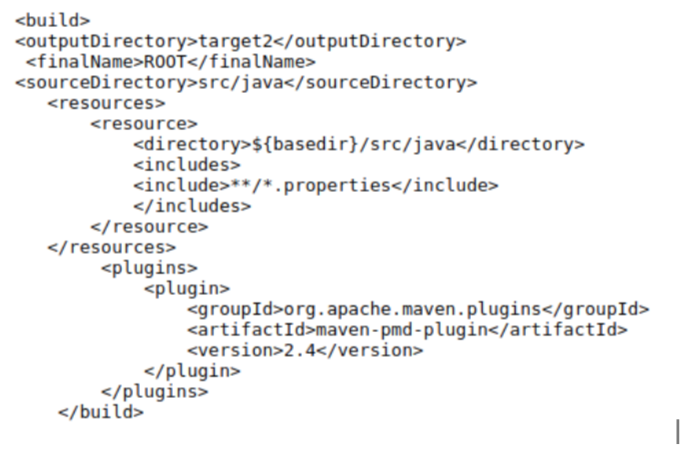

Давайте рассмотрим этот пример более подробно.

- `<sourceDirectory>` определяет, откуда maven будет брать файлы исходного кода. По умолчанию это `src/main/java`, но вы можете определить, где это вам удобно.
  Директория может быть только одна (без использования специальных плагинов).
- `<resources>` и вложенные в неё тэги `<resource>` определяют, одну или несколько директорий, где хранятся файлы ресурсов. Ресурсы в отличие от файлов
  исходного кода при сборке просто копируются. Директория по умолчанию `src/main/resources`.
- `<outputDirectory>` определяет, в какую директорию компилятор будет сохранять результаты компиляции - `*.class` файлы. Значение по умолчанию -
  `target/classes`
- `<finalName>` - имя результирующего `jar (war, ear..)` файла с соответствующим типу расширением, который создаётся на фазе `package`. Значение по умолчанию —
  `artifactId-version`.

### Что такое профили?

Мавен изначально создавался, принимая во внимание портируемость. Но довольно часто приложение приходится запускать в разном окружении: например, для разработки
используется одна база данных, в рабочем сервере используется другая. При этом могут понадобиться разные настройки, разные зависимости и плагины. Для этих
целей в maven используются профайлы.

Давайте определим два профайла: один для разработки, другой для производственного сервера. Для разработки вполне подойдёт база `hsqldb`, которая хранит все
данные в памяти. На производственном сервере же используется база данных `postgres`, которая сохраняет все данные на диск. В профайлах для каждой конфигурации
определены свои проперти `database.url` и зависимости для разных `jdbc` драйверов.

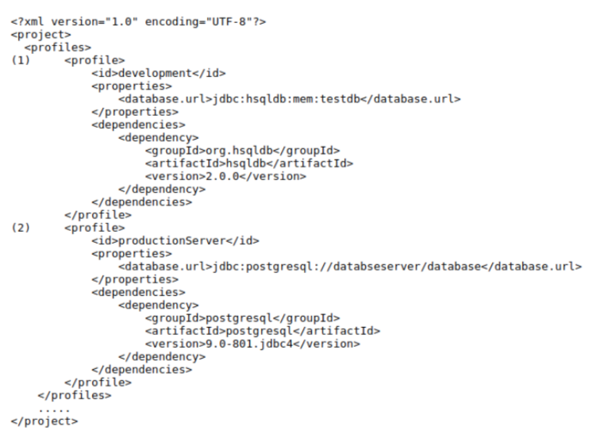

##### Активация профайла

Чтобы содержимое тэга профайла "работало", нужно профайл активировать. Когда профайл активирован, его содержимое объединяется с основной частью `pom.xml`.
Нужно заметить, что активных профилей одновременно может быть несколько.

##### Активировать профайл можно несколькими способами:

- Во первых, это можно задать вручную в командной строке запуска maven, например: `mvn package -P production`
- Во вторых, при объявлении самого профайла можно задать тэг `<activation>`, который определяет какой профайл будет активирован: в нашем примере профайл
  `development` активный по умолчанию: `<activation><activeByDefault>true</activeByDefault></activation>`. Кроме активации по умолчанию можно задать активацию на
  основе операционной системы, установленных переменных окружения, версии `JDK`.

В командной строке можно задать, какие профили будут деактивированы: `mvn goal -P !profile-1,!profile-2`

Стоить помнить, что `приоритет командной строки выше`.

Активные профайлы можно также задать в `~/.m2/settings.xml`

### В чем разница между SNAPSHOT и версией?

В случае с версией, если Maven однажды загрузил версию `data-service:1.0`, то он больше не будет пытаться загрузить новую версию 1.0 из репозитория. Для того,
чтобы скачать обновленный продукт `data-service` должен быть обновлен до версии 1.1.
В случае со `snapshot`, Maven автоматически будет подтягивать крайний snapshot (`data-service:1.0-SNAPSHOT`) каждый раз, когда будет выполняться сборка
проекта.

### Что такое транзитивная зависимость?

`Транзитивная зависимость` - позволяет избегать необходимости изучать и указывать библиотеки, которые требуются для самой зависимости, и включает их
автоматически. Необходимые библиотеки подгружаются в проект автоматически. При разрешении конфликта версий используется принцип «ближайшей» зависимости, то
есть выбирается зависимость, путь к которой через список зависимых проектов является наиболее коротким.

### Что такое dependency scope?

- `compile` - это область по умолчанию, используется, если ничего больше не определено. Compile зависимости доступны во всех classpath проекта.
- `provided` - это очень похоже на compile, но указывает на то, что вы ожидаете от JDK или контейнера предоставить зависимость в ходе выполнения.
  Эта область доступна только на compilation и test classpath и не является транзитивной.
- `runtime` - эта область указывает на то, что зависимость не обязательна для compilation, но для фаз выполнения.
- `test` - эта область указывает, что зависимость нужна во время запуска тестов.
- `system` - эта область похожа на provided за исключением того, что вы предоставляете JAR. Артефакт всегда доступен и не смотрит в репозиторий.
- `import` - эта область используется в зависимости типа `pom` в `<dependencyManagement>` разделе. Это указывает на то, что определенный POM будет заменен
  зависимостями в этом `POM <dependencyManagement>` разделе.

### compiler plugin

`compiler` - основной плагин который используется практически во всех проектах. Он доступен по умолчанию, но практически в каждом проекте, его приходится
переобъявлять т.к. настройки по умолчанию не очень подходящие.

### surefire plugin

`maven-surefire-plugin` - плагин который запускает тесты и генерирует отчеты по результатам их выполнения. По умолчанию отчёты сохраняются в
`${basedir}/target/surefire-reports` и находятся в двух форматах - `txt` и `xml`. `maven-surefire-plugin` содержит единственную цель `surefire:test` тесты
можно писать используя как `JUnit` так и `TestNG`.

по умолчанию запускаются все тесты с такими именами

- `*` - `"**/Test*.java"` - включает все java файлы которые начинаются с "`Test`" и расположены в поддиректориях.
- `*` - `"**/*Test.java"` - включает все java файлы которые заканчиваются на "`Test`" и расположены в поддиректориях.
- `*` - `"**/*TestCase.java"` - включает все java файлы которые заканчиваются на "`TestCase`" и расположены в поддиректориях.

### source plugin

Самый простой способ-создание архива - выполнить в командной строке: `mvn source:jar`

### checkstyle plugin

Это очень полезный плагин. Плагин проверяет стиль и качество исходного кода. Проверка качества кода особенно актуальна при разработке в команде из нескольких
программистов. Автоматизация такой проверки - большая помощь в этой нудной и кропотливой работе.

Плагин основан на проекте http://checkstyle.sourceforge.net/. Из наиболее часто используемых и простых проверок:
- наличие комментариев
- размер класса не более N строк
- в конструкции в try-catch, блок catch не пустой.
- не используется System.out.println(.. вместо LOG.error(..

Плагин проверит исходный код на наличие нарушений и сгенерирует файл `checkstyle-result.xml`. Чекстайл удобно использовать совместно с непрерывной интеграцией.
Автоматическая проверка кода сильно экономит время. Самое важное - относиться к `checkstyle` ошибкам также как и ошибкам компиляции - при их возникновении
сразу исправлять, т.к. когда ошибок накапливается сотни, их исправлять и тратить время хочется ещё меньше. Если `checkstyle` ошибки исправляются как только они
появятся - весь код будет чисто написан и комментирован, и можно быть больше уверенным в его качестве.

# Databases

## Compare MySQL and PostgreSQL

### Хранение данных

- `MySQL` - это реляционная база данных, для хранения данных в таблицах используются различные движки, но работа с движками спрятана в самой системе. На синтаксис
  запросов и их выполнение движок не влияет. Поддерживаются такие основные движки `MyISAM`, `InnoDB`, `MEMORY`, `Berkeley DB`. Они отличаются между собой способом
  записи данных на диск, а также методами считывания.
- `Postgresql` представляет из себя объектно реляционную базу данных, которая работает только на одном движке - `storage engine`. Все таблицы представлены в виде
  объектов, они могут наследоваться, а все действия с таблицами выполняются с помощью объективно ориентированных функций. Как и в `MySQL` все данные хранятся на
  диске, в специально отсортированных файлах, но структура этих файлов и записей в них очень сильно отличается.

### Стандарт SQL

Независимо от используемой системы управления базами данных, `SQL` - это стандартизированный язык выполнения запросов. И он поддерживается всеми решениями, даже
`MySQL` или `Postgresql`. Стандарт `SQL` был разработан в 1986 году и за это время уже вышло нескольких версий.

- `MySQL` поддерживает далеко не все новые возможности стандарта `SQL`. Разработчики выбрали именно этот путь развития, чтобы сохранить `MySQL` простым для
  использования. Компания пытается соответствовать стандартам, но не в ущерб простоте. Если какая-то возможность может улучшить удобство, то разработчики могут
  реализовать ее в виде своего расширения не обращая внимания на стандарт.

- `Postgresql` - это проект с открытым исходным кодом, он разрабатывается командой энтузиастов, и разработчики пытаются максимально соответствовать стандарту `SQL`
  и реализуют все самые новые стандарты. Но все это приводит к ущербу простоты. `Postgresql` очень сложный и из-за этого он не настолько популярен как `MySQL`.

### Возможности обработки

Из предыдущего пункта выплывают и другие отличия `postgresql` от `mysql`, это возможности обработки данных и ограничения. Естественно, соответствие более новым
стандартам дает более новые возможности.

При выполнении запроса `MySQL` загружает весь ответ сервера в память клиента, при больших объемах данных это может быть не совсем удобно. В основном по функциям
`Postgresql` превосходит `Mysql`, дальше рассмотрим в каких именно.

`Postgresql` поддерживает использование курсоров для перемещения по полученным данным. Вы получаете только указатель, весь ответ хранится в памяти сервера баз
данных. Этот указатель можно сохранять между сеансами. Здесь поддерживается построение индексов сразу для нескольких столбцов таблицы. Кроме того, индексы могут
быть различных типов, кроме `hash` и `b-tree` доступны `GiST` и `SP-GiST` для работы с городами, `GIN` для поиска по тексту, `BRIN` и `Bloom`.

`Postgresql` поддерживает регулярные выражения в запросах, рекурсивные запросы и наследования таблиц. Но тут есть несколько ограничений, например, вы можете
добавить новое поле только в конец таблицы.

`Postgresql` может обраюатывать очень много данных:

|Параметр                              |Значение                              |
|--------------------------------------|--------------------------------------|
|Максимальный размер базы данных       |Неограничен                           |
|Максимальный размер таблицы           |32TB                                  |
|Максимальный размер строки            |1.6TB                                 |
|Максимальный размер поля              |1GB                                   |
|Максимальное кол-во строк в таблице   |Неограничено                          |
|Максимальное кол-во столбцов в таблице|250-1600 в зависимости от типа столбца|
|Максимальное кол-во индексов в таблице|Неограничено                          |

### Производительность

Базы данных должны обязательно быть оптимизированы для окружения, в котором вы будете работать. Исторически так сложилось что `MySQL` ориентировалась на
максимальную производительность, а `Postgresql` разрабатывалась как база данных с большим количеством настроек и максимально соответствующую стандарту. Но со
временем `Postgresql` получил много улучшений и оптимизаций.

В большинстве случаев для организации работы с базой данных в `MySQL` используется таблица `InnoDB`, эта таблица представляет из себя `B-дерево` с индексами.
Индексы позволяют очень быстро получить данные из диска, и для этого будет нужно меньше дисковых операций. Но сканирование дерева требует нахождения двух индексов,
а это уже медленно. Все это значит что `MySQL` будет быстрее `Postgresql` только при использовании первичного ключа.

Вся заголовочная информация таблиц `Postgresql` находится в оперативной памяти. Вы не можете создать таблицу, которая будет не в памяти. Записи таблицы сортируются
по индексу, а поэтому вы можете их очень быстро извлечь. Для большего удобства вы можете применять несколько индексов к одной таблице. В целом `PostgreSQL` работает
быстрее, за исключениям использования первичных ключей. Давайте рассмотрим несколько тестов с различными операциями.

### Дополнительно

- В `mysql` типы данных более соответствуют синтаксису `sql`.
- В `pg` можно хранить массивы и `json`, есть тип `money`.


### Геометрические данные

Геоданные быстро становятся основным требованием для многих приложений. `PostgreSQL` уже давно поддерживает множество геометрических типов данных, таких как точки,
линии, круги и многоугольники. Один из этих типов – `PATH`, он состоит из множества последовательно расположенных точек и может быть открытым (начальная и конечная
точки не связаны) или закрытым (начальная и конечная точки связаны). Давайте рассмотрим в качестве примера туристическую тропу. В данном случае туристическая тропа
— это петля, поэтому начальная и конечная точки связаны, и, значит, мой путь является закрытым. Круглые скобки вокруг набора координат указывают на закрытый путь, а
квадратные — на открытый.


### Создание нового типа

Если вдруг так случится, что обширного списка типов данных `pg` вам окажется недостаточно, вы можете использовать команду `CREATE TYPE`, чтобы создать новые типы
данных, такие как составной, перечисляемый, диапазон и базовый.

## Hibernate

`Hibernate` - один из самых популярных фреймворков в Java, который упрощает разработку приложений Java для взаимодействия с базой данных. Это инструмент
`объектно-реляционного сопоставления (ORM)`. Это легкий инструмент с открытым кодом, что дает ему преимущество перед другими фреймворками.

### Каковы основные преимущества Hibernate Framework?

- Открытый исходный код.
- Производительность `Hibernate` очень быстрая.
- Помогает в создании независимых запросов к базе данных.
- Предоставляет возможности для автоматического создания таблицы.
- Он предоставляет статистику запросов и статус базы данных.

### Каковы преимущества использования Hibernate перед JDBC?

- `Hibernate `исключает много шаблонного кода, который поставляется с `JDBC API`, код выглядит более чистым и читаемым.
- Эта структура `Java` поддерживает наследование, ассоциации и коллекции. Эти функции фактически отсутствуют в `JDBC`.
- `HQL (Hibernate Query Language)` более объектно-ориентирован и близок к `Java`. Но для `JDBC` вам нужно писать собственные `SQL`-запросы.
- `Hibernate` неявно обеспечивает управление транзакциями, тогда как в `JDBC API` вам нужно написать код для управления транзакциями с использованием `commit` и
  `rollback`.
- `JDBC` генерирует `SQLException`, которое является `checked` исключением, поэтому вам нужно написать много блоков `try-catch`. `Hibernate` обертывает исключения
  `JDBC` и генерирует `JDBCException` или `HibernateException`, которые являются `unchecked` исключениями, поэтому вам не нужно писать код для его обработки. Имеется
  встроенное управление транзакциями, которое помогает устранить использование блоков `try-catch`.
- Он поддерживает автоматические операции DDL.
- Также поддерживает автоматическое создание первичного ключа.
- Поддерживает кеш-память.

### Зачем использовать Hibernate Framework?

`Hibernate` преодолевает недостатки других технологий, таких как `JDBC`.

- Он не зависит от базы данных, в отличии от `JDBC`.
- Работа с `JDBC` требует больших затрат на изменение баз данных, `Hibernate` отлично справляется с этой проблемой.
- Переносимость кода невозможна при работе с `JDBC`. С этим легко справляется `Hibernate`.
- Он преодолевает часть обработки исключений, которая является обязательной при работе с `JDBC`.
- Он сокращает длину кода и повышает удобочитаемость за счет устранения `boilerplate` кода.

### Назовите некоторые из важных интерфейсов фреймворка Hibernate?

- `org.hibernate.SessionFactory`
- `org.hibernate.Session`
- `org.hibernate.Transaction`

### Что такое Session в Hibernate и как её получить?

`Hibernate Session` - это интерфейс между уровнем приложения `Java` и `Hibernate`. Он используется для получения физического соединения с базой данных.
Созданный объект `Session` является легковесным и новый экземпляр создаётся каждый раз, когда требуется взаимодействие с базой данных. `Session` предоставляет
методы для создания, чтения, обновления и удаления операций для `persistent` объектов.

### Что такое Hibernate SessionFactory?

`SessionFactory` - это фабричный класс, который используется для получения объектов `Session`. `SessionFactory` отвечает за считывание параметров конфигурации
`Hibernate` и подключение к базе данных. `SessionFactory` - это тяжелый объект, поэтому обычно он создается во время запуска приложения и сохраняется для
дальнейшего использования. `SessionFactory` является потокобезопасным объектом, который используется всеми потоками приложения. Если вы используете несколько баз
данных, вам придется создать несколько объектов `SessionFactory`. Внутреннее состояние `SessionFactory` неизменно (`immutable`). `SessionFactory` также
предоставляет методы для получения метаданных класса и статистики, вроде данных о втором уровне кэша, выполняемых запросах и т.д.

### Какая разница между методами Hibernate Session get() и load()?

`Hibernate session` обладает различными методами для загрузки данных из базы данных. Наиболее часто используемые методы для этого — `get()` и `load()`.

- `get()` загружает данные сразу при вызове, в то время как `load()` использует прокси объект и загружает данные только тогда, когда это требуется на самом деле.
  В этом плане `load()` имеет преимущество в плане ленивой загрузки данных.
- `load()` бросает исключение, когда данные не найдены. Поэтому его нужно использовать только при уверенности в существовании данных.
  Нужно использовать метод `get()`, если необходимо удостовериться в наличии данных в БД.

Поэтому иногда использование `load()` может быть быстрее, чем метод `get()`.

### В чем разница между openSession и getCurrentSession?

Метод `getCurrentSession()` возвращает сессию, привязанную к контексту, и для того, чтобы это работало, вам необходимо настроить его в файле конфигурации
`Hibernate`. Поскольку этот объект сессии принадлежит контексту `Hibernate`, ничего страшного, если вы не закроете его. После закрытия `SessionFactory` этот объект
сессии закрывается.

Метод `openSession()` помогает открыть новую сессию. Вы должны закрыть этот объект сеанса после завершения всех операций с базой данных. Кроме того, вы должны
открывать новую сессию для каждого запроса в многопоточной среде.

### Какие шаблоны проектирования используются в среде Hibernate?

В `Hibernate` используется несколько шаблонов проектирования, а именно:

- `Domain Model`: объектная модель предметной области, которая включает как поведение, так и данные.
- `Proxy`: используется для отложенной загрузки.
- `Factory`: используется в SessionFactory.

### Объясните, что такое Proxy в Hibernate и как он помогает при Lazy-loading?

- `Hibernate` использует прокси-объект для поддержки `lazy-loading`.
- Когда вы пытаетесь загрузить данные из таблиц, `Hibernate` не загружает все сопоставленные объекты.
- Когда вы пытаетесь получить child объект с помощью методов получения, если связанная сущность отсутствует в кэше, тогда будет выполнен реальный запрос в базу
  данных.

### Как мы можем увидеть SQL, сгенерированный Hibernate, на консоли?

Чтобы просмотреть сгенерированный `SQL` запрос в консоли, вам необходимо добавить следующее в файл конфигурации `Hibernate`:

```xml
<property name = "show_sql">true</property>
```

### Когда вы используете merge() и update() в Hibernate?

- `update()`: если вы уверены, что в сессии `Hibernate` не содержится экземпляра `persistent` объекта с тем же идентификатором.
- `merge()`: помогает объединить ваши модификации в любое время без учета состояния сессии.

### Что вы знаете о кэшировании в Hibernate? Объясните понятие кэш первого уровня в Hibernate?

`Hibernate` использует кэширование, чтобы сделать наше приложение быстрее. Кэш `Hibernate` может быть очень полезным в получении высокой производительности
приложения при правильном использовании. Идея кэширования заключается в сокращении количества запросов к базе данных.

Кэш первого уровня `Hibernate` связан с объектом `Session`. Кэш первого уровня у `Hibernate`  включен по умолчанию и не существует никакого способа, чтобы его
отключить. Соответственно, при запросах того же самого объекта несколько раз в рамках одного `persistence context`, запрос в `БД` будет выполнен один раз, а все
остальные загрузки будут выполнены из кэша. Интересно поведение кэша первого уровня при использовании ленивой загрузки. При загрузке объекта методом `load()` или
объекта с лениво загружаемыми полями, лениво загружаемые данные в кэш не попадут. При обращении к данным будет выполнен запрос в базу и данные будут загружены и в
объект и в кэш. А вот следующая попытка лениво загрузить объект приведёт к тому, что объект сразу вернут из кэша и уже полностью загруженным.

Однако `Hibernate` предоставляет методы, с помощью которых мы можем удалить выбранные объекты из кэша или полностью очистить кэш.
Любой объект закэшированный в `session` не будет виден другим объектам `session`. После закрытия объекта сессии все кэшированные объекты будут потеряны.

### Кэш второго уровня

Если кэш первого уровня существует только на уровне сессии и `persistence context`, то кэш второго уровня находится выше — на уровне `SessionFactory` и,
следовательно, один и тот же кэш доступен одновременно в нескольких `persistence context`. Кэш второго уровня требует некоторой настройки и поэтому не включен по
умолчанию. Настройка кэша заключается в конфигурировании реализации кэша и разрешения сущностям быть закэшированными.

`Hibernate` не реализует сам никакого `in-memory сache`, а использует существующие реализации кэшей. Раньше `Hibernate` самостоятельно поддерживал интерфейс с
этими кэшами, но сейчас существует `JCache` и корректнее будет использовать этот интерфейс. Реализаций у `JCache` множество, но одна из самых распространённых
`ehcache`.

### Разница между кешем первого и второго уровня в Hibernate?

Кэш первого уровня поддерживается на уровне сессии, в то время как кэш второго уровня поддерживается на уровне `SessionFactory` и используется всеми сеансами.

### @Cacheable и @Cache

- `@Cacheable` это аннотация `JPA` и позволяет объекту быть закэшированным. `Hibernate` поддерживает эту аннотацию в том же ключе.
- `@Cache` это аннотация `Hibernate`, настраивающая тонкости кэширования объекта в кэше второго уровня `Hibernate`. Аннотации `@Cacheable` достаточно, чтобы объект
  начал кэшироваться с настройками по умолчанию. При этом `@Cache` использованная без `@Cacheable` не разрешит кэширование объекта

##### @Cache принимает три параметра:

- `include`, имеющий по умолчанию значение `all` и означающий кэширование всего объекта. Второе возможное значение, `non-lazy`, запрещает кэширование лениво
  загружаемых объектов. Кэш первого уровня не обращает внимания на эту директиву и всегда кэширует лениво загружаемые объекты.
- `region` позволяет задать имя региона кэша для хранения сущности. Регион можно представить как разные кэши или разные части кэша, имеющие разные настройки на
  уровне реализации кэша. Например, я мог бы создать в конфигурации `ehcache` два региона, один с краткосрочным хранением объектов, другой с долгосрочным и
  отправлять часто изменяющиеся объекты в первый регион, а все остальные во второй.
- `usage` задаёт стратегию одновременного доступа к объектам.

```java
@Cache(usage=CacheConcurrencyStrategy.READ_ONLY, region="employee")
```

`usage` достаточно объёмен, чтобы рассматривать его внутри списка. Проблема заключается в том, что кэш второго уровня доступен из нескольких сессий сразу и
несколько потоков программы могут одновременно в разных транзакциях работать с одним и тем же объектом. Следовательно надо как-то обеспечивать их одинаковым
представлением этого объекта.

##### Стратегий одновременного доступа к объектам в кэше в hibernate существует четыре:

- `transactional` — полноценное разделение транзакций. Каждая сессия и каждая транзакция видят объекты, как если бы только они с ним работали последовательно одна
  транзакция за другой. Плата за это — блокировки и потеря производительности.
- `read-write` — полноценный доступ к одной конкретной записи и разделение её состояния между транзакциями. Однако суммарное состояние нескольких объектов в разных
  транзакциях может отличаться.
- `nonstrict-read-write` — аналогичен `read-write`, но изменения объектов могут запаздывать и транзакции могут видеть старые версии объектов. Рекомендуется
  использовать в случаях, когда одновременное обновление объектов маловероятно и не может привести к проблемам.
- `read-only` — объекты кэшируются только для чтения и изменение удаляет их из кэша.

Список выше отсортирован по нарастанию производительности, `transactional` стратегия самая медленная, `read-only` самая быстрая. Недостатком `read-only` стратегии
является её бесполезность, в случае если объекты постоянно изменяются, так как в этом случае они не будут задерживаться в кэше.

Использование кэша второго уровня требует изменений в конфигурации `Hibernate` и в коде сущностей, но не требует изменения кода запросов и управления сущностями:

```java
session = sessionFactory.openSession();
session.beginTransaction();
 
// Database will be queried
System.out.println(session.get(Person.class, 3L));
 
session.getTransaction().commit();
session.close();
 
session = sessionFactory.openSession();
session.beginTransaction();
 
// Database will not be queried, 2nd level cache will provide the data
System.out.println(session.get(Person.class, 3L));
 
session.getTransaction().commit();
session.close();
```

### Кэш запросов

Кэши первого и второго уровней работают с объектами загружаемыми по `id`. Но в дикой природе к базе чаще выполняются запросы с условиями, чем загружаются какие-то
заранее известные объекты:

И результат выполнения таких запросов тоже может потребоваться кэшировать. Например если вы делаете поисковый сайт по автозапчастям, то можете кэшировать запросы
пользователей, которые, скорее всего, ищут одни запчасти гораздо чаще других. У кэша запросов есть и своя цена — `Hibernate` будет вынужден отслеживать сущности
закешированные с определённым запросом и выкидывать запрос из кэша, если кто-то поменяет значение сущности. То есть для кэша запросов стратегия параллельного
доступа всегда `read-only`.

```xml
<property name="hibernate.cache.use_query_cache">true</property>
```

Но даже с этим разрешением `Hibernate` не будет кэшировать все запросы, а только те, кэширование которых явно запрошено методом `setCacheable()`.

### В чем разница между Hibernate save(), saveOrUpdate() и persist()?

- `save()` используется для сохранения сущности в базу данных. Проблема с использованием метода `save()` заключается в том, что он может быть вызван без
  транзакции. А следовательно если у нас имеется отображение нескольких объектов, то только первичный объект будет сохранен и мы получим несогласованные данные.
  Также `save()` немедленно возвращает сгенерированный идентификатор.
- `persist()` аналогичен `save()` с транзакцией. `persist()` не возвращает сгенерированный идентификатор сразу.
- `saveOrUpdate()` использует запрос для вставки или обновления, основываясь на предоставленных данных. Если данные уже присутствуют в базе данных, то будет
  выполнен запрос обновления. Метод `saveOrUpdate()` можно применять без транзакции, но это может привести к аналогичным проблемам, как и в случае с методом
  `save()`.

### Каковы преимущества Named SQL Query?

Именованный запрос Hibernate позволяет собрать множество запросов в одном месте, а затем вызывать их в любом классе. Синтаксис `Named Query` проверяется при
создании `session factory`, что позволяет заметить ошибку на раннем этапе, а не при запущенном приложении и выполнении запроса. `Named Query` глобальные, т.е.
заданные однажды, могут быть использованы в любом месте. Однако одним из основных недостатков именованного запроса является то, что его очень трудно отлаживать
(могут быть сложности с поиском места определения запроса).

### BEST PRACTICES

- Всегда проверяйте доступ к primary key. Если он создается базой данных, то вы не должны иметь сеттера.
- По умолчанию `hibernate` устанавливает значения в поля напрямую без использования сеттеров. Если необходимо заставить хибернейт их применять, то проверьте
  использование аннотации `@Access(value=AccessType.PROPERTY)` над свойством.
- Если тип доступа — `property`, то удостоверьтесь, что аннотация используется с геттером. Избегайте смешивания использования аннотации над обоими полями и
  геттером.
- Используйте нативный `sql` запрос только там, где нельзя использовать `HQL`.
- Используйте `ordered list` вместо сортированного списка из `Collection API`, если вам необходимо получить отсортированные данные.
- Применяйте именованные запросы разумно — держите их в одном месте и используйте только для часто применяющихся запросов. Для специфичных запросов пишите их
  внутри конкретного бина.
- В веб приложениях используйте `JNDI DataSource` вместо файла конфигурации для соединения с `БД`.
- Избегайте отношений `многие-ко-многим`, т.к. это можно заменить двунаправленной `One-to-Many` и `Many-to-One` связью.
- Для `collections` попробуйте использовать `Lists`, `maps` и `sets`. Избегайте массивов (`array`), т.к. они не дают преимуществ ленивой загрузки.
- Не обрабатывайте исключения, которые могут откатить транзакцию и закрыть сессию. Если это проигнорировать, то `Hibernate` не сможет гарантировать, что состояние
  в памяти соответствует состоянию персистентности (могут быть коллизии данных).
- Применяйте шаблон `DAO` для методов, которые могут использоваться в `entity` бинах.
- Предпочитайте ленивую выборку для ассоциаций.

### Преимущества Hibernate над JDBC

- `Hibernate` удаляет множество повторяющегося кода из `JDBC API`, а следовательно его легче читать, писать и поддерживать.
- `Hibernate` поддерживает наследование, ассоциации и коллекции, что не доступно в `JDBC API`.
- `Hibernate` неявно использует управление транзакциями. Большинство запросов нельзя выполнить вне транзакции. При использовании `JDBC API` для управления
  транзакциями нужно явно использовать `commit` и `rollback`.
- `JDBC API throws SQLException`, которое относится к `checked` исключениям, а значит необходимо постоянно писать множество блоков `try-catch`. В большинстве
  случаев это не нужно для каждого вызова `JDBC` и используется для управления транзакциями. `Hibernate` оборачивает исключения `JDBC` через `unchecked`
  `JDBCException` или `HibernateException`, а значит нет необходимости проверять их в коде каждый раз. Встроенная поддержка управления транзакциями в `Hibernate`
  убирает блоки `try-catch`.
- `Hibernate Query Language (HQL)` более объектно ориентированный и близкий к `Java` язык запросов, чем `SQL` в `JDBC`.
- `Hibernate` поддерживает кэширование, а запросы `JDBC` - нет, что может понизить производительность.
- `Hibernate` предоставляет возможность управления `БД` (например создания таблиц), а в `JDBC` можно работать только с существующими таблицами в базе данных.
- Конфигурация `Hibernate` позволяет использовать `JDBC` вроде соединения по типу `JNDI DataSource` для пула соединений. Это важная фича для энтерпрайз приложений,
  которая полностью отсутствует в `JDBC API`.
- `Hibernate` поддерживает аннотации `JPA`, а значит код является переносимым на другие `ORM` фреймворки, реализующие стандарт, в то время как код `JDBC` сильно
  привязан к приложению.

### Транзакции в Hibernate

`Hibernate` построен поверх `JDBC API` и реализует модель транзакций `JDBC`. Если быть точным, `Hibernate` способен работать или с `JDBC` транзакциями или с `JTA`
транзакциями. Пока сосредоточимся на `JDBC` транзакциях, тем более что с точки зрения использования их отличий не так и много.

Транзакцию можно начать вызовом `beginTransaction()` объекта `Session`, либо запросить у `Session` связанный с ней объект `Transaction` и позвать у последнего
метод `begin()`. С объектом `Session` всегда связан ровно один объект `Transaction`, доступ к которому может быть получен вызовом `getTransaction()`:

```java
Session session = sessionFactory.openSession();
Transaction t=session.getTransaction();
```

Методов для подтверждения или отката транзакции у объекта `Session` нет, необходимо всегда обращаться к объекту `Transaction`:

```java
session.beginTransaction();
session.getTransaction().commit();
 
session.beginTransaction();
session.getTransaction().rollback();
```

Код выше подтверждает первую транзакцию и откатывает вторую. В отличие от `JDBC` в `Hibernate` не поддерживаются `Savepoints` и транзакция может только быть
подтверждена или откачена, без промежуточных вариантов.

### Операции над транзакциями

У объекта `Transaction` есть ещё несколько методов, кроме `commit()` и `rollback()`, которые позволяют тонко управлять поведением транзакции. Метод `isActive()`
позволяет проверить, есть ли в рамках объекта `Transaction` управляемая им транзакция. Очевидно, что такая транзакция существует в промежутке времени между
вызовами `begin()` и `commit()/rollback()`.

Метод `setRollbackOnly()` помечает транзакцию как откаченную в будущем. В отличие от `rollback()` этот метод не закрывает транзакцию и все последующие запросы к
базе будут продолжать выполняться в рамках той же самой транзакции, но завершить эту транзакцию можно будет только откатом и вызовом `rollback()`. Вызов `commit()`
на такой транзакции выбросит исключение. Проверить состояние транзакции можно вызовом `getRollbackOnly()`.

### Блокировки в Hibernate

Транзакции, как средство разграничения параллельной работы с данными, идут рядом с аналогичным средством разграничения, блокировками.

Блокировки, это механизм, позволяющий параллельную работу с одними и теми же данными в базе данных. Когда более чем одна транзакция пытается получить доступ к
одним и тем же данным в одно и то же время, в дело вступают блокировки, которые гарантируют, что только одна из этих транзакций изменит данные.

**Почему это так важно?** Классический пример: вы разработали систему покупки билетов. И в жизни этой системы настаёт момент, когда в наличии остаётся последний
билет, на который претендуют два покупателя. Если эти два покупателя одновременно начнут покупать билет, то первый покупатель увидит, что есть один билет и купит
его, то есть обновит базу данных и запишет, что билетов больше нет. Однако второй покупатель так же увидит, что есть один билет и так же купит его, то есть обновит
базу данных и запишет, что билетов больше нет. В результате параллельного выполнения транзакций один и тот же билет продастся два раза, что приведёт к неминуемому
скандалу, при попытке его использовать. Поэтому важно, чтобы только одна транзакция могла изменять данные и именно это и обеспечивает механизм блокировок.

Существует два основных подхода к блокированию транзакций: `оптимистичный` и `пессимистичный`.

- `Оптимистичный` подход предполагает, что параллельно выполняющиеся  транзакции редко обращаются к одним и тем же данным и позволяет им спокойно и свободно
  выполнять любые чтения и обновления данных. Но, при окончании транзакции, то есть записи данных в базу, производится проверка, изменились ли данные в ходе
  выполнения данной транзакции и если да, транзакция обрывается и выбрасывается исключение.
- `Пессимистичный` подход напротив, ориентирован на транзакции, которые постоянно или достаточно часто конкурируют за одни и те же данные и поэтому блокирует
  доступ к данным превентивно, в тот момент когда читает их. Другие транзакции останавливаются, когда пытаются обратиться к заблокированным данным и ждут снятия
  блокировки (или кидают исключение).

Разница в том, что в первом случае обеспечивается более высокий уровень конкурентности при доступе к базе, который оплачивается необходимостью переповтора
транзакций, в случае коллизии. Во втором случае транзакции гарантируется, что только она будет иметь полный доступ к данным, но за счёт понижения уровня
конкурентности и затрат времени на ожидание блокировки.

### Optimistic lock

Как и в `JPA`, оптимистичное блокирование выполнено на уровне `Hibernate`, а не базы данных. Для поддержки таких блокировок в класс вводится специально поле
версии, которое анализирует `Hibernate` при сохранении изменений.

```java
@Entity
public class Company extends AbstractIdentifiableObject {
    @Version
    private long version;
 
    @Getter
    @Setter
    private String name;
 
    @Getter
    @Setter
    @ManyToMany(mappedBy = "workingPlaces")
    private Collection<Person> workers;
}
```

##### Есть несколько правил, которым мы должны следовать при объявлении атрибутов версии:

- у каждого класса сущности должен быть только один атрибут версии.
- он должен быть помещен в основную таблицу для объекта, сопоставленного с несколькими таблицами.
- Тип атрибута версии должен быть одним из следующих: `int`, `Integer`, `long`, `Long`, `short`, `Short`, `java.sql.Timestamp`.

Мы должны знать, что можем получить значение атрибута `version` через объект, но мы не должны его обновлять или увеличивать. Это может сделать только `persistence
provider`, поэтому данные остаются согласованными.

Стоит отметить, что `persistence provider` могут поддерживать оптимистичную блокировку для сущностей, у которых нет атрибутов версии. Тем не менее, при работе с
оптимистической блокировкой рекомендуется всегда включать атрибуты версии. Если мы попытаемся заблокировать объект, который не содержит такого атрибута, а
`persistence provider` его не поддерживает, это приведет к исключению `PersitenceException`.

`Hibernate` разрешает доступ к объектам всем транзакциям сразу, без каких-либо ограничений, но при сохранении объектов проверяет, не поменялось ли поле version
другими транзакциями. В случае, если обнаружится конкурирующее изменение, транзакция откатывается и пробрасывается `OptimisticLockException`. После этого можно
попробовать повторно выполнить упавшую транзакцию.

Мы можем представить, что этот механизм подходит для приложений, которые выполняют гораздо больше операций чтения, чем обновления или удаления. Более того, это
полезно в ситуациях, когда сущности необходимо отсоединить (`detach`) от сессии на некоторое время, а блокировки нельзя удерживать.

##### Режимы блокировки

`JPA` предоставляет нам два разных оптимистичных режима блокировки (и два псевдонима):

- `OPTIMISTIC` - получает оптимистичную блокировку чтения для всех сущностей, содержащих атрибут версии.
- `OPTIMISTIC_FORCE_INCREMENT` - получает оптимистическую блокировку, такую же, как `OPTIMISTIC`, и дополнительно увеличивает значение атрибута версии.
- `READ` - это синоним `OPTIMISTIC`.
- `WRITE` - это синоним `OPTIMISTIC_FORCE_INCREMENT`.

Мы можем найти все перечисленные выше типы в классе `LockModeType`.

##### OPTIMISTIC (READ)

Как мы уже знаем, режимы блокировки `OPTIMISTIC` и `READ` - синонимы. Однако спецификация `JPA` рекомендует нам использовать `OPTIMISTIC` в новых приложениях.

Всякий раз, когда мы запрашиваем режим блокировки `OPTIMISTIC`, `persistence provider` предотвращает грязное чтение (`dirty read`) наших данных, а также
неповторяющееся чтение (`non-repeatable read`).

Проще говоря, он должен гарантировать, что ни одна транзакция не сможет закоммитить какие-либо изменения данных, над которыми другая транзакция провела обновление
или удаление.

##### OPTIMISTIC_INCREMENT (WRITE)

Как и раньше, `OPTIMISTIC_INCREMENT` и `WRITE` являются синонимами, но первое предпочтительнее.

`OPTIMISTIC_INCREMENT` должен соответствовать тем же условиям, что и режим блокировки `OPTIMISTIC`. Кроме того, он увеличивает значение атрибута версии.
Однако не указано, следует ли это сделать немедленно или можно отложить до `commit`-а или `flush`-а.

Стоит знать, что `persistence provider` разрешено предоставлять функциональность `OPTIMISTIC_INCREMENT`, когда запрашивается режим блокировки `OPTIMISTIC`.

##### Использование Optimistic lock

Следует помнить, что для версионных сущностей оптимистическая блокировка доступна по умолчанию. Тем не менее, есть несколько способов явно запросить его.

Чтобы запросить оптимистическую блокировку, мы можем передать правильный `LockModeType` в качестве аргумента для метода `find()` в `EntityManager`:

```java
entityManager.find(Student.class, studentId, LockModeType.OPTIMISTIC);
```

Другой способ включить блокировку - использовать метод `setLockMode` объекта `Query`:

```java
Query query = entityManager.createQuery ("from student, where id =: id");
query.setParameter("id", studentId);
query.setLockMode(LockModeType.OPTIMISTIC_INCREMENT);
query.getResultList()l
```

Мы можем установить блокировку, вызвав метод блокировки `EnitityManager`:

```java
Student student = entityManager.find(Student.class, id);
entityManager.lock(student, LockModeType.OPTIMISTIC);
```

Последний вариант - использовать `@NamedQuery` со свойством `lockMode`:

```java
@NamedQuery(name="optimisticLock",
  query="SELECT s FROM Student s WHERE s.id LIKE :id",
  lockMode = WRITE)
```

### OptimisticLockException

Когда `persistence provider` обнаруживает оптимистичные конфликты блокировок на объектах, он генерирует исключение `OptimisticLockException`. Следует знать, что
из-за исключения активная транзакция всегда помечается для отката.

Полезно знать, как мы можем реагировать на `OptimisticLockException`. Для удобства это исключение содержит ссылку на конфликтующий объект. Однако `persistence
provider` не обязательно должен предоставлять его в каждой ситуации. Нет гарантии, что объект будет доступен.

Однако существует рекомендуемый способ обработки описанного исключения. Мы должны снова получить объект, перезагрузив или обновив. Желательно в новой транзакции.
После этого мы можем попробовать обновить его еще раз.

### Pessimistic lock

Пессимистичное блокирование выполняется на уровне базы и поэтому не требует вмешательств в код сущности. Блокировка в случае пессимистичного блокирование всегда
запрашивается для конкретного объекта во время его загрузки или позднее:

```java
Person p = session.load(Person.class, 3L, LockMode.PESSIMISTIC_READ);
 
session.lock(p, LockMode.PESSIMISTIC_WRITE);
 
session.createCriteria(Person.class)
  .setLockMode(LockMode.PESSIMISTIC_READ)
  .uniqueResult();
```

В примере выше блокировка запрашивается при загрузке объекта методом `load()`, накладывается другая блокировка на уже загруженный объект методом `lock()` и,
наконец, все объекты, соответствующие критерию будут загружены с блокировкой, указанной в `setLockMode()`.

Если не говорить о тонкостях, в `Hibernate` поддерживаются две главных пессимистичных блокировки:

- `LockMode.PESSIMISTIC_READ` — данные блокируются в момент чтения и это гарантирует, что никто в ходе выполнения транзакции не сможет их изменить. Остальные
  транзакции, тем не менее, смогут параллельно читать эти данные. Использование этой блокировки может вызывать долгое ожидание блокировки или даже
  выкидывание `OptimisticLockException`.
- `LockMode.PESSIMISTIC_WRITE` — данные блокируются в момент записи и никто с момента захвата блокировки не может в них писать и не может их читать до
  окончания транзакции, владеющей блокировкой. Использование этой блокировки может вызывать долгое ожидание блокировки.

`LockMode.PESSIMISTIC_READ` может поддерживаться не всеми базами данных и в этом случае автоматически будет применён `LockMode.PESSIMISTIC_WRITE`

Каждая транзакция может получить блокировку данных. Пока он удерживает блокировку, транзакция не может читать, удалять или обновлять заблокированные данные.
Можно предположить, что использование пессимистической блокировки может привести к `deadlock`-ам. Однако он обеспечивает большую целостность данных, чем
оптимистическая блокировка.

### Проблема N+1 query

`N+1` проблема в `Hibernate` состоит в том, в некоторых ситуациях один `HQL select` преобразуется `N+1 SQL select`-ов. Это отрицательно влияет на
производительность,  поэтому такого поведения нужно избегать.

Эти дополнительные `SQL select`-ы нужны для заполнения поля, ссылающегося на другую сущность(и). Здесь `N` – количество объектов, возвращаемых первым явным
`select`-ом. Для каждого из них надо заполнить поле, вот и получается еще `N select`-ов.

Предположим, у нас есть следующие таблицы базы данных `post` и `post_comments`, которые образуют отношение таблиц "`один ко многим`":


Мы собираемся создать следующие 4 строки в таблице `post`:

```sql
INSERT INTO post (title, id)
VALUES ('High-Performance Java Persistence - Part 1', 1)
  
INSERT INTO post (title, id)
VALUES ('High-Performance Java Persistence - Part 2', 2)
  
INSERT INTO post (title, id)
VALUES ('High-Performance Java Persistence - Part 3', 3)
  
INSERT INTO post (title, id)
VALUES ('High-Performance Java Persistence - Part 4', 4)
```

И мы также создадим 4 дочерних записи `post_comment`:

```sql
INSERT INTO post_comment (post_id, review, id)
VALUES (1, 'Excellent book to understand Java Persistence', 1)
  
INSERT INTO post_comment (post_id, review, id)
VALUES (2, 'Must-read for Java developers', 2)
  
INSERT INTO post_comment (post_id, review, id)
VALUES (3, 'Five Stars', 3)
  
INSERT INTO post_comment (post_id, review, id)
VALUES (4, 'A great reference book', 4)
```

##### Проблема запроса N + 1 с простым SQL

Как уже объяснялось, проблема запроса `N+1` может быть запущена с использованием любой технологии доступа к данным, даже с использованием простого `SQL`. Если
вы выберете `post_comments` с помощью этого `SQL`-запроса:

```java
List<Tuple> comments = entityManager.createNativeQuery("""
    SELECT
        pc.id AS id,
        pc.review AS review,
        pc.post_id AS postId
    FROM post_comment pc
    """, Tuple.class)
.getResultList();
```

А позже вы решаете получить связанный `post` для каждого `post_comment`:

```java
for (Tuple comment : comments) {
    String review = (String) comment.get("review");
    Long postId = ((Number) comment.get("postId")).longValue();
 
    String postTitle = (String) entityManager.createNativeQuery("""
        SELECT
            p.title
        FROM post p
        WHERE p.id = :postId
        """)
    .setParameter("postId", postId)
    .getSingleResult();
 
    LOGGER.info("The Post '{}' got this review '{}'", postTitle, review);
}
```

Вы получите проблему запроса `N+1`, потому что вместо одного запроса `SQL` вы выполнили `5 (1 + 4)`:

```sql
SELECT
    pc.id AS id,
    pc.review AS review,
    pc.post_id AS postId
FROM post_comment pc
 
SELECT p.title FROM post p WHERE p.id = 1
-- The Post 'High-Performance Java Persistence - Part 1' got this review
-- 'Excellent book to understand Java Persistence'
    
SELECT p.title FROM post p WHERE p.id = 2
-- The Post 'High-Performance Java Persistence - Part 2' got this review
-- 'Must-read for Java developers'
     
SELECT p.title FROM post p WHERE p.id = 3
-- The Post 'High-Performance Java Persistence - Part 3' got this review
-- 'Five Stars'
     
SELECT p.title FROM post p WHERE p.id = 4
-- The Post 'High-Performance Java Persistence - Part 4' got this review
-- 'A great reference book'
```

Исправить проблему с запросом `N+1` очень просто. Все, что вам нужно сделать, это извлечь все данные, которые вам нужны, в исходном `SQL`-запросе, например:

```java
List<Tuple> comments = entityManager.createNativeQuery("""
    SELECT
        pc.id AS id,
        pc.review AS review,
        p.title AS postTitle
    FROM post_comment pc
    JOIN post p ON pc.post_id = p.id
    """, Tuple.class)
.getResultList();
 
for (Tuple comment : comments) {
    String review = (String) comment.get("review");
    String postTitle = (String) comment.get("postTitle");
    
    LOGGER.info("The Post '{}' got this review '{}'", postTitle, review);
}
```

На этот раз выполняется только один `SQL`-запрос для извлечения всех данных, которые мы в дальнейшем хотим использовать.

##### Проблема запроса N + 1 с JPA и Hibernate

При использовании `JPA` и `Hibernate` есть несколько способов вызвать проблему с запросом `N + 1`, поэтому очень важно знать, как избежать таких ситуаций.

Для следующих примеров рассмотрим, что мы сопоставляем таблицы `post` и `post_comments` со следующими объектами:


Сопоставления `JPA` выглядят так:

```java
@Entity(name = "Post")
@Table(name = "post")
public class Post {
 
    @Id
    private Long id;
 
    private String title;
 
    //Getters and setters omitted for brevity
}
 
@Entity(name = "PostComment")
@Table(name = "post_comment")
public class PostComment {
 
    @Id
    private Long id;
 
    @ManyToOne
    private Post post;
 
    private String review;
 
    //Getters and setters omitted for brevity
}
```

##### FetchType.EAGER

Использование `FetchType.EAGER` явно или неявно для ваших ассоциаций `JPA` - плохая идея, потому что вы собираетесь получить гораздо больше данных, которые вам
нужны. Более того, стратегия `FetchType.EAGER` также подвержена проблемам с запросом `N + 1`.

К сожалению, ассоциации `@ManyToOne` и `@OneToOne` по умолчанию используют `FetchType.EAGER`, поэтому, если ваши сопоставления выглядят так:

```java
@ManyToOne
private Post post;
```

Вы используете стратегию `FetchType.EAGER`, и каждый раз, когда вы забываете использовать `JOIN FETCH` при загрузке некоторых сущностей `PostComment` с
запросом `JPQL` или `Criteria API`:

```java
List<PostComment> comments = entityManager
   .createQuery("select pc from PostComment pc", PostComment.class)
   .getResultList();
```

Вы собираетесь вызвать проблему с запросом `N + 1`:

```sql
SELECT
    pc.id AS id1_1_,
    pc.post_id AS post_id3_1_,
    pc.review AS review2_1_
FROM
    post_comment pc
 
SELECT p.id AS id1_0_0_, p.title AS title2_0_0_ FROM post p WHERE p.id = 1
SELECT p.id AS id1_0_0_, p.title AS title2_0_0_ FROM post p WHERE p.id = 2
SELECT p.id AS id1_0_0_, p.title AS title2_0_0_ FROM post p WHERE p.id = 3
SELECT p.id AS id1_0_0_, p.title AS title2_0_0_ FROM post p WHERE p.id = 4
```

Обратите внимание на дополнительные операторы `SELECT`, которые выполняются, потому что ассоциация `post` должна быть получена до возврата списка `PostComment`
сущностей.

В отличие от плана выборки по умолчанию, который вы используете при вызове метода поиска `EntityManager`, запрос `JPQL` или `Criteria API` определяет явный
план, который `Hibernate` не может изменить, автоматически вводя `JOIN FETCH`. Значит, делать это нужно вручную.

Если вам вообще не нужна была связь с постом, вам не повезло с использованием `FetchType.EAGER`, потому что нет способа избежать его получения. Вот почему по
умолчанию лучше использовать `FetchType.LAZY`.

Но если вы хотите использовать ассоциацию сообщений, вы можете использовать `JOIN FETCH`, чтобы избежать проблемы с запросом `N + 1`:

```java
List<PostComment> comments = entityManager.createQuery("""
    select pc
    from PostComment pc
    join fetch pc.post p
    """, PostComment.class)
.getResultList();
 
for(PostComment comment : comments) {
    LOGGER.info("The Post '{}' got this review '{}'", comment.getPost().getTitle(), comment.getReview());
}
```

На этот раз `Hibernate` выполнит один оператор `SQL`:

```sql
SELECT
    pc.id as id1_1_0_,
    pc.post_id as post_id3_1_0_,
    pc.review as review2_1_0_,
    p.id as id1_0_1_,
    p.title as title2_0_1_
FROM
    post_comment pc
INNER JOIN
    post p ON pc.post_id = p.id
     
-- The Post 'High-Performance Java Persistence - Part 1' got this review
-- 'Excellent book to understand Java Persistence'
 
-- The Post 'High-Performance Java Persistence - Part 2' got this review
-- 'Must-read for Java developers'
 
-- The Post 'High-Performance Java Persistence - Part 3' got this review
-- 'Five Stars'
 
-- The Post 'High-Performance Java Persistence - Part 4' got this review
-- 'A great reference book'
```

##### FetchType.LAZY

Даже если вы переключитесь на использование `FetchType.LAZY` явно для всех ассоциаций, вы все равно можете столкнуться с проблемой `N + 1`. На этот раз связь
`post` отображается следующим образом:

```java
@ManyToOne(fetch = FetchType.LAZY)
private Post post;
```

Теперь, когда вы получаете объекты `PostComment`:

```java
List<PostComment> comments = entityManager
  .createQuery("select pc from PostComment pc", PostComment.class)
  .getResultList();
```

`Hibernate` выполнит один оператор `SQL`:

```sql
SELECT
    pc.id AS id1_1_,
    pc.post_id AS post_id3_1_,
    pc.review AS review2_1_
FROM
    post_comment pc
```

Но, если позже вы собираетесь ссылаться на ленивую загрузку `post`-ассоциации:

```java
for(PostComment comment : comments) {
    LOGGER.info("The Post '{}' got this review '{}'", comment.getPost().getTitle(), comment.getReview());
}
```

Вы получите проблему с запросом `N+1`:

```sql
SELECT p.id AS id1_0_0_, p.title AS title2_0_0_ FROM post p WHERE p.id = 1
-- The Post 'High-Performance Java Persistence - Part 1' got this review
-- 'Excellent book to understand Java Persistence'
 
SELECT p.id AS id1_0_0_, p.title AS title2_0_0_ FROM post p WHERE p.id = 2
-- The Post 'High-Performance Java Persistence - Part 2' got this review
-- 'Must-read for Java developers'
 
SELECT p.id AS id1_0_0_, p.title AS title2_0_0_ FROM post p WHERE p.id = 3
-- The Post 'High-Performance Java Persistence - Part 3' got this review
-- 'Five Stars'
 
SELECT p.id AS id1_0_0_, p.title AS title2_0_0_ FROM post p WHERE p.id = 4
-- The Post 'High-Performance Java Persistence - Part 4' got this review
-- 'A great reference book'
```

Поскольку `post` ассоциация выбирается лениво, при доступе к ленивой ассоциации будет выполняться вторичный оператор `SQL`, чтобы создать сообщение журнала.

Опять же, исправление заключается в добавлении предложения `JOIN FETCH` к запросу `JPQL`:

```java
List<PostComment> comments = entityManager.createQuery("""
    select pc
    from PostComment pc
    join fetch pc.post p
    """, PostComment.class)
.getResultList();
 
for(PostComment comment : comments) {
    LOGGER.info("The Post '{}' got this review '{}'", comment.getPost().getTitle(), comment.getReview());
}
```

И, как и в примере `FetchType.EAGER`, этот запрос `JPQL` будет генерировать один оператор `SQL`.

##### Кэш второго уровня

Например, если вы выполните следующий запрос `JPQL`, который использует кэш запросов:

```java
List<PostComment> comments = entityManager.createQuery("""
    select pc
    from PostComment pc
    order by pc.post.id desc
    """, PostComment.class)
.setMaxResults(10)
.setHint(QueryHints.HINT_CACHEABLE, true)
.getResultList();
```

Если `PostComment` не хранится в кэше второго уровня, будет выполнено `N` запросов для извлечения каждой отдельной ассоциации `PostComment`:

```sql
-- Checking cached query results in region: org.hibernate.cache.internal.StandardQueryCache
-- Checking query spaces are up-to-date: [post_comment]
-- [post_comment] last update timestamp: 6244574473195524, result set timestamp: 6244574473207808
-- Returning cached query results
  
SELECT pc.id AS id1_1_0_,
       pc.post_id AS post_id3_1_0_,
       pc.review AS review2_1_0_
FROM post_comment pc
WHERE pc.id = 3
  
SELECT pc.id AS id1_1_0_,
       pc.post_id AS post_id3_1_0_,
       pc.review AS review2_1_0_
FROM post_comment pc
WHERE pc.id = 2
  
SELECT pc.id AS id1_1_0_,
       pc.post_id AS post_id3_1_0_,
       pc.review AS review2_1_0_
FROM post_comment pc
WHERE pc.id = 1
```

В кэше запросов хранятся только идентификаторы сущностей соответствующих сущностей `PostComment`. Итак, если объекты `PostComment` также не кэшированы, они
будут извлечены из базы данных. Следовательно, вы получите `N` дополнительных операторов `SQL`.

##### Вывод

Знание, в чем заключается проблема запроса `N + 1`, очень важно при использовании любой инфраструктуры доступа к данным, а не только `JPA` или `Hibernate`.

Хотя для запросов сущностей, таких как `JPQL` или `Criteria API`, предложение `JOIN FETCH` - лучший способ избежать проблемы с запросом `N + 1`, для кеша
запросов вам необходимо убедиться, что базовые сущности хранятся в кеше.

### Полезные ссылки

[Top 50 Hibernate Interview Questions - edureka](https://www.edureka.co/blog/interview-questions/hibernate-interview-questions/#Q1._What_is_Hibernate?)

[Вопросы на собеседование - jsehelper](https://jsehelper.blogspot.com/2016/01/object-relational-mapping-orm-hibernate.html)

[Транзакции и блокировки в Hibernate - easy java](https://easyjava.ru/data/hibernate/tranzakcii-i-blokirovki-v-hibernate/)

[Optimistic Locking in JPA - Baeldung](https://www.baeldung.com/jpa-optimistic-locking)

[N+1 query problem - vladmihalcea](https://vladmihalcea.com/n-plus-1-query-problem/#:~:text=The%20N%2B1%20query%20problem%20happens%20when%20the%20data%20access,the%20larger%20the%20performance%20impact.)

[How to detect the Hibernate N+1 query problem during testing - vladmihalcea](https://vladmihalcea.com/how-to-detect-the-n-plus-one-query-problem-during-testing/)

## JDBC

`Java Database Connectivity` – это стандартный `API` для независимого соединения языка программирования `Java` с различными базами данных (далее – `БД`).

`JDBC` решает следующие задачи:
- Создание соединения с БД.
- Создание `SQL` выражений.
- Выполнение `SQL` – запросов.
- Просмотр и модификация полученных записей.

Если говорить в целом, то `JDBC` – это библиотека, которая обеспечивает целый набор интерфейсов для доступа к различным БД.

Для доступа к каждой конкретной БД необходим специальный `JDBC` – драйвер, который является адаптером `Java`–приложения к БД.

### Строение JDBC

`JDBC` поддерживает как 2-звенную, так и 3-звенную модель работы с БД, но в общем виде, `JDBC` состоит из двух слоёв.

- `JDBC API` - Обеспечивает соединение “приложение – `JDBC Manager`”.
- `JDBC Driver API` - Обеспечивает соединение “`JDBC Manager` – драйвер”.

`JDBC API` использует менеджер драйверов и специальные драйверы БД для обеспечения подключения к различным базам данных.

`JBDC Manager` проверяет соответствие драйвера и конкретной БД. Он поддерживает возможность использования нескольких драйверов одновременно для одновременной
работы с несколькими видами БД.

Схематично, `JDBC` можно представить в таком виде:

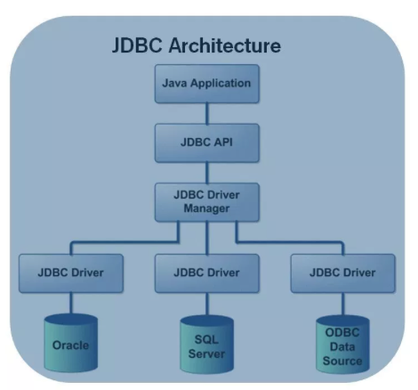

### Элементы JDBC

`JDBC API` состоит из следующих элементов:

- Менеджер драйверов (`Driver Manager`) - Этот элемент управляет списком драйверов БД. Каждой запрос на соединение требует соответствующего драйвера. Первое
  совпадение даёт нам соединение.
- Драйвер (`Driver`) - Этот элемент отвечает за связь с БД. Работать с ним нам приходится крайне редко. Вместо этого мы чаще используем объекты
  `DriverManager`, которые управляют объектами этого типа.
- Соединение (`Connection`) - Этот интерфейс обеспечивает нас методами для работы с БД. Все взаимодействия с БД происходят исключительно через `Connection`.
- Выражение (`Statement`) - Для подтверждения `SQL`-запросов мы используем объекты, созданные с использованием этого интерфейса.
- Результат (`ResultSet`) - Экземпляры этого элемента содержат данные, которые были получены в результате выполнения `SQL` – запроса. Он работает как итератор
  и “пробегает” по полученным данным.
- Исключения (`SQL Exception`) - Этот класс обрабатывает все ошибки, которые могут возникнуть при работе с БД.

### Connection

Итак, у нас есть `JDBC` драйвер, есть `JDBC API`. Как мы помним, `JDBC` расшифровывается как `Java DataBase Connectivity`. Поэтому, всё начинается с
`Connectivity` - возможности устанавливать подключение. А подключение — это `Connection`.

Обратимся снова к тексту спецификации `JDBC` и посмотрим на оглавление. Существует два способа подключения к БД:
- Через `DriverManager`
- Через `DataSource`

Разберёмся с `DriverManager`'ом. Как сказано, `DriverManager` позволяет подключиться к базе данных по указанному `URL`, а так же загружает `JDBC Driver`'ы,
которыу он нашёл в `CLASSPATH` (а раньше, до `JDBC 4.0` загружать класс драйвера надо было самостоятельно).

Получения `Connection`:

```Java
Connection con = DriverManager.getConnection(url, user, passwd);
```

### Statements

Существует несколько типов или видов `statement`'ов:
- `Statement`: `SQL` выражение, которое не содержит параметров
- `PreparedStatement`: Подготовленное `SQL` выражение, содержащее входные параметры
- `CallableStatement`: `SQL` выражение с возможностью получить возвращаемое значение из хранимых процедур (`SQL Stored Procedures`).

Итак, имея подключение, мы можем в рамках этого подключения выполнить какой-нибудь запрос. Поэтому, логично, что экземпляр `SQL` выражения изначально мы
получаем из `Connection`.

```java
private int executeUpdate(String query) throws SQLException {
	Statement statement = connection.createStatement();
  // Для Insert, Update, Delete
	int result = statement.executeUpdate(query);
	return result;
}
```

Добавим метод создания тестовой таблицы с использованием прошлого метода:

```java
private void createCustomerTable() throws SQLException {
	String customerTableQuery = "CREATE TABLE customers (id INTEGER PRIMARY KEY, name TEXT, age INTEGER)";
	String customerEntryQuery = "INSERT INTO customers VALUES (73, 'Brian', 33)";
	executeUpdate(customerTableQuery);
	executeUpdate(customerEntryQuery);
}
```

### ResultSet

`ResultSet` предоставляет методы для получения и манипуляции результатами выполненных запросов.

То есть если метод `execute` вернул нам `true`, значит мы можем получить и `ResultSet`.

Давайте вынесем вызов метода `createCustomerTable()` в метод `init`, который отмечен как `@Before`. Теперь доработаем наш тест `shouldSelectData`:

```java
@Test
public void shouldSelectData() throws SQLException {
	String query = "SELECT * FROM customers WHERE name = ?";
	PreparedStatement statement = connection.prepareStatement(query);
	statement.setString(1, "Brian");
	boolean hasResult = statement.execute();
	assertTrue(hasResult);
	
// Обработаем результат

	ResultSet resultSet = statement.getResultSet();
	resultSet.next();
	int age = resultSet.getInt("age");
	assertEquals(33, age);
}
```

Тут стоит отметить, что `next` — это метод, который двигает так называемый "курсор". Курсор в `ResultSet` указывает на некоторую строку. Таким образом, чтобы
считать строку, на неё нужно этот самый курсор установить. Когда курсор перемещается, то метод перемещения курсора возвращает `true`, если курсор валидный
(правильный, корректный), то есть указывает на данные. Если возвращает `false`, значит данных нет, то есть курсор не указывает на данные. Если попытаться
получить данные с невалидным курсором, то мы получим ошибку: `No data is available`.

Ещё интересно, что через ResultSet можно обновлять или даже вставлять строки:

```java
@Test
public void shouldInsertInResultSet() throws SQLException {
	Statement statement = connection.createStatement(ResultSet.TYPE_SCROLL_SENSITIVE, ResultSet.CONCUR_UPDATABLE);
	ResultSet resultSet = statement.executeQuery("SELECT * FROM customers");
	resultSet.moveToInsertRow();
	resultSet.updateLong("id", 3L);
	resultSet.updateString("name", "John");
	resultSet.updateInt("age", 18);
	resultSet.insertRow();
	resultSet.moveToCurrentRow();
}
```

### Полезные ссылки

[Руководство по JDBC. Введение. - proselyte](https://proselyte.net/tutorials/jdbc/introduction/)

[JDBC или с чего всё начинается - javarush](https://javarush.ru/groups/posts/2172-jdbc-ili-s-chego-vsje-nachinaetsja)

## JPA

`Java Persistence API (JPA)` - это спецификация Java, которая используется для сохранения данных между объектом Java и реляционной базой данных. JPA действует как
мост между объектно-ориентированными моделями предметной области и системами реляционных баз данных. Поскольку `JPA` - это просто спецификация, он не выполняет
никаких операций сам по себе. Это требует реализации. Следовательно, инструменты `ORM`, такие как `Hibernate`, `TopLink` и `iBatis`, реализуют спецификации `JPA`
для сохранения данных. Первая версия `JPA 1.0`, была выпущена в 2006 году как часть спецификации `EJB 3.0`.

### Выполняет ли JPA задачу, такую как доступ, сохранение и управление данными?

Нет, `JPA` - это всего лишь спецификация. Инструменты `ORM`, такие как `Hibernate`, `iBatis` и `TopLink`, реализуют спецификацию `JPA` и выполняют такие задачи.

### Что такое оobject-relational mapping?

`Object-relational mapping` - это механизм, который используется для разработки и поддержания связи между объектом и реляционной базой данных путем отображения
состояния объекта в столбец базы данных. Он преобразует атрибуты программного кода в столбцы таблицы. Он способен легко обрабатывать различные операции с базой
данных, такие как вставка, обновление, удаление и тд.


### Преимущества JPA

- Меньше взаимодействия с базой данных.
- Стоимость создания файла конфигураций снижается за счет использования аннотаций.
- Мы можем объединить приложения, используемые с другими поставщиками JPA.
- Использование различных реализаций может добавить функции к стандартной реализации, которая позже может стать частью спецификации JPA.

### Что такое встраиваемые классы?

Встраиваемые классы представляют состояние объекта, но не имеют собственного постоянного идентификатора. Объекты таких классов разделяют идентичность классов
сущностей, которым они принадлежат. Сущность может иметь однозначные или многозначные атрибуты встраиваемого класса.

### Что такое JPQL?

`Java Persistent Query Language (JPQL)` является частью спецификации `JPA`, которая определяет поиск по сущностям. Это объектно-ориентированный язык запросов,
который используется для выполнения операций базы данных с `persistent` объектами. Вместо таблицы базы данных `JPQL` использует объектную модель сущности для
обработки запросов `SQL`. Здесь роль `JPA` заключается в преобразовании `JPQL` в `SQL`. Таким образом, он предоставляет разработчикам простую платформу для решения
задач `SQL`. `JPQL` - это расширение языка запросов `Entity JavaBeans (EJBQL)`.

### Что такое orphal removing?

Если целевая сущность в сопоставлении «один-к-одному» или «один-ко-многим» удаляется из сопоставления, тогда операция удаления может быть передана каскадно целевой
сущности. Такие целевые объекты называются `orphans (сиротами)`, и атрибут `orphanRemoval` может использоваться для указания того, что объекты `orphans (сироты)`
должны быть удалены.

### Объясните жизненный цикл персистентности объекта

В жизненном цикле персистентности объект находится в следующих состояниях:

- `Transient` - объект находится в состоянии `transient`, когда он только объявлен с использованием ключевого слова `new`. Когда объект остается в `transient`
  состоянии, он не содержит идентификатора (первичного ключа) в базе данных.
- `Persistent` - в этом состоянии объект связан с сессией и либо только сохранился в базу данных, либо был извлечен из неё. Когда объект остается в состоянии
  `persistent`, он содержит строку базы данных и значение идентификатора. Мы можем сделать объект постоянным, связав его с `сессией hibernate`. Изменения, внесенные
  в `persistent` объекты, отображаются на объекте в базе данных.
- `Detached` - объект переходит в `detached` состояние при закрытии `сессии hibernate`. Изменения, внесенные в `detached` объекты, не отображаются на объекте в
  базе данных.

### Что такое Entity?

`Entity` это легковесный хранимый объект бизнес логики (`persistent domain object`). Основная программная сущность это `entity` класс, который так же может
использовать дополнительные классы, который могут использоваться как вспомогательные классы или для сохранения состояния `еntity`.

### Может ли Entity класс наследоваться от не Entity классов (non-entity classes)?

Может

### Может ли Entity класс наследоваться от других Entity классов

Может

### Может ли не Entity класс наследоваться от Entity класса

Может

### Может ли Entity быть абстрактным классом

Может, при этом он сохраняет все свойства Entity, за исключением того что его нельзя непосредственно инициализировать.

### Какие существуют ограничения на класс Entity?

Класс сущности должен соответствовать следующим требованиям:

- У класса должен быть конструктор без аргументов.
- Класс не может быть `final`.
- Класс должен быть аннотирован аннотацией `@Entity`.
- Класс не может содержать финальные поля или методы, если они участвуют в маппинге (persistent final methods or persistent final instance variables).
- Если объект класса будет передаваться по значению как отдельный объект (`detached object`), например через удаленный интерфейс, он так же должен реализовывать
  `Serializable` интерфейс.
- Класс должен содержать первичный ключ, то есть атрибут или группу атрибутов которые уникально определяют запись этого Enity класса в базе данных,

### Что произойдет, если будет отсутствовать конструктор без аргументов у Entity Bean?

Hibernate использует рефлексию для создания экземпляров `Entity` бинов при вызове методов `get()` или `load()`. Для этого используется метод `Class.newInstance()`,
который требует наличия конструктора без параметров. Поэтому, в случае его отсутствия, вы получите ошибку `HibernateException`.

### Почему мы не должны делать Entity class как final?

Хибернейт использует прокси классы для ленивой загрузки данных (т.е. по необходимости, а не сразу). Это достигается с помощью расширения `entity bean` и,
следовательно, если бы он был `final`, то это было бы невозможно. Ленивая загрузка данных во многих случаях повышает производительность, а следовательно важна.

### Что такое EntityManager и какие основные его функции вы можете перечислить?

`EntityManager` это интерфейс, который описывает `API` для всех основных операций над `Enitity`, получение данных и других сущностей `JPA`. По сути главный `API`
для работы с JPA. Основные операции:

1. Для операций над `Entity`:
- `persist` (добавление `Entity` под управление `JPA`)
- `merge` (обновление)
- `remove` (удаления)
- `refresh` (обновление данных)
- `detach` (удаление из управление `JPA`)
- `lock` (блокирование `Enity` от изменений в других `thread`)
2) Получение данных: `find` (поиск и получение `Entity`), `createQuery`, `createNamedQuery`, `createNativeQuery`, `contains`, `createNamedStoredProcedureQuery`
3) Получение других сущностей `JPA`: `getTransaction`, `getEntityManagerFactory`, `getCriteriaBuilder`, `getMetamodel`, `getDelegate`
4) Работа с `EntityGraph`: `createEntityGraph`, `getEntityGraph`
4) Общие операции над `EntityManager` или всеми `Entities`: `close`, `isOpen`, `getProperties`, `setProperty`, `clear`

### Какие четыре статуса жизненного цикла Entity объекта (Entity Instance’s Life Cycle) вы можите перечислить?

У `Entity` объекта существует четыре статуса жизненного цикла:
- `new` — объект создан, но при этом ещё не имеет сгенерированных первичных ключей и пока ещё не сохранен в базе данных
- `managed` — объект создан, управляется `JPA`, имеет сгенерированные первичные ключи
- `detached` — объект был создан, но не управляется (или больше не управляется) `JPA`
- `removed` — объект создан, управляется `JPA`, но будет удален после commit'a транзакции

### Как влияет операция persist на Entity объекты каждого из четырех статусов?

- Если статус `Entity` `new`, то он меняется на managed и объект будет сохранен в базу при `commit`'е транзакции или в результате `flush` операци
- Если статус уже `managed`, операция игнорируется, однако зависимые `Entity` могут поменять статус на `managed`, если у них есть аннотации каскадных изменений
- Если статус `removed`, то он меняется на `managed`
- Если статус `detached`, будет выкинут `exception` сразу или на этапе `commit`'а транзакции

### Как влияет операция remove на Entity объекты каждого из четырех статусов?

- Если статус `Entity` `new`, операция игнорируется, однако зависимые `Entity` могут поменять статус на `removed`, если у них есть аннотации каскадных изменений и
  они имели статус `managed`
- Если статус `managed`, то статус меняется на `removed` и запись объект в базе данных будет удалена при `commit`'е транзакции (так же произойдут операции `remove`
  для всех каскадно зависимых объектов)
- Если статус `removed`, то операция игнорируется
- Если статус `detached`, будет выкинут `exception` сразу или на этапе `commit`'а транзакции

### Как влияет операция merge на Entity объекты каждого из четырех статусов?

- Если статус `Entity new`, то будет создана новый `managed entity`, в который будут скопированы данные прошлого объекта
- Если статус `managed`, операция игнорируется, однако операция `merge` сработает на каскадно зависимые `Entity`, если их статус не `managed`
- Если статус `removed`, будет выкинут `exception` сразу или на этапе `commit`'а транзакции
- Если статус `detached`, то либо данные будет скопированы в существующей `managed entity` с тем же первичным ключом, либо создан новый `managed` в который
  скопируются данные

### Как влияет операция refresh на Entity объекты каждого из четырех статусов?

- Если статус `Entity managed`, то в результате операции будут востановлены все изменения из базы данных данного `Entity`, так же произойдет `refresh` всех
  каскадно зависимых объектов
- Если статус `new`, `removed` или `detached`, будет выкинут `exception`

### Как влияет операция detach на Entity объекты каждого из четырех статусов?

- Если статус `Entity` `managed` или `removed`, то в результате операции статус `Entity` (и всех каскадно-зависимых объектов) станет `detached`
- Если статус `new` или `detached`, то операция игнорируется

### Какова цель каскадных операций в JPA?

Если мы применим какое-либо действие к одной сущности, тогдаи при использовании каскадных операций, мы сделаем ее применимой и к связанным с ней сущностям.

### Какие типы каскадов поддерживает JPA?

- `PERSIST`: в этой каскадной операции, если родительский объект сохраняется, то все связанные с ним объекты также будут сохранены.
- `MERGE`: в этой каскадной операции, если родительский объект объединяется, то все связанные объекты также будут объединены.
- `DETACH`: в этой каскадной операции, если родительский объект отсоединен, то все связанные с ним объекты также будут отсоединены.
- `REFRESH`: в этой каскадной операции, если родительский объект обновляется, то все связанные с ним объекты также будут обновлены.
- `DELETE`: в этой каскадной операции, если родительский объект удален, то все связанные с ним объекты также будут удалены.
- `ALL`: В этом случае все вышеупомянутые каскадные операции могут применяться к объектам, связанным с родительским объектом.

### Что такое Criteria API?

`Criteria API` - это спецификация, которая предоставляет безопасные по типу и переносимые запросы критериев, написанные с использованием `API` Java. Это один из
наиболее распространенных способов построения запросов для сущностей. Это просто альтернативный метод определения запросов `JPA`. `Criteria API` определяет
платформенно-независимые критерии запросов, написанные на языке программирования `Java`. Он был представлен в `JPA 2.0`. Основная цель - предоставить
безопасный для типов способ выражения запроса.

###  Что такое встраиваемый (Embeddable) класс?

`Embeddable` класс это класс который не используется сам по себе, только как часть одного или нескольких `Entity` классов. `Entity` классы могут содержать как
одиночные встраиваемые классы, так и коллекции таких классов. Также такие классы могут быть использованы как ключи или значения `map`. Во время выполнения каждый
встраиваемый класс принадлежит только одному объекту `Entity` класса и не может быть использован для передачи данных между объектами `Entity` классов (то есть
такой класс не является общей структурой данных для разных объектов). В целом, такой класс служит для того чтобы выносить определение общих атрибутов для
нескольких `Entity`, можно считать что `JPA` просто встраивает в `Entity` вместо объекта такого класса те атрибуты, которые он содержит.

### Может ли встраиваемый (Embeddable) класс содержать другой встраиваемый (Embeddable) класс?

Да

### Какие требования JPA устанавливает к встраиваемым (Embeddable) классам?

- Такие классы должны удовлетворять тем же правилам что `Entity` классы, за исключением того что они не обязаны содержать первичный ключ и быть отмечены аннотацией
  `Entity`
- `Embeddable` класс должен быть отмечен аннотацией `@Embeddable` или описан в `XML` файле конфигурации `JPA`

### Какие типы связей (relationship) между Entity вы знаете?

Существуют следующие четыре типа связей:

1. `OneToOne` (связь один к одному, то есть один объект `Entity` может связан не больше чем с один объектом другого `Entity`)
2. `OneToMany` (связь один ко многим, один объект `Entity` может быть связан с целой коллекцией других `Entity`)
3. `ManyToOne` (связь многие к одному, обратная связь для `OneToMany`)
4. `ManyToMany` (связь многие ко многим)

Каждую из которых можно разделить ещё на два вида:

1. `Bidirectional` — ссылка на связь устанавливается у всех `Entity`, то есть в случае `OneToOne` `A-B` в `Entity A` есть ссылка на `Entity B`, в `Entity B` есть
   ссылка на `Entity A`, `Entity A` считается владельцем этой связи (это важно для случаев каскадного удаления данных, тогда при удалении `A` также будет удалено `B`,
   но не наоборот).
2. `Unidirectional` - ссылка на связь устанавливается только с одной стороны, то есть в случае `OneToOne` `A-B` только у `Entity A` будет ссылка на `Entity B`, у
   `Entity B` ссылки на `A` не будет.

### Что такое Mapped Superclass?

`Mapped Superclass` это класс от которого наследуются `Entity`, он может содержать анотации `JPA`, однако сам такой класс не является `Entity`, ему не обязательно
выполнять все требования установленные для `Entity` (например, он может не содержать первичного ключа). Такой класс не может использоваться в операциях
`EntityManager` или `Query`. Такой класс должен быть отмечен аннотацией `@MappedSuperclass` или соответственно описан в `XML` файле.

### Какие три типа стратегии наследования мапинга (Inheritance Mapping Strategies) описаны в JPA?

В `JPA` описаны три стратегии наследования мапинга (`Inheritance Mapping Strategies`), то есть как `JPA` будет работать с классами-наследниками `Entity`:

1. `одна таблица на всю иерархию наследования` (a single table per class hierarchy) — все `enity`, со всеми наследниками записываются в одну таблицу, для
   идентификации типа `entity` определяется специальная колонка “`discriminator column`”. Например, если есть `entity Animals` c классами-потомками `Cats` и `Dogs`,
   при такой стратегии все `entity` записываются в таблицу `Animals`, но при это имеют дополнительную колонку `animalType` в которую соответственно пишется значение
   `cat` или `dog`. Минусом является то что в общей таблице, будут созданы все поля уникальные для каждого из классов-потомков, которые будет пусты для всех других
   классов-потомков. Например, в таблице `animals` окажется и скорость лазанья по дереву от `cats` и может ли пес приносить тапки от `dogs`, которые будут всегда
   иметь `null` для `dog` и `cat` соотвественно.

2. `объединяющая стратегия` (joined subclass strategy) — в этой стратегии каждый класс `enity` сохраняет данные в свою таблицу, но только уникальные колонки (не
   унаследованные от классов-предков) и первичный ключ, а все унаследованные колонки записываются в таблицы класса-предка, дополнительно устанавливается связь
   (relationships) между этими таблицами, например в случае классов `Animals` (см.выше), будут три таблицы `animals`, `cats`, `dogs`, причем в `cats` будет записана
   только ключ и скорость лазанья, в `dogs` — ключ и умеет ли пес приносить палку, а в `animals` все остальные данные `cats` и `dogs` c ссылкой на соответствующие
   таблицы. Минусом тут являются потери производительности от объединения таблиц (`join`) для любых операций.

3. `одна таблица для каждого класса` (table per concrete class strategy) — тут все просто каждый отдельный класс-наследник имеет свою таблицу, т.е. для `cats` и
   `dogs` (см.выше) все данные будут записываться просто в таблицы `cats` и dogs как если бы они вообще не имели общего суперкласса. Минусом является плохая поддержка
   полиморфизма (polymorphic relationships) и то что для выборки всех классов иерархии потребуются большое количество отдельных `sql` запросов или использование
   `UNION` запроса.

### Какие шесть видов блокировок (lock) описаны в спецификации JPA (или какие есть значения у enum LockModeType в JPA)?

У `JPA` есть шесть видов блокировок, перечислим их в порядке увеличения надежности (от самого ненадежного и быстрого, до самого надежного и медленного):

- `NONE` — без блокировки
- `OPTIMISTIC` (или синоним `READ`, оставшийся от `JPA 1`) — оптимистическая блокировка
- `OPTIMISTIC_FORCE_INCREMENT` (или синоним `WRITE`, оставшийся от `JPA 1`) — оптимистическая блокировка с принудительным увеличением поля версионности
- `PESSIMISTIC_READ` — пессимистичная блокировка на чтение
- `PESSIMISTIC_WRITE` — пессимистичная блокировка на запись (и чтение)
- `PESSIMISTIC_FORCE_INCREMENT` — пессимистичная блокировка на запись (и чтение) с принудительным увеличением поля версионности

### Двухфазный коммит

Протокол двухфазного принятия обеспечивает механизм автоматического восстановления на случай, если во время выполнения транзакции произойдет системный сбой или
ошибка носителя. Протокол двухфазного принятия гарантирует, что все участвующие в транзакции серверы баз данных получат и реализуют одно и то же действие (принятие
или откат транзакции), невзирая на на какие локальные или сетевые сбои.

Если какой-либо сервер баз данных не сможет принять свою часть транзакции, всем серверам баз данных, участвующим в транзакции, будет запрещено принятие их работы.

### Когда используется протокол двухфазного коммита

Сервер баз данных автоматически использует протокол двухфазного принятия для любой транзакции, которая изменяет данные на нескольких серверах баз данных.
Допустим, у вас соединены друг с другом три сервера баз данных: `australia`, `italy` и `france`, как показано на следующем рисунке:


Если вы введете команды, показанные в этом примере, будет произведена одна операция обновления и две операции вставки на трех разных серверах баз данных.

```sql
CONNECT TO stores_demo@italy
BEGIN WORK
   UPDATE stores_demo:manufact SET manu_code = 'SHM' WHERE manu_name = 'Shimara'
   INSERT INTO stores_demo@france:manufact VALUES ('SHM', 'Shimara', '30')
   INSERT INTO stores_demo@australia:manufact VALUES ('SHM', 'Shimara', '30')
COMMIT WORK
```

### Понятия двухфазного коммита

Для каждой глобальной транзакции задан координатор и один или несколько участников, как указано ниже:

- Координатор руководит разрешением глобальной транзакции. Он решает, следует ли принять или остановить глобальную транзакцию.

Протокол двухфазного принятия всегда назначает роль координатора текущему серверу баз данных. Роль координатора нельзя изменить в ходе выполнения одной транзакции.
В примере транзакции выше координатором является сервер `italy`. если вы замените первую строку в этом примере на приведенный ниже оператор, протокол двухфазного
принятия назначит роль координатора серверу `france`:

```sql
CONNECT TO stores_demo@franceСкопировать код
```

Чтобы определить сервер-координатор для распределенной транзакции, введите команду `onstat -x`.

- Каждый участник руководит выполнением одной ветви транзакции, которая является частью глобальной транзакции с использованием одной локальной базы данных.
  Глобальная транзакция содержит несколько ветвей транзакции, когда:

1. Программа использует несколько процессов для выполнения работы для глобальной транзакции.
2. Работу для одной и той же глобальной транзакции выполняют несколько удаленных программ.

В транзакции выше участниками являются серверы `france` и `australia`. Сервер баз данных, являющийся координатором (`italy`) также функционирует как участник,
поскольку он выполняет обновление.

Протокол двухфазного принятия использует два типа связи: сообщения и записи логического журнала:

- Сообщения передаются между координатором и каждым из участников. Сообщения от координатора включают в себя идентификационный номер транзакции и инструкции
  (например, `prepare to commit`, `commit` или `roll back`). Сообщения от каждого из участников содержат состояние транзакции и отчеты о выполненных действиях
  (например, `can commit` или `cannot commit`, `committed` или `rolled back`).
- Записи логического журнала для транзакции хранятся на диске, чтобы обеспечить целостность и непротиворечивость данных, даже если на участвующем в транзакции
  сервере баз данных (участнике или координаторе) произойдет сбой.

### Фазы протокола двухфазного коммита

В транзакции с использованием двухфазного принятия координатор посылает все инструкции по изменению данных (например, по выполнению вставки) всем участникам. Затем
координатор запустит протокол двухфазного принятия. Протокол двухфазного принятия состоит из двух частей, фазы подготовки к принятию и фазы после решения.

##### Фаза подготовки к принятию

В ходе фазы подготовки к принятию координатор и участники ведут следующий диалог:

- `Координатор`: Координатор указывает каждому серверу баз данных-участнику, что тот должен подготовиться к принятию транзакции.
- `Участники`: Каждый участник сообщает координатору, может ли он принять свою ветвь транзакции.
- `Координатор`: Координатор, в зависимости от ответа каждого из участников, решает, нужно ли произвести принятие или откат транзакции. Координатор решит, что
  нужно принять транзакцию, только если все участники укажут, что могут принять свои ветви транзакции. Если кто-либо из участников укажет, что он не готов принять
  свою ветвь транзакции (или если он не ответит), координатор решит завершить глобальную транзакцию.

##### Фаза после решения

В ходе фазы после решения координатор и участники ведут следующий диалог:

- `Координатор`: Координатор вносит запись о принятии или откате в логический журнал координатора, а затем указывает каждому серверу баз данных-участнику, чтобы
  тот произвел принятие или откат транзакции.
- `Участники`: Если координатор сгенерировал сообщение о принятии, все участник примут транзакцию, внеся запись о принятии в логический журнал и отправив затем
  координатору сообщение, подтверждающее, что транзакция принята. Если координатор сгенерировал сообщение об откате, участники произведут откат транзакции, но не
  отправят подтверждение координатору.
- `Координатор`:  Если координатор сгенерировал сообщение о принятии транзакции, то, прежде чем завершить глобальную транзакцию, он дождется получения
  подтверждения от каждого из участников. Если координатор сгенерировал сообщение об откате транзакции, он не будет ждать подтверждений от участников.

### Как протокол двухфазного коммита обрабатывает ошибки

Протокол двухфазного принятия обеспечивает обработку системных ошибок и ошибок носителей таким образом, чтобы сохранялась целостность данных на всех участвующих в
транзакции серверах баз данных. Если произойдет ошибка, протокол двухфазного принятия произведет автоматическое восстановление.

##### Типы отказов, обрабатываемых при автоматическом восстановлении

Ниже перечислены события, которые могут вызвать остановку или зависание потока координатора или участника, в связи с чем потребуется автоматическое восстановление:
- Системная ошибка координатора
- Системная ошибка участника
- Ошибка в сети
- Остановка координирующего потока администратором
  -Остановка потока участника администратором

##### Роль администратора в автоматическом восстановлении

Единственное, что должен сделать администратор при автоматическом восстановлении - это перевести координатора и/или участника обратно в подключенное состояние
после системой или сетевой ошибки.

**Важное замечание**

Медленная работа сети может запустить автоматическое восстановление. Ни один из описанных здесь механизмов восстановления не будет задействован, если не произойдет
ошибка координирующей системы или ошибка сети либо если администратор не прервет координирующий поток.

##### Механизмы автоматического восстановления в случае ошибки координатора

В случае сбоя координирующего потока каждый сервер баз данных, являющийся участником, должен решить, следует ли инициировать автоматическое восстановление до
принятия или отката транзакции, или после отката транзакции. Эта задача является частью оптимизации предполагаемого завершения.

##### Механизм автоматического восстановления в случае ошибки участника

Восстановление участника происходит каждый раз, когда поток участника производит предварительное принятие элемента работы, прерванного до того, как протокол
двухфазного принятия сможет завершить работу. Цель восстановления участника - завершить работу протокола двухфазного принятия в соответствии с решением, к которому
пришел координатор.

Восстановление участника управляется либо координатором, либо участником, в зависимости от того, решил ли координатор произвести принятие или откат глобальной
транзакции.

**Важное замечание**

Чтобы обеспечить поддержку автоматического восстановления после завершения работы или перезапуска подчиненного сервера в то время, когда открыта межсерверная
транзакция, в файле `sqlhosts` должна быть запись для каждого сервера баз данных, с которого можно инициировать распределенные операции. Во время автоматического
восстановления имя координатора будет восстановлено из логических журналов, и подчиненный сервер заново установит соединение с координатором, чтобы завершить
транзакцию. Координатор всегда идентифицирует себя среди участников по имени, которое указано в параметре конфигурации `DBSERVERNAME` в его собственном файле
`onconfig`. В этой связи имя координатора должно совпадать с именем `IP-соединения`, которое известно участникам. Однако можно также установить по меньшей мере
одну настройку `DBSERVERALIASES` с правильным протоколом соединения для обеспечения связи между координатором и подчиненными серверами. Подчиненный сервер должен
иметь возможность соединиться с координатором, используя заданное для координатора значение `DBSERVERNAME` или `DBSERVERALIASES`.

### Оптимизация предполагаемого завершения

`Оптимизация предполагаемого завершения` - это термин, описывающий, как протокол двухфазного принятия обрабатывает откат транзакции.

Откат обрабатывается следующим образом. Если координатор определит, что нужно произвести откат транзакции, он отправит всем участникам сообщение о том, что они
должны произвести откат своей части работы. Координатор, не дожидаясь подтверждения получения этого сообщения, приступит к закрытию транзакции и ее удалению из
совместной памяти. Если участник попытается определить состояние этой транзакции — то есть, определить, была ли транзакция принята или был произведен ее откат
(например, во время восстановления участника) — он не найдет состояния этой транзакции в совместной памяти. Участник должен будет интерпретировать это как то, что
был произведен откат транзакции.

### Полезные ссылки

[Шпаргалка Java программиста 1: JPA и Hibernate в вопросах и ответах - habr](https://habr.com/ru/post/265061/)

[Двухфазный коммит - ibm.com](https://www.ibm.com/support/knowledgecenter/ru/SSGU8G_12.1.0/com.ibm.admin.doc/ids_admin_1050.htm)

## NoSQL

### Краткое введение в различные типы баз данных

Программное обеспечение РСУБД различных производителей, основанное на SQL, традиционно использовалось как наиболее распространенная технология
хранения данных. Все системы СУБД состоят из таблиц, которые можно соединить друг с другом через общие значения в определенных столбцах или внешние
ключи.

Все системы, принадлежащие к этой категории, используют SQL в качестве языка, который извлекает и обрабатывает данные, а также диктует структуру самих
баз данных. Хотя в разных системах СУБД используются разные диалекты SQL (например, PL/SQL от Oracle и T-SQL от Microsoft), ядро синтаксиса абсолютно
одинаково.

Большинство передовых методов проектирования баз данных также применимы ко всем типам РСУБД. Наиболее известными примерами СУБД являются Microsoft SQL
Server, Oracle Database, MySQL и PostgreSQL.

NoSQL, с другой стороны, состоит из нескольких совершенно не связанных между собой технологий, каждая из которых состоит из собственного языка
манипулирования данными, возможностей и лучших практик. Условно их можно разделить на 4 отдельные категории. Тем не менее, эта категоризация очень
широка, поскольку никакие две системы NoSQL из одной и той же категории не настолько похожи друг на друга, что знание одной из них будет означать, что
для овладения другой системой потребуются относительно небольшие усилия по обучению. случай с СУБД.

### Категории NoSQL Database

* **Key-Value store:** данные хранятся в хэш-таблице, где каждый уникальный ключ соответствует определенному объекту данных. Примеры включают
  **_Redis_**, **_DynamoDB_** и **_InfinityDB_**.
* **Document-Based Database:** данные хранятся в форме объекта, написанного на декларативном языке, таком как **_JSON_** или **_XML_**. Примеры
  включают **_MongoDB_**, **_Elasticsearch_**, **_CounchDB_** и **_DocumentDB_**.
* **Column-oriented DBMS:** данные хранятся в таблицах, как и в традиционных СУБД, но они разделены по столбцам, а не по строкам. Примеры включают
  **_HBase_**, **_MariaDB_** и **_Metakit_**.
* **Graph database:** База данных представлена в виде сети, которую можно визуализировать. Примеры включают **_Neo4j_**, **_InfiniteGraph_** и
  **_ArangoDB_**.

Еще больше усложняет дело то, что некоторые системы управления базами данных имеют возможности как традиционных СУБД, так и различных типов NoSQL.
Microsoft SQL Server, например, имеет возможность управлять базами данных столбцов в сценариях хранения данных, а с 2017 года он имеет возможности
управления базами данных графов. Когда дело доходит до открытого исходного кода, у PostgreSQL есть возможность управлять хранилищем документов.

### Когда NoSQL является лучшим выбором чем, чем РСУБД, а когда нет

#### NoSQL стоит выбирать когда:

* Когда вы ожидаете, что ваша **структура** данных **будет меняться** довольно часто
* Когда вам нужна система, которая часто используется и **ожидается значительный рост**
* Сбор простой аналитики

#### SQL стоит выбирать когда:

* Когда вам нужна **небольшая система** или веб-сайт
* Когда вам нужна транзакционная система отвечающая стандартам **ACID**, где важна консистентность (согласованность) данных
* Сбор комплексной аналитики

## Optimization of SQL queries

### Оптимизация запросов в SQL (небольшие подсказки)

1. Используйте конкретные имена столбцов после оператора `select`, вместо `*` – это позволит увеличить скорость отработки запроса и уменьшению сетевого трафика.

2. Сведите к минимуму использование подзапросов.

Например, запрос
```sql
Select Column_A 
From Table_1
Where Column_B = (Select max (Column_B From Table_2)
And Column_C = (Select max (Column_C From Table_2)
And Column_D = ‘position_2’
```

выглядит значительно хуже на фоне аналогичного запроса:

```sql
Select Column_A 
From Table_1
Where (Column_B, Column_C) = (Select max (Column_B), max (Column_C) 
From Table_2)
```

3. Используйте оператор `IN` аккуратно, поскольку на практике он имеет низкую производительность и может быть эффективен только при использовании критериев
   фильтрации в подзапросе.

4. Соединение таблиц в запросе также является критичным: в случае, когда соединение таблиц происходит в правильном порядке, то общее число строк, необходимых к
   обработке, значительно сократится. При соединении основной и уточняющей таблиц убедитесь, что первой будет основная таблица, в противном случае вы рискуете
   получить обработку гораздо большего числа строк, чем необходимо.

5. При соединении таблиц `EXIST` предпочтительнее `distinct` (таблицы отношения `один-ко-многим`).

6. Избыточность при работе с `SQL` – это критичная необходимость, используйте в разделе `WHERE` как можно больше ограничивающих условий.

Например, если указан

```sql
WHERE Column_А=Column_В and Column_А=425
```

вы сможете вывести результат, где `Column_В=425`, однако при задании условий

```sql
WHERE Column_А=Column_В and Column_B=Column_C
```

оператор не сможет определить, что `Column_A=Column_C`.

7. Пишите простые запросы. Больше упрощайте. Оптимизатор может не справиться со слишком сложными операторами. Кроме того, иногда выполнение нескольких простых до
   невозможности операторов дает лучший результат по сравнению со сложными и позволяет добиться лучшей эффективности.

8. Помните, что одного и того же результата можно добиться разными способами. Например, оператор `MINUS` выполняется гораздо быстрее, чем запросы с оператором
   `WHERE NOT EXIST`. Запрос с данным оператором в самом общем виде выглядит следующим образом:

```sql
Select worker_id
From workers
MINUS
Select worker_id
From orders
```

Этот пример показывает все значения `worker_id`, которые содержаться в таблице `workers`, но не в таблице `orders`. Другими словами, если бы значение `worker_id`
одновременно присутствовало в таблицах `workers` и `orders`, то значение `worker_id` не вывелось в результат, поскольку нет конкретики, содержание какой именно
таблицы вывести как результат отработки запроса.

9. Оформляйте повторяющиеся коды в пользовательскую процедуру. Это может значительно ускорить работу, уменьшить сетевой трафик.

### Отключите автофиксацию транзакций

Выполняя серию команд `INSERT`, выключите автофиксацию транзакций и зафиксируйте транзакцию только один раз в самом конце. (В обычном `SQL` это означает, что нужно
выполнить `BEGIN` до, и `COMMIT` после этой серии. Некоторые клиентские библиотеки могут делать это автоматически, в таких случаях нужно убедиться, что это так.)
Если вы будете фиксировать каждое добавление по отдельности, `PostgreSQL` придётся проделать много действий для каждой добавляемой строки. Выполнять все операции в
одной транзакции хорошо ещё и потому, что в случае ошибки добавления одной из строк произойдёт откат к исходному состоянию и вы не окажетесь в сложной ситуации с
частично загруженными данными.

### Используйте COPY

Используйте `COPY`, чтобы загрузить все строки одной командой вместо серии `INSERT`. Команда `COPY` оптимизирована для загрузки большого количества строк; хотя она
не так гибка, как `INSERT`, но при загрузке больших объёмов данных она влечёт гораздо меньше накладных расходов. Так как COPY — это одна команда, применяя её, нет
необходимости отключать автофиксацию транзакций.

В случаях, когда `COPY` не подходит, может быть полезно создать подготовленный оператор `INSERT` с помощью `PREPARE`, а затем выполнять `EXECUTE` столько раз,
сколько потребуется. Это позволит избежать накладных расходов, связанных с разбором и анализом каждой команды `INSERT`. В разных интерфейсах это может выглядеть
по-разному.

Заметьте, что с помощью `COPY` большое количество строк практически всегда загружается быстрее, чем с помощью `INSERT`, даже если используется `PREPARE` и серия
операций добавления заключена в одну транзакцию.

### Удалите индексы

Если вы загружаете данные в только что созданную таблицу, быстрее всего будет загрузить данные с помощью `COPY`, а затем создать все необходимые для неё индексы.
На создание индекса для уже существующих данных уйдёт меньше времени, чем на последовательное его обновление при добавлении каждой строки.

Если вы добавляете данные в существующую таблицу, может иметь смысл удалить индексы, загрузить таблицу, а затем пересоздать индексы. Конечно, при этом надо
учитывать, что временное отсутствие индексов может отрицательно повлиять на скорость работы других пользователей. Кроме того, следует дважды подумать, прежде чем
удалять уникальные индексы, так как без них соответствующие проверки ключей не будут выполняться.

### Удалите ограничения внешних ключей

Как и с индексами, проверки, связанные с ограничениями внешних ключей, выгоднее выполнять «массово», а не для каждой строки в отдельности. Поэтому может быть
полезно удалить ограничения внешних ключей, загрузить данные, а затем восстановить прежние ограничения. И в этом случае тоже приходится выбирать между скоростью
загрузки данных и риском допустить ошибки в отсутствие ограничений.

Более того, когда вы загружаете данные в таблицу с существующими ограничениями внешнего ключа, для каждой новой строки добавляется запись в очередь событий
триггера (так как именно срабатывающий триггер проверяет такие ограничения для строки). При загрузке многих миллионов строк очередь событий триггера может занять
всю доступную память, что приведёт к недопустимой нагрузке на файл подкачки или даже к сбою команды. Таким образом, загружая большие объёмы данных, может быть не
просто желательно, а необходимо удалять, а затем восстанавливать внешние ключи. Если же временное отключение этого ограничения неприемлемо, единственно возможным
решением может быть разделение всей операции загрузки на меньшие транзакции.

### Увеличьте maintenance_work_mem

Ускорить загрузку больших объёмов данных можно, увеличив параметр конфигурации `maintenance_work_mem` на время загрузки. Это приведёт к увеличению быстродействия
`CREATE INDEX` и `ALTER TABLE ADD FOREIGN KEY`. На скорость самой команды `COPY` это не повлияет, так что этот совет будет полезен, только если вы применяете
какой-либо из двух вышеописанных приёмов.

### Увеличьте max_wal_size

Также массовую загрузку данных можно ускорить, изменив на время загрузки параметр конфигурации `max_wal_size`. Загружая большие объёмы данных, `PostgreSQL`
вынужден увеличивать частоту контрольных точек по сравнению с обычной (которая задаётся параметром `checkpoint_timeout`), а значит и чаще сбрасывать «грязные»
страницы на диск. Временно увеличив `max_wal_size`, можно уменьшить частоту контрольных точек и связанных с ними операций ввода-вывода.

### Отключите архивацию WAL и потоковую репликацию

Для загрузки больших объёмов данных в среде, где используется архивация `WAL` или потоковая репликация, быстрее будет сделать копию базы данных после загрузки
данных, чем обрабатывать множество операций изменений в `WAL`. Чтобы отключить передачу изменений через `WAL` в процессе загрузки, отключите архивацию и потоковую
репликацию, назначьте параметру `wal_level` значение `minimal`, `archive_mode` — `off`, а `max_wal_senders` — `0`. Но имейте в виду, что изменённые параметры
вступят в силу только после перезапуска сервера.

Это не только поможет сэкономить время архивации и передачи `WAL`, но и непосредственно ускорит некоторые команды, которые могут вовсе не использовать `WAL`, если
`wal_level` равен `minimal`. (Они могут гарантировать безопасность при сбое, не записывая все изменения в `WAL`, а выполнив только `fsync` в конце операции, что
будет гораздо дешевле.) Это относится к следующим командам:

```sql
- CREATE TABLE AS SELECT
- CREATE INDEX (и подобные команды, как например ALTER TABLE ADD PRIMARY KEY)
- ALTER TABLE SET TABLESPACE
- CLUSTER
- COPY FROM, когда целевая таблица была создана или опустошена ранее в той же транзакции
```

### Выполните в конце ANALYZE

Всякий раз, когда распределение данных в таблице значительно меняется, настоятельно рекомендуется выполнять `ANALYZE`. Эта рекомендация касается и загрузки в
таблицу большого объёма данных. Выполнив `ANALYZE` (или `VACUUM ANALYZE`), вы тем самым обновите статистику по данной таблице для планировщика. Когда планировщик
не имеет статистики или она не соответствует действительности, он не сможет правильно планировать запросы, что приведёт к снижению быстродействия при работе с
соответствующими таблицами. Заметьте, что если включён демон автоочистки, он может запускать `ANALYZE` автоматически.

### Полезные ссылки

[Как оптимизировать запросы в SQL? - vc.ru](https://vc.ru/newtechaudit/113408-kak-optimizirovat-zaprosy-v-sql)

[Оптимизация производительности - postgrespro.ru](https://postgrespro.ru/docs/postgresql/9.6/populate)

## PostgreSQL EXPLAIN

`EXPLAIN` — показать план выполнения оператора

### Синтаксис

```sql
EXPLAIN [ ( параметр [, ...] ) ] оператор
EXPLAIN [ ANALYZE ] [ VERBOSE ] оператор
```

Здесь допускается параметр:

```
- ANALYZE [ boolean ]
- VERBOSE [ boolean ]
- COSTS [ boolean ]
- BUFFERS [ boolean ]
- TIMING [ boolean ]
- FORMAT { TEXT | XML | JSON | YAML }
```

### Описание

Выполняя любой полученный запрос, `PostgreSQL` разрабатывает для него план запроса. Выбор правильного плана, соответствующего структуре запроса и характеристикам
данным, крайне важен для хорошей производительности, поэтому в системе работает сложный планировщик, задача которого — подобрать хороший план. Узнать, какой план
был выбран для какого-либо запроса, можно с помощью команды `EXPLAIN`.

Эта команда `выводит план выполнения`, генерируемый планировщиком `PostgreSQL` для заданного оператора. План выполнения показывает, как будут сканироваться
таблицы, затрагиваемые оператором — просто последовательно, по индексу и т. д. — а если запрос связывает несколько таблиц, какой алгоритм соединения будет выбран
для объединения считанных из них строк.

Наибольший интерес в выводимой информации представляет ожидаемая стоимость выполнения оператора, которая показывает, сколько, по мнению планировщика, будет
выполняться этот оператор (это значение измеряется в единицах стоимости, которые не имеют точного определения, но обычно это обращение к странице на диске).
Фактически выводятся два числа: `стоимость запуска до выдачи первой строки` и `общая стоимость выдачи всех строк`. Для большинства запросов важна общая стоимость,
но в таких контекстах, как подзапрос в `EXISTS`, планировщик будет минимизировать стоимость запуска, а не общую стоимость (так как исполнение запроса всё равно
завершится сразу после получения одной строки). Кроме того, если количество возвращаемых строк ограничивается предложением `LIMIT`, планировщик интерполирует
стоимость между двумя этими числами, выбирая наиболее выгодный план.

С параметром `ANALYZE` оператор будет выполнен на самом деле, а не только запланирован. При этом в вывод добавляются фактические сведения о времени выполнения,
включая общее время, затраченное на каждый узел плана (в миллисекундах) и общее число строк, выданных в результате. Это помогает понять, насколько близки к
реальности предварительные оценки планировщика.

### Важно

Имейте в виду, что с указанием `ANALYZE` оператор действительно выполняется. Хотя `EXPLAIN` отбрасывает результат, который вернул бы `SELECT`, в остальном все
действия выполняются как обычно. Если вы хотите выполнить `EXPLAIN ANALYZE` с командой `INSERT`, `UPDATE`, `DELETE`, `CREATE TABLE AS` или `EXECUTE`, не допуская
изменения данных этой командой, воспользуйтесь таким приёмом:

```sql
BEGIN;
EXPLAIN ANALYZE ...;
ROLLBACK;
```

Без скобок для этого оператора можно указать только параметры `ANALYZE` и `VERBOSE` и только в таком порядке. В `PostgreSQL` до версии 9.0 поддерживался только
синтаксис без скобок, однако в дальнейшем ожидается, что все новые параметры будут восприниматься только в скобках.

### Параметры

- `ANALYZE`
  Выполнить команду и вывести фактическое время выполнения и другую статистику. По умолчанию этот параметр равен `FALSE`.

- `VERBOSE`
  Вывести дополнительную информацию о плане запроса. В частности, включить список столбцов результата для каждого узла в дереве плана, дополнить схемой имена таблиц и
  функций, всегда указывать для переменных в выражениях псевдоним их таблицы, а также выводить имена всех триггеров, для которых выдаётся статистика. По умолчанию
  этот параметр равен `FALSE`.

- `COSTS`
  Вывести рассчитанную стоимость запуска и общую стоимость каждого узла плана, а также рассчитанное число строк и ширину каждой строки. Этот параметр по умолчанию
  равен `TRUE`.

- `BUFFERS`
  Включить информацию об использовании буфера. В частности, вывести число попаданий, блоков прочитанных, загрязненных и записанных в разделяемом и локальном буфере, а
  также число прочитанных и записанных временных блоков. Попаданием (`hit`) считается ситуация, когда требуемый блок уже находится в кеше и чтения с диска удаётся
  избежать. Блоки в общем буфере содержат данные обычных таблиц и индексов, в локальном — данные временных таблиц и индексов, а временные блоки предназначены для
  краткосрочного использования при выполнении сортировки, хеширования, материализации и подобных узлов плана. Число загрязнённых блоков (`dirtied`) показывает,
  сколько ранее не модифицированных блоков изменила данная операция; тогда как число записанных блоков (`written`) показывает, сколько ранее загрязнённых блоков
  данный серверный процесс вынес из кеша при обработке запроса. Значения, указываемые для узла верхнего уровня, включают значения всех его дочерних узлов. В текстовом
  формате выводятся только ненулевые значения. Этот параметр действует только в режиме `ANALYZE`. По умолчанию его значение равно `FALSE`.

- `TIMING`
  Включить в вывод фактическое время запуска и время, затраченное на каждый узел. Постоянное чтение системных часов может значительно замедлить запрос, так что если
  достаточно знать фактическое число строк, имеет смысл сделать этот параметр равным `FALSE`. Время выполнения всего оператора замеряется всегда, даже когда этот
  параметр выключен и на уровне узлов время не подсчитывается. Этот параметр действует только в режиме `ANALYZE`. По умолчанию его значение равно `TRUE`.

- `FORMAT`
  Установить один из следующих форматов вывода: `TEXT`, `XML`, `JSON` или `YAML`. Последние три формата содержат ту же информацию, что и текстовый, но больше подходят
  для программного разбора. По умолчанию выбирается формат `TEXT`.

- `boolean`
  Включает или отключает заданный параметр. Для включения параметра можно написать `TRUE`, `ON` или `1`, а для отключения — `FALSE`, `OFF` или `0`. Значение `boolean`
  можно опустить, в этом случае подразумевается `TRUE`.

- `оператор`
  Любой оператор `SELECT`, `INSERT`, `UPDATE`, `DELETE`, `VALUES`, `EXECUTE`, `DECLARE`, `CREATE TABLE AS` и `CREATE MATERIALIZED VIEW AS`, план выполнения которого
  вас интересует.

### Замечания

Измеряя фактическую стоимость выполнения каждого узла в плане, текущая реализация `EXPLAIN ANALYZE` привносит накладные расходы профилирования в выполнение
запроса. В результате этого, при запуске запроса командой `EXPLAIN ANALYZE` он может выполняться значительно дольше, чем при обычном выполнении. Объём накладных
расходов зависит от природы запроса, а также от используемой платформы. Худшая ситуация наблюдается для узлов плана, которые сами по себе выполняются очень быстро,
и в операционных системах, где получение текущего времени относительно длительная операция.

### Азы EXPLAIN

Структура плана запроса представляет собой дерево узлов плана. Узлы на нижнем уровне дерева — это узлы сканирования, которые возвращают необработанные данные
таблицы. Разным типам доступа к таблице соответствуют разные узлы: последовательное сканирование, сканирование индекса и сканирование битовой карты. Источниками
строк могут быть не только таблицы, но и например, предложения `VALUES` и функции, возвращающие множества во `FROM`, и они представляются отдельными типами узлов
сканирования. Если запрос требует объединения, агрегатных вычислений, сортировки или других операций с исходными строками, над узлами сканирования появляются узлы,
обозначающие эти операции. И так как обычно операции могут выполняться разными способами, на этом уровне тоже могут быть узлы разных типов. В выводе команды
`EXPLAIN` для каждого узла в дереве плана отводится одна строка, где показывается базовый тип узла плюс оценка стоимости выполнения данного узла, которую сделал
для него планировщик. Если для узла выводятся дополнительные свойства, в вывод могут добавляться дополнительные строки, с отступом от основной информации узла. В
самой первой строке (основной строке самого верхнего узла) выводится общая стоимость выполнения для всего плана; именно это значение планировщик старается
минимизировать.

---

Взгляните на следующий простейший пример, просто иллюстрирующий формат вывода:

```sql
EXPLAIN SELECT * FROM tenk1;

                         QUERY PLAN
-------------------------------------------------------------
 Seq Scan on tenk1  (cost=0.00..458.00 rows=10000 width=244)
 ```

Этот запрос не содержит предложения `WHERE`, поэтому он должен просканировать все строки таблицы, так что планировщик выбрал план простого последовательного
сканирования. Числа, перечисленные в скобках (слева направо), имеют следующий смысл:
- `Приблизительная стоимость запуска`. Это время, которое проходит, прежде чем начнётся этап вывода данных, например для сортирующего узла это время сортировки.
- `Приблизительная общая стоимость`. Она вычисляется в предположении, что узел плана выполняется до конца, то есть возвращает все доступные строки. На практике
  родительский узел может досрочно прекратить чтение строк дочернего (см. приведённый ниже пример с `LIMIT`).
- `Ожидаемое число строк`, которое должен вывести этот узел плана. При этом так же предполагается, что узел выполняется до конца.
- `Ожидаемый средний размер строк`, выводимых этим узлом плана (в байтах).

Стоимость может измеряться в произвольных единицах, определяемых параметрами планировщика. Традиционно единицей стоимости считается операция чтения страницы с
диска; то есть `seq_page_cost` обычно равен `1.0`, а другие параметры задаётся относительно него. Примеры в этом разделе выполняются со стандартными параметрами
стоимости.

Важно понимать, что стоимость узла верхнего уровня включает стоимость всех его потомков. Также важно осознавать, что эта стоимость отражает только те факторы,
которые учитывает планировщик. В частности, она не зависит от времени, необходимого для передачи результирующих строк клиенту, хотя оно может составлять
значительную часть общего времени выполнения запроса. Тем не менее планировщик игнорирует эту величину, так как он всё равно не сможет изменить её, выбрав другой
план. (Мы верим в то, что любой правильный план запроса выдаёт один и тот же набор строк.)

Значение `rows` здесь имеет особенность — оно выражает не число строк, обработанных или просканированных узлом плана, а число строк, выданных этим узлом. Часто оно
окажется меньше числа просканированных строк в результате применённой к узлу фильтрации по условиям `WHERE`. В идеале, на верхнем уровне это значение будет
приблизительно равно числу строк, которое фактически возвращает, изменяет или удаляет запрос.

---

Возвращаясь к нашему примеру:

```sql
EXPLAIN SELECT * FROM tenk1;

                         QUERY PLAN
-------------------------------------------------------------
 Seq Scan on tenk1  (cost=0.00..458.00 rows=10000 width=244)
 ```

Эти числа получаются очень просто. Выполните:

```sql
SELECT relpages, reltuples FROM pg_class WHERE relname = 'tenk1';
```

и вы увидите, что `tenk1` содержит `358` страниц диска и `10000` строк. Общая стоимость вычисляется как (`число_чтений_диска * seq_page_cost) +
(число_просканированных_строк * cpu_tuple_cost)`. По умолчанию, `seq_page_cost = 1.0`, а `cpu_tuple_cost = 0.01`, так что приблизительная стоимость запроса равна
`(358 * 1.0) + (10000 * 0.01) = 458`.

---

Теперь давайте изменим запрос, добавив в него предложение `WHERE`:

```sql
EXPLAIN SELECT * FROM tenk1 WHERE unique1 < 7000;

                             QUERY PLAN
------------------------------------------------------------
 Seq Scan on tenk1  (cost=0.00..483.00 rows=7001 width=244)
   Filter: (unique1 < 7000)
```

Заметьте, что в выводе `EXPLAIN` показано, что условие `WHERE` применено как `фильтр` к узлу плана `Seq Scan` (Последовательное сканирование). Это означает, что
узел плана проверяет это условие для каждого просканированного им узла и выводит только те строки, которые удовлетворяют ему. Предложение `WHERE` повлияло на
оценку числа выходных строк. Однако при сканировании потребуется прочитать все `10000` строк, поэтому общая стоимость не уменьшилась. На деле она даже немного
увеличилась (на `10000 * cpu_operator_cost`, если быть точными), отражая дополнительное время, которое потребуется процессору на проверку условия `WHERE`.

Фактическое число строк результата этого запроса будет равно `7000`, но значение `rows` даёт только приблизительное значение. Если вы попытаетесь повторить этот
эксперимент, вы можете получить немного другую оценку; более того, она может меняться после каждой команды `ANALYZE`, так как `ANALYZE` получает статистику по
случайной выборке таблицы.

---

Теперь давайте сделаем ограничение более избирательным:

```sql
EXPLAIN SELECT * FROM tenk1 WHERE unique1 < 100;

                             QUERY PLAN
--------------------------------------------------------------------------
 Bitmap Heap Scan on tenk1  (cost=5.07..229.20 rows=101 width=244)
   Recheck Cond: (unique1 < 100)
   ->  Bitmap Index Scan on tenk1_unique1
                                        (cost=0.00..5.01 rows=101 width=0)
         Index Cond: (unique1 < 100)
```

В данном случае планировщик решил использовать план из двух этапов: сначала дочерний узел плана просматривает индекс и находит в нём адреса строк, соответствующих
условию индекса, а затем верхний узел собственно выбирает эти строки из таблицы. Выбирать строки по отдельности гораздо дороже, чем просто читать их
последовательно, но так как читать придётся не все страницы таблицы, это всё равно будет дешевле, чем сканировать всю таблицу. (Использование двух уровней плана
объясняется тем, что верхний узел сортирует адреса строк, выбранных из индекса, в физическом порядке, прежде чем читать, чтобы снизить стоимость отдельных чтений.
Слово `bitmap` (битовая карта) в имени узла обозначает механизм, выполняющий сортировку.)

---

Теперь давайте добавим ещё одно условие в предложение `WHERE`:

```sql
EXPLAIN SELECT * FROM tenk1 WHERE unique1 < 100 AND stringu1 = 'xxx';

                             QUERY PLAN
--------------------------------------------------------------------------
 Bitmap Heap Scan on tenk1  (cost=5.01..229.40 rows=1 width=244)
   Recheck Cond: (unique1 < 100)
   Filter: (stringu1 = 'xxx'::name)
   ->  Bitmap Index Scan on tenk1_unique1
                                        (cost=0.00..5.04 rows=101 width=0)
         Index Cond: (unique1 < 100)
```

Добавленное условие `stringu1 = 'xxx'` уменьшает оценку числа результирующих строк, но не стоимость запроса, так как просматриваться будет тот же набор строк, что
и раньше. Заметьте, что условие на `stringu1` не добавляется в качестве условия индекса, так как индекс построен только по столбцу `unique1`. Вместо этого оно
применяется как фильтр к строкам, полученным по индексу. В результате стоимость даже немного увеличилась, отражая добавление этой проверки.

---

В некоторых случаях планировщик предпочтёт «простой» план сканирования индекса:

```sql
EXPLAIN SELECT * FROM tenk1 WHERE unique1 = 42;

                             QUERY PLAN
---------------------------------------------------------------------------
 Index Scan using tenk1_unique1 on tenk1 (cost=0.29..8.30 rows=1 width=244)
   Index Cond: (unique1 = 42)
```

В плане такого типа строки таблицы выбираются в порядке индекса, в результате чего чтение их обходится дороже, но так как их немного, дополнительно сортировать
положения строк не стоит. Вы часто будете встречать этот тип плана в запросах, которые выбирают всего одну строку. Также он часто задействуется там, где условие
`ORDER BY` соответствует порядку индекса, так как в этих случаях для выполнения `ORDER BY` не требуется дополнительный шаг сортировки.

---

Если в таблице есть отдельные индексы по разным столбцам, фигурирующим в `WHERE`, планировщик может выбрать сочетание этих индексов (с `AND` и `OR`):

```sql
EXPLAIN SELECT * FROM tenk1 WHERE unique1 < 100 AND unique2 > 9000;

                                     QUERY PLAN
-------------------------------------------------------------------------------------
 Bitmap Heap Scan on tenk1  (cost=25.08..60.21 rows=10 width=244)
   Recheck Cond: ((unique1 < 100) AND (unique2 > 9000))
   ->  BitmapAnd  (cost=25.08..25.08 rows=10 width=0)
         ->  Bitmap Index Scan on tenk1_unique1  (cost=0.00..5.04 rows=101 width=0)
               Index Cond: (unique1 < 100)
         ->  Bitmap Index Scan on tenk1_unique2  (cost=0.00..19.78 rows=999 width=0)
               Index Cond: (unique2 > 9000)
```

Но для этого потребуется обойти оба индекса, так что это не обязательно будет выгоднее, чем просто просмотреть один индекс, а второе условие обработать как фильтр.
Измените диапазон и вы увидите, как это повлияет на план.

---

Следующий пример иллюстрирует эффекты `LIMIT`:

```sql
EXPLAIN SELECT * FROM tenk1 WHERE unique1 < 100 AND unique2 > 9000 LIMIT 2;

                                     QUERY PLAN
-------------------------------------------------------------------------------------
 Limit  (cost=0.29..14.48 rows=2 width=244)
   ->  Index Scan using tenk1_unique2 on tenk1  (cost=0.29..71.27 rows=10 width=244)
         Index Cond: (unique2 > 9000)
         Filter: (unique1 < 100)
```

Это тот же запрос, что и раньше, но добавили мы в него `LIMIT`, чтобы возвращались не все строки, и планировщик решает выполнять запрос по-другому. Заметьте, что
общая стоимость и число строк для узла `Index Scan` рассчитываются в предположении, что он будет выполняться полностью. Однако узел `Limit` должен остановиться,
получив только пятую часть всех строк, так что его стоимость будет составлять одну пятую от вычисленной ранее, и это и будет итоговой оценкой стоимости запроса. С
другой стороны, планировщик мог бы просто добавить в предыдущий план узел `Limit`, но это не избавило бы от затрат на запуск сканирования битовой карты, а значит,
общая стоимость была бы выше `25` единиц.

---

Давайте попробуем соединить две таблицы по столбцам, которые мы уже использовали:

```sql
EXPLAIN SELECT *
FROM tenk1 t1, tenk2 t2
WHERE t1.unique1 < 10 AND t1.unique2 = t2.unique2;

                                      QUERY PLAN
--------------------------------------------------------------------------------------
 Nested Loop  (cost=4.65..118.62 rows=10 width=488)
   ->  Bitmap Heap Scan on tenk1 t1  (cost=4.36..39.47 rows=10 width=244)
         Recheck Cond: (unique1 < 10)
         ->  Bitmap Index Scan on tenk1_unique1  (cost=0.00..4.36 rows=10 width=0)
               Index Cond: (unique1 < 10)
   ->  Index Scan using tenk2_unique2 on tenk2 t2  (cost=0.29..7.91 rows=1 width=244)
         Index Cond: (unique2 = t1.unique2)
```

В этом плане появляется узел соединения с вложенным циклом, на вход которому поступают данные от двух его потомков, узлов сканирования. Эту структуру плана
отражает отступ основных строк его узлов. Первый, или «внешний», потомок соединения — узел сканирования битовой карты, похожий на те, что мы видели раньше. Его
стоимость и число строк те же, что мы получили бы для запроса `SELECT ... WHERE unique1 < 10`, так как к этому узлу добавлено предложение `WHERE unique1 < 10`.
Условие `t1.unique2 = t2.unique2` ещё не учитывается, поэтому оно не влияет на число строк узла внешнего сканирования. Узел соединения с вложенным циклом будет
выполнять узел «внутреннего» потомка для каждой строки, полученной из внешнего потомка. Значения столбцов из текущей внешней строки могут использоваться во
внутреннем сканировании (в данном случае это значение `t1.unique2`), поэтому мы получаем план и стоимость примерно такие, как и раньше для простого запроса `SELECT
... WHERE t2.unique2 = константа`. (На самом деле оценочная стоимость немного меньше, в предположении, что при неоднократном сканировании индекса по `t2`
положительную роль сыграет кеширование.) В результате стоимость узла цикла складывается из стоимости внешнего сканирования, цены внутреннего сканирования,
умноженной на число строк (здесь `10 * 7.91`), и небольшой наценки за обработку соединения.

### EXPLAIN ANALYZE

Точность оценок планировщика можно проверить, используя команду `EXPLAIN` с параметром `ANALYZE`. С этим параметром `EXPLAIN` на самом деле выполняет запрос, а
затем выводит фактическое число строк и время выполнения, накопленное в каждом узле плана, вместе с теми же оценками, что выдаёт обычная команда `EXPLAIN`.
Например, мы можем получить примерно такой результат:

```sql
EXPLAIN ANALYZE SELECT *
FROM tenk1 t1, tenk2 t2
WHERE t1.unique1 < 10 AND t1.unique2 = t2.unique2;

                                                           QUERY PLAN
---------------------------------------------------------------------------------------------------------------------------------
 Nested Loop  (cost=4.65..118.62 rows=10 width=488) (actual time=0.128..0.377 rows=10 loops=1)
   ->  Bitmap Heap Scan on tenk1 t1  (cost=4.36..39.47 rows=10 width=244) (actual time=0.057..0.121 rows=10 loops=1)
         Recheck Cond: (unique1 < 10)
         ->  Bitmap Index Scan on tenk1_unique1  (cost=0.00..4.36 rows=10 width=0) (actual time=0.024..0.024 rows=10 loops=1)
               Index Cond: (unique1 < 10)
   ->  Index Scan using tenk2_unique2 on tenk2 t2  (cost=0.29..7.91 rows=1 width=244) (actual time=0.021..0.022 rows=1 loops=10)
         Index Cond: (unique2 = t1.unique2)
 Planning time: 0.181 ms
 Execution time: 0.501 ms
```

Заметьте, что значения `actual time` (фактическое время) приводятся в миллисекундах, тогда как оценки `cost` (стоимость) выражаются в произвольных единицах, так
что они вряд ли совпадут. Обычно важнее определить, насколько приблизительная оценка числа строк близка к действительности. В этом примере они в точности совпали,
но на практике так бывает редко.

В некоторых планах запросов некоторый внутренний узел может выполняться неоднократно. Например, внутреннее сканирование индекса будет выполняться для каждой
внешней строки во вложенном цикле верхнего уровня. В таких случаях значение `loops` (циклы) показывает, сколько всего раз выполнялся этот узел, а фактическое время
и число строк вычисляется как среднее по всем итерациям. Это делается для того, чтобы полученные значения можно было сравнить с выводимыми приблизительными
оценками. Чтобы получить общее время, затраченное на выполнение узла, время одной итерации нужно умножить на значение `loops`. В показанном выше примере мы
потратили в общей сложности `0.220 мс` на сканирование индекса в `tenk2`.

--- 

В ряде случаев `EXPLAIN ANALYZE` выводит дополнительную статистику по выполнению, включающую не только время выполнения узлов и число строк. Для узлов `Sort` и
`Hash`, например выводится следующая информация:

```sql
EXPLAIN ANALYZE SELECT *
FROM tenk1 t1, tenk2 t2
WHERE t1.unique1 < 100 AND t1.unique2 = t2.unique2 ORDER BY t1.fivethous;

                                                                 QUERY PLAN
--------------------------------------------------------------------------------------------------------------------------------------------
 Sort  (cost=717.34..717.59 rows=101 width=488) (actual time=7.761..7.774 rows=100 loops=1)
   Sort Key: t1.fivethous
   Sort Method: quicksort  Memory: 77kB
   ->  Hash Join  (cost=230.47..713.98 rows=101 width=488) (actual time=0.711..7.427 rows=100 loops=1)
         Hash Cond: (t2.unique2 = t1.unique2)
         ->  Seq Scan on tenk2 t2  (cost=0.00..445.00 rows=10000 width=244) (actual time=0.007..2.583 rows=10000 loops=1)
         ->  Hash  (cost=229.20..229.20 rows=101 width=244) (actual time=0.659..0.659 rows=100 loops=1)
               Buckets: 1024  Batches: 1  Memory Usage: 28kB
               ->  Bitmap Heap Scan on tenk1 t1  (cost=5.07..229.20 rows=101 width=244) (actual time=0.080..0.526 rows=100 loops=1)
                     Recheck Cond: (unique1 < 100)
                     ->  Bitmap Index Scan on tenk1_unique1  (cost=0.00..5.04 rows=101 width=0) (actual time=0.049..0.049 rows=100 loops=1)
                           Index Cond: (unique1 < 100)
 Planning time: 0.194 ms
 Execution time: 8.008 ms
```

Для узла `Sort` показывается использованный метод и место сортировки (в памяти или на диске), а также задействованный объём памяти. Для узла `Hash` выводится число
групп и пакетов хеша, а также максимальный объём, который заняла в памяти хеш-таблица. (Если число пакетов больше одного, часть хеш-таблицы будет выгружаться на
диск и занимать какое-то пространство, но его объём здесь не показывается.)

---

Другая полезная дополнительная информация — число строк, удалённых условием фильтра:

```sql
EXPLAIN ANALYZE SELECT * FROM tenk1 WHERE ten < 7;

                                               QUERY PLAN
---------------------------------------------------------------------------------------------------------
 Seq Scan on tenk1  (cost=0.00..483.00 rows=7000 width=244) (actual time=0.016..5.107 rows=7000 loops=1)
   Filter: (ten < 7)
   Rows Removed by Filter: 3000
 Planning time: 0.083 ms
 Execution time: 5.905 ms
```

Эти значения могут быть особенно ценны для условий фильтра, применённых к узлам соединения. Строка `Rows Removed` выводится, только когда условие фильтра
отбрасывает минимум одну просканированную строку или потенциальную пару соединения, если это узел соединения.

---

Похожую ситуацию можно наблюдать при сканировании «неточного» индекса. Например, рассмотрим этот план поиска многоугольников, содержащих указанную точку:

```sql
EXPLAIN ANALYZE SELECT * FROM polygon_tbl WHERE f1 @> polygon '(0.5,2.0)';

                                              QUERY PLAN
------------------------------------------------------------------------------------------------------
 Seq Scan on polygon_tbl  (cost=0.00..1.05 rows=1 width=32) (actual time=0.044..0.044 rows=0 loops=1)
   Filter: (f1 @> '((0.5,2))'::polygon)
   Rows Removed by Filter: 4
 Planning time: 0.040 ms
 Execution time: 0.083 ms
```

Планировщик полагает (и вполне справедливо), что таблица слишком мала для сканирования по индексу, поэтому он выбирает последовательное сканирование, при котором
все строки отбрасываются условием фильтра. Но если мы принудим его выбрать сканирование по индексу, мы получим:

```sql
SET enable_seqscan TO off;

EXPLAIN ANALYZE SELECT * FROM polygon_tbl WHERE f1 @> polygon '(0.5,2.0)';

                                                        QUERY PLAN
--------------------------------------------------------------------------------------------------------------------------
 Index Scan using gpolygonind on polygon_tbl  (cost=0.13..8.15 rows=1 width=32) (actual time=0.062..0.062 rows=0 loops=1)
   Index Cond: (f1 @> '((0.5,2))'::polygon)
   Rows Removed by Index Recheck: 1
 Planning time: 0.034 ms
 Execution time: 0.144 ms
```

Здесь мы видим, что индекс вернул одну потенциально подходящую строку, но затем она была отброшена при перепроверке условия индекса. Это объясняется тем, что
индекс `GiST` является «неточным» для проверок включений многоугольников: фактически он возвращает строки с многоугольниками, перекрывающими точку по координатам,
а затем для этих строк нужно выполнять точную проверку.

---

`EXPLAIN` принимает параметр `BUFFERS` (который также можно применять с `ANALYZE`), включающий ещё более подробную статистику выполнения запроса:

```sql
EXPLAIN (ANALYZE, BUFFERS) SELECT * FROM tenk1 WHERE unique1 < 100 AND unique2 > 9000;

                                                           QUERY PLAN
---------------------------------------------------------------------------------------------------------------------------------
 Bitmap Heap Scan on tenk1  (cost=25.08..60.21 rows=10 width=244) (actual time=0.323..0.342 rows=10 loops=1)
   Recheck Cond: ((unique1 < 100) AND (unique2 > 9000))
   Buffers: shared hit=15
   ->  BitmapAnd  (cost=25.08..25.08 rows=10 width=0) (actual time=0.309..0.309 rows=0 loops=1)
         Buffers: shared hit=7
         ->  Bitmap Index Scan on tenk1_unique1  (cost=0.00..5.04 rows=101 width=0) (actual time=0.043..0.043 rows=100 loops=1)
               Index Cond: (unique1 < 100)
               Buffers: shared hit=2
         ->  Bitmap Index Scan on tenk1_unique2  (cost=0.00..19.78 rows=999 width=0) (actual time=0.227..0.227 rows=999 loops=1)
               Index Cond: (unique2 > 9000)
               Buffers: shared hit=5
 Planning time: 0.088 ms
 Execution time: 0.423 ms
```

Значения, которые выводятся с параметром `BUFFERS`, помогают понять, на какие части запроса приходится большинство операций ввода-вывода.

---

Не забывайте, что `EXPLAIN ANALYZE` действительно выполняет запрос, хотя его результаты могут не показываться, а заменяться выводом команды `EXPLAIN`. Поэтому при
таком анализе возможны побочные эффекты. Если вы хотите проанализировать запрос, изменяющий данные, но при этом сохранить прежние данные таблицы, вы можете
откатить транзакцию после запроса:

```sql
BEGIN;

EXPLAIN ANALYZE UPDATE tenk1 SET hundred = hundred + 1 WHERE unique1 < 100;

                                                           QUERY PLAN
--------------------------------------------------------------------------------------------------------------------------------
 Update on tenk1  (cost=5.07..229.46 rows=101 width=250) (actual time=14.628..14.628 rows=0 loops=1)
   ->  Bitmap Heap Scan on tenk1  (cost=5.07..229.46 rows=101 width=250) (actual time=0.101..0.439 rows=100 loops=1)
         Recheck Cond: (unique1 < 100)
         ->  Bitmap Index Scan on tenk1_unique1  (cost=0.00..5.04 rows=101 width=0) (actual time=0.043..0.043 rows=100 loops=1)
               Index Cond: (unique1 < 100)
 Planning time: 0.079 ms
 Execution time: 14.727 ms

ROLLBACK;
```

Как показано в этом примере, когда выполняется команда `INSERT`, `UPDATE` или `DELETE`, собственно изменение данных в таблице происходит в узле верхнего уровня
`Insert`, `Update` или `Delete`. Узлы плана более низких уровней выполняют работу по нахождению старых строк и/или вычислению новых данных. Поэтому вверху мы видим
тот же тип сканирования битовой карты, что и раньше, только теперь его вывод подаётся узлу `Update`, который сохраняет изменённые строки. Стоит отметить, что узел,
изменяющий данные, может выполняться значительное время (в данном случае это составляет львиную часть всего времени), но планировщик не учитывает эту работу в
оценке общей стоимости. Это связано с тем, что эта работа будет одинаковой при любом правильном плане запроса, и поэтому на выбор плана она не влияет.

---

Когда команда `UPDATE` или `DELETE` имеет дело с иерархией наследования, вывод может быть таким:

```sql
EXPLAIN UPDATE parent SET f2 = f2 + 1 WHERE f1 = 101;
                                    QUERY PLAN
-----------------------------------------------------------------------------------
 Update on parent  (cost=0.00..24.53 rows=4 width=14)
   Update on parent
   Update on child1
   Update on child2
   Update on child3
   ->  Seq Scan on parent  (cost=0.00..0.00 rows=1 width=14)
         Filter: (f1 = 101)
   ->  Index Scan using child1_f1_key on child1  (cost=0.15..8.17 rows=1 width=14)
         Index Cond: (f1 = 101)
   ->  Index Scan using child2_f1_key on child2  (cost=0.15..8.17 rows=1 width=14)
         Index Cond: (f1 = 101)
   ->  Index Scan using child3_f1_key on child3  (cost=0.15..8.17 rows=1 width=14)
         Index Cond: (f1 = 101)
```

В этом примере узлу `Update` помимо изначально упомянутой в запросе родительской таблицы нужно обработать ещё три дочерние таблицы. Поэтому формируются четыре
плана сканирования, по одному для каждой таблицы. Ясности ради для узла `Update` добавляется примечание, показывающее, какие именно таблицы будут изменяться, в том
же порядке, в каком они идут в соответствующих внутренних планах. (Эти примечания появились в `PostgreSQL 9.5`; до этого о целевых таблицах приходилось
догадываться, изучая внутренние планы узла.)

### Planning time

Под заголовком `Planning time` (Время планирования) команда `EXPLAIN ANALYZE` выводит время, затраченное на построение плана запроса из разобранного запроса и его
оптимизацию. Время собственно разбора или перезаписи запроса в него не включается.

### Execution time

Значение `Execution time` (Время выполнения), выводимое командой `EXPLAIN ANALYZE`, включает продолжительность запуска и остановки исполнителя запроса, а также
время выполнения всех сработавших триггеров, но не включает время разбора, перезаписи и планирования запроса. Время, потраченное на выполнение триггеров `BEFORE`
(если такие имеются) включается во время соответствующих узлов `Insert`, `Update` или `Delete`; но время выполнения триггеров `AFTER` не учитывается, так как
триггеры `AFTER` срабатывают после выполнения всего плана. Общее время, проведённое в каждом триггере (`BEFORE` или `AFTER`), также выводится отдельно. Заметьте,
что триггеры отложенных ограничений выполняются только в конце транзакции, так что время их выполнения `EXPLAIN ANALYZE` не учитывает.

### Ограничения

Время выполнения, измеренное командой `EXPLAIN ANALYZE`, может значительно отличаться от времени выполнения того же запроса в обычном режиме. Тому есть две
основных причины. Во-первых, так как при анализе никакие строки результата не передаются клиенту, время ввода/вывода и передачи по сети не учитывается. Во-вторых,
может быть существенной дополнительная нагрузка, связанная с функциями измерений `EXPLAIN ANALYZE`, особенно в системах, где вызов `gettimeofday()` выполняется
медленно. Для измерения этой нагрузки вы можете воспользоваться утилитой `pg_test_timing`.

Результаты `EXPLAIN` не следует распространять на ситуации, значительно отличающиеся от тех, в которых вы проводите тестирование. В частности, не следует полагать,
что выводы, полученные для игрушечной таблицы, будут применимы и для настоящих больших таблиц. Оценки стоимости нелинейны и планировщик может выбирать разные планы
в зависимости от размера таблицы. Например, в крайнем случае вся таблица может уместиться в одну страницу диска, и тогда вы почти наверняка получите план
последовательного сканирования, независимо от того, есть у неё и индексы или нет. Планировщик понимает, что для обработки таблицы ему в любом случае потребуется
прочитать одну страницу, так что нет никакого смысла обращаться к ещё одной странице за индексом. (Мы наблюдали это в показанном выше примере с `polygon_tbl`.)

Бывает, что фактическое и приближённо оценённое значения не совпадают, но в этом нет ничего плохого. Например, это возможно, когда выполнение плана узла
прекращается преждевременно из-за указания `LIMIT` или подобного эффекта. Например, для запроса с `LIMIT`, который мы пробовали раньше:

```sql
EXPLAIN ANALYZE SELECT * FROM tenk1 WHERE unique1 < 100 AND unique2 > 9000 LIMIT 2;

                                                          QUERY PLAN
-------------------------------------------------------------------------------------------------------------------------------
 Limit  (cost=0.29..14.71 rows=2 width=244) (actual time=0.177..0.249 rows=2 loops=1)
   ->  Index Scan using tenk1_unique2 on tenk1  (cost=0.29..72.42 rows=10 width=244) (actual time=0.174..0.244 rows=2 loops=1)
         Index Cond: (unique2 > 9000)
         Filter: (unique1 < 100)
         Rows Removed by Filter: 287
 Planning time: 0.096 ms
 Execution time: 0.336 ms
```

Оценки стоимости и числа строк для узла `Index Scan` показываются в предположении, что этот узел будет выполняться до конца. Но в действительности узел `Limit`
прекратил запрашивать строки, как только получил первые две, так что фактическое число строк равно 2 и время выполнения запроса будет меньше, чем рассчитал
планировщик. Но это не ошибка, а просто следствие того, что оценённые и фактические значения выводятся по-разному.

### Полезные ссылки

[SQL Explain - postgrespro.ru](https://postgrespro.ru/docs/postgresql/9.6/sql-explain)

[Использование EXPLAIN - postgrespro.ru](https://postgrespro.ru/docs/postgresql/9.6/using-explain#using-explain-analyze)

## SQL

### Какая разница между TRUNCATE TABLE table_name и DELETE FROM table_name?

Фактически обе эти команды вызовут удаление всех строк из таблицы под названием `table_name`, но вот произойдет это совсем по-разному:

1. При вызове команды `TRUNCATE` таблица полностью сбрасывается и создается снова, в то время как команда `DELETE` удаляет каждую строку таблицы по отдельности.
   Из-за этого `TRUNCATE` отрабатывает значительно быстрее.
2. Как следствие первого пункта, команда `TRUNCATE` не вызывает срабатывание триггеров и правил внешних ключей, то есть, очищая таблицу таким способом, можно не
   бояться каскадного удаления или изменения данных в других таблицах.
3. В отличие от `DELETE` команда `TRUNCATE` не транзакционная. То есть, если в момент ее вызова, таблица `table_name` будет заблокирована какой-либо транзакцией —
   может возникнуть ошибка.

### Какая разница между типами CHAR и VARCHAR?

Оба эти типа используются для хранения текстовой информации ограниченной длины, а различия между ними следующие:

- Тип `CHAR` хранит значение фиксированной длины. Если строка, помещаемая в колонку данного типа, имеет меньшую длину, чем длина типа — строка будет дополнена
  пробелами. Например, если в колонку типа `CHAR(10)` записать строку `SQL`, то она сохранится как `SQL       `.
- Тип `VARCHAR` хранит значение переменной длины. Под каждое значение этого типа выделяется столько памяти, сколько нужно для этого конкретного значения.

Для типа `CHAR` используется статическое распределение памяти, из-за чего операции с ним быстрее, чем с `VARCHAR`.

Таким образом, тип `CHAR` подходит для хранения строковых данных фиксированной длины (например, инвентарных номеров, хешей), а для остальных строк больше подойдут
`VARCHAR` или `NVARCHAR`.

### Какая разница между типами VARCHAR и NVARCHAR?

- Тип `NVARCHAR`, пожалуй, самый универсальный из строчных типов данных в БД. Он позволяет хранить строки переменной длины в формате `Unicode`. В этом формате
  каждый символ занимает `2 байта`, а сама кодировка содержит `65 536` символов и включает в себя все языки мира, в том числе иероглифы.
- Тип `VARCHAR` хранит данные в формате `ASCII`. В этом формате каждый символ занимает `1 байт`, но отельная кодировка содержит всего `256` символов. Из-за этого
  для каждого мирового языка выделяется своя кодировка.

Таким образом, в формате `VARCHAR` стоит хранить строчные данные, которые точно не придется переводить (например, адреса электронной почты). Для других случаев
больше подойдет `NVARCHAR`.

### Какая разница между выражениями WHERE и HAVING?

Вопрос, который задают практически на каждом собеседовании по базам данных: про `HAVING`.

Выражения `WHERE` и `HAVING` используются для фильтрации результата запроса и ожидают после себя некоторое условие, по которому нужно отфильтровать данные. Но, если
`WHERE` работает само по себе и фильтрует данные каждой строки результата по отдельности и срабатывает еще до того, как будет получен результат операции, то
выражение `HAVING` имеет смысл только в сочетании с выражением `GROUP BY` и фильтрует уже сгруппированные значения.

### Какие есть типы JOIN?

Чтобы объединить две таблицы в одну, следует использовать оператор `JOIN`. Соединение таблиц может быть внутренним (`INNER`) или внешним (`OUTER`), причём внешнее
соединение может быть левым (`LEFT`), правым (`RIGHT`) или полным (`FULL`).

- `INNER JOIN` — получение записей с одинаковыми значениями в обеих таблицах, т.е. получение пересечения таблиц.
- `FULL OUTER JOIN` — объединяет записи из обеих таблиц (если условие объединения равно `true`) и дополняет их всеми записями из обеих таблиц, которые не имеют
  совпадений. Для записей, которые не имеют совпадений из другой таблицы, недостающее поле будет иметь значение `NULL`.
- `LEFT JOIN` — возвращает все записи, удовлетворяющие условию объединения, плюс все оставшиеся записи из внешней (левой) таблицы, которые не удовлетворяют условию
  объединения.
  `RIGHT JOIN` — работает точно так же, как и левое объединение, только в качестве внешней таблицы будет использоваться правая.


Рассмотрим пример соединения SQL таблиц с использованием INNER JOIN. Следующий запрос выбирает все заказы с информацией о клиенте:

```sql
SELECT Orders.OrderID, Customers.CustomerName
FROM Orders
INNER JOIN Customers ON Orders.CustomerID = Customers.CustomerID;
```

### А что такое Self JOIN?

Такой вопрос тоже может прозвучать на собеседовании по `SQL`. Это выражение используется для того, чтобы таблица объединилась сама с собой, словно это две разные
таблицы. Чтобы такое реализовать, одна из таких «таблиц» временно переименовывается.

Например, следующий `SQL-запрос` объединяет клиентов из одного города:

```sql
SELECT A.CustomerName AS CustomerName1, B.CustomerName AS CustomerName2, A.City
FROM Customers A, Customers B
WHERE A.CustomerID <> B.CustomerID
AND A.City = B.City
ORDER BY A.City;
```

### Какими бывают подстановочные знаки?

- `%` — заменить ноль или более символов;
- `_` — заменить один символ.

Данный запрос позволяет найти данные всех пользователей, имена которых содержат в себе `test`:

```sql
SELECT * FROM user WHERE name LIKE '%test%';
```

А в этом случае имена искомых пользователей начинаются на `t`, после содержат какой-либо символ и `est` в конце.

```sql
SELECT * FROM user WHERE name LIKE 't_est';
```

### Для чего нужен оператор INSERT INTO SELECT?

Данный оператор копирует данные из одной таблицы и вставляет их в другую, при этом типы данных в обеих таблицах должны соответствовать.

Пример использования:

```sql
INSERT INTO second_table
SELECT * FROM first_table
WHERE condition;
```

### Что такое DDL?

`DDL(Data Definition Language)` - Команды определения структуры данных. В состав `DDL-группы` входят команды, позволяющие определять внутреннюю структуру базы
данных. Перед тем, как сохранять данные в БД, необходимо создать в ней таблицы и, возможно, некоторые другие сопутствующие объекты. Пример некоторых команд:

```sql
CREATE TABLE users;
DROP TABLE users;
```

### Что такое DML?

`DML(Data Manipulation Language)` - Команды манипулирования данными. `DML-группа` содержит команды, позволяющие вносить, изменять, удалять и извлекать данные из
таблиц. Пример некоторых команд:

```sql
SELECT * FROM users;
DELETE * FROM users;
```

### Про NULL в SQL

Необходимо отметить, что язык `SQL`, в отличие от языков программирования, имеет встроенные средства поддержки факта отсутствия каких-либо данных.
Осуществляется это с помощью `NULL-концепции`. `NULL` не является каким-то фиксированным значением, хранящимся в поле записи вместо реальных данных. Значение
`NULL` не имеет определенного типа. `NULL` — это индикатор, говорящий пользователю (и `SQL`) о том, что данные в поле записи отсутствуют. Поэтому его нельзя
использовать в операциях сравнения. Для проверки факта наличия-отсутствия данных в `SQL` введены специальные выражения.

### В чем разница между COUNT (*) и COUNT (столбец)?

Форма `COUNT(столбец)` подсчитывает количество значений в "столбце". При подсчете количества значений столбца эта форма функции `COUNT` не принимает во внимание
значение `NULL`. функция `COUNT(*)` подсчитывает количество строк в таблице, не игнорируя значение `NULL`, поскольку эта функция оперирует строками, а не столбцами.

### Для чего нужны операторы UNION, INTERSECT, EXCEPT?

- Оператор `UNION` - применяется для объединения результатов двух `SQL`-запросов в единую таблицу, состоящую из похожих срок. Оба запроса должны возвращать
  одинаковое число столбцов и совместимые типы данных в соответствующих столбцах.
- Оператор `INTERSECT` - используется для нахождения пересечения двух множеств. Результатом его выполнения будет множество строк, которые присутствуют в обоих
  множествах.
- Оператор `EXCEPT` - используется для нахождения разности двух множеств. Результатом выполнения является множество строк из множества 1, которые отсутствуют в
  множестве 2.

### Что делает функция EXISTS?

Аргументом функции `EXISTS` есть внутренний запрос. Она возвращает истину, если запрос возвращает один или более строк, и возвращает ложь если запрос вернет ноль
строк.

### Как найти дубли в поле email?

```sql
SELECT email, COUNT(email)
FROM customers
GROUP BY email
HAVING COUNT(email) > 1;
```

Функция `COUNT(email)` возвращает количество строк из поля `email`. Оператор `HAVING` работает почти так же, как и `WHERE`, вот только применяется не для всех
столбцов, а для набора, созданного оператором `GROUP BY`.

### Выберите только уникальные имена

`SELECT DISTINCT` возвращает разные значения, даже если в выбранном столбце есть дубли.

```sql
SELECT DISTINCT name FROM users;
```

### Замените в таблице зарплату работника на 1000, если она равна 900, и на 1500 в остальных случаях

Замена значений — одна из наиболее часто встречаемых задач по `SQL` на собеседованиях. Решить её несложно:

```sql
UPDATE table SET salary =
CASE
WHEN salary = 900 THEN 1000
ELSE 1500
END;
```

Оператор `UPDATE` используется для изменения существующих записей. Но ответы на подобные вопросы с собеседований по `SQL` должны быть более развёрнутыми.
Уточните,что после `UPDATE` следует указать, какие записи должны быть обновлены. В противном случае обновятся все записи в таблице.

В нашем примере условие задаётся через оператор `CASE`: если текущая зарплата равна 900, изменяем её на 1000, в остальных случаях — на 1500.

### При выборке из таблицы пользователей создайте поле, которое будет включать в себя и имена, и зарплату

Функция `CONCAT()` используется для конкатенации (объединения) строк, неявно преобразуя при этом любые типы данных в строки.

```sql
SELECT CONCAT(name, salary) AS new_field FROM users;
```

### Переименуйте таблицу

С помощью оператора `ALTER TABLE` можно добавлять, удалять, изменять столбцы, а также изменять название таблицы.

```sql
ALTER TABLE first_table RENAME second_table;
```

### Использование оператора PIVOT.

Реляционный оператор `PIVOT` можно использовать для изменения возвращающего табличное значение выражения в другой таблице. Оператор `PIVOT` разворачивает
возвращающее табличное значение выражение, преобразуя уникальные значения одного столбца выражения в несколько выходных столбцов, а также, в случае
необходимости, объединяет оставшиеся повторяющиеся значения столбца и отображает их в выходных данных.

##### Пример 1

Для каждого производителя из таблицы `Product` определить число моделей каждого типа продукции.

```sql
SELECT maker,
SUM(CASE type WHEN 'pc' THEN 1 ELSE 0 END) PC, 
SUM(CASE type WHEN 'laptop' THEN 1 ELSE 0 END) Laptop, 
SUM(CASE type WHEN 'printer' THEN 1 ELSE 0 END) Printer
FROM Product
GROUP BY maker;
```

Теперь через `PIVOT`

```sql
SELECT maker, -- столбец (столбцы), значения из которого формируют заголовки строк
[pc], [laptop], [printer] -- значения из столбца, который указан в предложении type, формирующие заголовки столбцов 
FROM Product -- здесь может быть подзапрос
PIVOT -- формирование пивот-таблицы
(COUNT(model) -- агрегатная функция, формирующая содержимое сводной таблицы
FOR type -- указывается столбец, уникальные значения в котором будут являться заголовками столбцов
IN([pc], [laptop], [printer]) --указываются конкретные значения в столбце type, которые следует использовать в качестве заголовков, т.к. нам могут 
потребоваться не все
) pvt ;-- алиас для сводной таблицы
```

##### Пример 2

Посчитать среднюю цену на ноутбуки в зависимости от размера экрана.

```sql
SELECT screen, AVG(price) avg_ 
FROM Laptop 
GROUP BY screen;
```

|screen|avg_|
|------|----|
|11    |700 |
|12    |960 |
|14    |1175|
|15    |1050|

Теперь через `PIVOT`

```sql
SELECT [avg_],
 [11],[12],[14],[15]
 FROM (SELECT 'average price' AS 'avg_', screen, price FROM Laptop) x
 PIVOT
 (AVG(price)
 FOR screen
 IN([11],[12],[14],[15])
 ) pvt;
```

|avg_         |11 |12 |14  |15  |
|-------------|---|---|----|----|
|average price|700|960|1175|1050|

### Опишите разницу типов данных DATETIME и TIMESTAMP.

- `DATETIME` предназначен для хранения целого числа: `YYYYMMDDHHMMSS`. И это время не зависит от временной зоны настроенной на сервере. `Хранит: 8 байт`.
- `TIMESTAMP`  хранит значение равное количеству секунд, прошедших с полуночи `1 января 1970 года` по усреднённому времени Гринвича. При получении из базы
  отображается с учётом часового пояса. `Хранит: 4 байта`.

### SQL индексы

Индексы относятся к методу настройки производительности, позволяющему быстрее извлекать записи из таблицы. Индекс создает отдельную структуру для индексируемого
поля и, следовательно, позволяет быстрее получать данные.

#### Преимущества и Недостатки индексов

При добавлении новых индексов следует иметь в виду некоторые нюансы.

##### Преимущества
- очевидно что индексы увеличивают (в большинстве случаев) скорость извлечения данных, при выборке по индексированным полям (колонкам)

##### Недостатки
- **замедляет** мутабельные операции (вставку, обновление и удаление), потому что механизм базы данных должен записывать не только данные, но и индекс
- для индекса нужно **место** на жестком диске и (что гораздо важнее) в оперативной памяти. Индекс, который не может храниться в оперативной памяти, довольно бесполезен.
- индекс столбца всего с несколькими вариантами разных значений не ускоряет выборку, потому что он не может отсортировать большое количество строк (например, столбец «пол», который обычно имеет только два разных значения — мужской, женский).

#### Опишите различные типы индексов.

Есть три типа индексов, а именно:

- `Уникальный индекс (Unique Index)`: этот индекс не позволяет полю иметь повторяющиеся значения, если столбец индексируется уникально. Если первичный ключ
  определен, уникальный индекс может быть применен автоматически.
- `Кластеризованный индекс (Clustered Index)`: этот индекс меняет физический порядок таблицы и выполняет поиск на основе значений ключа. Каждая таблица может иметь
  только один кластеризованный индекс.
- `Некластеризованный индекс (Non-Clustered Index)`: не изменяет физический порядок таблицы и поддерживает логический порядок данных. Каждая таблица может иметь
  много некластеризованных индексов.

#### В чем разница между кластеризованным и некластеризованным индексами в SQL?

- Кластерный индекс используется для простого и быстрого извлечения данных из базы данных, тогда как чтение из некластеризованного индекса происходит относительно
  медленнее.
- Кластеризованный индекс изменяет способ хранения записей в базе данных — он сортирует строки по столбцу, который установлен как кластеризованный индекс, тогда
  как в некластеризованном индексе он не меняет способ хранения, но создает отдельный объект внутри таблицы, который указывает на исходные строки таблицы при поиске.
- Одна таблица может иметь только один кластеризованный индекс, тогда как некластеризованных у нее может быть много.

### Что такое нормализация и каковы ее преимущества?

`Нормализация` — процесс организации данных, цель которого избежать дублирования и избыточности. Некоторые из преимуществ:

- Лучшая организация базы данных
- Больше таблиц с небольшими строками
- Эффективный доступ к данным
- Большая гибкость для запросов
- Быстрый поиск информации
- Проще реализовать безопасность данных
- Позволяет легко модифицировать
- Сокращение избыточных и дублирующихся данных
- Более компактная база данных
- Обеспечивает согласованность данных после внесения изменений

### Первая нормальная форма

Отношение находится в `1НФ`, если все его атрибуты являются простыми, все используемые домены должны содержать только скалярные значения. Не должно быть повторений
строк в таблице.

Например, есть таблица `Автомобили`:

|Фирма |Модели     |
|------|-----------|
|BMW   |M5, X5M, M1|
|Nissan|GT-R       |

Нарушение нормализации `1НФ` происходит в моделях `BMW`, т.к. в одной ячейке содержится список из 3 элементов: `M5, X5M, M1`, т.е. он не является атомарным.
Преобразуем таблицу к `1НФ`:

|Фирма |Модели|
|------|------|
|BMW   |M5    |
|BMW   |X5M   |
|BMW   |M1    |
|Nissan|GT-R  |

### Вторая нормальная форма

Отношение находится во `2НФ`, если оно находится в `1НФ` и каждый не ключевой атрибут неприводимо зависит от Первичного Ключа(ПК).

Неприводимость означает, что в составе потенциального ключа отсутствует меньшее подмножество атрибутов, от которого можно также вывести данную функциональную
зависимость.

Например, дана таблица:

|Модель|Фирма |Цена   |Скидка|
|------|------|-------|------|
|M5    |BMW   |500000 |5%    |
|X5M   |BMW   |6000000|5%    |
|M1    |BMW   |2500000|5%    |
|GT-R  |Nissan|5000000|10%   |

Таблица находится в первой нормальной форме, но не во второй. Цена машины зависит от модели и фирмы. Скидка зависят от фирмы, то есть зависимость от первичного
ключа неполная. Исправляется это путем декомпозиции на два отношения, в которых не ключевые атрибуты зависят от ПК.

|Модель|Фирма |Цена   |
|------|------|-------|
|M5    |BMW   |5500000|
|X5M   |BMW   |6000000|
|M1    |BMW   |2500000|
|GT-R  |Nissan|5000000|

|Фирма |Скидка|
|------|------|
|BMW   |5%    |
|Nissan|10%   |

### Третья нормальная форма

Отношение находится в `3НФ`, когда находится во `2НФ` и каждый не ключевой атрибут нетранзитивно зависит от первичного ключа. Проще говоря, второе правило требует
выносить все не ключевые поля, содержимое которых может относиться к нескольким записям таблицы в отдельные таблицы.

Рассмотрим таблицу:

|Модель|Магазин	  |Телефон |
|------|----------|--------|
|BMW	 |Риал-авто	|87-33-98|
|Audi	 |Риал-авто	|87-33-98|
|Nissan|Некст-Авто|94-54-12|

Таблица находится во `2НФ`, но не в `3НФ`.
В отношении атрибут `Модель` является первичным ключом. Личных телефонов у автомобилей нет, и телефон зависит исключительно от магазина.
Таким образом, в отношении существуют следующие функциональные зависимости: `Модель → Магазин`, `Магазин → Телефон`, `Модель → Телефон`.
Зависимость `Модель → Телефон` является транзитивной, следовательно, отношение не находится в `3НФ`.
В результате разделения исходного отношения получаются два отношения, находящиеся в `3НФ`:

|Магазин	 |Телефон |
|----------|--------|
|Риал-авто |87-33-98|
|Некст-Авто|94-54-12|

|Модель|Магазин   |
|------|----------|
|BMW	 |Риал-авто |
|Audi	 |Риал-авто |
|Nissan|Некст-Авто|

### Нормальная форма Бойса-Кодда (НФБК) (частная форма третьей нормальной формы)

Определение `3НФ` не совсем подходит для следующих отношений:
- отношение имеет два или более потенциальных ключа;
- два и более потенциальных ключа являются составными;
- они пересекаются, т.е. имеют хотя бы один общий атрибут.

Для отношений, имеющих один первичный ключ, `НФБК` является `3НФ`.

Отношение находится в `НФБК`, когда каждая нетривиальная и неприводимая слева функциональная зависимость обладает потенциальным ключом в качестве детерминанта.

Предположим, рассматривается отношение, представляющее данные о бронировании стоянки на день:

|Номер стоянки|Время начала|Время окончания|Тариф     |
|-------------|------------|---------------|----------|
|1	          |09:30	     |10:30	         |Бережливый|
|1	          |11:00	     |12:00	         |Бережливый|
|1	          |14:00	     |15:30	         |Стандарт  |
|2	          |10:00	     |12:00	         |Премиум-В |
|2	          |12:00	     |14:00	         |Премиум-В |
|2	          |15:00	     |18:00	         |Премиум-А |

Тариф имеет уникальное название и зависит от выбранной стоянки и наличия льгот, в частности:

- `Бережливый`: стоянка 1 для льготников
- `Стандарт`: стоянка 1 для не льготников
- `Премиум-А`: стоянка 2 для льготников
- `Премиум-B`: стоянка 2 для не льготников.

Таким образом, возможны следующие составные первичные ключи: `{Номер стоянки, Время начала}`, `{Номер стоянки, Время окончания}`, `{Тариф, Время начала}`,
`{Тариф, Время окончания}`.

Отношение находится в `3НФ`. Требования второй нормальной формы выполняются, так как все атрибуты входят в какой-то из потенциальных ключей, а неключевых атрибутов
в отношении нет. Также нет и транзитивных зависимостей, что соответствует требованиям третьей нормальной формы. Тем не менее, существует функциональная зависимость
`Тариф → Номер стоянки`, в которой левая часть (детерминант) не является потенциальным ключом отношения, то есть отношение не находится в нормальной форме Бойса —
Кодда.

Недостатком данной структуры является то, что, например, по ошибке можно приписать тариф «Бережливый» к бронированию второй стоянки, хотя он может относиться
только к первой стоянке.

Можно улучшить структуру с помощью декомпозиции отношения на два и добавления атрибута `Имеет льготы`, получив отношения, удовлетворяющие `НФБК` (подчёркнуты
атрибуты, входящие в первичный ключ.):

##### Тарифы

|Тариф     |Номер стоянки|Имеет льготы|
|----------|-------------|------------|
|Бережливый|1            |Да          |
|Стандарт  |1 	         |Нет         |
|Премиум-А |2	           |Да          |
|Премиум-В |2	           |Нет         |

##### Бронирование

|Тариф	   |Время начала|Время окончания|
|----------|------------|---------------|
|Бережливый|09:30	      |10:30          |
|Бережливый|11:00       |12:00          |
|Стандарт	 |14:00	      |15:30          |
|Премиум-В |10:00	      |12:00          |
|Премиум-В |12:00	      |14:00          |
|Премиум-А |15:00	      |18:00          |


### Что вы подразумеваете под денормализацией?

`Денормализация` — техника, которая используется для преобразования из высших к низшим нормальным формам. Она помогает разработчикам баз данных повысить
производительность всей инфраструктуры, поскольку вносит избыточность в таблицу. Она добавляет избыточные данные в таблицу, учитывая частые запросы к базе данных,
которые объединяют данные из разных таблиц в одну.

### Что вы подразумеваете под «триггером» в SQL?

`Триггер в SQL` — особый тип хранимых процедур, которые предназначены для автоматического выполнения в момент или после изменения данных. Это позволяет вам
выполнить пакет кода, когда вставка, обновление или любой другой запрос выполняется к определенной таблице.

### Какие бывают типы подзапросов?

Существует два типа подзапросов, а именно: коррелированные и некоррелированные.

- `Коррелированный подзапрос`: это запрос, который выбирает данные из таблицы со ссылкой на внешний запрос. Он не считается независимым запросом, поскольку
  ссылается на другую таблицу или столбец в таблице.
- `Некоррелированный подзапрос`: этот запрос является независимым запросом, в котором выходные данные подзапроса подставляются в основной запрос.

### Оконные функции

##### Почему не GROUP BY и не JOIN

Сразу проясним, что оконные функции — это не то же самое, что `GROUP BY`.
- Они не уменьшают количество строк, а возвращают столько же значений, сколько получили на вход.
- Во-вторых, в отличие от `GROUP BY`, `OVER` может обращаться к другим строкам.
- В-третьих, они могут считать скользящие средние и кумулятивные суммы.

Оконные функции не изменяют выборку, а только добавляют некоторую дополнительную информацию о ней. Для простоты понимания можно считать, что `SQL` сначала
выполняет весь запрос (кроме сортировки и `limit`), а уже потом считает значения окна.

Окей, с `GROUP BY` разобрались. Но в `SQL` практически всегда можно пойти несколькими путями. К примеру, может возникнуть желание использовать подзапросы или
`JOIN`. Конечно, `JOIN` по производительности предпочтительнее подзапросов, а производительность конструкций `JOIN` и `OVER` окажется одинаковой. Но `OVER` даёт
больше свободы, чем жёсткий `JOIN`. Да и объём кода в итоге окажется гораздо меньше.

##### Для начала

Оконные функции начинаются с оператора `OVER` и настраиваются с помощью трёх других операторов: `PARTITION BY`, `ORDER BY` и `ROWS`. Про `ORDER BY`, `PARTITION BY`
и его вспомогательные операторы `LAG`, `LEAD`, `RANK` мы расскажем подробнее.

Все примеры будут основаны на датасете олимпийских медалистов от `Datacamp`. Таблица называется `summer_medals` и содержит результаты Олимпиад с 1896 по 2010:


##### ROW_NUMBER и ORDER BY

Как уже говорилось выше, оператор `OVER` создаёт оконную функцию. Начнём с простой функции `ROW_NUMBER`, которая присваивает номер каждой выбранной записи:

```sql
SELECT athlete, event, ROW_NUMBER() OVER() AS row_number
FROM Summer_Medals
ORDER BY row_number ASC;
```


Каждая пара `спортсмен — вид спорта` получила номер, причём к этим номерам можно обращаться по имени `row_number`.
`ROW_NUMBER` можно объединить с `ORDER BY`, чтобы определить, в каком порядке строки будут нумероваться. Выберем с помощью `DISTINCT` все имеющиеся виды спорта и
пронумеруем их в алфавитном порядке:

```sql
SELECT sport, ROW_NUMBER() OVER(ORDER BY sport ASC) AS Row_N
FROM (
  SELECT DISTINCT sport
  FROM Summer_Medals
) AS sports
ORDER BY sport ASC;
```


##### PARTITION BY и LAG, LEAD и RANK

`PARTITION BY` позволяет сгруппировать строки по значению определённого столбца. Это полезно, если данные логически делятся на какие-то категории и нужно что-то
сделать с данной строкой с учётом других строк той же группы (скажем, сравнить теннисиста с остальными теннисистами, но не с бегунами или пловцами). Этот оператор
работает только с оконными функциями типа `LAG`, `LEAD`, `RANK` и т. д.

##### LAG

Функция `LAG` берёт строку и возвращает ту, которая шла перед ней. Например, мы хотим найти всех олимпийских чемпионов по теннису (мужчин и женщин отдельно),
начиная с 2004 года, и для каждого из них выяснить, кто был предыдущим чемпионом.

Решение этой задачи требует нескольких шагов. Сначала надо создать табличное выражение, которое сохранит результат запроса «чемпионы по теннису с 2004 года» как
временную именованную структуру для дальнейшего анализа. А затем разделить их по полу и выбрать предыдущего чемпиона с помощью `LAG`:

– Табличное выражение ищет теннисных чемпионов и выбирает нужные столбцы
```sql
WITH Tennis_Gold AS (
  SELECT Athlete, Gender, Year, Country
    FROM Summer_Medals
    WHERE Year >= 2004 AND Sport = 'Tennis' AND event = 'Singles' AND Medal = 'Gold'
)
```

– Оконная функция разделяет по полу и берёт чемпиона из предыдущей строки
```sql
SELECT Athlete as Champion, Gender, Year, LAG(Athlete) OVER (PARTITION BY gender ORDER BY Year ASC) AS Last_Champion
FROM Tennis_Gold
ORDER BY Gender ASC, Year ASC;
```


Функция `PARTITION BY` в таблице вернула сначала всех мужчин, потом всех женщин. Для победителей `2008` и `2012` года приведён предыдущий чемпион; так как данные
есть только за 3 олимпиады, у чемпионов `2004` года нет предшественников, поэтому в соответствующих полях стоит `null`.

##### LEAD

Функция `LEAD` похожа на `LAG`, но вместо предыдущей строки возвращает следующую. Можно узнать, кто стал следующим чемпионом после того или иного спортсмена:

– Табличное выражение ищет теннисных чемпионов и выбирает нужные столбцы
```sql
WITH Tennis_Gold AS (
  SELECT Athlete, Gender, Year, Country
  FROM Summer_Medals
  WHERE Year >= 2004 AND Sport = 'Tennis' AND event = 'Singles' AND Medal = 'Gold'
)
```

– Оконная функция разделяет по полу и берёт чемпиона из следующей строки
```sql
SELECT Athlete as Champion, Gender, Year, LEAD(Athlete) OVER (PARTITION BY gender ORDER BY Year ASC) AS Future_Champion
FROM Tennis_Gold
ORDER BY Gender ASC, Year ASC;
```


##### RANK

Оператор `RANK` похож на `ROW_NUMBER`, но присваивает одинаковые номера строкам с одинаковыми значениями, а «лишние» номера пропускает. Есть также `DENSE_RANK`,
который не пропускает номеров. Звучит запутанно, так что проще показать на примере. Вот ранжирование стран по числу олимпиад, в которых они участвовали, разными
операторами:


- `Row_number` — ничего интересного, строки просто пронумерованы по возрастанию.
- `Rank_number` — строки ранжированы по возрастанию, но нет номера 3. Вместо этого, 2 строки делят номер 2, а за ними сразу идёт номер 4.
- `Dense_rank` — то же самое, что и `rank_number`, но номер 3 не пропущен. Номера идут подряд, но зато никто не оказался пятым из пяти.

-- Табличное выражение выбирает страны и считает годы
```sql
WITH countries AS (
  SELECT Country, COUNT(DISTINCT year) AS participated 
  FROM Summer_Medals
  WHERE Country in ('GBR', 'DEN', 'FRA', 'ITA','AUT') 
  GROUP BY Country
)
```

-- Разные оконные функции ранжируют страны
```sql
SELECT
  Country,
  participated,
  ROW_NUMBER() OVER(ORDER BY participated DESC) AS Row_Number,
  RANK() OVER(ORDER BY participated DESC) AS Rank_Number,
  DENSE_RANK() OVER(ORDER BY participated DESC) AS Dense_Rank
FROM countries
ORDER BY participated DESC;
```

### Что такое VIEW (представление)?

Типы таблиц, с которыми вы имели дело до сих пор, назывались - `базовыми таблицами`. Это - таблицы, которые содержат данные. Однако имеется другой вид таблиц: -
представления. `Представления` - это таблицы чье содержание выбирается или получается из других таблиц. Они работают в запросах и операторах `DML` точно также как
и основные таблицы, но не содержат никаких собственных данных. `Представления` - подобны окнам, через которые вы просматриваете информацию (как она есть, или в
другой форме, как вы потом увидите), которая фактически хранится в базовой таблице. Представление - это фактически запрос, который выполняется всякий раз, когда
представление становится темой команды. Вывод запроса при этом в каждый момент становится содержанием представления.

### Команда CREATE VIEW
Вы создаете представление командой `CREATE VIEW`. Она состоит из слов `CREATE VIEW`, имени представления которое нужно создать, слова `AS`, и далее запроса, как в
следующем примере:

```sql
       CREATE VIEW Londonstaff
          AS SELECT *
          FROM Salespeople
          WHERE city = 'London';
```

Теперь Вы имеете представление, называемое `Londonstaff`. Вы можете использовать это представление точно так же как и любую другую таблицу. Она может быть
запрошена, модифицирована, вставлена в, удалена из, и соединена с, другими таблицами и представлениями. Давайте сделаем запрос такого представления.

```sql
SELECT * FROM Londonstaff;

         ===============  SQL Execution Log ============
        |                                               |
        | SELECT *                                      |
        | FROM  Londonstaff;                            |
        |                                               |
        | ==============================================|
        |   snum      sname         city         comm   |
        | ------    ----------   -----------   -------  |
        |   1001      Peel         London       0.1200  |
        |   1004      Motika       London       0.1100  |
        |                                               |
         ===============================================
```

Когда вы приказываете `SQL` выбрать все строки из представления, он выполняет запрос содержащий в определении - `Londonstaff`, и возвращает все из его вывода. Имея
предикат в запросе представления, можно вывести только те строки из представления, которые будут удовлетворять этому предикату. Преимущество использования
представления, по сравнению с основной таблицы, в том, что представление будет модифицировано автоматически всякий раз, когда таблица лежащая в его основе
изменяется. Содержание представления не фиксировано, и переназначается каждый раз когда вы ссылаетесь на представление в команде. Если вы добавите завтра другого,
живущего в Лондоне продавца, он автоматически появится в представлении.

Представления значительно расширяют управление вашими данными. Это - превосходный способ дать публичный доступ к некоторой, но не всей информации в таблице. Если
вы хотите чтобы ваш продавец был показан в таблице Продавцов, но при этом не были показаны комиссии других продавцов, вы могли бы создать представление с
использованием следующего оператора:

```sql
CREATE VIEW Salesown AS SELECT snum, sname, city FROM Salespeople:

             ===============  SQL Execution Log ============
            |                                               |
            | SELECT *                                      |
            | FROM  Salesown;                               |
            |                                               |
            | ==============================================|
            |   snum      sname         city                |
            | ------    ----------   -----------            |
            |   1001      Peel         London               |
            |   1002      Serres       San Jose             |
            |   1004      Motika       London               |
            |   1007      Rifkin       Barcelona            |
            |   1003      Axelrod      New York             |
             ===============================================
```

Другими словами, это представление - такое же как для таблицы Продавцов, за исключением того, что поле `comm`, не упоминалось в запросе, и следовательно не было
включено в представление.

### Модифицирование View

Представление может изменяться командами модификации `DML`, но модификация не будет воздействовать на само представление. Команды будут на самом деле
перенаправлены к базовой таблице:

```sql
         UPDATE Salesown
            SET city = 'Palo Alto'
            WHERE snum = 1004;
```

Его действие идентично выполнению той же команды в таблице `Продавцов`. Однако, если значение комиссионных продавца будет обработано командой `UPDATE`

```sql
         UPDATE Salesown
            SET comm = .20
            WHERE snum = 1004;
```

она будет отвергнута, так как поле `comm` отсутствует в представлении `Salesown`. Это важное замечание, показывающее что не все представления могут быть
модифицированы.

### Именование столбцов

В нашем примере, пол наших представлений имеют свои имена, полученные прямо из имен полей основной таблицы. Это удобно. Однако, иногда вам нужно снабжать ваши
столбцы новыми именами:

- когда некоторые столбцы являются выводимыми, и поэтому не имеющими имен.
- когда два или более столбцов в объединении, имеют те же имена что в их базовой таблице.

Имена, которые могут стать именами полей, даются в круглых скобках, после имени таблиц. Они не будут запрошены, если совпадают с именами полей запрашиваемой
таблицы. Тип данных и размер этих полей будут отличаться от запрашиваемых полей которые "передаются" в них. Обычно вы не указываете новых имен полей, но если вы
все таки сделали это, вы должны делать это для каждого пол в представлении.

### Групповые View

`Групповые представления` - это представления, который содержит предложение `GROUP BY`, или который основывается на других групповых представлениях. Групповые
представления могут стать превосходным способом обрабатывать полученную информацию непрерывно. Предположим, что каждый день вы должны следить за порядком номеров
заказчиков, номерами продавцов принимающих порядки, номерами порядков, средним от порядков, и общей суммой приобретений в порядках.

Чем конструировать каждый раз сложный запрос, вы можете просто создать следующее представление:

```sql
   CREATE VIEW Totalforday
        AS SELECT odate, COUNT (DISTINCT cnum), COUNT
                (DISTINCT snum), COUNT (onum), AVG
                (amt), SUM (amt)
                FROM Orders
        GROUP BY odate;
```

Теперь вы сможете увидеть всю эту информацию с помощью простого запроса:

```sql
SELECT * FROM Totalforday;
```

Как мы видели, `SQL` запросы могут дать вам полный комплекс возможностей, так что представления обеспечивают вас чрезвычайно гибким и мощным инструментом чтобы
определить точно, как ваши данные могут быть использованы. Они могут также делать вашу работу более простой, переформатируя данные удобным для вас способом и
исключив двойную работу.

### Представления и подзапросы

`Представления` могут также использовать и подзапросы, включая соотнесенные подзапросы. Предположим ваша компания предусматривает премию для тех продавцов которые
имеют заказчика с самым высоким порядком для любой указанной даты. Вы можете проследить эту информацию с помощью представления:

```sql
           CREATE VIEW Elitesalesforce
              AS SELECT b.odate, a.snum, a.sname,
                 FROM Salespeople a, Orders b
                 WHERE a.snum = b.snum
                   AND b.amt =
                     (SELECT MAX (amt)
                         FROM Orders c
                         WHERE c.odate = b.odate);
```

Если, с другой стороны, премия будет назначаться только продавцу который имел самый высокий порядок за последние десять лет, вам необходимо будет проследить их в
другом представлении основанном на первом:

```sql
            CREATE VIEW Bonus
               AS SELECT DISTINCT snum, sname
                  FROM Elitesalesforce a
                  WHERE 10 <=
                     (SELECT COUNT (*)
                         FROM Elitesalestorce b
                         WHERE a.snum = b.snum);
```

Извлечение из этой таблицы продавца, который будет получать премию - выполняется простым вопросом:

```sql
SELECT * FROM Bonus;
```

Теперь мы видим истинную мощность `SQL`. В `SQL`, это - только вопрос из двух комплексных команд, сохраненных, как представление совместно с простым запросом. При
самостоятельном запросе - мы должны заботится об этом каждый день, потому что информация которую извлекает запрос, непрерывно меняется чтобы отражать текущее
состояние базы данных.

### Что не могут VIEW

Имеются большое количество типов представлений которые являются доступными только для чтения. Это означает, что их можно запрашивать, но они не могут подвергаться
действиям команд модификации. Имеются также некоторые виды запросов, которые не допустимы в определениях представлений. Одиночное представление должно основываться
на одиночном запросе; `UNION` и `UNION ALL` не разрешаются. `ORDER BY` никогда не используется в определении представлений. Вывод запроса формирует содержание
представления, которое напоминает базовую таблицу и является - по определению - неупорядоченным.

### Удаление VIEW

Синтаксис удаления представления из базы данных подобен синтаксису удаления базовых таблиц:

```sql
DROP VIEW  <view name>
```

### Полезные ссылки

[27 распространённых вопросов по SQL - tproger](https://tproger.ru/articles/sql-interview-questions/)

[Вопросы по SQL - habr](https://habr.com/ru/company/otus/blog/461067/)

[Нормализация отношений. Шесть нормальных форм - habr](https://habr.com/ru/post/254773/)

[Оконные функции в SQL — что это и зачем они нужны - tproger](https://tproger.ru/translations/sql-window-functions/)

[Введение во VIEW - postgresql.men](https://postgresql.men/gruber/ch20.html)

[Оператор Pivot - sql-tutorial](http://www.sql-tutorial.ru/ru/book_operator_pivot.html)

## Transactions

### ACID

Тут прежде чем дальше двигаться хочется всомнить про такую штуку, как `ACID`. `ACID` описывает требования к транзакционной системе.

- `Atomicity(Атомарность)`: Никакая транзакция не будет зафиксирована в системе частично. Будут либо выполнены все её подоперации, либо не выполнено ни одной.
- `Consistency(Согласованность)`: Транзакция, достигающая своего нормального завершения (`EOT` — `end of transaction`, завершение транзакции) и, тем самым,
  фиксирующая свои результаты, сохраняет согласованность базы данных. Другими словами, каждая успешная транзакция по определению фиксирует только допустимые
  результаты. Это условие является необходимым для поддержки четвёртого свойства.
- `Isolation(Изолированность)`: Во время выполнения транзакции параллельные транзакции не должны оказывать влияния на её результат.
- `Durability(Долговечность)`: Если транзакция успешно завершена, сделанные в ней изменения не будут отменены из-за какого-либо сбоя.

### Уровни изолированности транзакций

Уровень изолированности транзакций — условное значение, определяющее, в какой мере в результате выполнения логически параллельных транзакций в СУБД допускается
получение несогласованных данных. Шкала уровней изолированности транзакций содержит ряд значений, проранжированных от наинизшего до наивысшего; более высокий
уровень изолированности соответствует лучшей согласованности данных, но его использование может снижать количество физически параллельно выполняемых транзакций.
И наоборот, более низкий уровень изолированности позволяет выполнять больше параллельных транзакций, но снижает точность данных. Таким образом, выбирая используемый
уровень изолированности транзакций, разработчик информационной системы в определённой мере обеспечивает выбор между скоростью работы и обеспечением гарантированной
согласованности получаемых из системы данных.


### Уровни изоляции

Под **уровнем изоляции транзакций** понимается степень обеспечиваемой внутренними механизмами `СУБД` (то есть не требующей специального программирования) защиты от
всех или некоторых видов вышеперечисленных несогласованности данных, возникающих при параллельном выполнении транзакций. Стандарт `SQL-92` определяет шкалу из
четырёх уровней изоляции:
- `Read uncommitted`
- `Read committed`
- `Repeatable read`
- `Serializable`

Первый из них является самым слабым, последний — самым сильным, каждый последующий включает в себя все предыдущие.

#### Read uncommitted (чтение незафиксированных данных)

Низший (первый) уровень изоляции. Он **гарантирует только отсутствие потерянных обновлений**. Если несколько параллельных транзакций пытаются изменять одну и ту же
строку таблицы, то в окончательном варианте строка будет иметь значение, определенное всем набором успешно выполненных транзакций. При этом возможно считывание не
только логически несогласованных данных, но и данных, изменения которых ещё не зафиксированы.

Типичный способ реализации данного уровня изоляции — блокировка данных на время выполнения команды изменения, что гарантирует, что команды изменения одних и тех же
строк, запущенные параллельно, фактически выполнятся последовательно, и ни одно из изменений не потеряется. Транзакции, выполняющие только чтение, при данном
уровне изоляции никогда не блокируются.

#### Read committed (чтение фиксированных данных)

Большинство промышленных `СУБД`, в частности, `Microsoft SQL Server`, `PostgreSQL` и `Oracle`, по умолчанию используют именно этот уровень. На этом уровне
**обеспечивается защита от «грязного» чтения**, тем не менее, в процессе работы одной транзакции другая может быть успешно завершена и сделанные ею изменения
зафиксированы. В итоге первая транзакция будет работать с другим набором данных.

Реализация завершённого чтения может основываться на одном из двух подходов: `блокировании` или `версионности`.

##### Блокирование читаемых и изменяемых данных.

Заключается в том, что пишущая транзакция блокирует изменяемые данные для читающих транзакций, работающих на уровне `read committed` или более высоком, до своего
завершения, препятствуя, таким образом, «грязному» чтению, а данные, блокируемые читающей транзакцией, освобождаются сразу после завершения операции `SELECT`
(таким образом, ситуация «неповторяющегося чтения» может возникать на данном уровне изоляции).

##### Сохранение нескольких версий параллельно изменяемых строк.

При каждом изменении строки `СУБД` создаёт новую версию этой строки, с которой продолжает работать изменившая данные транзакция, в то время как любой другой
«читающей» транзакции возвращается последняя зафиксированная версия. Преимущество такого подхода в том, что он **обеспечивает бо́льшую скорость**, так как
предотвращает блокировки. Однако он требует, по сравнению с первым, существенно **бо́льшего расхода оперативной памяти**, которая тратится на хранение версий строк.
Кроме того, при параллельном изменении данных несколькими транзакциями может создаться ситуация, когда несколько параллельных транзакций произведут несогласованные
изменения одних и тех же данных (поскольку блокировки отсутствуют, ничто не помешает это сделать). Тогда та транзакция, которая зафиксируется первой, сохранит свои
изменения в основной БД, а остальные параллельные транзакции окажется невозможно зафиксировать (так как это приведёт к потере обновления первой транзакции).
Единственное, что может в такой ситуации `СУБД` — это откатить остальные транзакции и выдать сообщение об ошибке «Запись уже изменена».

Конкретный способ реализации выбирается разработчиками `СУБД`, а в ряде случаев может настраиваться. Так, по умолчанию `MS SQL` использует блокировки, но (в версии
2005 и выше) при установке параметра `READ_COMMITTED_SNAPSHOT` базы данных переходит на стратегию версионности, `Oracle` исходно работает только по версионной
схеме.

#### Repeatable read (повторяемость чтения)

Уровень, при котором читающая транзакция «не видит» изменения данных, которые были ею ранее прочитаны. При этом никакая другая транзакция не может изменять данные,
читаемые текущей транзакцией, пока та не окончена.

Блокировки в разделяющем режиме применяются ко всем данным, считываемым любой инструкцией транзакции, и сохраняются до её завершения. Это запрещает другим
транзакциям изменять строки, которые были считаны незавершённой транзакцией. Однако другие транзакции могут вставлять новые строки, соответствующие условиям поиска
инструкций, содержащихся в текущей транзакции. При повторном запуске инструкции текущей транзакцией будут извлечены новые строки, что приведёт к фантомному чтению.
Учитывая то, что разделяющие блокировки сохраняются до завершения транзакции, а не снимаются в конце каждой инструкции, степень параллелизма ниже, чем при уровне
изоляции `READ COMMITTED`. Поэтому пользоваться данным и более высокими уровнями транзакций без необходимости обычно не рекомендуется.

#### Serializable (упорядочиваемость)

Самый высокий уровень изолированности; транзакции полностью изолируются друг от друга, каждая выполняется так, как будто параллельных транзакций не существует.
Только на этом уровне параллельные транзакции не подвержены эффекту «фантомного чтения».

### Проблемы параллельного доступа с использованием транзакций

При параллельном выполнении транзакций возможны следующие проблемы:
- `потерянное обновление (lost update)` — при одновременном изменении одного блока данных разными транзакциями теряются все изменения, кроме последнего;
- `«грязное» чтение (dirty read)` — чтение данных, добавленных или изменённых транзакцией, которая впоследствии не подтвердится (откатится);
- `неповторяющееся чтение (non-repeatable read)` — при повторном чтении в рамках одной транзакции ранее прочитанные данные оказываются изменёнными;
- `фантомное чтение (phantom reads)` — одна транзакция в ходе своего выполнения несколько раз выбирает множество строк по одним и тем же критериям. Другая
  транзакция в интервалах между этими выборками добавляет строки или изменяет столбцы некоторых строк, используемых в критериях выборки первой транзакции, и успешно
  заканчивается. В результате получится, что одни и те же выборки в первой транзакции дают разные множества строк.

Рассмотрим ситуации, в которых возможно возникновение данных проблем.

### Потерянное обновление

Ситуация, когда при одновременном изменении одного блока данных разными транзакциями одно из изменений теряется.

Предположим, имеются две транзакции, выполняемые одновременно:

```SQL
// Транзакция 1
UPDATE tbl1 SET f2=f2+20 WHERE f1=1;

// Транзакция 2
UPDATE tbl1 SET f2=f2+25 WHERE f1=1;
```

В обеих транзакциях изменяется значение поля `f2`, по их завершении значение поля должно быть увеличено на `45`. В действительности может возникнуть следующая
последовательность действий:

1. Обе транзакции одновременно читают текущее состояние поля. Точная физическая одновременность здесь не обязательна, достаточно, чтобы вторая по порядку операция
   чтения выполнилась до того, как другая транзакция запишет свой результат.
2. Обе транзакции вычисляют новое значение поля, прибавляя, соответственно, 20 и 25 к ранее прочитанному значению.
3. Транзакции пытаются записать результат вычислений обратно в поле `f2`. Поскольку физически одновременно две записи выполнить невозможно, в реальности одна из
   операций записи будет выполнена раньше, другая позже. При этом вторая операция записи перезапишет результат первой.

В результате значение поля f2 по завершении обеих транзакций может увеличиться не на 45, а на 20 или 25, то есть одна из изменяющих данные транзакций «пропадёт».

### Грязное чтение

Чтение данных, добавленных или изменённых транзакцией, которая впоследствии не подтвердится (откатится).

Предположим, имеются две транзакции, открытые различными приложениями, в которых выполнены следующие `SQL`-операторы:

```SQL
// Транзакция 1
UPDATE tbl1 SET f2=f2+1 WHERE f1=1;

// Транзакция 2
SELECT f2 FROM tbl1 WHERE f1=1;

// Транзакция 1
ROLLBACK WORK;
```

В транзакции 1 изменяется значение поля `f2`, а затем в транзакции 2 выбирается значение этого поля. После этого происходит откат транзакции 1. В результате
значение, полученное второй транзакцией, будет отличаться от значения, хранимого в базе данных.

### Неповторяющееся чтение

Ситуация, когда при повторном чтении в рамках одной транзакции ранее прочитанные данные оказываются изменёнными.

Предположим, имеются две транзакции, открытые различными приложениями, в которых выполнены следующие SQL-операторы:

```SQL
// Транзакция 2
SELECT f2 FROM tbl1 WHERE f1=1;

// Транзакция 1
UPDATE tbl1 SET f2=f2+1 WHERE f1=1;
COMMIT;

// Транзакция 2
SELECT f2 FROM tbl1 WHERE f1=1;
```

В транзакции 2 выбирается значение поля `f2`, затем в транзакции 1 изменяется значение поля `f2`. При повторной попытке выбора значения из поля `f2` в транзакции 2
будет получен другой результат. Эта ситуация особенно неприемлема, когда данные считываются с целью их частичного изменения и обратной записи в базу данных.

### Чтение «фантомов»

Ситуация, когда при повторном чтении в рамках одной транзакции одна и та же выборка дает разные множества строк.

Предположим, имеется две транзакции, открытые различными приложениями, в которых выполнены следующие SQL-операторы:

```SQL
// Транзакция 2
SELECT SUM(f2) FROM tbl1;

// Транзакция 1
INSERT INTO tbl1 (f1,f2) VALUES (15,20);
COMMIT;

// Транзакция 2
SELECT SUM(f2) FROM tbl1;
```

В транзакции 2 выполняется `SQL`-оператор, использующий все значения поля `f2`. Затем в транзакции 1 выполняется вставка новой строки, приводящая к тому, что
повторное выполнение `SQL`-оператора в транзакции 2 выдаст другой результат. Такая ситуация называется `чтением фантома (фантомным чтением)`. От неповторяющегося
чтения оно отличается тем, что результат повторного обращения к данным изменился не из-за изменения/удаления самих этих данных, а из-за появления новых (фантомных)
данных.

### Поддержка изоляции транзакций в реальных СУБД

`СУБД`, обеспечивающие транзакционность, не всегда поддерживают все четыре уровня, а также могут вводить дополнительные. Возможны также различные нюансы в
обеспечении изоляции.

Так, `Oracle` в принципе не поддерживает нулевой уровень, так как его реализация транзакций исключает «грязные чтения», и формально не позволяет устанавливать
уровень `Repeatable read`, то есть поддерживает только `Read committed (по умолчанию)` и `Serializable`. При этом на уровне отдельных команд он, фактически,
гарантирует повторяемость чтения (если команда `SELECT` в первой транзакции выбирает из базы набор строк, и в это время параллельная вторая транзакция изменяет
какие-то из этих строк, то результирующий набор, полученный первой транзакцией, будет содержать неизменённые строки, как будто второй транзакции не было).
Также `Oracle` поддерживает так называемые `READ-ONLY` транзакции, которые соответствуют `Serializable`, но при этом не могут сами изменять данные.

`Microsoft SQL Server` поддерживает все четыре стандартных уровня изоляции транзакций, а дополнительно — уровень `SNAPSHOT`, на котором транзакция видит то
состояние данных, которое было зафиксировано до её запуска, а также изменения, внесённые ею самой, то есть ведёт себя так, как будто получила при запуске
моментальный снимок данных БД и работает с ним. Отличие от `Serialized` состоит в том, что не используются блокировки, но в результате фиксация изменений может
оказаться невозможной, если параллельная транзакция изменила те же самые данные раньше; в этом случае вторая транзакция при попытке выполнить `COMMIT` вызовет
сообщение об ошибке и будет отменена.

### Поведение при различных уровнях изолированности

| Уровень изоляции | Фантомное чтение<br/>(phantom reads) | Неповторяющееся чтение<br/>(non-repeatable read) | Грязное чтение <br/>(dirty read) | Потерянное обновление<br/>(lost update)  |
|:----------------:|:------------------------------------:|:------------------------------------------------:|:--------------------------------:|:----------------------------------------:|
|   SERIALIZABLE   |                  ✅                   |                        ✅                        |                ✅                 |                    ✅                     |
| REPEATEBLE READ  |                  ❌                   |                        ✅                         |                ✅                 |                    ✅                     |
|  READ COMMITTED  |                  ❌                   |                        ❌                         |                ✅                 |                    ✅                     |
| READ UNCOMMITTED |                  ❌                   |                        ❌                         |                ❌                 |                    ✅                     |

### Полезные ссылки

[Уровень изолированности транзакций - Wikipedia](https://ru.wikipedia.org/wiki/Уровень_изолированности_транзакций#Проблемы_параллельного_доступа_с_использованием_транзакций)

# Java

## Аннотации

### Описание

Аннотации в Java, являются своего рода метками в коде, описывающими метаданные для поля/метода/класса/пакета.
С помощью них программист указывает компилятору Java и средствам разработки, что делать с участками кода помимо исполнения программы.

Аннотации могут быть просто маркерами, а также могут хранить данные, которые потом будут использоваться

### Зачем нужны

Аннотации позволяют:
- автоматически создавать конфигурационные XML-файлы и дополнительный Java-код на основе исходного аннотированного кода;
- документировать приложения и базы данных параллельно с их разработкой;
- проектировать классы без применения маркерных интерфейсов;
- быстрее подключать зависимости к программным компонентам;
- выявлять ошибки, незаметные компилятору;
- решать другие задачи по усмотрению программиста.

### @Override

@Override - аннотация-маркер. Если в имени метода в классе наследнике будет опечатка, компилятор учтет @Override и выдаст ошибку.
Без аннотации он не заметил бы подвоха и безропотно создал бы новый метод в дополнение к method из SomeClass.
Обратите внимание, сама аннотация никак не влияет на переопределение метода, но **позволяет контролировать успешность переопределения при компиляции или сборке**.
Мы защитили участок кода от неприметной ошибки, на поиск которой в большой программе ушли бы часы. Это лишь одно из многих применений аннотаций.

### Пример создания аннотации

```java
@Retention(RetentionPolicy.RUNTIME) //Указывает, что наша Аннотация может быть использована во время выполнения через Reflection (нам как раз это нужно).
@Target(ElementType.METHOD) //Указывает, что целью нашей Аннотации является метод (не класс, не переменная, не поле, а именно метод).
public @interface Command //Описание. Заметим, что перед interface стоит @;
{
    String name(); //Команда за которую будет отвечать функция (например "привет");

    String args(); //Аргументы команды, использоваться будут для вывода списка команд

    int minArgs() default 0; //Минимальное количество аргументов, сразу присвоили 0 (логично)

    String desc(); //Описание, тоже для списка

    int maxArgs() default Integer.MAX_VALUE; //Максимальное число аргументов. В целом не обязательно, но тоже можно использовать

    boolean showInHelp() default true; //Показывать ли команду в списке (вовсе необязательная строка, но мало ли, пригодится!)

    String[] aliases(); //Какие команды будут считаться эквивалентными нашей (Например для "привет", это может быть "Здаров", "Прив" и т.д., под каждый случай заводить функцию - не рационально

}
```

**Важно!** Каждый параметр описывается как функция (с круглыми скобками). В качестве параметров могут быть использованы только примитивы, String, Enum.
Нельзя написать List<String> args(); - ошибка.

### Парсинг аннотаций

Парсинг аннотаций происходит циклически. Компилятор ищет их в пользовательском коде и выбирает подходящие обработчики.
Если вызванный обработчик на основе аннотации создаёт новые файлы с кодом, начинается следующий этап, где исходным материалом становится сгенерированный код.
Так продолжается до тех пор, пока не будут созданы все необходимые файлы.

### Дополнительные сведения

На основе аннотаций компилятор может с помощью специальных обработчиков генерировать новый код и файлы конфигурации.
Жизненный цикл аннотаций для **@Retention**: SOURCE, CLASS, RUNTIME

### Полезные ссылки

[Аннотации в Java – зачем они нужны](https://geekbrains.ru/posts/java_annotations)

[Что такое аннотации и как ими пользоваться?](https://javarush.ru/groups/posts/1896-java-annotacii-chto-ehto-i-kak-ehtim-poljhzovatjhsja)

## Collections API

### Иерархия


### Что такое коллекция?
Структура данных для хранения однотипных элементов.

### Что такое Java Collections framework? Преимущества

Java Collections framework предоставляет стандартный способ управления группой объектов.

**Преимущества**:
- Производительность. Такие классы как `ArrayList`, `LinkedList`, `HashSet` и тд. являются очень эффективными.
- Дефолтная реализация основных сценариев. Не нужно изобретать велосипед.
- Обеспечивает совместимость. К примеру если вы используете интерфейс `List`, любая реализация, реализующая интерфейс `List`, может быть заменена
  на существующую.
- Если мы хотим реализовать кастомную коллекцию это просто сделать - нужно всего-лишь реализовать один из интерфейсов `Collections API`.

### Интерфейс Collection

Интерфейс `Collection` — это то место, откуда берут начало все коллекции. `Collection` — это идея, это представление о том, как должны себя вести
все коллекции. Поэтому, термин "коллекция" выражен в виде интерфейса. Естественно, интерфейсу нужны реализации.

### Почему дженерики полезны в коллекциях?

До  java 5 в коллекциях всё хранилось в виде ссылок на объекты. Это было небезопасно (в коллекции можно было хранить сущности разных типов) и при этом
нужно было вручную типизировать объекты при получении. С  дженериками появилась возможность хранить данные в коллекции только указанных типов.
Тем самым мы обеспечиваем **Type Safety**.

### Чем полезен autoboxing?

Коллекции не могут хранить примитивы. Поэтому при добавлении примитивного типа происходит `autoboxing` до типа объекта. `list.add(1)` = `list.add(new Integer(1));`. До java 5 это нужно было делать вручную.

### Какое условие использования foreach?

Любая коллекция должна реализовать интерфейс `Iterable`.

### Что нового пришло с Java 8?

- Stream API.
- Новые методы добавлены к утилитному классу `Collections`: `replaceAll()`, `getOrDefault()`, `putIfAbsent()` для `Map`.
- Реализация `HashMap`, `LinkedHashMap` и `ConcurrentHashMap` изменена для уменьшения коллизий хешей. Вместо связанного списка используется
  сбалансированное дерево для хранения записей после достижения определенного порога.

### Что такое RandomAccess interface?

Интерфейс `RandomAccess` - это интерфейс маркер, используемый реализациями `List` для указания того, что они поддерживают быстрый произвольный доступ
(обычно за константное время). Обратите внимание, что использование его с последовательным списком доступа, таким как `LinkedList`,
приведет к увеличению времени доступа к определенному элементу.

Реализации: `ArrayList`, `CopyOnWriteArrayList`, `Stack`, `Vector`.

### В чем разница между Collection и Collections?

`Collection` - базовый интерфейс.

`Collections` - утилитный класс со статическими методами для работы с коллекциями. Примеры методов: `sort()`, `reverse()`, `binarySearch()`.

### Потокобезопасность

До Java 1.2 все классы коллекций были потокобезопасными (все методы были синхронизированы) - `Vector`, `Stack`, `HashTable`.
С выходом Java 1.2 всё изменилось, добавились новые классы, которые были не потокобезопасными - `ArrayList`, `HashSet` и тд.
Классы в пакете `java.util.concurrent`, такие как `ConcurrentHashMap`, `CopyOnWriteArrayList` также потокобезопасны, но с другой реализацией,
которая не требует синхронизации всех методов.

### Как сделать коллекцию thread safety?

Каждый класс из классов коллекций содержит статический метод для преобразования:

```java
public static <T> Collection<T> synchronizedCollection(Collection<T> c);
public static <T> Set<T> synchronizedSet(Set<T> s);
public static <T> List<T> synchronizedList(List<T> list);
public static <K,V> Map<K,V> synchronizedMap(Map<K,V> m);
public static <T> SortedSet<T> synchronizedSortedSet(SortedSet<T> s);
public static <K,V> SortedMap<K,V> synchronizedSortedMap(SortedMap<K,V> m);
```

### Как сделать коллекцию immutable?
Та же самая история.

```java
public static <T> Collection<T> unmodifiableCollection(Collection<? extends T> c);
public static <T> Set<T> unmodifiableSet(Set<? extends T> s);
public static <T> List<T> unmodifiableList(List<? extends T> list);
public static <K,V> Map<K, V> unmodifiableMap(Map<? extends K, ? extends V> m);
public static <T> SortedSet<T> unmodifiableSortedSet(SortedSet<? extends T> s);
public static <K,V> SortedMap<K, V> unmodifiableSortedMap(SortedMap<K, ? extends V> m);
```

### Как удалить дубликаты из коллекции?

Создать `Set` из этой коллекции, потом очистить оригинальную коллекцию с помощью `clear()`, затем добавить в неё все элементы из set с помощью `addAll()`.
При этом стоить помнить, что порядок вставки в таком случае сохранен не будет из-за использования `HashSet`.

### Как отсортировать лист?

```java
List<Lol> lol = List.of(........);
lol.sort(Comparator.comparing(Lol::getName).reversed());
```

### Что за интерфейс Deque?

`Deque` - это интерфейс в Java, который расширяет интерфейс очереди и обеспечивает поддержку вставки и удаления элементов на обоих направлениях.
Название `deque` является сокращением от «**двусторонняя очередь**».
Некоторыми из реализующих классов интерфейса `Deque` являются `LinkedList`, `ConcurrentLinkedDeque`, `LinkedBlockingDeque`.
Обратите внимание, что методы `addFirst()` и `addLast()`, предоставляемые в реализации `LinkedList`, определяются интерфейсом `Deque`.

### Упорядоченные и неупорядоченные коллекции (ordered)

`List` - упорядоченные (поддерживается порядок вставки), `Set` - неупорядоченные. В отсортированных коллекциях порядок зависит от значения элемента.

### Iterator VS ListIterator

- `Iterator` может быть получен в любом классе `Collection`, например, `List` или `Set`. Но `ListIterator` может использоваться только для обхода списков.
- `Iterator` перемещается только в одном направлении, используя метод `next()`. `ListIterator` может выполнять итерацию в обоих направлениях,
  используя методы `next()` и `previous()`.
- `Iterator` всегда запускается в начале коллекции. `ListIterator` можно получить в любом месте: `ListIterator<Integer> ltr = numberList.listIterator(3);`
- `ListIterator` предоставляет метод `add(E e)`, которого нет в `Iterator`. `add(E e)` вставляет указанный элемент в список. Метод `add(E e)` отсутствует
  в `Iterator`, потому что итератор может использоваться для любых коллекций - к примеру `Set` не гарантирует порядок вставки элементов.
  Именно поэтому метод и отсутствует. В то время как все коллекции `List` гарантируют порядок вставки.
- `ListIterator` также предоставляет метод `set(E e)`, он заменяет последний элемент, возвращаемый функцией `next()` или `previous()`, указанным элементом.

### Что значит fail-fast iterator? (не отказоустойчивый)

**Fail-fast** `iterator` это не отказоустойчивый итератор. То есть он **генерирует** `ConcurrentModificationException` исключение при одном
из следующих двух условий:
- В многопоточной среде, если один поток пытается изменить коллекцию, в то время как другой поток итерирует по ней.
- Даже с одним потоком, если поток изменяет коллекцию напрямую, в то время как он выполняет итерацию по коллекции с помощью итератора,
  работающего без сбоев, итератор сгенерирует это исключение.

Не отказоустойчивый итератор сгенерирует исключение `ConcurrentModificationException`, если базовая коллекция будет изменена структурно каким-либо образом,
кроме как через собственные методы удаления или добавления итератора (если применимо, как в `ListIterator`).

Обратите внимание, что **структурная модификация** - это любая операция, которая добавляет или удаляет один или несколько элементов;
простая установка значения элемента (в случае списка) или изменение значения, связанного с существующим ключом (в случае карты),
не является структурной модификацией.

### Что значит fail-safe iterator? (отказоустойчивый)

В случае **fail-safe** итератора `ConcurrentModificationException` **не генерируется**, так как отказоустойчивый итератор делает копию базовой структуры,
и итерация выполняется над этим снимком. Поскольку итерация выполняется над копией коллекции, вмешательство невозможно, и итератор гарантированно
не генерирует исключение `ConcurrentModificationException`.

**Недостатком** использования копии коллекции, а не исходной коллекции, является то, что итератор может не отражать добавления, удаления или изменения
в коллекции с момента создания итератора. Операции изменения элементов на самих итераторах (удаление, установка и добавление) не поддерживаются.
Эти методы генерируют исключение `UnsupportedOperationException`.

Итератор `CopyOnWriteArrayList` является примером **fail-safe** итератора в Java, также итератор, предоставляемый `ConcurrentHashMap keySet`,
является fail-safe и никогда не вызывает исключение `ConcurrentModificationException`.

### fail-fast VS fail-safe iterators

- fail-fast итератор создает исключение `ConcurrentModificationException`, если базовая коллекция структурно модифицирована,
  тогда как fail-safe не создает исключение `ConcurrentModificationException`.
- fail-fast не создает копию коллекции, тогда как fail-safe итератор создает копию базовой структуры, и итерация выполняется над этим снимком.
- fail-fast предоставляет такие операции, как `remove()`, (`set()` и `add()` в случае `ListIterator`), тогда как в случае fail-safe итераторов операции
  по изменению элемента на самих итераторах (`remove()`, `set()` и `add()`) не поддерживаются. Эти методы генерируют исключение `UnsupportedOperationException`.

## List

### ArrayList

`List` представляет собой упорядоченную последовательность значений, в которой некоторое значение может встречаться более одного раза.

`ArrayList` - одна из реализаций `List`, построенных на основе массива, который может динамически увеличиваться и уменьшаться по мере добавления/удаления
элементов. К элементам можно было легко получить доступ по их индексам, начиная с нуля. Элементы ArrayList могут быть абсолютно любых типов в том числе и
`null`.

Если размер текущих элементов (включая новый элемент, добавляемый в список `ArrayList`) больше максимального размера массива, размер массива увеличивается
автоматически. Но, как мы знаем, размер массива в java нельзя увеличивать динамически. Под капотом `ArrayList` создается новый массив,
а старый массив копируется в новый.


##### Какая структура используется внутри?

Внутри `ArrayList` использует массив `Object[]`. Все операции добавления, удаления и обхода происходят в этом массиве.

```java
/**
 * The array buffer into which the elements of the ArrayList are stored.
 * The capacity of the ArrayList is the length of this array buffer. Any
 * empty ArrayList with elementData == DEFAULTCAPACITY_EMPTY_ELEMENTDATA
 * will be expanded to DEFAULT_CAPACITY when the first element is added.
 */
transient Object[] elementData; // non-private to simplify nested class access
```

В Java 8 ключевое слово `private` перед объйвлением этого массива удалено для обеспечения доступа к вложенному классу, то есть `Itr`, `ListItr`, `SubList`.

##### Что такое capacity?

`capacity` для `ArrayList` - это длина массива `elementData`.

##### Инициализация листа

Если вызывается конструктор без параметров, то по умолчанию будет создан массив из 0 элементов (`capacity`) типа `Object` (с приведением к дженерик типу,
разумеется). Но при добавлении первого элемента будет выделиться память для 10 элементов.

Вы можете использовать конструктор `ArrayList(int capacity)` и указать свою начальную емкость списка. Если передать значение меньше 0, то будет проброшено
`IllegalArgumentException("Illegal Capacity: ")`

##### Добавление элементов

Внутри метода `add(value)` происходят следующие вещи:

1. проверяется, достаточно ли места в массиве для вставки нового элемента. `ensureCapacityInternal(size + 1);`
2. добавляется элемент в конец (согласно значению `size`) массива. `elementData[size++] = element;`

Весь метод `ensureCapacityInternal(minCapacity)` рассматривать не будем, остановимся только на паре интересных мест. Если места в массиве не достаточно,
новая емкость рассчитывается по формуле: `oldCapacity + (oldCapacity>>1)`. То есть каждый раз + 50% от предыдущей емкости.

##### Добавление элементов в середину

1. проверяется, достаточно ли места в массиве для вставки нового элемента. `ensureCapacityInternal(size + 1);`
2. подготавливается место для нового элемента. Все элементы переносятся на один индекс вперед.
3. перезаписывается значение у элемента с указанным индексом. `elementData[index] = element;`

Как можно догадаться, в случаях, когда происходит вставка элемента по индексу и при этом в вашем массиве нет свободных мест, то копирование массива случится
дважды: первый раз в `ensureCapacityInternal()`, второй в самом методе `add(index, value)`, что явно скажется на скорости всей операции добавления.
В случаях, когда в исходный список необходимо добавить другую коллекцию, да еще и в «середину», стоит использовать метод `addAll(index, Collection)`.
Это будет гораздо быстрее поэлементного добавления.

##### Удаление элементов

С удалением элемента по индексу всё достаточно просто

1. Сначала определяется какое количество элементов надо скопировать: `int numMoved = size - index - 1;`
2. Затем копируем сдвигаем эти элементты на `n` позиций влево.
3. Уменьшаем размер массива и забываем про последниe элементs `elementData[--size] = null; // Let gc do its work`

При удалении по значению, в цикле просматриваются все элементы списка, до тех пор пока не будет найдено соответствие.
Удален будет лишь первый найденный элемент.

При удалении элементов текущая величина `capacity` не уменьшается, что может привести к своеобразным утечкам памяти.
Поэтому не стоит пренебрегать методом `trimToSize()`.

##### Производительность

- `add("val")` - если массив не нужно расширять, значит константное время `O(1)`. Если нужно расширить, то в худшем случае `O(n)`.
- `add(1, "val")` - линейное время `O(n)`
- `get(1)` - всегда константное время `O(1)`.
- `remove(1)` - линейное время `O(n)`.
  Удаление по индексу. Если вы удаляете, используя метод `remove(int index)`, то в случае `ArrayList` получение этого индекса происходит быстро, но удаление
  будет означать перетасовку оставшихся элементов, чтобы заполнить пробел, созданный удаленным элементом в базовом массиве. Он варьируется от `O(1)` для удаления последнего элемента до `O(n)`.
- `indexOf()` - линейное время `O(n)`
  Он выполняет итерацию по внутреннему массиву и проверяет каждый элемент один за другим. Таким образом, временная сложность для этой операции всегда
  требует `O(n)` времени.
- `contains()` – реализация основана на `indexOf()`. Таким образом, он также будет работать за линейное время `O(n)`.

### LinkedList

`LinkedList` — реализует интерфейс `List` и интерфейс `Deque`. Является представителем двунаправленного списка, где каждый элемент структуры содержит
указатели на предыдущий и следующий элементы. Итератор поддерживает обход в обе стороны. Реализует методы получения, удаления и вставки в начало,
середину и конец списка. Позволяет добавлять любые элементы в том числе и `null`.


При добавлении первого элемента, first and last ссылки ссылаются на него, т.е. они равны.

В реализации класса `LinkedList` в Java есть `private class Node`, который обеспечивает структуру для узла в двусвязном списке.
Он имеет переменную `item` для хранения значения и две ссылки на сам класс `Node` для подключения к следующему и предыдущему элементам.

##### Метод linkFirst()

`linkFirst()` используется для добавления элемента в начало списка и реализован в классе `LinkedList` следующим образом

```java
private void linkFirst(E e) {
    final Node<E> f = first;
    final Node<E> newNode = new Node<>(null, e, f);
    first = newNode;
    if (f == null)
        last = newNode;
    else
        f.prev = newNode;
    size++;
    modCount++;
}
```

Здесь еще одна важная вещь, о которой следует упомянуть, - это ссылки на первый и последний элемент класса `Node`,
которые всегда относятся к первому и последнему элементу связанного списка.

```java
/**
 * Pointer to first node.
 * Invariant: (first == null && last == null) ||
 *            (first.prev == null && first.item != null)
 */
transient Node<E> first;

/**
 * Pointer to last node.
 * Invariant: (first == null && last == null) ||
 *            (last.next == null && last.item != null)
 */
transient Node<E> last;
```

С помощью этой информации легко увидеть, что в методе `linkFirst()`, когда самый первый элемент вставляется в список, то ссылки `first` и `last` будут ссылаться на него.

##### Метод linkLast()

`linkLast()` используется для вставки элемента в качестве последнего элемента списка. В этом случае элемент, который в настоящее время является последним
элементом связанного списка, станет предпоследним узлом.

```java
void linkLast(E e) {
    final Node<E> l = last;
    final Node<E> newNode = new Node<>(l, e, null);
    last = newNode;
    if (l == null)
        first = newNode;
    else
        l.next = newNode;
    size++;
    modCount++;
}
```

##### Метод add()

`add(int index, E element)` используется для вставки указанного элемента в указанную позицию в этом списке.

```java
public void add(int index, E element) {
    checkPositionIndex(index);

    if (index == size)
        linkLast(element);
    else
        linkBefore(element, node(index));
}

void linkBefore(E e, Node<E> succ) {
    // assert succ != null;
    final Node<E> pred = succ.prev;
    final Node<E> newNode = new Node<>(pred, e, succ);
    succ.prev = newNode;
    if (pred == null)
        first = newNode;
    else
        pred.next = newNode;
    size++;
    modCount++;
}
```

Метод `node(index)` - используется для получения существующего элемента по заданному индексу:

```java
Node<E> node(int index) {
   // assert isElementIndex(index);

   if (index < (size >> 1)) {
      Node<E> x = first;
      for (int i = 0; i < index; i++)
          x = x.next;
      return x;
   } else {
      Node<E> x = last;
      for (int i = size - 1; i > index; i--)
          x = x.prev;
      return x;
   }
}
```

##### В чем же заключаются выгоды от использования LinkedList?

Прежде всего, **в работе с серединой списка**. Вставка и удаление в середину `LinkedList` устроены гораздо проще, чем в `ArrayList`.
Мы просто переопределяем ссылки соседних элементов, а ненужный элемент “выпадает” из цепочки ссылок.

В то время как в `ArrayList` мы:
- проверяем, хватает ли места (при вставке)
- если не хватает — создаем новый массив и копируем туда данные (при вставке)
- удаляем/вставляем элемент, и сдвигаем все остальные элементы вправо/влево (в зависимости от типа операции). Причем сложность этого процесса сильно зависит
  от размера списка. Одно дело — скопировать/сдвинуть 10 элементов, и совсем другое — сделать то же самое с миллионом элементов.
  То есть, если в твоей программе чаще происходят операции вставки/удаления с серединой списка, `LinkedList` должен быть быстрее, чем `ArrayList`.

На практике дела обстоят следующим образом

```java
public class Main {
   public static void main(String[] args) {
       listTest(new LinkedList<>());
       listTest(new ArrayList<>());
   }
   
   public static void listTest(List<Integer> list) {
       for (int i = 0; i < 5_000_000; i++) {
           list.add(new Integer(i));
       }

       long start=System.currentTimeMillis();

       for(int i=0;i<100;i++){
           list.add(2_000_000, new Integer(Integer.MAX_VALUE));
       }
       System.out.println("Время работы (в милисекундах) = " + (System.currentTimeMillis()-start));
   }
}

// Вывод
// Время работы (в милисекундах) = 1873  #LinkedList
// Время работы (в миллисекундах) = 181  #ArrayList
```

Неожиданно! Казалось бы, мы проводили операцию, где `LinkedList` должен быть намного эффективнее — вставку 100 элементов в середину списка. Да и список у нас
огромный — 5000000 элементов: `ArrayList`’у приходилось сдвигать по паре миллионов элементов каждый раз при вставке!

В чем же причина его победы?
Во-первых, доступ к элементу осуществляется в `ArrayList` за фиксированное время. Когда ты указываешь:

```java
list.add(2_000_000, new Integer(Integer.MAX_VALUE));
```

то в случае с `ArrayList` `2_000_000` это конкретный адрес в памяти, ведь у него внутри массив.

В то время как у `LinkedList` массива нет. Он будет искать элемент номер `2_000_000` по цепочке ссылок. Для него это не адрес в памяти,
а ссылка, до которой еще надо дойти:

```java
fistElement.next.next.next.next.next.next.next.next.next.next.next.next.next.next.next.next.next.next........
```

В итоге при каждой вставке (удалении) в середине списка `ArrayList` уже знает точный адрес в памяти, к которому он должен обратиться,
а вот `LinkedList`’у еще надо до нужного места “дотопать”.

Во-вторых, дело в структуре самого `ArrayList`’a. Расширение внутреннего массива, копирование всех элементов и сдвиг элементов осуществляет специальная
внутренняя функция — `System.arrayCopy()`. Она работает очень быстро, потому что специально оптимизирована для этой работы.

А вот в ситуациях, когда “топать” до нужного индекса не нужно, `LinkedList` действительно показывает себя лучше. Например, если вставка происходит в начало
списка.

Попробуем вставить туда миллион элементов:

```java
public class Main {

   public static void main(String[] args) {
       getTimeMsOfInsert(new ArrayList());
       getTimeMsOfInsert(new LinkedList());
   }

   public static long getTimeMsOfInsert(List list) {
       //напишите тут ваш код
       Date currentTime = new Date();
       insert1000000(list);
       Date newTime = new Date();
       long msDelay = newTime.getTime() - currentTime.getTime(); //вычисляем разницу
       System.out.println("Результат в миллисекундах: " + msDelay);
       return msDelay;

   }

   public static void insert1000000(List list) {
       for (int i = 0; i < 1000000; i++) {
           list.add(0, new Object());
       }
   }

}

// Вывод
// Результат в миллисекундах: 43448  #ArrayList
// Результат в миллисекундах: 107    #LinkedList
```

Совсем другой результат! На вставку миллиона элементов в начало списка `ArrayList` затратил больше 43 секунд, в то время как `LinkedList` справился за
0,1 секунды!

Сказался именно тот факт, что в этой ситуации `LinkedList`’у не пришлось “пробегать” каждый раз по цепочке ссылок до середины списка.
Он сразу находил нужный индекс в начале списка, а там уже разница в принципах работы была на его стороне.

Главное, что нужно запомнить:
- Не все преимущества той или иной коллекции “на бумаге” будут действовать в реальности.
- Не стоит бросаться в крайности при выборе коллекции (“`ArrayList` всегда быстрее, используй его и не ошибешься. `LinkedList` давно никто не пользуется”).

Хотя даже создатель `LinkedList` Джошуа Блох так говорит.

Тем не менее, эта точка зрения верна далеко не на 100%, и мы в этом убедились. В нашем предыдущем примере `LinkedList` отработал в 400 (!) раз быстрее.
Другое дело, что ситуаций, когда `LinkedList` будет лучшим выбором, действительно немного. Но они есть, и в нужный момент `LinkedList` может тебя серьезно
выручить.

### ArrayList VS LinkedList

- `LinkedList` реализован с использованием концепции двусвязного списка, в то время как `ArrayList` внутри использует массив объектов,
  размер которых можно динамически изменять.
- У `ArrayList` есть понятие `capacity` и соответствующий конструктор для этого, в `LinkedList` такого нет.
  Это означает, что если элементы добавляются в конец, а емкость не нарушается, то `ArrayList` будет работать быстрее, поскольку у него уже есть начальная
  емкость, и ему просто нужно добавить этот элемент в индекс в базовом массиве. В то время как в `LinkedList`, должен быть создан новый объект класса `Node`,
  и ссылки на `next` и `prev` должны быть скорректированы с учетом нового элемента.
- Еще одно отличие состоит в том, что реализация `LinkedList` предоставляет `descendingIterator()`, который происходит от реализации интерфейса `Deque`.
  `descendingIterator()` возвращает итератор для элементов в этой очереди в обратной последовательности. В `ArrayList` такого итератора нет.

##### Сравнение производительности

- Добавление элемента в конец
  для `LinkedList О(1)` потому что мы берем последний элемент, создаем ноду и линкуем её с последним элементом
  для `ArrayList` от `О(1)` до `O(n)`. Eсли не нужно менять `capacity` тогда константное время, иначе линейное.
- Вставка в середину
  Для `LinkedList O(n)` потому что нам нужно проитерироваться по (n/2) кол-ву элементов. Либо от начала до середины, либо от конца до середины.
  Потом нужно создать ноду и залинковать её с соседними элементами.
  Для `ArrayList O(n)` потому что нужно сместить все элементы справа на одну ячейку. и потом записать наш элемент.
- Вставка в начало
  Для `LinkedList O(1)` потому что мы просто берем первый элемент и линкуем его с новой нодой.
  Для `ArrayList О(n)` потому что нужно сместить все объекты на одну ячейку. и потом записать наш элемент.
- Получение
  Для `ArrayList` всегда `O(1)`
  Для `LinkedList` первый и последний `O(1)`, по индексу `O(n/2) ~ O(n)`
- Удаление
  Для `ArrayList` последний `O(1)`, остальные `O(n)` потому что нужно каждый раз смещать объекты на один индекс. В целом можно сказать, что это `O(n - index)`
  Для `LinkedList` первый и последний `O(1)`, остальные `O(n)` по индексу `O(n/2) ~ O(n)`
- Удаление через итератор
  Для `ArrayList` последний `O(1)`, остальные `O(n)` потому что нужно каждый раз смещать объекты на один индекс. В целом можно сказать, что это `O(n - index)`
  Для `LinkedList` первый и последний `O(1)`. Тут быстрее, потому что итератор уже содержит текущий элемент в себе.


### ArrayList VS Vector

`Vector` - устаревший класс, является потокобезопасным (он синхронизирован) - из-за этого работает медленно. `ArrayList` каждый раз увеличивается на 50%,
вектор в два раза.

Для обхода `ArrayList` используется итератор. Для обхода вектора можно использовать `Iterator/Enumerator`. Обратите внимание, что `Iterator` является
`fail-fast` как для `Vector`, так и для `ArrayList`. `Enumerator` (not fail-fast), который можно использовать с `Vector`, не работает быстро.

### ArrayList VS Array

- Массив имеет фиксированный размер, который предоставляется во время создания массива. `ArrayList` растет динамически и также известен как динамически
  растущий массив.
- Массив может хранить примитивные типы, а также объекты. В `ArrayList` могут храниться только объекты.
- Массивы могут быть многомерными, тогда как `ArrayList` всегда одномерный.
- По производительности и `Array`, и `ArrayList` практически одинаковы, поскольку внутренне `ArrayList` также использует `Array`. Но в случае `ArrayList`
  возникают накладные расходы по изменению размера массива и копированию элементов в новый массив.

### CopyOnWriteArrayList

Это очень полезная конструкция в многопоточных программах - когда мы хотим перебрать список потоко-безопасным способом без явной синхронизации.

В конструкции `CopyOnWriteArrayList` используется интересная техника, позволяющая сделать его потокобезопасным без необходимости синхронизации.
Когда мы используем любой из методов изменения, например `add()` или `remove()`, все содержимое `CopyOnWriteArrayList` копируется в новую внутреннюю копию.

Благодаря этому простому факту мы можем безопасно перебирать список даже при одновременном изменении.

Когда мы вызываем метод `iterator()` для `CopyOnWriteArrayList`, мы возвращаем `Iterator`, зарезервированный неизменным моментальным снимком содержимого
`CopyOnWriteArrayList`.

Его содержимое является точной копией данных, находящихся внутри `ArrayList` с момента создания `Iterator`. Даже если тем временем какой-то другой поток
добавляет или удаляет элемент из списка, эта модификация создает новую копию данных, которые будут использоваться при любом дальнейшем поиске данных из
этого списка.

Характеристики этой структуры данных делают ее особенно полезной в случаях, когда мы итерируемся по ней чаще, чем изменяем. Если добавление элементов -
обычная операция в нашем сценарии, то `CopyOnWriteArrayList` не будет хорошим выбором, потому что дополнительные копии определенно приведут к
производительности ниже номинальной.

### Iterating Over CopyOnWriteArrayList While Inserting

Допустим, мы создаем экземпляр `CopyOnWriteArrayList`, в котором хранятся целые числа:

```java
CopyOnWriteArrayList<Integer> numbers = new CopyOnWriteArrayList<>(new Integer[]{1, 3, 5, 8});
```

Затем мы хотим перебрать этот массив, поэтому мы создаем экземпляр `Iterator` и после создания итератора мы добавляем новый элемент в список:

```java
Iterator<Integer> iterator = numbers.iterator();
numbers.add(10);
```

Имейте в виду, что, когда мы создаем итератор для `CopyOnWriteArrayList`, мы получаем неизменяемый снимок данных в списке во время вызова `iterator()`.
Из-за этого во время итерации мы не увидим число 10 в итерации:

```java
List<Integer> result = new LinkedList<>();
iterator.forEachRemaining(result::add);
assertThat(result).containsOnly(1, 3, 5, 8);
```

Последующая итерация с использованием вновь созданного `Iterator` также вернет добавленное число 10:

```java
Iterator<Integer> iterator2 = numbers.iterator();
List<Integer> result2 = new LinkedList<>();
iterator2.forEachRemaining(result2::add);
assertThat(result2).containsOnly(1, 3, 5, 8, 10);
```

##### Removing While Iterating Is Not Allowed

`CopyOnWriteArrayList` был создан для обеспечения возможности безопасного перебора элементов даже при изменении базового списка.
Из-за механизма копирования операция `remove()` в возвращаемом `Iterator` не разрешена - в результате возникает исключение `UnsupportedOperationException`:

```java
@Test(expected = UnsupportedOperationException.class)
public void whenIterateOverItAndTryToRemoveElement_thenShouldThrowException() {
    
    CopyOnWriteArrayList<Integer> numbers = new CopyOnWriteArrayList<>(new Integer[]{1, 3, 5, 8});
 
    Iterator<Integer> iterator = numbers.iterator();
    while (iterator.hasNext()) {
        iterator.remove();
    }
    
}
```

## Map

### Почему Map не реализует Collection?

Потому что мапа хранит объекты в виде пар ключ-значение. Нет методов `add(E e)`, `get(index)`.

### Реализации Map

- `HashMap` - хранит значения в произвольном порядке, но позволяет быстро искать элементы карты. Позволяет задавать ключ или значение ключевым словом `null`.
- `LinkedHashMap` - хранит значения в порядке добавления.
- `TreeMap` - сама сортирует значения по заданному критерию. `TreeMap` используется либо с `Comparable` элементами, либо в связке с `Comparator`.
- `Hashtable` - как `HashMap`, только не позволяет хранить `null` и синхронизирован с точки зрения многопоточности - это значит, что много потоков могут
  работать безопасно с `Hashtable`. Но данная реализация старая и медленная, поэтому сейчас уже не используется в новых проектах.

### Хэширование

Хэширование это процесс преобразования объекта в целочисленную форму, выполняется с помощью метода `hashCode()`. Очень важно правильно реализовать метод
`hashCode()` для обеспечения лучшей производительности.

### HashMap

- Построен на **хеш-таблицах**.
- **Неупорядоченный** (не гарантирует порядок элементов).
- Реализует `Serializable` и `CLoneable`.
- Разрешается много `null values` и только один `null key`.
- **Ключи должны быть уникальны**. Иначе предыдущее значение перезапишется.
- `HashMap` работает по концепции хеширования, ключ используется для вычисления хеш-кода. Этот хеш-код указывает, где будет храниться пара ключ-значение.
  По хеш-коду определяется бакет.
- В случае **коллизий** бакеты превращаются в **односвязные списки**. в Java 8, если класс ключа реализует `Comparable`, для бакетов с большим числом коллизий,
  внутри будут не связные списки, а **сбалансированные деревья**.
- Задать количество бакетов равное количеству объектов с которыми будем работать не всегда удастся, т.к. количество бакетов должно быть степенью двойки
  (заданный руками `capacity` округляется до ближайшей степени двойки).
- `HashMap` в Java **не синхронизирован**, поэтому он **не является потокобезопасным**. Если доступ к `HashMap` осуществляется одновременно несколькими
  потоками, и хотя бы один из потоков структурно изменяет карту, то `HashMap` должен быть синхронизирован извне.
- Не реализует `Iterable`. Однако можно итерироваться по `keySet`, `values`, `entrySet`.
- При `resize` позволяет только увеличить массив `table[]`. Уменьшить его обратно нельзя.

##### Свойства

- `capacity` - по-умолчанию 16.
- `table` — массив типа `Node[]`, который является хранилищем ссылок на списки (цепочки) значений.
- `loadFactor` — коэффициент загрузки. Значение по умолчанию `0.75` является хорошим компромиссом между временем доступа и объемом хранимых данных.
- `threshold` — предельное количество элементов, при достижении которого, размер хэш-таблицы увеличивается вдвое. Рассчитывается по формуле
  `(capacity * loadFactor)`.
- `size` — количество элементов `HashMap`.

##### Вычисление индекса в HashMap

- Сначала получаем хеш-код ключа.
- Затем, на основе полученного хеш-кода, генерируем новый чтобы предотвратить некорректную функцию хеширования ключа, который поместил бы все данные
  в один и тот же бакет.
- На основе хеш-код из второго пункта рассчитываем индекс. Эта операция гарантирует, что индекс не может быть больше размера массива.
  Вы можете видеть это как очень вычислительно оптимизированную функцию по модулю.

##### Map.Entry Interface

Этот интерфейс предоставляет запись карты (пара ключ-значение). `HashMap` в Java хранит как объект ключа, так и объект значения в так называемом
**бакете** (корзине) как объект класса `Node`, который реализует этот вложенный интерфейс `Map.Entry`.

##### Использование null в качестве ключа

`HashMap` в Java также допускает использование `null` в качестве ключа, хотя в `HashMap` может быть только один `null` ключ. При сохранении объекта `Entry`
реализация `HashMap` проверяет, является ли ключ `null`, в случае, если ключ равен `null`, он всегда сопоставляется с бакетом 0, поскольку хэш не вычисляется
для `null` ключей.

##### Изменения в Java 8

Как мы уже знаем в случае возникновения коллизий объект `node` сохраняется в структуре данных "`связанный список`" и метод `equals()` используется для
сравнения ключей. Это сравнения для поиска верного ключа в связанном списке - линейная операция и в худшем случае сложность равнa `O(n)`.

Для исправления этой проблемы в Java 8 после достижения определенного порога вместо связанных списков используются сбалансированные деревья.
Это означает, что `HashMap` в начале сохраняет объекты в связанном списке, но после того, как количество элементов в хэше достигает определенного порога -
`TREEIFY_THRESHOLD = 8` происходит переход к сбалансированным деревьям. Что улучшает производительность в худшем случае с `O(n)` до `O(log n)`.
Если для заданного индекса во внутренней таблице меньше 6 узлов, дерево преобразуется обратно в связанный список.

Это изменение затронуло не всех а лишь : `java.util.HashMap`, `java.util.LinkedHashMap` и `java.util.concurrent.ConcurrentHashMap`.
Например `java.util.HashTable` - исключили из списка изменений, по причине что в некоторых приложениях как раз таки необходимо сохранять историю заполнения
бакета.

### HashMap VS ConcurrentHashMap

- `ConcurrentHashMap` - потокобезопасна по умолчанию
- `HashMap` можно синхронизировать с помощью `Collections.synchronizedMap()`. Но в таком случае синхронизация будет по всем методам мапы.
  То есть одновременно с мапой может работать только 1 поток. В `ConcurrentHashMap` синхронизация идет по бакетам. То есть одновременно с мапой может работать
  несколько потоков, но только 1 поток в одно время с одним бакетом.
- В `ConcurrentHashMap` производительность дополнительно улучшается за счет одновременного доступа к чтению без каких-либо блокировок.
  Операции извлечения (включая `get()`) обычно не блокируются.
- В `ConcurrentHashMap` нельзя хранить `null` key.
- Если не нужна синхронизация, `HashMap` работает быстрее. Иначе `ConcurrentHashMap` работает быстрее.
- Итератор `ConcurrentHashMap fail-safe`, `HashMap - fail-fast`.

### Когда использовать LinkedHashMap?

Когда нужно гарантировать порядок вставки.

Класс `LinkedHashMap` во многих аспектах очень похож на `HashMap`. Однако `LinkedHashMap` основана как на `HashTable`, так и на `LinkedList`, чтобы улучшить
функциональность `HashMap`.

Он поддерживает двусвязный список, проходящий через все его записи, в дополнение к базовому массиву размером по умолчанию `16`.

Чтобы сохранить порядок элементов, `LinkedHashMap` изменяет класс `Map.Entry` из `HashMap`, добавляя указатели на следующую и предыдущую записи:

```java
static class Entry<K,V> extends HashMap.Node<K,V> {
    Entry<K,V> before, after;
    Entry(int hash, K key, V value, Node<K,V> next) {
        super(hash, key, value, next);
    }
}
```

Обратите внимание, что класс `Entry` просто добавляет два указателя: `before` и `after`, которые позволяют ему подключаться к связанному списку.
Во всём остальном он использует реализацию класса `Entry` объекта `HashMap`.

Наконец, помните, что этот связанный список определяет порядок итерации, который по умолчанию является порядком вставки элементов (порядок вставки).

##### Insertion-Order LinkedHashMap

Давайте посмотрим на `LinkedHashMap`, который упорядочивает свои записи в соответствии с тем, как они вставлены в карту.
Это также гарантирует, что этот порядок будет поддерживаться на протяжении всего жизненного цикла карты:

```java
@Test
public void givenLinkedHashMap_whenGetsOrderedKeyset_thenCorrect() {
    LinkedHashMap<Integer, String> map = new LinkedHashMap<>();
    map.put(1, null);
    map.put(2, null);
    map.put(3, null);
    map.put(4, null);
    map.put(5, null);
 
    Set<Integer> keys = map.keySet();
    Integer[] arr = keys.toArray(new Integer[0]);
 
    for (int i = 0; i < arr.length; i++) {
        assertEquals(new Integer(i + 1), arr[i]);
    }
}
```

Здесь мы просто проводим элементарный, не окончательный тест на порядок записей в `LinkedHashMap`.

Мы можем гарантировать, что этот тест всегда будет проходить успешно, поскольку порядок размещения всегда будет поддерживаться.
Мы не можем дать такую же гарантию для `HashMap`.

Этот атрибут может иметь большое преимущество в API, который получает любую карту, создает копию для управления и возвращает ее вызывающему коду.
Если клиенту необходимо, чтобы возвращенная карта была упорядочена таким же образом перед вызовом API, то лучшим вариантом будет связанная хэш-карта.

Если ключ повторно вставляется в карту, порядок вставки не изменяется.

##### Access-Order LinkedHashMap

`LinkedHashMap` предоставляет специальный конструктор, который позволяет нам указать среди `loadFactor` и `initialCapacity` другой механизм / стратегию
упорядочивания, называемый `access-order`:

```java
LinkedHashMap <Integer, String> map = new LinkedHashMap<>(16, .75f, true);
```

Первый параметр - это `initialCapacity`, за ним следует `loadFactor`, а последний параметр - это `order mode`. Итак, передав `true`, мы переключились на
порядок доступа (`access-order`), тогда как по умолчанию был порядок вставки.

Этот механизм гарантирует, что порядок итерации элементов соответствует порядку, в котором к элементам был осуществлен последний доступ. То есть сперва будут
элементы, к которым доступ был реже всего, а в конце те, которые только недавно использовались при получении.

Таким образом, создание кэша `Least Recently Used (LRU)` довольно просто и практично с этим типом карты. Успешная операция `put` или `get` приводит к доступу
для записи:

```java
@Test
public void givenLinkedHashMap_whenAccessOrderWorks_thenCorrect() {
    LinkedHashMap<Integer, String> map = new LinkedHashMap<>(16, .75f, true);
    map.put(1, null);
    map.put(2, null);
    map.put(3, null);
    map.put(4, null);
    map.put(5, null);
 
    Set<Integer> keys = map.keySet();
    assertEquals("[1, 2, 3, 4, 5]", keys.toString());
 
    map.get(4);
    assertEquals("[1, 2, 3, 5, 4]", keys.toString());
 
    map.get(1);
    assertEquals("[2, 3, 5, 4, 1]", keys.toString());
 
    map.get(3);
    assertEquals("[2, 5, 4, 1, 3]", keys.toString());
}
```

Обратите внимание, как изменяется порядок элементов в наборе ключей, когда мы выполняем операции доступа на карте.

Проще говоря, любая операция доступа к карте приводит к такому порядку, что элемент, к которому был осуществлен доступ, будет отображаться последним,
если итерация должна быть выполнена сразу.

После приведенных выше примеров должно быть очевидно, что операция `putAll `генерирует доступ к одной записи для каждого сопоставления в указанной карте.

Естественно, итерация не влияет на порядок элементов в карте; только операции явного доступа `get()` к карте будут влиять на порядок.

`LinkedHashMap` также предоставляет механизм для поддержания фиксированного количества записей и для постоянного удаления самых старых записей в случае,
если необходимо добавить новое.

Метод `removeEldestEntry()` можно переопределить, чтобы принудительно применить эту политику для автоматического удаления устаревших сопоставлений.

Чтобы увидеть это на практике, давайте создадим наш собственный класс `LinkedHashMap` с единственной целью - принудительно удалить устаревшие записи
путем расширения `LinkedHashMap`:

```java
public class MyLinkedHashMap<K, V> extends LinkedHashMap<K, V> {
 
    private static final int MAX_ENTRIES = 5;
 
    public MyLinkedHashMap(
      int initialCapacity, float loadFactor, boolean accessOrder) {
        super(initialCapacity, loadFactor, accessOrder);
    }
 
    @Override
    protected boolean removeEldestEntry(Map.Entry eldest) {
        return size() > MAX_ENTRIES;
    }
 
}
```

Наше переопределение выше позволит карте увеличиться до максимального размера в 5 записей. Когда размер превышает это значение, каждая новая запись будет
вставлена за счет потери самой старой записи на карте, то есть записи, время последнего доступа которой предшествует всем другим записям:

```java
@Test
public void givenLinkedHashMap_whenRemovesEldestEntry_thenCorrect() {
    LinkedHashMap<Integer, String> map = new MyLinkedHashMap<>(16, .75f, true);
    map.put(1, null);
    map.put(2, null);
    map.put(3, null);
    map.put(4, null);
    map.put(5, null);
    Set<Integer> keys = map.keySet();
    assertEquals("[1, 2, 3, 4, 5]", keys.toString());
 
    map.put(6, null);
    assertEquals("[2, 3, 4, 5, 6]", keys.toString());
 
    map.put(7, null);
    assertEquals("[3, 4, 5, 6, 7]", keys.toString());
 
    map.put(8, null);
    assertEquals("[4, 5, 6, 7, 8]", keys.toString());
}
```

Обратите внимание, как самые старые записи в начале набора ключей продолжают удаляться, когда мы добавляем новые.

##### Производительность LinkedHashMap

Так же, как `HashMap`, `LinkedHashMap` выполняет базовые операции `Map` `add`, `remove` и `contains` за константное время `O(1)`, если хеш-функция правильно
написана. Он также принимает `null` ключ, а также `null` значения.

Однако общая производительность `LinkedHashMap`, вероятно, будет немного хуже, чем у `HashMap` из-за дополнительных накладных расходов на поддержку
двусвязного списка.

Итерация по коллекции `LinkedHashMap` также занимает линейное время `O(n)`, аналогичное таковому для `HashMap`. С другой стороны, линейное время в
`LinkedHashMap` во время итерации лучше, чем у `HashMap`.

`LoadFactor` и `InitialCapacity` определяются точно так же, как для `HashMap`. Однако обратите внимание, что штраф за выбор слишком высокого значения для
начальной емкости менее серьезен для `LinkedHashMap`, чем для `HashMap`, поскольку время итерации для этого класса не зависит от емкости.

Как и `HashMap`, реализация `LinkedHashMap` не синхронизируется. Поэтому, если вы собираетесь обращаться к нему из нескольких потоков, и хотя бы один из этих
потоков, вероятно, изменит его структурно, тогда он должен быть синхронизирован извне. Лучше всего это сделать при создании:

```java
Map m = Collections.synchronizedMap(new LinkedHashMap());
```

Разница с `HashMap` заключается в том, что влечет за собой структурную модификацию. В `LinkedHashMap` с упорядоченным доступом простой вызов API получения
приводит к структурной модификации.

### TreeMap

`TreeMap` - это красно-чёрное дерево, в которой записи отсортированы в соответствии с естественным порядком ключей или, что еще лучше, с использованием
компаратора, если он предоставлен пользователем во время создания.

Не разрешено хранить `null` ключи, т.к. это `sorted map`. При вставке элементы сразу сортируются по ключам.
Ключи должны реализовывать `Comparable`. Наследуется от `AbstractMap` и реализовывает `NavigableMap`. Гарантирует сложность `O(log n)` для `get()`, `add()`,
`contains()`, `remove()`.

##### Default sorting

По умолчанию `TreeMap` сортирует все свои записи в соответствии с их естественным порядком. Для целого числа это будет означать порядок возрастания,
а для строк - алфавитный порядок. Давайте посмотрим на естественный порядок в тесте:

```java
@Test
public void givenTreeMap_whenOrdersEntriesNaturally_thenCorrect() {
    TreeMap<Integer, String> map = new TreeMap<>();
    map.put(3, "val");
    map.put(2, "val");
    map.put(1, "val");
    map.put(5, "val");
    map.put(4, "val");
 
    assertEquals("[1, 2, 3, 4, 5]", map.keySet().toString());
}
```

Обратите внимание, что мы разместили целочисленные ключи неупорядоченным образом, но при получении набора ключей мы подтверждаем, что они действительно
поддерживаются в порядке возрастания. Это естественный порядок целых чисел.

`TreeMap`, в отличие от `HashMap` и `LinkedHashMap`, нигде не использует принцип хеширования, поскольку не использует массив для хранения своих записей.

##### Custom sorting

Если нас не устраивает естественный порядок `TreeMap`, мы также можем определить собственное правило для упорядочивания с помощью компаратора во время
построения `TreeMap`. В приведенном ниже примере мы хотим, чтобы целочисленные ключи были упорядочены в порядке убывания:

```java
@Test
public void givenTreeMap_whenOrdersEntriesByComparator_thenCorrect() {
    TreeMap<Integer, String> map = new TreeMap<>(Comparator.reverseOrder());
    map.put(3, "val");
    map.put(2, "val");
    map.put(1, "val");
    map.put(5, "val");
    map.put(4, "val");
        
    assertEquals("[5, 4, 3, 2, 1]", map.keySet().toString());
}
```

`HashMap` не гарантирует порядок хранимых ключей и, в частности, не гарантирует, что этот порядок будет оставаться неизменным с течением времени,
но `TreeMap` гарантирует, что ключи всегда будут отсортированы в соответствии с указанным порядком.

##### Когда использовать

Теперь мы знаем, что `TreeMap` хранит все свои записи в отсортированном порядке. Благодаря этому атрибуту древовидных карт мы можем выполнять такие запросы,
как; найти «самый большой», «самый маленький», найти все ключи меньше или больше определенного значения и т. д.

Приведенный ниже код охватывает лишь небольшой процент этих случаев:

```java
@Test
public void givenTreeMap_whenPerformsQueries_thenCorrect() {
    TreeMap<Integer, String> map = new TreeMap<>();
    map.put(3, "val");
    map.put(2, "val");
    map.put(1, "val");
    map.put(5, "val");
    map.put(4, "val");
        
    Integer highestKey = map.lastKey();
    Integer lowestKey = map.firstKey();
    Set<Integer> keysLessThan3 = map.headMap(3).keySet();
    Set<Integer> keysGreaterThanEqTo3 = map.tailMap(3).keySet();
 
    assertEquals(new Integer(5), highestKey);
    assertEquals(new Integer(1), lowestKey);
    assertEquals("[1, 2]", keysLessThan3.toString());
    assertEquals("[3, 4, 5]", keysGreaterThanEqTo3.toString());
}
```

##### Внутренняя реализация

`TreeMap` реализует интерфейс `NavigableMap` и основывает свою внутреннюю работу на принципах
[красно-черных деревьев](https://www.baeldung.com/cs/red-black-trees):

```java
public class TreeMap<K,V> extends AbstractMap<K,V> implements NavigableMap<K,V>, Cloneable, java.io.Serializable
```

Принцип красно-черных деревьев выходит за рамки этой статьи, однако есть ключевые моменты, которые следует помнить, чтобы понять, как они вписываются в
`TreeMap`.

Прежде всего, **красно-черное дерево** - это структура данных, состоящая из узлов; Представьте себе перевернутое манговое дерево с корнем в небе и ветвями,
растущими вниз. Корень будет содержать первый элемент, добавленный к дереву.

Правило состоит в том, что, начиная с корня, любой элемент в левой ветви любого узла всегда меньше, чем элемент в самом узле. Все кто справа - всегда больше.
Что определяет большее или меньшее, чем определяется естественным порядком элементов или определенным компаратором при построении, как мы видели ранее.

Это правило гарантирует, что записи древовидной карты всегда будут отсортированы и предсказуемы.

Во-вторых, **красно-черное дерево** - это **самобалансирующееся двоичное дерево поиска**. Этот атрибут и приведенные выше гарантируют, что основные операции,
такие как поиск, получение, размещение и удаление, занимают логарифмическое время `O(log n)`.

Ключевым моментом здесь является **самобалансировка**. По мере того, как мы продолжаем вставлять и удалять записи, представьте, что дерево становится длиннее
с одной стороны или короче с другой.

Это означало бы, что операция займет меньше времени на более короткой ветви и больше времени на ветви, наиболее удаленной от корня, чего мы бы не хотели.

Поэтому в оформлении красно-черных деревьев об этом позаботились. Для каждой вставки и удаления максимальная высота дерева на любом ребре поддерживается на
уровне `O(log n)`, то есть дерево **непрерывно балансирует себя**.

Как и `HashMap` и `LinkedHashMap`, `TreeMap` не синхронизируется, и поэтому правила ее использования в многопоточной среде аналогичны правилам в двух других
реализациях карты.

### Какую реализацию Map выбрать?

`HashMap` хороша как реализация карты общего назначения, которая обеспечивает быстрые операции хранения и извлечения. Однако он терпит неудачу из-за
хаотичного и неупорядоченного расположения записей. Это приводит к тому, что он плохо работает в сценариях, где много итераций, поскольку вся емкость
базового массива влияет на обход, а не только на количество записей.

`LinkedHashMap` обладает хорошими атрибутами хеш-карт и добавляет порядок к записям. Он лучше работает там, где много итераций, потому что учитывается
только количество записей, независимо от емкости (`capacity`).

`TreeMap` переводит порядок на следующий уровень, обеспечивая полный контроль над сортировкой ключей. С другой стороны, он предлагает худшую общую
производительность, чем две другие альтернативы.

Можно сказать, что `LinkedHashMap` уменьшает хаос в упорядочивании `HashMap`, не вызывая потери производительности `TreeMap`.

### IdentityHashMap

`java.util.IdentityHashMap` реализует интерфейс `Map` с помощью `Hashtable`, используя равенство ссылок вместо равенства объектов при сравнении ключей
и значений. Этот класс не является универсальной реализацией `Map`. Хотя этот класс реализует интерфейс `Map`, он намеренно нарушает общий контракт `Map`,
который требует использования метода `equals()` при сравнении объектов. Этот класс используется, когда пользователь требует, чтобы объекты сравнивались по
ссылке.

##### Особенности `IdentityHashMap`

- Он следует ссылочному равенству, вместо использования метода `equals()` он использует оператор `==`.
- Он не синхронизирован и должен быть синхронизирован извне.
- Итераторы являются `fail-fast`, генерируют исключение `ConcurrentModificationException` при попытке изменения во время итерации.
- Этот класс обеспечивает `O(1)` для основных операций (`get` и `put`), предполагая, что хеш-функция системной идентификации
  (`System.identityHashCode (Object)`) правильно распределяет элементы по сегментам. `IdentityHashMap` не использует метод `hashCode()`, вместо этого он
  использует метод `System.identityHashCode()`. Это существенная разница, потому что теперь вы можете использовать изменяемые объекты в качестве ключа на карте,
  чей `хэш-код`, вероятно, изменится, когда сопоставление сохраняется внутри `IdentityHashMap`.

### WeakHashMap

Чтобы понять структуру данных, мы будем использовать ее здесь, чтобы развернуть простую реализацию кеширования. Однако имейте в виду, что это предназначено
для понимания того, как работает мапа, и создание собственной реализации кеша почти всегда является плохой идеей.

Проще говоря, `WeakHashMap` - это реализация интерфейса `Map` на основе хэш-таблицы с ключами типа `WeakReference`.

`Entry` в `WeakHashMap` будет автоматически удалена, когда нет ссылки, указывающей на этот ключ. Когда процесс сборки мусора (GC) удаляет ключ,
его запись эффективно удаляется с карты, поэтому `WeakHashMap` ведет себя несколько иначе, чем другие реализации `Map`.

Подробнее о типах ссылок на объекты можно посмотреть [здесь](References.md)

##### Пример

Допустим, мы хотим создать кеш, в котором большие объекты изображений будут храниться в качестве значений, а имена изображений - в качестве ключей.
Мы хотим выбрать правильную реализацию карты для решения этой проблемы.

Использование простого `HashMap` не будет хорошим выбором, поскольку объекты значений могут занимать много памяти. Более того, они никогда не будут извлечены
из кеша процессом GC, даже если они больше не используются в нашем приложении.

В идеале нам нужна реализация `Map`, которая позволяет GC автоматически удалять неиспользуемые объекты. Когда ключ большого объекта изображения не
используется в нашем приложении в любом месте, эта запись будет удалена из памяти.

К счастью, `WeakHashMap` обладает именно этими характеристиками. Давайте протестируем нашу `WeakHashMap` и посмотрим, как она себя ведет:

```java
WeakHashMap<UniqueImageName, BigImage> map = new WeakHashMap<>();
BigImage bigImage = new BigImage("image_id");
UniqueImageName imageName = new UniqueImageName("name_of_big_image");
 
map.put(imageName, bigImage);
assertTrue(map.containsKey(imageName));
 
imageName = null;
System.gc();
 
await().atMost(10, TimeUnit.SECONDS).until(map::isEmpty);
```

Мы создаем экземпляр `WeakHashMap`, в котором будут храниться наши объекты `BigImage`. Мы помещаем объект `BigImage` в качестве значения и ссылку на объект
`imageName` в качестве ключа. `ImageName` будет храниться на карте как тип `WeakReference`.

Затем мы устанавливаем для ссылки `imageName` значение `null`, поэтому больше нет ссылок, указывающих на объект `bigImage`. Поведение `WeakHashMap`
по умолчанию - вернуть запись, которая не имеет ссылки на нее, в следующем GC, поэтому эта запись будет удалена из памяти следующим процессом GC.

Мы вызываем `System.gc()`, чтобы дать рекомендацию JVM запустить процесс GC. После цикла GC наша `WeakHashMap` будет пустой:

```java
WeakHashMap<UniqueImageName, BigImage> map = new WeakHashMap<>();
BigImage bigImageFirst = new BigImage("foo");
UniqueImageName imageNameFirst = new UniqueImageName("name_of_big_image");
 
BigImage bigImageSecond = new BigImage("foo_2");
UniqueImageName imageNameSecond = new UniqueImageName("name_of_big_image_2");
 
map.put(imageNameFirst, bigImageFirst);
map.put(imageNameSecond, bigImageSecond);
 
assertTrue(map.containsKey(imageNameFirst));
assertTrue(map.containsKey(imageNameSecond));
 
imageNameFirst = null;
System.gc();
 
await().atMost(10, TimeUnit.SECONDS).until(() -> map.size() == 1);
await().atMost(10, TimeUnit.SECONDS).until(() -> map.containsKey(imageNameSecond));
```

Обратите внимание, что только ссылка `imageNameFirst` имеет значение `null`. Ссылка `imageNameSecond` остается неизменной.
После срабатывания GC мапа будет содержать только одну запись - `imageNameSecond`.

### ConcurrentMap

`HashMap` не является поточно-ориентированной реализацией, в то время как `Hashtable` обеспечивает безопасность потоков за счет синхронизации операций. Хотя
`Hashtable` и является потокобезопасным, он не очень эффективен. Другая полностью синхронизированная `Map`, `Collections.synchronizedMap()`, также не
демонстрирует большой эффективности. Если мы хотим обеспечить безопасность потоков с высокой пропускной способностью при высоком параллелизме,
эти реализации не подходят. Чтобы решить эту проблему, Java Collections Framework представил `ConcurrentMap` в Java 1.5.

`ConcurrentMap` является расширением интерфейса `Map`. Переопределяя несколько методов интерфейса по умолчанию, `ConcurrentMap` дает рекомендации для
правильных реализаций, чтобы обеспечить атомарную безопасность потока и согласованность с памятью.

Несколько реализаций по умолчанию переопределяются, отключая поддержку `null` для ключа и значения:

```java
getOrDefault
forEach
replaceAll
computeIfAbsent
computeIfPresent
compute
merge
```

Следующие APIs также переопределяются для поддержки атомарности без реализации интерфейса по умолчанию:

```java
putIfAbsent
remove
replace(key, oldValue, newValue)
replace(key, value)
```

### ConcurrentHashMap

`ConcurrentHashMap` - это готовая реализация `ConcurrentMap`.

`ConcurrentHashMap` был представлен как альтернатива Hashtable в Java 1.5 как часть пакета многопоточности. C `ConcurrentHashMap` у вас есть лучший выбор,
не только потому, что это безопасно в многопоточном окружении, но так же предоставляет лучшую производительность по сравнению с `Hashtable` и
`synchronizedMap`. `ConcurrentHashMap` работает производительнее, потому что блокирует лишь часть `Map`. Позволяет одновременные операции чтения и в тоже в
ремя обеспечивает целостность, синхронизируя операции записи.

##### Как реализован ConcurrentHashMap в Java

`ConcurrentHashMap` был разработан как альтернатива `Hashtable` и обеспечивает всю функциональность, предоставляемой Hashtable, с дополнительными
возможностями, называемые уровень одновременности (`concurrency level`). `ConcurrentHashMap` позволяет множеству читателей одновременное чтение без
использования блокировок. Это достигается разделением `Map` на различные части, основываясь на «уровне одновременности» и блокированием только части `Map`
при обновлении. По умолчанию, `concurrency level = 16`, и соответственно `Map` разделяется на `16` частей (сегментов) и каждая часть управляется отдельной
блокировкой. Это означает, что `16 потоков` могут работать с `Map` одновременно, пока они работают с разными частями `Map`. Это делает `ConcurrentHashMap`
высокопроизводительным, в тоже время не ухудшая потоко-безопасность.

##### Некоторые важные свойства ConcurrentHashMap

Но существует особенности. Поскольку операции обновления не синхронизирующие, одновременная выборка данных может не показать недавние изменения.

Так же стоит помнить об особенностях итерации по `Map`. Итератор, возвращаемый `keySet`, несогласованный и отражает состояние `ConcurrentHashMap`
на определенный момент и может не отражать недавние изменения. Он так же является `fail-safe` и не выбрасывает исключение `ConcurrentModificationException`.

Уровень параллельности по умолчанию равен `16` и может быть изменен во время создания `ConcurrentHashMap`. Поскольку данный уровень используется «под капотом»
и указывает на число одновременных обновлений без конкуренции, в случае наличия лишь нескольких обновляющих потоков, имеет смысл использовать небольшое
значение.

`ConcurrentHashMap` не позволяет хранить `null` ни для ключа, ни для значения.

`ConcurrentHashMap` предоставляет метод `putIfAbsent(key, value)`, который позволяет добавить в `Map` ключ-значение, в случае отсутствия данной записи,
причем сделать это атомарно, недопустив состояния гонки. Известный подход проверить-на-отсутствие-и-вставить (get, put) для `ConcurrentHashMap` не работает,
поскольку во время операции вставки `put()` вся `Map` не заблокирована, и пока один поток добавляет значение, вызов `get()` в другом потоке все еще может
вернуть `null`, и как следствие — один поток может переписать значение, добавленное другим потоком. Конечно, вы можете обернуть код синхронизирующим блоком,
сделав его потоко-безопасным, но это лишь сделает ваш код одно-поточным.

##### Когда следует использовать ConcurrentHashMap

`ConcurrentHashMap` отлично подходит, когда у вас множество читающих потоков и несколько пишущих. Если число пишущих превосходит или даже равно числу читающих,
то производительность `ConcurrentHashMap` уменьшается до уровня `synchronizedMap` и `Hashtable`. Производительность `ConcurrentHashMap` падает, поскольку
происходит блокировка всей `Map`, и каждый читающий поток ждет пишущего, который работает с этой областью `Map`.

`ConcurrentHashMap` хороший выбор для кэшей, которые могут быть инициализированы во время старта приложения и позже предоставлять доступ запрашивающим потокам.

`ConcurrentHashMap` хороший заменитель `Hashtable` и может быть использован повсеместно, однако следует помнить об особенностях синхронизации у
`ConcurrentHashMap` по сравнению с `Hashtable`.

### ConcurrentHashMap vs Collections.synchronizedMap()

`ConcurrentHashMap` и `Collections.synchronizedMap()` обеспечивают потокобезопасные операции с коллекциями данных. Они используются в многопоточных программах
для обеспечения безопасности потоков и повышения производительности. Во многих случаях мы можем использовать любой из них.

Основное различие между этими двумя состоит в том, что `ConcurrentHashMap` блокирует только часть данных, которые обновляются, в то время как другая часть
данных может быть доступна другим потокам. Однако `Collections.synchronizedMap()` заблокирует все данные во время обновления, другие потоки могут получить
доступ к данным только после снятия блокировки. Если операций обновления много и операций чтения относительно мало, следует выбрать `ConcurrentHashMap`.

Еще одно отличие состоит в том, что `ConcurrentHashMap` не сохраняет порядок элементов в переданной карте. Это похоже на `HashMap` при хранении данных.
Нет гарантии, что порядок элементов сохраняется. В то время как `Collections.synchronizedMap` сохранит порядок элементов передаваемой карты. Например,
если вы передаете `TreeMap` в `ConcurrentHashMap`, порядок элементов в `ConcurrentHashMap` может не совпадать с порядком в `TreeMap`, но
`Collections.synchronizedMap()` сохранит порядок.

Кроме того, `ConcurrentHashMap` может гарантировать отсутствие исключения `ConcurrentModificationException`, когда один поток обновляет карту, а другой поток
проходит через итератор, полученный из карты. Однако `Collections.synchronizedMap()` в этом случае не гарантирует. Если мы получаем `Iterator` из
`Collections.synchronizedMap()`, вызывая `map.keySet().iterator()`, а затем обходим итератор, в то же время, если другой поток пытается обновить карту,
вызывая `map.put(K, V)`, мы получим `ConcurrentModificationException`.

```java
Map<String,String> map = Collections.synchronizedMap(new TreeMap<String,String>());
 
map.put("key1","value1");
map.put("key2","value2");
map.put("key3","value3");
 
Set<Entry<String,String>> entries = map.entrySet();
 
Iterator<Entry<String,String>> iter = entries.iterator();
 
while(iter.hasNext()){
    System.out.println(iter.next()); //Will throw ConcurrentModificationException
    map.remove("key2");  
}
```

### Queue


Представьте, что мы только что открыли наш первый бизнес - киоск с хот-догами. Мы хотим обслуживать наших новых потенциальных клиентов наиболее эффективным
способом для нашего малого бизнеса - один клиент за раз. Во-первых, мы просим их выстроиться в упорядоченную очередь перед нашим стендом, а новые клиенты
присоединятся к задней части. Благодаря нашим организационным навыкам теперь мы можем честно распределить наши вкусные хот-доги.

Очереди в Java работают аналогичным образом. После того, как мы объявим нашу очередь, мы можем добавить новые элементы сзади и удалить их спереди.

Фактически, большинство очередей, с которыми мы встретимся в Java, работают по принципу «первым пришел - первым обслужен» - часто сокращенно `FIFO`.

Однако есть одно исключение, о котором мы поговорим позже.

##### Core methods

В `Queue` объявляется ряд мет
одов, которые должны быть реализованы всеми реализующими классами. Давайте теперь обрисуем несколько наиболее важных из них:

- `offer()` - вставляет новый элемент в очередь
- `poll()` - удаляет элемент из начала очереди
- `peek()` - проверяет элемент в начале очереди, не удаляя его

##### AbstractQueue

`AbstractQueue` - это простейшая из возможных реализаций очереди, предоставляемая Java. Он включает в себя реализацию некоторых методов интерфейса `Queue`,
за исключением `offer()`.

Когда мы создаем настраиваемую очередь, расширяющую класс `AbstractQueue`, мы должны предоставить реализацию метода `offer()`, которая не позволяет вставлять
`null` элементы. Кроме того, мы должны предоставить методы `peek()`, `poll()`, `size()` и `iterator()`.

Давайте соберем простую реализацию очереди с использованием `AbstractQueue`.

Во-первых, давайте определим наш класс с помощью `LinkedList` для хранения элементов нашей очереди:

```java
public class CustomBaeldungQueue<T> extends AbstractQueue<T> {
 
    private LinkedList<T> elements;
 
    public CustomBaeldungQueue() {
      this.elements = new LinkedList<T>();
    }
 
}
```

Затем давайте переопределим необходимые методы:

```java
@Override
public Iterator<T> iterator() {
    return elements.iterator();
}
 
@Override
public int size() {
    return elements.size();
}
 
@Override
public boolean offer(T t) {
    if(t == null) return false;
    elements.add(t);
    return true;
}
 
@Override
public T poll() {
    Iterator<T> iter = elements.iterator();
    T t = iter.next();
    if(t != null){
        iter.remove();
        return t;
    }
    return null;
}
 
@Override
public T peek() {
    return elements.getFirst();
}
```

Отлично, давайте проверим, что он работает с помощью быстрого unit теста:

```java
customQueue.add(7);
customQueue.add(5);
 
int first = customQueue.poll();
int second = customQueue.poll();
 
assertEquals(7, first);
assertEquals(5, second);
```

##### Sub-interfaces

Как правило, интерфейс очереди наследуется тремя основными интерфейсами. `BlockingQueue`, `TransferQueue` и `Deque`.

Вместе эти 3 интерфейса реализуются подавляющим большинством доступных очередей Java. Давайте кратко рассмотрим, для чего предназначены эти интерфейсы.

##### BlockingQueue

Интерфейс `BlockingQueue` поддерживает дополнительные операции, которые заставляют потоки ждать в очереди в зависимости от текущего состояния.
Поток может ожидать, что очередь будет непустой при попытке извлечения, или пока она не станет пустой при добавлении нового элемента.

Стандартные `BlockingQueue` включают `LinkedBlockingQueue`, `SynchronousQueue` и `ArrayBlockingQueue`.

##### TransferQueue

Интерфейс `TransferQueue` расширяет интерфейс `BlockingQueue`, но адаптирован к шаблону `producer-consumer`. Он контролирует поток информации от
производителя к потребителю.

Java поставляется с одной реализацией интерфейса `TransferQueue` - ` LinkedTransferQueue`.

##### Deque

`Deque` - это сокращение от `Double-Ended Queue` и аналог колоды карт - элементы могут быть взяты как из начала, так и из конца `Deque`. Подобно
традиционной очереди, `Deque` предоставляет такие методы как `add()`, `retrieve()` и `peek()` для просмотра элементов, удерживаемых как вверху, так и внизу.

##### PriorityQueue

Ранее мы видели, что большинство очередей, с которыми мы сталкиваемся в Java, следуют принципу `FIFO`.

Одним из таких исключений из этого правила является `PriorityQueue`. Когда новые элементы вставляются в `PriorityQueue`, они упорядочиваются на основе их
естественного порядка (natural order) или с помощью определенного Компаратора, предоставленного при создании `PriorityQueue`.

Давайте посмотрим, как это работает, с помощью простого unit теста:

```java
PriorityQueue<Integer> integerQueue = new PriorityQueue<>();
 
integerQueue.add(9);
integerQueue.add(2);
integerQueue.add(4);
 
int first = integerQueue.poll();
int second = integerQueue.poll();
int third = integerQueue.poll();
 
assertEquals(2, first);
assertEquals(4, second);
assertEquals(9, third);
```

Несмотря на порядок, в котором наши целые числа были добавлены в `PriorityQueue`, мы видим, что порядок извлечения изменяется в соответствии с
естественным порядком чисел.

Мы видим, что то же самое верно и в применении к строкам:

```java
PriorityQueue<String> stringQueue = new PriorityQueue<>();
 
stringQueue.add("blueberry");
stringQueue.add("apple");
stringQueue.add("cherry");
 
String first = stringQueue.poll();
String second = stringQueue.poll();
String third = stringQueue.poll();
 
assertEquals("apple", first);
assertEquals("blueberry", second);
assertEquals("cherry", third);
```

##### Потокобезопасность

Добавление элементов в очереди особенно полезно в многопоточных средах. Очередь может быть разделена между потоками и использоваться для блокировки выполнения
до тех пор, пока не освободится место, что помогает нам преодолеть некоторые распространенные многопоточные проблемы.

Например, запись на один диск из нескольких потоков создает конфликт ресурсов и может привести к увеличению времени записи. Создание единого записывающего
потока с `BlockingQueue` может решить эту проблему и значительно улучшить скорость записи.

К счастью, Java предлагает `ConcurrentLinkedQueue`, `ArrayBlockingQueue` и `ConcurrentLinkedDeque`, которые являются потокобезопасными и идеально подходят
для многопоточных программ.

### BlockingQueue

Мы можем выделить два типа `BlockingQueue`:
- `unbounded queue` (неограниченная очередь) - может расти практически бесконечно
- `bounded queue` (ограниченная очередь) - с заданной максимальной емкостью

##### Unbounded queue

Создать неограниченные очереди просто:

```java
BlockingQueue<String> blockingQueue = new LinkedBlockingDeque<>();
```

Емкость `blockingQueue` будет установлена на `Integer.MAX_VALUE`. Все операции, которые добавляют элемент в неограниченную очередь, никогда не будут
блокироваться, поэтому она может вырасти до очень большого размера.

Самая важная вещь при разработке программы `producer-consumer` с использованием неограниченной `BlockingQueue` - это то, что потребители должны иметь
возможность получать сообщения так же быстро, как производители добавляют сообщения в очередь. В противном случае память может заполниться, и мы получим
исключение `OutOfMemory`.

##### Bounded queue

Второй тип очередей - это очереди с ограничениями. Мы можем создать такие очереди, передав емкость в качестве аргумента конструктору:

```java
BlockingQueue<String> blockingQueue = new LinkedBlockingDeque<>(10);
```

Здесь у нас есть `blockingQueue`, емкость которого равна 10. Это означает, что когда производитель пытается добавить элемент в уже полную очередь,
в зависимости от метода, который использовался для его добавления (`offer()`, `add()` или `put()`), он будет блокироваться до тех пор, пока не
освободится место для вставки объекта. В противном случае операция завершится неудачно.

Использование ограниченной очереди - хороший способ разрабатывать параллельные программы, потому что, когда мы вставляем элемент в уже заполненную очередь,
этим операциям необходимо дождаться, пока потребители не догонят и не освободят место в очереди. Это дает нам возможность троттлинга без каких-либо усилий
с нашей стороны.

##### BlockingQueue API

В интерфейсе `BlockingQueue` есть два типа методов: методы, отвечающие за добавление элементов в очередь, и методы, которые получают эти элементы.
Каждый метод из этих двух групп ведет себя по-разному, если очередь заполнена / пуста.

Методы добавления:
- `add()` - возвращает `true`, если вставка прошла успешно, в противном случае выдает исключение `IllegalStateException`
- `put()` - вставляет указанный элемент в очередь, при необходимости ожидает пока появится свободное место
- `offer()` - возвращает `true`, если вставка прошла успешно, иначе `false`
- `offer(E e, long timeout, TimeUnit unit)` - пытается вставить элемент в очередь и ждет доступного слота в течение указанного таймаута

Методы получения
- `take()` - ожидает head очереди и удаляет его. Если очередь пуста, она блокируется и ждет, пока элемент станет доступным.
- `poll(long timeout, TimeUnit unit)` - извлекает и удаляет head очереди, ожидая до указанного времени, если необходимо, чтобы элемент стал доступным.
  Возвращает `null` после тайм-аута

Эти методы являются наиболее важными строительными блоками интерфейса `BlockingQueue` при построении программ `producer-consumer`.

##### Пример многопоточного Producer-Consumer

Давайте создадим программу, состоящую из двух частей - производителя (producer) и потребителя (consumer).

Производитель создаст случайное число от 0 до 100 и поместит это число в `BlockingQueue`. У нас будет 4 потока-производителя, и мы будем использовать метод
`put()` для блокировки до тех пор, пока в очереди не останется свободного места.

Важно помнить, что нам нужно запретить нашим потребительским потокам ждать, пока элемент появится в очереди на неопределенное время.

Хороший способ сообщить от производителя потребителю, что сообщений для обработки больше нет, - это отправить специальное сообщение, называемое `poison pill`
(заглушка). Нам нужно отправить столько заглушек, сколько у нас есть потребителей. Затем, когда потребитель получит это специальное сообщение о заглушке
из очереди, он корректно завершит выполнение.

Давайте посмотрим на класс производителя:

```java
public class NumbersProducer implements Runnable {
    private BlockingQueue<Integer> numbersQueue;
    private final int poisonPill;
    private final int poisonPillPerProducer;
    
    public NumbersProducer(BlockingQueue<Integer> numbersQueue, int poisonPill, int poisonPillPerProducer) {
        this.numbersQueue = numbersQueue;
        this.poisonPill = poisonPill;
        this.poisonPillPerProducer = poisonPillPerProducer;
    }
    public void run() {
        try {
            generateNumbers();
        } catch (InterruptedException e) {
            Thread.currentThread().interrupt();
        }
    }
    
    private void generateNumbers() throws InterruptedException {
        for (int i = 0; i < 100; i++) {
            numbersQueue.put(ThreadLocalRandom.current().nextInt(100));
        }
        for (int j = 0; j < poisonPillPerProducer; j++) {
            numbersQueue.put(poisonPill);
        }
     }
}
```

Наш конструктор производителя принимает в качестве аргумента `BlockingQueue`, который используется для координации обработки между производителем и
потребителем. Мы видим, что метод `generateNumbers()` поместит 100 элементов в очередь. Также конструктор принимает `poisonPill` (заглушку), чтобы знать,
какое сообщение должно быть помещено в очередь, когда выполнение будет завершено. Это сообщение должно быть помещено в очередь `poisonPillPerProducer` раз.

Каждый потребитель будет брать элемент из `BlockingQueue` с помощью метода `take()`, поэтому он будет блокироваться до тех пор, пока не появится элемент в
очереди. После получения целого числа из очереди он проверяет, является ли сообщение заглушкой, если да, то выполнение потока завершено.
В противном случае он выведет результат на стандартный вывод вместе с именем текущего потока.

Это даст нам представление о внутренней работе наших потребителей:

```java
public class NumbersConsumer implements Runnable {
    private BlockingQueue<Integer> queue;
    private final int poisonPill;
    
    public NumbersConsumer(BlockingQueue<Integer> queue, int poisonPill) {
        this.queue = queue;
        this.poisonPill = poisonPill;
    }
    public void run() {
        try {
            while (true) {
                Integer number = queue.take();
                if (number.equals(poisonPill)) {
                    return;
                }
                System.out.println(Thread.currentThread().getName() + " result: " + number);
            }
        } catch (InterruptedException e) {
            Thread.currentThread().interrupt();
        }
    }
}
```

Важно отметить использование очереди. Как и в конструкторе производителя, очередь передается в качестве аргумента. Мы можем это сделать,
потому что `BlockingQueue` может совместно использоваться потоками без какой-либо явной синхронизации.

Теперь, когда у нас есть производитель и потребитель, мы можем запустить нашу программу. Нам нужно определить емкость очереди, и мы устанавливаем ее в 100
элементов.

Мы хотим иметь 4 потока-производителя, а количество потоков-потребителей будет равно количеству доступных процессоров:

```java
int BOUND = 10;
int N_PRODUCERS = 4;
int N_CONSUMERS = Runtime.getRuntime().availableProcessors();
int poisonPill = Integer.MAX_VALUE;
int poisonPillPerProducer = N_CONSUMERS / N_PRODUCERS;
int mod = N_CONSUMERS % N_PRODUCERS;
 
BlockingQueue<Integer> queue = new LinkedBlockingQueue<>(BOUND);
 
for (int i = 1; i < N_PRODUCERS; i++) {
    new Thread(new NumbersProducer(queue, poisonPill, poisonPillPerProducer)).start();
}
 
for (int j = 0; j < N_CONSUMERS; j++) {
    new Thread(new NumbersConsumer(queue, poisonPill)).start();
}
 
new Thread(new NumbersProducer(queue, poisonPill, poisonPillPerProducer + mod)).start();
```

`BlockingQueue` создается с использованием конструкции с емкостью. Мы создаем 4 производителей и N потребителей. Мы указываем, что наше сообщение о заглушке
должно быть `Integer.MAX_VALUE`, потому что такое значение никогда не будет отправлено нашим производителем при нормальных рабочих условиях.
Самое важное, что здесь следует отметить, это то, что `BlockingQueue` используется для координации работы между ними.

Когда мы запускаем программу, 4 потока-производителя будут помещать случайные целые числа в `BlockingQueue`, а потребители будут брать эти элементы из
очереди. Каждый поток выводит в консоль имя потока вместе с результатом.

### ArrayDeque

`ArrayDeque` (также известный как «Array double ended queue») - это особый вид растущего массива, который позволяет нам добавлять или удалять элемент с
обеих сторон.

##### Краткий разбор АПИ

Для каждой операции у нас в основном есть два варианта.

- Первая группа состоит из методов, которые генерируют исключение в случае сбоя операции.
- Другая группа возвращает статус или значение.

|Operation		|Method		|Method throwing Exception	|
|-----------------------|---------------|-------------------------------|
|Insertion from Head	|offerFirst(e)	|addFirst(e)			|
|Removal from Head	|pollFirst()	|removeFirst()			|
|Retrieval from Head	|peekFirst()	|getFirst()			|
|Insertion from Tail	|offerLast(e)	|addLast(e)			|
|Removal from Tail	|pollLast()	|removeLast()			|
|Retrieval from Tail	|peekLast()	|getLast()			|

##### ArrayDeque как Stack

Мы начнем с примера того, что мы можем рассматривать класс как стек - и протолкнуть элемент:

```java
@Test
public void whenPush_addsAtFirst() {
    Deque<String> stack = new ArrayDeque<>();
    stack.push("first");
    stack.push("second");
 
    assertEquals("second", stack.getFirst());
}
```

Давайте также посмотрим, как мы можем извлечь элемент из `ArrayDeque` - при использовании в качестве стека:

```java
@Test
public void whenPop_removesLast() {
    Deque<String> stack = new ArrayDeque<>();
    stack.push("first");
    stack.push("second");
 
    assertEquals("second", stack.pop());
}
```

Метод `pop()` выдает исключение `NoSuchElementException`, когда стек пуст.

##### ArrayDeque как Очередь

Давайте теперь начнем с простого примера, показывающего, как мы можем предложить элемент в `ArrayDeque` - когда он используется как простая очередь:

```java
@Test
public void whenOffer_addsAtLast() {
    Deque<String> queue = new ArrayDeque<>();
    queue.offer("first");
    queue.offer("second");
 
    assertEquals("second", queue.getLast());
}
```

И давайте посмотрим, как мы можем опросить элемент из `ArrayDeque`, также когда он используется как `Queue`:

```java
@Test
public void whenPoll_removesFirst() {
    Deque<String> queue = new ArrayDeque<>();
    queue.offer("first");
    queue.offer("second");
 
    assertEquals("first", queue.poll());
}
```

Метод опроса возвращает `null`, если очередь пуста.

##### Как реализована


Под капотом `ArrayDeque` поддерживается массивом, который удваивает свой размер при заполнении.

Изначально массив инициализируется размером `16`. Он реализован как двусторонняя очередь, в которой хранятся два указателя, а именно голова и хвост.

Давайте посмотрим на эту логику в действии - на высоком уровне.

##### Как Stack


Как видно, когда пользователь добавляет элемент с помощью метода `push()`, он перемещает указатель головы на единицу.

Когда мы вызываем метод `pop()`, он устанавливает элемент в позиции заголовка как `null`, чтобы элемент мог быть собран с помощью сборщика мусора,
а затем перемещает указатель заголовка на единицу назад.

##### Как Queue


Когда мы добавляем элемент с помощью метода `offer()`, он перемещает указатель хвоста на единицу.

В то время как, когда пользователь вызывает метод `poll()`, он устанавливает для элемента в позиции заголовка значение `null`, чтобы элемент мог быть собран
с помощью сборки мусора, а затем перемещает указатель заголовка.

##### Заметки по ArrayDeque

Наконец, еще несколько замечаний, которые стоит понять и запомнить об этой конкретной реализации:

- Это не потокобезопасная реализация
- `null` элементы не принимаются
- Работает значительно быстрее, чем синхронизированный стек (`synchronized Stack`)
- Это более быстрая очередь, чем `LinkedList`, из-за лучшей локализации ссылок
- Большинство операций гарантируют постоянную временную сложность `O(1)`
- `iterator`, возвращаемый `ArrayDeque`, `fail-fast`
- `ArrayDeque` автоматически удваивает размер массива, когда указатели головы и хвоста встречаются друг с другом при добавлении элемента.


### Полезные ссылки

[Всё о коллекциях в Java - Baeldung](https://www.baeldung.com/java-collections)

[Сложности в коллекциях Java. Big O. - Baeldung](https://www.baeldung.com/java-collections-complexity)

[Структуры данных в картинках. ArrayList - habr](https://habr.com/ru/post/128269/)

[Как работает ArrayList - codenuclear](https://codenuclear.com/how-arraylist-works-internally-java/)

[Как устроен LinkedList - netjstech](https://www.netjstech.com/2015/08/how-linked-list-class-works-internally-java.html)

[ArrayList VS LinkedList - netjstech](https://www.netjstech.com/2015/08/difference-between-arraylist-and-linkedlist-in-java.html)

[LinkedList - javarush](https://javarush.ru/groups/posts/1938-linkedlist)

[CopyOnWriteArrayList - Baeldung](https://www.baeldung.com/java-copy-on-write-arraylist)

[Структуры данных в картинках. HashMap - habr](https://habr.com/en/post/128017/)

[Как устроен HashMap - netjstech](https://www.netjstech.com/2015/05/how-hashmap-internally-works-in-java.html)

[Как использовать ConcurrentHashMap - poltora](https://poltora.info/ru/blog/kak-ispolzovat-concurrenthashmap-v-java/)

[IdentityHashMap - geeksforgeeks](https://www.geeksforgeeks.org/identityhashmap-class-java/)

[Queue - Baeldung](https://www.baeldung.com/java-queue)

[BlockingQueue - Baeldung](https://www.baeldung.com/java-blocking-queue)

[ArrayDeque - Baeldung](https://www.baeldung.com/java-array-deque)

## Enum

`Enum` в Java - это ключевое слово, функция, которая используется для представления фиксированного числа заранее известных значений в Java.

### Может ли Enum наследовать (implement) интерфейс в Java?

Да, `Enum` может наследовать интерфейсы. Поскольку `Enum` тип схож с классом и интерфейсом, он может наследовать интерфейс и переопределить любой метод.
Это даёт поразительную гибкость в использовании `Enum` в качестве специальной реализации в некоторых случаях. Также стоит отметить, что `Enum` в Java неявно
реализует как `Serializable`, так и `Comparable` интерфейс.

Вот неплохой пример использования `Enum` в таком качестве:

```java
public enum Currency implements Runnable{ 
  PENNY(1), NICKLE(5), DIME(10), QUARTER(25); 
  private int value; 

  @Override public void run() { 
    System.out.println("Enum in Java implement interfaces"); 
  } 
}
```

### Может ли Enum наследовать (extends) класс?

Нет, не может! Неожиданно, поскольку ранее говорилось что `Enum` тип похож на класс или интерфейс в Java. Ну, это главная причина, почему такой вопрос задают
сразу за предыдущим. Поскольку `Enum` уже наследуется от абстрактного класса `java.lang.Enum`, понятно, что другой класс наследовать не удастся, поскольку
Java не поддерживает множественное наследование классов. Благодаря наследованию от `java.lang.Enum`, все перечисления имеют методы `ordinal()`, `values()`
или `valueOf()`.

### Как создать Enum без экземпляров объектов? Возможно ли это без ошибки компиляции?

Это один из тех хитрых вопросов, которые так любят интервьюеры. Поскольку `Enum` видится коллекцией определённого количества объектов, как дни недели или
месяцы в году получить `Enum` без ничего кажется подозрительным. Но да, вы можете создать `Enum` без экземпляров, например создавая утилитарный класс.
Это ещё один инновационный способ использовать `Enum`:

```java
public enum MessageUtil{
  ;  // required to avoid compiler error, also signifies no instance
  
  public static boolean isValid() {
    throw new UnsupportedOperationException("Not supported yet.");
  }
}
```

### Можем ли мы переопределить метод toString() для Enum? Что будет, если не будем переопределять?

Конечно вы можете переопределить метод `toString()` у `Enum`, как и любого класса, наследующего `java.lang.Object` и имеющего метод `toString()` в доступности,
и даже если вы не станете этого делать, ничего не потеряете, поскольку абстрактная основа класса `Enum` сделает это за вас, и вернёт имя, являющееся именем
экземпляра `Enum`. Вот код метода `toString()` из класса `Enum`:

```java
public String toString() {
  return name;
}
```

`name` задано, когда компилятор выделяет код для создания перечисления в ответ на создание экземпляра в самом классе `Enum`, наравне с созданием порядкового
числительного в конструкторе из класса `java.lang.Enum`:

```java
protected Enum(String name, int ordinal) {
  this.name = name;
  this.ordinal = ordinal;
}
```

Это единственный конструктор для создания перечисления, который вызывается компилятором в ответ на декларирование `Enum` в программе.


### Можем ли мы создать экземпляр Enum вне Enum? Почему нет?

Вы не можете создавать экземпляры `Enum` вне границ `Enum`, поскольку у `Enum` нет `public` конструктора, и компилятор не позволит вам внести любой подобный
конструктор. Так как компилятор генерирует большинство кода в ответ на декларацию `Enum` типа, он не допускает `public` конструкторов внутри `Enum`,
что заставляет объявлять экземпляры `Enum` внутри себя.

### Можем ли мы указать конструктор внутри Enum?

Этот вопрос часто следует за предыдущим. Да, вы можете, но помните, что подобное возможно лишь с указанием `private` или `package-private` конструкторов.
Конструкторы с `public` и `protected` — не допустимы в `Enum`.

```java
public enum Currency {
        PENNY(1), NICKLE(5), DIME(10), QUARTER(25);
        private int value;

        private Currency(int value) {
                this.value = value;
        }
};  
```

### Какая разница сравнивать Enum при помощи == или метода equals()?

`equals()` метод `java.lang.Enum` использует оператор `==`, чтобы проверить, равны ли два перечисления. Это означает, что вы можете сравнивать `Enum`,
используя как `==`, так и метод `equals()`. Также метод `equals()` объявлен как `final` внутри `java.lang.Enum`, поэтому существует риск переопределения
метода `equals()`.

Метод equals из класса `Enum`:
```java
public final boolean equals(Object other) { 
  return this==other;
}
```

Между прочим, есть тонкая разница, когда вы сравниваете `enum` способом `==` или `equals()`, которая происходит от того, что `==` (оператор равенства) является
оператором, а `equals()` - методом. Некоторые из этих моментов уже обсуждаются в различиях между `equals()` и `==` в Java, но мы увидим их здесь при сравнении
`Enums` в Java.

##### Использование == для сравнения Enum может предотвратить исключение NullPointerException

Если вы сравните любое `Enum` с `null`, используя оператор `==`, это приведет к `false`, но если вы используете метод `equals()` для этой проверки, вы можете
получить исключение `NullPointerException`, если вы не используете equals правильным образом. Посмотрите на код ниже, здесь мы сравниваем неизвестный объект
`Shape` с перечислением `Shape`, которое содержит `CIRCLE`, `RECTANGLE` и т. Д.

```java
private enum Shape{ 
  RECTANGLE, SQUARE, CIRCLE, TRIANGLE; 
} 

private enum Status{ ON, OFF; } 

Shape unknown = null; 
Shape circle = Shape.CIRCLE; 

boolean result = unknown == circle; //return false 
result = unknown.equals(circle); //throws NullPointerException
```

Я согласен, что этого можно избежать, просто сравнивая известное с неизвестным, то есть `circle.equals(unknown)`, но это одна из наиболее распространенных
ошибок кодирования, которые делают программисты Java. Используя `==` для сравнения enum, вы можете полностью избежать этого.

##### == метод обеспечивает безопасность типов во время компиляции

Еще одно преимущество использования `==` для сравнения `enum` - безопасность времени компиляции. Оператор равенства или `==` проверяет, относятся ли оба
объекта перечисления к одному типу перечисления или нет, во время самой компиляции, в то время как метод `equals()` также вернет `false`, но во время
выполнения. Поскольку всегда лучше обнаруживать ошибки во время компиляции, `==` набирает больше очков в случае сравнения `enum`.

##### == должен быть быстрее, чем метод equals

Это больше из здравого смысла, оператор `==` должен выполняться быстрее, чем вызов метода, и вызов оператора `==` . Хотя я считаю, что современный JIT-
компилятор может встроить метод `equals()`, когда вы сравниваете два перечисления в Java. Это означает, что это не будет большой разницей с точки зрения
производительности, но я думаю, что без какой-либо хитрости со стороны компилятора или JVM `==` всегда должен работать быстрее.

### Что делает метод ordinal() в Enum?

Метод `ordinal()` возвращает порядок, в котором экземпляры `Enum` обозначены внутри `Enum`. Например, в `DayOfWeek Enum`, вы можете указать дни по порядку:

```java
public enum DayOfWeek{
  MONDAY, TUESDAY, WEDNESDAY, THURSDAY, FRIDAY, SATURDAY, SUNDAY;
}
```

и если мы вызовем метод `DayOfWeek.MONDAY.ordinal()`,  он вернёт `0` - что значит первый экземпляр. Этот метод весьма полезен для предоставления порядка в
соответствии с реальным положением вещей: т. е. указывая, что `TUESDAY` (вторник) идёт после `MONDAY` (понедельника), и перед `WEDNESDAY` (средой). Точно
так же вы можете использовать перечисление для представления месяцев года, где `Февраль` идёт после `Января`, но предшествует `Марту`. Все пользовательские
перечисления наследуют этот метод из абстрактного класса `java.lang.Enum`, и они устанавливаются компилятором, вызывая `protected` конструктор из
`java.lang.Enum`, который принимает имя и порядковый номер.

### Можно использовать Enum с TreeSet или TreeMap в Java?

Это действительно интересный вопрос по `Enum`, и его любят задавать для проверки глубины знаний. Пока вы не загляните в код `java.lang.Enum`, вы скорей всего
не будете знать, что `Enum` наследует интерфейс `Comparable`, который является главным требованием для использования в упорядоченных коллекциях, как `TreeSet`
и `TreeMap`. Поскольку `Enum` по умолчанию наследует интерфейс `Comparable`, он может использоваться с `TreeSet` и `TreeMap`.

### Какая разница между ordinal() и compareTo() в Enum?

Это прямое следование из предыдущего вопроса: на самом деле, `compareTo()` имитирует порядок, предоставляемый методом `ordinal()`, являющийся естественным
порядком `Enum`. Если коротко, `Enum` ограничивает сравнения в порядке их объявления. Так же, стоит помнить, что данные константы сравнимы только с другими
константами того же типа — сравнение разных типов констант может привести к ошибке компилятора.

### Как пройтись по всему экземпляру Enum?

Если вы открывали `java.lang.Enum`, то знаете, что метод `values()` возвращает массив всех констант `Enum`. Поскольку каждое перечисление наследует
`java.lang.Enum`, они имеют метод `values()`. Используя его, вы можете пройтись по всем константам перечисления определённого типа.

### Какие плюсы и минусы использования Enum в качестве синглтона?

`Enum` предоставляет быстрый ярлык для воплощения паттерна синглтона, и поскольку об этом сказано даже в книге «Эффективная Java», такой выбор весьма
популярен. На первый взгляд, синглтон `Enum` многообещающ и весьма удобен, например  контролирует создание экземпляра, безопасно сериализуется и прежде всего,
легко создать потокобезопасный синглтон с использованием `Enum`. Вам не нужно больше заботиться о двойной проверке волатильности переменных. Более подробно о
плюсах и минусах использования такого подхода [тут](https://javarevisited.blogspot.com/2012/07/why-enum-singleton-are-better-in-java.html).

### Полезные ссылки

[How to Compare Two Enum in Java - Equals vs == vs CompareT - javarevisited](https://javarevisited.blogspot.com/2013/04/how-to-compare-two-enum-in-java-equals.html)

[Java Enum Tutorial: 10 Examples of Enum in Java - javarevisited](https://javarevisited.blogspot.com/2012/07/why-enum-singleton-are-better-in-java.html)

[Enum singleton - javarevisited](https://javarevisited.blogspot.com/2012/07/why-enum-singleton-are-better-in-java.html)

[15 вопросов для собеседования разработчиков, относительно Enum - Javarush](https://javarush.ru/groups/posts/1353-15-voprosov-dlja-sobesedovanija-razrabotchikov-otnositeljhno-enum-v-dzhave-s-otvetami)

## Exceptions (Исключения)


### Exception и Error

Все исключения происходят от `Throwable`. Его потомками являются подклассы `Exception` и `Error`.

**`Exceptions`** являются результатом проблем в программе, которые в принципе решаемые и предсказуемые. Например, произошло деление на ноль в целых числах.

**`Errors`** представляют собой более серьезные проблемы, которые, согласно спецификации Java, не следует пытаться обрабатывать в собственной программе,
поскольку они связаны с проблемами уровня JVM. Например, исключения такого рода возникают, если закончилась память, доступная виртуальной машине.

### Checked и Uncheked исключения

В Java все исключения делятся на два типа: контролируемые исключения (**checked**) и неконтролируемые исключения (**unchecked**).

**Uncheked** это ошибки (`Errors`) и исключения времени выполнения (`RuntimeExceptions`, потомок класса `Exception`). А также их потомки.

**Checked** исключения представляют собой ошибки, которые можно и нужно обрабатывать в программе, к этому типу относятся все потомки класса `Exception`,
кроме `RuntimeException`). **Checked** проверяются на этапе компиляции.

### Когда не выполнится блок finally?

Блок `finally` выполняется почти всегда. Кроме некоторых случаев:

- когда jvm умирает, ей не до `finally`.
- Если в блоке произошло исключение и нет обработчика, то оставшийся код в блоке `finally` не выполнится.

Пример кода, при котором не выполнится `finally`

```java
try { 
    System.exit(0); 
} catch(Exception e) { 
    e.printStackTrace(); 
} finally { }
```

### Если оператор return содержится и в блоке catch и в finally, какой из них выполнится?

Пример:
```java
public static void main(String[] args) {
    String what = method();
    System.out.println(what);
}

public static String method() {
    try {
        return "SomeString";
    } catch(Exception ex) {
        return "Catch message";
    } finally {
        return "Finally message";
    }
}
    
// Вывод
// Finally message
```

### Дополнительная информация

Общее правило — обрабатывать исключения нужно от «младшего» к старшему.

Блок `finally` будет выполнен, независимо от того, передано исключение или нет.

Можно не иметь блок `catch` если есть `finally`. Однако, такое не рекомендуется.

### Полезные ссылки

[Собеседование по Java – исключения (exceptions) (вопросы и ответы)](https://javastudy.ru/interview/exceptions/)

## Functional Interfaces

**Функциональный интерфейс** в Java – это интерфейс, который содержит **только 1 абстрактный метод**. Основное назначение – использование в лямбда выражениях
и **method reference**.

Наличие 1 абстрактного метода - это единственное условие, таким образом функциональный интерфейс может содержать также `default` и `static` методы.

К функциональному интерфейсу можно добавить аннотацию `@FunctionalInterface`. Это не обязательно, но при наличии данной аннотации код не скомпилируется,
если будет больше или меньше, чем 1 абстрактный метод.

Рекомендуется добавлять `@FunctionalInterface`. Это позволит использовать интерфейс в лямбда выражениях, не остерегаясь того,
что кто-то добавит в интерфейс новый абстрактный метод и он перестанет быть функциональным.

В Java есть встроенные функциональные интерфейсы, размещенные в пакете `java.util.function`.
Наиболее часто используются: `Consumer<T>`, `Function<T,R>`, `Predicate<T>`, `Supplier<T>`, `UnaryOperator<T>` и их `Bi` – формы.

### Определение функционального интерфейса

```java
import java.util.function.Predicate;

//Определяем свой функциональный интерфейс
@FunctionalInterface
interface MyPredicate {
    boolean test(Integer value);
}

public class Tester {
    public static void main(String[] args) throws Exception {
        MyPredicate myPredicate = x -> x > 0;
        System.out.println(myPredicate.test(10));   //true

        //Аналогично, но используется встроенный функциональный интерфейс java.util.function.Predicate
        Predicate<Integer> predicate = x -> x > 0;
        System.out.println(predicate.test(-10));    //false
    }
}
```

### Функциональный интерфейс все-таки может содержать боле одного абстрактного метода, но есть одно "НО"

Но оказывается есть один тонкий момент, описанный в **Java Language Specification**:
“interfaces do not inherit from Object, but rather implicitly declare many of the same methods as Object.”

Это означает, что функциональные интерфейсы **могут содержать дополнительно абстрактные методы, определенные в классе `Object`**.
Код ниже валиден, ошибок компиляции и времени выполнения не будет:

```java
@FunctionalInterface
public interface Comparator<T> {
   int compare(T o1, T o2);
   boolean equals(Object obj);
   // другие default или static методы
}
```

### Какой из этих интерфейсов функциональный?

```java
@FunctionalInterfce 
interface FunInt {
  abstract public void abstractMethod();
}

interface FunInt1 extends FunInt {}

interface FunInt2 extends FunInt {
  @Override
  abstract public void abstractMethod();
}

interface FunInt3 extends FunInt {
  public default void defMethod(){};
}
```

Правильный ответ – все три.
- Первый – не содержит в себе никаких методов, но наследует абстрактный метод от родительского интерфейса.
- Второй – содержит в себе один абстрактный метод, который переопределяет метод родительского интерфейса.
- Третий – содержит в себе метод по умолчанию, который абстрактным не является, но интерфейс также наследует абстрактный метод, который наследуется от
  родительского интерфейса. Помните не важно сколько у вас методов по умолчанию или статичных методов в функциональном интерфейсе,
  главное, чтобы у вас был только один абстрактный метод.

### Типы интерфейсов

- `Supplier` - (поставщик) используется для создание какого-либо объекта без использования входных параметров.
```java
Supplier<String> sup = () -> "Java 8";
sout(sup.get());
```
- `Consumer` - (потребитель) используется в том случае, если нам нужно применить какое-то действие или операцию к параметру
  (или к двум параметрам для `BiConsumer`) и при этом в возвращаемом значении нет необходимости.
```java
BiConsumer<String, String> con = (s1, s2) -> sout(s1+s2);
con.accept("Java 8 - ", "BiConsumer");
```
- `Predicate<T>` и `BiPredicate<T, U>` - возвращает `boolean` для одного или двух объектов.
- `Function<T, U>` и `BiFunction<T, U, R>` - принимает объект или два объекта и возвращает объект другого типа.
- `UnaryOperator<T>` это то же самое что `Function<T, T>` и `BinaryOperator<T>` = `Function<T, T, T>` - разновидность `Function`.
  В них входные и выходные обобщенные параметры должны совпадать.

### Полезные ссылки

[Java functional interfaces - JavaRush](https://javarush.ru/groups/posts/592-java-functional-interfaces)

## Garbage Collector

Сборщик мусора отслеживает каждый объект, доступный в пространстве кучи JVM, и удаляет неиспользуемые.

Проще говоря, `G`C работает в два простых шага, известных как `Mark` и `Sweep`:
- `Mark` - здесь сборщик мусора определяет, какие части памяти используются, а какие нет.
- `Sweep` - этот шаг удаляет объекты, идентифицированные на этапе «отметки».

### Процесс очистки

Автоматический сбор мусора - это процесс просмотра памяти кучи, определения, какие объекты используются, а какие нет, и удаления неиспользуемых объектов.
Используемый объект или объект, на который имеется ссылка, означает, что некоторая часть вашей программы все еще поддерживает указатель на этот объект.
На неиспользуемый объект или объект, на который нет ссылок, больше не ссылается какая-либо часть вашей программы. Таким образом, можно освободить память,
используемую объектом, на который нет ссылки.

В таком языке программирования, как C, выделение и освобождение памяти выполняется вручную. В Java процесс освобождения памяти автоматически обрабатывается
сборщиком мусора. Основной процесс можно описать следующим образом.

##### Шаг 1 - Marking

Первый шаг в этом процессе называется маркировкой. Здесь сборщик мусора определяет, какие части памяти используются, а какие нет.


Объекты, на которые есть ссылки, показаны синим цветом. Объекты, на которые нет ссылок, показаны золотым. Все объекты сканируются на этапе маркировки, чтобы
сделать это определение. Это может занять очень много времени, если необходимо сканировать все объекты в системе.

##### Шаг 2 - Normal Deletion

При обычном удалении удаляются объекты, на которые нет ссылок, а объекты, на которые есть ссылки, и указатели остаются на свободном месте.


Распределитель памяти содержит ссылки на блоки свободного пространства, где может быть размещен новый объект.

##### Шаг 2а - Deletion with Compacting

Для дальнейшего повышения производительности, помимо удаления объектов, на которые нет ссылок, вы также можете сжать оставшиеся объекты, на которые есть
ссылки. Перемещение ссылочных объектов вместе значительно упрощает и ускоряет выделение новой памяти.


### Зачем нужны поколения?

Отмечать и уплотнять все объекты в JVM неэффективно. По мере того, как выделяется все больше и больше объектов, список объектов растет и увеличивается,
что приводит к увеличению времени сборки мусора. Однако эмпирический анализ приложений показал, что большинство объектов недолговечны.

Вот пример таких данных. Ось`Y` показывает количество выделенных байтов, а доступ `X` показывает количество байтов, выделенных с течением времени.


Как видите, со временем остается все меньше и меньше объектов. На самом деле у большинства объектов очень короткий срок службы, о чем свидетельствуют более
высокие значения в левой части графика.

### Поколения в JVM

Информация, полученная из поведения распределения объектов, может использоваться для повышения производительности JVM. Поэтому куча разбивается на более
мелкие части или поколения. Части кучи: молодое поколение, старое или постоянное поколение и постоянное поколение.


`Young Generation` - это то место, где размещаются и выдерживаются все новые объекты. Когда молодое поколение заполняется, это вызывает небольшую сборку
мусора. Незначительные коллекции можно оптимизировать, предполагая высокий уровень смертности объектов. Молодое поколение, полное мертвых предметов, очищается
очень быстро. Некоторые уцелевшие объекты стареют и со временем переходят к старому поколению.

`Stop the World Event` - Все `второстепенные сборщики мусора(minor garbage collection)` являются событиями «`Stop the World`». Это означает, что все потоки
приложения останавливаются до завершения операции. Незначительные сборщики мусора всегда являются событиями `Stop the World`.

`Old Generation` используется для хранения давно уцелевших объектов. Обычно порог устанавливается для объекта молодого поколения, и когда этот возраст
достигается, объект перемещается в старое поколение. В конце концов нужно собрать старое поколение. Это событие называется `большой сборкой мусора
(major garbage collection)`.

Крупная сборка мусора - это также события `Stop the World`. Часто большая очистка выполняется намного медленнее, потому что в нее входят все живые объекты.
Поэтому для отзывчивых приложений следует минимизировать сборку мусора. Также обратите внимание, что продолжительность события `Stop the World` для крупной
сборки мусора зависит от типа сборщика мусора, который используется для пространства старого поколения.

`Permanent Generation` содержит метаданные, необходимые JVM для описания классов и методов, используемых в приложении. Постоянное поколение заполняется JVM
во время выполнения на основе классов, используемых приложением. Кроме того, здесь могут храниться классы и методы библиотеки Java SE.

Классы могут быть очишены (выгружены), если JVM обнаружит, что они больше не нужны, и может потребоваться место для других классов.
Постоянное поколение включено в `полную сборку мусора (full garbage collection)`.

### Что такое Stop the world

Когда поток сборщика мусора работает, другие потоки останавливаются, то есть приложение останавливается на мгновение.

В зависимости от потребностей приложения сборка мусора «`Stop the world`» может вызвать недопустимое зависание. Вот почему важно выполнить настройку сборщика
мусора и оптимизацию JVM, чтобы возникшее зависание было как минимум приемлемым.

### Преимущества и Недостатки

**Преимущества**
- Нет необходимости вручную выделять / освобождать память, поскольку неиспользуемое пространство памяти автоматически обрабатывается `GC`.
- Нет накладных расходов на обработку
  [Dangling Pointer](https://ru.wikipedia.org/wiki/%D0%92%D0%B8%D1%81%D1%8F%D1%87%D0%B8%D0%B9_%D1%83%D0%BA%D0%B0%D0%B7%D0%B0%D1%82%D0%B5%D0%BB%D1%8C) (это
  указатели, не указывающие на допустимый объект соответствующего типа. Это особый случай нарушения безопасности памяти.)
- Автоматическое управление утечками памяти (сам по себе сборщик мусора не может гарантировать полное решение проблемы утечки памяти, однако большую ее
  часть он устраняет)

**Недостатки:**
- Поскольку JVM должна отслеживать создание / удаление ссылки на объект, для этого действия требуется больше мощности ЦП, чем исходное приложение.
  Это может повлиять на производительность запросов, требующих большого объема памяти.
- Программисты не контролируют планирование времени ЦП, выделяемого на освобождение ненужных объектов.
- Использование некоторых реализаций `GC` может привести к непредсказуемой остановке приложения.
- Автоматизированное управление памятью не будет таким эффективным, как правильное выделение / освобождение памяти вручную.

### Как вызвать garbage collector?

`System.gc()`; или `Runtime.getRuntime().gc();`

### Почему не стоит вызывать garbage collector вручную?

- Это достаточно дорогая (ресурсоёмкая) задача
- Сборка мусора запускается не сразу - это просто подсказка для JVM запустить сборку мусора.
- JVM лучше знает, когда нужно вызвать GC

Если нам нужно принудительно использовать сборку мусора, мы можем использовать для этого jconsole.

### Реализации

Для лучшей стабильности приложения выбор правильного алгоритма сборки мусора имеет решающее значение.

`JVM` имеет четыре типа реализации `GC`:
- Serial Garbage Collector
- Parallel Garbage Collector
- CMS Garbage Collector
- G1 Garbage Collector

```java
-XX:+UseSerialGC
-XX:+UseParallelGC
-XX:+USeParNewGC
-XX:+UseG1GC
```

### GC Logging

Чтобы строго контролировать работоспособность приложения, мы всегда должны проверять производительность сборки мусора JVM. Самый простой способ сделать это
- залогировать активность `GC` в удобочитаемом формате.

Используя следующие параметры, мы можем логировать активность `GC`:

```java
-XX:+UseGCLogFileRotation 
-XX:NumberOfGCLogFiles=< number of log files > 
-XX:GCLogFileSize=< file size >[ unit ]
-Xloggc:/path/to/gc.log
```

- `UseGCLogFileRotation` - определяет политику прокрутки файла журнала, как и `log4j`, `sl4j` и т. Д.
- `NumberOfGCLogFiles` - обозначает максимальное количество файлов журнала, которые могут быть записаны за один жизненный цикл приложения.
- `GCLogFileSize` - указывает максимальный размер файла.
- `loggc` -  обозначает его местоположение.

Здесь следует отметить, что доступны еще два параметра JVM (`-XX: + PrintGCTimeStamps` и `-XX: + PrintGCDateStamps`), которые можно использовать для печати
отметки времени с указанием даты и времени в логах `GC`.

Например, если мы хотим назначить максимум `100` файлов журнала `GC`, каждый из которых имеет максимальный размер `50 МБ`, и хотим сохранить их в папке «`
/home/user/log/`», мы можем использовать следующий синтаксис:

```java
-XX:+UseGCLogFileRotation  
-XX:NumberOfGCLogFiles=10
-XX:GCLogFileSize=50M 
-Xloggc:/home/user/log/gc.log
```

Однако проблема в том, что один дополнительный `daemon` поток всегда используется для мониторинга системного времени в фоновом режиме.
Такое поведение может создать узкое место в производительности; поэтому в продакшене с этим параметром всегда лучше не играть.

### Serial Garbage Collector

Это простейшая реализация `GC`, поскольку она в основном работает с одним потоком. В результате эта реализация `GC` замораживает все потоки приложения при
выполнении очистки. Следовательно, использовать его в многопоточных приложениях, таких как серверные среды, не рекомендуется.

Однако инженеры `Twitter` на `QCon 2012` подробно [обсудили](https://www.infoq.com/presentations/JVM-Performance-Tuning-twitter-QCon-London-2012/)
производительность `Serial Garbage Collector`.

`Serial Garbage Collector` является предпочтительным сборщиком мусора для большинства приложений, которые не имеют небольших требований к времени паузы и
работают на машинах клиентского типа. Чтобы включить последовательный сборщик мусора, мы можем использовать следующий аргумент:

```java
java -XX: + UseSerialGC -jar Application.java
```

### Parallel Garbage Collector

Это сборщик мусора по умолчанию `JVM`, иногда называемый сборщиками пропускной способности (`Throughput Collectors`). В отличие от `Serial Garbage Collector`,
он использует несколько потоков для управления пространством кучи. Но он также замораживает другие потоки приложения при выполнении `GC`.

Если мы используем этот сборщик мусора, мы можем указать максимальное количество потоков сборки мусора и время паузы, пропускную способность и размер
(размер кучи).

Количество потоков сборщика мусора можно контролировать с помощью параметра командной строки `-XX: ParallelGCThreads = <N>`.

Максимальное целевое время паузы (промежуток в миллисекундах между двумя GC) указывается с помощью параметра командной строки `-XX: MaxGCPauseMillis = <N>`.

Целевая максимальная пропускная способность (измеряется относительно времени, затраченного на сборку мусора, по сравнению со временем, затраченным на сборку
мусора), определяется параметром командной строки `-XX: GCTimeRatio = <N>`.

Максимальный размер кучи (объем памяти кучи, который требуется программе во время работы) указывается с помощью параметра `-Xmx <N>`.

Чтобы включить параллельный сборщик мусора, мы можем использовать следующий аргумент:

```java
java -XX: + UseParallelGC -jar Application.java
```

### CMS Garbage Collector

Реализация `Concurrent Mark Sweep (CMS)` использует несколько потоков сборщика мусора для сборки мусора. Он разработан для приложений, которые предпочитают
более короткие паузы при сборке мусора и могут позволить себе совместно использовать ресурсы процессора с сборщиком мусора во время работы приложения.

Проще говоря, приложения, использующие этот тип сборки мусора, в среднем отвечают медленнее, но не перестают отвечать на сборку мусора.

Следует отметить, что, поскольку этот сборщик мусора является параллельным, вызов явной сборки мусора, такой как использование `System.gc()` во время работы
параллельного процесса, приведет к сбою / прерыванию параллельного режима.

Если более `98%` общего времени тратится на сборку мусора `CMS` и восстанавливается менее `2%` кучи, сборщик `CMS` выдает ошибку `OutOfMemoryError`.
При необходимости эту функцию можно отключить, добавив параметр `-XX: -UseGCOverheadLimit` в командную строку.

Этот сборщик также имеет режим, известный как инкрементный режим, который устарел в Java SE 8 и может быть удален в будущем основном выпуске.

Чтобы включить сборщик мусора `CMS`, мы можем использовать следующий флаг:

```java
java -XX:+UseParNewGC -jar Application.java
```

Начиная с `Java 9`, сборщик мусора `CMS` устарел. Поэтому `JVM` выводит предупреждающее сообщение, если мы пытаемся его использовать:

```java
>> java -XX:+UseConcMarkSweepGC --version
Java HotSpot(TM) 64-Bit Server VM warning: Option UseConcMarkSweepGC was deprecated 
in version 9.0 and will likely be removed in a future release.
java version "9.0.1"
```

Более того, `Java 14` **полностью отказалась от поддержки** `CMS`:

```java
>> java -XX:+UseConcMarkSweepGC --version
OpenJDK 64-Bit Server VM warning: Ignoring option UseConcMarkSweepGC; 
support was removed in 14.0
openjdk 14 2020-03-17
```

### G1 Garbage Collector

Сборщик мусора `G1 (Garbage First)` разработан для приложений, работающих на многопроцессорных машинах с большим объемом памяти. Он доступен, начиная с
обновления 4 JDK7 и в более поздних выпусках.

Сборщик `G1` заменит сборщик `CMS`, поскольку он более эффективен.

В отличие от других сборщиков, сборщик `G1` разделяет кучу на набор областей кучи равного размера, каждая из которых представляет собой непрерывный диапазон
виртуальной памяти. При выполнении сборок мусора `G1` показывает параллельную фазу глобальной маркировки (т. Е. Фазу 1, известную как маркировка), чтобы
определить жизнеспособность объектов во всей куче.

После завершения фазы `mark` `G1` знает, какие области в основном пусты. Сначала он очищает в этих областях, что обычно дает значительный объем свободного
пространства (т. Е. Фаза 2, известная как уборка (`sweeping`)). Вот почему этот метод сборки мусора называется `Garbage-First`.

Чтобы включить сборщик мусора `G1`, мы можем использовать следующий аргумент:

```java
java -XX:+UseG1GC -jar Application.java
```

### Изменения в Java 8

В Java 8u20 появился еще один параметр `JVM` для уменьшения ненужного использования памяти за счет создания слишком большого количества экземпляров одной и
той же `String`. Это оптимизирует память кучи, удаляя повторяющиеся строковые значения в один глобальный массив `char[]`.

Этот параметр можно включить, добавив `-XX: + UseStringDeduplication` в качестве параметра JVM.

### Полезные ссылки

[JVM Garbage Collectors - Baeldung](https://www.baeldung.com/jvm-garbage-collectors#3-cms-garbage-collector)

[Управление памятью - вопросы на интервью - Baeldung](https://www.baeldung.com/java-memory-management-interview-questions)

[The Most Important JVM Parameters - Baeldung](https://www.baeldung.com/jvm-parameters)

[Java Garbage Collection Basics - Oracle](https://www.oracle.com/webfolder/technetwork/tutorials/obe/java/gc01/index.html)

## Generics (Дженерики)

Дженерики (или обобщения) - это параметризованные типы.

**Зачем нужны?**
Чтобы проверять типы во время компиляции и устранить необходимость явного приведения.

### Raw types

Сначала вспомним, что такое raw type. В Java так называют generic-типы без указания типа-параметра (без использования diamond `<>` оператора).
Такая языковая конструкция валидна, но в большинстве случаев приводит к предупреждению компилятора.

Пример: `List<String> a = new ArrayList();`

Когда нужно использовать raw types?

Предупреждение связано с риском получения проблемы [heap pollution](#что-такое-heap-pollution). Использование raw types **никогда не оправдано** –
спецификация языка явно говорит: их поддержка остается только для обратной совместимости.

Есть всего три случая, когда использовать обобщенный тип без параметра правильно:
- Целевая версия Java < 5.0 (2002 год и ранее – вряд ли это ваш случай);
- В литерале класса. `List<String>.class` не сработает, нужно писать `List.class`;
- В операторе `instanceof`. Вместо `instanceof Set<Integer>` должно быть `instanceof Set`.

### Как работает вывод типов? Type Inference

Для начала разберемся, что такое вывод типов.
**Type inference** – это способность компилятора догадаться, какой тип нужно подставить, и сделать это за вас.
На обычном интервью никто не спросит детали алгоритма вывода типов, достаточно будет сказать, что вывод происходит статически,
только на основании типов аргументов и ожидаемого типа результата. По сути, вопрос заключается не в «как работает?», а «что это и когда возникает?».

Первое, что многим приходит в голову при фразе «вывод типов» –
[**diamond** operator `<>`](https://stackoverflow.com/questions/4166966/what-is-the-point-of-the-diamond-operator-in-java-7). Он появился в Java с версии 7.
Его применяют к конструкторам дженерик классов, чтобы отличать требование автоматического вывода типа от raw type.

С **Java 9** diamond operator заработал и для анонимных классов. Для дженерик методов можно указывать параметр явно,
но diamond синтаксически недопустим – вывод и так сработает по умолчанию.

В **Java 10** для вывода типа локальной переменной добавлено ключевое слово `var`. Работает это так же, как в большинстве современных языков –
ключевое слово ставится вместо типа при объявлении. Типы выводимых параметров лямбда-выражения также можно не указывать.

С **Java 11** вместо типа указывается ключевое слово `var`.
Такой синтаксис дает возможность добавлять параметру модификаторы и аннотации.

```java
<T> T gen(T param) {}

gen(1); // T = Integer
this.<Object>gen(2); // T = Object
Number number = gen(3); // T = Number

List<String> a = new ArrayList(); // Тип непредсказуем
List<?> b = new ArrayList<String>; // Тип неважен
List<String> c = new ArrayList<>(); // Тип очевиден

Supplier<String> supplier = new Supplier<>() {
  @Override
  public String get() { 
    return "Так работает с Java 9";
  }
}

var strVar = "А это с Java 10"; // Переменная strVar имеет тип String
int transformed = strVar.transform(
  (@NonNull final var s) -> s.hashCode();
); // Java 11
```

### Как инстанцировать экземпляр generic типа?

Внутри класса `class Foo<T>` на generic параметре `T` невозможно выполнить никакой оператор: нельзя взять его `.class`, нельзя применить его в `instanceof`.
Также и вызов на нем оператора `new` приведет к ошибке.

Причина этих ограничений кроется в стирании типов. Дженерик параметры правильно воспринимать скорее как ограничения типов, чем как конкретные типы.
Эти ограничения действуют для более строгих проверок на этапе компиляции. В рантайме же информация о конкретных переданных типах-параметрах стирается.
А все эти операторы выполняются именно в рантайме.

Стандартный простой способ действия здесь – кроме значения типа `T` передавать еще и объект-дескриптор для этого типа, экземпляр класса `Class<T>`.
Объект может быть создан из дескриптора рефлекшеном.

Но существует один хак, способный справиться со стиранием типов. Тип-параметр все-таки остается в одном месте в рантайме.
Метод метакласса наследника определившего конкретный тип `getGenericSuperclass()` возвращает класс, которым параметризован родитель.

```java
class Bar {}

class Foo<T> {
  
  T instantiateWithHack() throws Exception {
    Type genericSuperclass = getClass().getGenericSuperclass();
    ParametrizedType superType = (ParametrizedType) genericSuperclass;
    Class<T> clazz = (Class<T>) superType.getActualTypeArguments()[0];
    return clazz.newInstance();
  }

  T instantiateWithMetaclass(Class<T> clazz) throws Exception {
    // clazz придется передавать вручную
    // но компилятор позволить передать только то, единственно правильно решение
    return clazz.newInstance();
  }

}

// использование
new Foo<Bar>(){}.instantiateWithHack();
new Foo<Bar>().instantiateWithMetaclass(Bar.class);
```

### Что такое ковариантность и контравариантность?

Формально, ковариантность/контравариантность типов – это сохранение/обращение порядка наследования для производных типов.
Проще говоря, когда у ковариантных сущностей типами-параметрами являются родитель и наследник, они сами становятся как бы родителем и наследником.
Контравариантные наоборот, становятся наследником и родителем.

Легче всего осознать эти понятия на примерах:
- **Ковариантность**: `List<Integer>` можно присвоить в переменную типа `List<? extends Number>` (как будто он наследник `List<Number>`).
- **Контравариантность**: в качестве параметра метода `List<Number>#sort` типа `Comparator<? super Number>` может быть передан `Comparator<Object> `
  (как будто он родитель `Comparator<Number>`)

Отношение типов «можно присвоить» – не совсем наследование, такие типы называются совместимыми (отношение «is a»).

Существует еще одно связанное понятие – инвариантность. **Инвариантность** – это отсутствие свойств ковариантности и контрвариантности.
Дженерики без вайлдкардов **инвариантны**: `List<Number>` нельзя положить ни в переменную типа `List<Double>`, ни в `List<Object>`.

Массивы **ковариантны**: в переменную `Object[]` можно присвоить значение типа `String[]`.

Переопределение методов начиная с Java 5 ковариантно относительно типа результата и типов исключений.

```java
class Parent {
  public Number run(String s) {}
}

class Child extends Parent {
  // В типе наследнике используются типы наследники - КОвариантность
  @Override
  public Integer run(String s) {} 
}
```

### Что такое стирание типов (Type Erasure)

Компилятор удаляет из байткода класс-файла информацию о типах-дженериках. Этот процесс и называется стирание типов (type erasure).
Он появился в Java 5 вместе с самими дженериками. Такое решение позволило сохранить обратную совместимость без перекомпилляции кода Java 4.

Стирание состоит из трех действий:
- Если параметры ограничены (bounded), вместо типа-параметра в местах использования подставляется верхняя граница, иначе `Object`;
- В местах присвоения значения типа-параметра в переменную обычного типа добавляется каст к этому типу;
- Генерируются [bridge-методы](#bridge-методы).

Информация о типах стирается только из методов и полей, но остается в метаинформации самого класса.
Получить эту информацию в рантайме можно с помощью рефлекшна, методом `Field#getGenericType`.

Тип со стертой информацией о дженериках называется **Non-reifiable**.

Стирание типов позволяет не создавать при применении дженериков новые классы, в отличие от, например, шаблонов C++.

До Type Erasure
```java
public class Person<T> {
  public int compareTo(T o) {
    return 0;
  }
}
```

После Type Erasure
```java
public class Person {
  public int compareTo(Object o) {
    return 0;
  }
}
```

### Bridge методы

В Java отсутствует ковариантность переопределенных методов по параметрам – их типы должны совпадать с типами параметров метода в родительском классе.
Когда дженерик параметр конкретизируется в наследнике, методы с аргументами этого дженерик типа больше не совпадают в байткоде – в наследнике тип конкретный,
а в родителе стертый до верхней границы.

Проблема решается простым и безопасным кастом. Компилятор генерирует новый метод, который совпадает по сигнатуре с родительским.
В его теле параметр кастуется и вызов делегируется в пользовательский метод. Это и называется bridge методом.

Bridge method можно увидеть с помощью рефлекшна. Его имя совпадает с оригинальным методом, но параметр имеет тип, в который сотрется дженерик родителя.
Этот метод будет помечен флагом synthetic, что значит, что он написан не программистом а компилятором.

Попытка написать такой же метод вручную приведет к ошибке компиляции.

До Type Erasure
```java
public class Person implements Comparable<Person> {
  @Override
  public int compareTo(Person o) {
    return 0;
  }
}
```

После Type Erasure
```java
public interface Comparable {
  public int compareTo(Object o);
}

public class Person implements Comparable {

  @Override
  public int compareTo(Person o) {
    return 0;
  }
  
  // Этот Bridge метод добавлен компилятором.
  public int compareTo(Object o) {
    return compareTo((Person) o);
  }
  
}
```

[Подробнее о стирании типов с примерами](https://www.baeldung.com/java-type-erasure)

### Можно ли выбрасывать исключение generic-типа?

Короткий ответ – да. Как в большинстве каверзных вопросов про дженерики, ответ становится очевидным если подумать, во что сотрутся типы-параметры.

Чтобы объявить, что метод выбрасывает исключение обобщенного типа `T`, этот тип `T` должен быть объявлен расширяющим `Throwable`.
Именно в `Throwable` в таком случае сотрется `T` при компиляции. Также в качестве типа-верхней границы можно использовать любого наследника `Throwable`:

```java
class MyClass<T extends IOException> {
    void foo() throws T {
         // ...
    }
}
```

### Дженерики в исключениях – что можно, а что нельзя?

- Можно выбрасывать исключение generic-типа.
  Тип-параметр `T` может использоваться в `throws`, переменная типа `T` может использоваться в `throw`.
- Можно реализовывать исключением generic-интерфейс.
  Исключение вполне может быть например `Comparable` или `Iterable`. Механизм обработки исключений работает на классах, никак не затрагивая интерфейсы.
- Нельзя использовать дженерик в `catch`.
  Множественные блоки `catch` должны идти без повторений, в определенном порядке – от специфичного класса к более базовому.
  Стирание типов-параметров в связи с этими правилами добавило бы путаницу, не неся особой пользы.
- Нельзя параметризовать класс-исключение типами.
  Если вы попытаетесь скомпилировать конструкцию вида `class MyException<T> extends Throwable {}`,
  то увидете ошибку `generic class may not extend java.lang.Throwable`.

### Как ограничить upcasting типа-параметра?

Задача: запретить этому методу принимать параметры разных типов. `<T> void pair(T a, T b) {}`

То есть, нужно разрешить вызывать `pair(Foo, Foo)`, но запретить `pair(Foo, Bar)`.

**Upcasting** – приведение к типу-родителю. `String → Object`, `Integer → Number`.

Дело в том, что у любых двух классов есть общий предок: как минимум `Object`.
Если вызвать этот метод с параметрами `String` и `Boolean` – согласно правилам вычисления типа-границы, параметр `T` будет стерт в `Object`.

Использовать `super` тоже не поможет: для этого нужно знать заранее, какой именно тип будет передаваться.

Фокус в том, что на этапе компиляции это невозможно. Объект любого типа всегда является объектом типа-родителя (отношение `is a`).
Это фундаментальное правило ООП, которое невозможно нарушить. К тому же, подобный метод нарушал бы принцип подстановки Лисков.

Единственная возможность добиться желаемого поведения – с помощью `getClass()` сравнивать классы объектов в рантайме.

### Что такое heap pollution?

Как было сказано ранее, массивы в Java ковариантны. А значит, можно обратиться к объекту типа `String[]` через переменную типа `Object[]`,
и положить туда например `Integer`. Такой код скомпилируется, но в момент записи произойдет `ArrayStoreException`.

Дженерики защищены инвариантностью. Если попытаться положить `List<Object>` в `List<String>`, эта же по сути ошибка произойдет уже на этапе компиляции.

**Heap pollution** – ситуация, когда эта защита не срабатывает, и переменная параметризованного типа хранит в себе объект,
параметризованный другим типом. Простейший пример:

```java
public class HeapPollutionDemo
{
   public static void main(String[] args)
   {
      Set s = new TreeSet<Integer>();
      Set<String> ss = s;            // unchecked warning
      s.add(new Integer(42));        // another unchecked warning
      Iterator<String> iter = ss.iterator();
      while (iter.hasNext())
      {
         String str = iter.next();   // ClassCastException thrown
         System.out.println(str);
      }
   }
}
```

Heap pollution может произойти в двух случаях:
- при использовании массивов дженериков
- при смешивании параметризованных и raw-типов.

Пример с raw types, приводящий к heap pollution, уже был описан выше:
`List<String> strings = (List) new ArrayList<Integer>();`

Компилятор не даст создать массив параметризованного типа, это приведет к ошибке **generic array creation**.
Код ниже иллюстрирует, к чему это могло бы привести.

```java
List<String>[] strings = new List<String>[42]; // generic array creation
Object[] stringsAsObjects = strings; // Благодаря ковариантности массивов это можно было бы сделать
stringsAsObjects[0] = new ArrayList<Number>(); // И здесь мы бы получили heap pollution

List<?>[] objects = new List<?>[42]; // Это единственный безопасный вариант дженерик массива
```

Параметризованный тип `varargs`-аргумента метода вызывает ту же проблему, т.к. `arargs` – не что иное как параметр-массив.
Вот почему он так же приводит к предупреждению компилятора «possible heap pollution».
Если вы уверены что риска нет, с Java 7 это предупреждение заглушается аннотацией `@SafeVarargs`.

### Как ограничивается тип generic параметра? (Bound)

В объявлении дженерик-параметра класса или метода может быть указана его верхняя граница (**bound**): `class Foo<T extends Number>`

Ключевое слово `extends` применяется как для классов, так и для интерфейсов.
Фактическим параметром такого класса `Foo` может быть или сам `Number`, или его наследники.

Помимо ограничения возможных применяемых типов, bounded-параметр дает право использовать в реализации методы и поля типа-ограничителя –
он будет как минимум предком фактического типа. Это достигается стиранием типа-параметра до верхней границы.

Тип-параметр может иметь **несколько верхних границ**, то есть границу-пересечение типов: `<T extends Comparable & Serializable>`.
Стирание произойдет до первой из границ, остальные послужат только ограничением вариантов фактического типа.
Поэтому граница-класс, при наличии, должна быть указана раньше границ-интерфейсов.

### Wildcard

При указании значения дженерик-параметра переменной может быть использован **wildcard** – символ `?`. Вайлдкард значит, что мы не собираемся
использовать информацию о конкретном типе, этот тип может быть любым.

**Это не то же самое, что не указать дженерик параметр совсем.**

Для вайлдкарда также как и для объявления типа-параметра можно обозначить верхнюю границу.
Но в отличие от объявления, здесь нельзя использовать пересечение типов, по крайней мере
[пока](https://stackoverflow.com/questions/6643241/why-cant-you-have-multiple-interfaces-in-a-bounded-wildcard-generic/6645454#6645454).

Кроме того, в случае вайлдкарда можно задать нижнюю границу: `Foo<? super Number> foo;`
Означает, что мы не будем использовать информацию о конкретном типе, но будем знать что это предок класса Number. То есть или сам `Number`, или `Object`.

В объявлении класса или метода использование super запрещено, так как
[не имеет смысла](https://stackoverflow.com/questions/37411256/why-super-keyword-in-generics-is-not-allowed-at-class-level/37411519#37411519).

Лучше разобраться в механике использования ограниченных вайлдкардов поможет это
[видео](https://www.youtube.com/watch?v=_0c9Fd9FacU&feature=youtu.be&t=1204&ab_channel=JUG.ru).

### PECS

Хороший API должен уметь эффективно работать с классами-наследниками, то есть быть ко- или контравариантным где это необходимо.
При этом без bounded вайлдкардов не обойтись. Чтобы запомнить, какая граница нужна в каких случаях, Joshua Bloch предложил мнемонику
[PECS: Producer-extends, Consumer-super.](https://stackoverflow.com/questions/2723397/what-is-pecs-producer-extends-consumer-super)

If a parametrized type represents a `T` producer, use `<? extends T>`

If a parametrized type represents a `T` consumer, use `<? super T>`

Пример:

```java
public static <T> T max(Collection<? extends T> coll, Comparator<? super T> comp)
```

В данном примере коллекция является продюсером элементов, потому что из неё мы получаем элементы.

Компаратор же забирает элементы, поэтому он консьюмер.

Вот какую гибкость мы получаем:

```java
Collections.max(List<Integer>, Comparator<Number>);
Collections.max(List<String>, Comparator<Object>);
```

### Поиграем с дженериками

##### Что можно добавить в `List<? extends Number> numbers = new ArrayList<>()`

Казалось бы, всё, что наследуется от `Number`: `Number`, `Long`, `Integer`, `Double`... Но нет.

Что видит компилятор? Компилятор всегда видит только левую часть выражения: `List<? extends Number> numbers = ???`.

Что в него можно присвоить? Присвоить можно всё, что параметризовано `List<? extends Number>`.
Важный момент - в этот лист нельзя добавить `<? extends Number?`, этот лист можно присвоить чему-то, что будет параметризировано как `? extends Number`.
```java
List<? extends Number> numbers = new ArrayList<Number>();
List<? extends Number> numbers = new ArrayList<Long>();
List<? extends Number> numbers = new ArrayList<Integer>();
```

И вот пример
```java
public void process(List<? extends Number> numbers) {
  numbers.add(234L); // не сработает
  numbers.add(null); // сработает
}
```

В примере мы пытаемся положить в лист тип `Long`. Такое добавление будет безопасно только для листов `List<Number>` и `List<Long>`

Компилятор не знает, чем на самом деле параметризован `List`, который прийдет в метод `process`, поэтому безопасно можно добавть **только null**

##### Что можно добавить в `List<? super Number> numbers = new ArrayList<>()`

Казалось бы: `Object` и `Number`. Да, можно `Number`, но `Object` нельзя.

На самом деле можно добавить: `? extends Number`, `Number`, `Double`, `Integer`, `null`

Что видит компилятор? Компилятор всегда видит только левую часть выражения: `List<? super Number> numbers = ???`. \

Что в него можно присвоить?
```java
List<? super Number> numbers = new ArrayList<Object>();
List<? super Number> numbers = new ArrayList<Number>();
```

И вот пример
```java
public void process(List<? super Number> numbers) {
  numbers.add(234L); // сработает
  numbers.add(100D); // сработает
  numbers.add(null); // сработает
  numbers.add(new Object()); // НЕ сработает
}
```

В примере мы пытаемся положить в лист тип `Object`. Такое добавление будет безопасно только для листов пераметризированных как `List<Object>`,
но не `List<Number>`.

##### Отличается ли `List<?>` от `List<? extends Object>?`

Все классы без исключения наследуются от `Object`. Поэтому неограниченный wildcard `<?>` всегда подразумевает его в качестве верхней границы.
Оба этих типа в рантайме сотрутся в `List<Object>`, функциональных отличий нет.

Не смотря на одинаковое поведение, существует одно синтаксическое различие.
Неограниченный дженерик – **reifiable** тип. Это значит, что он представлен в рантайме.
Такой тип можно использовать в операторе `instanceof`, тогда как синтаксическая конструкция `x instanceof List<? extends Object>` приведет к ошибке компиляции.

Тип `List` без параметра имеет больше отличий, мы уже говорили о них ранее, в разделах про [raw types](#raw-types) и
проблему [heap pollution](#что-такое-heap-pollution).
### Полезные ссылки

[Введение в дженерики - Baeldung](https://www.baeldung.com/java-generics)

[Неочевидные дженерики - YouTube](https://youtu.be/_0c9Fd9FacU)

[Зачем нужен diamond оператор - Stackoverflow](https://stackoverflow.com/questions/4166966/what-is-the-point-of-the-diamond-operator-in-java-7)

[Heap pollution - Wiki](https://en.wikipedia.org/wiki/Heap_pollution)

[Подробнее о стирании типов с примерами - Baeldung](https://www.baeldung.com/java-type-erasure)

[Почему нельзя иметь несколько интерфейсов в wildcard - Stackoverflow](https://stackoverflow.com/questions/6643241/why-cant-you-have-multiple-interfaces-in-a-bounded-wildcard-generic/6645454#6645454).

[PECS: Producer-extends, Consumer-super. - Stackoverflow](https://stackoverflow.com/questions/2723397/what-is-pecs-producer-extends-consumer-super)

[Java interview review - Telegram](https://t.me/JavaSobes)

## Graal - JIT (Just-in-time) compiler

Это программа, которая помогает преобразовывать байт-код `Java` в инструкции, которые отправляются непосредственно процессору. По умолчанию в `Java` включен `JIT`
-компилятор, который активируется каждый раз при вызове метода `Java`. Затем `JIT`-компилятор компилирует байт-код вызванного метода в собственный машинный код,
компилируя его «как раз вовремя» для выполнения. После компиляции метода `JVM` вызывает скомпилированный код этого метода напрямую, а не интерпретирует его. Вот
почему он часто отвечает за оптимизацию производительности приложений `Java` во время выполнения.

### Graal

В этом выступлении я покажу некоторые механизмы работы используемого всеми вами языка — `Java`. Особенностью является то, что я буду использовать проект под
названием `Graal`.

`Graal` является только одной из составляющих в работе `Java` — это `just-in-time` компилятор. Это та часть `JVM`, которая преобразует байткод `Java` в машинный код
в ходе работы программы, и является одним из факторов обеспечивающих высокую производительность платформы. Также это, как мне кажется, то, что большинство людей
считают одной из наиболее сложных и туманных частей `JVM`, которая находится вне рамок их понимания. Изменить это мнение является целью данного выступления.

Если вы знаете, что такое `JVM`; в целом понимаете, что означают термины байткод и машинный код; и способны читать код написанный на `Java`, то, я надеюсь, этого
будет достаточно, чтобы понять излагаемый материал.

Я начну с обсуждения того почему мы можем хотеть новый `JIT`-компилятор для `JVM` написанный на `Java`, а после покажу, что в этом нет чего-то сверх особенного, как
вы могли бы думать, разбив задачу на сборку компилятора, использование, и демонстрацию того, что его код является таким же как и в любом другом приложении.

Я совсем немного затрону теорию, и потом покажу как она применяется в ходе всего процесса компиляции от байткода до машинного кода. Еще я покажу некоторые детали, и
в конце мы поговорим о пользе данной возможности помимо реализации Java на Java ради её самой.

### Что такое JIT-компилятор?

Когда вы запускаете команду `javac` или `compile-on-save` в `IDE`, ваша программа на `Java` компилируется из `Java-кода` в `байткод JVM`, который является бинарным
представлением программы. Он более компактен и прост, чем исходный `Java-код`. Однако, обычный процессор вашего ноутбука или сервера не может просто так выполнить
`байткод JVM`.

Для работы вашей программы `JVM` интерпретирует этот байткод. Интерпретаторы, обычно, значительно медленнее, чем машинный код запускаемый на процессоре. По этой
причине `JVM`, во время работы программы, может запустить еще один компилятор, который преобразует ваш байткод в машинный код, выполнить который процессор уже в
состоянии.

Этот компилятор, обычно, намного более изощрённый, чем `javac`, выполняет сложные оптимизации чтобы в результате выдать высококачественный машинный код.

### Полезные ссылки

[Как работает Graal — JIT-компилятор JVM на Java - habr](https://habr.com/ru/post/419637/)

## Lambda (Лямбды)

Поддержка лямбда-выражений, реализованная в Java 8, стала одним из наиболее значимых нововведений за последнее время.
Будучи упрощённой записью анонимных классов, лямбды позволяют писать более лаконичный код при работе со `Stream` или `Optional`.

**Лямбда-выражение** или просто лямбда в Java — **упрощённая запись анонимного класса, реализующего функциональный интерфейс**.

### Структура лямбда-выражения

Сигнатура лямбда-выражения соответствует сигнатуре абстрактного метода реализуемого функционального интерфейса. Можно даже сказать, что лямбда-выражение
**является реализацией абстрактного метода этого функционального интерфейса**. Главное отличие сигнатуры лямбда-выражения от сигнатуры метода в том,
что она состоит только из двух частей: списка аргументов и тела, разделённых при помощи «`->`».
Возвращаемый тип и возможные выбрасываемые исключения JVM берёт из интерфейса.

Типы аргументов лямбда-выражения опциональны, так как они декларируются интерфейсом, но при использовании дженериков с `extends/super` может возникнуть
необходимость в указании конкретных типов аргументов. При этом стоит отметить, что типы либо указываются для всех аргументов, либо не указываются вообще.
Это же касается и использования `var`, введённой в Java 11. Всё это можно свести к такому правилу: **все аргументы объявляются либо с типами, либо с `var`, либо без них.**

Если у лямбда-выражения всего один аргумент, и для него не требуется объявление типа или `var`, то круглые скобки можно опустить.
В остальных случаях, в том числе если лямбда не принимает никаких аргументов, скобки нельзя опустить.

Аналогичная ситуация и с телом лямбда-выражений: если оно состоит только из одной строки, то фигурные скобки, точку с запятой и директиву `return` можно тоже опустить.

В качестве тела лямбда-выражения может использоваться ссылка на метод.

### Создание лямбда-выражений

```java
@FunctionalInterface
public interface CarFilter {
    boolean test(Car car);
}
```

Допустим, нам нужна реализация `CarFilter`, которая проверяла бы, что автомобиль выпущен не раньше 2010 года. Если мы будем использовать анонимный класс,
то создание объекта `CarFilter` будет выглядеть примерно следующим образом:

```java
CarFilter carFilter = new CarFilter() {
    public boolean test(Car car) {
        return car.getYear() >= 2010;
    }
};
```

Но мы можем описать объект `CarFilter` при помощи лямбда-выражения:

```java
CarFilter carFilter = (Car car) -> {
    return car.getYear() >= 2010;
};
```

Однако, эту запись можно сделать ещё меньше:

```java
CarFilter carFilter = car -> car.getYear() >= 2010;
// or JDK11+
var carFilter = (CarFilter) car -> car.getYear() >= 2010;
```

Согласитесь, что такая запись зачительно меньше и лаконичнее, чем использование анонимного класса.

### Применение лямбда-выражений

Допустим у нас есть задача написать метод, выводящий из полученного списка автомобили, у которых тип кузова (`body`) — `STATION_WAGON`
и мощность (`power`) — больше 200 л.с.

Скорее всего, мы напишем что-то вроде:

```java
public static void printCars(List<Car> cars) {
    for(Car car : cars) {
        if (car.body == Car.Body.STATION_WAGON && car.power > 200) {
            System.out.println(car.toString());
        }
    }
}
```

В целом, если нам требуется всего один подобный метод, то этот код можно оставить без изменений и даже не задумываться об использовании лямбда-выражений.
Но, допустим, у нас появляется задача реализовать ещё один метод, который бы выводил все автомобили, у которых кузов не `PICKUP_TRUCK`, или метод,
который бы сохранял в БД все автомобили с мощностью двигателя более 150 л.с.

В этом случае логично было бы использовать сразу два функциональных интерфейса: `java.util.function.Predicate` — для фильтрации
и `java.util.function.Consumer` — для действия, применяемого к подходящим объектам.

`java.util.function.Predicate` декларирует абстрактный метод `test`, который принимает объект и возвращает значение типа `boolean` в зависимости
от соответствия переданного объекта требуемым критериям.

`java.util.function.Consumer` декларирует абстрактный метод `accept`, который принимает объект и выполняет над ним требуемые действия.

Метод `printCars()` превратится во что-то похожее на следующий метод:

```java
public static void processCars(List<Car> cars, Predicate<Car> predicate, Consumer<Car> consumer) {
    for(Car car : cars) {
        if (predicate.test(car)) {
            consumer.accept(car);
        }
    }
}
```

И первоначальную задачу вывести из полученного списка автомобили, у которых тип кузова (`body`) — `STATION_WAGON` и мощность (`power`) — больше 200 л.с.
мы решили бы следующим вызовом метода `processCars()` с использованием лямбда-выражений:

```java
processCars(cars, // cars list
            car -> car.body == Car.Body.STATION_WAGON && car.power > 200, // predicate
            car -> System.out.println(car.toString())); // consumer
```

Или при помощи анонимных классов:

```java
processCars(cars, new Predicate<Car>() {
    @Override
    public boolean test(Car car) {
        return car.body == Car.Body.STATION_WAGON && car.power > 200;
    }
}, new Consumer<Car>() {
    @Override
    public void accept(Car car) {
        System.out.println(car.toString());
    }
});
```

Вариант вызова метода processCars с использованием лямбда-выражений значительно компактнее.

### Лямбды, анонимные классы и обычные классы

Как уже было написано, лямбда-выражения могут заменить анонимные классы, которые реализуют функциональные интерфейсы, но в остальных случаях анонимные
классы не теряют актуальности.

Если одно и то же лямбда-выражение (или анонимный класс) используется в нескольких случаях, то появляется смысл сделать его членом класса или объекта,
или и вовсе написать полноценный класс, реализующий необходимый интерфейс.

Но в большинстве случаев, там где можно применять лямбда-выражения, например в `Stream`, `Optional` или `ompletableFuture`, логичнее применять именно лямбды.

### Как отсортировать список строк используя лямбды?

```java
private void sortUsingJava8(List<String> names) {
  Collections.sort(names, (s1, s2) -> s1.compareTo(s2));
}
```

### К каким переменным есть доступ у лямбда выражений?

Лямбда-выражения имеют доступ к переменным области видимости, в которой их определили. Но доступ возможен только при условии, что переменные являются
**effective final**, то есть либо явно имеют модификатор `final`, либо не меняют своего значения после инициализации, если переменной присваивается значение
во второй раз, лямбда-выражение вызывает **ошибку компиляции**.

### Что такое ссылка на метод?

Ссылки на метод - **компактные лямбда-выражения** которые позволяют передавать ссылки на методы или конструкторы. Для этого нужно использовать
языковую конструкцию "`::`".

Ссылочные методы внедряют полезный синтаксис, чтобы ссылаться на существующие методы или конструкторы Java-классов или объектов (экземпляров).
Совместно с лямбда-выражениями, ссылочные методы делают языковые конструкции компактными и лаконичными, делая его шаблонным.

**Виды ссылок на метод**
- На статический: `Strings::isBlank`
- На обычный метод класса: `User::getName` (`User` - класс)
- На метод конкретной сущности: `user::getName` (`user` - объект класса `User`)
- На конструктор: `User::new`

### Полезные ссылки

[Лямбда-выражения в Java - alexkosarev](https://alexkosarev.name/2019/03/11/lambdas-in-java/)

## Memory

Для оптимального запуска приложения JVM делит память на стек и кучу. Каждый раз, когда мы объявляем новые переменные и объекты, вызываем новый метод,
объявляем `String` или выполняем аналогичные операции, JVM выделяет память для этих операций либо из памяти стека, либо из пространства кучи.

### Stack

Стек - это область оперативной памяти, которая создается для каждого потока. Он работает в порядке **LIFO** (Last In, First Out),
то есть последний добавленный в стек кусок памяти будет первым в очереди на вывод из стека. Каждый раз, когда функция объявляет новую переменную,
она добавляется в стек, а когда эта переменная пропадает из области видимости (например, когда функция заканчивается), она автоматически удаляется из стека.
Когда стековая переменная освобождается, эта область памяти становится доступной для других стековых переменных. Размер стековой памяти намного меньше объема
памяти в куче.

Некоторые особенности стековой памяти:

- Он увеличивается и уменьшается по мере вызова и возврата новых методов соответственно.
- Переменные внутри стека существуют только до тех пор, пока работает метод, который их создал.
- Он автоматически выделяется и освобождается, когда метод завершает выполнение.
- Если эта память заполнена, Java выдает ошибку `java.lang.StackOverFlowError`.
- Доступ к этой памяти быстрый по сравнению с памятью кучи.
- Эта память является `потокобезопасной`, поскольку каждый поток работает в своем собственном стеке.

### Heap

**Java Heap (Куча)**  - динамически распределяемая область памяти, создаваемая при старте JVM. Используется Java Runtime для выделения памяти под объекты и
JRE классы. Создание нового объекта также происходит в куче. Здесь работает сборщик мусора: освобождает память путем удаления объектов, на которые нет
каких-либо ссылок.

Пространство кучи в Java используется для динамического выделения памяти для объектов Java и классов JRE во время выполнения. Новые объекты всегда создаются в
куче, а ссылки на эти объекты хранятся в стековой памяти.

Любой объект, созданный в куче, имеет глобальный доступ и на него могут ссылаться с любой части приложения.

Эта модель памяти разбита на более мелкие части, называемые поколениями, а именно:

- `Молодое поколение (Young Generation)` - здесь размещаются и выдерживаются все новые объекты. При заполнении происходит небольшая сборка мусора.
- `Старое или постоянное поколение (Old or Tenured Generation)` - здесь хранятся объекты долгожители. Когда объекты хранятся в молодом поколении,
  устанавливается порог возраста объекта, и когда этот порог достигается, объект перемещается в старое поколение.
- `Постоянное поколение (Permanent Generation)` - это метаданные JVM для классов времени выполнения и методов приложения.
  Эти различные части также обсуждаются в этой статье - Различия между JVM, JRE и JDK.

Некоторые особенности кучи:

- Доступ к ней осуществляется с помощью сложных методов управления памятью, включая молодое поколение, старое или постоянное поколение.
- Если пространство кучи заполнено, Java выдает `java.lang.OutOfMemoryError`.
- Доступ к этой памяти относительно медленнее, чем к стековой памяти.
- Эта память, в отличие от стека, `автоматически не освобождается`. Сборщик мусора необходим для освобождения неиспользуемых объектов, чтобы сохранить
  эффективность использования памяти.
- В отличие от стека, куча `не является потокобезопасной` и ее необходимо защищать путем правильной синхронизации кода.

### Пример

Основываясь на том, что мы узнали до сих пор, давайте проанализируем простой код Java и оценим, как здесь управляется память:

```java
class Person {
    int id;
    String name;
 
    public Person(int id, String name) {
        this.id = id;
        this.name = name;
    }
}
 
public class PersonBuilder {
    private static Person buildPerson(int id, String name) {
        return new Person(id, name);
    }
 
    public static void main(String[] args) {
        int id = 23;
        String name = "John";
        Person person = null;
        person = buildPerson(id, name);
    }
}
```

Разберем это пошагово:

1. После входа в метод `main()` в стековой памяти будет создано пространство для хранения примитивов и ссылок этого метода.
- Примитивное значение `int id` будет храниться непосредственно в памяти стека.
- Ссылочная переменная `Person person` также будет создана в стековой памяти, которая будет указывать на фактический объект в куче.
2. Вызов параметризованного конструктора `Person(int, String)` из `main()` выделит дополнительную память поверх предыдущего стека. Там будет храниться:
- Ссылка на `this` объект вызывающего объекта в стековой памяти
- Примитивное значение `id` в стековой памяти
- Ссылочная переменная `String name`, которая будет указывать на фактическую строку из пула строк в памяти кучи
3. Дальше метод `main()` вызывает статический метод `buildPerson()`, для которого дальнейшее выделение будет происходить в стековой памяти поверх предыдущего
   стека. Это снова сохранит переменные, как описано выше.
4. Однако для вновь созданного объекта `Person person` все переменные экземпляра будут храниться в памяти кучи.

Это распределение поясняется на этой диаграмме:


### Сравнение

| Параметр | Стек | Куча |
|----------|------|------|
|Использование|стек используется только одним потоком выполнения программы|Куча используется всеми частями приложения|
|Размер|Стек имеет ограничения по размеру в зависимости от ОС и обычно меньше, чем куча|Размер кучи не ограничен|
|Что хранит|Сохраняет только примитивные переменные и ссылки на объекты, созданные в куче|Здесь хранятся все вновь созданные объекты|
|Порядок|Доступ к нему осуществляется с помощью системы распределения памяти `Last-in First-Out (LIFO)`|Доступ к этой памяти осуществляется с помощью сложных методов управления памятью, включая молодое поколение, старое или постоянное поколение|
|Жизненный цикл|Память стека существует только до тех пор, пока выполняется текущий метод|Пространство в куче существует, пока приложение работает|
|Эффективность|Cтековая память работает намного быстрее кучи|Работает медленно из-за объемов данных|
|Распределение|Эта память автоматически выделяется и освобождается при вызове и возврате метода соответственно|Пространство кучи выделяется при создании новых объектов и освобождается с помощью Gargabe Collector, когда на них больше нет ссылок|
|Доступность|Cтековая память не может быть доступна для других потоков|Объекты в куче доступны с любой точки программы|
|Переполнение|Если память стека полностью занята, то Java Runtime бросает **java.lang.StackOverflowError**|если память кучи заполнена, то бросается исключение **java.lang.OutOfMemoryError: Java Heap Space**|

### Управление кучей

Одна из наиболее распространенных практик, связанных с производительностью, - инициализация кучи памяти в соответствии с требованиями приложения.

Поэтому мы должны указать минимальный и максимальный размер кучи. Для этого можно использовать следующие параметры:

```java
-Xms<heap size>[unit] 
-Xmx<heap size>[unit]
```

Здесь `unit` обозначает единицу, в которой память (обозначенная размером кучи) должна быть инициализирована. `unit` могут быть отмечены как «`g`» для ГБ,
«`m`» для МБ и «`k`» для КБ. Например, если мы хотим назначить JVM минимум `2 ГБ` и максимум `5 ГБ`, нам нужно написать:

```java
-Xms2G -Xmx5G
```

Начиная с Java 8 размер `Metaspace` не определен. Как только он достигает глобального предела, JVM автоматически увеличивает его, однако, чтобы преодолеть
любую ненужную нестабильность, мы можем установить размер `Metaspace` с помощью:

```java
-XX:MaxMetaspaceSize=<metaspace size>[unit]
```

Здесь `metaspace size` обозначает объем памяти, который мы хотим назначить метапространству.

Согласно рекомендациям Oracle, после общего объема доступной памяти вторым по значимости фактором является доля кучи, зарезервированная для молодого поколения.
По умолчанию минимальный размер `YG` составляет `1310 МБ`, а максимальный размер не ограничен. Мы можем назначить их явно:

```java
-XX:NewSize=<young size>[unit] 
-XX:MaxNewSize=<young size>[unit]
```
Также есть некоторые дополнительные конфигурации:

- `-XX:+UseStringDeduplication` - Java 8u20 ввел этот параметр JVM для уменьшения ненужного использования памяти за счет создания слишком большого количества
  экземпляров одной и той же `String`; это оптимизирует память кучи, уменьшая повторяющиеся значения `String` до одного глобального массива `char[]`
- `-XX:MaxHeapFreeRatio` - устанавливает максимальный процент свободной кучи после сборки мусора, чтобы избежать сжатия.
- `-XX:MinHeapFreeRatio` - устанавливает минимальный процент свободной кучи после сборки мусора, чтобы избежать расширения; для мониторинга использования кучи
  вы можете использовать `VisualVM`, поставляемый с JDK.

### Handling out of Memory

В больших приложениях очень часто возникает ошибка нехватки памяти, которая, в свою очередь, приводит к сбою приложения. Это очень важный сценарий,
и его очень сложно воспроизвести для устранения проблемы.

Вот почему JVM поставляется с некоторыми параметрами, которые выгружают память кучи в физический файл, который можно использовать позже для обнаружения утечек:

```java
-XX:+HeapDumpOnOutOfMemoryError 
-XX:HeapDumpPath=./java_pid<pid>.hprof
-XX:OnOutOfMemoryError="< cmd args >;< cmd args >" 
-XX:+UseGCOverheadLimit
```

Здесь следует отметить пару моментов:

- `HeapDumpOnOutOfMemoryError` говорит JVM сбрасывать кучу в физический файл в случае `OutOfMemoryError`.
- `HeapDumpPath` обозначает путь, по которому файл должен быть записан; можно указать любое имя файла; однако, если JVM находит тег `<pid>` в имени,
  идентификатор текущего процесса, вызывающего ошибку нехватки памяти, будет добавлен к имени файла в формате `.hprof`.
- `OnOutOfMemoryError` используется для выдачи аварийных команд, которые будут выполняться в случае ошибки нехватки памяти; требуемая команда должна
  использоваться в пространстве аргументов `cmd`. Например, если мы хотим перезапустить сервер, как только произойдет нехватка памяти, мы можем установить
  параметр:

```java
-XX: OnOutOfMemoryError = "shutdown -r"
```

- `UseGCOverheadLimit` - это политика, которая ограничивает долю времени виртуальной машины, которое тратится на сборку мусора, до того, как будет выдана
  ошибка `OutOfMemory`.

### Полезные ссылки

[Stack и Heap - Baeldung](https://www.baeldung.com/java-stack-heap)

[JVM параметры - Baeldung](https://www.baeldung.com/jvm-parameters)

## Memory Leaks (Утечка памяти)

Одно из основных преимуществ Java - автоматическое управление памятью с помощью встроенного сборщика мусора (или сокращенно GC).
`Garbage collector` неявно заботится о распределении и освобождении памяти и, таким образом, способен обрабатывать большинство проблем с утечкой памяти.

Хотя сборщик мусора эффективно обрабатывает значительную часть памяти, он не гарантирует надежного решения проблемы утечки памяти. `GC` довольно умный,
но не безупречный. Утечки памяти все же могут подкрасться даже в приложениях добросовестного разработчика.

По-прежнему могут возникать ситуации, когда приложение генерирует значительное количество лишних объектов, истощая тем самым важные ресурсы памяти,
что иногда приводит к сбою всего приложения.

`Утечки памяти` - настоящая проблема Java. В этом руководстве мы увидим возможные причины утечек памяти, как распознать их во время выполнения и как бороться
с ними в нашем приложении.

### Что такое утечка памяти

Утечка памяти - это ситуация, когда в куче присутствуют объекты, которые больше не используются, но сборщик мусора не может удалить их из памяти и,
таким образом, они обслуживаются без необходимости.

Утечка памяти - это плохо, потому что она блокирует ресурсы памяти и со временем снижает производительность системы. И если с этим не справиться,
приложение в конечном итоге исчерпает свои ресурсы и завершится с фатальной ошибкой `java.lang.OutOfMemoryError`.

Есть два разных типа объектов, которые хранятся в памяти кучи - объекты, на которые есть активные ссылки и объекты, на которые таких ссылок нет.
Ссылочные объекты - это те, у которых все еще есть активные ссылки в приложении, тогда как объекты, на которые нет ссылок, не имеют активных ссылок.

Сборщик мусора периодически удаляет объекты, на которые нет ссылок, но никогда не собирает объекты, на которые все еще ссылаются. Вот где могут возникнуть
утечки памяти:


### Симптомы утечки памяти

- Сильное снижение производительности при непрерывной работе приложения в течение длительного времени.
- Ошибка кучи `OutOfMemoryError` в приложении.
- Самопроизвольные и странные вылеты приложений.

Давайте подробнее рассмотрим некоторые из этих сценариев и способы их устранения.

### Утечка памяти через статические поля

Первый сценарий, который может вызвать потенциальную утечку памяти, - это интенсивное использование статических переменных.

В Java статические поля имеют жизнь, которая обычно соответствует всему времени жизни работающего приложения (если `ClassLoader` не получает право на сборку
мусора).

Давайте создадим простую программу на Java, которая заполняет статический список:

```java
public class StaticTest {
    public static List<Double> list = new ArrayList<>();
 
    public void populateList() {
        for (int i = 0; i < 10000000; i++) {
            list.add(Math.random());
        }
        Log.info("Debug Point 2");
    }
 
    public static void main(String[] args) {
        Log.info("Debug Point 1");
        new StaticTest().populateList();
        Log.info("Debug Point 3");
    }
}
```

Теперь, если мы проанализируем память кучи во время выполнения этой программы, то увидим, что между точками отладки 1 и 2, как и ожидалось, память кучи
увеличилась.

Но когда мы выходим из метода `populateList()` в точке отладки 3, память кучи еще не собирает мусор, как мы можем видеть в этом ответе VisualVM:


Однако в приведенной выше программе, в строке номер 2, если мы просто отбросим ключевое слово `static`, это приведет к резкому изменению использования памяти,
этот ответ Visual VM показывает:


Первая часть до точки отладки практически такая же, как и в случае статики. Но на этот раз после того, как мы выйдем из метода `populateList()`, **вся память
списка будет собрана мусором, потому что у нас нет на него ссылки**.

Следовательно, нам нужно уделять очень пристальное внимание использованию статических переменных. Если коллекции или большие объекты объявлены как статические,
то они остаются в памяти на протяжении всего жизненного цикла приложения, тем самым блокируя жизненно важную память, которая в противном случае могла бы
использоваться в другом месте.

**Как это предотвратить?**

- Сведите к минимуму использование статических переменных
- При использовании синглтонов полагайтесь на реализацию, которая лениво загружает объект (`lazy load`) вместо загрузки с нетерпением (`eager load`)

### Через незакрытые ресурсы

Каждый раз, когда мы устанавливаем новое соединение или открываем поток, JVM выделяет память для этих ресурсов. Несколько примеров включают подключения к базе
данных, input streams и session objects.

Если вы забудете закрыть эти ресурсы, это может заблокировать память, что сделает их недоступными для сборки мусора. Это может произойти даже в случае
исключения, которое не позволяет выполнению программы достичь оператора, обрабатывающего код для закрытия этих ресурсов.

В любом случае открытое соединение, оставшееся от ресурсов, потребляет память, и если мы не справимся с ними, они могут ухудшить производительность и даже
привести к `OutOfMemoryError`.

**Как это предотвратить?**

- Всегда используйте блок `finally`, чтобы закрыть ресурсы
- Код (даже в блоке `finally`), закрывающий ресурсы, сам по себе не должен иметь исключений.
- При использовании Java 7+ мы можем использовать блок `try-with-resources`

### Неправильная реализация equals() и hashCode()

При определении новых классов очень распространенной ошибкой является неправильное переопределение методов `equals()` и `hashCode()`.

`HashSet` и `HashMap` используют эти методы во многих операциях, и если они неправильно переопределены, они могут стать источником потенциальных проблем с
утечкой памяти.

Возьмем пример тривиального класса `Person` и используем его в качестве ключа в `HashMap`:

```java
public class Person {
    public String name;
    
    public Person(String name) {
        this.name = name;
    }
}
```

Теперь мы вставим повторяющиеся объекты `Person` в map, использующую этот ключ. Помните, что map не может содержать повторяющиеся ключи:

```java
	@Test
public void givenMap_whenEqualsAndHashCodeNotOverridden_thenMemoryLeak() {
    Map<Person, Integer> map = new HashMap<>();
    for(int i=0; i<100; i++) {
        map.put(new Person("john"), 1);
    }
    Assert.assertFalse(map.size() == 1);
}
```

Здесь мы используем `Person` в качестве ключа. Поскольку `Map` не допускает дублирования ключей, многочисленные дублирующиеся объекты `Person`, которые мы
вставили в качестве ключа, не должны увеличивать память.

Но так как мы не определили правильный метод `equals()`, дублирующиеся объекты накапливаются и увеличивают память, поэтому мы видим более одного объекта в
памяти. Память кучи в VisualVM для этого выглядит так:


Однако, если бы мы правильно переопределили методы `equals()` и `hashCode()`, тогда на этой карте существовал бы только один объект `Person`.

Давайте посмотрим на правильные реализации `equals()` и `hashCode()` для нашего класса `Person`:

```java
public class Person {
    public String name;
    
    public Person(String name) {
        this.name = name;
    }
    
    @Override
    public boolean equals(Object o) {
        if (o == this) return true;
        if (!(o instanceof Person)) {
            return false;
        }
        Person person = (Person) o;
        return person.name.equals(name);
    }
    
    @Override
    public int hashCode() {
        int result = 17;
        result = 31 * result + name.hashCode();
        return result;
    }
}
```

И в этом случае верны следующие утверждения:

```java
@Test
public void givenMap_whenEqualsAndHashCodeNotOverridden_thenMemoryLeak() {
    Map<Person, Integer> map = new HashMap<>();
    for(int i=0; i<2; i++) {
        map.put(new Person("john"), 1);
    }
    Assert.assertTrue(map.size() == 1);
}
```

После правильного переопределения `equals()` и `hashCode()` память кучи для той же программы выглядит так:


Другой пример - использование инструмента `ORM`, такого как `Hibernate`, который использует методы `equals()` и `hashCode()` для анализа объектов и сохранения
их в кеше.

Вероятность утечки памяти довольно высока, если эти методы не переопределены, потому что `Hibernate` не сможет сравнивать объекты и заполнит свой кеш
повторяющимися объектами.

**Как это предотвратить?**

- Как правило, при определении новых сущностей всегда переопределяйте методы `equals()` и `hashCode()`.
- Недостаточно просто переопределить, нужно переопределить правильно.

### Внутренние классы, которые ссылаются на внешние классы

Это происходит в случае нестатических внутренних классов (анонимных классов). Для инициализации этим внутренним классам всегда требуется экземпляр внешнего
класса.

Каждый нестатический внутренний класс по умолчанию имеет неявную ссылку на его содержащий класс. Если мы используем объект этого внутреннего класса в нашем
приложении, то **даже после того, как объект нашего содержащего класса выйдет за пределы области видимости, он не будет собираться мусором**.

Рассмотрим класс, который содержит ссылку на множество громоздких объектов и имеет нестатический внутренний класс.
Теперь, когда мы создаем объект только внутреннего класса, модель памяти выглядит так:


Однако, если мы просто объявим внутренний класс статическим, то та же модель памяти будет выглядеть так:


Это происходит потому, что объект внутреннего класса неявно содержит ссылку на объект внешнего класса, что делает его недопустимым кандидатом на сборку мусора.
То же самое и с анонимными классами.

**Как это предотвратить?**

- Если внутреннему классу не нужен доступ к содержащим его членам класса, подумайте о том, чтобы превратить его в статический класс.

### Через метод finalize()

Использование финализаторов - еще один источник потенциальных проблем с утечкой памяти. Всякий раз, когда метод `finalize()` класса переопределяется, объекты
этого класса не удаляются `GC` мгновенно. Вместо этого сборщик мусора ставит их в очередь на завершение, которое происходит позже.

Кроме того, если код, написанный в методе `finalize()`, не является оптимальным и если очередь финализатора не успевает за сборщиком мусора Java, то рано или
поздно нашему приложению суждено встретить `OutOfMemoryError`.

Чтобы продемонстрировать это, давайте предположим, что у нас есть класс, для которого мы переопределили метод `finalize()`, и что для его выполнения требуется
немного времени. Когда большое количество объектов этого класса получает сборщик мусора, то в `VisualVM` это выглядит так:


Однако, если мы просто удалим переопределенный метод `finalize()`, то та же программа даст следующий ответ:


**Как это предотвратить?**

- Мы всегда должны избегать финализаторов

### Интернированные строки

`String pool` в Java претерпел серьезные изменения в Java 7, когда он был переведен из `PermGen` в `HeapSpace`. Но для приложений, работающих с версией 6 и
ниже, мы должны быть более внимательными при работе с большими строками.

Если мы прочитаем огромный массивный объект `String` и вызовем `intern()` для этого объекта, он перейдет в пул строк, который находится в `PermGen`
(постоянная память), и останется там, пока выполняется наше приложение. Это блокирует память и создает серьезную утечку памяти в нашем приложении.

`PermGen` для этого случая в JVM 1.6 выглядит так в `VisualVM`:


В отличие от этого, в методе, если мы просто читаем строку из файла и не интернируем ее, тогда `PermGen` выглядит так:


**Как это предотвратить?**

- Самый простой способ решить эту проблему - обновить до последней версии Java, поскольку пул строк перемещается в `HeapSpace` с версии Java 7 и далее.
- При работе с большими строками увеличьте размер пространства `PermGen`, чтобы избежать возможных ошибок `OutOfMemoryErrors`:
```java
-XX: MaxPermSize=512м
```

### Использование ThreadLocals

`ThreadLocal` - это конструкция, которая дает нам возможность изолировать состояние для конкретного потока и, таким образом, позволяет нам достичь безопасности
потоков.

При использовании этой конструкции каждый поток будет содержать неявную ссылку на свою копию переменной `ThreadLocal` и будет поддерживать свою собственную
копию вместо совместного использования ресурса несколькими потоками, пока поток жив.

Несмотря на свои преимущества, использование переменных `ThreadLocal` вызывает споры, так как они печально известны тем, что вызывают утечки памяти при
неправильном использовании. Джошуа Блох однажды
[прокомментировал](http://jsr166-concurrency.10961.n7.nabble.com/Threadlocals-and-memory-leaks-in-J2EE-td3960.html#a3984) локальное использование потока:

> Небрежное использование пулов потоков в сочетании с неаккуратным использованием локальных переменных потоков может вызвать непреднамеренное удержание
объекта, как было отмечено во многих местах. Но возлагать вину на thread local переменные неоправданно.

Предполагается, что `ThreadLocal` будут собирать мусор, когда удерживающий поток больше не работает. Но проблема возникает, когда `ThreadLocal` используются
вместе с современными серверами приложений.

Современные серверы приложений используют `thread pool` для обработки запросов вместо создания новых (например, `Executor`). Более того, они также используют
отдельный classloader.

Поскольку пулы потоков на серверах приложений работают по концепции повторного использования потоков, они никогда не собираются сборщиком мусора - вместо этого
они повторно используются для обслуживания другого запроса.

Теперь, если какой-либо класс создает переменную `ThreadLocal`, но не удаляет ее явно, то копия этого объекта останется в рабочем потоке даже после остановки
веб-приложения, что предотвращает сборку мусора.

**Как это предотвратить?**

- Рекомендуется очищать `ThreadLocal`, когда они больше не используются - `ThreadLocal` предоставляет метод `remove()`, который удаляет значение текущего
  потока для этой переменной.
- Не используйте `ThreadLocal.set(null)` для очистки значения - он фактически не очищает значение, а вместо этого будет искать карту, связанную с текущим
  потоком, и устанавливать пару ключ-значение как текущий поток и `null` соответственно
- Еще лучше рассматривать `ThreadLocal` как ресурс, который необходимо закрыть в блоке `finally`, чтобы убедиться, что он всегда закрыт, даже в случае
  исключения:

```java
try {
    threadLocal.set(System.nanoTime());
    //... further processing
}
finally {
    threadLocal.remove();
}
```

### Другие стратегии борьбы с утечками памяти

Хотя не существует универсального решения при работе с утечками памяти, есть несколько способов минимизировать эти утечки.

##### Включить профилирование

Профилировщики Java - это инструменты, которые отслеживают и диагностируют утечки памяти через приложение. Они анализируют, что происходит внутри нашего
приложения, например, как распределяется память.

Используя профилировщики, мы можем сравнивать различные подходы и находить области, в которых мы можем оптимально использовать наши ресурсы.

Мы использовали `Java VisualVM` в наших примерах. Но есть и другие типы профилировщиков, такие как `Mission Control`, `JProfiler`, `YourKit`, `Java VisualVM` и
`Netbeans Profiler`.

##### Подробная сборка мусора

Включив подробную сборку мусора, мы отслеживаем подробную трассировку `GC`. Чтобы включить это, нам нужно добавить следующее в нашу конфигурацию JVM:

```java
-verbose: gc
```

Добавляя этот параметр, мы можем видеть детали того, что происходит внутри GC:


##### Используйте Reference Objects, чтобы избежать утечек памяти

Мы также можем прибегнуть к ссылочным объектам в Java, которые встроены в пакет `java.lang.ref`, чтобы справиться с утечками памяти.
Используя пакет `java.lang.ref`, вместо прямых ссылок на объекты мы используем специальные ссылки на объекты, которые позволяют легко собирать мусор.

`ReferenceQueue` предназначены для информирования нас о действиях, выполняемых сборщиком мусора.

##### Benchmarking

Мы можем измерить и проанализировать производительность кода Java, выполнив тесты производительности. Таким образом, мы можем сравнить эффективность
альтернативных подходов к решению одной и той же задачи. Это может помочь нам выбрать лучший подход и может помочь нам сохранить память.

### Полезные ссылки

[Утечки памяти в Java - Baeldung](https://www.baeldung.com/java-memory-leaks)

## Nested classes (Вложенные классы)

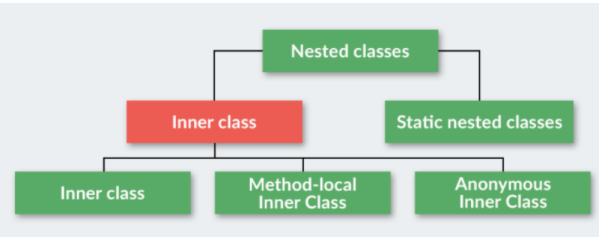

### Что такое статический класс (Static Nested class)?

Статический класс это вложенный класс, который **может обращаться только к статическим полям внешнего класса**, в том числе и приватным.
Доступ к нестатическим полям внешнего класса может быть осуществлен только через ссылку на экземпляр внешнего объекта.
Для инициализации внутреннего статического класса нет нужды в инициализации родителя. Но в случае обычного внутреннего класса такой номер не пройдет.
Если связь между объектом внутреннего класса и объектом внешнего класса не нужна, можно сделать внутренний класс статическим (`static`).

В статическом классе можно инкапсулировать всю служебную информацию о сущности. К примеру есть класс самолет. Для него можно сделать статический класс чертеж.
`Boeing737.Drawing drawing = new Boeing737.Drawing();`

### Внутренние классы (Member Inner class)

Внутренние классы — это не статические классы для выделения в программе некой сущности, которая неразрывно связана с другой сущностью.
Руль, сиденье, педали — это составные части велосипеда. Отдельно от велосипеда они не имеют смысла.
Если бы класс руль был не внутренним, тогда в системе мог бы просто появиться объект руль, а это не имеет никакого смысла.
Объект **внутреннего класса не может существовать без объекта «внешнего» класса**.

У объекта внутреннего класса есть доступ ко всем переменным и методам «внешнего» класса. Для внутренних классов доступны все элементы внешнего класса.

Объект внутреннего класса нельзя создать в статическом методе «внешнего» класса (т.к. нам обязательно нужен объект внешнего класса).
Внутренний класс не может содержать статические переменные и методы.

### Анонимные классы (Anonymous Inner class)

Анонимные — подвид внутренних классов. Это полноценный внутренний класс.
В документации Oracle приведена хорошая рекомендация: **«Применяйте анонимные классы, если вам нужен локальный класс для одноразового использования»**.
Есть у них кое-что общее и с локальными классами: они видны только внутри того метода, в котором определены.

- Анонимный класс имеет доступ к полям внешнего класса, в том числе к статическим и приватным.
- Анонимный класс не имеет доступ к локальным переменным области, в которой он определен, если они не финальные (`final`) или неизменяемые (`effectively final`).
- Как и у других внутренних классов, объявление переменной с именем, которое уже занято, затеняет предыдущее объявление.
- Также анонимный класс не может содержать статические переменные и методы.
- Конструктора в анонимном классе быть не может

### Полезные ссылки

[Вложенные внутренние классы](https://javarush.ru/groups/posts/2181-vlozhennihe-vnutrennie-klassih)

[Анонимные классы](https://javarush.ru/groups/posts/2193-anonimnihe-klassih)

## Profilers (Профилировщики)

Иногда написать код, который просто запускается, недостаточно. Возможно, нам захочется узнать, что происходит внутри, например, как распределяется память,
последствия использования одного подхода к написанию кода над другим, последствия одновременного выполнения, области для повышения производительности и т.д.
Мы можем использовать для этого профилировщики.

Профилировщик Java - это инструмент, который отслеживает конструкции и операции байт-кода Java на уровне JVM. Эти конструкции кода и операции включают создание
объекта, итеративное выполнение (включая рекурсивные вызовы), выполнение методов, выполнение потоков и сборку мусора.

## JProfiler

`JProfiler` - лучший выбор для многих разработчиков. Благодаря интуитивно понятному пользовательскому интерфейсу `JProfiler` предоставляет интерфейсы для
просмотра производительности системы, использования памяти, потенциальных утечек памяти и профилирования потоков.

Обладая этой информацией, мы можем легко узнать, что нам нужно оптимизировать, исключить или изменить в базовой системе.

Вот как выглядит интерфейс `JProfiler`:


Как и большинство профилировщиков, мы можем использовать этот инструмент как для локальных, так и для удаленных приложений. Это означает, что можно
профилировать приложения Java, работающие на удаленных машинах, без необходимости устанавливать на них что-либо.

`JProfiler` также обеспечивает расширенное профилирование для баз данных `SQL` и `NoSQL`. Он обеспечивает специальную поддержку для профилирования баз данных
`JDBC, JPA / Hibernate, MongoDB, Casandra и HBase`.

На приведенном ниже снимке экрана показан интерфейс проверки `JDBC` со списком текущих подключений:

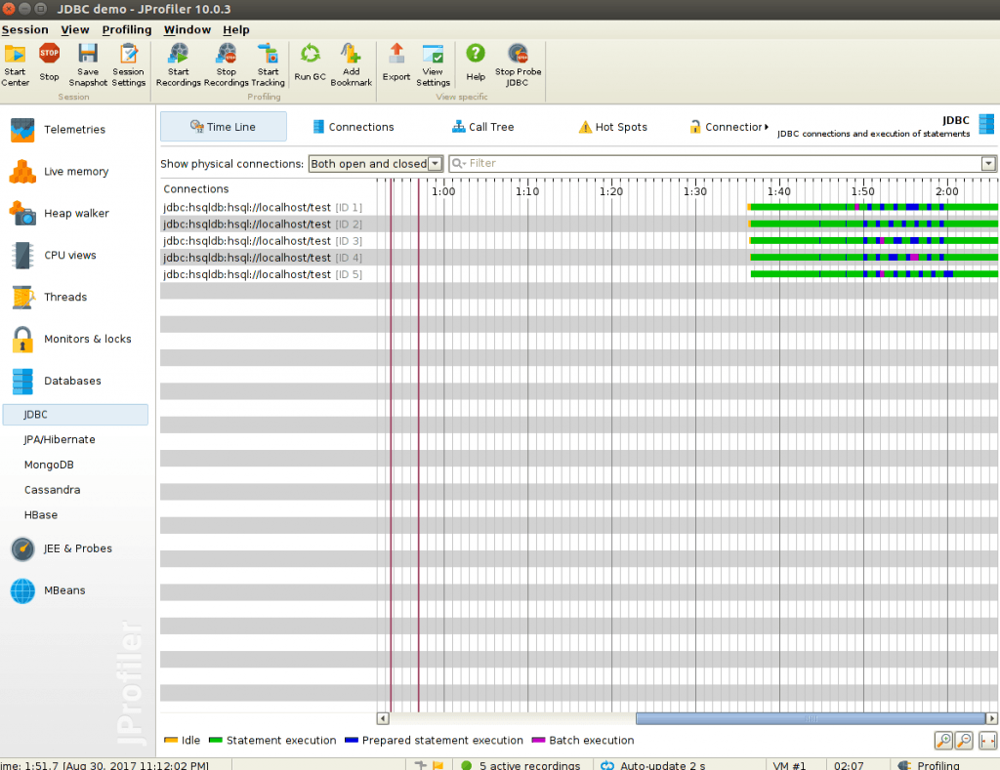

Если мы заинтересованы в изучении дерева вызовов взаимодействий с нашей базой данных и видим соединения, которые могут являться утечками, `JProfiler` прекрасно
справится с этим.

`Live Memory` - это одна из функций `JProfiler`, которая позволяет нам видеть текущее использование памяти нашим приложением. Мы можем просмотреть
использование памяти для объявлений и экземпляров объектов или для всего дерева вызовов.

В случае дерева вызовов распределения мы можем выбрать просмотр дерева вызовов живых объектов, объектов со сборкой мусора или и того, и другого.
Мы также можем решить, должно ли это дерево распределения быть для определенного класса или пакета или для всех классов.

На приведенном ниже экране показано использование оперативной памяти всеми объектами с количеством экземпляров:

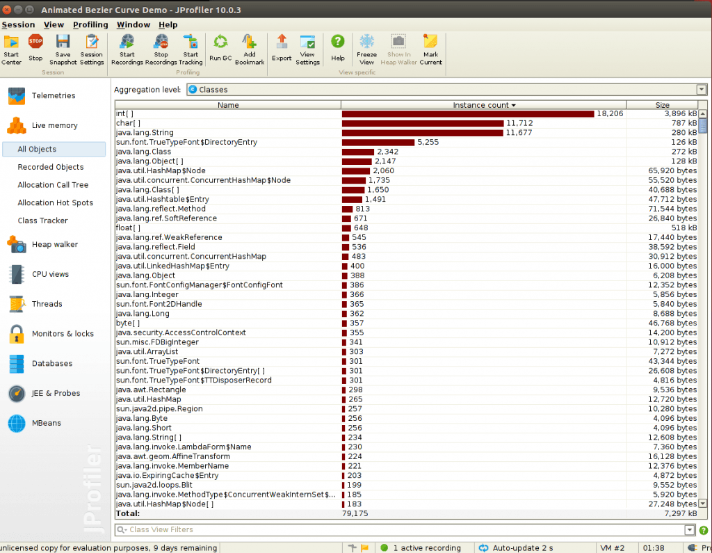

`JProfiler` поддерживает интеграцию с популярными `IDE`, такими как Eclipse, NetBeans и IntelliJ. Можно даже переходить от снимка к исходному коду!

### YourKit

`YourKit Java Profiler` работает на многих различных платформах и обеспечивает отдельные установки для каждой поддерживаемой операционной системы
(Windows, MacOS, Linux, Solaris, FreeBSD и т. Д.).

Как и `JProfiler`, `YourKit` имеет основные функции для визуализации потоков, сборок мусора, использования памяти и утечек памяти с поддержкой локального и
удаленного профилирования через туннелирование `ssh`.

Вот краткий обзор результатов профилирования памяти серверного приложения `Tomcat`:


`YourKit` также пригодится в тех случаях, когда мы хотим профилировать генерируемые исключения. Мы можем легко узнать, какие типы исключений были выданы и
сколько раз возникло каждое исключение.

`YourKit` имеет интересную функцию профилирования ЦП, которая позволяет целенаправленно профилировать определенные области нашего кода, такие как методы или
поддеревья в потоках. Это очень мощный инструмент, позволяющий выполнять условное профилирование с помощью функции «что, если».

На рисунке показан пример интерфейса профилирования потоков:


Мы также можем профилировать вызовы баз данных `SQL` и `NoSQL` с помощью `YourKit`. Он даже обеспечивает представление фактических выполненных запросов.

Хотя это не является техническим соображением, модель разрешающего лицензирования `YourKit` делает его хорошим выбором для многопользовательских или
распределенных групп.

### Java VisualVM

`Java VisualVM` - это упрощенный, но надежный инструмент профилирования для приложений Java. По умолчанию этот инструмент входит в комплект `Java Development
Kit (JDK)`. Его работа зависит от других автономных инструментов, предоставляемых в `JDK`, таких как `JConsole, jstat, jstack, jinfo и jmap`.

Ниже мы можем увидеть простой обзорный интерфейс текущего сеанса профилирования с использованием `Java VisualVM`:


Одним из интересных преимуществ `Java VisualVM` является то, что мы можем расширить его для разработки новых функций в виде плагинов.
Затем мы можем добавить эти плагины во встроенный центр обновлений `Java VisualVM`.

`Java VisualVM` поддерживает локальное и удаленное профилирование, а также профилирование памяти и ЦП. Для подключения к удаленным приложениям требуется
предоставить учетные данные (имя хоста / IP-адрес и пароль, если необходимо), но не поддерживает туннелирование `ssh`. Мы также можем включить профилирование
в реальном времени с мгновенными обновлениями (обычно каждые 2 секунды).

Ниже мы можем увидеть внешний вид памяти приложения Java, профилированного с помощью `Java VisualVM`:


### JConsole

Когда приложение работает медленно, большинство разработчиков впадает в панику, и тому есть веская причина. Поиск причин узких мест в `Java`-приложениях всегда
было головной болью ― как потому, что виртуальная машина `Java` имеет свойства "черного ящика", так и потому, что на платформе `Java` традиционно недоставало
инструментов профилирования.

Однако с появлением `JConsole` в `Java 5` все изменилось. `JConsole` – это встроенный профайлер производительности `Java`, который работает из командной строки и в
`GUI`-оболочке. Он не идеален, но служит более чем достаточной первой линией обороны, когда босс указывает вам на проблему производительности — и это гораздо
лучше, чем консультироваться у `Google`.

##### JDK поставляется с профайлером

Многие Java-программисты не знают, что, начиная с `Java 5`, в JDK включен инструмент профилирования. `JConsole` (или, в более поздних версиях платформы `Java`,
`VisualVM`) — это встроенный профайлер, запустить который так же легко, как компилятор `Java`. Достаточно вызвать `jconsole` из командной строки при наличии `JDK`
в переменной `PATH`. В `GUI`-оболочке перейдите в каталог установки `JDK`, откройте папку `bin` и дважды щелкните на `jconsole`.

Когда профайлер появится (время зависит от версии `Java` и количества других `Java`-программ, работающих в данный момент), откроется диалоговое окно с запросом
`URL-адреса` процесса, к которому следует подключиться, или списком локальных процессов `Java` — иногда содержащим сам процесс `JConsole`.

##### JConsole или VisualVM?

В `Java 5` Java-процессы по умолчанию не настроены на профилирование. При запуске аргумент командной строки `-Dcom.sun.management.jmxremote` указывает ВМ Java 5,
что нужно открыть соединения, чтобы профайлер мог их найти.

Профайлеры вносят свои собственные издержки, так что полезно потратить несколько минут на то, чтобы оценить их. Простейший способ обнаружить издержки `JConsole` -
сначала запустить приложение отдельно, а затем под профайлером, и измерить разницу в производительности. (Приложение не должно быть слишком большим или слишком
маленьким, мой любимый пример - `SwingSet2`, который поставляется с `JDK`). Я сначала попробовал запустить `SwingSet2` с параметром `-verbose:gc`, чтобы увидеть
циклы сбора мусора, а затем запустил то же приложение с подключенным к нему профайлером `JConsole`. С `JConsole` наблюдалась регулярная последовательность циклов
`GC`, которой в противном случае не было. Это издержки производительности профайлера.

##### Дистанционное подключение к процессам

Профайлеры `Web`-приложений предполагают связь через сокет, поэтому достаточно небольшой настройки, чтобы `JConsole` (или любой профайлер на основе `JVMTI`)
контролировал/профилировал удаленные приложения.

Например, если `Tomcat` работает на компьютере с именем `webserver`, и `JMX` на этой `JVM` включен и прослушивает порт `9004`, то чтобы подключить к нему
`JConsole` (или любой другой `JMX`-клиент), нужно указать `URL-адрес JMX` `service:jmx:rmi:///jndi/rmi://webserver:9004/jmxrmi`.

По сути, все, что требуется для профилирования сервера приложений, работающего в удаленном центре обработки данных, — это `URL-адрес JMX`.

##### Отслеживание статистики

В `JConsole` есть несколько вкладок, полезных для сбора статистических данных, в том числе:

- `Memory`: для наблюдения за работой различных куч в сборщике мусора `JVM`;
- `Threads`: для изучения текущей работы потоков в целевой `JVM`;
- `Classes`: для наблюдения за общим количеством загруженных классов ВМ.

Эти вкладки (и соответствующие графики) основаны на объектах `JMX`, которые каждая ВМ Java 5 и выше регистрирует в `JMX`-сервере, встроенном в `JVM`. Полный список
модулей в составе данной `JVM` приведен на вкладке `MBeans` вместе с некоторыми метаданными и ограниченным пользовательским интерфейсом для просмотра этих данных и
выполнения операций.

##### Использование статистики

Допустим, что процесс `Tomcat` "тормозит" из-за ошибок типа `OutOfMemoryError`. Чтобы узнать, что происходит, откройте `JConsole`, щелкните на вкладке `Classes` и
следите за количеством классов. Если их число неуклонно возрастает, можно предположить, что где-то в сервере приложений или вашем коде есть утечка `ClassLoader`, и
в скором времени пространство `PermGen` будет исчерпано. Если требуется дальнейшее подтверждение проблемы, проверьте вкладку `Memory`.

##### Создание дампа кучи для автономного анализа

В производственной среде часто все происходит очень быстро, и нет времени на то, чтобы поработать над приложением с профайлером. Вместо этого можно сделать снимок
текущего состояния всего содержимого среды `Java` и сохранить его для последующего анализа. Это можно сделать в `JConsole`, а еще лучше ― в `VisualVM`.

Начните с перехода на вкладку `MBeans`, где нужно раскрыть узел `com.sun.management`, а затем `HotSpotDiagnostic`. Выберите `Operations`, и вы увидите кнопку
`dumpHeap` на правой панели. Если в первом поле ввода (`String`) указать `dumpHeap` имя файла для дампа, он сделает снимок текущего состояния всей кучи `JVM` и
сохранит его в этом файле.

Позднее можно использовать различные коммерческие профайлеры для анализа файла или `VisualVM` ― для анализа снимка.

##### JConsole ― не предел мечтаний

Профайлер `JConsole` хорош, но есть инструменты получше. Некоторые содержат аналитические дополнения или отличаются удобным пользовательским интерфейсом, другие по
умолчанию отслеживают больше данных, чем `JConsole`.

В `JConsole` хорошо то, что вся программа написана на «старом добром языке `Java`»: такую утилиту мог бы написать любой `Java`-программист. В `JDK` даже входит
пример того, как настроить `JConsole`, создав новый плагин для него. В `VisualVM`, построенном поверх `NetBeans`, концепция плагинов идет гораздо дальше.

Если `JConsole` (а также `VisualVM` или любой другой инструмент) ― совсем не то, что вам нужно, или отслеживает не то, что вы ищете, или не так, как вам хочется,
то можно попробовать написать свой собственный.

На самом деле достаточно простого инструмента на основе командной строки, подключенного через `JMX`, который позволяет точно отслеживать интересующие вас данные,
именно так, как вам нужно.

### Полезные ссылки

[Гид по профилировщикам - Baeldung](https://www.baeldung.com/java-profilers)

[Пять секретов... контроля производительности Java, часть 1 - ibm.com](https://www.ibm.com/developerworks/ru/library/j-5things7/index.html)

## Интересные вопросы

### Какие преобразования называются нисходящими и восходящими?

Преобразование от потомка к предку называется восходящим, от предка к потомку — нисходящим.
Нисходящее преобразование должно указываться явно с помощью указания нового типа в скобках.

### Зачем нужны и какие бывают блоки инициализации?

Инициализируют поля до того, как будет вызван конструктор. Бывают статические и нестатические блоки инициализации.
Выполняются в порядке объявления. Могут быть созданы в анонимных классах.
Первыми выполняются статические блоки инициализации.
Сначала выполняются блоки родительского класса, затем его конструктор.
Затем в том же порядке для классов наследников.

### Можно ли перегрузить static метод?

Перегрузить можно

### Можно ли переопределить static метод?

Нет, но при этом не будет никакой ошибки. Статический метод можно **"скрыть"**.
Переопределение метода происходит динамически (во время выполнения), это означает, что определение того,
какая версия метода будет использоваться происходит во время выполнения в соответствии с объектом,
используемым для вызова, в то время как статические методы ищутся статически (во время компиляции).

```java
class Display {
    public static void hello() {
        System.out.println("Hello");
    }
}

class DisplayMessage extends Display {
    public static void hello() {
        System.out.println("Hello from everyone");    
    }
}

public class App {
    public static void main(String[] args){
        Display.hello();        // Hello
        DisplayMessage.hello(); // Hello from everyone
        
        Display d = new Display();
        d.hello();              // Hello
        d = new DisplayMessage();
        d.hello();              // Hello 
        DisplayMessage dm = new DisplayMessage();
        dm.hello();             // Hello from everyone
    }
}
```

Согласно правилам переопределения методов, вызов метода разрешается во время выполнения по типу object.
Таким образом, в нашем примере выше d.hello(), во втором вызове, должен вызывать метод hello() класса DisplayMessage,
поскольку ссылочная переменная класса Display ссылается на объект DisplayMessage, но вызывает hello()
самого класса Display. Это происходит потому, что выполнение статического метода разрешается во время компиляции.

Таким образом, если статический метод у производного класса имеет ту же сигнатуру,
что и статический метод базового класса, это будет называться сокрытием метода, а не переопределением метода.

### Какие модификаторы по умолчанию имеют поля и методы интерфейсов?

Интерфейс может содержать поля, но они автоматически являются статическими (static) и неизменными (final) - константами.
Все методы и переменные неявно объявляются как public.

### default методы в интерфейсе

С 8 версии Java можно создать default & static методы в интерфейсе.

Дефолтные методы, в отличие от обычных, объявлены с ключевым словом default в начале сигнатуры метода и
обеспечивают реализацию.
Они позволяют нам добавлять новые методы в интерфейс, которые автоматически доступны в реализациях.

```java

public interface Vehicle {

    String getBrand();

    String speedUp();
    
    String slowDown();
    
    default String turnAlarmOn() {
        return "Turning the vehicle alarm on.";
    }
    
    default String turnAlarmOff() {
        return "Turning the vehicle alarm off.";
    }

}

public class Car implements Vehicle {
 
    private String brand;
    
    // constructors/getters
    
    @Override
    public String speedUp() {
        return "The car is speeding up.";
    }
    
    @Override
    public String slowDown() {
        return "The car is slowing down.";
    }

}

class App {
    public static void main(String[] args) { 
        Vehicle car = new Car("BMW");
        System.out.println(car.getBrand());
        System.out.println(car.speedUp());
        System.out.println(car.slowDown());
        System.out.println(car.turnAlarmOn());
        System.out.println(car.turnAlarmOff());
    }
}
```

Кроме того, они могут использоваться для предоставления дополнительных функций существующему абстрактному методу.

```java
public interface Vehicle {
    
    // additional interface methods 
    
    double getSpeed();
    
    default double getSpeedInKMH(double speed) {
       // conversion      
    }
}
```

Важно знать, что происходит, когда класс реализует несколько интерфейсов, определяющих одни и те же методы по умолчанию.

```java
public interface Alarm {
 
    default String turnAlarmOn() {
        return "Turning the alarm on.";
    }
    
    default String turnAlarmOff() {
        return "Turning the alarm off.";
    }
}

public class Car implements Vehicle, Alarm {
    // ...
}
```

В этом случае код просто не будет компилироваться, так как возникает конфликт, вызванный множественным наследованием
интерфейсов (также известный как проблема Diamond).
Класс Car унаследует оба набора методов по умолчанию. Какие тогда вызывать?

Чтобы решить эту двусмысленность, мы должны явно предоставить реализацию для методов:

```java

public class Car implements Vehicle, Alarm {
    @Override
    public String turnAlarmOn() {
        // custom implementation
        String alarm = "Custom alarm"; 
        // or call one of default implementations:
        alarm = Vehicle.super.turnAlarmOn();
        alarm = Alarm.super.turnAlarmOn();
        // or combine both implementations:
        alarm = Vehicle.super.turnAlarmOn() + Alarm.super.turnAlarmOn();
        return alarm;
    }
     
    @Override
    public String turnAlarmOff() {
        return Vehicle.super.turnAlarmOff();
    }
}
```

[Static and Default Methods in Interfaces in Java - Baeldung](https://www.baeldung.com/java-static-default-methods)

### Static методы в интерфейсе

Поскольку статические методы не принадлежат конкретному объекту, они не являются частью API классов, реализующих
интерфейс, и их необходимо вызывать с использованием имени интерфейса, предшествующего имени метода.

```java
public interface Vehicle {
    
    // regular / default interface methods
    
    static int getHorsePower(int rpm, int torque) {
        return (rpm * torque) / 5252;
    }
}

class App {
    public static void main(String[] args){
        int power = Vehicle.getHorsePower(2500, 480);
    }
}
```

Определение статического метода в интерфейсе идентично его определению в классе.
Более того, статический метод может быть вызван в рамках других статических методов и методов по умолчанию.

Идея методов статического интерфейса состоит в том, чтобы предоставить простой механизм, который позволяет нам
повысить степень согласованности дизайна путем объединения общих методов в одном месте без необходимости создания объекта.

Практически то же самое можно сделать с абстрактными классами. Основное отличие заключается в том,
что абстрактные классы могут иметь конструкторы, состояние и поведение.

### Equals & hashCode

Эквивалентным называется отношение, которое является симметричным, транзитивным и рефлексивным.
- **Рефлексивность**: для любого ненулевого x, x.equals(x) вернет true;
- **Транзитивность**: для любого ненулевого x, y и z, если x.equals(y) и y.equals(z) вернет true,
  тогда и x.equals(z) вернет true;
- **Симметричность**: для любого ненулевого x и y, x.equals(y) должно вернуть true, тогда и только тогда,
  когда y.equals(x) вернет true.

Также для любого ненулевого x, x.equals(null) должно вернуть false

Если хеш-коды разные, то и входные объекты гарантированно разные.
Если хеш-коды равны, то входные объекты не всегда равны.

Ситуация, когда у разных объектов одинаковые хеш-коды называется — **коллизией**. Вероятность возникновения коллизии
зависит от используемого алгоритма генерации хеш-кода.
**Хеширование** - преобразование входного массива данных произвольной длины в выходную битовую строку фиксированной длины.

Общий совет: выбирать поля, которые с большой долью вероятности будут различаться.

**Порядок объявления**:
1. Проверка ссылок объектов
2. Проверка на null / проверка instanceof
3. Сравнить super.equals() если нужно
4. Привести объект к типу
5. Сравнить поля

**Распространенные ошибки**:
1. Часто метод перегружают, вместо переопределения. В Object метод определен как equals(Object o),
   по ошибке делают так equals(Person p).
2. Не проверяют переменные на null
3. Не переопределяют hashcode

### Интерфейсы маркеры

Иногда полезно определить пустой интерфейс. Класс может реализовать этот интерфейс, указав его в секции implements.
При этом нет необходимости реализовывать методы. Любой экземпляр класса становится экземпляром интерфейса.
С помощью оператора instanceof Java код может проверить, является ли объект экземпляром интерфейса.
Таким образом, эта техника полезна для предоставления дополнительной информации об объекте.

Интерфейс `java.lang.Cloneable` является примером интерфейса-маркера (marker interface).
Он не определяет методов, но идентифицирует класс, внутреннее состояние которого можно клонировать методом `clone()`
класса Object.

Пусть дан произвольный объект. Наличие у него работающего метода clone() можно определить с помощью следующего кода:

```java
class App {
    public static void main(String[] args){
        int[] aint = new int[10];
        int[] bint;
        if (aint instanceof Cloneable) bint = aint.clone();
        else bint = null;
    }
}
```

Еще одним примером интерфейса-маркера является интерфейс `java.io.Serializable`.

### Клонирование объектов

Чтобы объект можно было клонировать, он должен реализовать интерфейс-маркер **Cloneable**.
Использование этого интерфейса влияет на поведение метода `clone()` класс Object.
Таким образом `myObj.clone()` создаст нам клон нашего объекта, но этот клон будет поверхностный.
Что значит **поверхностное клонирование**? Это значит что клонируется только примитивные поля класса, ссылочные поля не клонируются!

Чтобы произвести **глубокое клонирование**, необходимо в клонируемом классе **переопределить метод clone()**,
и в нем произвести клонирование изменяемых полей объекта.
Если класс имеет только члены примитивных типов, то будет создана совершенно новая копия объекта
и возвращена ссылка на этот объект. Если класс содержит не только члены примитивных типов, а и любого другого типа
класса, тогда копируются ссылки на объекты этих классов. Следовательно, оба объекта будут иметь одинаковые ссылки.

**Глубокое клонирование** требует выполнения следующих правил:
- Нет необходимости копировать отдельно примитивные данные;
- Все классы-члены в оригинальном классе должны поддерживать клонирование. Для каждого члена класса должен
  вызываться super.clone() при переопределении метода clone().
- Если какой-либо член класса не поддерживает клонирование, то в методе клонирования необходимо создать новый
  экземпляр этого класса и скопировать каждый его член со всеми атрибутами в новый объект класса, по одному.

### Отличие абстрактного класса и интерфейса

Интерфейс описывает только поведение (методы) объекта, а вот состояний (полей) у него нет (кроме public static final),
в то время как у абстрактного класса они могут быть.

Абстрактный класс наследуется (extends), а интерфейс — реализуется (implements).
Мы можем наследовать только один класс, а реализовать интерфейсов — сколько угодно.
Интерфейс может наследовать (extends) другой интерфейс/интерфейсы.

Абстрактные классы используются, когда есть отношение "is-a", то есть класс-наследник расширяет базовый абстрактный
класс, а интерфейсы могут быть реализованы разными классами, вовсе не связанными друг с другом.

Абстрактный метод – это метод без тела.

### Можно ли применить final к конструктору?

Final метод не может быть переопределен какими-либо подклассами. Модификатор final предотвращает изменение метода в подклассе.
Основное намерение сделать метод final - не допустить изменения его содержимого посторонними лицами.

Другими словами, конструкторы не могут быть унаследованы в Java, поэтому нет необходимости писать final
перед конструкторами. Следовательно, java не позволяет использовать ключевое слово final перед конструктором.
Если вы попробуете, будет сгенерирована ошибка времени компиляции, как в следующем примере.

```java
public class Sample {
   public static void main(String args[]){
      int num;
      final public Sample(){
         num = 30;
      }
   }
}


Exception in thread "main" java.lang.Error: Unresolved compilation problems:
   Syntax error, insert "enum Identifier" to complete EnumHeaderName
   Syntax error, insert "EnumBody" to complete BlockStatement
   Syntax error, insert ";" to complete Statement
   at newJavaExamples.Sample.main(Sample.java:6)
```

### Что такое finalize?

Finalize метод называется финализатором (finalizer).

Финализаторы вызываются, когда JVM выясняет, что этот конкретный экземпляр должен быть обработан сборщиком мусора.
Такой финализатор может выполнять любые операции, в том числе возвращать объект к жизни.

Однако основная цель финализатора - освободить ресурсы, используемые объектами, до того, как они будут удалены из памяти.
Финализатор может работать как основной механизм для операций очистки.

Вызов `finalize()` не гарантируется, т.к. приложение может быть завершено до того, как будет запущена ещё одна сборка
мусора.

```java
public class Finalizable {
    private BufferedReader reader;
 
    public Finalizable() {
        InputStream input = this.getClass()
          .getClassLoader()
          .getResourceAsStream("file.txt");
        this.reader = new BufferedReader(new InputStreamReader(input));
    }
 
    public String readFirstLine() throws IOException {
        String firstLine = reader.readLine();
        return firstLine;
    }

     @Override
     public void finalize() {
         try {
             reader.close();
             System.out.println("Closed BufferedReader in the finalizer");
         } catch (IOException e) {
             // ...
         }
     }
}
```

Класс `Finalizable` cодержит поле reader, которое ссылается на закрываемый ресурс.
Когда объект создается из этого класса, он создает новый экземпляр BufferedReader, читающий из файла.

Такой экземпляр используется в методе readFirstLine для извлечения первой строки в данном файле.
Обратите внимание, что `reader` закрывается как раз в методе finalize в данном коде.

На самом деле время, в которое сборщик мусора вызывает финализаторы, зависит от реализации JVM и условий системы,
которые находятся вне нашего контроля.

Несколько причин, почему стоит **избегать использование финализаторов**:
- Мы не можем контролировать когда они будут вызваны. Тем самым у нас могут закончиться ресурсы еще до того,
  как вызовется финализатор.
- Финализаторы также влияют на переносимость программы. Поскольку алгоритм сборки мусора зависит от реализации JVM,
  программа может очень хорошо работать в одной системе, а в другой - по-разному.
- Еще одна важная проблема, связанная с финализаторами, - это стоимость производительности. В частности,
  JVM должна выполнять гораздо больше операций при создании и уничтожении объектов, содержащих непустой финализатор.
- Последняя проблема, о которой мы будем говорить, - это отсутствие обработки исключений во время финализации.
  Если финализатор генерирует исключение, процесс завершения отменяется, а исключение игнорируется,
  оставляя объект в поврежденном состоянии без какого-либо уведомления.

[Подробнее о финализаторах](https://www.baeldung.com/java-finalize)

### Как в Java передаются объекты?

**Java всегда передаёт объекты ПО ЗНАЧЕНИЮ**

Примитивы передаются по значению.

Когда вы передаете ссылку на объект в метод, вы передаете **копию ссылки**.
Клон пульта дистанционного управления. Объект все еще сидит в куче где был создан, ожидая кого-то, чтобы использовали
пульт. Объект не волнует сколько пультов "запрограммированы", чтобы контролировать его.
Это волнует только сборщика мусора и вас, программиста.

Передается всё то же значение, просто **значением является указатель на область памяти**.

[Передача параметров в Java](https://javarush.ru/groups/posts/857-peredacha-parametrov-v-java)

### Преобразование типов

При повышении типа byte>short; short>int; int>long; float>double; char>int информация не потеряется.

При сужении возможна потеря информации (см. пример выше byte = (byte) int).

### Жизненный цикл объектов Java

1. JVM выделяет необходимый объем памяти для создания объекта.
2. JVM создает на него ссылку, в нашем случае — cat, чтобы иметь возможность его отслеживать.
3. После этого происходит инициализация всех переменных, вызов конструктора и вот — наш свежий объект уже живет своей жизнью.
   Если говорить точно, объект является “живым” пока на него есть ссылки. Как только ссылок не остается — объект “умирает”.
   Ссылку при этом не обязательно обнулять. Можно перенаправить ее на другой объект.
4. После этого в работу вступает garbage collector.
   В момент, когда сборщик мусора добрался до объекта, перед самым его уничтожением, у объекта вызывается специальный
   метод — finalize(). Но вызывается он не всегда. JVM сама определяет, вызывать метод finalize() в каждом конкретном
   случае или нет. Не стоит полагаться на метод finalize() в случае с освобождением каких-то критически важных ресурсов.

### JRE, JVM, JDK

**JDK** - бесплатно распространяемый компанией Oracle комплект разработчика приложений на языке Java,
включающий в себя компилятор Java (javac), стандартные библиотеки классов Java, примеры, документацию,
различные утилиты и исполнительную систему Java (JRE).

**JRE** - минимальная реализация виртуальной машины, необходимая для исполнения Java-приложений, без компилятора
и других средств разработки. Состоит из виртуальной машины - Java Virtual Machine и библиотеки Java-классов.

**JVM** - виртуальная машина Java - основная часть исполняющей системы Java, так называемой Java Runtime Environment (JRE).
Виртуальная машина Java интерпретирует Байт-код Java, предварительно созданный из исходного текста Java-программы
компилятором Java (javac). JVM может также использоваться для выполнения программ, написанных на других ЯП.


```
                     JDK
                      |
        --------------|--------------
        |             |             |
        |             |             |
        |             |             |
       JRE          javac        library examples
        |                        docs
    ----|----                    utilities  
    |       |       
   JVM   library
```

### Модификаторы доступа

| Modifier   | Class | Package | Subclass | Global |
|------------|-------|---------|----------|--------|
| public     |   ✅   |    ✅    |    ✅    |   ✅   |
| protected  |   ✅   |    ✅    |    ✅    |   ❌   |
| default    |   ✅   |    ✅    |    ❌    |   ❌   |
| private    |   ✅   |    ❌    |    ❌    |   ❌   |

### String, StringBuffer, StringBuilder

String - immutable. Каждый раз при изменении строки создается новый объект.

StringBuffer - mutable, синхронизированный. StringBuffer является потокобезопасным. Два потока одновременно не могут вызвать методы StringBuffer.
Из-за этого он менее эффективен, чем StringBuilder.

StringBuilder - mutable, не синхронизированный. StringBuilder не является потокобезопасным, поэтому два потока могут одновременно вызывать методы StringBuilder. Он более эффективен.

### Пул строк

**Пул строк** — область для хранения всех строковых значений, которые ты создаешь в своей программе.
Каждый раз, когда ты пишешь `String s = “........”`, программа проверяет, есть ли строка с таким текстом в пуле строк.
Если есть — новая создана не будет. И новая ссылка будет указывать на тот же адрес в пуле строк, где эта строка хранится.

Оператор `new` при создании объекта принудительно выделяет для него новую область в памяти.
И строка, созданная с помощью new, не попадает в String Pool: она становится отдельным объектом, даже если ее текст полностью совпадает с такой же строкой
из String Pool’a.

### Что делает метод String.intern()?

Метод `String.intern()` напрямую работает со String Pool’ом. Его стоит использовать в том случае, если приходится сравнивать много строк.

Когда метод `intern()` вызван, если пул строк уже содержит строку, эквивалентную к нашему объекту, что подтверждается методом `equals(Object)`, тогда
возвращается ссылка на строку из пула. В противном случае объект строки добавляется в пул и ссылка на этот объект возвращается.

Этот метод всегда возвращает строку, которая имеет то же значение, что что и текущая строка, но гарантирует что это будет строка из пула уникальных строк.

Ниже приведен пример работы метода intern():

```java
public class StringPool {
    public static void main(String[] args) {
        String a = "string a";
        String b = new String("string a");
        String c = b.intern();

        System.out.println(a == b);
        System.out.println(b == c);
        System.out.println(a == c);
    }
}
Программа выведет следующее:
false
false
true
```

### Почему String immutable и final?

**Строковый пул** возможен только потому, что строка неизменна в Java, таким образом виртуальная машина сохраняет много места в памяти (heap space),
поскольку разные строковые переменные указывают на одну переменную в пуле. Если бы строка не была неизменной, тогда бы интернирование строк не было бы
возможным, потому что если какая-либо переменная изменит значение, это отразится также и на остальных переменных, ссылающихся на эту строку.

Если строка будет изменяемой, тогда это станет серьезной угрозой **безопасности** приложения. Например, имя пользователя базы данных и пароль
передаются строкой для получения соединения с базой данных и в программировании сокетов реквизиты хоста и порта передаются строкой.
Так как строка неизменяемая, её значение не может быть изменено, в противном случае любой хакер может изменить значение ссылки
и вызвать проблемы в безопасности приложения.

**Строки используются в Java classloader** и неизменность обеспечивает правильность загрузки класса при помощи Classloader.
К примеру, задумайтесь об экземпляре класса, когда вы пытаетесь загрузить java.sql.Connection класс, но значение ссылки изменено на myhacked.Connection класс,
который может осуществить нежелательные вещи с вашей базой данных.

Поскольку строка неизменная, её **hashcode кэшируется в момент создания** и нет необходимости рассчитывать его снова.
Это делает строку отличным кандидатом для ключа в Map и его обработка будет быстрее, чем других ключей HashMap.
Это причина, почему строка наиболее часто используемый объект, используемый в качестве ключа HashMap.

### Как сделать класс immutable?

Неизменяемый класс очень прост для понимания, он **имеет только одно состояние**. Неизменяемые классы являются потокобезопасными.
Это самое большое преимущество неизменяемого класса, потому что, - вам **не нужно применять синхронизацию** для неизменяемых объектов.
Также, неизменяемый класс может быть полезен при помещении объекта неизменяемого класса в HashMap или может использоваться для целей кэширования,
поскольку его значение не изменится. Неизменяемые объекты **по умолчанию являются потокобезопасными**.

**Шаги для создания неизменяемого класса**:
1. Финализируйте свой класс:
   Если вы финализируете свой класс - ни один класс не сможет его расширить, следовательно, не сможет переопределить методы этого класса.
2. Пометьте все переменные класса модификаторами доступа private и final:
   Если вы сделаете переменную экземпляра private - ни один внешний класс не сможет получить доступ к переменным экземпляра,
   и, если вы сделаете их final - вы не сможете их изменить.
3. Скажите «нет» методам-мутаторам:
   Не создавайте метод set для некоторых переменных класса, тогда не будет возможности явно изменить состояние переменных экземпляра.
4. Выполните клонирование изменяемых объектов при возврате из метода получения:
   Если вы вернете клон объекта из метода get, то вернется объект. При этом, ваш оригинальный объект останется без изменений.

### Какая разница между && и &?

& - побитово оценивает обе стороны операции.

&& - логически оценивает левую сторону операции. Если она true тогда оценит и правую сторону.

### Что такое ClassPath?

По существу classpath указывает компилятору или виртуальной машине где искать классы необходимые для сборки проекта или же его запуска.
Есть два основных способа установки classpath: в переменной окружения ОС CLASSPATH, и в аргументе командной строки -cp (синоним -classpath).
Второй способ предпочтительнее, потому что позволяет устанавливать разные значения для разных приложений. Значение по умолчанию – текущая директория.

[Подробное и отличное объяснение](https://coderoad.ru/2396493/Что-такое-classpath#2396759)

### Java 8 - что нового?

Date API, Stream API, Functional interfaces, default and static methods in interfaces, method reference, optional, lambda expressions

[Java 8 теория и примеры](https://vertex-academy.com/tutorials/ru/java-8-uchebnik/)

### Что будет если прибавить 1 к Integer.MAX_VALUE

Ответ - `Integer.MIN_VALUE`. Потому что целое число переполняется. Когда он переполняется, следующее значение - `Integer.MIN_VALUE`

### Как получилось, что 0,1 + 0,2 = 0,30000000000000004?

Дело в том, что `double` - это число `64` битов, и возможно точно определить только 2^64 разные числа. Поэтому, будут много чисел, без точной репрезентации в
`double`.

Более того, число `0.3 (и 0.1 и 0.2)` нельзя писать в двойчной системой счисления, будет бесконечно.

Самое близкое `double` от `0.1` - это `0.100000000000000005551115123126`

Самое близкое `double` от `0.2` - это `0.200000000000000011102230246252`

И вместе получится `0.300000000000000016653345369378`

Самое близкое `double` от этого: `0.300000000000000044408920985006`

Потом `System.out.println` покажет `0.30000000000000004`.

[Неточное значение у double - Stackoverflow](https://ru.stackoverflow.com/questions/436249/%D0%9D%D0%B5%D1%82%D0%BE%D1%87%D0%BD%D0%BE%D0%B5-%D0%B7%D0%BD%D0%B0%D1%87%D0%B5%D0%BD%D0%B8%D0%B5-%D1%83-double)

[Более подробное разъяснение - medium](https://medium.com/better-programming/why-is-0-1-0-2-not-equal-to-0-3-in-most-programming-languages-99432310d476)

## References (Weak, Soft, Strong, Phantom)

### Strong references

**Strong reference** - это обычная ссылка на Java, которую вы используете каждый день. Например, код:

```java
Widget widget = new Widget();
```

создает новый `Widget()` и сохраняет сильную ссылку на него в буфере переменных. Важная часть сильных ссылок - та часть, которая делает их «сильными» -
это то, как они взаимодействуют со сборщиком мусора. В частности, если объект доступен через цепочку сильных ссылок (строго достижимый), сборщик мусора
не имеет права на его удалять. Поскольку вы не хотите, чтобы сборщик мусора уничтожал объекты, над которыми вы работаете, обычно это именно то, что вам нужно.

### When strong references are too strong

Приложение нередко использует классы, которые оно не может расширить. Класс может быть просто помечен как `final` или это может быть что-то более сложное,
например интерфейс, возвращаемый фабричным методом, поддерживаемый неизвестным количеством конкретных реализаций. Предположим, вам нужно использовать класс
`Widget`, и по какой-либо причине невозможно или практически невозможно расширить `Widget` для добавления новых функций.

Что происходит, когда вам нужно отслеживать дополнительную информацию об объекте? В этом случае предположим, что нам нужно отслеживать `serialNumber` каждого
`Widget`, но класс `Widget` на самом деле не имеет свойства `serialNumber` - и поскольку `Widget` не расширяем, мы не можем добавить его. Вообще нет проблем,
скажете вы. Мы можем использовать `HashMap`, в который положим пару `Widget - serialNumber`:

```java
serialNumberMap.put(widget, widgetSerialNumber);
```

На первый взгляд это может выглядеть нормально, но сильная ссылка на `widget` почти наверняка вызовет проблемы. Мы должны знать (со 100% уверенностью),
когда `serialNumber` конкретного виджета больше не нужен, чтобы мы могли удалить его запись из мапы. В противном случае у нас будет утечка памяти
(если мы не удалим виджеты, когда должны), или мы обнаружим, что у нас отсутствуют серийные номера (если мы удалим виджеты, которые все еще используем).
Если эти проблемы кажутся вам знакомыми: это именно те проблемы, с которыми сталкиваются пользователи языков, не использующих сборщик мусора, при попытке
управлять памятью, и нам не следует беспокоиться об этом в более цивилизованном языке, таком как Java.

Другая распространенная проблема с сильными ссылками - это кеширование, особенно с очень большими структурами, такими как изображения. Предположим, у вас есть
приложение, которое должно работать с изображениями, предоставляемыми пользователем, например, инструмент дизайна веб-сайтов. Естественно, вы хотите кэшировать
эти изображения, потому что загрузка их с диска очень дорога, и вы хотите избежать возможности одновременного размещения двух копий (потенциально гигантского)
изображения в памяти.

Поскольку предполагается, что кеш изображений не позволяет нам перезагружать изображения, когда в этом нет крайней необходимости, вы быстро поймете, что кеш
всегда должен содержать ссылку на любое изображение, которое уже находится в памяти. Однако с обычными сильными ссылками эта ссылка сама по себе заставит
изображение оставаться в памяти, что требует от вас (как и выше) каким-то образом определить, когда изображение больше не требуется в памяти, и удалить его
из кеша, чтобы оно стало доступным для сборки мусора. И снова вы вынуждены дублировать поведение сборщика мусора и вручную определять, должен ли объект
находиться в памяти.

### WeakReference

Проще говоря, **weak reference** - это ссылка, которая недостаточно сильна, чтобы заставить объект оставаться в памяти. Слабые ссылки позволяют использовать
способность сборщика мусора определять доступность за вас, поэтому вам не нужно делать это самостоятельно. Вы создаете слабую ссылку следующим образом:

```java
WeakReference weakWidget = new WeakReference(widget);
```

а затем в другом месте кода вы можете использовать `weakWidget.get()` для получения фактического объекта `Widget`. Конечно, слабая ссылка недостаточно сильна,
чтобы предотвратить сборку мусора, поэтому вы можете обнаружить (если нет сильных ссылок на виджет), что `weakWidget.get()` внезапно начинает возвращать
`null`.

Чтобы решить проблему с "серийным номером виджета", описанную выше, проще всего использовать встроенный класс `WeakHashMap`. `WeakHashMap` работает точно так
же, как `HashMap`, за исключением того, что **для ключей (а не значений!)** используются слабые ссылки. Если ключ `WeakHashMap` становится мусором, его запись
удаляется автоматически. Это позволяет избежать описанных мною ловушек и не требует никаких изменений, кроме переключения с `HashMap` на `WeakHashMap`.

##### Где можно использовать WeakReference

Как указано в документации Java, слабые ссылки чаще всего используются для реализации канонического маппинга. Маппинг называется каноническим, если он
содержит только один экземпляр определенного значения. Вместо того, чтобы создавать новый объект, он ищет существующий в сопоставлении и использует его.

Конечно, наиболее известным применением этих ссылок является класс `WeakHashMap`. Это реализация интерфейса `Map`, где каждый ключ хранится как слабая ссылка
на данный ключ. Когда сборщик мусора удаляет ключ, объект, связанный с этим ключом, также удаляется.

Еще одна область, где они могут быть использованы, - это проблема с задержанным слушателем -
[Lapsed Listener Problem](http://ilkinulas.github.io/development/general/2016/04/17/observer-pattern.html).

##### Работа с WeakReference

Слабые ссылки представлены классом `java.lang.ref.WeakReference`. Мы можем инициализировать его, передав референт в качестве параметра.
При желании мы также можем передать `java.lang.ref.ReferenceQueue`:

```java
Object referent = new Object();
ReferenceQueue<Object> referenceQueue = new ReferenceQueue<>();
 
WeakReference weakReference1 = new WeakReference<>(referent);
WeakReference weakReference2 = new WeakReference<>(referent, referenceQueue);
```

Референт ссылки может быть получен методом `get()` и удален вручную с помощью метода `clear()`:

```java
Object referent2 = weakReference1.get();
weakReference1.clear();
```

Шаблон для безопасной работы с такими ссылками такой же, как и с мягкими ссылками:

```java
Object referent3 = weakReference2.get();
if (referent3 != null) {
    // GC hasn't removed the instance yet
} else {
    // GC has cleared the instance
}
```

### Reference queues

Как только `WeakReference` начинает возвращать значение `null`, объект, на который он указывает, становится мусором. Обычно это означает, что требуется
какая-то очистка. `WeakHashMap`, например, должен удалить такие несуществующие записи, чтобы не удерживать постоянно увеличивающееся количество мертвых
`WeakReferences`.

Класс `ReferenceQueue` позволяет легко отслеживать мертвые ссылки. Если вы передадите `ReferenceQueue` в конструктор `WeakReference`, объект ссылки будет
автоматически вставлен в очередь ссылок, когда объект, на который он указывает, становится мусором. Затем вы можете через некоторый регулярный интервал
обрабатывать `ReferenceQueue` и выполнять любую очистку, необходимую для мертвых ссылок.

### Different degrees of weakness

До этого момента мы говорили только о `WeakReference` и `strong reference`, но на самом деле существует четыре различных степени силы ссылок: `Strong`, `Soft`,
`Weak` и `Phantom`, в порядке от самой сильной к самой слабой. Мы уже обсудили `Strong` и `Weak` ссылки, поэтому давайте взглянем на два других типа.

### SoftReference

`SoftReference` в точности похожа на слабую ссылку, за исключением того, что она не так сильно стремится выбросить объект, на который она ссылается.
Объект, который является только слабо достижимым (самые сильные ссылки на него - `WeakReferences`), будет отброшен в следующем цикле сборки мусора,
но объект, который легко достижим (`SoftReference`), обычно остается какое-то время живым.

`SoftReferences` не обязаны вести себя иначе, чем `WeakReferences`, но на практике мягкодоступные объекты обычно сохраняются до тех пор, пока имеется
достаточный объем памяти. Это делает их отличной основой для кеша, такого как кеш изображений, описанный выше, поскольку вы можете позволить сборщику мусора
отвечать за то, что бы объекты были достижимы при нормальных условиях работы (когда достаточно памяти) и за то когда их удалять (если памяти стало мало).

Когда вызывается сборщик мусора, он начинает перебирать все элементы в куче. GC хранит объекты reference в специальной очереди. После проверки всех объектов
в куче GC определяет, какие экземпляры следует удалить, удаляя объекты из указанной выше очереди. Эти правила различаются от одной реализации JVM к другой,
но в документации указано следующее:

>все `SoftReference` гарантированно очищаются до того, как JVM выдаст `OutOfMemoryError`.

Тем не менее, не дается никаких гарантий относительно времени очистки `SoftReference` или порядка очистки набора таких ссылок на различные объекты.

Мягко достижимые объекты будут оставаться активными в течение некоторого времени после последнего обращения к ним. Значение по умолчанию - одна секунда жизни
на один свободный мегабайт в куче. Это значение можно изменить с помощью флага `-XX: SoftRefLRUPolicyMSPerMB`. Например, чтобы изменить значение на 2,5 секунды
(2500 миллисекунд), мы можем использовать:

```java
-XX:SoftRefLRUPolicyMSPerMB=2500
```

По сравнению с `WeakReference`, `SoftReference` могут иметь более длительный срок службы, поскольку они продолжают существовать до тех пор, пока не
потребуется дополнительная память. Следовательно, это лучший выбор, если нам нужно удерживать объекты в памяти как можно дольше.

##### Работа с SoftReference

У нас есть два варианта его инициализации. Первый способ - передать только референт:

```java
StringBuilder builder = new StringBuilder();
SoftReference<StringBuilder> reference1 = new SoftReference<>(builder);
```

Второй вариант подразумевает передачу ссылки на `java.lang.ref.ReferenceQueue`, а также ссылки на референт. Очереди ссылок предназначены для информирования
нас о действиях, выполняемых сборщиком мусора. Он добавляет объект ссылки в очередь ссылок, когда решает удалить референт этой ссылки. Вот как инициализировать
`SoftReference` с помощью `ReferenceQueue`:

```java
ReferenceQueue<StringBuilder> referenceQueue = new ReferenceQueue<>();
SoftReference<StringBuilder> reference2 = new SoftReference<>(builder, referenceQueue);
```

`java.lang.ref.Reference` содержит методы `get()` и `clear()` для получения и сброса референта соответственно:

```java
StringBuilder builder1 = reference2.get();
reference2.clear();
StringBuilder builder2 = reference2.get(); // null
```

Каждый раз, когда мы работаем с такими ссылками, нам нужно убедиться, что референт, возвращаемый `get()`, существует:

```java
StringBuilder builder3 = reference2.get();
if (builder3 != null) {
    // GC hasn't removed the instance yet
} else {
    // GC has cleared the instance
}
```

### PhantomReference

`PhantomReference` сильно отличается от `SoftReference` или `WeakReference`. Его захват объекта настолько слаб, что вы даже не можете получить объект - его
метод `get()` всегда возвращает `null`. Единственное использование такой ссылки - отслеживать, когда она помещается в очередь в `ReferenceQueue`, поскольку в
этот момент вы знаете, что объект, на который она указывает, мертв. Но чем это отличается от `WeakReference`?

Разница в том, когда именно происходит постановка в очередь. `WeakReferences` ставятся в очередь, как только объект, на который они указывают, становится
труднодоступным. Это происходит до вызова `finalize()` или сборки мусора; теоретически объект может быть даже «воскрешен» неортодоксальным методом
`finalize()`, но `WeakReference` останется мертвым. `PhantomReferences` ставятся в очередь только тогда, когда **объект физически удаляется из памяти**,
то есть после выполнения метода `finalize()` его референта, а метод `get()` всегда возвращает значение `null` специально, чтобы вы не смогли «воскресить» почти
мертвый объект.

##### Когда использовать PhantomReferences?

Во-первых, они позволяют точно определить, когда объект был удален из памяти. Фактически, это единственный способ определить это. Обычно это не так полезно,
но может пригодиться в определенных очень специфических обстоятельствах, таких как манипулирование большими изображениями: если вы точно знаете,
что изображение должно быть собрано в мусор, вы можете подождать, пока это действительно произойдет, прежде чем пытаться загрузить следующее изображение,
и, следовательно, уменьшить вероятность возникновения пугающей ошибки `OutOfMemoryError.`

Во-вторых, `PhantomReferences` позволяет избежать фундаментальной проблемы с финализацией: методы `finalize()` могут «воскрешать» объекты, создавая на них
новые сильные ссылки. Проблема в том, что объект, который переопределяет `finalize()`, теперь должен быть определен как мусор по крайней мере в двух
отдельных циклах сборки мусора, чтобы его можно было удалить. Когда первый цикл определяет, что это мусор, на нем может быть вызван `finalize()`.
Из-за (небольшой, но, к сожалению, реальной) возможности того, что объект был «воскрешен» во время финализации, сборщик мусора должен запуститься
снова, прежде чем объект может быть фактически удален. А поскольку финализация могла произойти не вовремя, могло произойти произвольное количество циклов
сборки мусора, пока объект ожидал финализации. Это может означать серьезные задержки в фактической очистке объектов мусора, и поэтому вы можете получить
`OutOfMemoryErrors`, даже если большая часть кучи является мусором.

С `PhantomReference` такая ситуация невозможна - когда `PhantomReference` ставится в очередь, нет абсолютно никакого способа получить указатель на теперь
мертвый объект (что хорошо, потому что его больше нет в памяти). Поскольку `PhantomReference` не может использоваться для воскрешения объекта, объект можно
мгновенно очистить во время первого цикла сборки мусора, в котором он оказывается фантомно достижимым. Затем вы можете распоряжаться всеми необходимыми
ресурсами по своему усмотрению.

Возможно, метод `finalize()` вообще не должен был предоставляться. `PhantomReferences` определенно безопаснее и эффективнее в использовании, а устранение
`finalize()` сделало бы части виртуальной машины значительно проще. Хорошая новость в том, что по крайней мере у вас есть выбор.

##### Работа с PhantomReference

Теперь давайте реализуем второй вариант использования, чтобы на практике понять, как работают такие ссылки. Во-первых, нам нужен подкласс класса
`PhantomReference` для определения метода очистки ресурсов:

```java
public class LargeObjectFinalizer extends PhantomReference<Object> {
 
    public LargeObjectFinalizer(Object referent, ReferenceQueue<? super Object> q) {
        super(referent, q);
    }
 
    public void finalizeResources() {
        // free resources
        System.out.println("clearing ...");
    }
    
}
```

Теперь мы собираемся написать расширенную детальную финализацию:

```java
ReferenceQueue<Object> referenceQueue = new ReferenceQueue<>();
List<LargeObjectFinalizer> references = new ArrayList<>();
List<Object> largeObjects = new ArrayList<>();
 
for (int i = 0; i < 10; ++i) {
    Object largeObject = new Object();
    largeObjects.add(largeObject);
    references.add(new LargeObjectFinalizer(largeObject, referenceQueue));
}
 
largeObjects = null;
System.gc();
 
Reference<?> referenceFromQueue;
for (PhantomReference<Object> reference : references) {
    System.out.println(reference.isEnqueued());
}
 
while ((referenceFromQueue = referenceQueue.poll()) != null) {
    ((LargeObjectFinalizer)referenceFromQueue).finalizeResources();
    referenceFromQueue.clear();
}
```

Во-первых, мы инициализируем все необходимые объекты: `referenceQueue` - для отслеживания помещенных в очередь ссылок, `references` - для последующей очистки,
`largeObjects` - для имитации большой структуры данных.

Затем мы создаем эти объекты с помощью классов `Object` и `LargeObjectFinalizer`.

Перед тем, как вызвать сборщик мусора, мы вручную освобождаем большой кусок данных, обнуляем `largeObjects`.

Важно знать, что `System.gc()` не запускает сборку мусора сразу - это просто подсказка для JVM, чтобы запустить процесс.

Цикл `for` демонстрирует, как убедиться, что все ссылки помещены в очередь - он распечатает `true` для каждой ссылки.

Наконец, мы использовали цикл `while` для опроса помещенных в очередь ссылок и выполнения работы по очистке для каждой из них.

### Полезные ссылки

[Understanding Weak References - Ethan Nicholas](https://web.archive.org/web/20061130103858/http://weblogs.java.net/blog/enicholas/archive/2006/05/understanding_w.html)

[Soft References - Baeldung](https://www.baeldung.com/java-soft-references)

[Weak References - Baeldung](https://www.baeldung.com/java-weak-reference)

[Phantom References - Baeldung](https://www.baeldung.com/java-phantom-reference)

[Lapsed Listener Problem](http://ilkinulas.github.io/development/general/2016/04/17/observer-pattern.html)

## Reflection API и ClassLoader

Рефлексия используется для получения или модификации информации о типах во время выполнения программы.
Этот механизм позволяет получить сведения о классах, интерфейсах, полях, методах, конструкторах во время исполнения программы.
При этом не нужно знать имена классов, методов или интерфейсов.
Также этот механизм позволяет создавать новые объекты, выполнять методы, получать и устанавливать значения полей.

### Возможности

- Определить класс объекта
- Получить инфу о модификаторах класса, полях, методах, константах, конструкторах и суперклассах
- Выяснить какие методы принадлежат реализуемому интерфейсу\интерфейсам
- Создать экземпляр класса, причем имя класса неизвестно до момента выполнения программы
- Получить и установить значение поля по имени
- Вызвать метод объекта по имени

### Пример

```java
public class MyClass {
   private int number;
   private String name = "default";
//    public MyClass(int number, String name) {
//        this.number = number;
//        this.name = name;
//    }
   public int getNumber() {
       return number;
   }
   public void setNumber(int number) {
       this.number = number;
   }
   public void setName(String name) {
       this.name = name;
   }
   private void printData(){
       System.out.println(number + name);
   }
}

// Пример как добраться к приватному полю без get метода
public static void main(String[] args) {
   MyClass myClass = new MyClass();
   int number = myClass.getNumber();
   String name = null; //no getter =(
   System.out.println(number + name);//output 0null
   try {
       Field field = myClass.getClass().getDeclaredField("name");
       field.setAccessible(true);
       name = (String) field.get(myClass);
   } catch (NoSuchFieldException | IllegalAccessException e) {
       e.printStackTrace();
   }
   System.out.println(number + name);//output 0default
}

// Создание экземпляра с помощью рефлексии
public static void main(String[] args) {
   MyClass myClass = null;
   try {
       Class clazz = Class.forName(MyClass.class.getName());
       myClass = (MyClass) clazz.newInstance();
   } catch (ClassNotFoundException | InstantiationException | IllegalAccessException e) {
       e.printStackTrace();
   }
   System.out.println(myClass);//output created object reflection.MyClass@60e53b93
}
```

### Описание

`getFields()` возвращает все доступные поля.
`getDeclaredFields()` возвращает private и protected поля.
Оба метода не возвращают поля суперкласса.

На момент старта java приложения далеко не все классы оказываются загруженными в JVM. Если в вашем коде нет обращения к классу `MyClass`, то тот,
кто отвечает за загрузку классов в JVM, а им является `ClassLoader`, никогда его туда и не загрузит.
Поэтому нужно заставить `ClassLoader` загрузить его и получить описание нашего класса в виде переменной типа `Class`.
Для этой задачи существует метод `forName(String)`, который принимает имя класса, описание которого нам требуется.
Получив `Сlass`, вызов метода `newInstance()` вернет `Object`, который будет создан по тому самому описанию. Остается привести этот объект к нашему классу
`MyClass`.

### Где может пригодится рефлексивный вызов конструкторов?

Современные технологии java не обходятся без Reflection API. Например, DI (Dependency Injection).

### Рефлексией нельзя изменить private final поле, при этом никакого исключения сгенерировано не будет.

На самом деле можно, но с небольшой оговоркой - [читать здесь](https://ru.stackoverflow.com/questions/498742/private-final-%D0%9D%D0%B5%D0%BB%D1%8C%D0%B7%D1%8F-%D0%B8%D0%B7%D0%BC%D0%B5%D0%BD%D0%B8%D1%82%D1%8C).

### Минусы Рефлексии

Как и у всего в этом мире, у Рефлексии есть свои недостатки:
- **Худшая производительность** в сравнении с классической работой с классами, методами и переменными;
- **Ограничения безопасности**. Если мы захотим использовать рефлексию на классе, который защищен с помощью специального класса SecurityManager,
  то ничего у не выйдет т.к. этот класс будет выбрасывать исключения каждый раз, как мы попытаемся получить доступ к закрытым членам класса.
  Такая защита может применяться, например, в Апплетах (Applets);
- Получение доступа к внутренностям класса, что **нарушает принцип инкапсуляции**. Фактически, мы получаем доступ туда, куда обычному человеку
  лезть не желательно. Это как с розеткой, ребёнку лучше к ней не лезть, тогда как опытный электрик запросто с ней поладит.

### Можно ли загрузить один и тот же класс дважды разными ClassLoader-ами

##### Пример 1

В данном примере `ClassLoader`-ы разные, но итоговый класс один и тот же.

```java
// Loader 1
public class MyClassLoader extends ClassLoader {

    public MyClassLoader(){
        super(MyClassLoader.class.getClassLoader());
    }

    public Class loadClass(String classname){
        try {
            return super.loadClass(classname);
        } catch (ClassNotFoundException e) {
            // TODO Auto-generated catch block
            e.printStackTrace();
        }
        return null;
    }
}

// Loader 2
public class AnotherClassLoader extends ClassLoader {

    public AnotherClassLoader(){
        super(AnotherClassLoader.class.getClassLoader());
    }

    public Class loadClass(String classname){
        try {
            return super.loadClass(classname);
        } catch (ClassNotFoundException e) {
            // TODO Auto-generated catch block
            e.printStackTrace();
        }
        return null;
    }
}
```

Теперь я загружаю класс с именем A, используя эти два разных загрузчика классов. Полагаю, операция `classA1 == newClassA` должна возвращать `false`. Вот код:

```java
public static void main(String[] args) {
        MyClassLoader loader1 = new MyClassLoader();
        AnotherClassLoader newLoader = new AnotherClassLoader();
            System.out.println("Load with Custom Class Loader instance");
            Class classA1 = loader1.loadClass("com.hitesh.coreJava.A");
            System.out.println("Class Loader:::"+classA1.getClassLoader());
            Class newClassA = newLoader.loadClass("com.hitesh.coreJava.A");
            System.out.println("Class Loader:::"+newClassA.getClassLoader());
            System.out.println(classA1==newClassA);
            System.out.println(classA1.hashCode() + " , " + newClassA.hashCode());

    }
```

Но вот результат:

```java
Load with Custom Class Loader instance 
Class Loader:::sun.misc.Launcher$AppClassLoader@11b86e7 
Class Loader:::sun.misc.Launcher$AppClassLoader@11b86e7 
true 
1641745 , 1641745
```

Приведенный выше фрагмент кода верен. Это правда, что любой класс, загруженный в JVM, идентифицируется по `package`, `className`, `Class Loader Name`.
Таким образом, можно дважды загрузить класс в JVM, используя два разных экземпляра загрузчика классов. Для этого вам нужно явно вызвать `defineClass()` в вашем
коде `Custom Class Loader`, поскольку этот метод проверяет во время выполнения, загружают ли класс два разных экземпляра.

##### Пример 2

В данном примере мы используем один и тот же `ClassLoader` и загружаем один и тот же класс дважды.

```java
public class Test1 {

    static class TestClassLoader1 extends ClassLoader {

        @Override
        public Class<?> loadClass(String name) throws ClassNotFoundException {
            if (!name.equals("Test1")) {
                return super.loadClass(name);
            }
            try {
                InputStream in = ClassLoader.getSystemResourceAsStream("Test1.class");
                byte[] a = new byte[10000];
                int len  = in.read(a);
                in.close();
                return defineClass(name, a, 0, len);
            } catch (IOException e) {
                throw new ClassNotFoundException();
            }
        }
    }


    public static void main(String[] args) throws Exception {
        Class<?> c1 = new TestClassLoader1().loadClass("Test1");
        Class<?> c2 = new TestClassLoader1().loadClass("Test1");
        System.out.println(c1);
        System.out.println(c2);
        System.out.println(c1 == c2);
    }
}
```

Но в результате получаем, что `class`-ы не равны

```java
class Test1
class Test1
false
```

### Полезные ссылки

[Reflection API. Рефлексия. Темная сторона Java](https://javarush.ru/groups/posts/513-reflection-api-refleksija-temnaja-storona-java)

## Сериализация (Serializable/Externalizable)

**Сериализация** — это процесс сохранения состояния объекта в последовательность байт.

**Десериализация** — это процесс восстановления объекта из этих байт.

Есть два способа сериализации в java:
1. реализовать интерфейс `Serializable`
2. реализовать интерфейс `Externalizable`

### Serializable

В Java за процессы сериализации отвечает интерфейс `Serializable`. Этот интерфейс крайне прост: чтобы им пользоваться, не нужно реализовывать ни одного метода!
Интерфейс, у которого нет ни одного метода, выглядит странно :/ Зачем он нужен? Только чтобы предоставить нужную информацию JVM.

При сериализации объекта сериализуются все объекты, на которые он ссылается в своих переменных экземпляра. Это значит, что если в нашем классе используются
переменные не примитивных типов, то классы этих объектов должны реализовывать `Serializable`. Все классы в этой цепочке должны быть `Serializable`, иначе их невозможно будет сериализовать и будет выброшено исключение.

При десериализации вызывается конструктор без параметров родительского **НЕсериализуемого** класса. И если такого конструктора не будет – при десериализации возникнет ошибка. Конструктор же дочернего объекта, того, который мы десериализуем, не вызывается.

### serialVersionUID

Еще один важный момент: в классе, реализующем `Serializable` должна быть переменная `private static final long serialVersionUID`.
Это поле содержит уникальный идентификатор версии сериализованного класса.

Идентификатор версии есть у любого класса, который имплементирует интерфейс `Serializable`. Он вычисляется по содержимому класса — полям, порядку объявления, методам. И если мы поменяем в нашем классе тип поля и/или количество полей, идентификатор версии моментально изменится. `serialVersionUID` тоже записывается при сериализации класса.

Когда мы пытаемся провести десериализацию, то есть восстановить объект из набора байт, значение `serialVersionUID` сравнивается со значением `serialVersionUID` класса в нашей программе. Если значения не совпадают, будет выброшено исключение `java.io.InvalidClassException`.

[Зачем использовать SerialVersionUID внутри Serializable класса в Java](https://javarush.ru/groups/posts/1034-zachem-ispoljhzovatjh-serialversionuid-vnutri-serializable-klassa-v-java)

### Зачем нужен transient

`transient` позволяет исключить поле из списка сериализуемых.

### Недостатки Serializable

- Производительность. Внутренний механизм генерирует много служебной информации и использует Reflection API.
- Гибкость. Мы практически не управляем процессом сериализации. За исключением слова transient.
- Не дает возможность зашифровать личные данные (пароль).

### Пример сериализации c использованием Serializable

Объект, который будем сериализовать

```java
import java.io.Serializable;
import java.util.Arrays;

public class SavedGame implements Serializable {

   private static final long serialVersionUID = 1L;

   private String[] territoriesInfo;
   private String[] resourcesInfo;
   private String[] diplomacyInfo;

   public SavedGame(String[] territoriesInfo, String[] resourcesInfo, String[] diplomacyInfo){
       this.territoriesInfo = territoriesInfo;
       this.resourcesInfo = resourcesInfo;
       this.diplomacyInfo = diplomacyInfo;
   }

   public String[] getTerritoriesInfo() {
       return territoriesInfo;
   }

   public void setTerritoriesInfo(String[] territoriesInfo) {
       this.territoriesInfo = territoriesInfo;
   }

   public String[] getResourcesInfo() {
       return resourcesInfo;
   }

   public void setResourcesInfo(String[] resourcesInfo) {
       this.resourcesInfo = resourcesInfo;
   }

   public String[] getDiplomacyInfo() {
       return diplomacyInfo;
   }

   public void setDiplomacyInfo(String[] diplomacyInfo) {
       this.diplomacyInfo = diplomacyInfo;
   }

   @Override
   public String toString() {
       return "SavedGame{" +
               "territoriesInfo=" + Arrays.toString(territoriesInfo) +
               ", resourcesInfo=" + Arrays.toString(resourcesInfo) +
               ", diplomacyInfo=" + Arrays.toString(diplomacyInfo) +
               '}';
   }
}
```

Созраняем объект `SavedGame` в файл

```java
import java.io.FileOutputStream;
import java.io.IOException;
import java.io.ObjectOutputStream;

public class Main {

   public static void main(String[] args) throws IOException {
       //создаем наш объект
       String[] territoryInfo = {"У Испании 6 провинций", "У России 10 провинций", "У Франции 8 провинций"};
       String[] resourcesInfo = {"У Испании 100 золота", "У России 80 золота", "У Франции 90 золота"};
       String[] diplomacyInfo = {"Франция воюет с Россией, Испания заняла позицию нейтралитета"};

       SavedGame savedGame = new SavedGame(territoryInfo, resourcesInfo, diplomacyInfo);

       //создаем 2 потока для сериализации объекта и сохранения его в файл
       FileOutputStream outputStream = new FileOutputStream("C:\\Users\\Username\\Desktop\\save.ser");
       ObjectOutputStream objectOutputStream = new ObjectOutputStream(outputStream);

       // сохраняем игру в файл
       objectOutputStream.writeObject(savedGame);

       //закрываем поток и освобождаем ресурсы
       objectOutputStream.close();
   }
}
```

Результат сериализации

```
¬н sr 	SavedGame        [ 
diplomacyInfot [Ljava/lang/String;[ 
resourcesInfoq ~ [ territoriesInfoq ~ xpur [Ljava.lang.String;­ТVзй{G  xp   t pФранция воюет СЃ Россией, Испания заняла позицию нейтралитетаuq ~    t "РЈ Испании 100 золотаt РЈ Р РѕСЃСЃРёРё 80 золотаt !РЈ Франции 90 золотаuq ~    t &РЈ Испании 6 провинцийt %РЈ Р РѕСЃСЃРёРё 10 провинцийt &РЈ Франции 8 провинций
```

Десериализуем байты из файла обратно в объект
```java
import java.io.*;

public class Main {

   public static void main(String[] args) throws IOException, ClassNotFoundException {
       FileInputStream fileInputStream = new FileInputStream("C:\\Users\\Username\\Desktop\\save.ser");
       ObjectInputStream objectInputStream = new ObjectInputStream(fileInputStream);
       SavedGame savedGame = (SavedGame) objectInputStream.readObject();
       System.out.println(savedGame);
   }
}
```

Результат десериализации

```
SavedGame{territoriesInfo=[У Испании 6 провинций, У России 10 провинций, У Франции 8 провинций], resourcesInfo=[У Испании 100 золота, У России 80 золота, У Франции 90 золота], diplomacyInfo=[Франция воюет с Россией, Испания заняла позицию нейтралитета]}
```

Если мы уберем поле `serialVersionUID` то получим следующую ошибку

```
InvalidClassException: local class incompatible: stream classdesc serialVersionUID = -196410440475012755, local class serialVersionUID = -6675950253085108747
```

### Совместимые и несовместимые изменения в классах

При внесении изменений в классы, необходимо учитывать, какие из них будут совместимы и не совместимы с сериализацией.

**Совместимые**
- Добавление полей
- Добавление методов `writeObject\readObject` при условии, что `defaultWriteObject\defaultReadObject` будут вызваны вначале
- Удаление методов `writeObject\readObject`
- Добавление `Serializable`
- Изменение доступа к полю
- Изменение static поля на non-static или transient на non-transient

**Несовместимые**
- Удаление поля
- Перемещение класса вверх или вниз по иерархии
- Изменение non-static поля на static или non-transient на transient
- Изменение типа данных у поля
- Изменение `writeObject/readObject` так, что они больше не читают поля по умолчанию
- Изменение `Serializable` на `Externalizable`
- Изменение enum на non-enum
- Удаление `Serializable` или `Externalizable`
- Добавление `writeReplace` или `readResolve` метода к классу

### Externalizable

При имплементации интерфейса `Externalizable` ты должен реализовать два обязательных метода — `writeExternal()` и `readExternal()`.
Вся ответственность за сериализацию и десериализацию будет лежать на программисте.
Однако теперь ты можешь решить проблему отсутствия контроля над этим процессом!
Весь процесс программируется напрямую тобой, что, конечно, создает гораздо более гибкий механизм.

### Пример сериализации c использованием Externalizable

```java
import java.io.Externalizable;
import java.io.IOException;
import java.io.ObjectInput;
import java.io.ObjectOutput;
import java.util.Base64;

public class UserInfo implements Externalizable {

   private static final long serialVersionUID = 1L;
   
   private String firstName;
   private String lastName;
   private String superSecretInformation;

   @Override
   public void writeExternal(ObjectOutput out) throws IOException {
       out.writeObject(this.getFirstName());
       out.writeObject(this.getLastName());
       out.writeObject(this.encryptString(this.getSuperSecretInformation()));
   }

   @Override
   public void readExternal(ObjectInput in) throws IOException, ClassNotFoundException {
       firstName = (String) in.readObject();
       lastName = (String) in.readObject();
       superSecretInformation = this.decryptString((String) in.readObject());
   }

   private String encryptString(String data) {
       String encryptedData = Base64.getEncoder().encodeToString(data.getBytes());
       System.out.println(encryptedData);
       return encryptedData;
   }

   private String decryptString(String data) {
       String decrypted = new String(Base64.getDecoder().decode(data));
       System.out.println(decrypted);
       return decrypted;
   }

   public String getFirstName() {
       return firstName;
   }

   public String getLastName() {
       return lastName;
   }

   public String getSuperSecretInformation() {
       return superSecretInformation;
   }
}
```

### Отличия Serialziable от Externalizable

- Разница в механизме десериализации.
  При использовании `Serializable` под объект просто выделяется память, после чего из потока считываются значения, которыми заполняются все его поля.
  Если мы используем `Serializable`, конструктор объекта не вызывается! Вызывается конструктор без параметров родительского **НЕсериализуемого** класса.
  Вся работа производится через рефлексию.
  В случае с `Externalizable` механизм десериализации будет иным. Сперва вызывается конструктор по умолчанию.
  И только потом у созданного объекта вызывается метод `readExternal()`, который и отвечает за заполнение полей объекта.
  Именно поэтому любой класс, имплементирующий интерфейс `Externalizable`, обязан иметь конструктор по умолчанию.
- При `Serializable` `static` поля вообще не сериализуются. При `Externalizable` мы можем это сделать, но это категорически не рекомендуется.
- Стоит также обратить внимание на переменные с модификатором `final`. При использовании `Serializable` они сериализуются и десериализуются как обычно,
  а вот при использовании `Externalizable` десериализовать `final`-переменную невозможно! Причина проста: все final-поля инициализируются при вызове
  конструктора по умолчанию, и после этого их значение уже невозможно изменить.
  Поэтому для сериализации объектов, содержащих final-поля, используй стандартную сериализацию через `Serializable`.
- При использовании наследования, все классы-наследники, происходящие от какого-то `Externalizable`-класса, тоже должны иметь конструкторы по умолчанию.

### Сериализация Singleton

Проблема сериализации Singleton-ов в том, что после десериализации мы получим другой объект, то есть ссылки на исходный и десериализованный
объекты не совпадают. Таким образом, сериализация дает возможность создать Singleton еще раз, что нам совсем не нужно.
Можно, конечно, запретить сериализовать Singleton-ы, но это, фактически, уход от проблемы, а не ее решение.

```java
// Java code to explain effect of  
// Serilization on singleton classes 
import java.io.FileInputStream; 
import java.io.FileOutputStream; 
import java.io.ObjectInput; 
import java.io.ObjectInputStream; 
import java.io.ObjectOutput; 
import java.io.ObjectOutputStream; 
import java.io.Serializable; 
  
class Singleton implements Serializable  { 
    // public instance initialized when loading the class 
    public static Singleton instance = new Singleton(); 
      
    private Singleton()  
    { 
        // private constructor 
    } 
} 
  
  
public class GFG { 
  
    public static void main(String[] args) { 
        try { 
            Singleton instance1 = Singleton.instance; 
            ObjectOutput out = new ObjectOutputStream(new FileOutputStream("file.text")); 
            out.writeObject(instance1); 
            out.close(); 
      
            // deserailize from file to object 
            ObjectInput in = new ObjectInputStream(new FileInputStream("file.text")); 
              
            Singleton instance2 = (Singleton) in.readObject(); 
            in.close(); 
      
            System.out.println("instance1 hashCode:- " + instance1.hashCode()); 
            System.out.println("instance2 hashCode:- " + instance2.hashCode()); 
        } catch (Exception e) { 
            e.printStackTrace(); 
        } 
    }
    
} 

//Output:- 
//instance1 hashCode:- 1550089733
//instance2 hashCode:- 865113938
```

Как видите, hashCode обоих экземпляров отличается, следовательно, есть 2 объекта Singleton класса. Таким образом, класс больше не синглтон.

Чтобы решить эту проблему, мы должны реализовать метод `readResolve()`.

```java
// Java code to remove the effect of 
// Serialization on singleton classes 
import java.io.FileInputStream; 
import java.io.FileOutputStream; 
import java.io.ObjectInput; 
import java.io.ObjectInputStream; 
import java.io.ObjectOutput; 
import java.io.ObjectOutputStream; 
import java.io.Serializable; 

class Singleton implements Serializable { 
	// public instance initialized when loading the class 
	public static Singleton instance = new Singleton(); 
	
	private Singleton() { 
		// private constructor 
	} 
	
	// implement readResolve method 
	protected Object readResolve() { 
		return instance; 
	} 
} 

public class GFG { 

	public static void main(String[] args) { 
		try { 
			Singleton instance1 = Singleton.instance; 
			ObjectOutput out = new ObjectOutputStream(new FileOutputStream("file.text")); 
			out.writeObject(instance1); 
			out.close(); 
		
			// deserailize from file to object 
			ObjectInput in = new ObjectInputStream(new FileInputStream("file.text")); 
			Singleton instance2 = (Singleton) in.readObject(); 
			in.close(); 
		
			System.out.println("instance1 hashCode:- " + instance1.hashCode()); 
			System.out.println("instance2 hashCode:- " + instance2.hashCode()); 
		} catch (Exception e) { 
			e.printStackTrace(); 
		} 
	} 
  
} 

//Output:- 
//instance1 hashCode:- 1550089733
//instance2 hashCode:- 1550089733

```

### Полезные ссылки

[Сериализация как она есть](http://www.skipy.ru/technics/serialization.html)

[Сериализация и десериализация в Java](https://javarush.ru/groups/posts/2022-serializacija-i-deserializacija-v-java)

[Знакомство с интерфейсом Externalizable](https://javarush.ru/groups/posts/2023-znakomstvo-s-interfeysom-externalizable)

[Зачем использовать SerialVersionUID внутри Serializable класса в Java](https://javarush.ru/groups/posts/1034-zachem-ispoljhzovatjh-serialversionuid-vnutri-serializable-klassa-v-java)

[Топ 10 вопросов о сериализации Java на интервью](https://javarevisited.blogspot.com/2011/04/top-10-java-serialization-interview.html)

## Stream API

**Stream API** — это новый способ работать со структурами данных в функциональном стиле. Мы указываем, какие операции хотим провести, при этом не заботясь о
деталях реализации. Данные могут быть получены из источников, коими являются коллекции или методы, поставляющие данные. Например, список файлов, массив строк,
метод `range()` для числовых промежутков и т.д. То есть, стрим использует существующие коллекции для получения новых элементов, это ни в коем случае
не новая структура данных.

### Операторы


Операторы можно разделить на две группы:
**Промежуточные (intermediate)** — обрабатывают поступающие элементы и возвращают стрим. Промежуточных операторов в цепочке обработки элементов может
быть много.
**Терминальные (terminal)** — обрабатывают элементы и завершают работу стрима, так что терминальный оператор в цепочке может быть только один.

### Как работает стрим

У стримов есть некоторые особенности.
1. Обработка не начнётся до тех пор, пока не будет вызван терминальный оператор.
   `list.stream().filter(x -> x > 100);` данный прмиер не возьмёт ни единого элемента из списка.
2. Стрим после обработки нельзя переиспользовать. Исходя из первой особенности, делаем вывод, что обработка происходит от терминального оператора к источнику.

### Последовательные и параллельные стримы

Стримы бывают последовательными (sequential) и параллельными (parallel).

**Последовательные** выполняются только в текущем потоке, а вот **параллельные** используют общий пул `ForkJoinPool.commonPool()`.
При этом элементы разбиваются (если это возможно) на несколько групп и обрабатываются в каждом потоке отдельно. Затем на нужном этапе группы объединяются
в одну для предоставления конечного результата. От нас лишь требуется вызвать нужный метод и проследить, чтобы функции в операторах не зависели от
каких-либо внешних факторов, иначе есть риск получить неверный результат или ошибку.

Вот так делать нельзя:
```java
final List<Integer> ints = new ArrayList<>();
IntStream
  .range(0, 1000000)
  .parallel()
  .forEach(i -> ints.add(i));
System.out.println(ints.size());
```

Это код Шрёдингера. Он может нормально выполниться и показать `1000000`, может выполниться и показать `869877`, а может и упасть с ошибкой
`ArrayIndexOutOfBoundsException`. Поэтому разработчики настоятельно просят воздержаться от побочных эффектов в лямбдах, то тут, то там говоря
в документации о невмешательстве (non-interference).

### Некоторые промежуточные операторы:

- `generate(Supplier s)` - Возвращает стрим с бесконечной последовательностью элементов, генерируемых функцией `Supplier s`.
- `iterate(T seed, UnaryOperator f)` - Возвращает бесконечный стрим с элементами, которые образуются в результате последовательного применения функции `f`
  к итерируемому значению. Первым элементом будет `seed`, затем `f(seed)`, затем `f(f(seed))` и так далее.
- `concat(Stream a, Stream b)` - объединяет два стрима
- `IntStream.range(0, 10).forEach(System.out::println);` - [0, 10) = [0, 9]
- `IntStream.rangeClosed(0, 5).forEach(System.out::println);` - [0, 5]
- `flatMap(Function<T, Stream<R>> mapper)`
  Один из самых интересных операторов. Работает как `map`, но с одним отличием — можно преобразовать один элемент в ноль, один или множество других.
  Для возвращения нескольких элементов, можно любыми способами создать стрим с этими элементами.

```java
class Human {
    private final String name;
    private final List<String> pets;
 
    //constructors, getters
}

// До Java 8
public static void main(String[] args) {
    List<Human> humans = asList(
            new Human("Sam", asList("Buddy", "Lucy")),
            new Human("Bob", asList("Frankie", "Rosie")),
            new Human("Marta", asList("Simba", "Tilly")));

    List<String> petNames = new ArrayList<>();
    for (Human human : humans) {
        petNames.addAll(human.getPets());
    }

    System.out.println(petNames); // output [Buddy, Lucy, Frankie, Rosie, Simba, Tilly]
}

// Java 8 
public static void main(String[] args) {
    List<Human> humans = asList(
            new Human("Sam", asList("Buddy", "Lucy")),
            new Human("Bob", asList("Frankie", "Rosie")),
            new Human("Marta", asList("Simba", "Tilly")));
 
    List<String> petNames = humans.stream()
            .map(human -> human.getPets()) //преобразовываем Stream<Human> в Stream<List<Pet>>
            .flatMap(pets -> pets.stream())//"разворачиваем" Stream<List<Pet>> в Stream<Pet>
            .collect(Collectors.toList());
 
    System.out.println(petNames); // output [Buddy, Lucy, Frankie, Rosie, Simba, Tilly]
}
```

- `skip(int n)` - пропускает n элементов стрима
- `sorted() & sorted(Comparator comparator)` - Сортирует элементы стрима. Причём работает этот оператор очень хитро: если стрим уже помечен как
  отсортированный, то сортировка проводиться не будет, иначе соберёт все элементы, отсортирует их и вернет новый стрим, помеченный как отсортированный.
- `distinct()` - Убирает повторяющиеся элементы и возвращаем стрим с уникальными элементами
- `boxed()` - Преобразует примитивный стрим в объектный.

### Некоторые терминальные операторы

- `long count()` - кол-во элем-ов
- `Stream.of(1, 2, 3).map(String::valueOf).collect(Collectors.joining("-", "<", ">"));` - результат: "<1-2-3>"
- `R collect(Supplier supplier, BiConsumer accumulator, BiConsumer combiner)`

То же, что и `collect(collector)`, только параметры разбиты для удобства. Если нужно быстро сделать какую-то операцию, нет нужды реализовывать интерфейс
`Collector`, достаточно передать три лямбда-выражения. `supplier` должен поставлять новые объекты (контейнеры), например `new ArrayList()`, `accumulator`
добавляет элемент в контейнер, `combiner` необходим для параллельных стримов и объединяет части стрима воедино.

`Stream.of("a", "b", "c", "d").collect(ArrayList::new, ArrayList::add, ArrayList::addAll);` - результат: ["a", "b", "c", "d"]

- `T reduce(T identity, BinaryOperator accumulator)`
- `U reduce(T identity, BiFunction accumulator, BinaryOperator combiner)`

Ещё один полезный оператор. Позволяет преобразовать все элементы стрима в один объект. Например, посчитать сумму всех элементов, либо найти минимальный
элемент. Сперва берётся объект `identity` и первый элемент стрима, применяется функция `accumulator` и `identity` становится её результатом.
Затем всё продолжается для остальных элементов.

`Stream.of(1, 2, 3, 4, 5).reduce(10, (acc, x) -> acc + x);` - результат: 25

- `IntSummaryStatistics summaryStatistics()` - полезный метод примитивных стримов. Позволяет собрать статистику о числовой последовательности стрима, а именно:
  количество элементов, их сумму, среднее арифметическое, минимальный и максимальный элемент.

### Полезные ссылки

[Полное руководство по Java 8 Stream API в картинках и примерах - annimon](https://annimon.com/article/2778)

## Threads (Потоки)

### Отличие процесса и потока

**Процесс** — экземпляр программы во время выполнения, независимый объект, которому выделены системные ресурсы (например, процессорное время и память) -
вкладка в хроме. Каждый процесс выполняется в отдельном адресном пространстве: один процесс не может получить доступ к переменным и структурам данных другого.
Если процесс хочет получить доступ к чужим ресурсам, необходимо использовать межпроцессное взаимодействие.
Это могут быть конвейеры, файлы, каналы связи между компьютерами и многое другое. Память процесса общая для всех его потоков.

**Поток** — определенный способ выполнения процесса. Когда один поток изменяет ресурс процесса, это изменение сразу же становится видно другим потокам
этого процесса. Каждый поток последовательно выполняет инструкции процесса.
Поток использует то же самое пространство стека, что и процесс, а множество потоков совместно используют данные своих состояний.
Как правило, каждый поток может работать (читать и писать) с одной и той же областью памяти, в отличие от процессов,
которые не могут просто так получить доступ к памяти другого процесса.
У каждого потока есть собственные регистры и собственный стек, но другие потоки могут их использовать.

### Как создать поток?

1. С помощью класса, реализующего `Runnable`
- Создать объект класса `Thread`
- Создать объект класса, реализующего интерфейс `Runnable`
- Вызвать у созданного объекта `Thread` метод `start()` (после этого запустится метод `run()` у переданного объекта, реализующего `Runnable`)
2. С помощью класса, расширяющего `Thread`
- Создать объект класса `ClassName extends Thread`
- Переопределить `run()` в этом классе (в теории этого можно не делать, тогда поток ничего не выполнит)
- Запуск происходит через метод `start()`
3. С помощью класса, реализующего `java.util.concurrent.Callable`
- Создать объект класса, реализующего интерфейс `Callable`
- Создать объект `ExecutorService` с указанием пула потоков.
- Создать объект `Future`. Запуск происходит через метод `submit()`; Сигнатура: `<T> Future<T> submit(Callable<T> task)`

### Зачем нужна многопоточность

Чтобы одновременно выполнять несколько действий и ускорить вычисления.

### В каком порядке запускаются потоки?

В случайном. Это решает планировщик потоков.

### Можно ли вызвать метод start() дважды?

Нет. После того как поток был запущен, он не может быть запущен снова.
Если вы попытаетесь снова запустить поток, он выдаст исключение `IllegalThreadStateException`.

### Асинхронность

Невозможно предсказать какой поток завершится раньше. Это происходит из-за так называемого «асинхронного выполнения кода».
**Асинхронность** означает, что нельзя утверждать, что какая-либо инструкция одного потока выполнится раньше или позже инструкции другого.
Или, другими словами, параллельные потоки независимы друг от друга, за исключением тех случаев, когда программист сам описывает зависимости
между потоками с помощью предусмотренных для этого средств языка.

### Завершение процесса и демоны (daemon)

В Java процесс завершается тогда, когда завершается его последний поток. Даже если метод `main()` уже завершился,
но еще выполняются порожденные им потоки, система будет ждать их завершения.

Однако это правило не относится к особому виду потоков – **демонам**. Если завершился последний обычный поток процесса, и остались только потоки-демоны,
то они будут принудительно завершены и выполнение процесса закончится.
Чаще всего потоки-демоны используются для выполнения фоновых задач, обслуживающих процесс в течение его жизни.

Объявить поток демоном достаточно просто — нужно перед запуском потока вызвать его метод `setDaemon(true);`

Проверить, является ли поток демоном, можно вызвав его метод `boolean isDaemon();`

### Завершение потоков

Поток завершается тогда, когда завершится метод `run()` или `call()`. Для главного потока метод `main()`.

В Java существуют (существовали) средства для принудительного завершения потока. В частности метод `Thread.stop()` завершает поток незамедлительно
после своего выполнения. Однако этот метод, а также `Thread.suspend()`, приостанавливающий поток, и `Thread.resume()`, продолжающий выполнение потока,
были объявлены **устаревшими** и их использование отныне **крайне нежелательно**. Дело в том что поток может быть «убит» во время выполнения операции,
обрыв которой на полуслове оставит некоторый объект в неправильном состоянии, что приведет к появлению трудно улавливаемой и
случайным образом возникающей ошибке.

Вместо принудительного завершения потока применяется схема, в которой каждый поток сам ответственен за своё завершение.
Поток может остановиться либо тогда, когда он закончит выполнение метода `run()`, (`main()` — для главного потока) либо по сигналу из другого потока.
Причем как реагировать на такой сигнал — дело, опять же, самого потока.
Получив его, поток может выполнить некоторые операции и завершить выполнение, а может и вовсе его проигнорировать и продолжить выполняться.
Описание реакции на сигнал завершения потока лежит на плечах программиста.

### Interruption (прерывание потоков)

Класс `Thread` содержит в себе скрытое булево поле, которое называется флагом прерывания. Установить этот флаг можно вызвав метод `interrupt()` потока.
Проверить же, установлен ли этот флаг, можно двумя способами:
- вызвать метод `bool isInterrupted()` объекта потока. Данный метод возвращает состояние флага прерывания и оставляет этот флаг нетронутым.
- вызвать статический метод `bool Thread.interrupted()`. Этот метод возвращает состояние флага и сбрасывает его.

Заметьте что `Thread.interrupted()` — статический метод класса Thread, и его вызов возвращает значение флага прерывания того потока, из которого он был вызван.
Поэтому этот метод вызывается только изнутри потока и позволяет потоку проверить своё состояние прерывания.

У методов, приостанавливающих выполнение потока, таких как `sleep()`, `wait()` и `join()` есть одна особенность — если во время их выполнения будет
вызван метод `interrupt()` этого потока, они, не дожидаясь конца времени ожидания, сгенерируют исключение `InterruptedException`.

### Монитор/Мьютекс

**Монитором** принято называть объект, который хранит состояние занят/свободен.

Несколько потоков могут мешать друг другу при обращении к одним и тем же данным. Для решения этой проблемы придуман мьютекс (он же монитор).
Он имеет два состояния — объект занят и объект свободен.
Монитор (мьютекс) — высокоуровневый механизм взаимодействия и синхронизации потоков, обеспечивающий доступ к неразделяемым ресурсам.

Когда одному из потоков нужен общий для всех потоков объект, он проверяет мьютекс, связанный с этим объектом.
Если мьютекс свободен, то поток блокирует его (помечает как занятый) и начинает использование общего ресурса.
После того, как он сделал свои дела, мьютекс разблокируется (помечается как свободен).

Если же нить хочет использовать объект, а мьютекс заблокирован, то нить засыпает в ожидании.
Когда мьютекс, наконец, освободится занятой нитью, наша нить тут же заблокирует его и приступит к работе.
Мьютекс встроен в класс `Object` и следовательно он есть у каждого объекта.

### Пример Callable

```java
public interface Callable<V> {
    V call() throws Exception;
}

public class FactorialTask implements Callable<Integer> {
    int number;
 
    // standard constructors
 
    public Integer call() throws InvalidParamaterException {
        int fact = 1;
        // ...
        for(int count = number; count > 1; count--) {
            fact = fact * count;
        }
 
        return fact;
    }
}

@Test
public void whenTaskSubmitted_ThenFutureResultObtained(){
    FactorialTask task = new FactorialTask(5);
    Future<Integer> future = executorService.submit(task);
 
    assertEquals(120, future.get().intValue());
}
```

### Как хендлить ошибки в Runnable и Callable?

Поскольку в сигнатуре метода `run()` не указано `throws`, нет возможности хендлить **checked** исключения для `Runnable`.

Метод `call()` в `Callable` содержит `throws Exception`, поэтому мы можем легко прокидывать **checked** исключения дальше:

```java
public class FactorialCallableTask implements Callable<Integer> {
    
    private int number;
    
    FactorialCallableTask(int number) {
    	this.number = number;
    }
    
    public Integer call() throws InvalidParamaterException {
        if(number < 0) {
            throw new InvalidParamaterException("Number should be positive");
        }
    // ...
    }
}
```

В случае запуска `Callable` с использованием `ExecutorService` исключения собираются в объекте `Future`, что можно проверить, вызвав метод `Future.get()`.
Это вызовет исключение `ExecutionException`, которое оборачивает исходное исключение:

```java
@Test(expected = ExecutionException.class)
public void whenException_ThenCallableThrowsIt() {
    FactorialCallableTask task = new FactorialCallableTask(-5);
    Future<Integer> future = executorService.submit(task);
    Integer result = future.get().intValue();
}
```

В приведенном выше тесте возникает исключение `ExecutionException`, поскольку мы передаем недопустимое число. Мы можем вызвать метод `getCause()`
для этого объекта исключения, чтобы получить оригинальное исключение.

Если мы не вызовем метод `get()` класса `Future` - тогда исключение, сгенерированное методом `call()`, не будет возвращено, и задача все равно
будет помечена как завершенная:

```java
@Test
public void whenException_ThenCallableDoesntThrowsItIfGetIsNotCalled(){
    FactorialCallableTask task = new FactorialCallableTask(-5);
    Future<Integer> future = executorService.submit(task);
    assertEquals(false, future.isDone());
}
```

Данный тест пройдет успешно, даже если мы выбросили исключение для отрицательных значений параметра в `FactorialCallableTask`.

### Deadlock

**Deadlock** это ситуация, при которой несколько потоков находятся в состоянии ожидания ресурсов, занятых друг другом,
и ни один из них не может продолжать выполнение.

В этом примере мы создадим два потока, `T1` и `T2`. Поток `T1` вызывает `operation1()`, а поток `T2` вызывает `operation2()`. Чтобы завершить свои операции,
поток `T1` должен сначала получить `lock1`, а затем `lock2`, тогда как поток `T2` должен сначала получить `lock2`, а затем `lock1`.
Получается, что оба потока пытаются получить блокировки в обратном порядке.

```java
public class DeadlockExample {
 
    private Lock lock1 = new ReentrantLock(true);
    private Lock lock2 = new ReentrantLock(true);
 
    public static void main(String[] args) {
        DeadlockExample deadlock = new DeadlockExample();
        new Thread(deadlock::operation1, "T1").start();
        new Thread(deadlock::operation2, "T2").start();
    }
 
    public void operation1() {
        lock1.lock();
        print("lock1 acquired, waiting to acquire lock2.");
        sleep(50);
 
        lock2.lock();
        print("lock2 acquired");
 
        print("executing first operation.");
 
        lock2.unlock();
        lock1.unlock();
    }
 
    public void operation2() {
        lock2.lock();
        print("lock2 acquired, waiting to acquire lock1.");
        sleep(50);
 
        lock1.lock();
        print("lock1 acquired");
 
        print("executing second operation.");
 
        lock1.unlock();
        lock2.unlock();
    }
 
    // helper methods
 
}
```

Как только мы запустим программу, мы увидим, что программа заходит в тупик и никогда не завершается. Лог показывает, что поток `T1` ожидает `lock2`,
который удерживается потоком `T2`. Точно так же поток `T2` ожидает `lock1`, который удерживается потоком `T1`.

Результат выполнения
```java
Thread T1: lock1 acquired, waiting to acquire lock2.
Thread T2: lock2 acquired, waiting to acquire lock1.
```

##### Как избежать deadlock?

**Deadlock** - распространенная проблема параллелизма в Java. Следовательно, мы должны разработать приложение Java,
чтобы избежать любых потенциальных условий взаимоблокировки.

Для начала нам следует **избегать необходимости устанавливать несколько блокировок для потока**. Однако, если потоку требуется несколько блокировок,
мы должны убедиться, что **каждый поток получает блокировки в одном и том же порядке**, чтобы избежать любой циклической зависимости при получении блокировки.

Мы также можем использовать **попытки блокировки по времени**, такие как метод `tryLock()` в интерфейсе `Lock`,
чтобы убедиться, что поток не блокируется бесконечно, если он не может получить блокировку.

### LiveLock

**Livelock** - еще одна проблема параллелизма, аналогичная deadlock. В livelock два или более потока продолжают передавать состояния друг другу вместо того,
чтобы ждать бесконечно, как мы видели в примере взаимоблокировки. Следовательно, потоки не могут выполнять свои соответствующие задачи.

Прекрасным примером livelock является система обмена сообщениями, где при возникновении исключения потребитель сообщения откатывает транзакцию и
помещает сообщение обратно в начало очереди. Затем одно и то же сообщение повторно считывается из очереди только для того,
чтобы вызвать другое исключение и снова поместить в очередь. **Потребитель никогда не получит никаких других сообщений из очереди**.

Чтобы продемонстрировать состояние livelock, мы рассмотрим тот же пример взаимоблокировки, который мы обсуждали ранее.
В этом примере также поток `T1` вызывает операцию `operation1()`, а поток `T2` вызывает операцию `operation2()`.
Однако мы немного изменим логику этих операций.

Оба потока нуждаются в двух блокировках для завершения своей работы. Каждый поток получает свою первую блокировку, но обнаруживает,
что вторая блокировка недоступна. Итак, чтобы позволить другому потоку завершить работу первым,
каждый поток освобождает свою первую блокировку и снова пытается получить обе блокировки.

```java
public class LivelockExample {
 
    private Lock lock1 = new ReentrantLock(true);
    private Lock lock2 = new ReentrantLock(true);
 
    public static void main(String[] args) {
        LivelockExample livelock = new LivelockExample();
        new Thread(livelock::operation1, "T1").start();
        new Thread(livelock::operation2, "T2").start();
    }
 
    public void operation1() {
        while (true) {
            tryLock(lock1, 50);
            print("lock1 acquired, trying to acquire lock2.");
            sleep(50);
 
            if (tryLock(lock2)) {
                print("lock2 acquired.");
            } else {
                print("cannot acquire lock2, releasing lock1.");
                lock1.unlock();
                continue;
            }
 
            print("executing first operation.");
            break;
        }
        lock2.unlock();
        lock1.unlock();
    }
 
    public void operation2() {
        while (true) {
            tryLock(lock2, 50);
            print("lock2 acquired, trying to acquire lock1.");
            sleep(50);
 
            if (tryLock(lock1)) {
                print("lock1 acquired.");
            } else {
                print("cannot acquire lock1, releasing lock2.");
                lock2.unlock();
                continue;
            }
 
            print("executing second operation.");
            break;
        }
        lock1.unlock();
        lock2.unlock();
    }
 
    // helper methods
 
}
```

Как мы видим по логам, оба потока многократно устанавливают и снимают блокировки. Из-за этого **ни один из потоков не может завершить операцию**.

```java
Thread T1: lock1 acquired, trying to acquire lock2.
Thread T2: lock2 acquired, trying to acquire lock1.
Thread T1: cannot acquire lock2, releasing lock1.
Thread T2: cannot acquire lock1, releasing lock2.
Thread T2: lock2 acquired, trying to acquire lock1.
Thread T1: lock1 acquired, trying to acquire lock2.
Thread T1: cannot acquire lock2, releasing lock1.
Thread T1: lock1 acquired, trying to acquire lock2.
Thread T2: cannot acquire lock1, releasing lock2.
..
```

##### Как избежать livelock?

Чтобы избежать livelock, нам нужно изучить условие, которое вызывает livelock, и затем найти соответствующее решение.

Например, если у нас есть два потока, которые многократно получают и снимают блокировки, что приводит к динамической блокировке,
мы можем разработать код так, чтобы потоки повторяли **получение блокировок через случайные промежутки времени**.
Это даст потокам шанс получить необходимые им блокировки.

Другой способ решить livelock в примере системы обмена сообщениями, который мы обсуждали ранее, - это **поместить сообщения с ошибками в отдельную очередь**
для дальнейшей обработки вместо того, чтобы снова помещать их обратно в ту же очередь.

### Race condition (состояние гонки)

Состояние гонки — ошибка проектирования многопоточной системы или приложения,
при которой работа системы или приложения зависит от того, в каком порядке выполняются части кода.

### Псевдопараллелизм

Одноядерный процессор может обрабатывать команды только последовательно. При псевдопараллельном выполнении потоков процессор мечется между выполнением
нескольких потоков, выполняя по очереди часть каждого из них. Какую именно часть одного из потоков выполнит процессор (имеется в виду какой объем работы)
заранее не определено. То, что инструкции параллельных потоков выполняются вперемешку, в некоторых случаях может привести к конфликтам доступа к данным.

### Метод sleep()

`Thread.sleep()` — статический метод класса `Thread`, который приостанавливает выполнение потока, в котором он был вызван.
Во время выполнения метода `sleep()` система перестает выделять потоку процессорное время, распределяя его между другими потоками.
Метод `sleep()` может выполняться либо заданное кол-во времени (миллисекунды или наносекунды) либо до тех пор пока он не будет остановлен прерыванием
(в этом случае он сгенерирует исключение `InterruptedException`).

### Метод wait()

Иногда в программе может оказаться такая ситуация, что нить вошла в блок кода `synchronized`, заблокировала монитор и не может работать дальше,
т.к. каких-то данных еще не хватает: например, файл который она должна обработать еще не загрузился или что-нибудь в таком духе.
Мы же можем просто подождать, когда файл скачается. Можно просто в цикле проверять – если файл еще не скачался – спать, например, секунду и
опять проверять и т.д. -> `Thread.sleep(1000);` Но в нашем случае такое ожидание слишком дорого.
Т.к. наша нить заблокировала монитор, то другие нити вынуждены тоже ждать, хотя их данные для работы могут быть уже готовы.

Для решения этой проблемы и был придуман метод `wait()`. Вызов этого метода приводит к тому, что нить освобождает монитор и «становится на паузу»
перемещает текущий поток в так называемый **wait set**.

Метод `wait()` можно вызвать у объекта-монитора и только тогда, когда этот монитор занят – т.е. внутри блока `synchronized`.
При этом нить временно прекращает работу, а монитор освобождается, чтобы им могли воспользоваться другие нити.

Часто встречаются ситуации, когда в блок `synchronized` зашла нить, вызвала там `wait()`, освободила монитор.
Затем туда вошла вторая нить и тоже стала на паузу, затем третья и так далее.

### Отличие sleep() и wait()

|Параметр|`wait()`|`sleep()`|
|--------|--------|---------|
|Синхронизация|`wait()` должен вызываться из синзронизированного контекста, то есть из `synchronized` блока или метода. Иначе вы получите `IllegalMonitorStateException`|Не нужно вызывать из `synchronized` блока или метода |
|Вызывается на|Метод `wait()` работает с `Object` и определяется в классе `Object`. Вызывается на объекте-мьютексе. |Метод `sleep()` статический и работает в текущем потоке. Находится в классе `Thread`|
|Освобождение от блокировки|`wait()` освобождает от блокировки объект, для которого он вызывается, а также от других блокировок, если он их содержит|Метод `sleep()` вообще не снимает блокировку|
|Условия пробуждения|Действует до вызова `notify()` или `notifyAll()` из класса `Object`|Действует до истечения времени или вызова `interrupt()`|
|static|нестатический метод|статический метод|

### Методы notify() и notifyAll()

Методы `notify()/notifyAll()` можно вызвать у объекта-монитора и только, когда этот монитор занят – т.е. внутри блока `synchronized`.

Метод `notify()` «размораживает» одну случайную нить, метод `notifyAll()` – все «замороженные» нити данного монитора.
Поток, который вызывает эти методы должен владеть монитором, иначе будет выдано исключение `java.lang.IllegalMonitorStateException`.

### Метод Thread.yield()

Статический метод `Thread.yield()` заставляет процессор переключиться на обработку других потоков системы.
Метод может быть полезным, например, когда поток ожидает наступления какого-либо события и необходимо чтобы проверка его наступления происходила
как можно чаще. В этом случае можно поместить проверку события и метод `Thread.yield()` в цикл. Переводит поток в состояние **ready-to-run**.

```java
//Ожидание поступления сообщения
while(!msgQueue.hasMessages()){	//Пока в очереди нет сообщений
	Thread.yield();		//Передать управление другим потокам
}
```

### Метод join()

В Java предусмотрен механизм, позволяющий одному потоку ждать завершения выполнения другого. Для этого используется метод `join()`.
Например, чтобы главный поток подождал завершения побочного потока `myThready`, необходимо выполнить инструкцию `myThready.join()` в главном потоке.
Как только поток `myThready` завершится, метод `join()` вернет управление, и главный поток сможет продолжить выполнение.

Метод `join()` имеет перегруженную версию, которая получает в качестве параметра время ожидания. В этом случае `join()` возвращает управление либо когда
завершится ожидаемый поток, либо когда закончится время ожидания.
Подобно методу `Thread.sleep()` метод `join()` может ждать в течение миллисекунд и наносекунд – аргументы те же.

С помощью задания времени ожидания потока можно, например, выполнять обновление анимированной картинки пока главный
(или любой другой) поток ждёт завершения побочного потока, выполняющего ресурсоёмкие операции.

```java
Thinker brain = new Thinker(); //Thinker - потомок класса Thread.
brain.start();		//Начать "обдумывание".
do {
	mThinkIndicator.refresh();//mThinkIndicator - анимация
	try{
		brain.join(250);	//Подождать окончания мысли 
	}catch(InterruptedException e){}
}
while(brain.isAlive());	//Пока brain думает...
//brain закончил думать (звучат овации).
```

В этом примере поток `brain` думает над чем-то, и предполагается, что это занимает у него длительное время.
Главный поток ждет его четверть секунды и, в случае, если этого времени на раздумье не хватило, обновляет «индикатор раздумий»
(некоторая анимированная картинка).
В итоге, во время раздумий, пользователь наблюдает на экране индикатор мыслительного процесса, что дает ему знать, что электронные мозги чем-то заняты.

### Что такое contention?

Это ситуация, когда несколько сущностей одновременно пытаются владеть одним и тем же ресурсом, который предназначен для монопольного использования.

### Состояния потоков

1. **New**

Когда мы создаем новый объект класса `Thread`, используя оператор `new`, то поток находится в состоянии New.
В этом состоянии поток еще не работает.

2. **Runnable**

Когда мы вызываем метод `start()` созданного объекта `Thread`, его состояние изменяется на Runnable и управление потоком передается планировщику потоков
(Thread scheduler). Запустить ли эту нить мгновенно или сохранить его в работоспособный пул потоков перед запуском, это зависит от реализации ОС
и планировщика потоков.

- **Running**

Когда поток будет запущен, его состояние изменится на Running. Планировщик потоков выбирает один поток из своего общего пула потоков
и изменяет его состояниена Running. Сразу после этого процессор начинает выполнение этого потока.
Во время выполнения состояние потока также может изменится на Runnable, Dead или Blocked.

- **Ready**

Но и это еще не все. Не стоит забывать, что в каждый момент времени работает только одна нить. А видимая одновременная работа –
это постоянное перескакивание процессора с нити на нить. Для времени, когда нить как бы работает, а на самом деле ждет своей очереди,
тоже есть отдельное состояние. Оно называется **ready-to-run**. Нить во время работы постоянно меняет состояние с running на ready и потом
снова на running, когда становится активной. Чтобы перевести в это состояние нужно вызвать метод `yield()`.

3. **Blocked**

Нить может быть заблокирована. Например, при входе в блок `synchronized`. Нить подошла к блоку кода, помеченному `synchronized`, а он занят другой нитью.
Тогда наша нить получит состояние blocked и будет ждать освобождения объекта-мьютекса.

4. **Waiting**

Есть еще отдельное состояние, когда нить не blocked, но и не ready – это waiting. Например, при вызове методов `join()` у другой нити наша нить как-бы
«присоединяется к ней», а на деле – просто ждет ее завершения. Кроме того, есть еще метод `wait()`, вызов которого тоже переводит нить в состояние waiting.
Поток может ждать другой поток для завершения своей работы, например, ждать освобождения ресурсов или ввода-вывода. В этом случае его состояние изменяется
на Waiting. После того, как ожидание потока закончилось, его состояние изменяется на Runnable и он возвращается общий пул потоков.

5. **Timed Waiting**

Нить может спать, например, при вызове метода `sleep()`. Для этого тоже есть отдельное состояние «timed waiting». «timed waiting» значит, что нить чего-то ждет
ограниченное время. Если вызвать метод wait с параметром — `wait(timeout)`, `sleep(timeout)` или `join(timeout)`, то нить перейдет в состояние timed waiting.

6. **Terminated**

После того, как поток завершает выполнение, его состояние изменяется на terminated, то есть он отработал свое и уже не нужен.


### Приоритеты потоков

Каждый поток в системе имеет свой приоритет. Приоритет – это некоторое число в объекте потока, более высокое значение которого означает больший приоритет.
Система в первую очередь выполняет потоки с большим приоритетом, а потоки с меньшим приоритетом получают процессорное время только тогда,
когда их более привилегированные собратья простаивают. Работать с приоритетами потока можно с помощью двух функций:
- `void setPriority(int priority)` – устанавливает приоритет потока. Возможные значения priority — `MIN_PRIORITY`, `NORM_PRIORITY` и `MAX_PRIORITY`.
- `int getPriority()` – получает приоритет потока.

### Полезные методы класса Thread

- `boolean isAlive()` — возвращает `true` если поток выполняется и `false` если поток еще не был запущен или был завершен.
- `setName(String threadName)` – Задает имя потока. Имя потока – ассоциированная с ним строка, которая в некоторых случаях помогает понять,
  какой поток выполняет некоторое действие. Иногда это бывает полезным.
- `String getName()` – Получает имя потока.
- `static Thread Thread.currentThread()` — статический метод, возвращающий объект потока, в котором он был вызван.
- `long getId()` – возвращает идентификатор потока.

### synchronized (Синхронизация)

Синхронизированный блок кода может быть выполнен только одним потоком одновременно.

Многопоточность может привести к тому, что два или более потока получат доступ к одному и тому же полю или объекту.
Синхронизация это процесс, который позволяет выполнять все параллельные потоки в программе синхронно.
Синхронизация позволяет избежать ошибок согласованности памяти, вызванные из-за непоследовательного доступа к общей памяти.

Когда метод объявлен как `synchronized` — нить держит монитор для объекта, метод которого исполняется.
Если другой поток выполняет синхронизированный метод, ваш поток заблокируется до тех пор, пока другой поток не отпустит монитор.
Синхронизация достигается в Java использованием зарезервированного слова `synchronized`.
Вы можете использовать его в своих классах определяя синхронизированные методы или блоки.
Вы не сможете использовать `synchronized` в переменных или атрибутах в определении класса.

Во время написания многопоточной программы нужно уделять особое внимание работе с общими для потоков изменяемыми объектами.
Давайте представим, что мы хотим увеличить такую переменную на единицу. Мы создаём поле `count` и метод `increment()`, который увеличивает `count` на единицу:

```java
int count = 0;

void increment() {
    count = count + 1;
}
```

Если мы будем вызывать этот метод одновременно из двух потоков, у нас возникнут серьёзные проблемы:

```java
ExecutorService executor = Executors.newFixedThreadPool(2);

IntStream.range(0, 10000)
    .forEach(i -> executor.submit(this::increment));

stop(executor);

System.out.println(count);  // 9965
```

Вместо ожидаемого постоянного результата 10000 мы будем каждый раз получать разные числа.
Причина этого — использование изменяемой переменной несколькими потоками без синхронизации, что вызывает
[race condition (состояние гонки)](#race-condition-состояние-гонки)

Почему каждый раз при запуске мы получаем разный результат описанно в разделе [атомарных типов](#что-такое-атомарные-типы)

К счастью, Java поддерживает синхронизацию потоков с самых ранних версий, используя для этого ключевое слово `synchronized`.
Вот как следовало бы переписать наш код:

```java
synchronized void incrementSync() {
    count = count + 1;
}
```

Это ключевое слово можно применять не только к методам, но и к отдельным их блокам:

```java
void incrementSync() {
    synchronized (this) {
        count = count + 1;
    }
}
```

### Блокировки

Кроме использования блокировок неявно (с помощью ключевого слова `synchronized`), **Concrurrency API** предлагает много способов их явного использования,
определённых интерфейсом `Lock`. С помощью явных блокировок можно настроить работу программы гораздо тоньше и тем самым сделать её эффективнее.

Стандартный JDK предоставляет множество реализаций `Lock`, которые мы сейчас и рассмотрим.

##### ReentrantLock
Класс ReentrantLock реализует то же поведение, что и обычные неявные блокировки.
Давайте попробуем переписать наш пример с увеличением на единицу с помощью него:

```java
ReentrantLock lock = new ReentrantLock();
int count = 0;

void increment() {
    lock.lock();
    try {
        count++;
    } finally {
        lock.unlock();
    }
}
```

Блокировка осуществляется с помощью метода `lock()`, а освобождаются ресурсы помощью метода `unlock()`. Очень важно оборачивать код в `try{}finally{}`,
чтобы ресурсы освободились даже в случае выброса исключения. Код, представленный выше, так же потокобезопасен, как и его аналог с `synchronized`.
Если один поток вызвал `lock()`, и другой поток пытается получить доступ к методу до вызова `unlock()`, то второй поток будет простаивать до тех пор,
пока метод не освободится. Только один поток может удерживать блокировку в каждый момент времени.

Для большего контроля явные блокировки поддерживают множество специальных методов:

```java
ExecutorService executor = Executors.newFixedThreadPool(2);
ReentrantLock lock = new ReentrantLock();

executor.submit(() -> {
    lock.lock();
    try {
        sleep(1);
    } finally {
        lock.unlock();
    }
});

executor.submit(() -> {
    System.out.println("Locked: " + lock.isLocked());
    System.out.println("Held by me: " + lock.isHeldByCurrentThread());
    boolean locked = lock.tryLock();
    System.out.println("Lock acquired: " + locked);
});

stop(executor);
```

Пока первый поток удерживает блокировку, второй выведет следующую информацию:

```java
Locked: true
Held by me: false
Lock acquired: false
```

Метод `tryLock()`, в отличие от обычного `lock()` не останавливает текущий поток в случае, если ресурс уже занят.
Он возвращает булевый результат, который стоит проверить перед тем, как пытаться производить какие-то действия с общими объектами
(`true` обозначает, что контроль над ресурсами захватить удалось).

##### ReadWriteLock

Интерфейс `ReadWriteLock` предлагает другой тип блокировок — отдельную для чтения, и отдельную для записи. Этот интерфейс был добавлен из соображения,
что считывать данные (любому количеству потоков) безопасно до тех пор, пока ни один из них не изменяет переменную.
Таким образом, блокировку для чтения (`read-lock`) может удерживать любое количество потоков до тех пор, пока не удерживает блокировка для записи
(`write-lock`). Такой подход может увеличить производительность в случае, когда чтение используется гораздо чаще, чем запись.

```java
ExecutorService executor = Executors.newFixedThreadPool(2);
Map<String, String> map = new HashMap<>();
ReadWriteLock lock = new ReentrantReadWriteLock();

executor.submit(() -> {
    lock.writeLock().lock();
    try {
        sleep(1);
        map.put("foo", "bar");
    } finally {
        lock.writeLock().unlock();
    }
});
```

В примере выше мы можем видеть, как поток блокирует ресурсы для записи, после чего ждёт одну секунду, записывает данные в `HashMap` и освобождает ресурсы.
Предположим, что в это же время были созданы ещё два потока, которые хотят получить из хэш-таблицы значение:

```java
Runnable readTask = () -> {
    lock.readLock().lock();
    try {
        System.out.println(map.get("foo"));
        sleep(1);
    } finally {
        lock.readLock().unlock();
    }
};

executor.submit(readTask);
executor.submit(readTask);

stop(executor);
```

Если вы попробуете запустить этот пример, то заметите, что оба потока, созданные для чтения, будут простаивать секунду, ожидая завершения работы потока для
записи. После снятия блокировки они выполнятся параллельно, и одновременно запишут результат в консоль. Им не нужно ждать завершения работы друг друга,
потому что выполнять одновременное чтение вполне безопасно (до тех пор, пока ни один поток не работает параллельно на запись).

### Семафоры

Семафоры — отличный способ ограничить количество потоков, которые одновременно работают над одним и тем же ресурсом:

```java
ExecutorService executor = Executors.newFixedThreadPool(10);

Semaphore semaphore = new Semaphore(5);

Runnable longRunningTask = () -> {
    boolean permit = false;
    try {
        permit = semaphore.tryAcquire(1, TimeUnit.SECONDS);
        if (permit) {
            System.out.println("Semaphore acquired");
            sleep(5);
        } else {
            System.out.println("Could not acquire semaphore");
        }
    } catch (InterruptedException e) {
        throw new IllegalStateException(e);
    } finally {
        if (permit) {
            semaphore.release();
        }
    }
}

IntStream.range(0, 10)
    .forEach(i -> executor.submit(longRunningTask));

stop(executor);
```

В этом примере `executor` может потенциально запустить все 10 вызываемых потоков, однако мы создали семафор, который ограничивает количество одновременно
выполняемых потоков до пяти. Снова напомню, что важно освобождать ресурсы именно в блоке `finally{}` на случай выброса исключений.
Для приведённого выше кода вывод будет следующим:

```java
Semaphore acquired
Semaphore acquired
Semaphore acquired
Semaphore acquired
Semaphore acquired
Could not acquire semaphore
Could not acquire semaphore
Could not acquire semaphore
Could not acquire semaphore
Could not acquire semaphore
```

### Блокировка на уровне объекта (блокировка экземпляра)

Это механизм синхронизации **не статического** метода или не статического блока кода, такой, что только один поток сможет выполнить данный блок или метод на
данном экземпляре класса. Это нужно делать всегда, когда необходимо сделать **данные на уровне экземпляра потокобезопасными**.

```java
public class DemoClass{
    public synchronized void demoMethod(){}
}

// Реализация 1
public class DemoClass{
    public void demoMethod(){
        synchronized (this) {
            //other thread safe code
        }
    }
}

// Реализация 2
public class DemoClass{
    private final Object lock = new Object();
    public void demoMethod(){
        synchronized (lock) {
            //other thread safe code
        }
    }
}
```

### Блокировка на уровне класса (статическая блокировка)

Предотвращает возможность нескольким потокам войти в синхронизированный блок во время выполнения **в любом из доступных экземпляров класса**.
Это означает, что если во время выполнения программы имеется 100 экземпляров класса `DemoClass`, то только один поток в это время сможет выполнить
`demoMethod()` в любом из случаев, и все другие случаи будут заблокированы для других потоков.
Это необходимо когда требуется сделать **статические данные потокобезопасными**.

```java
public class DemoClass{
    public synchronized static void demoMethod(){}
}

// Реализация 1
public class DemoClass{
    public void demoMethod(){
        synchronized (DemoClass.class) {
            //other thread safe code
        }
    }
}

// Реализация 2
public class DemoClass
{
    private final static Object lock = new Object();
    public void demoMethod(){
        synchronized (lock) {
            //other thread safe code
        }
    }
}
```

### Некоторые важные замечания

1. Синхронизация в Java гарантирует, что никакие два потока **не смогут выполнить синхронизированный метод одновременно или параллельно**.
2. `Synchronized` можно использовать только с методами и блоками кода. Эти методы или блоки могут быть статическими или нестатическими.
3. Когда какой либо поток входит в синхронизированный метод или блок он **приобретает блокировку** и всякий раз, когда поток выходит из синхронизированного
   метода или блока JVM снимает блокировку. Блокировка снимается, даже если нить оставляет синхронизированный метод после завершения из-за каких-либо ошибок
   или исключений.
4. `Synchronized` в Java
   [**реентабельна**](https://ru.wikipedia.org/wiki/%D0%A0%D0%B5%D0%B5%D0%BD%D1%82%D0%B5%D1%80%D0%B0%D0%B1%D0%B5%D0%BB%D1%8C%D0%BD%D0%BE%D1%81%D1%82%D1%8C)
   это означает, что если синхронизированный метод вызывает другой синхронизированный метод, который требует такой же замок, то текущий поток,
   который держит замок может войти в этот метод не приобретая замок.
5. Синхронизация в Java будет бросать `NullPointerException` если объект используемый в синхронизированном блоке `null`.
   Например, в вышеприведенном примере кода, если `lock` инициализируется как `null`, `synchronized(lock)` бросит`NullPointerException`.
6. Синхронизированные методы в Java вносят **дополнительные затраты на производительность** вашего приложения. Так что используйте синхронизацию,
   когда она абсолютно необходима. Кроме того, рассмотрите вопрос об использовании синхронизированных блоков кода для синхронизации только критических
   секций кода.
7. Вполне возможно, что и статический и не статический синхронизированные методы могут работать одновременно или параллельно,
   потому что они захватывают замок на разные объекты.
8. В соответствии со спецификацией языка вы не можете использовать `synchronized` в конструкторе это приведет к ошибке компиляции.
9. **Не синхронизируйте по не финальному (no final) полю**, потому что ссылка, на не финальное поле может измениться в любое время,
   а затем другой поток может получить синхронизацию на разных объектах и уже не будет никакой синхронизации вообще.
10. **Не используйте строковые литералы**, потому что на них могут ссылаться где-либо еще в приложении и может произойти **deadlock**.
    Строковые объекты, созданные через конструктор, можно безопасно использовать.

### Можно ли создать новый объект класса, если выполняется его static synchronized метод?

Можно. Статик методы классов создаются в единственном экземпляре во время загрузки класса класслоадером и принадлежат объекту `Class.MyClass`.
Во время выполнения в потоке `static synchronized` метода захватывается блокировка именно этого объекта.
Следовательно нам ни что не мешает создать новый экземпляр класса.

### Что такое ThreadGroup и зачем он нужен?

ThreadGroup представляет собой **группу потоков**, которые также могут содержать в себе другие группы потоков. Группа нитей образует дерево,
в котором каждая другая группа нитей имеет родителя (кроме исходной).
Поток имеет право доступа к данным из своей группы нитей, но не имеет такого доступа к другим группам или к родительской группе потоков.

### Что такое ThreadPool и зачем он нужен?
Пулы потоков (нитей) представляют собой управляемую коллекцию потоков, которые доступны для выполнения различных задач. Пулы нитей, как правило, обеспечивают:
- **Повышение производительности** при выполнении большого количества задач в связи с сокращением накладных расходов на вызов каждой задачи.
- Является средством **ограничивающим расход ресурсов** при выполнении набора задач.
- Избавляют от необходимости управления жизненным циклом нитей.

### Что такое ThreadLocal переменные?

У каждого потока - т.е. экземпляра класса `Thread` - есть ассоциированная с ним таблица `ThreadLocal`-переменных.
Ключами таблицы являются cсылки на объекты класса `ThreadLocal`, а значениями - ссылки на объекты, "захваченные" `ThreadLocal`-переменными.
Например, если мы объявим `ThreadLocal`-переменную:

```java
ThreadLocal<Object> locals = new ThreadLocal<Object>();
```

А затем, в потоке, сделаем `locals.set(myObject)`, то ключом таблицы будет ссылка на объект `locals`, а значением - ссылка на объект `myObject`.
При этом для другого потока мы можем "положить" внутрь `locals` другое значение.

Следует обратить внимание, что `ThreadLocal` изолирует именно ссылки на объекты, а не сами объекты.
Если изолированные внутри потоков ссылки ведут на один и тот же объект, то **возможны коллизии**.

**Важно!** Т.к. `ThreadLocal`-переменные изолированы в потоках, то инициализация такой переменной должна происходить в том же потоке, в котором она будет
использоваться. Ошибкой является инициализация такой переменной - вызов метода `set()` - в главном потоке приложения, т.к. в данном случае значение,
переданное в методе `set()`, будет "захвачено" для главного потока, и при вызове метода `get()` в целевом потоке будет возвращен `null`.

### Что такое Executor?

Это функциональный интерфейс, который может выполнять потоки.

### Что такое ExecutorService?

**Concurrency API** вводит понятие сервиса-исполнителя `ExecutorService` — высокоуровневую замену работе с потоками напрямую.
Исполнители выполняют задачи **асинхронно и обычно используют пул потоков**, так что нам не надо создавать их вручную.
Все потоки из пула будут использованы повторно после выполнения задачи, а значит, мы можем создать в приложении столько задач, сколько хотим,
используя один исполнитель.

```java
ExecutorService executor = Executors.newSingleThreadExecutor();
executor.submit(() -> {
    String threadName = Thread.currentThread().getName();
    System.out.println("Hello " + threadName);
});

// => Hello pool-1-thread-1
```

Есть проблема - этот код никогда не остановится. **Работу исполнителей надо завершать явно**. Для этого в интерфейсе `ExecutorService` есть два метода:
- `shutdown()`, который ждет завершения запущенных задач
- `shutdownNow()`, который останавливает исполнитель немедленно

Вот как можно остановить исполнитель:
```java
try {
    System.out.println("attempt to shutdown executor");
    executor.shutdown();
    executor.awaitTermination(5, TimeUnit.SECONDS);
}
catch (InterruptedException e) {
    System.err.println("tasks interrupted");
}
finally {
    if (!executor.isTerminated()) {
        System.err.println("cancel non-finished tasks");
    }
    executor.shutdownNow();
    System.out.println("shutdown finished");
}
```

Исполнитель пытается завершить работу, ожидая завершения запущенных задач в течение определенного времени (5 секунд).
По истечении этого времени он останавливается, прерывая все незавершенные задачи.

##### Callable и Future в исполнителях

Давайте напишем задачу, которая возвращает целое число после секундной паузы

```java
Callable task = () -> {
    try {
        TimeUnit.SECONDS.sleep(1);
        return 123;
    }
    catch (InterruptedException e) {
        throw new IllegalStateException("task interrupted", e);
    }
};
```

`Callable`-задачи также могут быть переданы исполнителям. Но как тогда получить результат, который они возвращают?
Поскольку метод `submit()` не ждет завершения задачи, исполнитель не может вернуть результат задачи напрямую.
Вместо этого исполнитель возвращает специальный объект `Future`, у которого мы сможем запросить результат задачи.

```java
ExecutorService executor = Executors.newFixedThreadPool(1);
Future<Integer> future = executor.submit(task);

System.out.println("future done? " + future.isDone());

Integer result = future.get();

System.out.println("future done? " + future.isDone());
System.out.print("result: " + result);
```

Вызов метода `get()` **блокирует поток и ждет завершения задачи**, а затем возвращает результат ее выполнения.
Поэтому второй `future.isDone()` вернет `true`, и мы увидим на консоли: `result: 123`.

Задачи жестко связаны с сервисом исполнителей, и, если вы его остановите, попытка получить результат задачи выбросит исключение.

##### Таймаут

Любой вызов метода `future.get()` блокирует поток до тех пор, пока задача не будет завершена. В наихудшем случае выполнение **задачи не завершится никогда**,
блокируя ваше приложение. Избежать этого можно, передав **таймаут**: `future.get(1, TimeUnit.SECONDS)`;

##### InvokeAll()
Исполнители могут принимать список задач на выполнение с помощью метода `invokeAll()`, который принимает коллекцию `Callable`-задач
и возвращает список из `Future`.

```java
ExecutorService executor = Executors.newWorkStealingPool();

List<Callable<String>> callables = Arrays.asList(
        () -> "task1",
        () -> "task2",
        () -> "task3");

executor.invokeAll(callables)
    .stream()
    .map(future -> {
        try {
            return future.get();
        }
        catch (Exception e) {
            throw new IllegalStateException(e);
        }
    })
    .forEach(System.out::println);
```

##### InvokeAny()

Другой способ отдать на выполнение несколько задач — метод `invokeAny()`. Он работает немного по-другому: вместо возврата `Future` он блокирует поток до того,
как завершится хоть одна задача, и возвращает ее результат.

##### Executors.newWorkStealingPool()

Этот метод появился в Java 8 и ведет себя не так, как другие: вместо использования фиксированного количества потоков он создает `ForkJoinPool` с определенным
параллелизмом (`parallelism size`), по умолчанию равным количеству ядер машины.

##### Как обрабатывать исключения в исполнителе?

Каков результат выполнения следующего кода?

```java
executorService.submit(() -> {
    System.out.println(1 / 0);
});
```

Я был озадачен тем, как много раз он ничего не печатал. Никаких признаков `java.lang.ArithmeticException: / by zero`, ничего.
**Пул потоков просто проглатывал исключение**, как будто оно никогда не выбрасывалось. Если бы это был поток, созданный «с нуля», без обертки в виде пула,
мог бы сработать `UncaughtExceptionHandler`. Но с пулом потоков вы должны быть более осторожны. Если вы отправили на выполнение `Runnable`
(без какого-либо результата, как выше), вы обязаны поместить все тело метода внутрь `try-catch`. Если вы помещаете в очередь `Callable`, удостоверьтесь,
что вы всегда достаете его результат с помощью блокирующего `get()`, чтобы заново бросить исключение:

```java
final Future<Integer> division = executorService.submit(() -> 1 / 0);
//ниже будет выброшено ExecutionException, вызванное ArithmeticException
division.get();
```

Примечательно, что даже в **Spring framework допустили эту ошибку** в `@Async`, см.: [SPR-8995](https://jira.spring.io/browse/SPR-8995) и
[SPR-12090](https://jira.spring.io/browse/SPR-12090).

### ScheduledExecutorService

Для того, чтобы **периодически запускать задачу**, мы можем использовать пул потоков с планировщиком.
`ScheduledExecutorService` способен запускать задачи один или несколько раз с заданным интервалом.
Этот пример показывает, как заставить исполнитель выполнить задачу через три секунды:

```java
ScheduledExecutorService executor = Executors.newScheduledThreadPool(1);

Runnable task = () -> System.out.println("Scheduling: " + System.nanoTime());
ScheduledFuture<?> future = executor.schedule(task, 3, TimeUnit.SECONDS);

TimeUnit.MILLISECONDS.sleep(1337);

long remainingDelay = future.getDelay(TimeUnit.MILLISECONDS);
System.out.printf("Remaining Delay: %sms", remainingDelay);
```

Когда мы передаем задачу планировщику, он возвращает особый тип `Future` — `ScheduledFuture`, который предоставляет метод `getDelay()`
для получения оставшегося до запуска времени.

У исполнителя с планировщиком есть два метода для установки задач: `scheduleAtFixedRate()` и `scheduleWithFixedDelay()`.
Первый устанавливает задачи с определенным интервалом, например, в одну секунду:

```java
ScheduledExecutorService executor = Executors.newScheduledThreadPool(1);

Runnable task = () -> System.out.println("Scheduling: " + System.nanoTime());

int initialDelay = 0;
int period = 1;
executor.scheduleAtFixedRate(task, initialDelay, period, TimeUnit.SECONDS);
```

Кроме того, он принимает начальную задержку, которая определяет время до первого запуска. Обратите внимание, что метод `scheduleAtFixedRate()`
не берет в расчет время выполнения задачи. Так, если вы поставите задачу, которая выполняется две секунды, с интервалом в одну,
пул потоков рано или поздно переполнится.
В этом случае необходимо использовать метод `scheduleWithFixedDelay()`. Он работает примерно так же, как и предыдущий,
но указанный интервал будет отсчитываться от времени завершения предыдущей задачи.

```java
ScheduledExecutorService executor = Executors.newScheduledThreadPool(1);

Runnable task = () -> {
    try {
        TimeUnit.SECONDS.sleep(2);
        System.out.println("Scheduling: " + System.nanoTime());
    }
    catch (InterruptedException e) {
        System.err.println("task interrupted");
    }
};

executor.scheduleWithFixedDelay(task, 0, 1, TimeUnit.SECONDS);
```

В этом примере мы ставим задачу с задержкой в одну секунду между окончанием выполнения задачи и началом следующей.
Начальной задержки нет, и каждая задача выполняется две секунды. Так, задачи будут запускаться на 0, 3, 6, 9 и т. д. секунде.
Как видите, метод `scheduleWithFixedDelay()` весьма полезен, если мы не можем заранее сказать, сколько будет выполняться задача.

### ForkJoinPool

`ForkJoinPool` - это реализация `ExecutorService`, которая управляет рабочими потоками и предоставляет нам инструменты для получения информации
о состоянии и производительности пула потоков.

Рабочие потоки могут выполнять только одну задачу за раз, но `ForkJoinPool` не создает отдельный поток для каждой подзадачи. Вместо этого каждый поток
в пуле имеет свою собственную двустороннюю очередь (или `deque`), в которой хранятся задачи.

Эта архитектура жизненно важна для балансировки нагрузки потока с помощью алгоритма **work-stealing**.

##### work-stealing алгоритм

Проще говоря, свободные потоки пытаются «**украсть**» работу у занятых потоков.

По умолчанию рабочий поток получает задачи из головы своей собственной двухсторонней очереди. Когда он пуст, поток берет задачу из хвоста
двухсторонней очереди другого занятого потока или из глобальной очереди на вход, поскольку именно здесь, вероятно,
будут находиться самые большие части работы.

Такой подход сводит к минимуму вероятность того, что потоки будут конкурировать за задачи. Это также уменьшает количество раз,
когда поток должен будет искать работу, поскольку он сначала работает с самыми перегруженными очередями.

##### Как получить ForkJoinPool

В Java 8 наиболее удобный способ получить доступ к экземпляру `ForkJoinPool` - использовать его статический метод `commonPool()`.
Как следует из названия, этот метод предоставит ссылку на общий пул, который является пулом потоков по умолчанию для каждой `ForkJoinTask`.

Согласно документации **Oracle**, использование предопределенного общего пула снижает потребление ресурсов, поскольку это препятствует
созданию отдельного пула потоков для каждой задачи.

Сейчас получить `ForkJoinPool` еще проще:

```java
ForkJoinPool forkJoinPool = PoolUtil.forkJoinPool;
```

С помощью конструкторов `ForkJoinPool` можно создать собственный пул потоков с определенным уровнем параллелизма, фабрикой потоков и обработчиком исключений.
В приведенном выше примере пул имеет **уровень параллелизма 2**. Это означает, что пул будет использовать 2 ядра процессора.

##### ForkJoinTask<V>

`ForkJoinTask` - это базовый тип для задач, выполняемых внутри `ForkJoinPool`. На практике следует расширить один из двух его подклассов:
`RecursiveAction` для `void` задач и `RecursiveTask<V>` для задач, возвращающих определенный тип.
У них обоих есть абстрактный метод `compute()`, в котором определяется логика задачи.

##### RecursiveAction пример

В приведенном ниже примере строка просто меняет регистр на верхний. Чтобы продемонстрировать разветвленное поведение платформы, пример разделяет задачу,
если `workload.length()` больше заданного порога, с помощью метода `createSubtask()`.
Строка рекурсивно делится на подстроки, создавая экземпляры `CustomRecursiveTask`, основанные на этих подстроках. В результате метод возвращает
`List<CustomRecursiveAction>`. Список передается в `ForkJoinPool` с помощью метода `invokeAll()`:

```java
public class CustomRecursiveAction extends RecursiveAction {
 
    private String workload = "";
    private static final int THRESHOLD = 4;
 
    private static Logger logger = 
      Logger.getAnonymousLogger();
 
    public CustomRecursiveAction(String workload) {
        this.workload = workload;
    }
 
    @Override
    protected void compute() {
        if (workload.length() > THRESHOLD) {
            ForkJoinTask.invokeAll(createSubtasks());
        } else {
           processing(workload);
        }
    }
 
    private List<CustomRecursiveAction> createSubtasks() {
        List<CustomRecursiveAction> subtasks = new ArrayList<>();
 
        String partOne = workload.substring(0, workload.length() / 2);
        String partTwo = workload.substring(workload.length() / 2, workload.length());
 
        subtasks.add(new CustomRecursiveAction(partOne));
        subtasks.add(new CustomRecursiveAction(partTwo));
 
        return subtasks;
    }
 
    private void processing(String work) {
        String result = work.toUpperCase();
        logger.info("This result - (" + result + ") - was processed by " 
          + Thread.currentThread().getName());
    }
}
```

Этот шаблон можно использовать для разработки ваших собственных классов `RecursiveAction`. Для этого создайте объект, который представляет общий объем работы,
выберите подходящий порог, определите метод разделения работы и определите метод выполнения работы.

##### RecursiveTask<V> пример

Для задач, возвращающих значение, здесь используется аналогичная логика, за исключением того, что результат для каждой подзадачи объединяется
в один результат:

```java
public class CustomRecursiveTask extends RecursiveTask<Integer> {
    private int[] arr;
 
    private static final int THRESHOLD = 20;
 
    public CustomRecursiveTask(int[] arr) {
        this.arr = arr;
    }
 
    @Override
    protected Integer compute() {
        if (arr.length > THRESHOLD) {
            return ForkJoinTask.invokeAll(createSubtasks())
              .stream()
              .mapToInt(ForkJoinTask::join)
              .sum();
        } else {
            return processing(arr);
        }
    }
 
    private Collection<CustomRecursiveTask> createSubtasks() {
        List<CustomRecursiveTask> dividedTasks = new ArrayList<>();
        dividedTasks.add(new CustomRecursiveTask(
          Arrays.copyOfRange(arr, 0, arr.length / 2)));
        dividedTasks.add(new CustomRecursiveTask(
          Arrays.copyOfRange(arr, arr.length / 2, arr.length)));
        return dividedTasks;
    }
 
    private Integer processing(int[] arr) {
        return Arrays.stream(arr)
          .filter(a -> a > 10 && a < 27)
          .map(a -> a * 10)
          .sum();
    }
}
```

В этом примере работа представлена массивом, хранящимся в поле `arr` класса `CustomRecursiveTask`. Метод `createSubtasks()` рекурсивно разделяет задачу
на более мелкие части работы, пока каждая часть не станет меньше порогового значения. Затем метод `invokeAll()` отправляет подзадачи в общий пул и
возвращает список Future.

Для запуска выполнения для каждой подзадачи вызывается метод `join()`.

##### Отправка задач в ForkJoinPool

Для отправки задач в пул потоков можно использовать несколько подходов.

Метод `submit()` или `execute()` (их варианты использования одинаковы):

```java
forkJoinPool.execute(customRecursiveTask);
int result = customRecursiveTask.join();
```

Метод `invoke()` разветвляет (**fork**) задачу и ожидает результата и не требует вызова `join()`:

```java
int result = forkJoinPool.invoke(customRecursiveTask);
```

Метод `invokeAll()` - это наиболее удобный способ передать последовательность `ForkJoinTasks` в `ForkJoinPool`.
Он принимает задачи как параметры (two tasks, `var args` или коллекцию), затем `fork()` возвращает коллекцию объектов `Future` в том порядке,
в котором они были созданы.

В качестве альтернативы вы можете использовать отдельные методы `fork()` и `join()`. Метод `fork()` отправляет задачу в пул, но не запускает ее выполнение.
Для этого необходимо использовать метод `join()`. В случае `RecursiveAction` функция `join()` не возвращает ничего, кроме `null`; для `RecursiveTask<V>`
возвращает результат выполнения задачи:

```java
customRecursiveTaskFirst.fork();
result = customRecursiveTaskLast.join();
```

В нашем примере `RecursiveTask<V>` мы использовали метод `invokeAll()` для отправки последовательности подзадач в пул.
Ту же работу можно выполнить с помощью `fork()` и `join()`, хотя это имеет последствия для упорядочения результатов.

Чтобы избежать путаницы, обычно рекомендуется использовать метод `invokeAll()` для отправки более одной задачи в `ForkJoinPool`.

### CompletableFuture

`CompletableFuture` используется для асинхронного программирования в Java. Асинхронное программирование — это средство написания неблокирующего кода путём
выполнения задачи в отдельном, отличном от главного, потоке, а также уведомление главного потока о ходе выполнения, завершении или сбое.
Таким образом, основной поток не блокируется и не ждёт завершения задачи, а значит может параллельно выполнять и другие задания.
Наличие такого рода параллелизма значительно повышает производительность программ.

### Future VS CompletableFuture

**Недостатки Future:**
- Его нельзя завершить вручную.
- Нельзя выполнять дальнейшие действия над результатом `Future` без блокирования.
- Невозможно выполнить множество `Future` один за другим.
- Невозможно объединить несколько `Future`.
- Нет обработки исключений.

Поэтому у нас и появился `CompletableFuture`. С его помощью можно достичь всего вышеперечисленного.
`CompletableFuture` реализует интерфейсы `Future` и `CompletionStage` и предоставляет огромный набор удобных методов для создания
и объединения нескольких `Future`. Он также имеет полноценную поддержку обработки исключений.

[Руководство по CompletableFuture с примерами](https://annimon.com/article/3462)

### Что такое атомарные типы?

Атомарность операции чаще всего принято обозначать через ее признак неделимости: **операция может либо примениться полностью, либо не примениться вообще**.

Операция называется атомарной, если её можно безопасно выполнять при параллельных вычислениях в нескольких потоках, не используя при этом ни блокировок,
ни синхронизацию `synchronized`.

С точки зрения программиста операции инкремента (`i++`, `++i`) и декремента (`i--`, `--i`) выглядят наглядно и компактно. Но, с точки зрения JVM данные
операции **не являются атомарными**, поскольку требуют выполнения нескольких действительно атомарных операции:
1. Чтение текущего значения
2. Выполнение инкремента/декремента
3. Запись полученного результата.

При работе в многопоточной среде операции инкремента и декремента могут стать источником ошибок. Т.е. в многопоточной среде простые с виду операции
инкремента и декремента требуют использование синхронизации и блокировки. Но блокировки содержат массу недостатков, и для простейших операций
инкремента/декремента являются тяжеловесными. Выполнение блокировки связано со средствами операционной системы и несёт в себе опасность приостановки
с невозможностью дальнейшего возобновления потока, а также опасность взаимоблокировки или инверсии приоритетов (priority inversion).
Кроме этого, появляются дополнительные расходы на переключение потоков.

Блокировка подразумевает **пессимистический подход**, разрешая только одному потоку выполнять определенный код, связанный с изменением значения некоторой
«общей» переменной. Таким образом, никакой другой поток не имеет доступа к определенным переменным. Но можно использовать и **оптимистический подход**.
В этом случае блокировки не происходит, и если поток обнаруживает, что значение переменной изменилось другим потоком, то он повторяет операцию снова,
но уже с новым значением переменной. Так работают атомарные классы.

### Volatile

Если вы пометите любую переменную как volatile, эта переменная будет считываться из основной памяти, а не из кэша  центрального процессора,
поэтому каждый поток будет иметь обновленное значение в переменной.

### Полезные ссылки

[Runnable vs Callable - Baeldung](https://www.baeldung.com/java-runnable-callable)

[DeadLock and LiveLock - Baeldung](https://www.baeldung.com/java-deadlock-livelock)

[wait() and notify() in Java - Baeldung](https://www.baeldung.com/java-wait-notify)

[Guide to the Fork/Join - Baeldung](https://www.baeldung.com/java-fork-join)

[Что такое deadlock - JavaRush](https://javarush.ru/groups/posts/296-chto-takoe-deadlock-)

[Deadlock на примерах из жизни - Quora](https://www.quora.com/What-are-some-real-life-examples-of-deadlock)

[Состояния объекта Thread - JavaRush](https://javarush.ru/quests/lectures/questmultithreading.level05.lecture03)

[Синхронизация потоков, блокировка объекта и блокировка класса - JavaRush](https://javarush.ru/groups/posts/1055-sinkhronizacija-potokov-blokirovka-obhhekta-i-blokirovka-klassa)

[Реентабедбность - Wiki](https://ru.wikipedia.org/wiki/%D0%A0%D0%B5%D0%B5%D0%BD%D1%82%D0%B5%D1%80%D0%B0%D0%B1%D0%B5%D0%BB%D1%8C%D0%BD%D0%BE%D1%81%D1%82%D1%8C)

[Что такое ThreadLocal - samolisov blogspot](http://samolisov.blogspot.com/2011/04/threadlocal.html)

[Отличная статья про многопоточность и Executors - tproger](https://tproger.ru/translations/java8-concurrency-tutorial-1/)

[Синхронизация доступа к изменяемым объектам - tproger](https://tproger.ru/translations/java8-concurrency-tutorial-2/)

[Атомарные переменные и конкурентные таблицы - tproger](https://tproger.ru/translations/java8-concurrency-tutorial-3/)

[Атомарные классы пакета util.concurrent - java online](http://java-online.ru/concurrent-atomic.xhtml)

[Описание и пример ExecutorService - java online](http://java-online.ru/concurrent-executor.xhtml)

[Многопоточность в Java: ExecutorService - habr](https://habr.com/en/post/116363/)

[10 советов по использованию ExecutorService - habr](https://habr.com/en/post/260953/)

[Руководство по CompletableFuture с примерами - annimon](https://annimon.com/article/3462)

## Java 9
### Compact Strings

Наверно, ни для кого не является секретом, что строки в Java представлены в виде массива символов `char[]`.
При этом каждый символ в памяти занимает `2 байта (16 бит)`, т.к. Java использует кодировку `UTF-16`.

Например, если строка содержит слово на английском языке, то 8 первых бит у каждого символа будут равны 0, поскольку символ `ASCII` может быть представлен
одним байтом вместо двух.

Многим символам необходимо 16 бит для их представления, но по статистике для большинства данных требуется только 8 бит, представленных символами `LATIN-1`.
Исходя из этого можно попробовать улучшить потребление памяти и производительность.

Также важно то, что строки обычно занимают большую часть пространства кучи `JVM`. И, как сказано выше, в большинстве случаев они могут занимать места в два
раза больше, чем им в действительности необходимо.

В этой статье мы обсудим опцию `Compressed String` (сжатая строка), представленную в `JDK 6`, и новую `Compact String` (компактную строку), появившуюся в
`JDK 9`. Обе опции были разработаны для оптимизации потребления памяти строками в JVM.

#### Сжатие строк в Java 6

В JDK 6 в 21 обновлении была представлена новая опция для JVM:

```java
-XX:+UseCompressedStrings
```

Когда эта опция включена, строки хранятся не как `char[]`, а как `byte[]`, что экономит много памяти. Однако эта опция была в конечном итоге удалена в
JDK 7 из-за непредсказуемых последствий для производительности.

#### Компактные строки в Java 9

В Java 9 вернули концепцию компактных строк.

Это означает, что всякий раз, когда мы создаем строку символы которой могут быть представлены с использованием одного байта – в `LATIN-1`, то для хранения
строк будет использоваться байтовый массив. Но, если какой-либо символ требует более 8 бит для своего представления, то каждый символы сроки будет занимать
два байта (UTF-16).

Теперь вопрос — как будут работать все операции со строками? Как будут различаться кодировки строк?

Для решения этой проблемы было внесено ещё одно изменение во внутреннюю реализацию `String`. Теперь данный класс содержит поле `private final byte coder`,
которое хранит эту информацию.

#### Реализаци строк в Java 9

До сих пор строка хранилась, как массив символов `char[]`:

```java
private final char[] value;
```

Теперь это массив байт `byte[]`:

```java
private final byte[] value;
```

Идентификатор, отвечающий за кодировку `coder`:

```java
private final byte coder;
```

При этом идентификатор поддерживает следующие значения:

```java
static final byte LATIN1 = 0;
static final byte UTF16 = 1;
```

Большинство методов класса `String` теперь проверяют поле `coder` и в зависимости от его значения использую разную реализацию:

```java
public int indexOf(int ch, int fromIndex) {
    return isLatin1() 
      ? StringLatin1.indexOf(value, ch, fromIndex) 
      : StringUTF16.indexOf(value, ch, fromIndex);
}  
 
private boolean isLatin1() {
    return COMPACT_STRINGS && coder == LATIN1;
}
```

Когда вся необходимая JVM информация готова и доступна, опция `CompactString VM` включена по умолчанию. Чтобы отключить его, мы можем использовать:

```java
+XX:-CompactStrings
```

#### Как работает coder

В реализации класса `String` в Java 9 длина вычисляется так:

```java
public int length() {
    return value.length >> coder;
}
```

Если строка содержит только `LATIN-1`, значение кодировщика будет равно 0, поэтому длина строки будет равна длине байтового массива.

Если строка представлена в виде `UTF-16`, то значение кодировщика будет равно 1, и, следовательно, длина будет вдвое меньше размера фактического
байтового массива.

#### Compact Strings vs. Compressed String

В `Compressed Strings` в JDK 6 основной проблемой было то, что конструктор `String` принимал в качестве аргумента только массив символов `char[]` не смотря на
то, что многие операции со `String` зависят от представления `char[]`, а не от байтового массива. Из-за этого приходилось производить распаковку, что
сказывалось на производительности.

Обратите внимание, что в случае `Compact String` содержание дополнительного поля `coder` также может увеличить нагрузку. Чтобы снизить «стоимость» кодера и
распаковку байтов в символы (в случае представления `UTF-16`), некоторые методы являются встроенными.

Эти изменение привели к некоторым неожиданным результатам. `LATIN-1` `indexOf(String)` вызывает встроенный метод, тогда как `indexOf(char)` — нет.
В случае `UTF-16` оба эти метода вызывают встроенный метод. Эта проблема касается только строки `LATIN-1` и будет исправлена в будущих выпусках.

Таким образом, с точки зрения производительности, компактные строки `Compact Strings` лучше, чем сжатые строки `Compressed Strings`.

Чтобы узнать, сколько памяти сохранено с помощью Compact Strings, были проанализированы различные дампы кучи (`heap`) Java-приложений.
И, хотя результаты сильно зависели от конкретных приложений, общие улучшения были почти всегда значительными.

#### Различия в производительности

Давайте рассмотрим очень простой пример, демонстрирующий разницу в производительности между включенным и отключенным `Compact Strings`:

```java
long startTime = System.currentTimeMillis();
 
List strings = IntStream.rangeClosed(1, 10_000_000)
  .mapToObj(Integer::toString) 
  .collect(toList());
 
long totalTime = System.currentTimeMillis() - startTime;
System.out.println("Generated " + strings.size() + " strings in " + totalTime + " ms.");
 
startTime = System.currentTimeMillis();
 
String appended = (String) strings.stream()
  .limit(100_000)
  .reduce("", (l, r) -> l.toString() + r.toString());
 
totalTime = System.currentTimeMillis() - startTime;
System.out.println("Created string of length " + appended.length() + " in " + totalTime + " ms.");
```

Когда мы запускаем этот код (`Compact Strings` включены по умолчанию), мы получаем вывод:

```java
Generated 10000000 strings in 854 ms.
Created string of length 488895 in 5130 ms.
```

Точно так же, если мы запустим, отключив `Compact Strings` с помощью опции `-XX:-CompactStrings`:

```java
Generated 10000000 strings in 936 ms.
Created string of length 488895 in 9727 ms.
```

Понятно, что это тест поверхностен, и он не может быть очень репрезентативным — это всего лишь пример того, как новая опция может улучшить
производительность в этом конкретном сценарии.

#### Полезные ссылки

Данный документя является переводом статьт - [Compact Strings in Java 9 - Baeldung](https://www.baeldung.com/java-9-compact-string)

#### Модуль

`Модуль` - это группа тесно связанных пакетов и ресурсов вместе с новым файлом дескриптора модуля.

Другими словами, это абстракция «пакета Java-пакетов», которая позволяет нам сделать наш код еще более пригодным для повторного использования.

###### Пакеты

Пакеты внутри модуля идентичны пакетам Java, которые мы использовали с момента создания Java.

Когда мы создаем модуль, мы организуем код внутри пакетов, как мы делали это раньше с любым другим проектом.

Помимо организации нашего кода, пакеты используются для определения того, какой код является общедоступным вне модуля.

###### Ресурсы

Каждый модуль отвечает за свои ресурсы, такие как медиа или файлы конфигурации.

Раньше мы помещали все ресурсы на корневой уровень нашего проекта и вручную управляли тем, какие ресурсы принадлежали разным частям приложения.

С помощью модулей мы можем отправлять необходимые изображения и файлы XML вместе с модулем, который в них нуждается, что значительно упрощает управление нашими
проектами.

#### Модуль дескриптор

Когда мы создаем модуль, мы включаем файл дескриптора, который определяет несколько аспектов нашего нового модуля:

- `Name` - название нашего модуля
- `Dependencies` - список других модулей, от которых зависит этот модуль
- `Public packages` - список всех пакетов, которые мы хотим получить доступными извне модуля.
- `Services offered` - мы можем предоставить реализации услуг, которые могут использоваться другими модулями.
- `Services consumed` - позволяет текущему модулю быть потребителем услуги.
- `Reflection permissions` - явно позволяет другим классам использовать отражение для доступа к закрытым членам пакета.

Правила именования модулей аналогичны тому, как мы называем пакеты (точки разрешены, тире - нет). Очень часто используются имена в `project-style`
(`my.module`) или `reverse-DNS` (`com.baeldung.mymodule`).

Нам нужно перечислить все пакеты, которые мы хотим сделать общедоступными, потому что по умолчанию все пакеты являются частными модулями.

То же верно и для `reflection`. По умолчанию мы не можем использовать `reflection` для классов, которые мы импортируем из другого модуля.

#### Типы модулей

В новой модульной системе есть четыре типа модулей:

- `System modules` - это модули, перечисленные при запуске команды `list-modules` выше. Они включают модули Java SE и JDK.
- `Application modules` - эти модули мы обычно хотим сбилдить, когда решаем использовать модули. Они названы и определены в скомпилированном файле
  `module-info.class`, включенном в собранный JAR.
- `Automatic modules` - мы можем включать неофициальные модули, добавляя существующие файлы JAR в путь к модулю. Имя модуля будет производным от имени JAR.
  Автоматические модули будут иметь полный доступ для чтения ко всем остальным модулям, загруженным по пути.
- `Unnamed module` - когда класс или JAR загружаются в `classpath`, но не в путь к модулю, он автоматически добавляется в безымянный модуль.
  Это универсальный модуль для обеспечения обратной совместимости с ранее написанным кодом Java.

#### Распределение модулей

Модули можно распространять одним из двух способов: как файл `JAR` или как «`exploded`» скомпилированный проект. Это, конечно, то же самое, что и любой другой
проект Java, поэтому неудивительно.

Мы можем создавать многомодульные проекты, состоящие из «основного приложения» и нескольких библиотечных модулей.

Мы должны быть осторожны, потому что у нас может быть только один модуль на файл JAR.

Когда мы настраиваем наш файл сборки, нам нужно убедиться, что каждый модуль в нашем проекте объединен как отдельный jar.

#### Дефолтные модули

Когда мы устанавливаем `Java 9`, мы видим, что `JDK` теперь имеет новую структуру.

Они взяли все исходные пакеты и переместили их в новую модульную систему.

Мы можем увидеть, что это за модули, набрав в командной строке:

```java
java --list-modules
```

Эти модули разделены на четыре основные группы: `java, javafx, jdk и Oracle`.

- Модули `java` - это классы реализации для базовой спецификации языка SE.
- Модули `javafx` - это библиотеки пользовательского интерфейса FX.
- Модули `jdk` - хранят все, что нужно самому JDK.
- Модули `oracle` - хранят все, что относится к Oracle.

#### Определения модуля

Чтобы настроить модуль, нам нужно поместить специальный файл в корень наших пакетов с именем `module-info.java`.

Этот файл известен как `дескриптор модуля` и содержит все данные, необходимые для создания и использования нашего нового модуля.

Мы создаем модуль с объявлением, тело которого либо пусто, либо состоит из директив модуля:

```java
module myModuleName {
     // all directives are optional
}
```

Мы начинаем объявление модуля с ключевого слова `module`, а за ним следует `имя модуля`.

Модуль будет работать с этим объявлением, но обычно нам потребуется дополнительная информация.

Вот тут-то и пригодятся директивы модуля.

###### Requires

Наша первая директива - `requires`. Эта директива модуля позволяет нам объявлять зависимости модуля:

```java
module my.module {
     requires module.name;
}
```

Теперь `my.module` имеет зависимость как во время выполнения (`runtime`), так и во время компиляции (`compile-time`) от `module.name`.

И все открытые типы, экспортированные из зависимости, доступны нашему модулю, когда мы используем эту директиву.

###### Requires static

Иногда мы пишем код, который ссылается на другой модуль, но пользователи нашей библиотеки никогда не захотят его использовать.

Например, мы могли бы написать служебную функцию, которая красиво печатает наше внутреннее состояние, когда присутствует другой модуль логирования.
Но не каждому потребителю нашей библиотеки нужна эта функциональность, и они не хотят включать дополнительную библиотеку логирования.

В этих случаях мы хотим использовать необязательную зависимость. Используя директиву `requires static`, мы создаем зависимость только во время компиляции
(`compile-time`):

```java
module my.module {
     requires static module.name;
}
```

###### Requires transitive

Обычно мы работаем с библиотеками, чтобы облегчить себе жизнь.

Но мы должны убедиться, что любой модуль, который вводит наш код, также внесет эти дополнительные «транзитивные» зависимости, иначе они не будут работать.

К счастью, мы можем использовать директиву `requires transitive`, чтобы заставить всех нижестоящих потребителей также читать наши требуемые зависимости:

```java
module my.module {
     requires transitive module.name;
}
```

Теперь, когда разработчик `requires my.module`, ему также не нужно будет указывать `requires module.name`, чтобы наш модуль продолжал работать.

###### Exports

По умолчанию модуль не предоставляет какой-либо свой API другим модулям. Эта сильная инкапсуляция в первую очередь была одним из ключевых факторов,
мотивирующих создание модульной системы.

Наш код значительно более безопасен, но теперь нам нужно явно открыть наш API для всего мира, если мы хотим, чтобы его можно было использовать.

Мы используем директиву exports, чтобы предоставить доступ ко всем публичным членам указанного пакета:

```kava
module my.module {
     exports com.my.package.name;
}
```

Теперь, когда кому-то требуется `my.module`, у них будет доступ к общедоступным типам в нашем пакете `com.my.package.name`, но не к любому другому пакету.

###### Exports … to

Мы можем использовать `exports … to`, чтобы открыть наши общедоступные классы миру.

Но что, если мы не хотим, чтобы весь мир имел доступ к нашему API?

Мы можем ограничить, какие модули имеют доступ к нашим API, используя директиву `exports … to`.

Подобно директиве экспорта, мы объявляем пакет экспортированным. Но мы также перечисляем, какие модули мы разрешаем импортировать этот пакет по мере
необходимости. Посмотрим, как это выглядит:

```java
module my.module {
     exports com.my.package.name to com.specific.package;
}
```

###### Uses

Сервис - это реализация определенного интерфейса или абстрактного класса, который может использоваться другими классами.

Мы обозначаем сервисы, которые использует наш модуль, с помощью директивы `uses`.

Обратите внимание, что имя класса, которое мы используем, является **либо интерфейсом, либо абстрактным классом** сервиса, а не классом реализации:

```java
module my.module {
     uses class.name;
}
```

Здесь следует отметить различие между директивой `requires` и директивой `uses`.

Нам может потребоваться модуль, который предоставляет сервис, который мы хотим использовать, но этот сервис реализует интерфейс из одной из своих транзитивных
зависимостей.

Вместо того, чтобы заставлять наш модуль требовать все транзитивные зависимости на всякий случай, мы используем директиву `uses`, чтобы добавить требуемый
интерфейс в путь к модулю.

###### Provides … with

Модуль также может быть поставщиком услуг, который могут использовать другие модули.

Первая часть директивы - это ключевое слово `provides`. Здесь мы помещаем интерфейс или имя абстрактного класса.

Затем у нас есть директива `with`, в которой мы указываем имя класса реализации, который либо реализует интерфейс, либо расширяет абстрактный класс.

Вот как это выглядит вместе:

```java
module my.module {
     provides MyInterface with MyInterfaceImpl;
}
```

###### Open

Ранее мы упоминали, что инкапсуляция была движущим мотивом для разработки этой модульной системы.

До Java 9 можно было использовать `reflection` для проверки каждого типа и члена в пакете, даже приватных. Ничего не было по-настоящему инкапсулировано,
что может создать всевозможные проблемы для разработчиков библиотек.

Поскольку Java 9 обеспечивает строгую инкапсуляцию, теперь мы должны явно предоставить разрешение другим модулям на `reflection` в наших классах.

Если мы хотим продолжать разрешать полное `reflection`, как это делали более старые версии Java, мы можем просто открыть весь модуль:

```java
open module my.module {
}
```

###### Opens

Если нам нужно разрешить `reflection` частных типов, но мы не хотим, чтобы весь наш код был открыт, мы можем использовать директиву `opens` для предоставления
определенных пакетов.

Но помните, что это откроет пакет для всего мира, поэтому убедитесь, что это то, что вы хотите:

```java
module my.module {
   opens com.my.package;
}
```

###### Opens … to

Хорошо, иногда `reflection` - это здорово, но мы все же хотим максимальной безопасности, которую мы можем получить от инкапсуляции.
Мы можем выборочно открывать наши пакеты для предварительно утвержденного списка модулей, в данном случае с помощью директивы `opens … to`:

```java
module my.module {
     opens com.my.package to moduleOne, moduleTwo;
}
```

#### Управление через командную строку

К настоящему времени в `Maven` и `Gradle` добавлена поддержка модулей Java 9, поэтому вам не нужно будет много вручную билдить свои проекты.
Однако по-прежнему важно знать, как использовать модульную систему из командной строки.

Мы будем использовать командную строку для нашего полного примера ниже, чтобы помочь нам понять, как вся система работает в нашем сознании.

- `module-path` - мы используем параметр `–module-path`, чтобы указать путь к модулю. Это список из одного или нескольких каталогов, содержащих ваши модули.
- `add-reads` - вместо того, чтобы полагаться на файл объявления модуля, мы можем использовать в командной строке эквивалент директивы `requires`;`–Add-reads`.
- `add-exports` - замена командной строки для директивы `exports`.
- `add-opens` - заменяет open в файле объявления модуля.
- `add-modules` - добавляет список модулей в набор модулей по умолчанию.
- `list-modules` - выводит список всех модулей и их строки версий.
- `patch-module` - Добавить или переопределить классы в модулях
- `illegal-access=permit|warn|deny `- ослабляет строгую инкапсуляцию, показывает одно глобальное предупреждение, отображает все предупреждения,
  либо падает с ошибками. По умолчанию это `permit`.

#### Доступность

Нам следует немного поговорить о видимости нашего кода.

Многие библиотеки используют рефлексию для своего волшебства (на ум приходят `JUnit` и `Spring`).

По умолчанию в Java 9 у нас будет доступ только к `public` классам, методам и полям в наших экспортированных пакетах. Даже если мы используем рефлексию для
доступа к непубличным членам и вызовем `setAccessible(true)`, мы не сможем получить доступ к этим членам.

Мы можем использовать параметры `open`, `opens` и `opens… to`, чтобы предоставить доступ только во время выполнения для рефлексии. Обратите внимание,
это только время выполнения!

Мы не сможем компилировать с закрытыми типами, да и никогда не должны этого делать.

Если у нас должен быть доступ к модулю для рефлексии, и мы не являемся владельцем этого модуля (т. Е. Мы не можем использовать директиву `opens … to`), то
можно использовать параметр командной строки `–add-opens` чтобы разрешить рефлексию собственных модулей доступ к заблокированному модулю во время выполнения.

Единственное предостережение здесь в том, что вам необходимо иметь доступ к аргументам командной строки, которые используются для запуска модуля, чтобы это
работало.

#### Пример

Во-первых, нам нужно настроить структуру нашего проекта. Мы создадим несколько каталогов для организации наших файлов. Начнем с создания папки проекта:

```java
mkdir module-project
cd module-project
```

Это основа всего нашего проекта, поэтому добавьте сюда файлы, такие как файлы сборки Maven или Gradle, другие исходные каталоги и ресурсы.
Мы также помещаем каталог для хранения всех модулей нашего проекта. Далее мы создаем каталог модуля:

```java
mkdir simple-modules
```

Вот как будет выглядеть структура нашего проекта:

```java
module-project
|- // src if we use the default package
|- // build files also go at this level
|- simple-modules
  |- hello.modules
    |- com
      |- baeldung
        |- modules
          |- hello
  |- main.app
    |- com
      |- baeldung
        |- modules
          |- main
```

###### Создание первого модуля

В каталоге простых модулей создайте новый каталог с именем `hello.modules`.

Мы можем назвать это как угодно, но следуем правилам именования пакетов (т. Е. Точками для разделения слов и т. Д.). Мы даже можем использовать имя нашего
основного пакета в качестве имени модуля, если захотим, но обычно мы хотим придерживаться того же имени, которое мы использовали бы для создания JAR этого
модуля.

В нашем новом модуле мы можем создавать пакеты, которые нам нужны. В нашем случае мы собираемся создать одну структуру пакета:

```java
com.baeldung.modules.hello
```

Затем создайте в этом пакете новый класс с именем `HelloModules.java`. Мы сделаем код простым:

```java
package com.baeldung.modules.hello;
 
public class HelloModules {
    public static void doSomething() {
        System.out.println("Hello, Modules!");
    }
}
```

И, наконец, в корневой каталог `hello.modules` добавьте дескриптор нашего модуля - `module-info.java`:

```java
module hello.modules {
    exports com.baeldung.modules.hello;
}
```

Чтобы упростить этот пример, все, что мы делаем, это экспортируем всех публичных членов пакета `com.baeldung.modules.hello`.

###### Второй модуль

Наш первый модуль хорош, но ничего не делает. Мы можем создать второй модуль, который использует его сейчас. В нашем каталоге простых модулей создайте
еще один каталог модулей с именем `main.app`. На этот раз мы начнем с дескриптора модуля:

```java
module main.app {
    requires hello.modules;
}
```

Нам не нужно ничего открывать внешнему миру. Вместо этого все, что нам нужно сделать, это зависеть от нашего первого модуля, чтобы у нас был доступ к
открытым классам, которые он экспортирует.

Теперь мы можем создать приложение, которое его использует.

Создайте новую структуру пакета: `com.baeldung.modules.main`.

Теперь создайте новый файл класса с именем `MainApp.java`.

```java
package com.baeldung.modules.main;
 
import com.baeldung.modules.hello.HelloModules;
 
public class MainApp {
    public static void main(String[] args) {
        HelloModules.doSomething();
    }
}
```

И это весь код, который нам нужен для демонстрации модулей. Наш следующий шаг - собрать и запустить этот код из командной строки.

###### Build модулей

Чтобы собрать наш проект, мы можем создать простой `bash` скрипт и поместить его в корень нашего проекта. Создайте файл с именем `compile-simple-modules.sh`:

```java
###!/usr/bin/env bash
javac -d outDir --module-source-path simple-modules $(find simple-modules -name "*.java")
```

Эта команда состоит из двух частей: `javac` и команды `find`.

Команда `find` просто выводит список всех файлов `.java` в нашем каталоге `simple-modules`. Затем мы можем передать этот список прямо в компилятор `Java`.

Единственное, что нам нужно сделать иначе, чем в более старых версиях Java, - это предоставить параметр `module-source-path`, чтобы сообщить компилятору,
что он создает модули.

Как только мы запустим эту команду, у нас будет папка `outDir` с двумя скомпилированными модулями внутри.

###### Запуск кода

И теперь мы наконец можем запустить наш код, чтобы убедиться, что модули работают правильно. Создайте еще один файл в корне проекта:
`run-simple-module-app.sh`.

```java
###!/usr/bin/env bash
java --module-path outDir -m main.app/com.baeldung.modules.main.MainApp
```

Чтобы запустить модуль, мы должны указать как минимум путь к модулю и основной класс. Если все работает, вы должны увидеть:

```java
>$ ./run-simple-module-app.sh 
Hello, Modules!
```

###### Добавление сервиса

Теперь, когда у нас есть базовое представление о том, как создать модуль, давайте немного усложним его.

Мы собираемся посмотреть, как использовать директивы `provide … with` и `uses`.

Начните с определения нового файла в модуле `hello.modules` с именем `HelloInterface.java`. Чтобы упростить задачу, мы собираемся реализовать этот интерфейс
с помощью нашего существующего класса `HelloModules.java`:

```java
public interface HelloInterface {
    void sayHello();
}

public class HelloModules implements HelloInterface {
    public static void doSomething() {
        System.out.println("Hello, Modules!");
    }
 
    public void sayHello() {
        System.out.println("Hello!");
    }
}
```

Это все, что нам нужно сделать, чтобы создать сервис. Теперь нам нужно сообщить миру, что наш модуль предоставляет эту услугу.
Добавьте в наш `module-info.java` следующее:

```java
provides com.baeldung.modules.hello.HelloInterface with com.baeldung.modules.hello.HelloModules;
```

Как видим, мы объявляем интерфейс и какой класс его реализует. Далее нам нужно использовать эту службу. В нашем модуле `main.app` добавим в наш
`module-info.java` следующее:

```java
uses com.baeldung.modules.hello.HelloInterface;
```

Наконец, в нашем основном методе мы можем использовать этот сервис через `ServiceLoader`:

```java
Iterable<HelloInterface> services = ServiceLoader.load(HelloInterface.class);
HelloInterface service = services.iterator().next();
service.sayHello();
```

Скомпилим и запустим:

```java
###> ./run-simple-module-app.sh 
Hello, Modules!
Hello!
```

Мы используем эти директивы, чтобы более четко указать, как должен использоваться наш код. Мы могли бы поместить реализацию в `private` пакет,
а интерфейс - в `public` пакете. Это делает наш код намного более безопасным с очень небольшими дополнительными расходами.

#### Добавление модуля в Unnamed Modules

Концепция `Unnamed Module` аналогична `default package`. Поэтому он не считается реальным модулем, но может рассматриваться как модуль по умолчанию.

Если класс не является членом `named module`, он будет автоматически рассматриваться как часть этого `unnamed module`.

Иногда, чтобы обеспечить наличие определенных модулей платформы, библиотеки или поставщика услуг в графе модулей, нам нужно добавить модули в корневой набор
по умолчанию. Например, когда мы пытаемся запускать программы Java 8 как есть с компилятором Java 9, нам может потребоваться добавить модули.

Как правило, опция добавления именованных модулей в набор корневых модулей по умолчанию: `–add-modules <module>(, <module>)*`, где `module` - имя модуля.

Например, чтобы предоставить доступ ко всем модулям java.xml.bind, синтаксис будет следующим:

```java
--add-modules java.xml.bind
```

Чтобы использовать это в Maven, мы можем встроить то же самое в `maven-compiler-plugin`:

```xml
<plugin>
    <groupId>org.apache.maven.plugins</groupId>
    <artifactId>maven-compiler-plugin</artifactId>
    <version>3.8.0</version>
    <configuration>
        <source>9</source>
        <target>9</target>
        <compilerArgs>
            <arg>--add-modules</arg>
            <arg>java.xml.bind</arg>
        </compilerArgs>
    </configuration>
</plugin>
```

#### Полезные ссылки

Данный документ является переводом статьи: [A Guide to Java 9 Modularity - Baeldung](https://www.baeldung.com/java-9-modularity)

# Объектно-ориентированное программирование

## Абстракция

Абстрагирование – это **способ выделить набор значимых характеристик объекта**, исключая из рассмотрения незначимые.
Абстракция позволяет работать с объектами, не вдаваясь в особенности их реализации.

Если посмотреть на самый современный и на самый первый телефон, можно сразу выделить самые важные детали,
которые важны и для устройства конца 19-го века, и для суперсовременного смартфона.
Это совершение вызова (набор номера) и приём вызова. По сути это то, что делает телефон телефоном, а не чем-то другим.

Сейчас мы применили принцип в ООП — выделение наиболее важных характеристик и информации об объекте.
Этот принцип называется абстракцией.
То есть ты знаешь, что можно позвонить и набрать номер, но тебя не интересуют детали реализации.

## Инкапсуляция

Это **сокрытие реализации**.

То есть мы даем пользователю возможность взаимодействия только через открытый интерфейс (public методы).

На примере коробки передач в машине: пользователь взаимодействует только с рычагом, а под коробкой происходит уже
тысячи процессов которые выполняют нужную функцию.

На примере ООП: мы не видим приватные поля, мы видим только методы, которые с ними работают.

## Наследование

Наследование – это свойство системы, позволяющее описать новый класс на основе уже существующего
с частично или полностью заимствующей функциональностью. Класс, от которого производится наследование, называется
базовым или родительским. Новый класс – потомком, наследником или производным классом.

С точки зрения интерфейсов, каждый производный класс полностью реализует интерфейс родительского класса.
Обратное не верно. Действительно, в нашем примере мы могли бы произвести с новыми автомобилями все те же действия,
что и со старым: увеличить или уменьшить скорость, повернуть, включить сигнал поворота.
Однако, дополнительно у нас бы появилась возможность, например, включить противотуманные фонари.
Отсутствие обратной совместимости означает, что мы не должны ожидать от старой модели корректной реакции
на такие действия, как включения противотуманок (которых просто нет в данной модели).

## Полиморфизм

Принцип в ООП, когда программа может использовать объекты с одинаковым интерфейсом без информации о внутреннем
устройстве объекта, называется полиморфизмом.

Основное преимущество полиморфизма – выбор реализации в процессе выполнения программы.
Есть два типа полиморфизма:
- **Перегрузка** - метод с одинаковым именем, но разным кол-вом или типами параметров.
- **Переопределение** - метод класса наследника с такой же сигнатурой как и в суперклассе, но с другой реализацией (в таком случае JVM выбирает какой метод
  вызвать во время выполнения программы, а не на этапе компиляции).

## Как использование ООП улучшает разработку?

- Повторное использование кода (наследование)
- Реальное отображение предметной области
- Следование принципам ООП

## Ассоциация (агрегация, композиция) - “является” и “имеет”

**Наследование** описывается словом «**является**».

**Ассоциация** – это когда один класс включает в себя другой класс в качестве одного из полей. Ассоциация описывается словом «**имеет**».

Выделяют два частных случая ассоциации:

**Агрегация** – это когда экземпляр двигателя создается где-то в другом месте кода,
и передается в конструктор автомобиля в качестве параметра. Соответствует принципу `part-of`.

**Композиция** – более строгий вариант агрегации, это когда двигатель не существует отдельно от автомобиля. Он создается при создании автомобиля и полностью
управляется автомобилем. В типичном примере, экземпляр двигателя будет создаваться в конструкторе автомобиля. Более жесткое соответствие принципу `part-of`.
Дополнительно к требованию `part-of` накладывается условие, что "часть" не может одновременно принадлежать разным "хозяевам", и заканчивает своё существование
вместе с владельцем.

## Полезные ссылки

- [Принципы ООП](https://javarush.ru/groups/posts/principy-oop)

- [ООП с примерами](https://habr.com/ru/post/87205/)

# Authentication and Authorization

Аутентификация и авторизация – две ключевые функции сервисной инфраструктуры для защиты конфиденциальных данных и операций от несанкционированного доступа со
стороны злоумышленников.

**Aутентификация – это то, кем вы являетесь, авторизация – это то, к чему вы можете получить доступ**.

Хотя эти два термина используются в одном контексте, они представляют собой принципиально разные понятия, поскольку осуществляют защиту взаимодополняющими способами.

## Аутентификация

Аутентификация используется для подтверждения личности зарегистрированного пользователя. Проверка подлинности – это процесс проверки учетных данных:
идентификатора пользователя (имени, адреса электронной почты, номера телефона) и пароля.

Если идентификатор и пароль совпадают с записями, хранящимися в базе данных системы, пользователю предоставляется доступ. В случае неправильного ввода данных
программа вызывает предупреждение безопасности и блокирует вход. Если неудачных попыток будет несколько, система заблокирует саму учетную запись.

#### Факторы аутентификации

Метод стандартной аутентификации не может обеспечить абсолютную безопасность при входе пользователя в систему. Для создания более надежной защиты используются
дополнительные категории учетных данных (факторов).

- `Однофакторная аутентификация` (`SFA`) – базовый, традиционный метод проверки подлинности с использованием только одной категории. Наиболее распространенным
  примером `SFA` являются учетные данные, связанные с введением имени пользователя и обычного пароля.
- `Двухфакторная аутентификация` (`2FA`) – двухступенчатый процесс проверки, который учитывает два разных типа пользовательских данных. Помимо логина и пароля,
  для обеспечения дополнительного уровня защиты, система может запросить особый код, присланный в `SMS` сообщении или в письме электронной почты.
- `Многофакторная аутентификация` (`MFA`) – самый современный метод проверки подлинности, который использует два, три (или больше) уровня безопасности.
  Категории всех уровней должны быть независимыми друг от друга, чтобы устранить любую уязвимость в системе. Финансовые организации, банки, правоохранительные
  органы пользуются многофакторной аутентификацией для защиты своих данных от потенциальных угроз.
  Примером `MFA` является использование банковских карт. Наличие карты – первый фактор защиты, введение пин-кода – второй.

## Авторизация

Происходит после того, как личность пользователя успешно аутентифицируется системой. Процесс авторизации определяет, имеет ли прошедший проверку человек доступ
к определенным ресурсам: информации, файлам, базе данных. Факторы проверки подлинности, необходимые для авторизации, могут различаться в зависимости от уровня
безопасности.

Например, процесс проверки и подтверждения идентификаторов сотрудников и паролей в организации называется аутентификацией, но определение того, какой сотрудник
имеет доступ к определенным ресурсам, называется авторизацией. Предположим, что вы путешествуете и собираетесь сесть на самолет. Когда вы предъявляете свой
билет и удостоверение личности перед регистрацией, то получаете посадочный талон, который подтверждает, что администрация аэропорта удостоверила вашу личность.
Но это не все. Чтобы получить доступ к внутренней части самолета и его ресурсам, вам необходимо получить разрешение бортпроводника на посадку.

## Заключение

Доступ к системе защищен как аутентификацией, так и авторизацией. Любая попытка доступа аутентифицируется путем ввода учетных данных, но она может быть принята
только после успешной авторизации. И наоборот, если попытка аутентифицирована, но не авторизована, система запретит доступ к своим ресурсам.

## OAuth 2.0

`OAuth 2.0` — протокол авторизации, позволяющий выдать одному сервису (приложению) права на доступ к ресурсам пользователя на другом сервисе. Протокол
избавляет от необходимости доверять приложению логин и пароль, а также позволяет выдавать ограниченный набор прав, а не все сразу.

#### Чем отличаются OpenID и OAuth

`OpenID` предназначен для аутентификации — то есть для того, чтобы понять, что этот конкретный пользователь является тем, кем представляется. Например, с
помощью `OpenID` некий сервис `Ололо` может понять, что зашедший туда пользователь, это именно `Рома Новиков` с `Mail.Ru`. При следующей аутентификации `Ололо`
сможет его опять узнать и понять, что, это тот же Рома, что и в прошлый раз.

`OAuth` же является протоколом авторизации, то есть позволяет выдать права на действия, которые сам `Ололо` сможет производить в `Mail.Ru` от лица `Ромы`. При
этом Рома после авторизации может вообще не участвовать в процессе выполнения действий, например, `Ололо` сможет самостоятельно заливать фотографии на Ромин
аккаунт.

#### Как работает OAuth 2.0

Как и первая версия, `OAuth 2.0` основан на использовании базовых веб-технологий: `HTTP`-запросах, редиректах и т. п. Поэтому использование `OAuth` возможно на
любой платформе с доступом к интернету и браузеру: на сайтах, в мобильных и desktop-приложениях, плагинах для браузеров…

Ключевое отличие от `OAuth 1.0` — простота. В новой версии нет громоздких схем подписи, сокращено количество запросов, необходимых для авторизации.

Общая схема работы приложения, использующего `OAuth`, такова:
- получение авторизации
- обращение к защищенным ресурсам

Результатом авторизации является `access token` — некий ключ (обычно просто набор символов), предъявление которого является пропуском к защищенным ресурсам.
Обращение к ним в самом простом случае происходит по `HTTPS` с указанием в заголовках или в качестве одного из параметров полученного `access token`'а.

В протоколе описано несколько вариантов авторизации, подходящих для различных ситуаций:
- авторизация для приложений, имеющих серверную часть (чаще всего, это сайты и веб-приложения)
- авторизация для полностью клиентских приложений (мобильные и desktop-приложения)
- авторизация по логину и паролю
- восстановление предыдущей авторизации

#### Авторизация для приложений, имеющих серверную часть


1. Редирект на страницу авторизации
2. На странице авторизации у пользователя запрашивается подтверждение выдачи прав
3. В случае согласия пользователя, браузер редиректится на `URL`, указанный при открытии страницы авторизации, с добавлением в `GET`-параметры специального
   ключа — `authorization code`
4. Сервер приложения выполняет `POST`-запрос с полученным `authorization code` в качестве параметра. В результате этого запроса возвращается `access token`.

Это самый сложный вариант авторизации, но только он позволяет сервису однозначно установить приложение, обращающееся за авторизацией (это происходит при
коммуникации между серверами на последнем шаге). Во всех остальных вариантах авторизация происходит полностью на клиенте и по понятным причинам возможна
маскировка одного приложения под другое. Это стоит учитывать при внедрении `OAuth`-аутентификации в `API` сервисов.

#### Пример

Здесь и далее примеры приводятся для `API Mail.Ru`, но логика одинаковая для всех сервисов, меняются только адреса страниц авторизации. Обратите внимание, что
запросы надо делать по `HTTPS`.

Редиректим браузер пользователя на страницу авторизации:

```
> GET /oauth/authorize?response_type=code&client_id=464119&redirect_uri=http%3A%2F%2Fexample.com%2Fcb%2F123 HTTP/1.1
> Host: connect.mail.ru
```

Здесь и далее, `client_id` и `client_secret` — значения, полученные при регистрации приложения на платформе.

После того, как пользователь выдаст права, происходит редирект на указанный `redirect_uri`:

```
< HTTP/1.1 302 Found
< Location: http://example.com/cb/123?code=DoRieb0y
```

Обратите внимание, если вы реализуете логин на сайте с помощью `OAuth`, то рекомендуется в `redirect_uri` добавлять уникальный для каждого пользователя
идентификатор для предотвращения `CSRF`-атак (в примере это 123). При получении кода надо проверить, что этот идентификатор не изменился и соответствует
текущему пользователю.

Используем полученный `code` для получения `access_token`, выполняя запрос с сервера:

```
> POST /oauth/token HTTP/1.1
> Host: connect.mail.ru
> Content-Type: application/x-www-form-urlencoded
> 
> grant_type=authorization_code&client_id=464119&client_secret=deadbeef&code=DoRieb0y&redirect_uri=http%3A%2F%2Fexample.com%2Fcb%2F123

< HTTP/1.1 200 OK
< Content-Type: application/json
<
< {
<    "access_token":"SlAV32hkKG",
<    "token_type":"bearer",
<    "expires_in":86400,
<    "refresh_token":"8xLOxBtZp8",
< }
```

Обратите внимание, что в последнем запросе используется `client_secret`, который в данном случае хранится на сервере приложения, и подтверждает, что запрос не
подделан.

В результате последнего запроса получаем сам ключ доступа (`access_token`), время его «протухания» (`expires_in`), тип ключа, определяющий как его надо
использовать, (`token_type`) и `refresh_token` о котором будет подробнее сказано ниже. Дальше, полученные данные можно использовать для доступа к защищенным
ресурсам, например, `API Mail.Ru`:

```
> GET /platform/api?oauth_token=SlAV32hkKG&client_id=464119&format=json&method=users.getInfo&
      sig=... HTTP/1.1
> Host: appsmail.ru
```

#### Авторизация полностью клиентских приложений


1. Открытие встроенного браузера со страницей авторизации
2. У пользователя запрашивается подтверждение выдачи прав
3. В случае согласия пользователя, браузер редиректится на страницу-заглушку во фрагменте (после #) `URL` которой добавляется `access token`
4. Приложение перехватывает редирект и получает `access token` из адреса страницы

Этот вариант требует поднятия в приложении окна браузера, но не требует серверной части и дополнительного вызова сервер-сервер для обмена `authorization code`
на `access token`.

#### Пример

Открываем браузер со страницей авторизации:

```
> GET /oauth/authorize?response_type=token&client_id=464119 HTTP/1.1
> Host: connect.mail.ru
```

После того, как пользователь выдаст права, происходит редирект на стандартную страницу-заглушку, для `Mail.Ru` это `connect.mail.ru/oauth/success.html`:

```
< HTTP/1.1 302 Found
< Location: http://connect.mail.ru/oauth/success.html#access_token=FJQbwq9&token_type=bearer&expires_in=86400&refresh_token=yaeFa0gu
```

Приложение должно перехватить последний редирект, получить из адреса acess_token и использовать его для обращения к защищенным ресурсам.

#### Минусы OAuth 2.0

Во всей этой красоте есть и ложка дегтя, куда без нее?

`OAuth 2.0` — развивающийся стандарт. Это значит, что спецификация еще не устоялась и постоянно меняется, иногда довольно заметно. Так, что если вы решили
поддержать стандарт прямо сейчас, приготовьтесь к тому, что его поддержку придется подпиливать по мере изменения спецификации. С другой стороны, это также
значит, что вы можете поучаствовать в процессе написания стандарта и внести в него свои идеи.

Безопасность `OAuth 2.0` во многом основана на `SSL`. Это сильно упрощает жизнь разработчикам, но требует дополнительных вычислительных ресурсов и
администрирования. Это может быть существенным вопросом в высоко нагруженных проектах.

#### Заключение

`OAuth` — простой стандарт авторизации, основанный на базовых принципах интернета, что делает возможным применение авторизации практически на любой платформе.
Стандарт имеет поддержку крупнейших площадок и очевидно, что его популярность будет только расти. Если вы задумались об `API` для вашего сервиса, то
авторизация с использованием `OAuth 2.0` — хороший выбор.

## Полезные ссылки

[В чем состоит разница между аутентификацией и авторизацией - artismedia.by](https://artismedia.by/blog/difference-between-authentication-and-authorization/)

[OAuth 2.0 простым и понятным языком - habr](https://habr.com/ru/company/mailru/blog/115163/#:~:text=OAuth%202.0%20%E2%80%94%20%D0%BF%D1%80%D0%BE%D1%82%D0%BE%D0%BA%D0%BE%D0%BB%20%D0%B0%D0%B2%D1%82%D0%BE%D1%80%D0%B8%D0%B7%D0%B0%D1%86%D0%B8%D0%B8%2C%20%D0%BF%D0%BE%D0%B7%D0%B2%D0%BE%D0%BB%D1%8F%D1%8E%D1%89%D0%B8%D0%B9,%D0%BF%D1%80%D0%B0%D0%B2%2C%20%D0%B0%20%D0%BD%D0%B5%20%D0%B2%D1%81%D0%B5%20%D1%81%D1%80%D0%B0%D0%B7%D1%83.)
# Big O (Сложность алгоритмов)

## Асимптотический анализ

Когда мы говорим об измерении сложности алгоритмов, мы подразумеваем анализ времени, которое потребуется для обработки очень большого набора данных. 
Такой анализ называют асимптотическим. Сколько времени потребуется на обработку массива из десяти элементов? Тысячи? Десяти миллионов? Если алгоритм 
обрабатывает тысячу элементов за пять миллисекунд, что случится, если мы передадим в него миллион? Будет ли он выполняться пять минут или пять лет? 
Не стоит ли выяснить это раньше заказчика? Все решают мелочи!

## Порядок роста

Порядок роста описывает то, как сложность алгоритма растет с увеличением размера входных данных. Чаще всего он представлен в виде `O`-нотации (от нем. 
«Ordnung» — порядок) : `O(f(x))`, где `f(x)` — формула, выражающая сложность алгоритма. В формуле может присутствовать переменная `n`, представляющая размер 
входных данных. Ниже приводится список наиболее часто встречающихся порядков роста, но он ни в коем случае не полный.

## Константный — O(1)

Порядок роста `O(1)` означает, что вычислительная сложность алгоритма не зависит от размера входных данных. Следует помнить, однако, что единица в формуле не
значит, что алгоритм выполняется за одну операцию или требует очень мало времени. Он может потребовать и микросекунду, и год. Важно то, что это время не 
зависит от входных данных.

```java
public int GetCount(int[] items) {
    return items.length;
}
```

## Линейный — O(n)

Порядок роста `O(n)` означает, что сложность алгоритма линейно растет с увеличением входного массива. Если линейный алгоритм обрабатывает один элемент пять 
миллисекунд, то мы можем ожидать, что тысячу элементов он обработает за пять секунд.

Такие алгоритмы легко узнать по наличию цикла по каждому элементу входного массива.

```java
public long GetSum(int[] items) {
    long sum = 0;
    foreach (int i in items) {
        sum += i;
    }
    return sum;
}
```

## Логарифмический — O( log n)
Порядок роста `O( log n)` означает, что время выполнения алгоритма растет логарифмически с увеличением размера входного массива. (Прим. пер.: в анализе 
алгоритмов по умолчанию используется логарифм по основанию 2). Большинство алгоритмов, работающих по принципу «деления пополам», имеют логарифмическую 
сложность. Метод `Contains` бинарного дерева поиска (`binary search tree`) также имеет порядок роста `O(log n)`.

## Линеарифметический — O(n·log n)

Линеарифметический (или линейно-логарифмический) алгоритм имеет порядок роста `O(n·log n)`. Некоторые алгоритмы типа «разделяй и властвуй» попадают в эту
категорию. В следующих частях мы увидим два таких примера — сортировка слиянием и быстрая сортировка.

## Квадратичный — O(n ^2)

Время работы алгоритма с порядком роста `O(n ^2)` зависит от квадрата размера входного массива. Несмотря на то, что такой ситуации иногда не избежать, 
квадратичная сложность — повод пересмотреть используемые алгоритмы или структуры данных. Проблема в том, что они плохо масштабируются. 
Например, если массив из тысячи элементов потребует 1 000 000 операций, массив из миллиона элементов потребует 1 000 000 000 000 операций. 
Если одна операция требует миллисекунду для выполнения, квадратичный алгоритм будет обрабатывать миллион элементов 32 года. 
Даже если он будет в сто раз быстрее, работа займет 84 дня.

Мы увидим пример алгоритма с квадратичной сложностью, когда будем изучать пузырьковую сортировку.

## Наилучший, средний и наихудший случаи

Что мы имеем в виду, когда говорим, что порядок роста сложности алгоритма — `O(n)`? Это усредненный случай? Или наихудший? А может быть, наилучший?

Обычно имеется в виду наихудший случай, за исключением тех случаев, когда наихудший и средний сильно отличаются. К примеру, мы увидим примеры алгоритмов, 
которые в среднем имеют порядок роста `O(1)`, но периодически могут становиться `O(n)` (например, `ArrayList.add`). В этом случае мы будем указывать, что 
алгоритм работает в среднем за константное время, и объяснять случаи, когда сложность возрастает.

Самое важное здесь то, что `O(n)` означает, что алгоритм потребует не более `n` шагов.

## Что мы измеряем?

При измерении сложности алгоритмов и структур данных мы обычно говорим о двух вещах: количество операций, требуемых для завершения работы 
(вычислительная сложность), и объем ресурсов, в частности, памяти, который необходим алгоритму (пространственная сложность).

Алгоритм, который выполняется в десять раз быстрее, но использует в десять раз больше места, может вполне подходить для серверной машины с большим объемом
памяти. Но на встроенных системах, где количество памяти ограничено, такой алгоритм использовать нельзя.

В этих статьях мы будем говорить о вычислительной сложности, но при рассмотрении алгоритмов сортировки затронем также вопрос ресурсов.

Операции, количество которых мы будем измерять, включают в себя:

- сравнения («больше», «меньше», «равно»);
- присваивания;
- выделение памяти.
- То, какие операции мы учитываем, обычно ясно из контекста.

К примеру, при описании алгоритма поиска элемента в структуре данных мы почти наверняка имеем в виду операции сравнения. Поиск — это преимущественно процесс 
чтения, так что нет смысла делать присваивания или выделение памяти.

Когда мы говорим о сортировке, мы можем учитывать как сравнения, так и выделения и присваивания. В таких случаях мы будем явно указывать, какие операции мы 
рассматриваем.

## Big O


## Операции на структурах данных

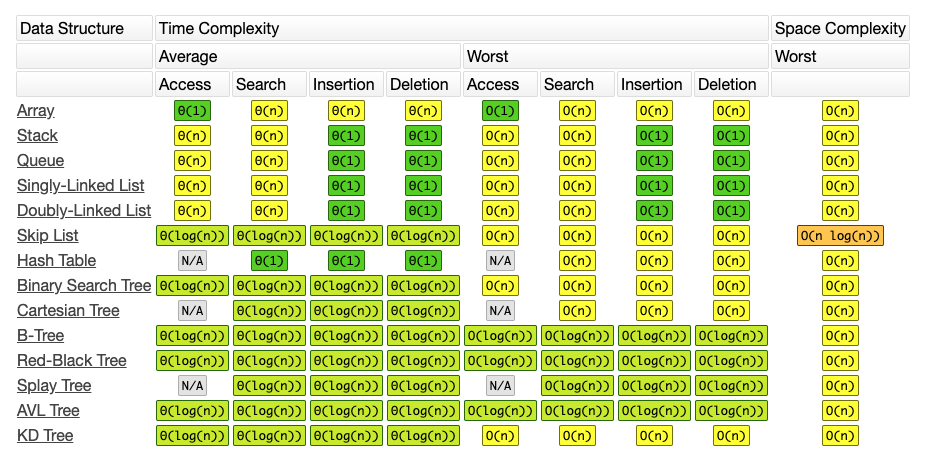

## Сложность алгоритмов сортировки

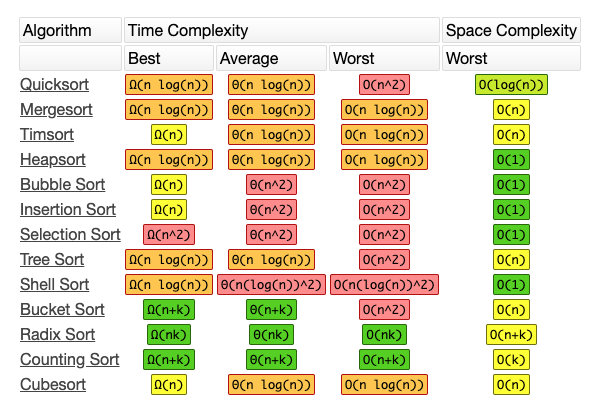

## Полезные ссылки

[Big O cheatsheet](https://www.bigocheatsheet.com/)

[Оценка сложности алгоритмов, или Что такое О(log n) - tproger](https://tproger.ru/articles/computational-complexity-explained/)

[Алгоритмы и структуры данных для начинающих: сложность алгоритмов - tproger](https://tproger.ru/translations/algorithms-and-data-structures/)

[Data Structures and Algorithms in Java - donbeave](https://github.com/donbeave/interview)
# CQRS

Системы управления предприятиями, проектами, сотрудниками давно вошли в нашу жизнь. И пользователи таких enterprise приложений все более требовательны: 
возрастают требования к масштабируемости, сложность бизнес-логики, требования к системам меняются быстро, да и отчетность требуется в реальном времени.

Поэтому при разработке зачастую можно наблюдать одни и те же проблемы в организации кода и архитектуры, а также в их усложнении. При неправильном подходе к 
проектированию рано или поздно может наступить момент, когда код становится настолько сложным и запутанным, что каждое внесение изменений требует все больше 
времени и ресурсов.

## Типовой подход к проектированию приложения


Многослойная архитектура – один из самых популярных способов организации структуры веб-приложений. В простой её вариации, как на приведенной выше схеме, 
приложение делится на 3 части: слой данных, слой бизнес-логики и слой пользовательского интерфейса.

В слое данных имеется некий `Repository`, который абстрагирует нас от хранилища данных.
В слое бизнес-логики есть объекты, которые инкапсулируют бизнес-правила (обычно их названия варьируются в пределах `Services/BusinessRules/Managers/Helpers`). 
Запросы пользователя проходят от `UI` сквозь бизнес-правила, и дальше через `Repository` производится работа с хранилищем данных.

С такой архитектурой запросы на получение и изменение данных, как правило, производятся в одном и том же месте – в слое бизнес-логики. Это довольно простой и 
привычный способ организации кода, и такая модель может подойти для большинства приложений, если в этих приложениях количество пользователей со временем 
значительно не меняется, приложение не испытывает больших нагрузок и не требует значительного расширения функционала

Но если веб-ресурс становится достаточно популярным, может стать вопрос о том, что одного сервера для него недостаточно. И тогда встает вопрос о распределении 
нагрузки между несколькими серверами. Простейший вариант быстро распределить нагрузку – использовать несколько копий ресурса и репликацию базы данных. А 
учитывая, что все действия такой системы никак не разделены, это порождает новые проблемы.

Классическая многослойная архитектура не обеспечивает лёгкого решения подобных проблем. Поэтому неплохо было бы использовать подходы, в которых эти проблемы 
решены с самого начала. Одним из таких подходов является `CQRS`.

## Command and Query Responsibility Segregation (CQRS)

`CQRS` – подход проектирования программного обеспечения, при котором код, изменяющий состояние, отделяется от кода, просто читающего это состояние. Подобное 
разделение может быть логическим и основываться на разных уровнях. Кроме того, оно может быть физическим и включать разные звенья (`tiers`), или уровни.

В основе этого подхода лежит принцип `Command-query separation` (`CQS`).

Основная идея `CQS` в том, что в объекте методы могут быть двух типов:
- `Queries`: Методы возвращают результат, не изменяя состояние объекта. Другими словами, у `Query` нет никаких побочных эффектов.
- `Commands`: Методы изменяют состояние объекта, не возвращая значение.

Для примера такого разделения рассмотрим класс `User` с одним методом `IsEmailValid`:

```.net
public class User {

    public string Email { get; private set; }
 
    public bool IsEmailValid(string email) {
        bool isMatch = Regex.IsMatch("email pattern", email);
 
        if (isMatch) {
            Email = email; // Command
        }
 
        return isMatch; // Query
    }
}
```

В данном методе мы спрашиваем (делаем `Query`), является ли валидным переданный `email`. Если да, то получаем в ответ `True`, иначе `False`. Кроме возврата 
значения, здесь также определено, что в случае валидного email сразу присваивать его значение (делаем `Command`) полю `Email`.

Несмотря на то что пример довольно простой, вероятна и менее тривиальная ситуация, если представить себе метод `Query`, который при вызове в нескольких уровнях 
вложенности меняет состояние разных объектов. В лучшем случае повезет, если не придется столкнуться с подобными методами и их долгой отладкой. Подобные 
побочные эффекты от вызова `Query` часто обескураживают, так как сложно разобраться в работе системы.

Если воспользоваться принципом `CQS` и разделить методы на `Command` и `Query`, получим следующий код:

```.net
public class User {

    public string Email { get; private set; }
 
    // Query 
    public bool IsEmailValid(string email) {
        return Regex.IsMatch("email pattern", email);
    }
 
    // Command
    public void ChangeEmail(string email) {
        if (IsEmailValid(email) == false)
            throw new ArgumentOutOfRangeException(email);
 
        Email = email;
    }
}
```

Теперь пользователь нашего класса не увидит никаких изменений состояния при вызове `IsEmailValid`, он лишь получит результат – валиден ли `email` или нет. А в 
случае вызова метода `ChangeEmail` пользователь явно поменяет состояние объекта.

В `CQS` у `Query` есть одна особенность. Раз `Query` никак не меняет состояние объекта, то методы типа `Query` можно хорошо распараллелить, разделяя 
приходящуюся на операции чтения нагрузку.

Если `CQS` оперирует методами, то `CQRS` поднимается на уровень объектов. Для изменения состояния системы создается класс `Command`, а для выборки данных – 
класс `Query`. Таким образом, мы получаем набор объектов, которые меняют состояние системы, и набор объектов, которые возвращают данные.

Типовой дизайн системы, где есть `UI`, бизнес-логика и база данных:

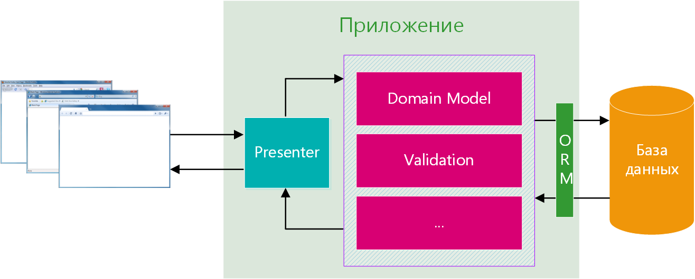

`CQRS` говорит, что не надо смешивать объекты `Command` и `Query`, нужно их явно выделить. Система, разделенная таким образом, будет выглядеть уже так:

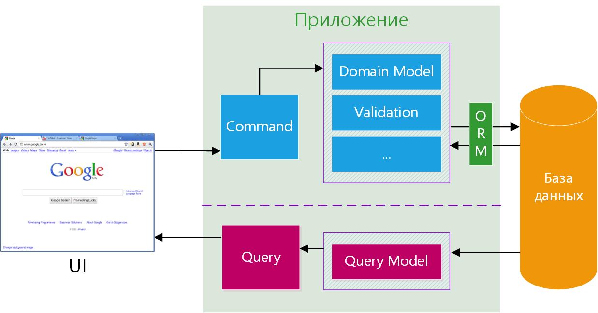

Разделение, преследуемое `CQRS`, достигается группированием операций запроса в одном уровне, а команд – в другом. Каждый уровень имеет свою модель данных, свой 
набор сервисов и создается с применением своей комбинации шаблонов и технологий. Еще важнее, что эти два уровня могут находиться даже в двух разных звеньях 
(`tiers`) и оптимизироваться раздельно, никак не затрагивая друг друга.

Простое понимание того, что команды и запросы являются разными вещами, оказывает глубокое влияние на архитектуру ПО. Например, вдруг становится легче 
предвидеть и кодировать каждый уровень предметной области. Уровень предметной области (`domain layer`) в стеке команд нуждается лишь в данных, бизнес-правилах 
и правилах безопасности для выполнения задач. С другой стороны, уровень предметной области в стеке запросов может быть не сложнее прямого `SQL`-запроса.

## С чего начать при работе с CQRS?

#### Стек команд

В `CQRS` на стек команд возлагается только выполнение задач, которые модифицируют состояние приложения. Команде присущи следующие свойства:
- Изменяет состояние системы.
- Ничего не возвращает.
- Контекст команды хранит нужные для ее выполнения данные.

Объявление и использование команды условно можно поделить на 3 части:
- Класс команды, представляющий собой данные;
- Класс обработчика команд;
- Класс с методом или методами, которые принимают команду на вход и вызывают именно тот обработчик, который реализует команду с данным типом.

Суть команд и запросов заключается в том, что они имеют общий признак, по которому они могут быть объединены. Иначе говоря, у них имеется общий тип. В случае 
команд это будет выглядеть следующим образом:

```.net
public interface ICommand{}
```

Первым шагом объявляется интерфейс, который, как правило, ничего не содержит. Он будет использоваться как параметр, который может быть получен на стороне 
сервера непосредственно из пользовательского интерфейса (`UI`), или же быть сформирован иным образом, для передачи обработчику команды.

Далее объявляется интерфейс обработчика команды.

```.net
public interface ICommandHandler<in TCommand> where TCommand : ICommand {
    void Execute(TCommand command);
}
```

Он содержит лишь 1 метод, принимающий данные с типом интерфейса, объявленным ранее.

После этого остается определить способ централизованного вызова обработчиков команд в зависимости от конкретного типа переданной команды (`ICommand`). Эту роль 
могут выполнять сервисная шина или диспетчер.

```.net
public interface ICommandDispatcher {
    void Execute<TCommand>(TCommand command) where TCommand : ICommand;
}
```

В зависимости от потребностей может иметь как один, так и более методов. В простых случаях может быть достаточно и одного метода, задача которого заключается в 
том, чтобы по типу переданного параметра определить, какую реализацию обработчика команды вызывать. Тем самым пользователю не придется делать это вручную.

Пример команды. Допустим, есть интернет-магазин, для него нужно создать команду, которая создаст товар в хранилище. В начале создадим класс, где в его имени 
указываем то, какое действие производит данная команда.

```.net
public class CreateInventoryItem : ICommand {

    public Guid InventoryItemid { get; }
    public string Name { get; }
 
    public CreateInventoryItem(Guid inventoryItemld, string name) {
        InventoryItemId = inventoryItemId;
        Name = name;
    }
}
```

Все классы, реализующие `ICommand`, содержит данные – свойства и конструктор с установкой их значений при инициализации – и больше ничего.

Реализация обработчика, то есть уже непосредственно самой команды, сводится к довольно простым действиям: создается класс, который реализует интерфейс 
`ICommandHandler`. Аргументом типа указывается команда, объявленная ранее.

```.net
public class InventoryCommandHandler : ICommandHandler<CreateInventoryItem> {

    private readonly IRepository<InventoryItem> _repository;
 
    public InventoryCommandHandlers(IRepository<InventoryItem> repository) {
        _repository = repository;
    }
 
    public void Execute(CreateInventoryItem message) {
        var item = new InventoryItem(message.InventoryItemld, message.Name);
        _repository.Save(item);
    }
 
    // ...
}
```

Тем самым мы реализуем метод, принимающий на вход эту команду, и указываем, какие действия на основе переданных данных хотим произвести. Обработчики команд 
можно объединять логически и реализовывать в одном таком классе несколько интерфейсов `ICommandHandler` с разным типом команд. Получится перегрузка методов, и 
при вызове метода `Execute` будет выбран подходящий по типу команды.

Теперь, чтобы вызывать подходящий обработчик команды, нужно создать класс, реализующий интерфейс `ICommandDispatcher`. В отличие от прошлых двух, данный класс 
создается единожды и может иметь разные реализации в зависимости от стратегии регистрации и вызова обработчиков команд.

```.net
public class CommandDispatcher : ICommandDispatcher {

    private readonly IDependencyResolver _resolver;
 
    public CommandDispatcher(IDependencyResolver resolver) {
        _resolver = resolver;
    }
 
    public void Execute<TCommand>(TCommand command) where TCommand : ICommand {
        if (command == null) throw new ArgumentNullException("command");
 
        var handler = _resolver.Resolve<ICommandHandler<TCommand>>();
 
        if (handler == null) throw new CommandHandlerNotFoundException(typeof(TCommand));
 
        handler.Execute(command);
    }
}
```

Одним из способов вызова нужного обработчика команды является использование `DI`-контейнера, в котором регистрируются все реализации обработчиков. В 
зависимости от переданной команды будет создаваться тот экземпляр, который обрабатывает данный тип команды. Затем диспетчер просто вызывает его метод 
`Execute`.

#### Стек запросов

Стек запросов имеет дело только с извлечением данных. Запросы используют модель данных, максимально соответствующую данным, применяемым на презентационном 
уровне. Вам вряд ли нужны какие-либо бизнес-правила – обычно они применяются к командам, которые изменяют состояние.

Запросу присущи следующие свойства:
- Не изменяет состояние системы;
- Контекст запроса хранит нужные для ее выполнения данные (пейджинг, фильтры и т.п.);
- Возвращает результат.

Объявление и использование запросов также можно условно поделить на 3 части:
- Класс запроса, представляющий собой данные с типом возвращаемого результата;
- Класс обработчика запросов;
- Класс с методом или методами, которые принимают запрос на вход и вызывают именно тот обработчик, который реализует запрос с данным типом.

Как и для команд, для запросов объявляются похожие интерфейсы. Единственное отличие – в них указывается то, что должно быть возвращено.

```.net
public interface IQuery<TResult>{}
```

Здесь в качестве аргумента типа указывается тип возвращаемых данных. Это может быть произвольный тип, например, `string` или `int[]`.

После объявляется обработчик запросов, где также указывается тип возвращаемого значения.

```.net
public interface IQueryHandler<in TQuery, out TResult> where TQuery : IQuery<TResult> {
    TResult Execute(TQuery query);
}
```

По аналогии с командами объявляется диспетчер для вызова обработчиков запросов.

```.net
public interface IQueryDispatcher {
    TResult Execute<TQuery, TResult>(TQuery query) where TQuery : IQuery<TResult>;
}
```

**Пример запроса**. Допустим, нужно создать запрос, возвращающий пользователей по поисковому критерию. Здесь также с помощью осмысленного имени класса 
указываем, что за запрос будет производится.

```.net
public class FindUsersBySearchTextQuery : IQuery<User[]> {

    public string SearchText { get; }
    public bool InactiveUsers { get; }
 
    public FindUsersBySearchTextQuery(string searchText, bool inactiveUsers)
    {
        SearchText = searchText;
        InactiveUsers = inactiveUsers;
    }
}
```

Далее создаём обработчик, реализующий `IQueryHandler` с аргументами типа запроса и типа его возвращаемого значения.

```.net
public class UserQueryHandler : IQueryHandler<FindUsersBySearchTextQuery, User[]> {

    private readonly IRepository<User> _repository;
 
    public UserQueryHandler(IRepository<User> repository)
    {
        _repository = repository;
    }
 
    public User[] Execute(FindUsersBySearchTextQuery query)
    {
        var users = _repository.GetAll();
        return users.Where(user => user.Name.Contains(query.SearchText)).ToArray();
    }
}
```

После чего остается создать класс для вызова обработчиков запросов.

```.net
public class QueryDispatcher : IQueryDispatcher {

    private readonly IDependencyResolver _resolver;
 
    public QueryDispatcher(IDependencyResolver resolver)
    {
        _resolver = resolver;
    }
 
    public TResult Execute<TQuery, TResult>(TQuery query) where TQuery : IQuery<TResult>
    {
        if (query == null) throw new ArgumentNullException("query");
 
        var handler = _resolver.Resolve<IQueryHandler<TQuery, TResult>>();
 
        if (handler == null) throw new QueryHandlerNotFoundException(typeof(TQuery));
 
        return handler.Execute(query);
    }
}
```

## Вызов команд и запросов

Чтобы можно было вызывать команды и запросы, достаточно использовать соответствующие диспетчеры и передать конкретный объект с необходимыми данными. На примере 
это выглядит следующим образом:

```.net
public class UserController : Controller {

    private IQueryDispatcher _queryDispatcher;
 
    public UserController(IQueryDispatcher queryDispatcher) {
       _queryDispatcher = queryDispatcher;
    }
 
    public ActionResult SearchUsers(string searchString) {
        var query = new FindUsersBySearchTextQuery(searchString);
        User[] users =_queryDispatcher.Execute(query);
        return View(users);
    }
}
```

Имея контроллер для обработки запросов пользователя, достаточно передать в качестве зависимости объект нужного диспетчера, после чего сформировать объект 
запроса или команды и передать методу диспетчера `Execute`.

Так мы избавляемся от необходимости постоянного увеличения зависимостей при увеличении количества функций системы и уменьшаем количество потенциальных ошибок.

## Достоинства CQRS

- Меньше зависимостей в каждом классе;
- Соблюдается принцип единственной ответственности (`SRP`);
- Подходит практически везде;
- Проще заменить и тестировать;
- Легче расширяется функциональность.

## Ограничения CQRS

- При использовании `CQRS` появляется много мелких классов;
- При использовании простой реализации `CQRS` могут возникнуть сложности с использованием группы команд в одной транзакции;
- Если в `Command` и `Query` появляется общая логика, нужно использовать наследование или композицию. Это усложняет дизайн системы, но для опытных 
разработчиков не является препятствием;
- Сложно целиком придерживаться `CQS` и `CQRS`. Самый простой пример – метод выборки данных из стека. Выборка данных – это `Query`, но нам надо обязательно 
поменять состояние и сделать размер стека `-1`. На практике вы будете искать баланс между жестким следованием принципами и производственной необходимостью;
- Плохо ложится на `CRUD`-приложения.

## Где не подходит
- В небольших приложениях/системах;
- В преимущественно `CRUD`-приложениях.

## Заключение

Чтобы приложения были по-настоящему эффективными, они должны подстраиваться под требования бизнеса. Архитектура, основанная на `CQRS`, значительно упрощает 
расширение и модификацию рабочих бизнес-процессов и поддерживает новые сценарии. Вы можете управлять расширениями в полной изоляции. Для этого достаточно 
добавить новый обработчик, зарегистрировать и сообщить ему, как обрабатывать сообщения только требуемого типа. Новый компонент будет автоматически вызываться 
только при появлении соответствующего сообщения и работать бок о бок с остальной частью системы. Легко, просто и эффективно.

`CQRS` позволяет оптимизировать конвейеры команд и запросов любым способом. При этом оптимизация одного конвейера не нарушит работу другого. В самой базовой 
форме `CQRS` используется одна общая база данных и вызываются разные модули для операций чтения и записи из прикладного уровня.

## Полезные ссылки

[Основы CQRS - habr](https://habr.com/ru/company/simbirsoft/blog/329970/)
# Event sourcing

`Event sourcing` (источники событий, регистрация событий, генерация событий) — это мощный архитектурный шаблон, при котором все изменения, вносимые в состояние 
приложения, сохраняются в той последовательности, в которой они происходили. Эти записи служат как источником для получения текущего состояния, так и журналом 
аудита того, что происходило в приложении за время его существования. `Event sourcing` способствует децентрализованному изменению и чтению данных. Такая архитектура 
хорошо масштабируется и подходит для систем, которые уже работают с обработкой событий или хотят перейти на такую архитектуру.

## Что такое Event Sourcing

Эксперты предметной области обычно описывают свои системы как совокупность сущностей (`entity`), представляющих собой контейнеры для хранения состояния и событий 
(`event`), отображающих изменения сущностей в результате обработки входных данных в рамках различных бизнес-процессов. Часто события инициируется командами 
(`command`), исходящими от пользователей, фоновых процессов или интеграций с внешними системами.

По сути, `Event sourcing` фокусируется на событиях, связанных с изменениями в системе.

Многие архитектурные шаблоны рассматривают сущности как первоочередную концепцию. Эти шаблоны описывают то, как их сохранять, как к ним получать доступ и как их 
модифицировать. В рамках такого архитектурного стиля события часто находятся «сбоку»: являются последствиями изменения сущностей.

Обычно в основе подобных архитектур лежит хранилище сущностей, например, реляционная база данных или документное хранилище. Хотя в такой архитектуре могут 
присутствовать события, но они, по своей сути, не являются первоочередной концепцией, и могут быть отделены от сущностей, с которыми они связаны, а также скрыты за 
слоями бизнес-логики.

`Event Sourcing` переворачивает этот подход, фокусируясь на реализации событий: на том как они сохраняются и как могут быть использованы для получения состояния 
сущности. В данном случае в базе данных будет последовательный журнал всех событий, которые произошли за время существования системы.

Ниже показано сравнение хранилища событий (`Event Store`) с хранилищем сущностей (`Entity Store`):


`Event sourcing`, используя события в качестве основной архитектурной концепции, также является парадигмой моделирования предметной области, лучше отражающей 
представление заказчика о системе. Проектирование систем с акцентом на события и журналы событий дает следующие преимущества:
- Помогает уменьшить несоответствие импеданса и необходимость в сопоставлении концепций, позволяя технологическим командам «говорить на одном языке» с бизнесом при 
обсуждении системы.
- Поощряет разделение ответственности на команды и запросы (`command/query responsibility` - `CQRS`), позволяя оптимизировать запись и чтение независимо друг от 
друга.
- Обеспечивает темпоральность и историю изменений, как само собой разумеющееся, позволяя отвечать на вопросы о том, как система выглядела в определенные моменты в 
прошлом и какие события происходили до этого момента.

## Принцип работы Event Sourcing

Рассмотрим простой пример с банковским счетом. У нас будет сущность (`entity`), представляющая собой банковский счет (`Bank Account`). Для простоты сделаем только 
один счет без его идентификации с помощью номера счета или каким-либо другим способом. Счет будет хранить текущий остаток средств.

Для счета будут доступны две команды (`command`): внести деньги (`deposit`) и снять деньги (`withdraw`). В командах будет указываться сумма для внесения или снятия. 
Также определим бизнес-правило, которое проверяет, что команда на снятие средств может быть обработана только в том случае, если запрашиваемая сумма равна или 
меньше текущего остатка на счете.

При таком подходе можно выделить два события (`event`) — `Account Credited` (Счет пополнен) и `Account Debited` (Средства списаны со счета). В этих событиях есть 
информация о сумме (`amount`), которая была внесена или снята. Здесь можно было бы упростить до одного события с положительной или отрицательной суммой, но в данном 
примере мы их разделим.

На диаграмме ниже показана модель данных.


Обратите внимание, что события — это «прошедшее время». Они указывают на то, что произошло в системе в момент их записи, и сохраняются только в том случае, если 
обработка команды прошла успешно. При таком подходе необходимо проявлять осторожность, чтобы не перепутать команды с событиями. Особенно если они зеркально похожи 
друг на друга.

Последовательность команд может выглядеть следующим образом:

```
1. deposit { amount: 100 } — внести 100
2. withdraw { amount: 80 } — снять 80
3. withdraw { amount: 50 } — снять 50
```

Самая простая реализация `Event Sourcing` требует журнала событий (`event log`), который представляет собой просто последовательность событий. При обработке команд, 
приведенных выше, получится такой журнал.


Третья команда не может быть выполнена, так как запрошенная сумма превышает доступный баланс.

Для получения текущего баланса система должна обработать или «сгенерировать» события в порядке их возникновения. Для нашего примера это может выглядеть следующим 
образом:

```
- bank account { current balance: 0 } (starting state)
- bank account { current balance: 100 } (processed: Account Credited, +100)
- bank account { current balance: 20 } (processed: Account Debited, -80)
```

Текущий баланс вычисляется через обработку всех событий до текущего момента. Так как каждое событие имеет неявную метку времени, то можно вычислить состояние счета 
на любой момент времени, обработав все события за необходимый промежуток времени.

Это законченный (хоть и тривиальный) пример `Event Sourcing`. В реальной системе, скорее всего, этот пример придется расширить.

Возможно, потребуется сохранять последовательность команд, чтобы была возможность идентифицировать, как возникло событие, а также сделать отдельный журнал 
«ошибочных событий» (`error event`), в который записывать команды, которые не удалось выполнить, для дальнейшей обработки ошибок и ведения полной истории успешных и 
неуспешных команд.

Со временем, при увеличении количества команд, может потребоваться сохранять текущий баланс счета, чтобы при получении команды на снятие средств не нужно было 
обрабатывать полный список событий для определения возможности выполнения команды (т. е. имеется ли на счете достаточно средств). Это пример производного хранилища 
и, по сути, то же самое, что и хранилище сущностей.

Ниже показано, как будет выглядеть хранилище сущностей для нашего примера после обработки всех команд.


Очевидно, что по сравнению с полноценным хранилищем событий (`Event Store`), это очень примитивный пример. И это одна из причин, по которой многие разработчики 
используют только хранилище сущностей. В этом случае текущий остаток на счете доступен сразу и нет необходимости обрабатывать все исторические события.

Однако `Event Sourcing` не исключает хранилища сущностей. Часто хранилища сущностей присутствуют и в `Event Sourcing` — проектах.

## Особенности реализации Event Sourcing

С технической точки зрения для `Event Sourcing` требуется только реализация записи событий в журнал и чтения из журнала.

В простейшем случае в качестве хранилища событий может использоваться файл, в котором в каждой строке записывается отдельное событие, или несколько файлов, когда 
каждое событие сохраняется в отдельный файл. Но как правило, в больших системах, требовательных к параллелизму и масштабируемости, используются более надежные 
способы хранения.

Журнал событий (`event log`) — очень распространенный паттерн, используемый совместно с системами обмена сообщениями (`Message broker`, `Message-oriented 
middleware`) и системами обработки потоков событий. Брокер сообщений, используемый как журнал событий, при необходимости может хранить всю историю сообщений.

Реляционные и документные модели обычно фокусируются на моделировании сущностей. В таких моделях текущее состояние легко получить, прочитав одну или несколько 
строк или документов. Стоит отметить, что `Event Sourcing` и реляционная модель не исключают друг друга. `Event Sourcing`-системы часто включают в себя и то и 
другое. Ключевое отличие `Event Sourcing` заключается в том, что к хранилищу сущностей уже не относятся как к исходным данным. Его можно заменить или перестроить 
через повторную обработку журнала событий.

В более сложных `Event Sourcing`-системах должны присутствовать производные хранилища состояния для эффективных запросов на чтение, так как получение текущего 
состояния через обработку всего журнала событий со временем может перестать масштабироваться. И реляционные, и документные БД могут использоваться и как журнал 
событий и как хранилище производных сущностей, через которые можно быстро получить текущее состояние. Фактически такое разделение задач представляет собой `CQRS` 
(`Command Query Responsibility Segregation`, разделение ответственности на команды и запросы). Все запросы направляются в производное хранилище, что позволяет 
оптимизировать его независимо от операций записи.

Помимо технической части есть и другие моменты, на которые стоит обратить внимание.

## Потенциальные проблемы Event Sourcing

Несмотря на преимущества `Event Sourcing`, у него есть и недостатки.

Самые большие сложности обычно связаны с мышлением разработчиков. Разработчики должны выйти за рамки обычных `CRUD`-приложений и хранилищ сущностей. Теперь 
основной концепцией должны стать события.

При `Event Sourcing` много сил тратится на моделирование событий. После записи событий в журнал они должны считаться неизменными, иначе, и история и состояние 
могут быть повреждены или искажены. `Журнал событий` — это исходные данные, а это значит, что необходимо очень внимательно следить за тем, чтобы они содержали всю 
информацию, необходимую для получения полного состояния системы на определенный момент времени. Также необходимо учитывать, что события могут интерпретироваться 
повторно, поскольку система (и бизнес, который она представляет) со временем изменяются. И не надо забывать про ошибочные и подозрительные события с корректной 
обработкой валидации данных.

Для простых моделей предметных областей такое изменение мышления может быть довольно легким, но для более сложных может стать проблемой (особенно с большим 
количеством зависимостей и отношений между сущностями). Могут возникнуть сложности интеграции с внешними системами, которые не предоставляют данные на определенный 
момент времени.

`Event Sourcing` может хорошо работать в больших системах, так как паттерн «`журнал событий`» естественным образом масштабируется горизонтально. Например, журнал 
событий одной сущности необязательно должен физически находиться вместе с журналом событий другой сущности. Однако, такая легкость масштабирования приводит к 
дополнительным проблемам в виде асинхронной обработки и согласования данных в конечном счете (`eventually consistent`). Команды на изменение состояния могут 
приходить на любой узел, после чего системе необходимо определить, какие узлы отвечают за соответствующие сущности и направить команду на эти узлы, после чего 
обработать команду, а затем реплицировать сгенерированные события на другие узлы, где хранятся журналы событий. И только после завершения этого процесса новое 
событие становится доступным как часть состояния системы. Таким образом, `Event Sourcing` фактически требует, чтобы обработка команд была отделена от запроса 
состояния, то есть `CQRS`.

Поэтому `Event Sourcing`-системам необходимо учитывать промежуток времени между выдачей команды и получением уведомления об успешной записи события в журнал. 
Состояние системы, которое пользователи видят в это время, может быть «неправильным». Или, точнее, немного устаревшим. Для уменьшения влияния этого фактора 
необходимо его учитывать при проектировании интерфейса пользователя и в других компонентах. Также необходима правильная обработка ситуаций, когда команда 
завершается ошибкой, отменяется в процессе выполнения или одно событие заменяется более новым при корректировке данных.

Еще одна проблема возникнет, когда со временем накопятся события и с ними нужно будет работать. Одно дело только записывать их после обработки, другое — работать 
со всей историей. Без этого функционала журнал событий полностью теряет свою ценность. Особенно это актуально для восстановления после сбоя или при миграциях 
производных хранилищ, когда для актуализации данных может потребоваться повторная обработка всех событий. Для систем с большим количеством событий повторная 
обработка всего журнала может превысить допустимое время восстановления. Здесь могут помочь периодические снимки состояния системы (`snapshot`), чтобы можно было 
начать восстановление с более позднего исправного состояния. 

Также необходимо учитывать структуру событий. Структура событий может изменяться с течением времени. Может изменяться набор полей. Возможны ситуации, когда старые 
события должны быть обработаны текущей бизнес-логикой. И наличие расширяемой схемы событий поможет в будущем при необходимости отличать новые события от старых. 
Периодические снимки также помогают отделить серьезные изменения структуры событий.

## Выводы

`Event Sourcing` — это мощный подход, имеющий свои преимущества. Одно из которых — упрощение расширения системы в будущем. Поскольку журнал событий хранит все 
события, то их можно использовать во внешних системах. Довольно легко интегрироваться через добавление новых обработчиков событий.

Однако, как и в случае с любым серьезным архитектурным решением, необходимо проявлять осторожность и убедиться, что оно подходит для вашей ситуации. Ограничения, 
связанные со сложностью предметной области, требованиями к согласованности и доступности данных, а также увеличение объема хранимых данных и масштабируемость в 
долгосрочной перспективе — все это необходимо учитывать (и это ни в коем случае не исчерпывающий список). Не менее важно уделять внимание разработчикам, которые 
будут разрабатывать и поддерживать такую систему на протяжении всего ее жизненного цикла.

И напоследок, не забывайте самый важный принцип программной инженерии — стремиться к тому, чтобы все было как можно проще (принцип `KISS`).

## Полезные ссылки

[Знакомимся с Event Sourcing. Часть 1 - habr](https://habr.com/ru/company/otus/blog/518282/)

[Знакомимся с Event Sourcing. Часть 2 - habr](https://habr.com/ru/company/otus/blog/520538/)
# Перевод статьи Мартина Фаулера - Microservices

Термин `Microservice Architecture` получил распространение в последние несколько лет как описание способа дизайна приложений в виде набора независимо 
развертываемых сервисов. В то время как нет точного описания этого архитектурного стиля, существует некий общий набор характеристик: 
- организация сервисов вокруг бизнес-потребностей
- автоматическое развертывание
- перенос логики от шины сообщений к приемникам (endpoints) 
- децентрализованный контроль над языками и данными

`Микросервисы` — еще один новый термин на шумных улицах разработки ПО. И хотя мы обычно довольно настороженно относимся ко всем подобным новинкам, конкретно 
этот термин описывает стиль разработки ПО, который мы находим все более и более привлекательным. За последние несколько лет мы видели множество проектов, 
использующих этот стиль, и результаты до сих пор были весьма позитивными. Настолько, что для большинства наших коллег этот стиль становится основным стилем 
разработки ПО. К сожалению, существует не так много информации, которая описывает, чем же являются микросервисы и как применять их.

Если коротко, то архитектурный стиль микросервисов — это подход, при котором единое приложение строится как набор небольших сервисов, каждый из которых 
работает в собственном процессе и коммуницирует с остальными используя легковесные механизмы, как правило `HTTP`. Эти сервисы построены вокруг бизнес-
потребностей и развертываются независимо с использованием полностью автоматизированной среды. Существует абсолютный минимум централизованного управления этими 
сервисами. Сами по себе эти сервисы могут быть написаны на разных языках и использовать разные технологии хранения данных.

#### Сравнение микросервисов с монолитом

Для того, чтобы начать рассказ о стиле микросервисов, **лучше всего сравнить его с монолитом** (`monolithic style`): приложением, построенном как единое целое. 
`Enterprise` приложения часто включают три основные части: 
- пользовательский интерфейс (состоящий как правило из `HTML` страниц и `javascript`-а)
- база данных (как правило реляционной, со множеством таблиц)
- сервер
Серверная часть обрабатывает `HTTP` запросы, выполняет доменную логику, запрашивает и обновляет данные в `БД`, заполняет `HTML` страницы, которые затем 
отправляются браузеру клиента. **Любое изменение в системе приводит к пересборке и развертыванию новой версии серверной части приложения**.

`Монолитный сервер` — довольно очевидный способ построения подобных систем. Вся логика по обработке запросов выполняется в единственном процессе, при этом вы 
можете использовать возможности вашего языка программирования для разделения приложения на классы, функции и namespace-ы. Вы можете запускать и тестировать 
приложение на машине разработчика и использовать стандартный процесс развертывания для проверки изменений перед выкладыванием их в продакшн. Вы **можете 
масштабировать монолитное приложения горизонтально путем запуска нескольких физических серверов за балансировщиком нагрузки**.

Монолитные приложения могут быть успешными, но все больше людей разочаровываются в них, особенно в свете того, что все больше приложений развертываются в 
облаке. **Любые изменения, даже самые небольшие, требуют пересборки и развертывания всего монолита**. С течением времени, становится труднее сохранять хорошую 
модульную структуру, изменения логики одного модуля имеют тенденцию влиять на код других модулей. **Масштабировать приходится все приложение целиком**, даже 
если это требуется только для одного модуля этого приложения.


Эти неудобства привели к архитектурному стилю микросервисов: построению приложений в виде набора сервисов. В дополнение к возможности независимого 
развертывания и масштабирования каждый сервис также получает четкую физическую границу, которая позволяет разным сервисам быть написанными на разных языках 
программирования. Они также могут разрабатываться разными командами.

Мы не утверждаем, что стиль микросервисов это инновация. Его корни уходят далеко в прошлое, как минимум к принципам проектирования, использованным в `Unix`. Но 
мы тем не менее считаем, что недостаточно людей принимают во внимание этот стиль и что многие приложения получат преимущества если начнут применять этот стиль.

#### Свойства архитектуры микросервисов

Мы не можем сказать, что существует формальное определение стиля микросервисов, но мы можем попытаться описать то, что мы считаем общими характеристиками 
приложений, использующих этот стиль. Не всегда они встречаются в одном приложении все сразу, но, как правило, каждое подобное приложение включает в себя 
большинство этих характеристик. Мы попробуем описать то, что мы видим в наших собственных разработках и в разработках известных нам команд.

#### Разбиение через сервисы

В течение всего срока нашего пребывания в индустрии мы видим желание строить системы путем соединения вместе различных компонент, во многом так же, как это 
происходит в реальном мире. За последние пару десятков лет мы видели большой рост набора библиотек, используемых в большинстве языков программирования.

Говоря о компонентах, мы сталкиваемся с трудностями определения того, что такое компонент. Наше определение такое: `компонент` — это единица программного 
обеспечения, которая может быть независимо заменена или обновлена.

Архитектура микросервисов использует библиотеки, но их основной способ разбиения приложения — путем деления его на сервисы. Мы определяем библиотеки как 
компоненты, которые подключаются к программе и вызываются ею в том же процессе, в то время как сервисы — это компоненты, выполняемые в отдельном процессе и 
коммуницирующие между собой через `веб-запросы` или `remote procedure call` (`RPC`).

Главная причина использования сервисов вместо библиотек — это независимое развертывание. Если вы разрабатываете приложение, состоящее из нескольких библиотек, 
работающих в одном процессе, любое изменение в этих библиотеках приводит к переразвертыванию всего приложения. Но если ваше приложение разбито на несколько 
сервисов, то изменения, затрагивающие какой-либо из них, потребуют переразвертывания только изменившегося сервиса. Конечно, какие-то изменения будут 
затрагивать интерфейсы, что, в свою очередь, потребует некоторой координации между разными сервисами, но **цель хорошей архитектуры микросервисов — 
минимизировать необходимость в такой координации путем установки правильных границ между микросервисами**, а также механизма эволюции контрактов сервисов.

Другое следствие использования сервисов как компонент — более явный интерфейс между ними. Большинство языков программирования не имеют хорошего механизма для 
объявления `Published Interface`. Часто только документация и дисциплина предотвращают нарушение инкапсуляции компонентов. Сервисы позволяют избежать этого 
через использование явного механизма удаленных вызовов.

Тем не менее, использование сервисов подобным образом имеет свои недостатки. Удаленные вызовы работают медленнее, чем вызовы в рамках процесса, и поэтому `API` 
должен быть менее детализированным (`coarser-grained`), что часто приводит к неудобству в использовании. Если вам нужно изменить набор ответственностей между 
компонентами, сделать это сложнее из-за того, что вам нужно пересекать границы процессов.

В первом приближении мы можем наблюдать, что сервисы соотносятся с процессами как один к одному. На самом деле сервис может содержать множество процессов, 
которые всегда будут разрабатываться и развертываться совместно. Например, процесс приложения и процесс базы данных, которую использует только это приложение.

#### Организация вокруг потребностей бизнеса

Когда большое приложение разбивается на части, часто менеджмент фокусируется на технологиях, что приводит к образованию `UI` команды, серверной команды и `БД`
команды. Когда команды разбиты подобным образом, даже небольшые изменения отнимают много времени из-за необходимости кросс-командного взаимодействия. Это 
приводит к тому, что команды размещают любую логику на тех слоях, к которым имеют доступ. Закон Конвея (`Conway's Law`) в действии.

> Любая организация, которая проектирует какую-то систему (в широком смысле) получит дизайн, чья структура копирует структуру команд в этой организации
— Melvyn Conway, 1967


Закон Конвея (Conway's Law) в действии

Микросервисный подход к разбиению подразумевает раазбиение на сервисы в соответствии с потребностями бизнеса. Такие сервисы включают в себя полный набор 
технологий, необходимых для этой бизнес-потребности, в том числе пользовательский интерфейс, хранилище данных и любые внешние взаимодействия. Это приводит к 
формированию кросс-функциональных команд, имеющих полный набор необходимых навыков: `user-experience`, `базы данных` и `project management`.

Одна из компаний, организованных в этом стиле — www.comparethemarket.com. Кросс-фунциональные команды отвечают за построение и функционирование каждого 
продукта и каждый продукт разбит на несколько отдельных сервисов, общающихся между собой через шину сообщений.

Крупные монолитные приложения тоже могут быть разбиты на модули вокруг бизнес потребностей, хотя обычно этого не происходит. Безусловно, мы рекомендуем большим 
командам строить монолитные приложения именно таким образом. Основная проблема здесь в том, что такие приложения имеют тенденцию к организации вокруг слишком 
большого количества контекстов. Если монолит охватывает множество контекстов, отдельным членам команд становится слишком сложно работать с ними из-за их 
большого размера. Кроме того, соблюдение модульных границ в монолитном приложении требует существенной дисциплины. Явно очерченные границы компонент 
микросервисов упрощает поддержку этих границ.

#### Насколько большими должны быть микросервисы?

Хотя термин «Микросервис» стал популярным названием для этого архитектурного стиля, само имя приводит к чрезмерному фокусу на размере сервисов и спорам о том, 
что означает приставка «микро». В наших разговорах с теми, кто занимался разбиением ПО на микросервисы, мы видели разные размеры. Наибольший размер был у 
компаний, следовавших правилу «`Команда двух пицц`» (команда, которую можно накормить двумя пиццами), т.е. не более `12` человек (прим. перев.: следуя этому 
правилу, я в команде должен быть один). В других компаниях мы видели команды, в которых шестеро человек поддерживали шесть сервисов.

Это приводит к вопросу о том, есть ли существенная разница в том, сколько человек должно работать на одном сервисе. На данный момент мы считаем, что оба этих 
подхода к построению команд (1 сервис на 12 человек и 1 сервис на 1 человека) подходят под описание микросервисной архитектуры, но возможно мы изменим свое 
мнение в будущем. (прим. перев.: со времен статьи появилось множество других статей, развивающих эту тему; наиболее популярным сейчас считается мнение о том, 
что сервис должен быть настолько большим, чтобы он мог полностью «уместиться в голове разработчика», независимо от количества строк кода).

#### Продукты, а не проекты

Большиство компаний по разработке ПО, которые мы видим, используют проектную модель, в которой целью является разработка некой части функциональности, которая 
после этого считается завершенной. После завершения эта часть передается команде поддержки и проектная команда распускается.

Сторонники микросервисов сторонятся этой модели, утверждая, что команда должна владеть продуктом на протяжении всего срока его жизни. Корни этого подхода 
уходят к Амазону, у компании есть правило "вы разработали, вам и поддерживать", при котором команда разработки берет полную ответственность за ПО в продакшне. 
Это приводит к тому, что разработчики регулярно наблюдают за тем, как их продукт ведет себя в продакшне, и больше контактируют с пользователями, т.к. им 
приходится брать на себя как минимум часть обязанностей по поддержке.

Мышление в терминах продукта устанавливает связь с потребностями бизнеса. Продукт — это не просто набор фич, которые необходимо реализовать. Это постоянные 
отношения, цель которых — помочь пользователям увеличить их бизнес-возможности.

Конечно, этого можно также достичь и в случае с монолитным приложением, но высокая гранулярность сервисов упрощает установку персональных отношений между 
разработчиками сервиса и его пользователями.

#### Умные приемники и глупые каналы передачи данных (Smart endpoints and dumb pipes)

При выстраивании коммуникаций между процессами мы много раз были свидетелями того, как в механизмы передачи данных помещалась существенная часть логики. 
Хорошим примером здесь является `Enterprise Service Bus` (`ESB`). `ESB`-продукты часто включают в себя изощренные возможности по передаче, оркестровке и 
трансформации сообщений, а также применению бизнес-правил.

Комьюнити микросервисов предпочитает альтернативный подход: умные приемники сообщений и глупые каналы передачи. Приложения, построенные с использованием 
микросервисной архитектуры, стремятся быть настолько незавимыми (`decoupled`) и сфокусировнными (`cohesive`), насколько возможно: они содержат собственную 
доменную логику и выступают больше в качестве фильтров в классическом `Unix`-овом смысле — получают запросы, применяют логику и отправляют ответ. Вместо 
сложных протоколов, таких как `WS-*` или `BPEL`, они используют простые `REST`-овые протоколы.

Два наиболее часто используемых протокола — это `HTTP` запросы через `API` ресурса и легковесный месседжинг. Лучшее выражение первому дал `Ian Robinson`: 
> «Be of the web, not behind the web».

Команды, практикующие микросервисную архитектуру, используют те же принципы и протоколы, на которых построена всемирная паутина. Часто используемые ресурсы 
могут быть закешированы с очень небольшими усилиями со стороны разработчиков или IT-администраторов.

Второй часто используемый инструмент коммуникации — легковесная шина сообщений. Такая инфраструктура как правило не содержит доменной логики — простые 
реализации типа `RabbitMQ` или `ZeroMQ` не делают ничего кроме предоставления асинхронной фабрики. Логика при этом существует на концах этой шины — в сервисах, 
которые отправляют и принимают сообщения.

В монолитном приложении компоненты работают в одном процессе и коммуницируют между собой через вызов методов. Наибольшая проблема в смене монолита на 
микросервисы лежит в изменении шаблона коммуникации. Наивное портирование один к одному приводит к «болтливым» коммуникациям, которые работают не слишком 
хорошо. Вместо этого вы должны уменьшить количество коммуникаций между модулями.

#### Децентрализованное управление

Одним из следствий централизованного управления является тенденция к стандартизации используемых платформ. Опыт показывает, что такой подход слишком сильно 
ограничивает выбор — не всякая проблема является гвоздем и не всякое решение является молотком. Мы предпочитаем использовать правильный инструмент для каждой 
конкретной работы. И хотя монолитные приложения тоже в некоторых случаях могут быть написаны с использованием разных языков, это не является стандартной 
практикой.

Разбивая монолит на сервисы, мы имеем выбор, как построить каждый из них. Хотите использовать `Node.js` для простых страничек с отчетами? Пожалуйста. `C++` для 
`real-time` приложений? Отлично. Хотите заменить `БД` на ту, которая лучше подходит для операций чтения вашего компонента? Ради бога.

Конечно, только потому что вы можете делать что-то, не значит что вы должны это делать. Но разбиение системы подобным образом дает вам возможность выбора.

Команды, разрабатывающие микросервисы, также предпочитают иной подход к стандартизации. Вместо того, чтобы использовать набор предопределенных стандартов, 
написанных кем-то, они предпочитают идею построения полезных инструментов, которые остальные девелоперы могут использовать для решения похожих проблем. Эти 
инструменты как правило вычленены из кода одного из проектов и расшарены между разными командами, иногда используя при этом модель внутреннего опен-сорса. 
Теперь, когда `git` и `github` стали де-факто стандартной системой контроля версий, опен-сорсные практики становятся все более и более популярными во 
внутренних проектах компаний.

`Netflix` — хороший пример организации, которая следует этой философии. Расшаривание полезного и, более того, протестированного на боевых серверах кода в виде 
библиотек побуждает остальных разработчиков решать схожие проблемы схожим путем, оставляя тем не менее возможность выбора другого подхода при необходимости. 
Общие библиотеки имеют тенденцию быть сфокусированными на общих проблемах, связанных с хранением данных, межпроцессорным взаимодействием и автоматизацией 
инфраструктуры.

Комьюнити микросервисов ценит сервисные контракты, но не любит оверхеды и поэтому использует различные пути управления этими контрактами. Такие шаблоны как 
`Tolerant Reader` и `Consumer-Driven Contracts` часто используются в микросервисах, что позволяет им эволюционировать независимо. Проверка `Consumer-Driven` 
контрактов как часть билда увеличивает уверенность в правильности функционирование сервисов. Мы знаем команду из Австралии, которая использует этот подход для 
проверки контрактов. Это стало частью их процесса сборки: сервис собирается только до того момента, который удовлетворяет требованиям контракта — элегантный 
способ обойти диллему `YAGNI`.

Пожалуй наивысшая точка в практике децентрализованного управления — это метод, популизированный Амазоном. Команды отвечают за все аспекты ПО, которое они 
разрабатывают, включая поддержку его в режиме 24/7. Подобная деволюция уровня ответственности совершенно точно не является нормой, но мы видим все больше и 
больше компаний, передающий ответственность командам разработчиков. `Netflix` — еще одна компания, практикующая это. Пробуждение в 3 часа ночи — очень сильный 
стимул к тому, чтобы уделять большое внимание качеству написанного кода.

#### Микросервисы и SOA

Когда мы разговариваем о микросервисах, обычно возникает вопрос о том, не является ли это обычным `Service Oriented Architecture` (`SOA`), который мы видели 
десять лет назад. В этом вопросе есть здравое зерно, т.к. стиль микросервисов очень похож на то, что продвигают некоторые сторонники `SOA`. Проблема, тем не 
менее, в том, что термин `SOA` имеет слишком много разных значений и, как правило, то, что люди называют «`SOA`» существенно отличается от стиля, описанного 
здесь, обычно из-за чрезмерного фокуса на `ESB`, используемом для интеграции монолитных приложений.

В частности, мы видели так много неудачных реализаций `SOA` (начиная с тенденции прятать сложность за `ESB`, заканчивая провалившимися инциативами 
длительностью несколько лет, которые стоили миллионы долларов и не принесли никакой пользы), что порой слишком сложно абстрагироваться от этих проблем.

Безусловно, многие практики, используемые в микросервисах, пришли из опыта интеграции сервисов в крупных организациях. Шаблон `Tolerant Reader` — один из 
примеров. Другой пример — использование простых протоколов — возник как реакция на централизованные стандарты, сложность которых просто захватывает дух.

Эти проблемы `SOA` привели к тому, что некоторые сторонники микросервисов отказываются от термина «`SOA`», хотя другие при этом считают микросервисы одной из 
форм `SOA`, или, возможно, правильной реализацией `SOA`. В любом случае, тот факт, что `SOA` имеет разные значения, означает, что полезно иметь отдельный 
термин для обозначения этого архитектурного стиля.

#### Множество языков, множество возможностей

Рост платформы `JVM` — один из последних примеров смешивания языков в рамках единой платформы. Переход к более высокоуровневым языкам для получения 
преимуществ, связанных с использованием высокоуровневых абстракций, был распространенной практикой в течение десятилетий. Точно так же, как и переход «к 
железу» для написания высокопроизводительного кода.

Тем не менее, множество монолитных приложений не требуют такого уровня оптимизации производительности и высокоуровневых возможностей `DSL`-подобных языков. 
Вместо этого, монолиты как правило используют единый язык и склонны к ограничению количества используемых технологий.

#### Децентрализованное управление данными

Децентрализованное управление данными предстает в различном виде. В наиболее абстрактном смысле это означает, что концептуальная модель мира у разных систем 
будет отличаться. Это обычная проблема, возникающая при интеграции разных частей больших `enterprise`-приложений: точка зрения на понятие «Клиент» у 
продажников будет отличаться от таковой у команды техподдержки. Некоторые атрибуты «Клиента» могут присутствовать в контексте продажников и отсутствовать в 
контексте техподдержки. Более того, атрибуты с одинаковым названием могут иметь разное значение.

Эта проблема встречается не только у разных приложений, но также и в рамках единого приложения, особенно в тех случаях когда это приложение разделено на 
отдельные компоненты. Эту проблему хорошо решает понятие `Bounded Context` из `Domain-Driven Design` (`DDD`). `DDD` предлагает делить сложную предметную 
область на несколько контекстов и мапить отношения между ними. Этот процесс полезен как для монолитной, так и для микросервисной архитектур, но между сервисами 
и контекстами существует естественная связь, которая помогает прояснять и поддерживать границы контекстов.

Кроме децентрализации принятия решений о моделировании предметной области, микросервисы также способствуют децентрализации способов хранения данных. В то время 
как монолитные приложения склонны к использованию единственной `БД` для хранения данных, компании часто предпочитают использовать единую `БД` для целого набора 
приложений. Такие решения, как правило, вызваны моделью лицензирования баз данных. Микросервисы предпочитают давать возможность каждому сервису управлять 
собственной базой данных: как создавать отдельные инстансы общей для компании `СУБД`, так и использовать нестандартные виды баз данных. Этот подход называется 
`Polyglot Persistence`. Вы также можете применять `Polyglot Persistence` в монолитных приложениях, но в микросервисах такой подход встречается чаще.


Децентрализация ответственности за данные среди микросервисов оказывает влияние на то, как эти данные изменяются. Обычный подход к изменению данных заключается 
в использовании транзакций для гарантирования консистентности при изменении данных, находящихся на нескольких ресурсах. Такой подход часто используется в 
монолитных приложениях.

Подобное использование транзакций гарантирует консистентность, но приводит к существенной временной зависимости (`temporal coupling`), которая, в свою очередь, 
приводит к проблемамм при работе с множеством сервисов. Распределенные транзакции невероятно сложны в реализации и, как следствие, микросервисная архитектура 
придает особое значению координации между сервисами без использования транзакций с явным обозначением того, что консистентность может быть только итоговой 
(`eventual consistency`) и возникающие проблемы решаются операциями компенсации.

Управление несогласованностями подобным образом — новый вызов для многих команд разработки, но это часто соответствует практикам бизнеса. Часто компании 
стремятся как можно быстрее реагировать на действия пользователя и имеют процессы, позвояющие отменить действия пользователей в случае ошибки. Компромисс стоит 
того до тех пор, пока стоимость исправления ошибки меньше стоимости потерь бизнеса при использовании сценариев, гарантирующих консистентность.

#### Стандартны, проверенные в бою, vs навязанные стандарты

Команды, использующие микросервисную архитектуру, склонны избегать жестких стандартов, установленных группами системных архитекторов. Они также склонны 
использовать и даже продвигать открытые стандарты типа `HTTP` и `ATOM`.

Ключевое отличие в том, как эти стандарты разрабатываются и как они проводятся в жизнь. Стандарты, управляемые группами вроде `IETF`, становятся стандартами 
только тогда, когда находятся несколько реализаций в успешных `open-source` проектах.

Это отличает их от стандартов в корпоративном мире, которые часто разрабатываются группами людей с небольшим опытом реальной разработки или имеют слишком 
сильное влияние, оказываемое вендорами.

#### Автоматизация инфраструктуры

Техники автоматизации инфраструктуры сильно эволюционировали за последние несколько лет. Эволюция облака в целом и `AWS` в частности уменьшила операционную 
сложность построения, разворачивания и функционирования микросервисов.

Множество продуктов и систем, использующих микросервисную архитектуру, были построены командами с обширным опытом в `Continuous Delivery` и `Continuous 
Integration`. Команды, строящие приложения подобнымм образом, интенсивно используют техники автоматизации инфраструктуры. Это проиллюстрировано на картинке 
ниже.


Так как эта статья не про `Continuous Delivery`, мы уделим внимание лишь паре его ключевых моментов. Мы хотим получать как можно больше уверенности в том, что 
наше приложение работает, поэтому мы запускаем множество автоматических тестов. Для выполнения каждого шага автоматического тестирования приложение 
разворачивается в отдельной среде, для чего используется автоматического развертывание (`automated deployment`).

После того как вы инвестировали время и деньги в автоматизацию процесса развертывания монолита, развертывание большего количества приложений (сервисов) уже не 
видится таким пугающим. Вспомните, что одна из целей `Continuous Delivery` — это сделать развертывание скучным, так что одно это приложение или три не имеет 
большого значения.

Другая область, где команды используют интенсивную автоматизацию инфраструктуры, — это управление микросервисами в продакшне. В отличие от процесса 
развертывания, который, как описано выше, у монолитных приложений не сильно отличается от такового у микросервисов, их способ фунционирования может существенно 
различаться.

Одним из побочных эффектов автоматизации процесса развертывания является создание удобных инструментов для помощи разработчикам и администраторам (`operations 
folk`). Инструменты для управления кодом, развертывания простых сервисов, мониторинга и логирования сейчас довольно распространены. Возможно наилучший пример, 
который можно найти в сети, — это набор `open source` инструментов от `Netflix`, но существуют и другие, к примеру `Dropwizard`, который мы довольно интенсивно 
используем.

#### Проектирование под отказ (Design for failure)

Следствием использования сервисов как компонентов является необходимость проектирования приложений так, чтобы они могли работать при отказе отдельных сервисов. 
Любое обращение к сервису может не сработать из-за его недоступности. Клиент должен реагировать на это настолько терпимо, насколько возможно. **Это является 
недостатоком микросервисов по сравнению с монолитом**, т.к. это вносит дополнительную сложность в приложение. Как следствие, команды микросервисов постоянно 
думают на тем, как недоступность сервисов должна влиять на `user experience`. `Simian Army` от `Netflix` искуственно вызывает (симулирует) отказы сервисов и 
даже датацентров в течение рабочего дня для тестирования отказоустойчивости приложения и служб мониторинга.

Подобный вид автоматического тестирования в продакшне позволяет сэмулировать стресс, который ложится на администраторов и часто приводит к работе по выходным. 
Мы не хотим сказать, что для монолитных приложений не могут быть разработаны изощренные системы мониторинга, только то, что такое встречается реже.

Так как сервисы могут отказать в любое время, очень важно иметь возможность быстро обнаружить неполадки и, если возможно, автоматически восстановить 
работоспособность сервиса. Микросервисная архитектура делает большой акцент на мониторинге приложения в режиме реального времени, проверке как технических 
элементов (например, как много запросов в секунду получает база данных), так и бизнес-метрик (например, как много заказов в минуту получает приложение). 
Семантический мониторинг может предоставить систему раннего предупреждения проблемных ситуаций, позволяя команде разработке подключиться к исследованию 
проблемы на самых ранних стадиях.

Это особенно важно с случае с микросервисной архитектурой, т.к. разбиение на отдельные процессы и коммуникация через события приводит к неожиданному поведению. 
Мониторинг крайне важен для выявления нежелательных случаев такого поведения и быстрого их устранения.

Монолиты могут быть построены так же прозначно, как и микросервисы. На самом деле, так они и должны строиться. Разница в том, что знать, когда сервисы, 
работающие в разных процессах, перестали корректно взаимодействовать между собой, намного более критично. В случае с библиотеками, расположенными в одном 
процессе, такой вид прозрачности скорее всего будет не так полезен.

Команды микросервисов, как правило, создают изощренные системы мониторинга и логирования для каждого индивидуального сервиса. Примером может служить консоль, 
показывающая статус (онлайн/офлайн) сервиса и различные технические и бизнес-метрики: текущая пропускная способность, время обработки запроса и т.п.

#### Синхронные вызовы считаются опасными

Каждый раз когда вы имеете набор синхронных вызовов между сервисами, вы сталкиваетесь с эффектом мультипликации времени простоя (`downtime`). Время простоя 
вашей системы становится произведением времени простоя индивидуальных компонент системы. Вы сталкиваетесь с выбором: либо сделать ваши вызовы асинхронными, 
либо мириться с простоями. К примеру, в www.guardian.co.uk разработчики ввели простое правило — один синхронный вызов на один запрос пользователя. В `Netflix` 
же вообще все API являются асинхронными.

#### Эволюционный дизайн

Те, кто практикует микросервисную архитектуру, обычно много работали с эволюционным дизайном и рассматривают декомпозицию сервисов как дальнейшую возможность 
дать разработчикам контроль над изменениями (рефакторингом) их приложения без замедления самого процесса разработки. Контроль над изменениями не обязательно 
означает уменьшение изменений: с правильным подходом и набором инструментов вы можно делать частые, быстрые, хорошо контролируемые изменения.

Каждый раз когда вы пытаетесь разбить приложение на компоненты, вы сталкиваетесь с необходимостью принять решение, как именно делить приложение. Есть ли какие-
то принципы, указывающие, как наилучшим способом «нарезать» наше приложение? Ключевое свойство компонента — это независимость его замены или обновления, что 
подразумевает наличие ситуаций когда его можно переписать с нуля без затрагивания взаимодействующих с ним компонентов. Многие команды разработчиков идут еще 
дальше: они явным образом планируют, что множество сервисов в долгосрочной перспективе не будет эволюционировать, а будут просто выброшены на свалку.

Веб-сайт `Guardian` — хороший пример приложения, которое было спроектировано и построено как монолит, но затем эволюционировало в сторону микросервисов. Ядро 
сайта все еще остается монолитом, но новые фичи добавляются путем построения микросервисов, которые используют `API` монолита. Такой подход особенно полезен 
для функциональности, которая по сути своей является временной. Пример такой функциональности — специализированные страницы для освещения спортивных событий. 
Такие части сайта могут быть быстро собраны вместе с использованием быстрых языков программирования и удалены как только событие закончится. Мы видели похожий 
подход в финансовых системах, где новые сервисы добавлялись под открывшиеся рыночные возможности и удалялись через несколько месяцев или даже недель после 
создания.

Такой упор на заменяемости — частный случай более общего принципа модульного дизайна, который заключается в том, что модульность определяется скоростью 
изменения функционала. Вещи, которые изменяются вместе, должны храниться в одном модуле. Части системы, изменяемые редко, не должны находиться вместе с 
быстроэволюционирующими сервисами. Если вы регулярно меняете два сервиса вместе, задумайтесь над тем, что возможно их следует объединить.

Помещение компонент в сервисы добавляет возможность более точного (`granular`) планирования релиза. С монолитом любые изменения требуют пересборки и 
развертывания всего приложения. С микросервисами вам нужно развернуть (`redeploy`) только те сервисы, что изменились. Это позволяет упростить и ускорить 
процесс релиза. Недостаток такого подхода в том, что вам приходится волноваться насчет того, что изменения в одном сервисе сломают сервисы, обращающиеся к 
нему. Традиционный подход к интеграции заключается в том, чтобы решать такие проблемы путем версионности, но микросервисы предпочитают использовать 
версионность только в случае крайней необходимости. Мы можем избежать версионности путем проектирования сервисов так, чтобы они были настолько толерантны к 
изменениям соседних сервисов, насколько возможно.

#### За микросервисами будущее?

Наша основная цель при написании этой статьи заключалась в том, чтобы объяснить основные идеи и принципы микросервисной архиктуры. Мы считаем, что 
микросервисный стиль — важная идея, стоящая рассмотрения для `enterprise` приложений. Не так давно мы разработали несколько систем используя этот стиль и знаем 
несколько других команд, которые используют этот подход.

Известные нам пионеры этого архитектурного стиля — это такие компании как `Amazon`, `Netflix`, `The Guardian`, the `UK Government Digital Service`, 
`realestate.com.au`, `Forward` и `comparethemarket.com`. Конференции 2013 года были полны примеров команий, движущихся в направлении, которое можно 
классифицировать как микросервисы, например, `Travis CI`. К тому же, существует множество организаций, которые уже давно используют то, что мы называем 
микросервисами, но не используют это название. (Часто это называется `SOA`, хотя, как мы уже говорили, `SOA` может являться в самых разных и, зачастую, 
противоречивых формах.)

Несмотря на весь этот положительный опыт, мы не утверждаем, что микросервисы — это будущее проектирования ПО. И хотя наш опыт пока что весьма позитивен по 
сравнению с опытом использования монолитной архитектуры, мы подходим осознанно к тому факту, что прошло еще недостаточно времени для того, чтобы выносить такое 
суждение.

Часто настоящие последствия ваших архитектурных решений становятся видно только спустя несколько лет после того, как вы сделали их. Мы видели проекты, в 
которых хорошие команды с сильным стремлением к модульности разработали монолитные приложения, полностью «прогнившие» по прошествию нескольких лет. Многие 
считают, что такой результат менее вероятен в случае с микросервисами, т.к. границы между сервисами являются физическими и их сложно нарушить. Тем не менее, до 
тех пока мы не увидим достаточного количества проверенных временем систем, использующих этот подход, мы не можем с уверенностью утверждать, насколько 
микросервисная архитектура является зрелой.

Определенно существуют причины, по которым кто-то может считать микросервисную архитектуру недостаточно зрелой. Успех любых попыток построить компонентную 
систему зависит от того, насколько хорошо компоненты подходят приложению. Сложно понять где именно должны лежать границы компонентов. Эволюционный дизайн 
осознает сложности проведения правильных границ и важность легкого их изменения. Когда ваши компоненты являются сервисами, общающимися между собой удаленно, 
проводить рефакторинг намного сложнее, чем в случае с библиотеками, работающими в одном процессе. Перемещение кода между границами сервисов, изменение 
интерфейсов должны быть скоординированы между разными командами. Необходимо добавлять слои для поддержки обратной совместимости. Все это также усложняет 
процесс тестирования.

Еще одна проблема состоит в том, что если компоненты не подобраны достаточно чисто, происходит перенос сложности из компонент на связи между компонентами. 
Создается ложное ощущение простоты отдельных компонент, в то время как вся сложность находится в местах, которые труднее контролировать.

Также существует фактор уровня команды. Новые техники как правило принимаются более сильными командами, но техники, которые являются более эффективными для 
более сильных команд, необязательно являются таковыми для менее сильных групп разработчиков. Мы видели множество случаев, когда слабые команды разрабатывали 
запутанные, неудачные архитектуры монолитных приложений, но пройдет время прежде чем мы увидим чем это закончится в случае с микросервисной архитектурой. 
Слабые команды всегда создают слабые системы, сложно сказать улучшат ли микросервисы эту ситуацию или ухудшат.

Один из разумных аргументов, которые мы слышали, состоит в том, что вам не следует начинать разработку с микросервисной архитектуры. Начните с монолита, 
сохраняйте его модульным и разбейте на микросервисы когда монолит станет проблемой. (И все же этот совет не является идеальным, т.к. хорошие интерфейсы для 
сообщения внутри процесса не являются таковыми в случае с межсервисным сообщением.)

Итого, мы пишем это с разумным оптимизмом. К этому моменту мы видели достаточно примеров микросервисного стиля чтобы осознавать, что он является стоящим путем 
развития. Нельзя сказать с уверенностью к чему это приведет, но одна из особенностей разработки ПО заключается в том, что нам приходится принимать решения на 
основе той, зачастую неполной, информации, к который мы имеет доступ в данный момент.

## Полезные ссылки

[Перевод статьи Microservices - habr](https://habr.com/ru/post/249183/)

[Оригинал статьи Microservices - Martin Fowler](https://martinfowler.com/articles/microservices.html)
# Перевод статьи Мартина Фаулера - Monolith first

Во всех историях о проектах, основанных на микросервисной архитектуре, я заметил общий шаблон:

Почти все успешные микросервисные проекты начинали с монолита, который стал слишком большим и в конце концов был разделён.
Почти во всех случаях, когда проект с самого начала разрабатывался на микросервисах, возникали серьёзные проблемы.
Это наблюдение привело многих моих коллег к следующему утверждению: 

> не следует начинать новый проект с микросервисов, даже при полной уверенности, что будущее приложение будет достаточно большим, чтобы оправдать такой подход.


Микросервисы — полезная архитектура, но даже сторонники говорят, что их использование значительно увеличивает стоимость и риски, другими словами, разработка 
микросервисов имеет смысл только в более сложных системах. Эти накладные расходы (в основном на обслуживание группы сервисов) будут тормозить команду. Из этого 
следует мощный аргумент в пользу стратегии «**сначала — монолит**», в которой вам сначала надо построить ваше приложение в виде монолита, даже если вы думаете, 
что в будущем, вероятно, можно будет получить выгоду от микросервисов.

**Первая причина** следовать принципу  «сначала — монолит» — классический принцип `YAGNI` («**Вам это не понадобится**»). Когда вы начинаете разрабатывать 
новое приложение, насколько вы уверены, что оно будет полезным для пользователей? Возможно, будет сложно масштабировать плохо спроектированную, но успешную 
программную систему, но это лучше, чем иметь хорошо спроектированную и непопулярную. Мы сейчас признаём, что лучший способ проверить, будет ли приложение 
пользоваться спросом — это создание его упрощённой версии. Вначале на первом месте стоит скорость разработки (а значит, и скорость получения обратной связи от 
потенциальных пользователей), и разработка микросервисов — это бремя, которое не следует на себя взваливать.

**Следующая проблема** состоит в том, что микросервисы работают хорошо, если вы достигли чётких, стабильных границ между отдельными сервисами — для этого нужно 
получить правильный набор ограниченных контекстов. Любой рефакторинг функциональности между сервисами сложнее аналогичного в монолите. Но даже опытные 
архитекторы, работая в знакомых областях, испытывают затруднения при определении правильных границ с самого начала. Построив монолитное приложение, вы сможете 
определить верные границы, прежде чем микросервисы встанут над ними плотным туманом. Это также даст вам время подготовить всё необходимое для создания сервисов 
с более чёткими границами.

Я слышал о различных путях реализации стратегии «сначала — монолит»:
- Логичный путь — проектировать монолит со всей осторожностью, обращая внимание на модульность в программном обеспечении, границы `API` и способ хранения 
данных. Если сделать это хорошо, то переход к микросервисам будет относительно простым. Однако я был бы более уверен в данном подходе, если бы знал достаточное 
количество проектов, где он сработал.
- Более общий подход — начать с монолита и постепенно отделять от него микросервисы. В этом случае значительная часть первоначального монолита может остаться 
в качестве центральной в микросервисной архитектуре, но основная часть новой разработки будет происходить в сервисах, оставляя монолит без больших изменений.
- Также распространён подход с полной заменой монолита. Немногие рассматривают это как повод для гордости, но всё-таки существуют преимущества разработки 
монолита «на выброс». Не стоит бояться разработать монолит, от которого потом придётся отказаться, особенно если он поможет скорейшему выводу продукта на 
рынок.
- Ещё один путь, с которым мне приходилось сталкиваться — начать с пары неотёсанных сервисов, крупнее тех, что ожидаются в конце. Используйте эти большие 
сервисы, чтобы научиться работать в многосервисной среде, наслаждаясь при этом тем обстоятельством, что такой их размер уменьшает объёмы межсервисного 
рефакторинга, который вам приходится выполнять. Затем, когда уже будут определены границы, разбейте сервисы на более мелкие.

Хотя многие мои знакомые склоняются к подходу «сначала — монолит», далеко не все разделяют такой метод. Контраргумент состоит в том, что начиная с 
микросервисов, вы привыкаете к ритму разработки в таком окружении. Требуется очень много (даже слишком много) дисциплинированности, чтобы построить монолитное 
приложение в модульном виде, достаточном для простого разбиения на микросервисы. Начиная с микросервисов, вы работаете в небольших командах, разделённых 
границами сервисов, это позволит вам ускорить разработку за счёт дополнительных кадровых ресурсов, как только это потребуется. Такой подход особенно хорошо 
работает в случае замены системы, когда у вас есть больше шансов получить достаточно стабильные границы на раннем этапе. Несмотря на редкие примеры, я думаю, 
что не следует начинать с микросервисов, если у вас нет достаточного опыта их разработки.

Микросервисы только начинают свое развитие, поэтому у меня недостаточно примеров, чтобы с твёрдой уверенностью озвучить критерии использования стратегии 
«сначала — монолит». Таким образом, любой совет по этой теме нужно рассматривать как предварительный, какими бы хорошими ни были приводимые в его пользу 
аргументы.

## Полезные ссылки

[Перевод статьи Monolith first - tproger](https://tproger.ru/translations/monolithfirst/)

[Оригинал статьи Monolith first - Martin Fowler](https://martinfowler.com/bliki/MonolithFirst.html)
# Git

## Что такое index (staging area)?

Область подготовленных файлов (`staging area`) — это обычный файл, обычно хранящийся в каталоге Git, который содержит информацию о том, что должно войти в 
следующий коммит. Иногда его называют индексом (`index`), но в последнее время становится стандартом называть его областью подготовленных файлов. 
Область подготовленных файлов это уже не рабочий каталог, но ещё и не коммит.

## Перезаписать локальные файлы во время git pull

- `git fetch --all`
- `git reset --hard origin/master`

## Восстановить удалённый файл

1. Найти файл:
`git rev-list -n 1 HEAD -- имя_файла`

2. Восстановить файл:
`git checkout найденный_коммит^ -- имя_файла`

## Некоторые полезные команды

- `git branch --merged` - показывает список веток вмерженых в `HEAD`
- `git branch --no-merged` - показывает список веток не вмерженых в `HEAD`
- `git branch --d [head]` - удалить ветку
- `git branch -m oldname newname` - Переименовать локальную ветку


- `git clean -f -d` - Удалить все локальные файлы и директории, которые не отслеживает Git, из вашей текущей копии

- `git checkout -- .` - Отменить все изменения, кроме тех, что уже добавлены в планируемый коммит
- `git checkout идентификатор_коммита имя_файла` - Вернуть один конкретный файл в состояние, в котором он был в каком-либо коммите
- `git checkout master^` - Переключение `HEAD` на 1 коммит назад от мастера
- `git checkout master~3`	- Переключение `HEAD` на 3 коммита назад от мастера

- `git branch -f master хэшКоммита` -	Форс переключение указателя ветки на конкретный коммит
		
- `git reset` - восстанавливает рабочую директорию до состояния последнего коммита
- `git reset HEAD~1` - Вернуть `HEAD` на 1 коммит назад (текущего комета больше не будет)

- `git revert HEAD`	Обратные изменения для коммита, на который указывает `HEAD`
- `git revert хэшКоммита`	- Реверт конкретного коммита
		
- `git rebase -i test`- Интерактивный ребейс в ветку `test`. То есть мы возьмем дельта комитов `HEAD` и `test` и выберем какие именно коммиты и в каком порядке
переместим с `HEAD` в `test`. Затем перенесем `HEAD` в результат ребейса
		
- `git tag v1 хэшКоммита` -	Пометить тегом конкретный коммит

- `git describe хэшКоммита`
- `git describe master`	- Теги являются прекрасными ориентирами в истории изменений, поэтому в `git` есть команда, которая показывает, как далеко текущее
состоянии от ближайшего тега. И эта команда называется `git describe`

## Полезные ссылки

[Самые типичные ошибки и вопросы, связанные с Git, и удобные способы их решения - tproger](https://tproger.ru/translations/most-common-git-screwupsquestions-and-solutions/)

[Руководство по rebase - git-scm](https://git-scm.com/book/ru/v2/%D0%92%D0%B5%D1%82%D0%B2%D0%BB%D0%B5%D0%BD%D0%B8%D0%B5-%D0%B2-Git-%D0%9F%D0%B5%D1%80%D0%B5%D0%B1%D0%B0%D0%B7%D0%B8%D1%80%D0%BE%D0%B2%D0%B0%D0%BD%D0%B8%D0%B5)

[Git Rebase: руководство по использованию - habr](https://habr.com/ru/post/161009/)

[Полезные git команды с визуализацией - dev.to](https://dev.to/lydiahallie/cs-visualized-useful-git-commands-37p1)
# GRPC

Опенсорсный фреймворк для удаленного вызова процедур (`remote procedure call`).

## Свойства

- поддержка как одиночных вызовов, так и стриминга. То есть все сервисы, которые реализовывают эту спеку, поддерживают оба варианта.
- наличие метаданных, то есть чтобы вместе с полезной нагрузкой вы могли бы передать какие-то метаданные — условно, заголовки.
- поддержка отмены запроса и таймаутов из коробки.
- описание сообщений и самих сервисов осуществляется через некий `Interface Definition Language` или `IDL`. 
- спецификация описывает `wire`-протокол поверх `HTTP/2`, то есть `gRPC` предполагает работу только поверх `HTTP/2`

## Типичная реализация

- `proto` формат в качестве `IDL` по-умолчанию
- `grpc` плагин для `protoc` для компиляции сервисов
- `runtime` библиотеки для большинства языков
- `proto` сообщения для статусов и ошибок

## Фичи

#### Cтрогая типизация

- есть поддержка базовых примитивных типов и строк
- поддержка скаляров и векторов данных
- сообщения могут содержать другие сообщения 

#### Обратная совместимость

- `proto IDL` поддерживает широкий набор типов
- возможность значений по-умолчанию
- все поля опциональные - чтение удаленного поля не вызывает ошибки

Про обратную совместимость. Хочется заметить, что `proto IDL` это формат, в который заложена обратная совместимость из коробки, то есть он задумывался с 
заделом на обратную совместимость, и `Google` выпустил версию `proto3`, которая по сравнению с `proto2` еще больше улучшает обратную совместимость. Там, плюс, 
есть всякие спецификации, как и что можно менять так, чтобы обратную совместимость сохранять в каких-то нетривиальных кейсах.

Есть возможность значений по умолчанию, можно добавлять новые поля и у потребителя ничего не требуется, собственно, изменять. Все поля в `proto3` опциональные 
и их можно, допустим, удалять, и обращение к удаленному полю не вызывает ошибок на клиенте.

#### Клиент и сервер из коробки

- код клиента и шаблон для сервера генерируются на основе `proto`
- есть разные клиенты (синхронный, асинхронный)
- это возможность для любого языка

Еще одна фича `gRPC` — клиент и сервер генерируются при помощи `proto`-компилятора и `gRPC`-плагина на основе `proto`-описания. Есть возможность в моменте, 
когда пишется код, выбрать какой клиент будет использоваться. То есть выбрать асинхронный или синхронный клиент, в зависимости от того, какого рода код вы 
пишите.

#### Отмена запроса и дедлайны

- запрос можно отменить на клиенте и сервере
- есть возможность выставить таймаут на запрос на клиенте
- поддержан механизм обнаружения таймаута или отмены на сервере

## gRPC unary call. Практика

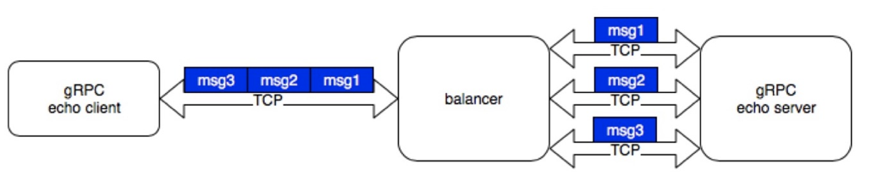

Обратить внимание — поскольку `gRPC` работает по `HTTP/2`, то используется одно `TCP`-соединение. И дальше уже различные стримы проходят по нему. Здесь можно 
заметить, что соединение между клиентом и балансером устанавливается один раз и остается персистентным, а дальше балансер уже на каждый вызов балансирует 
нагрузку на разные бэкенды.

## Работа с таймаутами

```java
Response response = blockingStub.withDeadlineAfter(deadlineMs, TimeUnit.MILLISECONDS).sayHello(request);
```

Это устанавливает дедлайн на `100мс` с момента, когда клиентский `RPC` установлен до момента, когда клиент принимает ответ.

На стороне сервера сервер может запросить, нужно ли всё еще выполнять `RPC` вызов. Перед тем, как сервер начнет работу над ответом, очень важно проверить, есть 
ли еще клиент, ожидающий его. Это особенно важно сделать перед началом дорогостоящей обработки.

```java
if (Context.current().isCancelled()) {
  responseObserver.onError(Status.CANCELLED.withDescription("Cancelled by client").asRuntimeException());
  return;
}
```
 
Нужно ли серверу продолжать выполнение запроса, если вы знаете, что ваш клиент достиг отвалился по таймауту? Зависит от ситуации. Если ответ можно кэшировать 
на сервере, стоит его обработать и кэшировать; особенно если он требует больших ресурсов и требует денег за каждый запрос. Это ускорит выполнение будущих 
запросов, поскольку результат уже будет доступен.

Что, если вы установили таймаут, но новая версия или серверная версия вызывает плохой регресс? Таймаут может быть слишком маленьким, что приведет к тому, что 
все ваши запросы истекут с `DEADLINE_EXCEEDED`, или слишком большим, и задержка вашего пользовательского запроса теперь огромна. Вы можете использовать флаг, 
чтобы установить и отрегулировать таймаут.

```java
@Option(name="--deadline_ms", usage="Deadline in milliseconds.")
private int deadlineMs = 20*1000;

response = blockingStub.withDeadlineAfter(deadlineMs, TimeUnit.MILLISECONDS).sayHello(request);
```

Теперь таймаут можно отрегулировать, чтобы ждать дольше, чтобы избежать сбоя. Это позволяет смягчить проблему для пользователей до тех пор, пока регресс не 
будет устранен и устранен.

## Grpc vs Rest


* **Protobuf (строгая типизация) вместо JSON / XML**
* **Построен на HTTP 2 вместо HTTP 1.1**
* **Двухсторонняя потоковая передача данных, наряду с традиционной (унарной)**
* **Встроенная генерация кода вместо использования сторонних инструментов**
* **Передача сообщений в 7-10 раз быстрее**

### Когда лучше использовать REST или gRPC?

Давайте сравним, когда вам следует рассмотреть возможность использования REST API и gRPC API:

### Когда использовать REST API

Независимо от того, создаете ли вы внутреннюю систему или открытую систему, которая предоставляет свои ресурсы остальному миру, REST API, вероятно, останутся фактическим выбором для интеграции приложений в течение очень долгого времени. Кроме того, REST API идеально подходят, когда системе требуется высокоскоростная итерация и стандартизация протокола HTTP. Благодаря универсальной поддержке сторонних инструментов REST API должны быть вашим первым аргументом в пользу интеграции приложений, интеграции микросервисов и разработки веб-сервисов.

### Когда использовать gRPC API

Что касается gRPC, в большинстве сторонних инструментов по-прежнему отсутствуют встроенные функции для совместимости с gRPC. Таким образом, gRPC в основном используется для создания внутренних систем, то есть инфраструктуры, закрытой для внешних пользователей. С учетом этого предостережения, API-интерфейсы gRPC могут быть полезны в следующих случаях:

* Соединения с микросервисами: связь с низкой задержкой и высокой пропускной способностью gRPC делает его особенно полезным для подключения архитектур, состоящих из легких микросервисов, где эффективность передачи сообщений имеет первостепенное значение.
* Системы где используется несколько языков программирования: благодаря поддержке генерации собственного кода для широкого спектра языков разработки, gRPC отлично подходит для управления соединениями в среде с наличием нескольких языков.
* Потоковая передача в реальном времени: когда требуется связь в реальном времени, способность gRPC управлять двунаправленной потоковой передачей позволяет вашей системе отправлять и получать сообщения в режиме реального времени, не дожидаясь ответа отдельного клиента.
* Сети с низким энергопотреблением и низкой пропускной способностью: использование gRPC сериализованных сообщений Protobuf обеспечивает легкий обмен сообщениями, большую эффективность и скорость для сетей с ограниченным диапазоном пропускания и маломощных сетей (особенно по сравнению с JSON). Интернет вещей может быть примером такой сети, в которой могут быть полезны API gRPC.

## Полезные ссылки

[gRPC в качестве протокола межсервисного взаимодействия. Доклад Яндекса - habr](https://habr.com/ru/company/yandex/blog/484068/)

[gRPC and Deadlines - grpc.io](https://grpc.io/blog/deadlines/)
# HTTP

`HTTP` — широко распространённый протокол передачи данных, изначально предназначенный для передачи гипертекстовых документов (то есть документов, которые могут 
содержать ссылки, позволяющие организовать переход к другим документам).

Аббревиатура `HTTP` расшифровывается как `HyperText Transfer Protocol`, «протокол передачи гипертекста». В соответствии со спецификацией `OSI`, `HTTP` является 
протоколом прикладного (верхнего, 7-го) уровня.

Протокол `HTTP` предполагает использование клиент-серверной структуры передачи данных. Клиентское приложение формирует запрос и отправляет его на сервер, после 
чего серверное программное обеспечение обрабатывает данный запрос, формирует ответ и передаёт его обратно клиенту. После этого клиентское приложение может 
продолжить отправлять другие запросы, которые будут обработаны аналогичным образом.

Задача, которая традиционно решается с помощью протокола `HTTP` — обмен данными между пользовательским приложением, осуществляющим доступ к веб-ресурсам 
(обычно это веб-браузер) и веб-сервером. На данный момент именно благодаря протоколу `HTTP` обеспечивается работа Всемирной паутины.

Также `HTTP` часто используется как протокол передачи информации для других протоколов прикладного уровня, таких как `SOAP`, `XML-RPC` и `WebDAV`. В таком 
случае говорят, что протокол `HTTP` используется как «транспорт».

`API` многих программных продуктов также подразумевает использование `HTTP` для передачи данных — сами данные при этом могут иметь любой формат, например, 
`XML` или `JSON`.

Как правило, передача данных по протоколу `HTTP` осуществляется через `TCP/IP`-соединения. Серверное программное обеспечение при этом обычно использует `TCP`-
порт 80 (и, если порт не указан явно, то обычно клиентское программное обеспечение по умолчанию использует именно 80-й порт для открываемых `HTTP`-соединений), 
хотя может использовать и любой другой.

## Ключевые отличия HTTP2 и HTTP1.1

- `HTTP2` является двоичным, а не текстовым
- `HTTP2` полностью мультиплексирован, а не упорядочен и блокирован
- `HTTP2` Следовательно, может использовать одно соединение для параллелизма
- `HTTP2` использует сжатие заголовков для уменьшения накладных расходов
- `HTTP2` позволяет серверам активно «проталкивать» ответы в кеши клиентов

## Как отправить HTTP-запрос?

Самый простой способ разобраться с протоколом `HTTP` — это попробовать обратиться к какому-нибудь веб-ресурсу вручную. Представьте, что вы браузер, и у вас 
есть пользователь, который очень хочет прочитать статьи Анатолия Ализара.

Предположим, что он ввёл в адресной строке следующее:

```
http://alizar.habrahabr.ru/
```

Соответственно вам, как веб-браузеру, теперь необходимо подключиться к веб-серверу по адресу `alizar.habrahabr.ru`.

Для этого вы можете воспользоваться любой подходящей утилитой командной строки. Например, `telnet`:

```
telnet alizar.habrahabr.ru 80
```

Сразу уточню, что если вы вдруг передумаете, то нажмите `Ctrl + «]»`, и затем ввод — это позволит вам закрыть `HTTP`-соединение.

После того, как вы подключитесь к серверу, нужно отправить `HTTP`-запрос. Это, кстати, очень легко — `HTTP`-запросы могут состоять всего из двух строчек.

Для того, чтобы сформировать `HTTP`-запрос, необходимо составить стартовую строку, а также задать по крайней мере один заголовок — это заголовок `Host`, 
который является обязательным, и должен присутствовать в каждом запросе. Дело в том, что преобразование доменного имени в `IP`-адрес осуществляется на стороне 
клиента, и, соответственно, когда вы открываете `TCP`-соединение, то удалённый сервер не обладает никакой информацией о том, какой именно адрес использовался 
для соединения: это мог быть, например, адрес `alizar.habrahabr.ru`, `habrahabr.ru` или `m.habrahabr.ru` — и во всех этих случаях ответ может отличаться. 
Однако фактически сетевое соединение во всех случаях открывается с узлом `212.24.43.44`, и даже если первоначально при открытии соединения был задан не этот 
`IP`-адрес, а какое-либо доменное имя, то сервер об этом никак не информируется — и именно поэтому этот адрес необходимо передать в заголовке `Host`.

## А что с безопасностью?

Сам по себе протокол `HTTP` не предполагает использование шифрования для передачи информации. Тем не менее, для `HTTP` есть распространённое расширение, 
которое реализует упаковку передаваемых данных в криптографический протокол `SSL` или `TLS`.

Название этого расширения — `HTTPS` (`HyperText Transfer Protocol Secure`). Для `HTTPS`-соединений обычно используется `TCP`-порт 443. `HTTPS` широко 
используется для защиты информации от перехвата, а также, как правило, обеспечивает защиту от атак вида `man-in-the-middle` — в том случае, если сертификат 
проверяется на клиенте, и при этом приватный ключ сертификата не был скомпрометирован, пользователь не подтверждал использование неподписанного сертификата, и 
на компьютере пользователя не были внедрены сертификаты центра сертификации злоумышленника.

На данный момент `HTTPS` поддерживается всеми популярными веб-браузерами.

## Методы

`HTTP` определяет множество методов запроса, которые указывают, какое желаемое действие выполнится для данного ресурса. Несмотря на то, что их названия могут 
быть существительными, эти методы запроса иногда называются `HTTP` глаголами. Каждый реализует свою семантику, но каждая группа команд разделяет общие 
свойства: так, методы могут быть безопасными, идемпотентными или кэшируемыми.

- `GET` - запрашивает представление ресурса. Запросы с использованием этого метода могут только извлекать данные.
- `HEAD` - запрашивает ресурс так же, как и метод `GET`, но без тела ответа.
- `POST` - используется для отправки сущностей к определённому ресурсу. Часто вызывает изменение состояния или какие-то побочные эффекты на сервере.
- `PUT` - заменяет все текущие представления ресурса данными запроса.
- `PATCH` - используется для частичного изменения ресурса.
- `DELETE` - удаляет указанный ресурс.
- `CONNECT` - устанавливает "туннель" к серверу, определённому по ресурсу.
- `OPTIONS` - используется для описания параметров соединения с ресурсом.
- `TRACE` - выполняет вызов возвращаемого тестового сообщения с ресурса.

## Безопасные методы 

Метод `HTTP` является безопасным, если он не меняет состояние сервера. Другими словами, безопасный метод проводит операции "только чтение" (`read-only`). 
Несколько следующих методов `HTTP` безопасные: `GET`, `HEAD` или `OPTIONS`. **Все безопасные методы являются также идемпотентными**, как и некоторые другие, но 
при этом небезопасные, такие как PUT или DELETE.

Даже если безопасные методы являются по существу "только для чтения", сервер всё равно может сменить своё состояние: например, он может сохранять статистику. 
Что существенно, так то, когда клиент вызывает безопасный метод, то он не запрашивает никаких изменений на сервере, и поэтому не создаёт дополнительную 
нагрузку на сервер. Браузеры могут вызывать безопасные методы, не опасаясь причинить вред серверу: это позволяет им выполнять некоторые действия, например, 
предварительная загрузка без риска. Поисковые роботы также полагаются на вызовы безопасных методов.

Безопасные методы не обязательно должны обрабатывать только статичные файлы; сервер может генерировать ответ "на-лету", пока скрипт, генерирующий ответ, 
гарантирует безопасность: он не должен вызывать внешних эффектов, таких как формирование заказов, отправка писем и др..

Правильная реализация безопасного метода - это ответственность серверного приложения, потому что сам веб-сервер, будь то `Apache`, `nginx`, `IIS` это соблюсти 
не сможет. В частности, приложение не должно разрешать изменение состояния сервера запросами `GET`.

Вызов безопасного метода, не меняющего состояния сервера:

```
GET /pageX.html HTTP/1.1
```

Вызов небезопасного метода, который может поменять состояние сервера:

```
POST /pageX.html HTTP/1.1 
```

Вызов идемпотентного, но небезопасного метода:

```
DELETE /idX/delete HTTP/1.1
```

## Идемпотентный метод

Метод `HTTP` является идемпотентным, если повторный идентичный запрос, сделанный один или несколько раз подряд, имеет один и тот же эффект, не изменяющий 
состояние сервера. Другими словами, идемпотентный метод не должен иметь никаких побочных эффектов (`side-effects`), кроме сбора статистики или подобных 
операций. Корректно реализованные методы `GET`, `HEAD`, `PUT` и `DELETE` идемпотентны, но не метод `POST`. Также все безопасные методы являются идемпотентными.

Для идемпотентности нужно рассматривать только изменение фактического внутреннего состояния сервера, а возвращаемые запросами коды статуса могут отличаться: 
первый вызов `DELETE` вернёт код 200, в то время как последующие вызовы вернут код `404`. Из идемпотентности `DELETE` неявно следует, что разработчики не 
должны использовать метод `DELETE` при реализации `RESTful API` с функциональностью удалить последнюю запись.

Обратите внимание, что идемпотентность метода не гарантируется сервером, и некоторые приложения могут нарушать ограничение идемпотентности.

`GET /pageX HTTP/1.1` идемпотентен. Вызвавший несколько раз подряд этот запрос, клиент получит тот же результат:

```
GET /pageX HTTP/1.1   
GET /pageX HTTP/1.1   
GET /pageX HTTP/1.1   
GET /pageX HTTP/1.1   
```

`POST /add_row HTTP/1.1` не идемпотентен; если его вызвать несколько раз, то он добавит несколько строк:

```
POST /add_row HTTP/1.1
POST /add_row HTTP/1.1   -> Adds a 2nd row
POST /add_row HTTP/1.1   -> Adds a 3rd row
```

`DELETE /idX/delete HTTP/1.1` идемпотентен, даже если возвращаемый код отличается:

```
DELETE /idX/delete HTTP/1.1   -> Returns 200 if idX exists
DELETE /idX/delete HTTP/1.1   -> Returns 404 as it just got deleted
DELETE /idX/delete HTTP/1.1   -> Returns 404
```

## Кэшируемые методы

Кэшируемые ответы - это `HTTP`-ответы, которые могут быть закэшированы, то есть сохранены для дальнейшего восстановления и использования позже, тем самым 
снижая число запросов к серверу. Не все `HTTP`-ответы могут быть закэшированы. Вот несколько ограничений:
- Метод, используемый в запросе, кэшируемый, если это `GET` или `HEAD`. Ответ для `POST` или `PATCH` запросов может также быть закэширован, если указан признак 
"свежести" данных и установлен заголовок `Content-Location`, но это редко реализуется. (Например, Firefox не поддерживает это). Другие методы, такие как `PUT` 
и `DELETE` не кэшируемые, и результат их выполнения не кэшируется.
- Коды ответа, известные системе кэширования, которые рассматриваются как кэшируемые: `200, 203, 204, 206, 300, 301, 404, 405, 410, 414, 501`.
- Отсутствуют специальные заголовки в ответе, которые предотвращают кэширование: например, `Cache-Control`.

Обратите внимание, что некоторые некэшируемые запросы-ответы к определённым `URI` могут сделать недействительным (инвалидируют) предыдущие закэшированные 
ответы на тех же `URI`. Например, `PUT` к странице `pageX.html` инвалидируют все закэшированные ответы `GET` или `HEAD` запросов к этой странице.

Когда и метод запроса и статус ответа кэшированы, то ответ к запросу тоже может быть закэширован:

```
GET /pageX.html HTTP/1.1
(…) 

200 OK
(…)
```

Запрос `PUT` не может быть закэширован. Более того, он инвалидирует закэшированные данные запросов к тому же `URI`, сделанных через `HEAD` или `GET`:

```
PUT /pageX.html HTTP/1.1
(…)

200 OK
(…)
```

Специальный заголовок `Cache-Control` в ответе может предотвратить кэширование:

```
GET /pageX.html HTTP/1.1
(…)

200 OK
Cache-Control: no-cache
(…)
```

## Коды ответа

Код ответа (состояния) `HTTP` показывает, был ли успешно выполнен определённый `HTTP` запрос. Коды сгруппированы в 5 классов:

|Группа           |Коды     |
|-----------------|---------|
|Информационные   |100 - 199|
|Успешные         |200 - 299|
|Перенаправления  |300 - 399|
|Клиентские ошибки|400 - 499|
|Серверные ошибки |500 - 599|

Если Вы получли код ответа (состояния), которого нет в данном списке, в таком случае он является не стандартизированным кодом ответа (состояния), вероятней 
всего это кастомный код ответа сервера.

## Заголовки

Заголовки - это специальные параметры, которые несут определенную служебную информацию о соединении по `HTTP`. Некоторые заголовки имеют лишь информационный 
характер для пользователя или для компьютера, другие передают определенные команды, исходя из которых, сервер или клиент будет выполнять какие-то действия.

В зависимости от того, где эти заголовки могут находиться, они разделяются на:

- `General Headers` (Основные заголовки) — должны быть и в запросах и в ответах клиента и сервера.
- `Request Headers` (Заголовки запроса) — используются только в запросах клиента.
- `Response Headers` (Заголовки ответа) — используются только в ответах сервера.
- `Entity Headers` (Заголовки сущности) — сопровождают каждую сущность сообщения.

Каждый заголовок имеет следующий вид:

```
параметр: значение
```

Немного о правилах написания, что нужно иметь в виду:

- Регистр (большие или маленькие буквы) здесь не учитываются. Можно писать и так и так.
- Пишутся латинскими буквами.
- После параметра должен идти символ двоеточия (`:`)
- Окончанием пары «`параметр:значение`» служит символ переноса строки.

Вот, примеры некоторых заголовков:

```
Host: webkyrs.info
User-Agent: Mozilla/5.0 (Windows NT 6.1; rv:18.0) Gecko/20100101 Firefox/18.0
Accept: text/html,application/xhtml+xml,application/xml;q=0.9,*/*;q=0.8
Accept-Language: ru-RU,ru;q=0.8,en-US;q=0.5,en;q=0.3
```

## Cookies

#### Что такое файлы cookies и зачем они нужны

`Cookies` — это небольшие текстовые файлы у нас на компьютерах, в которых хранится информация о наших предыдущих действиях на сайтах. Кроме входов в аккаунты 
они умеют запоминать:

- предпочтения пользователей, например, язык, валюту или размер шрифта.
- товары, которые мы просматривали или добавили в корзину;
- текст, который мы вводили на сайте раньше;
- IP-адрес и местоположение пользователя;
- дату и время посещения сайта;
- версию ОС и браузера;
- клики и переходы.

#### Как работают cookies

Когда мы совершаем на сайте какое-то действие, например, добавляем товар в корзину или вводим детали входа в аккаунт, сервер записывает эту информацию в куки и 
отправляет браузеру вместе со страницей. Когда мы переходим на другую страницу сайта или заходим на него через время, браузер отправляет куки обратно.

Куки бывают временными и постоянными. Постоянные куки остаются на компьютере, когда мы закрываем вкладку с сайтом, а временные удаляются. Какие именно куки 
использовать на конкретном сайте — временные или постоянные — решает его разработчик. Именно поэтому на одних сайтах мы не выходим из аккаунтов, даже когда 
заходим на них раз спустя несколько дней, а на других вводим пароль заново, хотя отошли от компьютера на пять минут.

#### Cookies и безопасность

Сами по себе куки не опасны — это обычные текстовые файлы. Они не могут запускать процессы на компьютере и вообще взаимодействовать с операционной системой. Но 
их могут попытаться перехватить или украсть, чтобы отследить ваши предыдущие действия в сети или входить в ваши аккаунты без авторизации.

Обычно информацию, которую записывают в куки, зашифровывают перед отправкой, а сами куки передают по `HTTPS`-протоколу. Это помогает защитить пользовательские 
данные, но за внедрение шифрования и безопасную отправку отвечает разработчик сайта. Посетителям остаётся только надеяться, что всё настроили грамотно. Со 
своей стороны пользователь может только запретить браузеру использовать куки или время от времени чистить их самостоятельно.

Совсем отключать куки — не всегда хорошая идея. Например, все интернет-магазины работают с помощью куки. Если запретить браузеру их использовать, сервер не 
сможет запомнить, что именно вы добавили в корзину. Чистить куки вручную практичнее, но придётся каждый раз заново настраивать внешний вид сайта и входить в 
аккаунты.

## Что происходит, когда пользователь набирает в браузере адрес сайта

#### Пользователь вводит в браузере адрес сайта

```
vc.ru
```

#### Браузер начинает искать сервер

За работу любого сайта обычно отвечает один из миллионов серверов, подключенных к интернету. Адрес сервера — это уникальный набор цифр, который называется 
`IP`-адресом. Например, для `vc.ru` — это сервер `85.119.149.83`.

Поэтому первым делом браузеру нужно понять, какой `IP`-адрес у сервера, на котором находится сайт.

Такая информация хранится в распределенной системе серверов — `DNS` (`Domain Name System`). Система работает как общая «контактная книга», хранящаяся на 
распределенных серверах и устройствах в интернете.

Однако перед тем, как обращаться к `DNS`, браузер пытается найти запись об `IP`-адресе сайта в ближайших местах, чтобы сэкономить время:
- Сначала в своей истории подключений. Если пользователь уже посещал сайт, то в браузере могла сохраниться информация c `IP`-адресом сервера.
- В операционной системе. Не обнаружив информации у себя, браузер обращается к операционной системе, которая также могла сохранить у себя `DNS`-запись. 
Например, если подключение с сайтом устанавливалось через одно из установленных на компьютере приложений.
- В кэше роутера, который сохраняет информацию о последних соединениях, совершенных из локальной сети.

#### Браузер отправляет запрос к DNS-серверам

Не обнаружив подходящих записей в кэше, браузер формирует запрос к `DNS`-серверам, расположенным в интернете.

Например, если нужно найти `IP`-адрес сайта `mail.vc.ru`, браузер спрашивает у ближайшего `DNS`-сервера «Какой IP-адрес у сайта mail.vc.ru?».

Сервер может ответить: «Я не знаю про mail.vc.ru, но знаю сервер, который отвечает за vc.ru». Запрос переадресовывается дальше, на сервер «выше», пока в итоге 
один из серверов не найдет ответ об `IP`-адресе для сайта.


#### Браузер устанавливает соединение с сервером

Как только браузер узнал `IP`-адрес нужного сервера, он пытается установить с ним соединение. В большинстве случаев для этого используется специальный протокол 
— `TCP`.

`TCP` — это набор правил, который описывает способы соединения между устройствами, форматы отправки запросов, действия в случае потери данных и так далее.

Например, для установки соединения между браузером и сервером в стандарте `TCP` используется система «трёх рукопожатий». Работает она так:
- Устройство пользователя отправляет специальный запрос на установку соединения с сервером — называется `SYN`-пакет.
- Сервер в ответ отправляет запрос с подтверждением получения `SYN`-пакета — называется `SYN/ACK`-пакет.
- В конце устройство пользователя при получении `SYN/ACK`-пакета отправляет пакет с подтверждением — `ACK`-пакет. В этот момент соединение считается 
установленным.

#### Браузер отправляет HTTP-запрос, чтобы получить контент сайта

После установки соединения браузер отправляет специальный запрос, в котором просит сервер отправить данные для отображения страницы. В этом запросе содержится 
информация о самом браузере, временные файлы, требования к соединению и так далее.

Задача браузера — как можно подробнее объяснить серверу, какая именно информация ему нужна.

В общении браузера и сервера выделяют два типа запросов. `GET`-запрос используется для получения данных с сервера — например, отобразить картинку, текст или 
видео. `POST`-запрос — используется для отправки данных из браузера на сервер, например, когда пользователь отправляет сообщение, картинку или загружает файл.


> Почти все сайты обмениваются информацией с сервером в зашифрованном формате — с помощью `HTTPS`-протокола. В отличие от `HTTP`-протокола, в `HTTPS` 
используется шифрование, а безопасность подключения подтверждается специальным сертификатом.

#### Сервер обрабатывает запрос

Сервер получил запрос от браузера с подробным описанием того, что ему требуется. Теперь ему нужно обработать этот запрос. Этой задачей занимается специальное 
серверное программное обеспечение — например, `nginx` или `Apache`. Чаще всего такие программы принято называть веб-серверами.

Веб-сервер в свою очередь перенаправляет запрос на дальнейшую обработку к программе-обработчику — например, `PHP`, `Ruby` или `ASP.NET`. Программа внимательно 
изучает содержимое запроса — например, понимает, в каком формате нужно отправить ответ и какие именно файлы нужны. И собирает ответ.

#### Сервер отправляет ответ браузеру

Когда ответ сформирован, он отправляется веб-сервером обратно браузеру. В ответе как правило содержится контент для отображения веб-страницы, информация о типе 
сжатия данных, способах кэширования, файлы cookie, которые нужно записать и так далее.

> Чтобы обмен данными был быстрым, браузер и сервер обмениваются сразу множеством небольших пакетов данных — как правило, в пределах `8 КБ`. Все пакеты имеют 
специальные номера, которые помогают отслеживать последовательность отправки и получения данных.

#### Браузер обрабатывает полученный ответ и «рисует» веб-страницу

Браузер распаковывает полученный ответ и постепенно начинает отображать полученный контент на экране пользователя — этот процесс называется `рендерингом`.

Сначала браузер загружает только основную структуру `HTML`-страницы. Затем последовательно проверяет все теги и отправляет дополнительные `GET`-запросы для 
получения с сервера различных элементов — картинки, файлы, скрипты, таблицы стилей и так далее. Поэтому по мере загрузки страницы браузер и сервер продолжают 
обмениваться между собой информацией.

Параллельно с этим на компьютер как правило сохраняются статичные файлы пользователя — чтобы при следующем посещении не загружать их заново и быстрее 
отобразить пользователю содержимое страницы.

Как только рендеринг завершен — пользователю отобразится полностью загруженная страница сайта.


## Как отправить файл по HTTP?

Аттрибут `enctype="multipart/form-data"`

```html
<form action="upload" method="POST" enctype="multipart/form-data">
    <input type="file" name="myfile">
    <br/>
    <input type="submit" name="Submit">
</form>
```

```java
public class PostFile {
  public static void main(String[] args) throws Exception {
    HttpClient httpclient = new DefaultHttpClient();
    httpclient.getParams().setParameter(CoreProtocolPNames.PROTOCOL_VERSION, HttpVersion.HTTP_1_1);

    HttpPost httppost = new HttpPost("http://localhost:9000/upload");
    File file = new File("C:\\Users\\joao\\Pictures\\bla.jpg"");

    MultipartEntity mpEntity = new MultipartEntity();
    ContentBody cbFile = new FileBody(file, "image/jpeg");
    mpEntity.addPart("userfile", cbFile);

    httppost.setEntity(mpEntity);
    System.out.println("executing request " + httppost.getRequestLine());
    HttpResponse response = httpclient.execute(httppost);
    HttpEntity resEntity = response.getEntity();

    System.out.println(response.getStatusLine());
    if (resEntity != null) {
      System.out.println(EntityUtils.toString(resEntity));
    }
    if (resEntity != null) {
      resEntity.consumeContent();
    }

    httpclient.getConnectionManager().shutdown();
  }
}
```

## Что такое CORS (Cross-origin resource sharing)?

Во фронтенде часто требуется отобразить данные, которые хранятся в другом месте. Перед этим браузер должен направить запрос серверу: клиент отправляет `HTTP`-
запрос со всей информацией, которая нужна серверу, чтобы вернуть данные.

Представим, что нам надо получить информацию о пользователях для нашего сайта `www.mywebsite.com` с сервера, который находится по адресу `api.website.com`.


Сработало. Мы отправили `HTTP`-запрос на сервер, который вернул нужные нам данные в формате `JSON`. А теперь давайте попытаемся отправить точно такой же 
запрос, но с другого домена: вместо `www.mywebsite.com` возьмём `www.anotherdomain.com`.


Что произошло? Мы отправили такой же запрос, но на этот раз браузер выдал странную ошибку. Мы только что увидели `CORS` в действии. Давайте разберёмся, почему 
возникла эта ошибка, и что она означает.

#### Правило одинакового источника (Same-Origin Policy)

В веб внедрено так называемое правило одинакового источника. По умолчанию мы можем получить доступ к ресурсам только в том случае, если источник этих ресурсов 
и источник запроса совпадают. К примеру, мы сможем без проблем загрузить изображение, которое находится по адресу `https://mywebsite.com/image1.png`.

Ресурс считается принадлежащим к другому источнику (`cross-origin`), если он располагается на другом домене/поддомене, протоколе или порте.


Это, конечно, здорово, но для чего правило одинакового источника вообще существует?

Представим, что это правило не работает, а вы случайно нажали на какую-то вирусную ссылку, которую прислала ваша тётушка на Фейсбуке. Ссылка перенаправляет вас 
на мошеннический сайт, который с помощью фрейма загружает интерфейс сайта вашего банка и успешно залогинивает вас с помощью сохранённых куки.

Разработчики этого мошеннического сайта сделали так, чтобы он имел доступ к фрейму и мог взаимодействовать с `DOM` сайта вашего банка — так они смогут 
переводить деньги на свой счёт от вашего имени.


Да, это огромная угроза безопасности — мы ведь не хотим, чтобы кто угодно имел доступ к чему угодно.

К счастью, здесь приходит на помощь правило одинакового источника: оно гарантирует, что мы можем получить доступ только к ресурсам из того же самого источника.


В данном случае сайт `www.evilwebsite.com` попытался получить доступ к ресурсам из другого источника — `www.bank.com`. Правило одинакового источника 
заблокировало это действие. В результате разработчики мошеннического сайта не смогли добраться до нашей банковской информации.

> Но какое отношение всё это имеет к `CORS`?

#### CORS на стороне клиента

Несмотря на то, что правило одинакового источника применяется исключительно к скриптам, браузеры распространили его и на `JavaScript`-запросы: по умолчанию 
можно получить доступ к ресурсам только из одинакового источника.


Но нам ведь часто нужно обращаться к ресурсам из других источников. Может, тогда фронтенду стоит взаимодействовать с `API` на бэкенде, чтобы загружать данные? 
Чтобы обеспечить безопасность запросов к другим источникам, браузеры используют механизм под названием `CORS`.

Аббревиатура `CORS` расшифровывается как `Cross-Origin Resource Sharing` (Технология совместного использования ресурсов между разными источниками). Несмотря на 
то, что браузеры не позволяют получать доступ к ресурсам из разных источников, можно использовать `CORS`, чтобы внести небольшие коррективы в эти ограничения и 
при этом быть уверенным, что доступ будет безопасным.

Пользовательские агенты (к примеру, браузеры) на основе значений определённых заголовков для `CORS` в `HTTP`-запросе могут проводить запросы к другим 
источникам, которые без `CORS` были бы заблокированы.

Когда происходит запрос к другому источнику, клиент автоматически подставляет дополнительный заголовок `Origin` в `HTTP`-запрос. Значение этого заголовка 
отражает источник запроса.


Чтобы браузер разрешил доступ к ресурсам из другого источника, он должен получить определённые заголовки в ответе от сервера, которые указывают, разрешает ли 
сервер запросы из других источников.

#### CORS на стороне сервера

Разрабатывая бэкенд, мы, чтобы разрешить запросы из других источников, можем добавить в `HTTP`-ответ дополнительные заголовки, начинающиеся с 
`Access-Control-*`. На основе значений этих `CORS`-заголовков браузер сможет разрешить определённые запросы из других источников, которые обычно блокируются 
правилом одинакового источника.

Существует несколько `CORS`-заголовков, но браузеру нужен всего один из них, чтобы разрешить доступ к ресурсам из разных источников — 
`Access-Control-Allow-Origin`. Его значение определяет, из каких источников можно получить доступ к ресурсам на сервере.
Если мы создаём сервер, к которому должен иметь доступ сайт `https://mywebsite.com`, то нужно внести этот домен в значение заголовка 
`Access-Control-Allow-Origin.`


Отлично, теперь мы можем получать ресурсы из другого источника. А что будет, если мы попытаемся получить к ним доступ из источника, который не указан в 
заголовке `Access-Control-Allow-Origin`?


```
Allowed Origins - Разрешённые источники
The request has an allowed origin - Источник запроса разрешён
```

Да, теперь `CORS` выдаёт эту печально известную ошибку, которая иногда всех нас так расстраивает. Но сейчас нам понятно, какой смысл она несет.

```
The 'Access-Control-Allow-Origin' header has a value 'https://www.mywebsite.com' that is not equal 
to the supplied origin.
(Значение 'https://www.mywebsite.com' заголовка 'Access-Control-Allow-Origin' не совпадает с представленным источником)
```

В данном случае в качестве источника выступал сайт `https://www.anotherwebsite.com` — его не было в списке разрешённых источников в заголовке `Access-Control-
Allow-Origin`. `CORS` успешно заблокировал запрос, и мы не можем получить доступ к запрашиваемым данным.

> В качестве значения разрешённых источников CORS позволяет указать спецсимвол `*`. Он означает, что доступ к ресурсам открыт из всех источников, поэтому 
используйте его с осторожностью.

Кроме `Access-Control-Allow-Origin`, мы можем использовать и многие другие `CORS`-заголовки. Бэкенд-разработчик может изменить правила `CORS` на сервере так, 
чтобы разрешать/блокировать определённые запросы.

Ещё один довольно распространённый заголовок — `Access-Control-Allow-Methods`. С ним будут разрешены только те запросы из других источников, которые выполнены 
с применением перечисленных методов.


```
Allowed Origins - Разрешённые источники
Allowed Methods - Разрешённые методы
```

В данном случае разрешены только запросы с методами `GET`, `POST`, или `PUT`. Запросы с другими методами (например, `PATCH` или `DELETE`) будут блокироваться.

С `PUT`, `PATCH` и `DELETE` CORS работает с по-другому. В этих “непростых” случаях используются так называемые предварительные запросы (`preflight requests`).

#### Предварительные запросы

Существует два типа `CORS`-запросов: **простые** и **предварительные**. Тип запроса зависит от хранящихся в нём значений (не волнуйтесь, здесь не надо будет 
ничего запоминать).

Запрос считается простым, если в нём используются методы `GET` и `POST` и нет никаких пользовательских заголовков. Любые другие запросы (например, с методами 
`PUT`, `PATCH` или `DELETE`) — предварительные.

Но что означают и почему существуют “предварительные запросы”?

Перед отправкой текущего запроса клиент сначала генерирует предварительный запрос: в своих заголовках `Access-Control-Request-*` он содержит информацию о 
текущем запросе. Это позволяет серверу узнать метод, дополнительные заголовки и другие параметры запроса, который браузер пытается отправить.


```
Actual Request — Текущий запрос
Preflighted Request — Предварительный запрос
```

Сервер получает этот предварительный запрос и отправляет обратно пустой `HTTP`-ответ с `CORS`-заголовками сервера. Браузер в свою очередь получает 
предварительный ответ (только `CORS`-заголовки) и проверяет, разрешён ли `HTTP`-запрос.


```
The request has an allowed origin - Источник запроса разрешён
The request has an allowed method - Метод запроса разрешён
Preflight Response - Предварительный ответ
```

Если всё в порядке, браузер посылает текущий запрос на сервер, а тот в ответ присылает данные, которые мы запрашивали.


Если же возникает проблема, `CORS` блокирует предварительный запрос, а текущий вообще уже не будет отправлен. Предварительный запрос — отличный способ уберечь 
нас от получения доступа или изменения ресурсов на серверах, у которых (пока что) не настроены правила `CORS`. Сервера защищены от потенциально нежелательных 
запросов из других источников.

> Чтобы уменьшить число обращений к серверу, можно кэшировать предварительные ответы, добавив к `CORS`-запросам заголовок `Access-Control-Max-Age`. Так браузеру не придётся каждый раз отправлять новый предварительный запрос.

#### Учётные данные

Куки, заголовки авторизации, `TLS`-сертификаты по умолчанию включены только в запросы из одинакового источника. Однако нам может понадобиться исполь
зовать учётные данные и в запросах из разных источников. Возможно, мы захотим включить куки в запрос, который сервер сможет использовать для идентификации 
пользователя.

В `CORS` по умолчанию отсутствуют учётные данные, но это можно изменить, добавив `CORS`-заголовок `Access-Control-Allow-Credentials`.

Если необходимо включить куки и другие заголовки авторизации в запрос из другого источника, нужно установить значение `true` в поле `withCredentials` запроса, 
а также добавить в ответ заголовок `Access-Control-Allow-Credentials`.


Готово — теперь мы можем включать учётные данные в запрос из другого источника.

Думаю, мы все согласимся с тем, что появление ошибок `CORS` порой расстраивает, но, тем не менее, здорово, что `CORS` позволяет безопасно отправлять запросы из 
разных источников в браузере — считаю, что мы должны любить эту технологию чуточку сильнее :)

## Полезные ссылки

[Простым языком об HTTP - habr](https://habr.com/ru/post/215117/)

[Методы HTTP запроса - developer.mozilla](https://developer.mozilla.org/ru/docs/Web/HTTP/Methods)

[Безопасный метод - developer.mozilla](https://developer.mozilla.org/ru/docs/%D0%A1%D0%BB%D0%BE%D0%B2%D0%B0%D1%80%D1%8C/safe)

[Идемпотентный метод - developer.mozilla](https://developer.mozilla.org/ru/docs/%D0%A1%D0%BB%D0%BE%D0%B2%D0%B0%D1%80%D1%8C/Idempotent)

[Кэшируемые методы - developer.mozilla](https://developer.mozilla.org/ru/docs/%D0%A1%D0%BB%D0%BE%D0%B2%D0%B0%D1%80%D1%8C/cacheable)

[HTTP статус коды - developer.mozilla](https://developer.mozilla.org/ru/docs/Web/HTTP/Status)

[Что такое файлы cookies и зачем они нужны - ssl.com.ua](https://ssl.com.ua/blog/what-are-cookies/)

[Что происходит, когда пользователь набирает в браузере адрес сайта - vc.ru](https://vc.ru/selectel/76371-chto-proishodit-kogda-polzovatel-nabiraet-v-brauzere-adres-sayta)

[Что стоит за простой загрузкой веб-странички в браузере. (Очень подробно) - medium](https://medium.com/genesis-media/%D1%87%D1%82%D0%BE-%D1%81%D1%82%D0%BE%D0%B8%D1%82-%D0%B7%D0%B0-%D0%BF%D1%80%D0%BE%D1%81%D1%82%D0%BE%D0%B9-%D0%B7%D0%B0%D0%B3%D1%80%D1%83%D0%B7%D0%BA%D0%BE%D0%B9-%D0%B2%D0%B5%D0%B1-%D1%81%D1%82%D1%80%D0%B0%D0%BD%D0%B8%D1%87%D0%BA%D0%B8-%D0%B2-%D0%B1%D1%80%D0%B0%D1%83%D0%B7%D0%B5%D1%80%D0%B5-3933c96467a)

[Безопасность наглядно: CORS - medium](https://medium.com/nuances-of-programming/%D0%BA%D0%BE%D0%BC%D0%BF%D1%8C%D1%8E%D1%82%D0%B5%D1%80%D0%BD%D0%B0%D1%8F-%D0%BD%D0%B0%D1%83%D0%BA%D0%B0-%D0%BD%D0%B0%D0%B3%D0%BB%D1%8F%D0%B4%D0%BD%D0%BE-cors-20a97786c18c)

[HTTP/2: the difference between HTTP/1.1, benefits and how to use it - medium](https://medium.com/@factoryhr/http-2-the-difference-between-http-1-1-benefits-and-how-to-use-it-38094fa0e95b)
# Kafka

Кафка предназначена для распределенных высокопроизводительных систем. `Kafka` имеет тенденцию работать очень хорошо как замена более традиционному брокеру 
сообщений. По сравнению с другими системами обмена сообщениями, `Kafka` имеет лучшую пропускную способность, встроенное разбиение, репликацию и собственную 
отказоустойчивость, что делает его подходящим для крупномасштабных приложений обработки сообщений.

## Kafka

Распределенное хранилище - система, которая как правило работает на нескольких машинах, каждая из этих машин в свою очередь является кусочком хранилища. Для пользователей это всё представляется в виде единого целого.

Преимущества таких хранилищ:
- Хорошее горизонтальное масштабирование
- Высокая отказоустойчивость


Вертикальное масштабирование - увеличение ресурсов для одной машины (cpu, ram и тд). Вертикальное масштабирование имеет пределы в виде ресурсов. Мы не можем скейлиться бесконечно.
Горизонтальное масштабирование - техника, в которой мы вместо увеличения мощностей одной машины, добавляем в систему дополнительные машины и тем самым увеличиваем доступные ресурсы.


Отказоустойчивость - свойство системы, позволяющее ей не иметь единую точку отказа. То есть если что-то пошло не так и какая-то машина вышла из строя, система сможет продолжить работу. Вплоть до того, что потеря целого датацентра не нарушит работу системы.


Кроме хранения данных и передачи их между разными частями инфраструктуры, Кафка также имеет поддержку потоковой обработки данных. Это нативный Kafka Streams или внешние фреймворки. Преимущество в том, что данные обрабатываются сразу как только попадают в Кафка.


Кафка - это распределенное, отказоустойчивое, горизонтально масштабируемое хранилище, основной структурой данных в котором является append-only лог, которое поддерживает потоковую обработку данных и имеет развитую систему коннекторов для интеграции с базами данных и другими хранилищами.


Почему Кафка, а не другие системы?
- Кафка может работать с большим числом продюсеров, не зависимо от того используют они один топик или несколько. Это делает технологию идеальной для агрегирования данных из внешних систем.
- Разработана таким образом, чтобы несколько консюмеров могли читать любой поток сообщений не мешая друг другу. Это отличает кафку от многих других систем очередей (где сообщение, полученное одним потребителем больше недоступно для других потребителей).
- Все сообщения хранятся на диске и имеют настраиваемые правила хранени (retention). Это дает возможность консюмерам перечитать данные из прошлого, вернуться назад. Даже если консюмер не будет успевать обрабатывать сообщения из-за скорости обработки или упавшей системы, то мы не потеряем данные.
- Положение консюмеров тоже сохраняется на диске. То есть мы всегда знаем на каком событии мы остановились.
- Может обрабатывать огромные потоки сообщений. Продюсеров, консюмеров и брокеров можно масштабировать горизонтально.


Примеры использование:
- Обычный брокер сообщений
- Клик стрим - обработка и отслеживание действий пользователей. Если кратко это сведения о просмотре страниц или отслеживании кликов пользователей на сайте или какие-то более сложные действия. Мы можем как просто сохранять эти данные, так и обрабатывать их в реальном времени.
- Журналирование и сбор метрик - передача данных в эластик или системы логирования
- База данных. Например, The New-York Times все свои статьи и правки за последние 166 лет хранит в Кафке. Данные там можно хранить вечно, вообще ничего не удаляя 

## Что такое система обмена сообщениями?

Система обмена сообщениями отвечает за передачу данных из одного приложения в другое, поэтому приложения могут сосредоточиться на данных, но не беспокоиться о
том, как ими обмениваться. Распределенный обмен сообщениями основан на концепции надежной очереди сообщений. Сообщения помещаются в очередь асинхронно между
клиентскими приложениями и системой обмена сообщениями. Доступны два типа шаблонов обмена сообщениями: один — «`точка-точка`» (`peer-to-peer`, `P2P`), а другой — система обмена
сообщениями «`публикация-подписка`» (`pub-sub`). Большинство шаблонов сообщений следуют `pub-sub`.

## Система обмена сообщениями `peer-to-peer`

В системе `peer-to-peer` сообщения сохраняются в очереди. Один или несколько потребителей могут потреблять сообщения в очереди, но конкретное сообщение может
потреблять максимум один консюмер. Как только консюмер прочитает сообщение в очереди, оно исчезнет из этой очереди. Типичным примером этой системы
является система обработки заказов, где каждый заказ обрабатывается одним обработчиком заказов, но несколько процессоров заказов могут работать одновременно.
Следующая диаграмма изображает структуру.


## Система обмена сообщениями `pub-sub`

В системе `pub-sub` сообщения сохраняются в топике. В отличие от двухточечной системы, консюмеры могут подписаться на один или несколько топиков и
использовать все сообщения в этой топике. В системе «`pub-sub`» продюсеры сообщений называются издателями, а консюмеры сообщений — подписчиками.
Примером из реальной жизни является `Dish TV`, который публикует различные каналы, такие как спортивные состязания, фильмы, музыка и т. Д., И любой может
подписаться на свой собственный набор каналов и получать их, когда доступны их подписанные каналы.


## Что такое Кафка?

`Apache Kafka` — это распределенная система обмена сообщениями «`pub-sub`» и надежная очередь, которая может обрабатывать большой объем данных и
позволяет передавать сообщения из одной конечной точки в другую. Кафка подходит как для автономного, так и для онлайн-рассылки сообщений. Сообщения `Kafka`
сохраняются на диске и реплицируются в кластере для предотвращения потери данных. `Kafka` построен поверх службы синхронизации `ZooKeeper`. Он очень хорошо
интегрируется с `Apache Storm` и `Spark` для анализа потоковых данных в реальном времени.

## Преимущества

- **Надежность** — Кафка распределяется, разбивается, тиражируется и отказоустойчива.
- **Масштабируемость** — Kafka легко масштабируется без простоев.
- **Долговечность** — Kafka использует распределенный журнал фиксации, который означает, что сообщения сохраняются на диске настолько быстро, насколько это
  возможно, а значит, и долговечны
- **Производительность** — Кафка обладает высокой пропускной способностью для публикации и подписки сообщений. Он поддерживает стабильную производительность
  даже при хранении многих ТБ сообщений.

`Kafka` очень быстрая и **гарантирует нулевое время простоя и нулевую потерю данных**.

## Случаи применения
- **Метрики** — Кафка часто используется для оперативного мониторинга данных. Это включает в себя агрегирование статистики из распределенных приложений для
  получения централизованных потоков оперативных данных.
- **Решение для агрегации журналов** — Kafka может использоваться в рамках всей организации для сбора журналов от нескольких служб и предоставления их в
  стандартном формате нескольким потребителям.
- **Потоковая обработка** — популярные платформы, такие как `Storm` и `Spark Streaming`, считывают данные из топика, обрабатывают их и записывают обработанные
  данные в новый топик, где они становятся доступными для пользователей и приложений. Высокая прочность Kafka также очень полезна в контексте потоковой обработки.

## Нужно для кафки

`Kafka` — это унифицированная платформа для обработки всех потоков данных в реальном времени. `Kafka` поддерживает доставку сообщений с низкой задержкой и дает
гарантию отказоустойчивости при наличии отказов машины. Он способен обрабатывать большое количество разнообразных потребителей. Кафка очень быстрая, выполняет
2 миллиона операций записи в секунду. Кафка сохраняет все данные на диск, что, по сути, означает, что все записи идут в кеш страниц ОС (ОЗУ). Это позволяет
очень эффективно передавать данные из кэша страниц в сетевой сокет.

## Основы

Прежде чем углубляться в `Kafka`, вы должны знать основные термины, такие как топики, брокеры, продюсеры и консюмеры. Следующая диаграмма иллюстрирует
основные термины, а таблица подробно описывает компоненты диаграммы.


На приведенной выше диаграмме топик разбит на три части (партишена). `Partition 1` имеет два офсета - 0 и 1. `Partition 2` имеет четыре офсета - 0,
1, 2 и 3. `Partition 3` имеет один коэффициент смещения - 0. Идентификатор реплики совпадает с идентификатором сервера, на котором она размещена.

Предположим, если коэффициент репликации для топика установлен на 3, то Kafka создаст 3 одинаковые реплики каждого партишена и поместит их в кластер, чтобы сделать
доступными для всех своих операций. Чтобы сбалансировать нагрузку в кластере, каждый брокер хранит один или несколько таких партишенов. Несколько производителей
и потребителей могут публиковать и получать сообщения одновременно.

- **Топик**: Поток сообщений, относящихся к определенной категории, называется топиком. Данные хранятся в топиках. Топики разбиты на партишены. Для каждого топика Кафка
  хранит минимум один партишен. Каждый такой партишен содержит сообщения в неизменной упорядоченной последовательности. Партишен реализован как набор файлов сегментов
  одинакового размера.
- **Партишен**: Топики могут иметь много партишенов, поэтому он может обрабатывать произвольный объем данных.
- **Офсет партишена**: Каждое секционированное сообщение имеет уникальный идентификатор последовательности, называемый офсетом.
- **Реплики партишена**: Реплики — это не что иное, как резервные копии партишена. Реплики никогда не читают и не записывают данные. Они используются для
  предотвращения потери данных.
- **Брокеры**: они действуют как канал между производителями и потребителями. Это набор серверов, на которых хранятся опубликованные сообщения.
- **Кафка кластер**: Kafka с несколькими брокерами называется кластером Kafka. Кластер Kafka может быть расширен без простоев. Эти кластеры используются для
  управления сохранением и репликацией данных сообщений.
- **Продюсеры**: это издатели сообщений на одну или несколько топиков Кафки. Продюсеры отправляют данные брокерам Kafka. Каждый раз, когда продюсер
  публикует сообщение для брокера, он просто добавляет сообщение в последний файл сегмента. На самом деле, сообщение будет добавлено в партишен. Продюсер
  также может отправлять сообщения в партишен по своему выбору.
- **Консюмеры**: Консюмеры читают данные от брокеров. Консюмеры подписываются на одну или несколько топиков и используют опубликованные сообщения, извлекая

## Кто такой лидер и последователь в Кафке?

Кафка создает партишены на основе офсетных и консюмерских групп. Каждый партишен в Кафке имеет сервер, который играет роль лидера. Один из них, являющийся
лидером, не может быть ни одного или нескольких серверов, которые будут выполнять функции последователя. Лидер назначил себе задачи, которые читают и пишут
запросы на партишены. Последователи, с другой стороны, должны следовать за лидером и копировать то, что говорит лидер. Если лидер вообще терпит неудачу, как в
реальной жизни, один из последователей должен взять на себя роль лидера. Это может произойти во время сбоев сервера. Это обеспечивает правильную балансировку
нагрузки на сервере, а также обеспечивает стабильность системы.

## Что такое реплика? Почему репликации считаются критическими в среде Кафки?

Список основных узлов, отвечающих за ведение журнала для любого конкретного партишена, называется репликой. Узел реплики не имеет значения, играет ли он роль
лидера или последователя. Жизненно важной причиной необходимости репликации является то, что они могут быть использованы снова в любом неопределенном случае
машинной ошибки, сбоя программы или сбоя системы из-за обычных частых обновлений. Чтобы убедиться, что никакие данные не потеряны или повреждена репликация,
убедитесь, что все сообщения опубликованы правильно и не потеряны.

## Что такое Zookeeper в Кафке? Можно ли использовать Кафку без Zookeeper?

Это основной вопрос интервью Кафки, заданный в интервью. `Zookeeper` используется для распределенных приложений, адаптированных Kafka. Это помогает Кафке
правильно управлять всеми источниками. `Zookeeper` - это высокопроизводительная программа с открытым исходным кодом, предоставляющая полный сервис координации.

Нет, невозможно пропустить `Zookeeper` и перейти непосредственно к брокеру Kafka. `Zookeeper` управляет всеми ресурсами Kafka и, следовательно, если
`Zookeeper` не работает, он не может обслуживать запросы клиентов на обслуживание. Основная задача `zookeeper` - быть каналом связи для различных узлов,
существующих в кластере. `Zookeeper` в Кафке используется для фиксации смещения. Если узел вообще выходит из строя, его можно легко извлечь из смещения,
которое было ранее зафиксировано. В дополнение к этому `zookeeper` также заботится о таких действиях, как обнаружение лидеров, распределенная синхронизация,
управление конфигурацией и т. Д. Кроме того, он также выполняет работу по идентификации нового узла, который покидает или присоединяется к узлам кластера,
состоянию всех узлов., и т.д.

## Как сообщения потребляются потребителем в Кафке?

С помощью `API` отправки файлов передача сообщений осуществляется в Kafka. Используя этот файл, передача байтов происходит из сокета на диск через копии,
сохраняющие пространство в ядре, и вызовы между пользователем ядра и обратно в ядро.

## Что такое офсет?

Офсет можно назвать уникальным идентификатором, который присваивается всем различным партишенам. Эти партишены содержат сообщения. Наиболее важным
использованием смещения является то, что он может помочь идентифицировать сообщения через идентификатор смещения. Эти идентификаторы смещения доступны во всех
разделах.

## Kafka vs Queue

Системы очередей обычно состоят из 3 базовых компонентов:
- Сервера
- Продюсеров, которые отправляют сообщения в одну из очередей
- Консюмеров, которые читают сообщения. Они получают сообщения используя две разные модели в зависимости от технологий. Во-первых это pull модель, в которой консюмеры сами отправляют запрос раз в N времени на сервер для получения сообщений. При таком подходе консюмеры сами регулируют свою нагрузку, кроме того pull модель позволяет эффективно группировать сообщения в батчи, достигая лучшей пропускной способности. Минус этой модели - потенциальная разбалансированность нагрузки между разными консьюмерами, а также более высокая задержка обработки данных. Вторая модель - push модель. В которой сервер сам отправляет сообщения консюмеру (по такой модели работает RabbitMQ). Такой подход снижает задержку обработки сообщений и позволяет эффективно балансировать нагрузку между консюмерами.


Жизненный цикл сообщений в очереди:
- Продюсер отправляет сообщение
- Консюмер фетчит сообщение и его айди из сервера. Сервер в этот момент помечает сообщение как InFlight, сообщения в таком состоянии всё еще хранятся на сервере, но временно не доставляются другим консюмерам. Таймаут этого состояния обычно контролируется специальной настройкой.
- Консюмер обрабатывает сообщение
- Консюмер отправляет ack или nack запрос на сервер используя айди ранее полученного сообщения, тем самым либо подтверждая успешную обработку сообщения, либо сигнализируя об ошибке. В случае успешной обработки сообщение удаляется из очереди навсегда. В случае ошибки или таймаута состояния InFlight сообщение доставляется другому консюмеру для обработки.

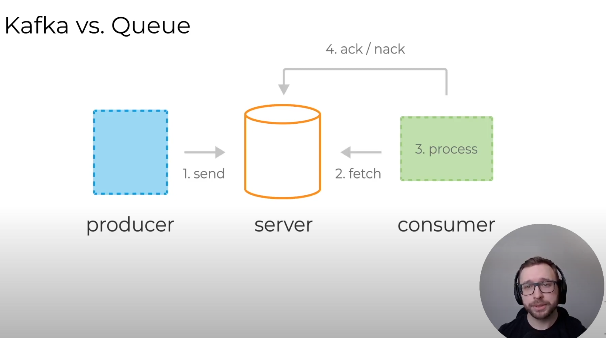

## Теперь посмотрим как работает Кафка

Кафка также состоит из 3 базовых компонентов:
- Кафка брокера (тот же самый сервер)
- Продюсеров
- Консьюмеров, которые считывают эти сообщения используя модель pull 


Главное фундаментальное отличие Кафки от очередей кроется в том, как сообщения хранятся на брокере и как потребляются консюмерами. 
В отличии от очередей сообщения в Кафке не удаляются по мере их обработки консюмерами. Благодаря этому одно и то же сообщение может быть обработано сколько угодно раз разными консьюмерами и в разных контекстах. В этом и кроется главная мощь и главное отличие Кафки от традиционных очередей.

## Сравнение того как работает Кафка и RabbitMQ на примере регистрации пользователя на сайте

Для каждой регистрации мы должны отправить письмо пользователю, пересчитать дневную статистику регистраций пользователей и сохранить пользователя в БД. 

В случае ребита или SQS нам нужно будет конфигурировать новую очередь для разных задач (отправка письма, подбор статистики и тд).

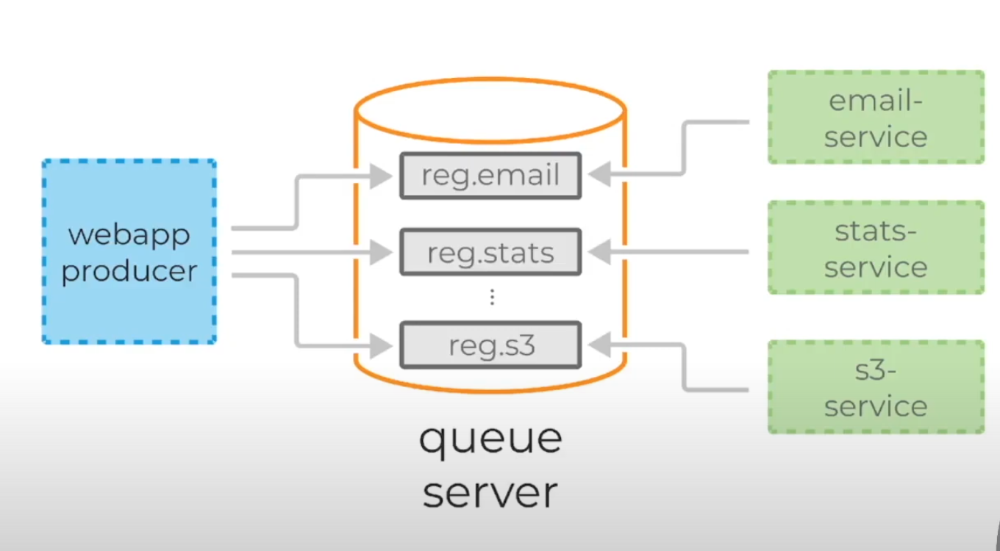

По сравнению с очередями Кафка делает эту задачу проще - посылаем сообщение один раз в топик, и все консюмеры подписанные на топик получают это уведомление и делают что-то с ним. 


## Структура данных в Кафка

Каждое сообщение состоит из:


Cообщения в Кафке хранятся в топиках (Topics), каждый топик состоит из 1 или более партиций (Partition) распределенных между брокерами внутри одного кластера.

Когда новое сообщение добавляется в топик оно записывается в одну из партиций этого самого топика.
Сообщение с одинаковыми ключами записываются в одну и ту же партицию - MurmurHash, если ключ отсутсвует -  RoundRobin. 
Кафка гарантирует очередность записи и чтения в рамках одной партиции. Для гарантии сохранности данных каждая партиция в Кафке может быть реплицирована N раз. Где N - replication factor.


Партиция - распределенный отказоустойчивый лог. 
У каждой партиции есть 1 брокер лидер. Именно он работает с клиентами, принимает сообщения от продюсеров и отдает сообщения консюмерам.  
К лидеру осуществляют запросы фолловеры. То есть брокеры, которые хранят реплику всех данных партиции. У лидера может быть 0..N фолловеров.

Для того чтобы понять кто является лидером партиции перед записью и чтением, клиент делает запрос метаданных от брокера, при чем они могут подключиться к любому брокеру кластера, чтобы сделать этот запрос. 

Сообщения всегда отправляются лидеру и, в общем случае, читаются из него.


Каждое новое сообщение отправленное продюсером в партицию сохраняется в голову этого лога и получает свой уникальный, монотонно возрастающий offset 64-bit unsigned int, который назначается брокером.
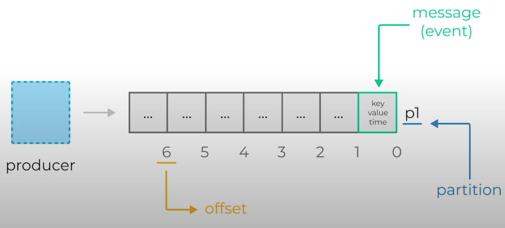

Данные удаляются согласно заданной конфигурации ретеншена (retention):
- retention.ms - минимальное время хранения сообщений
- retention.bytes - максимальный размер партиции

Длительность хранения сообщений не влияет на производительность системы, поэтому можно хранить их очень долго.

## Consumer groups

Каждый консюмер кафки обычно является частью какой-то консюмер группы. Каждая группа имеет уникальное название и регистрируется брокерами в кластере кафки. Данные из одного и того же топика могут читаться множеством консюмер групп одновременно. Когда несколько консюмеров из одной группы читают данные из кафки каждый из консюмеров получает сообщения из разных партиций топика, таким образом распределяя нагрузку.

Если в группе есть только 1 консюмер, то он будет получать сообщения из всех партиций топика.


При добавлении еще одного консюмера партиции перераспределятся
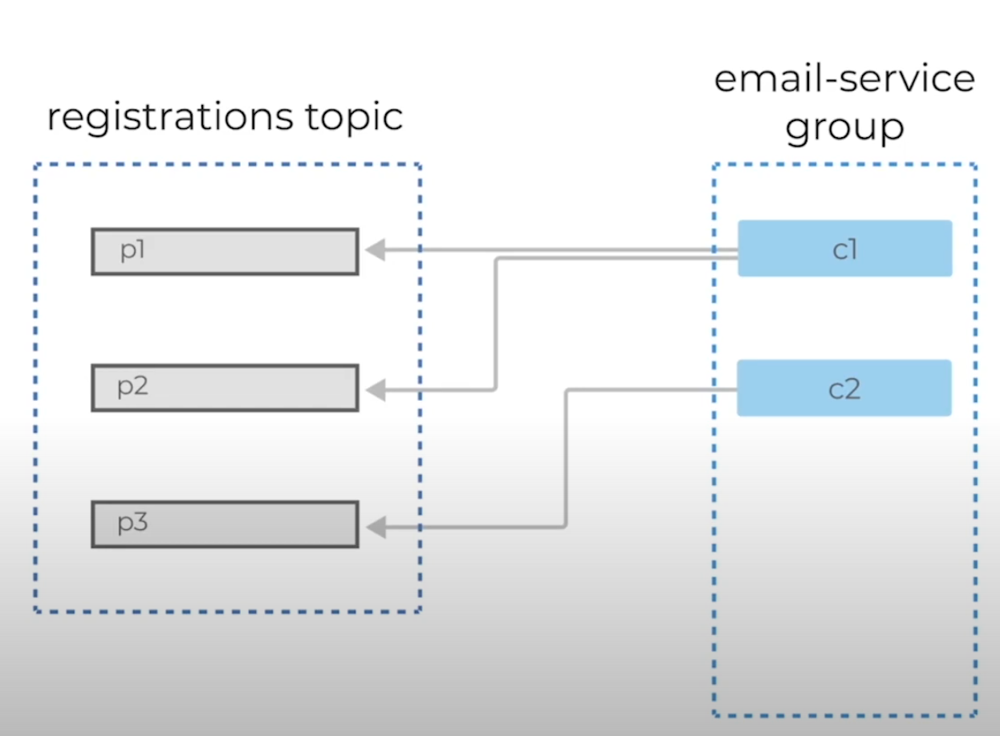

При добавлении 3-го консюмера мы добьемся идеального распределения нагрузки
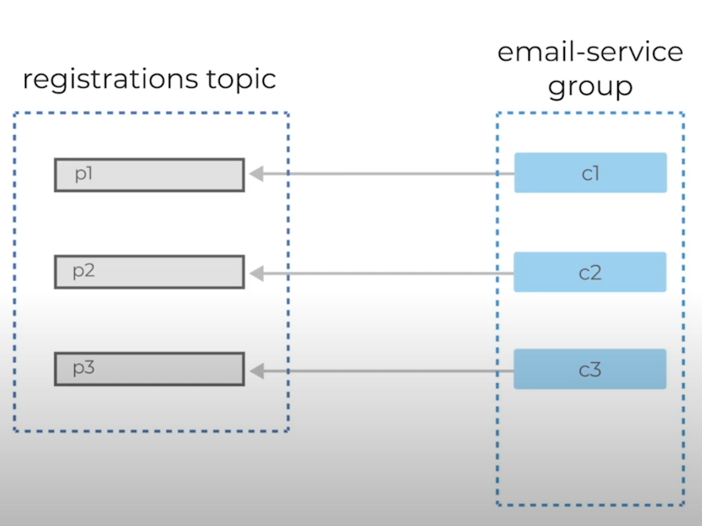

Если мы добавим еще одного консюмера, то он вообще не будет задействован в обработке сообщений.


Если наши консюмеры не справляются с текущим объемом данных, мы должны добавить еще одну партицию в топик. И только после этого добавлять консюмера. 
Таким образом, масштабирование партиций кафки является основным инструментом масштабирования.
Если один из консюмеров в группе упадет, партиции перераспределятся между оставшимися консюмерами.

Добавлять партиции можно на лету, без перезапуска клиентов или брокеров. Но нужно помнить про гарантию очередности в рамках одной партиции и что партиции нельзя удалить после создания (можно удалить только топик целиком).

Нужно помнить про конфигурацию auto.offset.reset в консюмерах: при добавлении новой партиции “на проде” вы наверняка захотите прочитать данные с начала лога (auto.offset.reset=earliest). Когда запускается консюмер, он будет считывать только новые сообщения, которые поступят в Кафку. Чтобы считать все предыдущие сообщения, нужно установить эту конфигурацию.

Партиции не “бесплатны”. Каждая увеличивает время старта брокера и выбора лидеров после падения. Теоретический лимит на кластер 200К партиций для Кафки 2.0+

**Партиции ВНУТРИ ОДНОЙ ГРУППЫ назначаются консюмерам уникально.**


Как обозначить сообщение в партиции как обработанное?
Для этого у нас есть механизм консюмер оффсетов.


После обработки сообщения консюмер делает специальный запрос к брокеру - offset commit, с указание своей группы, айдишника топика и партиции и оффсета.
Брокер сохраняет эту инфу в своём специальном топике “__consumer_offsets” . При рестарте консюмера он запрашивает у брокера последний закоммиченый оффсет для нужной партиции из топика. И продолжает чтение сообщений из нужной партиции.

## ZooKeeper

ZooKeeper выполняет роль консистентного хранилища метаданных, конфигураций топиков и партиций, а также распределенного service log. 


Именно он способен сказать живы ли наши брокеры, какой из брокеров является контроллером, то есть брокером, отвечающим за выбор лидеров партиций и в каком состоянии находятся лидеры партиций и их реплики. В случае падения брокера именно в ZooKeeper будет записана информация о новых лидерах партиций (будет записана контроллером).

Самый простой сценарий превратить данные в тыкву, потерять инфу из зукипера, потому что именно в нем хранится инфа что и откуда читать. В настоящее время ведутся работы по избавлению зависимости кафки от зукипера. 

Зукипер является еще одной распределенной системой хранения данных, за которой также необходимо следить, поддерживать и обновлять. Традиционно зукипер разворачивается отдельно от брокеров кафки, чтобы разделить границы возможных отказов. 

Падение зукипера почти равно падению всего кластера кафки.

## Структура партиции

Состоят они из набора файлов, которые называются сегментами.

Данные, которые продюсер присылает брокеру сохраняются в открытый (головной от head) сегмент. Который через некоторое время согласно некоторому набору правил закрывается (роллап) и вместо него открывается новый. Закрытые сегменты хранятся на диске, но при этом в них больше никогда не происходит запись. Они становятся неизменяемыми. Лог клинер (джоба которая очищает Кафку) удаляет записи из неё исключительно посегментно, то есть удаляет файлы целиком. И чтобы ему понять стоит удалять файл или нет (например retention по времени), то он делает следующее:
- смотрит и находит максимальный timestamp сообщения внутри одного сегмента
- находит разницу между этим максимальным таймстампом и текущем временем
- затем проверяет больше ли эта разница, чем retention ms, который мы установили
- если да, удаляем этот сегмент
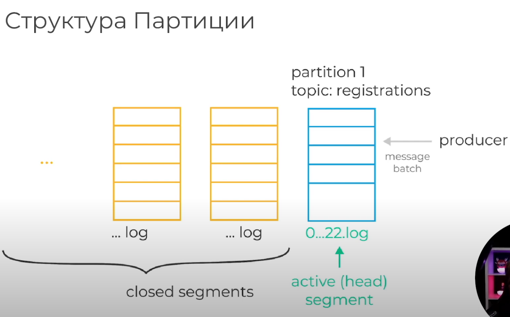

## Конфигурация

retention.ms - минимальное время хранения данных, после которого Кафка может их удалить
retention.bytes - максимальный размер партиции на диске
segment.ms - период роллапа (через какое время закроется сегмент) сегмента после открытия (по-умолчанию 1 неделя)
segment.bytes - максимальный размер сегмента (по-умолчанию 1ГБ)

Большая часть настроек Кафки может быть определена на 2-х уровнях:
- Broker-level config - уровень сервера, используется по-умолчанию (часто имеют префикс log.*). Например, log.retention.ms - глобальный ретеншн для всех топиков, которые мы создаем
- Topic-level config - оверрайды для отдельных топиков, имеют более высокий приоритет. Значения этих конфигов хранятся в зукипере.


Помимо функционала удаления данных по retention конфигам, Кафка предоставляет еще и другой механизм удаления данных, который называется Log Compaction. Этот механизм использует ключи сообщений чтобы решить нужно ли удалить какие-то данные или нет. 

cleanup.policy - delete для ретеншена по времени/размеру (включен по-умолчанию), compact для включения compaction
Не самый очевидный момент: у cleanup.policy одновременно могут быть включены оба значения: cleanup.policy=compact, delete
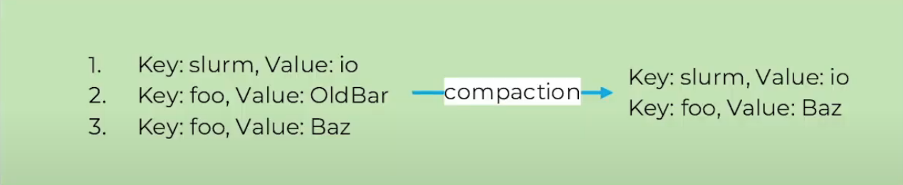

После завершения compaction процесса останется только одна запись с ключом foo и его последним значением.

Помимо этого compaction также позволяет выборочно удалять данные из партиции.
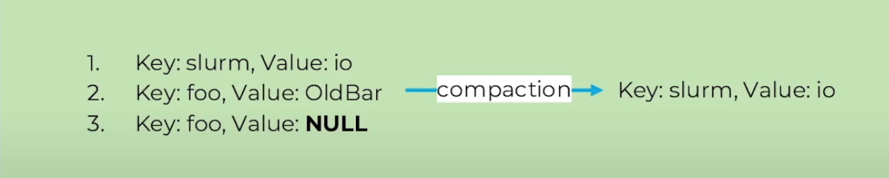

Если мы отправим сообщение с ключом foo и значением NULL (так называемый delete маркер), то после compaction значение для этого ключа удалится.

Log compaction работает только для закрытых сегментов. Активные (открытые) сегменты он не цепляет. Также Log compaction не блокирует чтение данных. 
Log compaction довольно трудоемкий процесс для брокера, он нагружает память, процессор и диск потому что ему нужно перезаписывать сегменты.
Log compaction не атомарен! В определенные моменты времени внутри партиции по-прежнему могут одновременно находиться несколько записей с одинаковым ключом.
Этот механизм позволяет “удалять” записи по ключу. Например у какой-то компании из ЕС в Кафке хранилась инфа о пользователях, которая нарушала gdpr. Так как механизм кафки не позволяет напрямую удалить записи из неё в этой ситуации помог compaction.

Офсеты не меняются, порядок записи остается прежним.


## Полезные ссылки

[Полезное видео о кафке](https://www.youtube.com/watch?v=Kgq4YLa9Jdw&list=PL8D2P0ruohOAR7DAkEjhOqlQreg9rxBMu&index=3)

[Apache Kafka — Краткое руководство - coderlessons](https://coderlessons.com/tutorials/bolshie-dannye-i-analitika/vyuchit-apache-kafka/apache-kafka-kratkoe-rukovodstvo)

[10 вопросов на собеседование по кафка](https://ru.photo-555.com/8985150-kafka-interview-questions)
# Protobuf


Наш протокол состоит из двух типов данных: `Person` и `AddressBook`. После генерации кода (подробнее об этом в следующем разделе) эти классы будут внутренними 
классами внутри класса `AddressBookProtos`.

## Ключевые слова
- `required` - Когда мы хотим определить обязательное поле - это означает, что создание объекта без такого поля вызовет исключение `Exception`, нам нужно 
использовать  ключевое слово `required`.
- `optional` - Создание поля с ключевым словом `optional` означает, что это поле не нужно устанавливать. 
- `repeated` - это тип массива переменного размера.

> As you can see, each field in the message definition has a unique number. These field numbers are used to identify your fields in the message binary format, 
and should not be changed once your message type is in use. Note that field numbers in the range 1 through 15 take one byte to encode, including the field 
number and the field's type (you can find out more about this in Protocol Buffer Encoding). Field numbers in the range 16 through 2047 take two bytes. So you 
should reserve the numbers 1 through 15 for very frequently occurring message elements. Remember to leave some room for frequently occurring elements that 
might be added in the future.

## Генерация Java-кода из файла Protobuf

```
protoc -I=. --java__out=. Addressbook.proto
```

- Команда `protoc` создаст выходной файл `Java` из нашего файла `addressbook.proto`. 
- Опция `-I` указывает каталог, в котором находится файл `proto` `.` 
- `Java-out` указывает каталог, в котором будет создан сгенерированный класс. `_`

Сгенерированный класс будет иметь сеттеры, геттеры, конструкторы и конструкторы для наших определенных сообщений. Он также будет иметь несколько утилит для 
сохранения файлов `protobuf` и десериализации их из двоичного формата в класс `Java`.

## Создание экземпляра сообщений, определенных для `Protobuf`


## Удаление полей

С удалением полей надо обходиться деликатнее. Можно просто удалить поле, и, скорее всего, все будет работать. Но в таком кавалеристском наскоке есть риски.
Может статься, что при следующей модификации типа кто-то добавит поле с таким же индексом, как недавно удаленное. Это поломает бинарную совместимость. Если же 
в будущем кто-то добавит поле с таким же именем, но с другим типом, то это поломает совместимость с вызывающим кодом.

Авторы `Protobuf` рекомендуют такие поля переименовывать, прибавляя префикс `OBSOLETE_`, или удалять, помечая индекс этого поля с помощью инструкции 
`reserved`.

```proto
message Foo {
  reserved 2, 15, 9 to 11;
  reserved "foo", "bar";
}
```


## Переименование полей

Поскольку сериализация основывается на индексах полей, а не на их именах, то, если что-то было названо неудачно, переименование не будет влечь за собой 
конвертацию данных или необходимость обновлять ПО на всех узлах. Если переименовать поле, то обновленный тип будет бинарно совместим.


## Полезные ссылки

[Зарезервированные поля](https://developers.google.com/protocol-buffers/docs/proto3#reserved)

[Введение в буфер протокола Google - codeflow](https://www.codeflow.site/ru/article/google-protocol-buffer)

[Документация Гугл](https://developers.google.com/protocol-buffers/docs/proto3)

[Protobuf — не только сериализация. Генерация кода и другие прикладные аспекты - dou](https://dou.ua/lenta/articles/protobuf-guide/)
# REST

## REST и WWW

Можно сколько угодно говорить о преимуществах и недостатках текущей архитектуры `WWW`, но ее применимость, устойчивость к развитию и работоспособность доказана 
годами практического применения. Этим Рой Филдинг и воспользовался. Он предложил использовать `Web` не только для общения между человеком и машиной, но и для 
общения между машинами.

Примерно, преобразовав это:

```xml
<div class="account">
	<div class="identifier">12345</div>
	<div class="balance">500</div>
</div>
```

В это:

```
{
	"account": {
		"identifier": "12345", 
		"balance": 500
	}
}
```

`REST` задуман так, что если правильно применять, то можно построить приложение (с `API`), которое будет работать и масштабироваться веками.

## Архитектурный стиль

Я очень люблю названия и аббревиатуры в `IT`. Я уверен, что правильные названия в разработке — это уже 80% успеха.

`REST` — `REpresentational State Transfer`. Я перевожу это так — `передача/изменения состояния через представления`. `REST` — это архитектурный стиль, 
некоторое множество ограничений, для построения распределенных приложений. Здесь нет ни слова об `API`, `HTTP` или красивых `URL`.

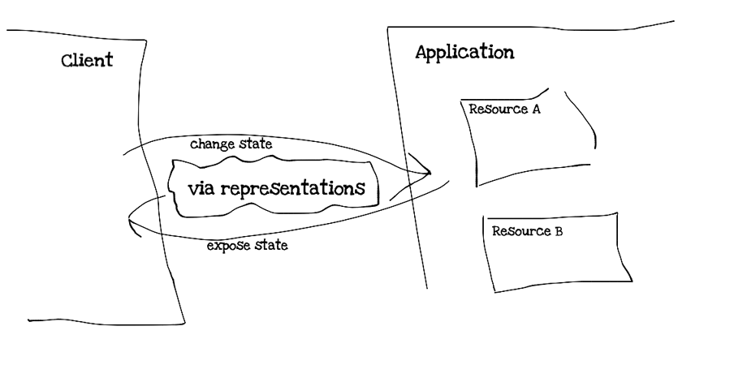

Если бы меня спросили, что нужно запомнить про REST и всегда держать в голове, я бы ответил — «расшифровку» аббревиатуры, каждое её слово.

## Базовые понятия

Продолжим разговор о названиях. Нам нужно что-то, что имеет состояние, нам нужно его как-то передавать или изменять, и еще шла речь о представлениях.

#### Ресурсы и представления ресурсов

> "The key abstraction of information in REST is a resource. Any information that can be named can be a resource: a document or image, a temporal service (e.g. 
„today’s weather in Los Angeles“), a collection of other resources, a non-virtual object (e.g. a person), and so on. In other words, any concept that might be 
the target of an author’s hypertext reference must fit within the definition of a resource. A resource is a conceptual mapping to a set of entities, not the 
entity that corresponds to the mapping at any particular point in time" — Roy Fielding’s dissertation


Ключевое понятие в `REST` — это ресурс. Ресурс имеет состояние, и мы можем его получать или изменять при помощи представлений. Наше приложение отвечает за 
некоторое множество таких ресурсов. Кстати, совокупное состояние ресурсов — это и есть состояние приложения.

Под `представлением` можно понимать `JSON/HTML/XML/текст в определенном формате` или что угодно, что позволяет нам понимать состояние ресурса или его 
модифицировать. Достаточно помнить, что `REST` про общение между машинами.

Представление, которое модифицирует состояние ресурса, и представление, которое что-то говорит нам о состоянии, не обязательно должны друг другу 
соответствовать.

#### Единообразные идентификаторы ресурсов — URI

Плавно подходим к практической стороне вопроса. Мы понимаем, что состояние нашего приложения — это состояние ресурсов, за которые отвечает приложение, и мы 
знаем, что мы можем изменять его через представления (ресурсов).

Как нам изменить состояние конкретного ресурса? Как найти этот конкретный ресурс? Для это и придуманы `URI`, чтобы идентифицировать ресурсы.

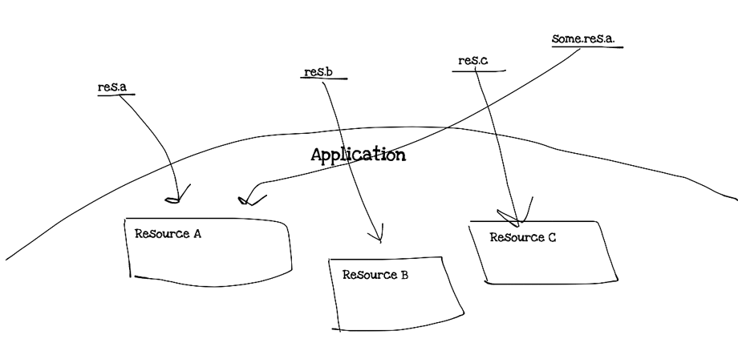

Об `URI` лучше всего думать как об имени или псевдониме ресурса. `U` — это `unified`, а не `unique`. Имен у одного и того же ресурса может быть много. Главное, 
чтобы они были понятными для машин. Например, «`bank.account.1`» и «`bank.accs.first`» могут быть вполне реальными идентификаторами в определенной системе.

#### URI, URL, URN

- `URI` – имя и адрес ресурса в сети, включает в себя `URL` и `URN` - `https://wiki.merionet.ru/images/vse-chto-vam-nuzhno-znat-pro-devops/1.png`
- `URL` – адрес ресурса в сети, определяет местонахождение и способ обращения к нему `https://wiki.merionet.ru`
- `URN` – имя ресурса в сети, определяет только название ресурса, но не говорит как к нему подключиться - `images/vse-chto-vam-nuzhno-znat-pro-devops/1.png`

Как вы видите – первые две сточки в вашем браузере отобразились как ссылки и по ним можно перейти, однако по третьей сточке нельзя, потому что непонятно как и 
куда.

#### HATEOAS

Мы понимаем, что такое состояние ресурсов, можем идентифицировать ресурсы, знаем, что можем менять состояние через представления. Эти понятия не меняют правила 
игры принципиально и не предлагают чего-то, что позволит нам взойти на новый уровень разработки распределенных приложений.

А вот `Hypermedia as the Engine of Application State` всё меняет, и эта концепция в `REST` мне нравится больше всего. Я бы сказал, что это одно из ключевых 
понятий `REST`, которое действительно отличает `REST` от других сетевых архитектур.

Давайте предоставим клиенту возможность понимать, в какое состояние он может перевести ресурс, и как он может получить эти состояния:

```xml
<?xml version="1.0"?>
<account>
   <accountIdentifier>12345</accountIdentifier>
   <balance currency="USD">100.00</balance>
   <link rel="deposit" href="http://somebank.org/account/12345/deposit" />
   <link rel="withdraw" href="http://somebank.org/account/12345/withdraw" /> 
   <link rel="transfer" href="http://somebank.org/account/12345/transfer" />
   <link rel="close" href="http://somebank.org/account/12345/close" />
 </account>
```

Это состояние представление счета в банке от сервера, которое содержит ссылки на действия, которые можно совершить со счетом. Например, счет можно пополнить 
или закрыть.

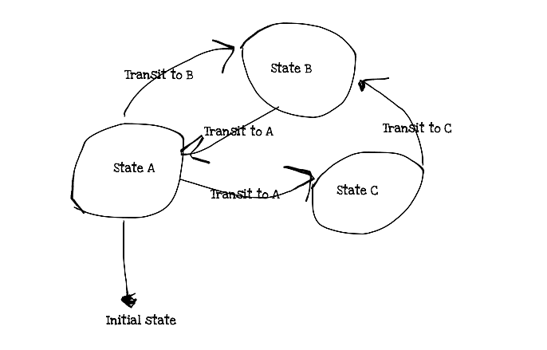

В данном случае действия, которые можно произвести над счетом, вычислил сервер. Обратите внимание, что клиенту не нужно содержать логики для вычисления 
возможных операций и ему не нужно знать `URL` операции. Это сильно «развязывает руки» серверу. Например, в начале мы разрешали снимать деньги со счета, только 
если баланс положительный, а что если мы потом позволить уходить в минус?

Есть еще некоторые неочевидные преимущества. Например, у вас есть меню ресторана, в нем есть перечень блюд и цен. Вы можете отдавать представление меню только 
с именованием блюд и в этом же меню ссылаться на цены. Тогда представление с наименованиями можно закэшировать надолго, а цены закэшировать в соответствии с 
частотой их изменения.

Самое важное здесь, что клиент знает только одну точку входа, только один `URL`. А дальше он получает представления и видит набор возможных действия, и он 
может принимать уже соответствующие решения. Это в разы может упростить клиент, так как ему не нужно хранить логики, а он может полностью опираться на ссылки. 
И, кстати, да нет такого понятия, как красивые `URL` (может, только в `SEO`), ваш клиент полностью отвязан от `URL`, и вы вольны именовать их как угодно. Да, 
хоть преобразуйте в `Base64`, если вам так удобно.

## Моделирование ресурсов

Одна из самых тонких тем в `REST` — это моделирование ресурсов. Здесь не существует какого-то единого подхода или простого правила, которое вам поможет точно 
подобрать границы ресурса. Старайтесь проектировать `API` так, чтобы оно не могло привести приложение в неработоспособный вид.

Например, вы пишете `API` для управления блогом. Если у вас есть требование, что к каждой статье обязательно должны быть указаны тэги, то вам необходимо 
спроектировать `API` так, чтобы клиент не смог нарушить этого свойства. Как вариант, при запросе на создание статьи необходимо дополнительно передать список 
тэгов.

А как бы вы реализовали операцию изменения состояния счета? Верно, через транзакции. Транзакция на пополнение счета, транзакция на перевод средств и т.д.

Моделирование ресурсов также не просто, как и моделирование предметной области.

## Стандарты

Не существует какого-то единого стандарта, который бы полностью описывал `REST`. Мы можем брать за основу часть диссертации Роя Филдинга о `REST`.

Но существует множество маленьких стандартов, которые дополняют данный стиль со стороны:
— `URI` и `URI Template` — об единообразных идентификаторах ресурсов;
— `HTTP` — как протокол передачи «гипертекста»;
— `HAL`, `Siren` — для реализация `HATEOAS`;
— `JSON`, `XML` и «семья» могут использоваться для представлений;
— `HTML` можно использовать не только для представлений, но и черпать из него идеи для гипермедиа компонент.

## Готовые решения

В `REST` примечательно то, что этот архтитектурный стиль полностью ложиться на `HTTP` — соответственно, любая библиотека, понимающая `HTTP`, подойдет.

И есть еще кое-что, это `HATEOAS`, и здесь индустрия не стоит на месте. Есть библиотеки, которые упрощают работу с построением ссылок в разы.

Если вы программируете с использованием `Java`, то обратите внимание на `Spring HATEOAS`.

## Best practices

#### Конечные точки в URL – имя существительное, не глагол

Одна из самых распространённых ошибок, которую делают разработчики `REST` приложений, — использование глаголов при именовании конечных точек. Однако, это не 
лучшая практика. Вы должны всегда использовать существительные вместо глаголов.

Пример сценария:

Мы имеем заказ на разработку `REST` веб сервисов, которые предоставляют информацию об Индийских фермерах. Сервис также должен реализовывать функционал, 
предоставляющий такую информацию как доход фермера, названия культур, адреса ферм и другую информацию, относящуюся к каждому фермеру. Каждый фермер имеет 
уникальный `id`.

Таким же образом должны быть реализованы сервисы, предоставляющие информацию о культурах и какой фермер владеет ими.

**Best Practice**:

Имеем единственную конечную точку, которая отвечает за все действия. В примере ниже представлена только одна конечная точка `/farmers` для всех операций таких 
как добавление, обновление, удаление. Базовые реализации имеют различные `HTTP` методы, которые правильно маршрутизируются для разных операций.

```
/farmers
/crops
```

**Не рекомендуется**:

Постарайтесь избегать использования глаголов. Рекомендуется представлять операции внутри таких форматах как `JSON`, `XML`, `RAML` или использовать `HTTP` 
методы. Не используйте представленные ниже обозначения:

```
/getFarmers
/updateFarmers
/deleteFarmers
/getCrops
/updateCrops
/deleteCrops
```

#### Множественное число

Используйте множественное число для названия своих `REST` сервисов. Это еще одна горячая тема для обсуждений среди `REST` дизайнеров – выбор между 
единственными или множественными формами существительных для обозначения сервисов.

**Best Practice**:

```
/farmers
/farmers/{farmer_id}
/crops
/crops/{crop_id}
```

**Не рекомендуется**:

```
/farmer
/farmer/{farmer_id}
```

**Примечание**:

Хотя я упоминаю, что использование множественного числа является `best practice`, по какой-то причине, если вы придерживаетесь единственного числа, то 
придерживайтесь этого во всех своих сервисах. Не смешивайте использование множественного и единственного чисел. Поэтому я и не говорю здесь про `bad practice`, 
а просто говорю, что это не рекомендуется. Пожалуйста, решайте сами, что лучше подходит для вашего приложения.

#### Документация

Документирование программного обеспечения является общей практикой для всех разработчиков. Этой практики стоит придерживаться и при реализации `REST` 
приложений. Если писать полезную документацию, то она поможет другим разработчикам понять ваш код.

Наиболее распространенным способом документирования `REST` приложений – это документация с перечисленными в ней конечными точками, и описывающая список 
операций для каждой из них. Есть множество инструментов, которые позволяют сделать это автоматически.

Ниже представлены приложения, которые помогают документировать `REST` сервисы:

``` 
DRF Docs
Swagger
Apiary
```

#### Версия вашего приложения

Любое программное обеспечение развивается с течением времени. Это может потребовать различных версий для всех существенных изменений в приложении. Когда дело 
доходит до версии `REST` приложения, то оно становится одной из самых обсуждаемых тем среди сообщества разработчиков `REST`.

Существует два общих способа для управления версиями `REST` приложений:
- `URI` версии.
- Мультимедиа версии.

---

`URI версии`:

```
host/v2/farmers
host/v1/farmers
```


Ниже приведены основные недостатки способа создания версий с использованием `URI`:
- Разбиваются существующие `URIs`, все клиенты должны обновить до нового `URI`.
- Увеличивается количество `URI` версий для управления, что в свою очередь увеличивает размер `HTTP` кэша для хранения нескольких версий `URI`. Добавление 
большого числа дубликатов `URI` может повлиять на количество обращений к кэшу и тем самым может снизить производительность вашего приложения.
- Он крайне негибкий, мы не можем просто изменить ресурс или небольшой их набор.

--- 

`Мультимедийный способ управления версиями`:

Этот подход отправляет информацию о версии в заголовке каждого запроса. Когда мы изменим тип и язык мультимедиа `URI`, мы перейдем к рассмотрению контента на 
основе заголовка. Этот способ является наиболее предпочтительным вариантом для управления версиями `REST` приложений.

Пример информации в заголовке:

```
GET /account/5555 HTTP/1.1
Accept: application/vnd.farmers.v1+json

HTTP/1.1 200 OK
Content-Type: application/vnd.farmers.v1+json
```

В мультимедийном подходе управления версиями клиент имеет возможность выбрать, какую версию запрашивать с сервера. Этот способ выглядит предпочтительней, чем 
подход с `URI`, но сложность возникает при кэшировании запросов с различными версиями, которые передаются через заголовок. Говоря простыми словами, когда 
клиент кэширует на основе `URI`, это просто, но, кэширование с ключом в качестве мультимедийного типа добавляет сложности.

#### Пагинация

Отправка большого объема данных через `HTTP` не очень хорошая идея. Безусловно, возникнут проблемы с производительностью, поскольку сериализация больших 
объектов `JSON` станет дорогостоящей. `Best practice` является разбиение результатов на части, а не отправка всех записей сразу. Предоставьте возможность 
разбивать результаты на странице с помощью предыдущих или следующих ссылок.

Если вы используете пагинацию в вашем приложении, одним из хороших способов указать ссылку на пагинацию является использование опции `Link HTTP` заголовка.

#### Использование SSL

`SSL` должен быть! Вы всегда должны применять `SSL` для своего `REST` приложения. Доступ к вашему приложения будет осуществляется из любой точки мира, и нет 
никакой гарантии, что к нему будет обеспечен безопасный доступ. С ростом числа инцидентов с киберпреступностью мы обязательно должны обеспечить безопасность 
своему приложению.

Стандартные протоколы проверки аутентификации облегчают работу по защите вашего приложения. Не используйте базовый механизм аутентификации. Используйте 
`Oauth1` или `Oauth2` для лучшей безопасности ваших сервисов. Я бы рекомендовал `Oauth2` лично из-за его новейших функций.

#### HTTP методы

Проектирование операций на `HTTP` методы становится легче, когда вы знаете характеристики всех методов `HTTP`. В одном из предыдущих разделов этой статьи я 
настаивал на использовании `HTTP` методов для операций вместо написания различных наименований сервисов для каждой операции. В этом разделе в основном 
рассматривается поведение каждого `HTTP` метода.

Ниже представлены две характеристики, которые должны быть определены перед использованием `HTTP` метода:
- `Безопасность`: `HTTP` метод считается безопасным, когда вызов этого метода не изменяет состояние данных. Например, когда вы извлекаете данные с помощью 
метода `GET`, это безопасно, потому что этот метод не обновляет данные на стороне сервера.
- `Идемпотентность`: когда вы получаете один и тот же ответ, сколько раз вы вызываете один и тот же ресурс, он известен как идемпотентный. Например, когда вы 
пытаетесь обновить одни и те же данные на сервере, ответ будет таким же для каждого запроса, сделанного с одинаковыми данными.

Не все методы являются безопасными и идемпотентными. Ниже представлен список методов, которые используются в `REST` приложениях и показаны их свойства:


#### Эффективное использование кодов ответов HTTP

`HTTP` определяет различные коды ответов для указания клиенту различной информации об операциях. Ваше `REST` приложение могло бы эффективно использовать все 
доступные `HTTP`-коды, чтобы помочь клиенту правильно настроить ответ. Далее представлен список кодов ответов `HTTP`:

- `200 OK` — это ответ на успешные `GET`, `PUT`, `PATCH` или `DELETE`. Этот код также используется для `POST`, который не приводит к созданию.
- `201 Created` — этот код состояния является ответом на `POST`, который приводит к созданию.
- `204 No content` - Это ответ на успешный запрос, который не будет возвращать тело (например, запрос `DELETE`)
- `304 Not Modified` — используйте этот код состояния, когда заголовки `HTTP`-кеширования находятся в работе
- `400 Bad Request` — этот код состояния указывает, что запрос искажен, например, если тело не может быть проанализировано
- `401 Unauthorized` — Если не указаны или недействительны данные аутентификации. Также полезно активировать всплывающее окно `auth`, если приложение 
используется из браузера
- `403 Forbidden` — когда аутентификация прошла успешно, но аутентифицированный пользователь не имеет доступа к ресурсу
- `404 Not found` — если запрашивается несуществующий ресурс
- `405 Method Not Allowed` — когда запрашивается `HTTP`-метод, который не разрешен для аутентифицированного пользователя
- `410 Gone` — этот код состояния указывает, что ресурс в этой конечной точке больше не доступен. Полезно в качестве защитного ответа для старых версий `API`
- `415 Unsupported Media Type` - Если в качестве части запроса был указан неправильный тип содержимого
- `422 Unprocessable Entity` — используется для проверки ошибок
- `429 Too Many Requests` — когда запрос отклоняется из-за ограничения скорости

## Версионирование API

Хороший `API` должен быть версионирован: изменения и новые возможности реализуются в новых версиях `API`, а не в одной и той же версии. В отличие от `Web`-
приложений, где у вас есть полный контроль и над серверным, и над клиентским кодом, `API` используются клиентами, код которых вы не контролируете. Поэтому, 
обратная совместимость должна по возможности сохраняться. Если ломающее её изменение необходимо, делать его нужно в новой версии `API`. Существующие клиенты 
могут продолжать использовать старую, совместимую с ними версию `API`. Новые или обновлённые клиенты могут использовать новую версию.

Общей практикой при реализации версионирования `API` является включение номера версии в `URL`-адрес вызова `API`-метода. Например, http://example.com/v1/users 
означает вызов `API /users` версии `1`. Другой способ версионирования `API`, получивший недавно широкое распространение, состоит в добавлении номера версии в 
`HTTP`-заголовки запроса, обычно в заголовок `Accept`:

```
// как параметр
Accept: application/json; version=v1
// как тип содержимого, определенный поставщиком API
Accept: application/vnd.company.myapp-v1+json
```

Оба способа имеют достоинства и недостатки, и вокруг них много споров. Ниже мы опишем реально работающую стратегию версионирования `API`, которая является 
некоторой смесью этих двух способов:
- Помещать каждую мажорную версию реализации `API` в отдельный модуль, чей `ID` является номером мажорной версии (например, `v1`, `v2`). Естественно, `URL`-
адреса `API` будут содержать в себе номера мажорных версий.
- В пределах каждой мажорной версии (т.е. внутри соответствующего модуля) использовать `HTTP`-заголовок `Accept` для определения номера минорной версии и 
писать условный код для соответствующих минорных версий.

В каждый модуль, обслуживающий мажорную версию, следует включать классы ресурсов и контроллеров, обслуживающих эту конкретную версию. Для лучшего разделения 
ответственности кода вы можете составить общий набор базовых классов ресурсов и контроллеров, и субклассировать их в каждом отдельно взятом модуле версии. 
Внутри дочерних классов реализуйте конкретный код вроде метода `Model::fields()`.

Ваш код может быть организован примерно следующим образом:

```
api/
    common/
        controllers/
            UserController.php
            PostController.php
        models/
            User.php
            Post.php
    modules/
        v1/
            controllers/
                UserController.php
                PostController.php
            models/
                User.php
                Post.php
            Module.php
        v2/
            controllers/
                UserController.php
                PostController.php
            models/
                User.php
                Post.php
            Module.php
```

## Пагинация

Для большинства конечных точек, возвращающих список сущностей, потребуется какая-то разбивка на страницы.

Без разбивки на страницы простой поиск мог бы вернуть миллионы или даже миллиарды обращений, вызывая посторонний сетевой трафик.

Пейджинг требует подразумеваемого упорядочивания. По умолчанию это может быть уникальный идентификатор элемента, но могут быть и другие упорядоченные поля, 
например дата создания.

#### Offset пагинация

Это простейшая форма разбиения на страницы. `Limit/offset` стало популярным в приложениях, использующих базы данных `SQL`, которые уже имеют `LIMIT` и 
`OFFSET` как часть синтаксиса `SQL SELECT`. Для реализации разбиения по страницам с `limit/offset` требуется очень мало бизнес-логики.

Пейджинг `Limit/Offset` будет выглядеть как `GET /items?Limit=20&offset=100`. Этот запрос вернет 20 строк, начиная со 100-й строки.

Предположим, что запрос упорядочен по дате создания по убыванию

1. Клиент запрашивает самые последние элементы: `GET /items?Limit=20` 
2. При прокрутке/следующей странице клиент делает второй запрос: `GET /items?Limit=20&offset=20` 
3. При прокрутке/следующей странице клиент делает третий запрос: `GET /items?Limit=20&offset=40`

В качестве оператора `SQL` третий запрос будет выглядеть так:

```sql
SELECT * FROM Items ORDER BY Id LIMIT 20 OFFSET 40;
```

**Преимущества**

- Самый простой в реализации, почти не требует программирования, кроме передачи параметров непосредственно в `SQL`-запрос.
- Stateless.
- Работает независимо от пользовательских параметров `sort_by`.

**Недостатки**

- Не работает для больших значений смещения. Допустим, вы выполняете запрос с большим значением смещения (`offset`) `1000000`. База данных должна сканировать и 
подсчитывать строки, начинающиеся с `0`, и будет пропускать (то есть отбрасывать данные) для первых `1000000` строк.
- Непоследовательно, когда в таблицу добавляются новые элементы (т. е. Смещение страниц). Это особенно заметно, когда мы упорядочиваем элементы сначала по 
новейшим. Рассмотрим следующее, что упорядочивает по уменьшению `Id`:
1. Запрос `GET /items?Offset=0&limit=15`
2. 10 новых позиций добавлены в таблицу
3. Запрос `GET /items?Offset=15&limit=15` Второй запрос вернет только 5 новых элементов, поскольку добавление 10 новых элементов сдвинуло смещение назад на 10 
элементов. Чтобы исправить это, клиенту действительно нужно было бы смещение на 25 для второго запроса `GET /items?Offset=25&limit=15`, но клиент, возможно, не 
мог знать, что другие объекты вставляются в таблицу.

Даже с ограничениями `offset` пагинация легко реализовывается и понятна, ее можно использовать в приложениях, где набор данных имеет небольшие верхние границы.

#### Keyset пагинация

При разбивке на страницы по набору ключей используются значения фильтра последней страницы для выборки следующего набора элементов. Эти столбцы будут 
проиндексированы.

Предположим, что запрос упорядочен по дате создания по убыванию:
1. Клиент запрашивает самые последние элементы: `GET /items?Limit=20`
2. При прокрутке/следующей странице клиент находит минимальную дату создания `2018-01-20T00:00:00` из ранее возвращенных результатов, а затем выполняет второй 
запрос, используя дату в качестве фильтра: `GET /items?limit=20&created:lte:2018-01-20T00:00:00`
3. При прокрутке/следующей странице клиент находит минимальную дату создания `2018-01-19T00:00:00` из ранее возвращенных результатов. а затем выполняет третий 
запрос, используя дату в качестве фильтра: `GET / items?limit=20&created:lte:2018-01-19T00:00:00`

```sql
SELECT * FROM Items WHERE created <= '2018-01-20T00:00:00' ORDER BY Id LIMIT 20
```

**Преимущества**
- Работает с существующими фильтрами без дополнительной внутренней логики. Требуется только дополнительный параметр `URL`-адреса ограничения.
- Последовательный заказ, даже когда в таблицу добавляются новые элементы. Хорошо работает при сортировке по самым последним.
- Стабильная производительность даже при больших смещениях.

**Недостатки**
- Тесная связь механизма подкачки с фильтрами и сортировкой. Заставляет пользователей `API` добавлять фильтры, даже если фильтры не предназначены.
- Не работает для полей с низкой мощностью, таких как строки перечисления.
- Сложно для пользователей `API` при использовании настраиваемых полей `sort_by`, поскольку клиенту необходимо настроить фильтр на основе поля, используемого 
для сортировки.

Пагинация набора ключей может очень хорошо работать для данных с одним естественным ключом высокой мощности, таких как временные ряды или данные журнала, 
которые могут использовать временную метку.

#### Seek пагинация

`Seek Paging` - это расширение пейджинга `Keyset`. Добавляя параметр `URL` `after_id` или `start_id`, мы можем устранить тесную связь разбиения на страницы с 
фильтрами и сортировкой. Поскольку уникальные идентификаторы имеют естественно высокую мощность, мы не столкнемся с проблемами, в отличие от сортировки по полю 
с низкой мощностью, например по перечислениям состояний или имени категории.

Проблема с разбивкой на страницы на основе поиска заключается в том, что ее трудно реализовать, когда требуется настраиваемый порядок сортировки.

Предположим, что запрос упорядочен по дате создания по убыванию:
1. Клиент запрашивает самые последние элементы: `GET / items?Limit=20`
2. При прокрутке/следующей странице клиент находит последний идентификатор «`20`» из ранее возвращенных результатов, а затем выполняет второй запрос, используя 
его в качестве начального идентификатора: `GET /items?limit=20&after_id=20`
3. При прокрутке/следующей странице клиент находит последний идентификатор «`40`» из ранее возвращенных результатов, а затем выполняет третий запрос, используя 
его в качестве начального идентификатора: `GET /items?limit=20&after_id=40`

```sql
SELECT * FROM Items WHERE Id > 20 LIMIT 20
```

Приведенный выше пример отлично работает, если сортировка выполняется по идентификатору, но что, если мы хотим выполнить сортировку по полю электронной почты? 
Для каждого запроса серверная часть должна сначала получить значение электронной почты для элемента, идентификатор которого совпадает с `after_id`. Затем 
выполняется второй запрос с использованием этого значения в качестве фильтра `where`.

Давайте рассмотрим запрос `GET /items?Limit=20&after_id=20&sort_by=email`, серверной части потребуется два запроса. Первым запросом может быть поиск `O(1)` с 
хеш-таблицами, чтобы получить значение сводной электронной почты. Это вводится во второй запрос, чтобы получить только те элементы, электронная почта которых 
находится после нашего `after_email`. Мы сортируем по обоим столбцам, электронной почте и идентификатору, чтобы обеспечить стабильную сортировку в случае, если 
два электронных письма одинаковы. Это критично для полей с более низкой мощностью.

```sql
SELECT email AS AFTER_EMAIL FROM Items WHERE Id = 20
SELECT * FROM Items WHERE Email >= [AFTER_EMAIL] ORDER BY Email, Id LIMIT 20
```

**Преимущества**
- Нет связи логики разбиения на страницы с логикой фильтра.
- Последовательный заказ, даже когда в таблицу добавляются новые элементы. Хорошо работает при сортировке по самым последним.
- Стабильная производительность даже при больших смещениях.

**Недостатки**
- Более сложный для серверной части реализовать относительно разбивки на страницы на основе смещения или набора ключей
- Если элементы удаляются из базы данных, `start_id` может быть недействительным идентификатором.

`Seek` пагинация - это хорошая общая стратегия разбиения по страницам, которую мы реализовали в публичном `API Moesif`. Это требует немного больше работы над 
серверной частью, но гарантирует, что клиентам/пользователям `API` не будет добавлена дополнительная сложность, а производительность останется даже при больших 
запросах.

## Сортировка

Как и фильтрация, сортировка является важной функцией для любой конечной точки `API`, которая возвращает большой объем данных. Если вы возвращаете список 
пользователей, пользователи вашего `API` могут захотеть выполнить сортировку по дате последнего изменения или по электронной почте.

Чтобы включить сортировку, многие `API`-интерфейсы добавляют параметр `URL` `sort` или `sort_by`, который может принимать имя поля в качестве значения.

Однако хороший дизайн `API` дает возможность указывать возрастающий или убывающий порядок. Как и в случае с фильтрами, указание порядка требует кодирования 
трех компонентов в пару ключ/значение.

**Примеры форматов**

```
GET /users?sort_by=asc(email) and GET /users?sort_by=desc(email)
GET /users?sort_by=+email and GET /users?sort_by=-email
GET /users?sort_by=email.asc and GET /users?sort_by=email.desc
GET /users?sort_by=email&order_by=asc and GET /users?sort_by=email&order_by=desc
```

#### Многоколоночная сортировка 

Не рекомендуется использовать последний подход, если сортировка и порядок не связаны. Со временем вы можете разрешить сортировку по двум или более столбцам:

```sql
SELECT email FROM Items ORDER BY Last_Modified DESC, Email ASC LIMIT 20
```

Чтобы закодировать эту сортировку по нескольким столбцам, вы можете разрешить несколько имен полей, например

```
GET /users?sort_by=desc(last_modified),asc(email) or
GET /users?sort_by=-last_modified,+email
```

Если поле сортировки и порядок не были объединены, необходимо сохранить порядок параметров `URL`; в противном случае неясно, какой порядок следует сочетать с 
каким именем поля. Однако многие серверные инфраструктуры могут не сохранять порядок после десериализации в карту.

Вы также должны убедиться, что порядок параметров `URL`-адресов учитывается для любых ключей кеша, но это окажет давление на размеры кеша.

## Фильтрация

Параметры `URL`-адреса - это самый простой способ добавить базовую фильтрацию к `REST API`. Если у вас есть конечная точка `/items`, которая представляет собой 
товары для продажи, вы можете фильтровать по имени свойства, например `GET / items?State=active` или `GET /items?State=active&seller_id=1234`. Однако это 
работает только для точных совпадений. Что, если вы хотите указать диапазон, например диапазон цен или дат?

Проблема в том, что параметры `URL`-адреса имеют только ключ и значение, а фильтры состоят из трех компонентов:
- Имя свойства или поля
- Оператор, такой как `eq`, `lte`, `gte`
- Значение фильтра

Существуют различные способы кодирования трех компонентов в пары "ключ-значение" `URL`-адреса.

#### LHS Brackets

Один из способов кодирования операторов - использование квадратных скобок `[]` в имени ключа. Например, `GET /items?Price[gte]=10&price[lte]=100` найдет все 
товары, цена которых больше или равна 10, но меньше или равна 100.

У нас может быть столько операторов, сколько нужно, таких как `[lte], [gte], [exists], [regex], [before] и [after]`.

Скобки `LHS` немного сложнее анализировать на стороне сервера, но они обеспечивают большую гибкость в выборе значения фильтра для клиентов. Нет необходимости 
обрабатывать специальные символы иначе.

**Преимущества**
- Удобство использования для клиентов. Существует множество доступных библиотек синтаксического анализа строки запроса, которые легко кодируют вложенные 
объекты `JSON` в квадратные скобки. `qs` - одна из таких библиотек, которая автоматически кодирует / декодирует квадратные скобки:
```js
var qs = require('qs');
var assert = require('assert');

assert.deepEqual(qs.parse('price[gte]=10&price[lte]=100'), {
    price: {
        gte: 10,
        lte: 100
    }
});
```
- Простой синтаксический анализ на стороне сервера. Ключ параметра `URL`-адреса содержит как имя поля, так и оператор. Легко группировать по (имя свойства, 
оператор), не глядя на значения параметров `URL`.
- Нет необходимости экранировать специальные символы в значении фильтра, если оператор используется как буквальный термин фильтра. Это особенно верно, когда 
ваши фильтры включают дополнительные настраиваемые поля метаданных, которые может устанавливать ваш пользователь.

**Недостатки**
- На стороне сервера может потребоваться дополнительная работа для анализа и группировки фильтров. Возможно, вам придется написать настраиваемый связыватель 
или анализатор параметра `URL`, чтобы разделить ключ строки запроса на два компонента: имя поля и оператор. Затем вам потребуется `GROUP BY` (имя свойства, 
оператор).
- Специальные символы в именах переменных могут быть неудобными. Возможно, вам придется написать настраиваемое связующее, чтобы разделить ключ строки запроса 
на два компонента: имя поля и оператор.
- Сложно управлять пользовательскими комбинационными фильтрами. Несколько фильтров с одним и тем же именем свойства и оператором приводят к неявному `AND`. 
Что, если бы пользователь `API` вместо этого захотел использовать фильтры `OR`. т.е. найти все товары, цена которых меньше 10 `ИЛИ` больше 100?

#### RHS colon

Подобно подходу с использованием скобок, вы можете разработать `API`, принимающий оператора на `RHS` вместо `LHS`. Например, `GET /items?
Price=gte:10&price=lte:100` найдет все товары, цена которых больше или равна 10, но меньше или равна 100.

**Преимущества**
- Легче всего анализировать на стороне сервера, особенно если не поддерживаются повторяющиеся фильтры. Никаких специальных папок не требуется. Многие платформы 
`API` уже обрабатывают массивы параметров `URL`. Несколько `price` фильтров будут находиться под одной и той же переменной «цена», которая может быть 
последовательностью или картой.

**Недостатки**
- Литералы значения требуют особой обработки. Например, `GET /items?User_id=gt:100` будет переводить, чтобы найти все элементы, у которых `user_id` больше 100. 
Однако что, если мы хотим найти все элементы, у которых `user_id` равен `gt:100`, поскольку это может быть действительный идентификатор ?

#### Search query param

Если вам нужен поиск на вашей конечной точке, вы можете добавить поддержку фильтров и диапазонов непосредственно с помощью параметра поиска. Если вы уже 
используете `ElasticSearch` или другую технологию на основе `Lucene`, вы можете напрямую поддерживать синтаксис `Lucene` или простые строки запроса 
`ElasticSearch`.

Например, мы могли бы искать товары, содержащие слова красный стул, а цена больше или равна 10 и меньше или равна 100: `GET /items?q=title:red chair AND price:
[10 TO 100]`

Такие `API`-интерфейсы могут обеспечивать сопоставление по нечеткости, усиление определенных терминов и многое другое.

**Преимущества**
- Максимально гибкие запросы для пользователей `API`
- На бэкэнде почти не требуется синтаксический анализ, может передаваться напрямую в поисковую систему или базу данных (только будьте осторожны с дезинфекцией 
входных данных для безопасности)

**Недостатки**
- Новичкам сложнее начать работать с `API`. Необходимо ознакомиться с синтаксисом `Lucene`.
- Полнотекстовый поиск подходит не для всех ресурсов. Например, нечеткость и усиление терминов не имеют смысла для метрических данных временных рядов.
- Требуется процентное кодирование `URL`, что усложняет использование `cURL` или `Postman`.

## Полезные ссылки

[Синхронизируем понимание REST - dou](https://dou.ua/lenta/articles/rest-conception/)

[URL И URI - В ЧЕМ РАЗЛИЧИЕ? - wiki.merionet](https://wiki.merionet.ru/servernye-resheniya/36/url-i-uri-v-chem-razlichie/)

[REST API Best Practices - habr](https://habr.com/ru/post/351890/)

[Версионирование - yiiframework](https://www.yiiframework.com/doc/guide/2.0/ru/rest-versioning)

[REST API Design: Filtering, Sorting, and Pagination - moesif](https://www.moesif.com/blog/technical/api-design/REST-API-Design-Filtering-Sorting-and-Pagination/)
# Rest VS Grpc VS GraphQL

## GraphQL - новый стандарт

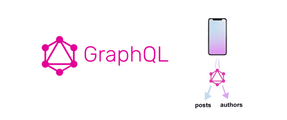

`GraphQL` - это гибкая система для запроса данных, которая фокусируется на точных запросах и доставляет именно то, что требуется. Что отличает `GraphQL` от 
других `API`, так это его уникальный подход, ориентированный на клиента. Вместо того, чтобы обрабатывать его как обычно (то есть от сервера к клиенту), 
клиент решает, как все обрабатывать. Основные преимущества:
- **Адаптивность** - клиент решает, какие данные ему нужны и в каком формате он хочет их получить
- **Эффективность** - обеспечивает именно то, что запрашивает клиент, без избыточной выборки,
- **Гибкость** - `GraphQl` является кроссплатформенным и поддерживает более десятка языков (`Perl`, `Java`, `Python`, `PHP` и другие).

Наиболее известным примером приложения `GraphQL`, вероятно, является `GitHub`. Они перешли на него в 2016 году, сославшись на масштабируемость и гибкость в 
качестве двух основных причин. `REST` просто не помогал им, потому что часто требовалось несколько запросов для получения нужных данных, а также превышение 
количества данных по каждому из этих запросов. Учитывая стремительный рост `GitHub` и десятки миллионов пользователей, вы можете себе представить, насколько 
серьезной должна была быть эта проблема. `GraphQL` предоставил именно ту альтернативу, которая им была нужна, потому что он ориентирован на то, чтобы клиент 
мог запрашивать определенные данные в определенном формате для конкретного использования.

## REST - по-прежнему самый популярный?

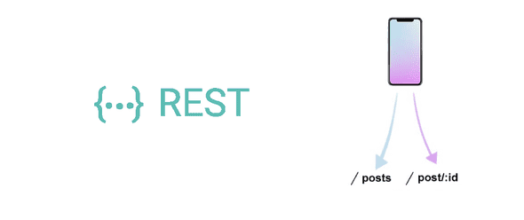

После нескольких жалоб по этому поводу будет справедливо взглянуть на `REST`. Несмотря на некоторые вопросы, не устарел ли он, это все еще наиболее часто 
используемый `API`. `REST` - это архитектура без сохранения состояния для передачи данных. Системы `RESTful` делают упор на то, что они stateless и гипермедиа. 
В отличие от `GraphQL`, здесь разделяются обязанности клиента и сервера. Обычно упоминаемые преимущества:
- **Производительность** - лучше всего подходит для систем, требующих быстрой итерации и стандартизированного `HTTP`
- **Масштабируемость** - позволяет поддерживать большое количество компонентов и взаимодействий между ними
- **Простота** - `REST` имеет единый интерфейс, который упрощает и разделяет архитектуру
- **Возможность модификации** - компоненты могут быть изменены в соответствии с меняющимися потребностями даже во время работы приложения.

Как упоминалось выше, `REST` по-прежнему остается самым популярным `API`. `Twitter`, `Facebook`, `Google` и `Paypal` используют `RESTful API`. `REST` может 
связывать воедино множество ресурсов, которые можно запрашивать разными способами и в разных форматах для различных целей. Если вам нужен более универсальный 
`API`, чем точный `GraphQL`, это то, что вам нужно.

## GRPC - производительность любой ценой

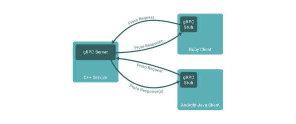

`gRPC` - это легкая и быстрая система для запроса данных, это свежий взгляд на старый метод, называемый удаленным вызовом процедур или `RPC`. Основное различие 
здесь в том, как он определяет переговоры по контракту. `REST` определяет взаимодействия с помощью стандартизованных терминов в своих запросах, `GraphQL` 
выполняет запросы по созданной схеме, чтобы получить именно то, что требуется. `RPC` работает по контрактам, согласование определяется отношениями между 
сервером и клиентом, а не архитектурой. Большая часть мощности полагается на клиентскую сторону, в то время как обработка и вычисления выгружаются на удаленный 
сервер, на котором размещен ресурс. Короче говоря, основные преимущества:
- **Легкий** - требует очень мало ресурсов, что делает его удобным решением даже для ситуаций с очень низким энергопотреблением
- **Эффективный** - `gPRC` использует `protobufs`, метод сериализации структурированных данных, который фокусируется на эффективной сериализации связи
- **Открытый исходный код** - который можно свободно использовать, изменять или разветвлять

Короче говоря, `gRPC` подходит для систем, которым требуется заданный объем данных или регулярная обработка, и в которых запрашивающая сторона имеет низкое 
энергопотребление или хочет сохранить ресурсы. Лучшими примерами являются чрезвычайно популярные устройства `IoT`, такие как голосовые контроллеры, 
интеллектуальные переключатели света, замки для дымовой сигнализации и камеры.

## Нет универсального решения

Как видите, у каждого из этих вариантов есть свои приложения и преимущества. Здесь нет явного победителя, и то, что вы должны использовать, или, скорее, то, 
что вы хотите использовать, в основном зависит от ваших целей и подхода. Итак, теперь, когда вы, надеюсь, немного знаете о каждом из них, посмотрите, что лучше 
всего подходит для вашего проекта, и выберите подходящий для себя.

## Другое

Grpc
- Поддерживает обратную совместимость. Также хотелось бы, чтобы протокол, который мы используем, достаточно хорошо поддерживал обратную совместимость: это очень важно с параллельными независимыми релизами
- строгий подход к обработке ошибок: все, кто делал REST-сервисы, знают — нельзя просто использовать HTTP-статус. Они обычно не позволяют детально описать проблему, приходится вводить какие-то свои статусы, свою детализацию. В REST-сервисах каждый вводит свою реализацию этих ошибок, приходится каждый раз по-разному с этим работать. Это не всегда удобно. 
- Хотелось бы также иметь управление таймаутами со стороны клиента. Опять же, те, кто работает с HTTP, понимают — если на стороне клиента мы выставили таймаут и он закончился, то клиент перестанет ожидать выполнения запроса, но сервер об этом ничего не узнает и продолжит его выполнять. Более того, посередине бывают различные прокси, которые ставят глобальные таймауты. И клиент может про них просто ничего не знать и конфигурировать их не всегда тривиально. 
- Например, для Java в случае ошибочного статуса выкидывается исключение. Для плюсов статус является просто результатом выполнения вызова функции и можно проверить и дальше уже действовать в зависимости от него. Внутри google.rpc.Status есть 3 поля: код ответа, сообщение и детали. Есть стандартный набор кодов ответа, которые можно использовать. В поле сообщения можно просто записать нелокализованное сообщение, чтобы разобраться с проблемой. Детали — это вектор, в котором можно передавать кастомные объекты, в том числе бинарные. 


При использовании swagger есть большой соблазн не поддерживать доку, ведь это чаще всего дополнительный геморрой. При использовании gRPC этого не получится, потому что инструмент продуман лучше и он упрощает жизнь разработчику. У вас не получиться сгенерировать код, не написав proto файл и не расшарив его между командами разработки.

Идеальный вариант использования gRPC — это общение между микросервисами и построение коммуникации с сервером для мобильных приложений.

gRPC — это в первую очередь RPC фреймворк и он больше про методы в стиле UpdateBalance, GetClient и прочие. REST же — он про ресурсы. GET /users, POST /users и так далее. В gRPC можно спокойно пилить кучу методов, в то время как кучу эндпоинтов запилить плохая идея.

https://medium.com/maddevs-io/go-rest-или-grpc-f5d52d7ffff6


Understanding gRPC APIs
As a variant of the RPC architecture, gRPC was created by Google to speed up data transmission between microservices and other systems that need to interact with each other. Compared to REST APIs, gRPC APIs are unique in the following ways: 
1. Protobuf Instead of JSON
2. Built on HTTP 2 Instead of HTTP 1.1
3. In-Born Code Generation Instead of Using Third-Party Tools Like Swagger
4. 7 to 10 times Faster Message Transmission
5. Slower Implementation than REST 
6. gRPC supports streaming
Let’s take a closer look at each of these differences between REST and gRPC APIs.

Protobuf Instead of JSON/XML
Both REST APIs and RPC APIs send and receive messages using the JSON or XML messaging formats. They can use other formats too, but JSON and XML are the most common. Of these, JSON has become the most popular format because it is flexible, efficient, platform neutral, and language agnostic. It’s also text-based and human-readable, which makes it easy for human operators to work with. The problem is that for certain use-cases, JSON isn’t fast enough or light-weight enough when transmitting data between systems. 
In contrast to REST and RPC, gRPC overcomes issues related to speed and weight — and offers greater efficiency when transmitting messages — by using theProtobuf(protocol buffers) messaging format. Here are a few details about Protobuf:
* Platform and language agnostic like JSON
* Serializes and deserializes structured data to communicate via binary.
* As a highly-compressed format, it doesn’t achieve JSON’s level of human-readability.
* Speeds up data transmission by removing a lot of the responsibilities that JSON manages so it can focus strictly on serializing and deserializing data. 
* Data transmission is faster because Protobuf reduces the size of messages and serves as a lightweight messaging format. 

В HTTP 2 для REST нельзя использовать стриминг

GRPC предоставляет три типа потоковой передачи:

- На стороне сервера: клиент отправляет сообщение запроса на сервер. Сервер возвращает поток ответов клиенту. После завершения ответов сервер отправляет сообщение о состоянии (и в некоторых случаях конечные метаданные), что завершает процесс. После получения всех ответов клиент завершает свой процесс.
- На стороне клиента: клиент отправляет поток сообщений запроса на сервер. Сервер возвращает один ответ клиенту. Он (обычно) отправляет ответ после получения всех запросов от клиента и сообщения о состоянии (и в некоторых случаях конечных метаданных).
- Двунаправленный: клиент и сервер передают данные друг другу без особого порядка. Клиент - это тот, кто инициирует такой вид двунаправленной потоковой передачи. Клиент также завершает соединение.

https://blog.dreamfactory.com/grpc-vs-rest-how-does-grpc-compare-with-traditional-rest-apis/

## Полезные ссылки

[GraphQL vs REST vs gRPC - medium](https://medium.com/devops-dudes/graphql-vs-rest-vs-grpc-411a0a60d18d)
# SOA - Service-oriented architecture 

`Сервис-ориентированная архитектура` придумана в конце 1980-х. Она берёт своё начало в идеях, изложенных в `CORBA`, `DCOM`, `DCE` и других документах. 
О `SOA` написано много, есть несколько её реализаций. Но, по сути, `SOA` можно свести к нескольким идеям, причём архитектура не диктует способы их реализации:
- Сочетаемость приложений, ориентированных на пользователей.
- Многократное использование бизнес-сервисов.
- Независимость от набора технологий.
- Автономность (независимые эволюция, масштабируемость и развёртываемость).

`SOA` — это набор архитектурных принципов, не зависящих от технологий и продуктов, совсем как полиморфизм или инкапсуляция.

В этой статье мы рассмотрим следующие паттерны, относящиеся к `SOA`:
- Общая архитектура брокера объектных запросов (CORBA).
- Веб-сервисы.
- Очередь сообщений.
- Микросервисы.

## Общая архитектура брокера объектных запросов (CORBA)

В 1980-х началось активное использование корпоративных сетей и клиент-серверной архитектуры. Возникла потребность в стандартном способе взаимодействия 
приложений, которые созданы с использованием разных технологий, исполняются на разных компьютерах и под разными ОС. Для этого была разработана `CORBA`. Это 
один из стандартов распределённых вычислений, зародившийся в 1980-х и расцветший к 1991 году.

Стандарт CORBA был реализован несколькими вендорами. Он обеспечивает:
- Не зависящие от платформы вызовы удалённых процедур (`Remote Procedure Call`).
- Транзакции (в том числе удалённые!).
- Безопасность.
- События.
- Независимость от выбора языка программирования.
- Независимость от выбора ОС.
- Независимость от выбора оборудования.
- Независимость от особенностей передачи данных/связи.
- Набор данных через язык описания интерфейсов (`Interface Definition Language`, `IDL`).

Сегодня `CORBA` всё ещё используется для разнородных вычислений. Например, он до сих пор является частью `Java EE`, хотя начиная с Java 9 будет поставляться в 
виде отдельного модуля.

Хочу отметить, что не считаю `CORBA` паттерном `SOA` (хотя отношу и `CORBA`, и `SOA`-паттерны к сфере распределённых вычислений). Я рассказываю о нём здесь, 
поскольку считаю недостатки `CORBA` одной из причин возникновения `SOA`.

#### Принцип работы

Сначала нам нужно получить брокер объектных запросов (`Object Request Broker`, `ORB`), который соответствует спецификации `CORBA`. Он предоставляется вендором 
и использует языковые преобразователи (`language mappers`) для генерирования «заглушек» (`stub`) и «скелетов» (`skeleton`) на языках клиентского кода. С 
помощью этого `ORB` и определений интерфейсов, использующих `IDL` (аналог `WSDL`), можно на основе реальных классов генерировать в клиенте удалённо вызываемые 
классы-заглушки (`stub classes`). А на сервере можно генерировать классы-скелеты (`skeleton classes`), обрабатывающие входящие запросы и вызывающие реальные 
целевые объекты.


1. Вызывающая программа (`caller`) вызывает локальную процедуру, реализованную заглушкой.
2. Заглушка проверяет вызов, создаёт сообщение-запрос и передаёт его в `ORB`.
3. Клиентский `ORB` шлёт сообщение по сети на сервер и блокирует текущий поток выполнения.
4. Серверный `ORB` получает сообщение-запрос и создаёт экземпляр скелета.
5. Скелет исполняет процедуру в вызываемом объекте.
6. Вызываемый объект проводит вычисления и возвращает результат.
7. Скелет пакует выходные аргументы в сообщение-ответ и передаёт его в `ORB`.
8. `ORB` шлёт сообщение по сети клиенту.
9. Клиентский `ORB` получает сообщение, распаковывает и передаёт информацию заглушке.
10. Заглушка передаёт выходные аргументы вызывающему методу, разблокирует поток выполнения, и вызывающая программа продолжает свою работу.

#### Достоинства

- Независимость от выбранных технологий (не считая реализации `ORB`).
- Независимость от особенностей передачи данных/связи.

#### Недостатки

- **Независимость от местоположения**: клиентский код не имеет понятия, является ли вызов локальным или удалённым. Звучит неплохо, но длительность задержки и 
виды сбоев могут сильно варьироваться. Если мы не знаем, какой у нас вызов, то приложение не может выбрать подходящую стратегию обработки вызовов методов, а 
значит, и генерировать удалённые вызовы внутри цикла. В результате вся система работает медленнее.
- **Сложная, раздутая и неоднозначная спецификация**: её собрали из нескольких версий спецификаций разных вендоров, поэтому (на тот момент) она была раздутой, 
неоднозначной и трудной в реализации.
- **Заблокированные каналы связи** (`communication pipes`): используются специфические протоколы поверх `TCP/IP`, а также специфические порты (или даже 
случайные порты). Но правила корпоративной безопасности и файрволы зачастую допускают `HTTP`-соединения только через `80`-й порт, блокируя обмены данными 
`CORBA`.

## Веб-сервисы

Хотя сегодня можно найти применение для `CORBA`, но мы знаем, что **нужно было уменьшить количество удалённых обращений**, чтобы повысить производительность 
системы. Также **требовался надёжный канал связи и более простая спецификация обмена сообщениями**.

И для решения этих задач в конце 1990-х начали появляться веб-сервисы.

1. Нужен был надёжный канал связи, поэтому:
- `HTTP` стал по умолчанию работать через порт `80`.
- Для обмена сообщениями начали использовать платформо-независимый язык (вроде `XML` или `JSON`).
2. Нужно было уменьшить количество удалённых обращений, поэтому:
- Удалённые соединения стали явными, так что теперь мы всегда знаем, когда выполняется удалённый вызов.
- Вместо многочисленных удалённых вызовов объектов мы обращаемся к удалённым сервисам, но гораздо реже.
3. Нужно было упростить спецификацию обмена сообщениями, поэтому:
- Первый черновик `SOAP` появился в 1998-м, стал рекомендацией `W3C` в 2003-м, после чего превратился в стандарт. `SOAP` вобрал в себя некоторые идеи `CORBA`, 
вроде слоя для обработки обмена сообщениями и «документа», определяющего интерфейс с помощью языка описания веб-сервисов (`Web Services Description Language`, 
`WSDL`).
- Рой Филдинг в 2000-м описал `REST` в своей диссертации «`Architectural Styles and the Design of Network-based Software Architectures`». Его спецификация 
оказалась гораздо проще `SOAP`, поэтому вскоре `REST` обогнал `SOAP` по популярности.
- `Facebook` разработал `GraphQL` в 2012-м, а публичный релиз выпустил в 2015-м. Это язык запросов для `API`, позволяющий клиенту строго определять, какие 
данные сервер должен ему отправить, не больше и не меньше.

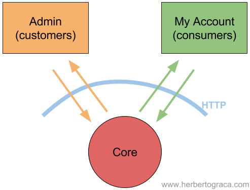

Благодаря микросервисам мы перешли в парадигме `SOA` от удалённого вызова методов объекта (`CORBA`) к передаче сообщений между сервисами.

Но нужно понимать, что в рамках `SOA` веб-сервисы — не просто `API` общего назначения, всего лишь предоставляющие `CRUD`-доступ к базе данных через `HTTP`. В 
каких-то случаях эта реализация может быть полезной, но ради целостности ваших данных необходимо, чтобы пользователи понимали лежащую в основе реализации 
модель и соблюдали бизнес-правила. `SOA` подразумевает, что веб-сервисы являются ограниченными контекстами бизнес-субдоменов (`business sub-domain`) и отделяет 
реализацию от решаемых веб-сервисами задач.

#### Достоинства

- Независимость набора технологий, развёртывания и масштабируемости сервисов.
- Стандартный, простой и надёжный канал связи (передача текста по `HTTP` через порт `80`).
- Оптимизированный обмен сообщениями.
- Стабильная спецификация обмена сообщениями.
- Изолированность контекстов доменов (Domain contexts).

#### Недостатки

- Разные веб-сервисы тяжело интегрировать из-за различий в языках передачи сообщений. Например, два веб-сервиса, использующих разные `JSON`-представления одной 
и той же концепции.
- Синхронный обмен сообщениями может перегрузить системы.

## Очередь сообщений

У нас есть несколько приложений, которые асинхронно общаются друг с другом с помощью платформо-независимых сообщений. Очередь сообщений улучшает 
масштабируемость и усиливает изолированность приложений. Им не нужно знать, где находятся другие приложения, сколько их и даже что они собой представляют. 
Однако все эти приложения должны использовать один язык обмена сообщениями, т. е. заранее определённый текстовый формат представления данных.

Очередь сообщений использует в качестве компонента инфраструктуры программный брокер сообщений (`RabbitMQ`, `Beanstalkd`, `Kafka` и т. д.). Для реализации 
связи между приложениями можно по-разному настроить очередь:

#### Запрос/Ответ

Клиент шлёт в очередь сообщение, включая ссылку на «разговор» («`conversation`» reference). Сообщение приходит на специальный узел, который отвечает 
отправителю другим сообщением, где содержится ссылка на тот же разговор, так что получатель знает, на какой разговор ссылается сообщение, и может продолжать 
действовать. Это очень полезно для бизнес-процессов средней и большой продолжительности (цепочек событий).

#### Публикация/Подписка

- По спискам
Очередь поддерживает списки опубликованных тем подписок (`topics`) и их подписчиков. Когда очередь получает сообщение для какой-то темы, то помещает его в 
соответствующий список. Сообщение сопоставляется с темой по типу сообщения или по заранее определённому набору критериев, включая и содержимое сообщения.
- На основе вещания
Когда очередь получает сообщение, она транслирует его всем узлам, прослушивающим очередь. Узлы должны сами фильтровать данные и обрабатывать только 
интересующие сообщения.

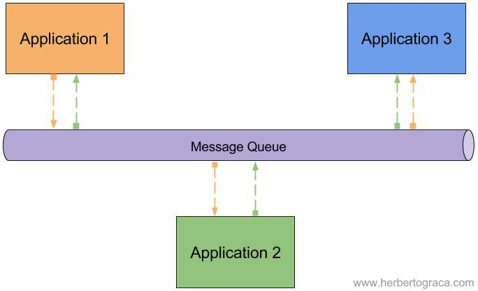

Все эти паттерны можно отнести к либо к `pull-(polling)`, либо к `push`-подходу:

- В `pull`-сценарии клиент опрашивает очередь с определённой частотой. Клиент управляет своей нагрузкой, но при этом может возникнуть задержка: сообщение уже 
лежит в очереди, а клиент его ещё не обрабатывает, потому что не пришло время следующего опроса очереди.
- В `push`-сценарии очередь сразу же отдаёт клиентам сообщения по мере поступления. Задержки нет, но клиенты не управляют своей нагрузкой.

#### Достоинства

- Независимость набора технологий, развёртывания и масштабируемости сервисов.
- Стандартный, простой и надёжный канал связи (передача текста по `HTTP` через порт `80`).
- Оптимизированный обмен сообщениями.
- Стабильная спецификация обмена сообщениями.
- Изолированность контекстов домена (Domain contexts).
- Простота подключения и отключения сервисов.
- Асинхронность обмена сообщениями помогает управлять нагрузкой на систему.

#### Недостатки

- Разные веб-сервисы тяжело интегрировать из-за различий в языках передачи сообщений. Например, два веб-сервиса, использующих разные `JSON`-представления одной 
и той же концепции.

## Микросервисы

`Микросервисы` — маленькие автономные сервисы, работающие вместе и спроектированные вокруг бизнес-домена.

В основе микросервисной архитектуры лежат концепции `SOA`. Назначение у неё: создать единое общее корпоративное приложение из нескольких специализированных 
приложений бизнес-доменов.

Характер построения/проектирования микросервисов не требует глубокой интеграции. Микросервисы должны соответствовать бизнес-концепции, ограниченному контексту. 
Они должны сохранять своё состояние, быть независимыми от других микросервисов, и потому они меньше нуждаются в интеграции. То есть низкая взаимозависимость и 
высокая связность привели к замечательному побочному эффекту — уменьшению потребности в интеграции.

`Сэм Ньюман`, автор `Building Microservices`, выделяет восемь принципов микросервисной архитектуры. Это:

- Проектирование сервисов вокруг бизнес-доменов
Это может дать нам стабильные интерфейсы, высокосвязные и мало зависящие друг от друга модули кода, а также чётко определённые разграниченные контексты.
- Культура автоматизации
Это даст нам гораздо больше свободы, мы сможем развернуть больше модулей.
- Скрытие подробностей реализации
Это позволяет сервисам развиваться независимо друг от друга.
- Полная децентрализация
Децентрализуйте принятие решений и архитектурные концепции, предоставьте командам автономность, чтобы компания сама превратилась в сложную адаптивную систему, 
способную быстро приспосабливаться к переменам.
- Независимое развёртывание
Можно развёртывать новую версию сервиса, не меняя ничего другого.
- Сначала потребитель
Сервис должен быть простым в использовании, в том числе другими сервисами.
- Изолирование сбоев
Если один сервис падает, другие продолжают работать, это делает всю систему устойчивой к сбоям.
- Удобство мониторинга
В системе много компонентов, поэтому трудно уследить за всем, что в ней происходит. Нам нужны сложные инструменты мониторинга, позволяющие заглянуть в каждый 
уголок системы и отследить любую цепочку событий.


> Сообщество предпочитает другой подход: **умные конечные точки и глупые каналы**. Микросервисы, из которых собираются приложения, должны как можно меньше 
зависеть друг от друга и при этом быть очень тесно связанными — они содержат собственную доменную логику и работают скорее как фильтры с точки зрения 
классического `Unix`: получают запросы, применяют логику и генерируют ответы. Они оркестрируются с помощью простых `REST`-подобных протоколов, а не сложных 
протоколов вроде `WS-Choreography` или `BPEL` либо какого-то централизованного инструмента.
- `Martin Fowler 2014`

#### Достоинства

- Независимость набора технологий, развёртывания и масштабируемости сервисов.
- Стандартный, простой и надёжный канал связи (передача текста по `HTTP` через порт `80`).
- Оптимизированный обмен сообщениями.
- Стабильная спецификация обмена сообщениями.
- Изолированность контекстов домена (Domain contexts).
- Простота подключения и отключения сервисов.
- Асинхронность обмена сообщениями помогает управлять нагрузкой на систему.
- Синхронность обмена сообщениями помогает управлять производительностью системы.
- Полностью независимые и автономные сервисы.
- Бизнес-логика хранится только в сервисах.
- Позволяют компании превратиться в сложную адаптивную систему, состоящую из нескольких маленьких автономных частей/команд, способную быстро адаптироваться к 
переменам.

#### Недостатки

- Высокая сложность эксплуатации:
- Нужно много вложить в сильную `DevOps`-культуру.
- Использование многочисленных технологий и библиотек может выйти из-под контроля.
- Нужно аккуратно управлять изменениями `входных/выходных API`, потому что эти интерфейсы будут использовать многие приложения.
- Использование «согласованности в конечном счёте» (`eventual consistency`) может привести к серьёзным последствиям, которые нужно учитывать при разработке 
приложения, от бэкенда до UX.
- Тестирование усложняется, потому что изменения в интерфейсе могут непредсказуемо влиять на другие сервисы.

## Заключение

В последние десятилетия `SOA` сильно эволюционировала. Благодаря неэффективности прежних решений и развитию технологий сегодня мы пришли к микросервисной 
архитектуре.

Эволюция шла по классическому пути: сложные проблемы разбивались на более мелкие, простые в решении.

Проблему сложности кода можно решать так же, как мы разбиваем монолитное приложение на отдельные доменные компоненты (разграниченные контексты). Но с 
разрастанием команд и кодовой базы увеличивается потребность в независимом развитии, масштабировании и развёртывании. `SOA` помогает добиться такой 
независимости, упрочняя границы контекстов.

## Полезные ссылки

[Сервис-ориентированная архитектура (SOA) - habr](https://habr.com/ru/company/mailru/blog/342526/)
# SSL

`SSL` (`secure sockets layer` — уровень защищённых cокетов) представляет собой криптографический протокол для безопасной связи. С версии `3.0` `SSL` заменили 
на `TLS` (`transport layer security` — безопасность транспортного уровня), но название предыдущей версии прижилось, поэтому сегодня под `SSL` чаще всего 
подразумевают `TLS`.

Цель протокола — обеспечить защищенную передачу данных. При этом для аутентификации используются **асимметричные алгоритмы шифрования** (пара `открытый — 
закрытый ключ`), а для сохранения конфиденциальности — **симметричные** (`секретный ключ`). Первый тип шифрования более ресурсоемкий, поэтому его комбинация с 
симметричным алгоритмом помогает сохранить высокую скорость обработки данных.

## Зачем нужен SSL-сертификат

В браузере перед адресами одних сайтов отображаются буквы `HTTP`, а перед другими — `HTTPS`. Обе аббревиатуры обозначают одно и то же: протокол передачи данных 
в интернете. Протокол — это набор правил, который определяет, как браузер и сервер обмениваются данными, какие бывают данные и что с ними делать.


- `HTTP` — обычный протокол, он работает по умолчанию. Вы вводите на сайте личную информацию, а браузер передаёт её на сервер в открытом виде.
- `HTTPS` — защищённая версия `HTTP`. Это `SSL`-протокол, который активируется после установки `SSL`-сертификата и зашифровывает личную информацию, перед тем 
как передать её владельцу сайта.

Представьте, что планируете отпуск и покупаете билеты на самолёт на сайте авиакомпании. Чтобы оплатить заказ, вы вводите детали банковской карты. Этого не 
видно, но браузер передаёт эти детали серверу. Если сообщение перехватят злоумышленники, они узнают детали карты и смогут расплачиваться ею в интернете.

Чтобы этого не произошло, проверяйте, есть ли на сайте `SSL`-сертификат. Даже если мошенники перехватят ваши данные на сайте с сертификатом, они увидят только 
случайный набор символов.

Разберемся, как работает `SSL`-сертификат, и рассмотрим принцип работы `HTTPS`-соединения.

## Принцип работы SSL-шифрования

В основе любого метода шифрования лежит ключ. `Ключ` — это способ зашифровать или расшифровать сообщение. В работе `SSL`-сертификата участвуют три ключа: 
публичный, приватный и сеансовый (для сессии).


Публичный и приватный ключи генерируются один раз при создании запроса на выпуск сертификата. Поэтому приватный ключ нужно хранить осторожно. Если ключ попадёт 
в руки другому человеку, он сможет расшифровывать сообщения, а вам придётся переустанавливать сертификат.


Шифрование с двумя разными ключами называют `асимметричным`. Использовать такой метод более безопасно, но медленно. Поэтому браузер и сервер используют его 
один раз: чтобы создать сеансовый ключ.


Шифрование с одним ключом называют `симметричным`. Этот метод удобен, но не так безопасен. Поэтому браузер и делает уникальный ключ для каждого сеанса вместо 
того, чтобы хранить его на сервере.

## Как браузер и сервер устанавливают безопасное соединение

Браузер и сервер устанавливают `SSL`-соединение каждый раз, когда пользователь заходит на сайт. Это занимает несколько секунд во время загрузки сайта. По-
английски процесс называется `handshake`. Это означает «`рукопожатие`».

Когда вы вводите адрес сайта в браузере, он спрашивает у сервера, установлен ли для сайта сертификат. В ответ сервер отправляет общую информацию об `SSL`-
сертификате и публичный ключ. Браузер сверяет информацию со списком авторизованных центров сертификации. Такой список есть во всех популярных браузерах. Если 
всё в порядке, браузер генерирует сеансовый ключ, зашифровывает его публичным ключом и отправляет на сервер. Сервер расшифровывает сообщение и сохраняет 
сеансовый ключ. После этого между браузером и сайтом устанавливается безопасное соединение через протокол `HTTPS`.

Процесс можно сравнить со звонком в домофон. Когда вы слышите звонок, спрашиваете кто пришел. Скорее всего, вы не откроете дверь, пока не убедитесь, что это 
ваш знакомый. У `SSL`-сертификата похожий принцип работы: браузер не настроит безопасное соединение с сайтом, пока не убедится, что сертификат не поддельный.

Рассмотрим, как работает `HTTPS`-соединение на схеме:


## Полезные ссылки

[Как работает SSL-сертификат - ssl.com.ua](https://ssl.com.ua/info/how-ssl-works/)
# SOLID

## SRP - Single responsibility principle

Каждый объект должен иметь только одну обязанность. И эта обязанность должна быть полностью инкапсулирована в класс.

Если у класса больше одной ответственности может возникнуть следующая проблема: к примеру есть класс `DateAndTemperatureInfoHolder`. Он содержит инфу о дате и 
о температуре. Когда кому-то другому понадобится наш код который относится только к дате или температуре, он может создать новый класс вырезав из нашего только 
то, что нужно - `DateInfoHolder` или `TemperatureInfoHolder`. В таком случае, если в нашем исходном `DateAndTemperatureInfoHolder` обнаружится баг, то этот баг 
будет и в коде, который скопирован в другой класс. Таким образом будет очень сложно поддерживать обновление этого кода и фикс багов в нём. По `SRP` нужно было 
изначально создать `DateInfoHolder` и `TemperatureInfoHolder` в виде отдельных реализаций.

## OCP - Open closed principle

Программные сущности (классы, функции, модули) должны быть открыты для расширения, но закрыты для изменения.

Если одно изменение в программе влечет за собой каскад изменений в зависимых модулях, то в программе проявляются нежелательные признаки «плохого» дизайна.
Бертран Мейер говорил: “необходимо проектировать модули, которые никогда не меняются. Когда требования меняются, нужно расширять поведение таких модулей путем 
добавления нового кода, а не изменением старого, уже работающего кода”.

Модули, отвечающие принципу открытости-закрытости, имеют два главных признака:
- Открыты для расширения. Это означает, что поведение модуля может быть расширено. То есть мы можем добавить модулю новое поведение в соответствии с 
изменившимися требованиями к приложению или для удовлетворения нужд новых приложений.
- Закрыты для изменений. Исходный код такого модуля неприкасаем. Никто не вправе вносить в него изменения.

**Ключ к решению - Абстракции**

Это абстрактные базовые классы, а неограниченный набор возможных поведений представлен всеми возможными классами-наследниками. Модуль может манипулировать 
абстракцией. Такой модуль закрыт для изменений, так как он зависит от фиксированной абстракции. Также поведение модуля может быть расширено созданием новых 
наследников абстракции.

**Пример с ошибкой**

```
enum ShapeType {circle, square}

struct Shape { ShapeType itsType; };
struct Circle{
    ShapeType itsType;
    double itsRadius;
    Point itsCenter;
};

struct Square {
    ShapeType itsType;
    double itsSide;
    Point itsTopLeft;
};

//
// реализованы в другом месте
//
void DrawSquare(struct Square*)
void DrawCircle(struct Circle*);
typedef struct Shape *ShapePointer;

void DrawAllShapes(ShapePointer list[], int n) {
    int i;
    for (i=0; i<n; i++) {
        struct Shape* s = list[i];
        switch (s->itsType) {
            case square:
            DrawSquare((struct Square*)s);
            break;
            case circle:
            DrawCircle((struct Circle*)s);
            break;
        }
    }
}
```

**Правильный пример**
```
class Shape {
public:
    virtual void Draw() const = 0;
};
class Square : public Shape {
public:
    virtual void Draw() const;
};
class Circle : public Shape {
public:
    virtual void Draw() const;
};

void DrawAllShapes(Set<Shape*>& list){
    for (Iterator<Shape*>i(list); i; i++)
        (*i)->Draw();
}
```

Клиентский код должен зависеть от интерфейса, который неизменный. Это делается для того, чтобы не пришлось переписывать клиентский код.

## LSP - Liskov substitution principle

Если функция принимает класс `A` (или часть кода работает с классом `А`), то передав в эту функцию наследника класса `А` всё должно работать как и прежде. То 
есть не должно быть вообще никаких проблем при работе с наследниками.

## ISP - Interface segregation principle

Клиенты не должны зависеть от методов, которые они не используют. 

Есть интерфейс `IFacade` с 10 методами и класс `Facade`, который его реализует. Также есть несколько клиентов, которые работают с фасадом. Например, первому 
клиенту нужны только 1, 2 и 3 методы фасада. Второму клиенту оставшиеся 7 методов. В итоге получается, что у клиента есть доступ к функционалу, который он не 
должен иметь. 

Также есть проблема в том, что если меняется сигнатура одного из методов, то нам нужно перекомпилировать все клиенты, вместо того, чтобы перекомпилировать 
только тот, который использует этот метод. Принцип помогает снизить сложность поддержки кода. 

## DIP - Dependency inversion principle

Абстракции не должны зависеть от деталей. Детали должны зависеть от абстракций.

Главная идея принципа - использовать все классы через интерфейсы.

Пример: Клиент - Сервер. Когда используем сервер напрямую и хотим добавить в него новый функционал (к примеру авторизация) или расширить сигнатуру методов, то 
это всё влияет на взаимодействие с клиентом. Если бы мы работали через интерфейс, мы могли бы сделать условный прокси, который бы и реализовывал блок 
авторизации нашего примера. При этом интерфейс бы не поменялся.

## Три ключевых принципа ПО, которые вы должны понимать

#### DRY - Don’t repeat yourself


#### KISS - Keep it simple, stupid

Как-то я принимал участие в проекте, где клиент хотел импортировать `Excel` таблицы в свою программу по управлению персоналом. Хороший пример. `Excel` является 
проприетарным приложением, со сложным форматом. Формат документов сложен, т.к. реализует богатый функционал – к примеру, в него можно добавлять графики и 
другие фишки, которые по сути, не нужны были клиенту. Ему нужны были просто числа из таблицы. Таким образом, внедряя импорт из `Excel`, пришлось бы потратить 
много времени на ненужный функционал. В добавок, существует несколько версий `Excel`, которых с каждым годом все больше и больше. Т.е. всем этим было бы сложно 
управлять, и были риски дополнительных затрат в будущем.

И мы решили внедрить импорт из формата `CSV`. Решение заняло несколько строк кода, не было перегружено данными (если сравнивать форматы `CSV` и `Excel`), легко 
управлялось и поддерживалось. `Excel` запросто может экспортировать данные в формате `CSV` (как и многие другие программы, которыми клиент мог воспользоваться 
в будущем). И, учитывая минимальные затраты на реализацию этого требования, данное решение является отличным примером `KISS`.

Мораль – старайтесь рассмотреть вещи с простой стороны, если они выглядят сложными. Если клиент вам рассказывает свои требования, реализация которых вам 
кажется сложной, вы правы в любом случае. Даже учитывая, что некоторые вещи действительно сложны в реализации, мы нередко сталкиваемся с решениями, которые 
перегружены необоснованно. Это случается, т.к. в процесс разработки вовлечены некоторые люди, не имеющие технического опыта для правильного расчета затраты/
выгода. И они просто не видят всей проблемы. Поэтому всегда дважды проверяйте требования клиента, и убедитесь, что это именно то, что ему нужно. Обсудите 
критические моменты, объясните ему, почему другие решения могут подойти лучше.

#### YAGNI - You aren’t gonna need it

Вам это не понадобится. К примеру, достаточно часто доступ к `БД` осуществляется через абстракцию, которая может иметь реализацию для разных драйверов – 
`MySQL`, `PostgreSQL`, `Oracle`. Если вы работаете над сайтом, который размещается на `LAMP` стеке – какова вероятность того, что клиент сменит `БД`? Не 
забывайте, что концепт всегда пишется под бюджет – верно?

Если в бюджете не предусмотрена абстракция для `БД` – этой абстракции не должно быть в системе. Если вдруг клиенту понадобится переехать на другую `БД`, 
довольно очевидно, что это повлечет затраты на изменение системы.

## Полезные ссылки

[SOLID принципы: SRP (Принцип единственной ответственности, Single Responsibility Principle) - Youtube Немчинский](https://www.youtube.com/watch?v=O4uhPCEDzSo&ab_channel=SergeyNemchinskiy)

[Принцип открытости-закрытости / Блог компании Tinkoff - habr](https://habr.com/ru/company/tinkoff/blog/472186/)

[SOLID принципы: OCP (Открытости/закрытости (Open Closed Principle) - Youtube Немчинский](https://www.youtube.com/watch?v=x5OtQiKOG-Q&ab_channel=SergeyNemchinskiy)

[SOLID: Принцип подстановки Барбары Лисков/ LSP (The Liskov Substitution Principle) - Youtube Немчинский](https://www.youtube.com/watch?v=NqvwYcjrwdw)

[SOLID принципы: ISP (Принцип Разделения Интерфейса (The Interface Segregation Principle) - Youtube Немчинский](https://www.youtube.com/watch?v=d9RJqf2o_Sw)

[SOLID принципы: DIP (Принцип инверсии зависимостей (The Dependency Inversion Principle) - Youtube Немчинский](https://www.youtube.com/watch?v=Bw6RvCSsETI&ab_channel=SergeyNemchinskiy)

[Три ключевых принципа ПО, которые вы должны понимать - habr](https://habr.com/ru/post/144611/)
# Patterns: GoF

## Behavioral patterns
### `Chain of responsibility (Цепочка обязанностей)`

Цепочка обязанностей — это поведенческий паттерн проектирования, который позволяет передавать запросы последовательно
по цепочке обработчиков. Каждый последующий обработчик решает, может ли он обработать запрос сам и стоит ли передавать
запрос дальше по цепи.

#### `Проблема`

Представьте, что вы делаете систему приёма онлайн-заказов. Вы хотите ограничить к ней доступ так, чтобы только
авторизованные пользователи могли создавать заказы. Кроме того, определённые пользователи, владеющие правами
администратора, должны иметь полный доступ к заказам.

Вы быстро сообразили, что эти проверки нужно выполнять последовательно. Ведь пользователя можно попытаться
«залогинить» в систему, если его запрос содержит логин и пароль. Но если такая попытка не удалась,
то проверять расширенные права доступа попросту не имеет смысла.

Затем мы решили сделать еще несколько проверок
- неплохо бы проверять данные, передаваемые в запросе перед тем, как вносить их в систему —
  вдруг запрос содержит данные о покупке несуществующих продуктов.
- блокировать массовые отправки формы с одним и тем же логином, чтобы предотвратить подбор паролей ботами.
- форму заказа неплохо бы доставать из кеша, если она уже была однажды показана.

С каждой новой «фичей» код проверок, выглядящий как большой клубок условных операторов, всё больше и больше раздувался.
При изменении одного правила приходилось трогать код всех проверок.
А для того, чтобы применить проверки к другим ресурсам, пришлось продублировать их код в других классах.

#### `Решение`

Цепочка обязанностей базируется на том, чтобы превратить отдельные поведения в объекты.
Данные запроса, над которым происходит проверка, будут передаваться в метод как аргументы.

Паттерн предлагает `связать объекты обработчиков в одну цепь`. Каждый из них будет иметь ссылку на следующий обработчик
в цепи. Таким образом, при получении запроса обработчик сможет не только сам что-то с ним сделать,
но и передать обработку следующему объекту в цепочке.

Обработчик не обязательно должен передавать запрос дальше, причём эта особенность может быть использована по-разному.
В примере с фильтрацией доступа обработчики прерывают дальнейшие проверки, если текущая проверка не прошла.
Ведь нет смысла тратить попусту ресурсы, если и так понятно, что с запросом что-то не так.


`Но есть и другой подход`, при котором обработчики прерывают цепь только когда они могут обработать запрос.
В этом случае запрос движется по цепи, пока не найдётся обработчик, который может его обработать.
Очень часто такой подход используется для передачи событий, создаваемых классами графического интерфейса в
результате взаимодействия с пользователем.

Например, когда пользователь кликает по кнопке, программа выстраивает цепочку из объекта этой кнопки,
всех её родительских элементов и общего окна приложения на конце. Событие клика передаётся по этой цепи до тех пор,
пока не найдётся объект, способный его обработать. Этот пример примечателен ещё и тем, что цепочку всегда можно выделить
из древовидной структуры объектов, в которую обычно и свёрнуты элементы пользовательского интерфейса.


#### `Структура`


#### `Применимость`

- Когда программа должна обрабатывать разнообразные запросы несколькими способами, но заранее неизвестно,
  какие конкретно запросы будут приходить и какие обработчики для них понадобятся.
- Когда важно, чтобы обработчики выполнялись один за другим в строгом порядке.
- Когда набор объектов, способных обработать запрос, должен задаваться динамически.

#### `Источники`

- [Подробнее о паттерне на refactoring.guru](https://refactoring.guru/ru/design-patterns/chain-of-responsibility)

- [Реализация на Java](https://refactoring.guru/ru/design-patterns/chain-of-responsibility/java/example)

### `Command (Команда)`

Команда — это поведенческий паттерн проектирования, который превращает запросы в объекты, позволяя
передавать их как аргументы при вызове методов, ставить запросы в очередь, логировать их, а также
поддерживать отмену операций.

#### `Проблема`

Представьте, что вы работаете над программой текстового редактора.
Вы создали класс красивых Кнопок и хотите использовать его для всех кнопок приложения, начиная от панели управления,
заканчивая простыми кнопками в диалогах. Все эти кнопки, хоть и выглядят схоже, но делают разные вещи.
Поэтому возникает вопрос: куда поместить код обработчиков кликов по этим кнопкам

Самым простым решением было бы создать подклассы для каждой кнопки и переопределить в них метод действия под разные задачи.

Но скоро стало понятно, что такой подход никуда не годится. Во-первых, получается очень много подклассов

Но самое обидное ещё впереди. Ведь некоторые операции, например, «сохранить», можно вызывать из нескольких мест:
нажав кнопку на панели управления, вызвав контекстное меню или просто нажав клавиши Ctrl+S.
Когда в программе были только кнопки, код сохранения имелся только в подклассе SaveButton.
Но теперь его придётся продублировать ещё в два класса.

#### `Решение`

Паттерн Команда предлагает не отправлять вызовы напрямую на хендлер каждой из кнопок. А вызывать некую команду, которая
может выполнить нужное действие.

Вместо этого каждый вызов, отличающийся от других, следует завернуть в собственный класс с единственным методом,
который и будет осуществлять вызов. Такие объекты называют командами.

#### `Структура`


#### `Применимость`

- Когда вы хотите параметризовать объекты выполняемым действием.
- Когда вы хотите ставить операции в очередь, выполнять их по расписанию или передавать по сети.
- Когда вам нужна операция отмены.

#### `Источники`

- [Подробнее о паттерне на refactoring.guru](https://refactoring.guru/ru/design-patterns/command)

- [Реализация на Java](https://refactoring.guru/ru/design-patterns/command/java/example)

### `Iterator (Итератор)`

Итератор — это поведенческий паттерн проектирования, который даёт возможность последовательно обходить элементы
составных объектов, не раскрывая их внутреннего представления.

#### `Проблема`

Большинство коллекций выглядят как обычный список элементов. Но есть и экзотические коллекции, построенные на основе
деревьев, графов и других сложных структур данных.

Но каким способом следует перемещаться по сложной структуре данных? Например, сегодня может быть достаточным обход
дерева в глубину, но завтра потребуется возможность перемещаться по дереву в ширину. А на следующей неделе и
того хуже — понадобится обход коллекции в случайном порядке.

#### `Решение`

Идея паттерна Итератор состоит в том, чтобы вынести поведение обхода коллекции из самой коллекции в отдельный класс.


Объект-итератор будет отслеживать состояние обхода, текущую позицию в коллекции и сколько элементов ещё осталось обойти.
Одну и ту же коллекцию смогут одновременно обходить различные итераторы, а сама коллекция не будет даже знать об этом.

#### `Структура`


#### `Применимость`

- Когда у вас есть сложная структура данных, и вы хотите скрыть от клиента детали её реализации
  (из-за сложности или вопросов безопасности).
- Когда вам нужно иметь несколько вариантов обхода одной и той же структуры данных.
- Когда вам хочется иметь единый интерфейс обхода различных структур данных.

#### `Источники`

- [Подробнее о паттерне на refactoring.guru](https://refactoring.guru/ru/design-patterns/iterator)

- [Реализация на Java](https://refactoring.guru/ru/design-patterns/iterator/java/example)

### `Mediator (Посредник)`

Посредник — это поведенческий паттерн проектирования, который позволяет уменьшить связанность множества классов
между собой, благодаря перемещению этих связей в один класс-посредник.

#### `Проблема`

Предположим, что у вас есть диалог создания профиля пользователя. Он состоит из всевозможных элементов управления
— текстовых полей, чекбоксов, кнопок.

Отдельные элементы диалога должны взаимодействовать друг с другом. Так, например, чекбокс «у меня есть собака»
открывает скрытое поле для ввода имени домашнего любимца, а клик по кнопке отправки запускает проверку значений
всех полей формы.

Прописав эту логику прямо в коде элементов управления, вы поставите крест на их повторном использовании
в других местах приложения. Они станут слишком тесно связанными с элементами диалога редактирования профиля,
которые не нужны в других контекстах. Поэтому вы сможете использовать либо все элементы сразу, либо ни одного.

#### `Решение`

Паттерн Посредник заставляет объекты общаться не напрямую друг с другом, а через отдельный объект-посредник,
который знает, кому нужно перенаправить тот или иной запрос. Благодаря этому, компоненты системы будут зависеть
только от посредника, а не от десятков других компонентов.

В нашем примере посредником мог бы стать диалог. Скорее всего, класс диалога и так знает, из каких элементов состоит,
поэтому никаких новых связей добавлять в него не придётся.


#### `Структура`

В этом примере Посредник помогает избавиться от зависимостей между классами различных элементов пользовательского
интерфейса: кнопками, чекбоксами и надписями.


#### `Применимость`

- Когда вам сложно менять некоторые классы из-за того, что они имеют множество хаотичных связей с другими классами.
- Когда вы не можете повторно использовать класс, поскольку он зависит от уймы других классов.
- Когда вам приходится создавать множество подклассов компонентов,
  чтобы использовать одни и те же компоненты в разных контекстах.

#### `Источники`

- [Подробнее о паттерне на refactoring.guru](https://refactoring.guru/ru/design-patterns/mediator)

- [Реализация на Java](https://refactoring.guru/ru/design-patterns/mediator/java/example)

## Creational patterns
### `Abstract factory / Factory (Абстрактная фабрика / фабрика)`

Абстрактная фабрика — это порождающий паттерн проектирования, который позволяет создавать семейства связанных объектов,
не привязываясь к конкретным классам создаваемых объектов

#### `Проблема`

Нужно производить множество продуктов разных типов или с разной конфигурацией.


Вам нужен такой способ создавать объекты продуктов, чтобы они сочетались с другими продуктами того же семейства.
Это важно, так как клиенты расстраиваются, если получают не сочетающуюся мебель.

#### `Решение`

Для начала паттерн Абстрактная фабрика предлагает выделить общие интерфейсы для отдельных продуктов, составляющих семейства.
Так, все вариации кресел получат общий интерфейс `Кресло`, все диваны реализуют интерфейс `Диван` и так далее.

Далее вы создаете абстрактную фабрику — общий интерфейс, который содержит методы создания всех продуктов семейства
(например, `создатьКресло`, `создатьДиван` и `создатьСтолик`). Эти операции должны возвращать `абстрактные` типы продуктов,
представленные интерфейсами, которые мы выделили ранее — Кресла, Диваны и Столики.


Как насчёт вариаций продуктов? Для каждой вариации семейства продуктов мы должны создать свою собственную фабрику,
реализовав абстрактный интерфейс.
Фабрики создают продукты одной вариации. Например, `ФабрикаМодерн` будет возвращать только `КреслаМодерн`, `ДиваныМодерн` и `СтоликиМодерн`.

#### `Структура`

Пример с GUI Factory


#### `Применимость`

- Когда бизнес-логика программы должна работать с разными видами связанных друг с другом продуктов, не завися от конкретных классов продуктов.
- Когда в программе уже используется Фабричный метод, но очередные изменения предполагают введение новых типов продуктов.

#### `Источники`

- [Подробнее о паттерне на refactoring.guru](https://refactoring.guru/ru/design-patterns/abstract-factory)

- [Реализация на Java](https://refactoring.guru/ru/design-patterns/abstract-factory/java/example)

### `Builder (Строитель)`

Строитель - это порождающий паттерн проектирования, который позволяет создавать сложные объекты пошагово.
Строитель дает возможность использовать один и тот же код строительства для получения разных представлений объектов.

#### `Проблема`

Представьте сложный объект, требующий кропотливой пошаговой инициализации множества полей и вложенных объектов.
Код инициализации таких объектов обычно спрятан внутри монструозного конструктора с десятком параметров.
Либо ещё хуже — распылен по всему клиентскому коду.

#### `Решение`

Паттерн предлагает разбить процесс конструирования объекта на отдельные шаги (например, `построитьСтены`, `вставитьДвери` и другие).
Чтобы создать объект, вам нужно поочередно вызывать методы строителя.
Причем не нужно запускать все шаги, а только те, что нужны для производства объекта определенной конфигурации.

Зачастую один и тот же шаг строительства может отличаться для разных вариаций производимых объектов.
Например, деревянный дом потребует строительства стен из дерева, а каменный — из камня.

В этом случае вы можете создать несколько классов строителей, выполняющих одни и те же шаги по-разному.
Используя этих строителей в одном и том же строительном процессе, вы сможете получать на выходе различные объекты.

#### `Структура`


Автомобиль — это сложный объект, который может быть сконфигурирован сотней разных способов.
Вместо того, чтобы настраивать автомобиль через конструктор, мы вынесем его сборку в отдельный класс-строитель,
предусмотрев методы для конфигурации всех частей автомобиля.

Клиент может собирать автомобили, работая со строителем напрямую. Но, с другой стороны, он может поручить это дело директору.
Это объект, который знает, какие шаги строителя нужно вызвать, чтобы получить несколько самых популярных конфигураций автомобилей.

#### `Применимость`

- Когда вы хотите избавиться от «телескопического конструктора».
- Когда ваш код должен создавать разные представления какого-то объекта. Например, деревянные и железобетонные дома.
- Когда вам нужно собирать сложные составные объекты, например, деревья Компоновщика.

#### `Источники`

- [Подробнее о паттерне на refactoring.guru](https://refactoring.guru/ru/design-patterns/builder)

- [Реализация на Java](https://refactoring.guru/ru/design-patterns/builder/java/example)
### `Factory method (Фабричный метод)`

Фабричный метод — это порождающий паттерн проектирования, который определяет общий интерфейс для создания объектов в суперклассе,
позволяя подклассам изменять тип создаваемых объектов.

#### `Проблема`

Представьте, что вы создаете программу управления грузовыми перевозками. Сначала вы рассчитываете перевозить товары только на автомобилях.
Поэтому весь ваш код работает с объектами класса `Грузовик`. Большая часть существующего кода жёстко привязана к классам `Грузовиков`.
Чтобы добавить в программу классы морских `Судов`, понадобится перелопатить всю программу. Более того, если вы потом решите
добавить в программу еще один вид транспорта, то всю эту работу придется повторить.

В итоге вы получите ужасающий код, наполненный условными операторами, которые выполняют то или иное действие, в зависимости от класса транспорта.

#### `Решение`

Паттерн Фабричный метод предлагает создавать объекты не напрямую, используя оператор `new`, а через вызов особого фабричного метода.


#### `Структура`

Чтобы эта система заработала, все возвращаемые объекты должны иметь общий интерфейс. Подклассы смогут производить объекты
различных классов, следующих одному и тому же интерфейсу.


Для клиента фабричного метода нет разницы между этими объектами, так как он будет трактовать их как некий абстрактный Транспорт.
Для него будет важно, чтобы объект имел метод доставить, а как конкретно он работает — не важно.

Пример c диалоговыми окнами:


#### `Применимость`

- Когда заранее неизвестны типы и зависимости объектов, с которыми должен работать ваш код.
- Когда вы хотите дать возможность пользователям расширять части вашего фреймворка или библиотеки.
- Когда вы хотите сэкономить системные ресурсы, повторно используя уже созданные объекты, вместо порождения новых.


#### `Источники`

- [Подробнее о паттерне на refactoring.guru](https://refactoring.guru/ru/design-patterns/factory-method)

- [Реализация на Java](https://refactoring.guru/ru/design-patterns/factory-method/java/example)

### `Prototype (Прототип)`

Прототип — это порождающий паттерн проектирования, который позволяет копировать объекты, не вдаваясь в подробности их реализации.

Прототип — позволяет создавать новые объекты путем клонирования уже существующих. По сути данный паттерн предлагает технику клонирования объектов.

#### `Проблема`

У вас есть объект, который нужно скопировать. Как это сделать? Нужно создать пустой объект такого же класса,
а затем поочерёдно скопировать значения всех полей из старого объекта в новый.

Прекрасно! Но есть нюанс. Не каждый объект удастся скопировать таким образом, ведь часть его состояния может быть приватной,
а значит — недоступной для остального кода программы.


#### `Решение`

Паттерн Прототип поручает создание копий самим копируемым объектам. Он вводит общий интерфейс для всех объектов, поддерживающих клонирование.
Это позволяет копировать объекты, не привязываясь к их конкретным классам. Обычно такой интерфейс имеет всего один метод `clone`.

#### `Реализация`

Реализация этого метода в разных классах очень схожа. Метод создаёт новый объект текущего класса и копирует в него значения всех полей собственного объекта.

Объект, который копируют, называется **прототипом** (откуда и название паттерна).
Когда объекты программы содержат сотни полей и тысячи возможных конфигураций, прототипы могут служить своеобразной альтернативой созданию подклассов.

В этом случае все возможные прототипы заготавливаются и настраиваются на этапе инициализации программы.
Потом, когда программе нужен новый объект, она создаёт копию из приготовленного прототипа.

#### `Структура`


#### `Применимость`

- Когда ваш код не должен зависеть от классов копируемых объектов.
- Когда вы имеете уйму подклассов, которые отличаются начальными значениями полей. Кто-то мог создать все эти классы,
  чтобы иметь возможность легко порождать объекты с определённой конфигурацией.

#### `Источники`

- [Подробнее о паттерне на refactoring.guru](https://refactoring.guru/ru/design-patterns/prototype)

- [Реализация на Java](https://refactoring.guru/ru/design-patterns/prototype/java/example)

### `Singleton (Одиночка)`

Одиночка — это порождающий паттерн проектирования, который гарантирует, что у класса есть только один экземпляр,
и предоставляет к нему глобальную точку доступа.

#### `Проблема`

Практически в любом приложении возникает необходимость в глобальных переменных или объектах с ограниченным числом экземпляров.
Самый простой способ решить эту задачу — создать глобальный объект, который будет доступен из любой точки приложения.

#### `Решение`

Все реализации одиночки сводятся к тому, чтобы скрыть конструктор по умолчанию и создать публичный статический метод,
который и будет контролировать жизненный цикл объекта-одиночки.

Если у вас есть доступ к классу одиночки, значит, будет доступ и к этому статическому методу.
Из какой точки кода вы бы его ни вызвали, он всегда будет отдавать один и тот же объект.

#### `Структура`


#### `Применимость`

- Когда в программе должен быть единственный экземпляр какого-то класса, доступный всем клиентам
  (например, общий доступ к базе данных из разных частей программы).
- Когда вам хочется иметь больше контроля над глобальными переменными.

#### `Источники`

- [Подробнее о паттерне на refactoring.guru](https://refactoring.guru/ru/design-patterns/singleton)

- [Реализация на Java](https://refactoring.guru/ru/design-patterns/singleton/java/example)

- [Паттерн Singleton](https://bool.dev/blog/detail/pattern-singleton)

## Structural patterns
### `Adapter (Адаптер)`

Адаптер — это структурный паттерн проектирования, который позволяет объектам с несовместимыми интерфейсами работать вместе.


#### `Проблема`

Представьте, что вы делаете приложение для торговли на бирже. Ваше приложение скачивает биржевые котировки из нескольких
источников в XML, а затем рисует красивые графики.

В какой-то момент вы решаете улучшить приложение, применив стороннюю библиотеку аналитики. Но вот беда — библиотека
поддерживает только формат данных JSON, несовместимый с вашим приложением.

#### `Решение`

Вы можете создать адаптер. Это объект-переводчик, который трансформирует интерфейс или данные одного объекта в такой вид,
чтобы он стал понятен другому объекту.

При этом адаптер оборачивает один из объектов, так что другой объект даже не знает о наличии первого. Например,
вы можете обернуть объект, работающий в метрах, адаптером, который бы конвертировал данные в футы.

Таким образом, в приложении биржевых котировок вы могли бы создать класс XML_To_JSON_Adapter, который бы оборачивал
объект того или иного класса библиотеки аналитики. Ваш код посылал бы адаптеру запросы в формате XML, а адаптер сначала
транслировал входящие данные в формат JSON, а затем передавал бы их методам обёрнутого объекта аналитики.

#### `Пример`

Когда вы в первый раз летите за границу, вас может ждать сюрприз при попытке зарядить ноутбук.
Стандарты розеток в разных странах отличаются.
Ваша европейская зарядка будет бесполезна в США без специального адаптера, позволяющего подключиться к розетке другого типа.

#### `Структура`

Пример адаптации квадратных колышков и круглых отверстий.


#### `Применимость`

- Когда вы хотите использовать сторонний класс, но его интерфейс не соответствует остальному коду приложения.
- Когда вам нужно использовать несколько существующих подклассов, но в них не хватает какой-то общей функциональности,
  причём расширить суперкласс вы не можете.

#### `Источники`

- [Подробнее о паттерне на refactoring.guru](https://refactoring.guru/ru/design-patterns/adapter)

- [Реализация на Java](https://refactoring.guru/ru/design-patterns/adapter/java/example)

### `Bridge (Мост)`

Мост — это структурный паттерн проектирования, который разделяет один или несколько классов на две отдельные иерархии —
абстракцию и реализацию, позволяя изменять их независимо друг от друга.

#### `Проблема`

**Описание 1**: У вас есть класс геометрических `Фигур`, который имеет подклассы `Круг` и `Квадрат`. Вы хотите расширить иерархию фигур по цвету,
то есть иметь `Красные` и `Синие` фигуры.
Но чтобы всё это объединить, вам придётся создать 4 комбинации подклассов, вроде `СиниеКруги` и `КрасныеКвадраты`.


Корень проблемы заключается в том, что мы пытаемся расширить классы фигур сразу в двух независимых плоскостях — по виду и по цвету.
Именно это приводит к разрастанию дерева классов.

**Описание 2**: Требуется отделить абстракцию от реализации так, чтобы и то и другое можно было изменять независимо.
При использовании наследования реализация жестко привязывается к абстракции, что затрудняет независимую модификацию.

#### `Решение`

**Решение 1**: Паттерн Мост предлагает `заменить наследование агрегацией или композицией`.

Мы можем сделать Цвет отдельным классом с подклассами `Красный` и `Синий`. Класс `Фигур` получит ссылку на объект `Цвета`
и сможет делегировать ему работу, если потребуется.
Такая связь и станет `мостом` между `Фигурами` и `Цветом`.
При добавлении новых классов цветов не потребуется трогать классы фигур и наоборот.

**Решение 2**: Поместить абстракцию и реализацию в отдельные иерархии классов.

#### `Пример`

Пример с отчетами. Есть абстрактный `Report`. У него есть наследники `YearlyReport`, `WeeklyReport` ...
Каждый из них нужно напечатать в трех форматах: `doc`, `xml`, `pdf`.

Мы же не будем делать все эти отчеты в разных форматах в виде разных классов: `YealyReportXml`, `YearlyReportDoc` ...
Будет правильным вынести отдельный класс `Format`. С наследниками: `DocFormat`, `XmlFormat`, `PdfFormat`.
И затем в классе `Report` появится ссылка на класс `Format`.

#### `Структура`

Пример разделения двух иерархий классов — приборов и пультов управления.


#### `Применимость`

- Когда вы хотите разделить монолитный класс, который содержит несколько различных реализаций какой-то функциональности
  (например, если класс может работать с разными поставщиками похожего API: cloud-сервисы, социальные сети, базы данных)
- Когда класс нужно расширять в двух независимых плоскостях.
- Когда вы хотите, чтобы реализацию можно было бы изменять во время выполнения программы.

#### `Источники`

- [Подробнее о паттерне на refactoring.guru](https://refactoring.guru/ru/design-patterns/bridge)

- [Реализация на Java](https://refactoring.guru/ru/design-patterns/bridge/java/example)

- [Паттерн Bridge](https://bool.dev/blog/detail/strukturnye-patterny-most-csharp)

- [Сергей Немчинский о паттерне Bridge](https://youtu.be/oDM-lKXuQ1g?t=969) (Видео)
### `Компоновщик (Composite)`

Компоновщик — это структурный паттерн проектирования, который позволяет сгруппировать множество объектов в древовидную
структуру, а затем работать с ней так, как будто это единичный объект.

#### `Проблема`

Паттерн Компоновщик имеет смысл только тогда, когда основная модель вашей программы может быть структурирована в виде дерева.

Например, есть два объекта: `Продукт` и `Коробка`. `Коробка` может содержать несколько `Продуктов` и других `Коробок` поменьше.
Те, в свою очередь, тоже содержат либо `Продукты`, либо `Коробки` и так далее.

Теперь предположим, ваши `Продукты` и `Коробки` могут быть частью заказов.
Каждый заказ может содержать как простые `Продукты` без упаковки, так и составные `Коробки`.
Ваша задача состоит в том, чтобы узнать цену всего заказа.


#### `Решение`

Компоновщик предлагает рассматривать `Продукт` и `Коробку` через единый интерфейс с общим методом получения стоимости.

`Продукт` просто вернёт свою цену. `Коробка` спросит цену каждого предмета внутри себя и вернёт сумму результатов.

#### `Структура`


#### `Применимость`

- Когда вам нужно представить древовидную структуру объектов.
- Когда клиенты должны единообразно трактовать простые и составные объекты.

#### `Источники`

- [Подробнее о паттерне на refactoring.guru](https://refactoring.guru/ru/design-patterns/composite)

- [Реализация на Java](https://refactoring.guru/ru/design-patterns/composite/java/example)
### `Декоратор / Обёртка (Decorator / Wrapper)`

Декоратор — это структурный паттерн проектирования, который позволяет динамически добавлять объектам
новую функциональность, оборачивая их в полезные «обёртки»

#### `Проблема`

Основой библиотеки является класс `Notifier` с методом `send`, который принимает на вход строку-сообщение и
высылает её всем администраторам по электронной почте.

В какой-то момент стало понятно, что одних email-оповещений пользователям мало. Некоторые из них хотели бы получать
извещения о критических проблемах через `SMS`. Другие хотели бы получать их в виде сообщений `Facebook`.
Корпоративные пользователи хотели бы видеть сообщения в `Slack`. Поэтому мы унаследовались от базового класса `Notifier`
и создали `FacebookNotifier`, `SmsNotifier` и `SlackNotifier`.

Но затем кто-то резонно спросил, почему нельзя выбрать несколько типов оповещений сразу?

Вы попытались реализовать все возможные комбинации подклассов оповещений. Но после того как вы добавили первый десяток
классов, стало ясно, что такой подход невероятно раздувает код программы.

#### `Решение`

Одним из способов обойти эти проблемы является замена наследования агрегацией либо композицией.
Это когда один объект содержит ссылку на другой и делегирует ему работу, вместо того чтобы самому наследовать его поведение.

Декоратор имеет альтернативное название — обёртка. Оно более точно описывает суть паттерна:
вы помещаете целевой объект в другой объект-обёртку, который запускает базовое поведение объекта,
а затем добавляет к результату что-то своё.

Оба объекта имеют общий интерфейс, поэтому для пользователя нет никакой разницы,
с каким объектом работать — чистым или обёрнутым.

#### `Структура`

Приложение оборачивает класс данных в шифрующую и сжимающую обёртки, которые при чтении выдают оригинальные данные,
а при записи — зашифрованные и сжатые.

Декораторы, как и сам класс данных, имеют общий интерфейс.
Поэтому клиентскому коду не важно, с чем работать — c «чистым» объектом данных или с «обёрнутым».


#### `Признаки`

Признаки применения паттерна: Декоратор можно распознать по создающим методам,
которые принимают в параметрах объекты того же абстрактного типа или интерфейса, что и текущий класс.

#### `Применимость`

- Когда вам нужно добавлять обязанности объектам на лету, незаметно для кода, который их использует.
- Когда нельзя расширить обязанности объекта с помощью наследования.

#### `Источники`

- [Подробнее о паттерне на refactoring.guru](https://refactoring.guru/ru/design-patterns/decorator)

- [Реализация на Java](https://refactoring.guru/ru/design-patterns/decorator/java/example)

### `Facade (Фасад)`

Фасад — это структурный паттерн проектирования, который предоставляет простой интерфейс к сложной системе классов,
библиотеке или фреймворку.

#### `Проблема`

Вашему коду приходится работать с большим количеством объектов некой сложной библиотеки или фреймворка.
Вы должны самостоятельно инициализировать эти объекты, следить за правильным порядком зависимостей и так далее.

В результате бизнес-логика ваших классов тесно переплетается с деталями реализации сторонних классов.
Такой код довольно сложно понимать и поддерживать.

#### `Решение`

Фасад — это простой интерфейс для работы со сложной подсистемой, содержащей множество классов.
Фасад может иметь урезанный интерфейс, не имеющий 100% функциональности, которой можно достичь, используя сложную
подсистему напрямую. Но он предоставляет именно те фичи, которые нужны клиенту, и скрывает все остальные.

#### `Структура`


#### `Применимость`

- Когда вам нужно представить простой или урезанный интерфейс к сложной подсистеме.
- Когда вы хотите разложить подсистему на отдельные слои.

#### `Источники`

- [Подробнее о паттерне на refactoring.guru](https://refactoring.guru/ru/design-patterns/composite)

- [Реализация на Java](https://refactoring.guru/ru/design-patterns/composite/java/example)

### `Flyweight (Легковес)`

Легковес — это структурный паттерн проектирования, который позволяет вместить бóльшее количество объектов
в отведённую оперативную память. Легковес экономит память, разделяя общее состояние объектов между собой,
вместо хранения одинаковых данных в каждом объекте.

#### `Проблема`

Мы решили создать игру, с огромным количеством игровых объектов. На слабых компьютерах в активных игровых моментах
создается очень много объектов, которые не помещаются в оперативную память. Игра вылетает.

#### `Решение`

Паттерн Легковес предлагает не хранить в классе внешнее состояние, а передавать его в те или иные методы через параметры.
Таким образом, одни и те же объекты можно будет повторно использовать в различных контекстах.
Но главное — понадобится гораздо меньше объектов, ведь теперь они будут отличаться только внутренним состоянием,
а оно имеет не так много вариаций.


#### `Структура`


#### `Применимость`

- в приложении используется большое число объектов, из-за этого высоки расходы оперативной памяти;
- большую часть состояния объектов можно вынести за пределы их классов;
- большие группы объектов можно заменить относительно небольшим количеством разделяемых объектов,
  поскольку внешнее состояние вынесено.

#### `Источники`

- [Подробнее о паттерне на refactoring.guru](https://refactoring.guru/ru/design-patterns/composite)

- [Реализация на Java](https://refactoring.guru/ru/design-patterns/composite/java/example)

### `Proxy (Прокси / Заместитель)`

Заместитель — это структурный паттерн проектирования, который позволяет подставлять вместо реальных объектов
специальные объекты-заменители. Эти объекты перехватывают вызовы к оригинальному объекту, позволяя сделать что-то до
или после передачи вызова оригиналу.

#### `Проблема`

Рассмотрим такой пример: у вас есть внешний ресурсоёмкий объект, который нужен не все время, а изредка.
Мы могли бы создавать этот объект не в самом начале программы, а только тогда, когда он кому-то реально понадобится.
Каждый клиент объекта получил бы некий код отложенной инициализации.
Но, вероятно, это привело бы к множественному дублированию кода.

В идеале, этот код хотелось бы поместить прямо в служебный класс, но это не всегда возможно.
Например, код класса может находиться в закрытой сторонней библиотеке

#### `Решение`

Паттерн Заместитель предлагает создать новый класс-дублёр, имеющий тот же интерфейс, что и оригинальный служебный объект.
При получении запроса от клиента объект-заместитель сам бы создавал экземпляр служебного объекта
и переадресовывал бы ему всю реальную работу.

Благодаря одинаковому интерфейсу, объект-заместитель можно передать в любой код, ожидающий сервисный объект.

#### `Структура`

В этом примере Заместитель помогает добавить в программу механизм ленивой инициализации и кеширования
результатов работы библиотеки интеграции с YouTube.


Оригинальный объект начинал загрузку по сети, даже если пользователь запрашивал одно и то же видео.
Заместитель же загружает видео только один раз, используя для этого служебный объект, но в остальных случаях
возвращает закешированный файл.

#### `Применимость`

- Ленивая инициализация (виртуальный прокси). Когда у вас есть тяжёлый объект, грузящий данные из файловой системы или базы данных.
- Защита доступа (защищающий прокси). Когда в программе есть разные типы пользователей,
  и вам хочется защищать объект от неавторизованного доступа.
  Например, если ваши объекты — это важная часть операционной системы,
  а пользователи — сторонние программы (хорошие или вредоносные).
- Локальный запуск сервиса (удалённый прокси). Когда настоящий сервисный объект находится на удалённом сервере.
- Логирование запросов (логирующий прокси). Когда требуется хранить историю обращений к сервисному объекту.
- Кеширование объектов («умная» ссылка). Когда нужно кешировать результаты запросов клиентов и управлять их жизненным циклом.

#### `Источники`

- [Подробнее о паттерне на refactoring.guru](https://refactoring.guru/ru/design-patterns/proxy)

- [Реализация на Java](https://refactoring.guru/ru/design-patterns/proxy/java/example)

# Spring
## AOP

Аспектно-ориентированное программирование (`АОП`) — это парадигма программирования являющейся дальнейшим развитием процедурного и объектно-ориентированного
программирования (`ООП`). Идея `АОП` заключается в выделении так называемой сквозной функциональности. И так все по порядку, здесь я покажу как это сделать в
`Java` — `Spring @AspectJ annotation` стиле (есть еще `schema-based xml` стиль, функциональность аналогичная).

### Выделении сквозной функциональности

До


После


Т.е. есть функциональность которая затрагивает несколько модулей, но она не имеет прямого отношения к бизнес коду, и ее хорошо бы вынести в отдельное место,
это и показано на рисунке выше.

### Join point

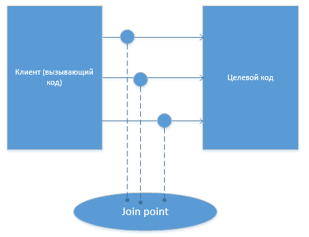

`Join point` — следующее понятие `АОП`, это точки наблюдения, присоединения к коду, где планируется введение функциональности.

### Pointcut

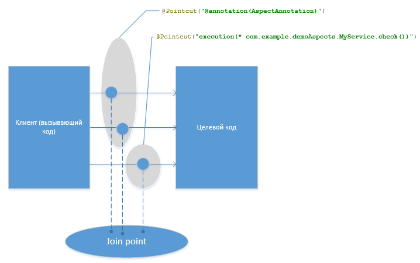

`Pointcut` — это срез, запрос точек присоединения, — это может быть одна и более точек. Правила запросов точек очень разнообразные, на рисунке выше, запрос по
аннотации на методе и конкретный метод. Правила можно объединять по `&&`, `||`, `!`.

### Advice

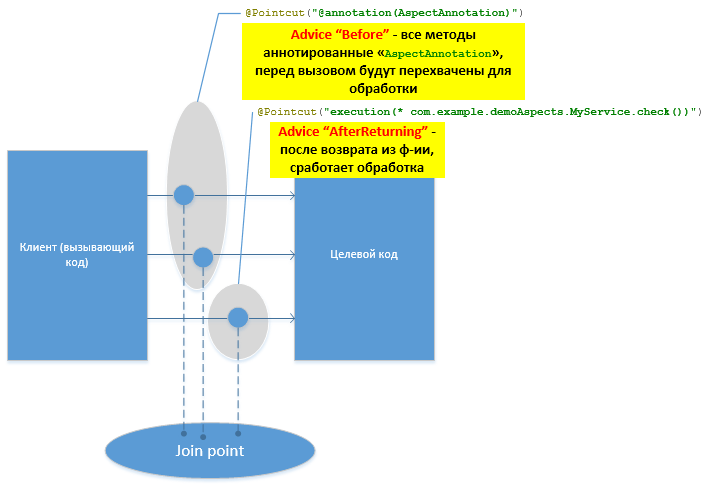

`Advice` — набор инструкций выполняемых на точках среза (`Pointcut`). Инструкции можно выполнять по событию разных типов:
- `Before` — перед вызовом метода
- `After` — после вызова метода
- `After returning` — после возврата значения из функции
- `After throwing` — в случае exception
- `After finally` — в случае выполнения блока `finally`
- `Around` — можно сделать пред., пост., обработку перед вызовом метода, а также вообще обойти вызов метода

на один `Pointcut` можно «повесить» несколько `Advice` разного типа.

### Aspect

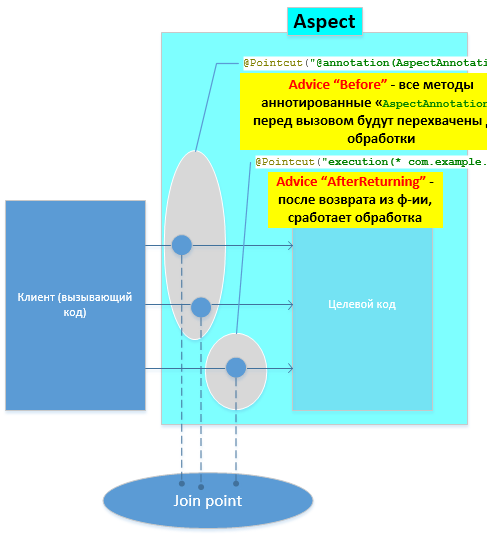

`Aspect` — модуль в котором собраны описания `Pointcut` и `Advice`.

Сейчас приведу пример и окончательно все встанет (или почти все) на свои места. Все знаем про логирование кода который пронизывает многие модули, не имея
отношения к бизнес коду, но тем не менее без него нельзя. И так отделяю этот функционал от бизнес кода.

### Пример

Целевой сервис

```java
@Service
public class MyService {

    public void method1(List<String> list) {
        list.add("method1");
        System.out.println("MyService method1 list.size=" + list.size());
    }

    @AspectAnnotation
    public void method2() {
        System.out.println("MyService method2");
    }

    public boolean check() {
        System.out.println("MyService check");
        return true;
    }
}
```

Аспект с описанием `Pointcut` и `Advice`.

```java
@Aspect
@Component
public class MyAspect {

    private Logger logger = LoggerFactory.getLogger(this.getClass());

    @Pointcut("execution(public * com.example.demoAspects.MyService.*(..))")
    public void callAtMyServicePublic() { }

    @Before("callAtMyServicePublic()")
    public void beforeCallAtMethod1(JoinPoint jp) {
        String args = Arrays.stream(jp.getArgs())
                .map(a -> a.toString())
                .collect(Collectors.joining(","));
        logger.info("before " + jp.toString() + ", args=[" + args + "]");
    }

    @After("callAtMyServicePublic()")
    public void afterCallAt(JoinPoint jp) {
        logger.info("after " + jp.toString());
    }
}
```

И вызывающий тестовый код

```java
@RunWith(SpringRunner.class)
@SpringBootTest
public class DemoAspectsApplicationTests {

    @Autowired
    private MyService service;

    @Test
    public void testLoggable() {
        List<String> list = new ArrayList();
        list.add("test");

        service.method1(list);
        service.method2();
        Assert.assertTrue(service.check());
    }

}
```

В целевом сервисе нет никакого упоминания про запись в лог, в вызывающем коде тем более, в все логирование сосредоточено в отдельном модуле в `Pointcut`
`callAtMyServicePublic` класса `MyAspect`.

Я запросил все `public` методы `MyService` с любым типом возврата `*` и количеством аргументов `(..)`

В `Advice Before` и `After` которые ссылаются на `Pointcut` (`callAtMyServicePublic`), я написал инструкции для записи в лог. `JoinPoint` это не обязательный
параметр, который предоставляет дополнительную информацию, но если он используется, то он должен быть первым.

Все разнесено в разные модули! Вызывающий код, целевой, логирование.

Результат выполнения:


### Правила Pointcut могут быть различные

- Запрос по аннотации на методе
```java
@Pointcut("@annotation(AspectAnnotation)")
public void callAtMyServiceAnnotation() { }

@Before("callAtMyServiceAnnotation()")
public void beforeCallAt() { }
```

- Запрос на конкретный метод с указанием параметров целевого метода
```java
@Pointcut("execution(* com.example.demoAspects.MyService.method1(..)) && args(list,..))")
public void callAtMyServiceMethod1(List<String> list) { }

@Before("callAtMyServiceMethod1(list)")
public void beforeCallAtMethod1(List<String> list) { }
```

- `Pointcut` для результата возврата
```java
@Pointcut("execution(* com.example.demoAspects.MyService.check())")
public void callAtMyServiceAfterReturning() { }

@AfterReturning(pointcut="callAtMyServiceAfterReturning()", returning="retVal")
public void afterReturningCallAt(boolean retVal) { }
```

- Пример профилирование того же сервиса с использованием `Advice` типа `Around`
```java
@Aspect
@Component
public class MyAspect {

    @Pointcut("execution(public * com.example.demoAspects.MyService.*(..))")
    public void callAtMyServicePublic() {
    }

    @Around("callAtMyServicePublic()")
    public Object aroundCallAt(ProceedingJoinPoint call) throws Throwable {
        StopWatch clock = new StopWatch(call.toString());
        try {
            clock.start(call.toShortString());
            return call.proceed();
        } finally {
            clock.stop();
            System.out.println(clock.prettyPrint());
        }
    }
}
```

### Полезные ссылки

[Spring AOP - habr](https://habr.com/ru/post/428548/)
Если запустить вызывающий код с вызовами методов `MyService`, то получим время вызова каждого метода. 

## Spring

`Spring Framework` (или коротко Spring) — универсальный open-source фреймворк с для Java. Несмотря на то, что Spring Framework не обеспечивает какую-либо
конкретную модель программирования, он стал широко распространённым в Java-сообществе главным образом как альтернатива и замена модели Enterprise JavaBeans.

### Особенности и преимущества
- `Внедрение зависимостей (DI) и инверсия управления (IoC)` позволяют писать независимые друг от друга компоненты, что дает преимущества в командной
  разработке, переносимости модулей и т.д..
- `Spring IoC` контейнер управляет жизненным циклом `Spring Bean` и настраивается наподобие `JNDI lookup` (поиска).
- Проект `Spring` содержит в себе множество подпроектов, которые затрагивают важные части создания софта, такие как веб сервисы, работа с базами данных,
  загрузка файлов, обработка ошибок и многое другое. Всё это настраивается в едином формате и упрощает поддержку приложения.

### Inversion of Control (IoC)

`Инверсия управления` - это принцип в разработке программного обеспечения, при котором управление объектами или частями программы передается в контейнер или
framework. Чаще всего он используется в контексте объектно-ориентированного программирования.

В отличие от традиционного программирования, в котором наш пользовательский код выполняет вызовы библиотеки, IoC позволяет инфраструктуре управлять потоком
программы и выполнять вызовы нашего пользовательского кода в зависимости от событий, которые были выполнены. Чтобы включить это, фреймворки используют
абстракции со встроенным дополнительным поведением.

Если мы хотим добавить наше собственное поведение, нам нужно расширить классы фреймворка или подключить наши собственные классы.

**Преимущества этой архитектуры:**
- Отделение выполнения задачи от ее реализации.
- Облегчить переключение между различными реализациями.
- Полезно при разработке модульных систем. Вы можете заменить компоненты без перекомпиляции.
- Более легкое тестирование программы путем изоляции компонента или проверки его зависимостей и обеспечения взаимодействия компонентов через контракты.

Инверсия управления может быть достигнута с помощью различных механизмов, таких как:
`Strategy design pattern`, `ServiceLocator pattern`, `Factory pattern` и внедрение зависимостей (`DI`).

### Dependency Injection

Класс должен полностью сосредоточиться на выполнении своих обязанностей, а не на создании объектов, необходимых для выполнения этих обязанностей.
И именно здесь начинается внедрение зависимостей: `она предоставляет классу требуемые объекты`.

`Dependency Injection (DI)`  – один из видов инверсии управления (`Inversion of Control – IoC`). Он означает то, что мы передаем задачу создания и управления
зависимостями кому-то со стороны. В случае спринга это будет его контейнер (`Application Context`).

**Существует три основных типа внедрения зависимостей:**
- `constructor injection`: все зависимости передаются через конструктор класса.
- `setter injection`: разработчик добавляет setter-метод, с помощью которого инжектор внедряет зависимость
- `field injection`: создаем поле и навешиваем `@Autowired`

### IoC container

Контейнер IoC - это общая характеристика фреймворков, реализующих IoC.

В среде `Spring` контейнер `IoC` представлен интерфейсом `ApplicationContext`. Контейнер `Spring` отвечает за создание экземпляров, настройку и сборку бинов,
а также за управление их жизненным циклом.

Для сборки бинов контейнер использует метаданные конфигурации, которые могут быть в форме конфигурации `XML` или `аннотаций`.

Вот один из способов создания экземпляра контейнера вручную:
```java
ApplicationContext context = new ClassPathXmlApplicationContext("applicationContext.xml");
```

### Типы контейнеров

- Spring `BeanFactory` Container
  Это самый простой контейнер, который обеспечивает базовую поддержку `DI` и который основан на интерфейсе `org.springframework.beans.factory.BeanFactory`. Такие
  интерфейсы, как `BeanFactoryAware` и `DisposableBean` всё ещё присутствуют в `Spring` для обеспечения обратной совместимости. `BeanFactory` обычно используется
  тогда, когда ресурсы ограничены (мобильные устройства). Поэтому, если ресурсы не сильно ограничены, то лучше использовать `ApplicationContext`.

- Spring `ApplicationContext` Container
  `ApplicationContext` является более сложным и более продвинутым `Spring Container-ом`. Так же, как `BeanFactory`, `ApplicationContext` загружает бины,
  связывает их вместе и конфигурирует их определённым образом. Но кроме этого, `ApplicationContext` обладает дополнительной функциональностью: распознавание
  текстовых сообщений из файлов настройки и отображение событий, которые происходят в приложении различными способами. Этот контейнер определяется интерфейсом
  `org.springframework.context.ApplicationContext`.

**Чаще всего используются следующие реализации AppicationContext:**
- `FileSystemXmlApplicationContext`
  Загружает данные о бине из `XML` файла. При использовании этой реализации в конструкторе необходимо указать полный адрес конфигурационного файла.
- `ClassPathXmlApplicationContext`
  Этот контейнер также получает данные о бине из `XML` файла. Но в отличие от `FileSystemApplicationContext`, в этом случае необходимо указать относительный
  адрес конфигурационного файла (`CLASSPATH`).
- `WebXmlApplicationContext`
  Эта реализация `ApplicationContext` получает необходимую информацию из веб-приложения.

### Что такое бин Bean?

`Бины` – это объекты, которые являются основой приложения и управляются `Spring IoC` контейнером. Определение бина содержит метаданные конфигурации,
которые необходимы управляющему контейнеру для получения следующей информации:
- Как создать бин;
- Информацию о жизненном цикле бина;
- Зависимости бина.

### Области видимости бинов

Когда мы определяем `bean` в Spring Framework, у нас есть возможность объявить область видимости этого компонента.
В `Spring Framework` имеются пять возможных значений свойства `scope`:
- `singleton`: Определяет один единственный бин для каждого контейнера `Spring IoC` (**используется по умолчанию**). Этот экземпляр помещается в кэш таких
  же бинов (синглтонов) и все последующие вызовы бина с таким именем будут возвращать объект из кэша.
- `prototype`: Когда мы присваиваем свойству scope значение `prototype`, контейнер `Spring IoC` создаёт новый экземпляр бина на каждый полученный запрос.
- `request`: Создаётся один экземпляр бина на каждый `HTTP` запрос. Касается исключительно `ApplicationContext`.
- `session`: Создаётся один экземпляр бина на каждую `HTTP` сессию. Касается исключительно `ApplicationContext`.
- `global-session`: Создаётся один экземпляр бина на каждую глобальную `HTTP` сессию. Касается исключительно `ApplicationContext`.

### Жизненный цикл бинов

`Spring бины` инициализируются при инициализации `Spring` контейнера и происходит внедрение всех зависимостей. Когда контейнер уничтожается, то уничтожается
и всё содержимое.

После создания экземпляра бина, могут понадобиться некоторые действия для того, чтобы сделать его работоспособным. Также при удалении бина из контейнера,
необходима очистка. В документации указан список того, что происходит с бином от момента создания до момента уничтожения. Но для начального понимания нам
необходимо разобраться в двух наиболее важных методах, которые вызываются во время инициализации бина и его уничтожения.

Для управления созданием и уничтожением бина у нас есть параметры `init-method` и `destroy-method` для `xml`-файлов.

В качестве альтернативы есть интерфейсы `InitializingBean` c методом `afterPropertiesSet()` и `DisposableBean` с методом `destroy()`. Эти интерфейсы просто
нужно реализовать в классе бина.

Еще один вариант аннотации `@PostConstruct` и `@PreDestroy`.

### Является ли бин потокобезопасным?

По умолчанию бин задается как `синглтон` в Spring. Таким образом все публичные переменные класса могут быть изменены одновременно из разных мест.
Так что — нет, не является. Однако поменяв область действия бина на `request`, `prototype`, `session` он станет потокобезопасным, но это скажется на
производительности.

### field injection VS constructor injection

Второй вариант лучше потому что:
- зависимости четко определены. При тестировании или создании экземпляров объекта в любых других обстоятельствах (например, явное создание экземпляров
  компонента в классе конфигурации).
- в таком случае поле можно сделать финальным.
- вам не нужно использовать рефлексию, чтобы установить зависимость.

### Что такое controller в Spring MVC?

Ключевым интерфейсом в `Spring MVC` является `Controller`. Контроллер обрабатывает запросы к действиям, осуществляемые пользователями в пользовательском
интерфейсе, взаимодействуя с уровнем обслуживания, обновляя модель и направляя пользователей на соответствующие представления в зависимости от результатов
выполнения. `Controller` — управление, связь между моделью и видом.

Основным контроллером в `Spring MVC` является `org.springframework.web.servlet.DispatcherServlet`. Задается аннотацией `@Controller` и часто используется с
аннотацией `@RequestMapping`, которая указывает какие запросы будут обрабатываться этим контроллером.

### Что такое DispatcherServlet

Вся логика `Spring MVC` построена вокруг `DispatcheerServlet`, который принимает и обрабатывает все `HTTP`-запросы и ответы на них. Рабочий процесс обработки
запроса `DispatcherServlet'ом` проиллюстрирован на следующей диаграмме:


Ниже приведена последовательность событий, соответствующая входящему `HTTP`-запросу:

1. После получения запроса `DispatcherServlet` обращается к интефейсу `HandlerMapping`, который определяет, какой контроллер должен быть вызван, после чего,
   отправляет запрос в нужный контроллер.
2. `Controller` принимает запрос и вызывает соответствующий метод. Вызванный метод определяет данные модели, основанные на определённой бизнес-логике и
   возвращает в `DispatcherServlet` имя `View`.
3. При помощи интерфейса `ViewResolver` `DispatcherServlet` определяет, какой `View` нужно использовать на основании полученного имени.
4. После того, как `View` создан, `DispatcherServlet` отправляет данные модели в виде атрибутов во `View`, который в конечном итоге отображается в браузере.

Все вышеупомянутые компоненты, а именно, `HandlerMapping`, `Controller` и `ViewResolver`, являются частями интерфейса `WebApplicationContext`.

### Какая разница между аннотациями @Component, @Repository и @Service в Spring?

- `@Component` используется для указания класса в качестве компонента спринг. При использовании поиска аннотаций, такой класс будет сконфигурирован как
  spring bean. Пользовательские аннотации, производные от `@Component`, могут добавлять специальную логику в бинах.
- `@Controller` специальный тип класса, применяемый в `MVC` приложениях. Обрабатывает запросы и часто используется с аннотацией `@RequestMapping`.
- `@Repository` указывает, что класс используется для работы с поиском, получением и хранением данных. Аннотация может использоваться для реализации шаблона
  `DAO`. Например, бины, созданные при помощи `@Repository`, дополнительно имеют обработку для `JDBC Exception`.
- `@Service` указывает, что класс является сервисом для реализации бизнес логики (на самом деле не отличается от `Component`, но просто помогает разработчику
  указать смысловую нагрузку класса).

Для указания контейнеру на класс-бин можно использовать любую из этих аннотаций. Но различные имена позволяют различать назначение того или иного класса.

### Для чего нужна аннотация @ComponentScan?

Первый шаг для описания Spring Beans это добавление аннотации — `@Component`, или `@Service`, или `@Repository`.

Однако, Spring ничего не знает об этих бинах, если он не знает где искать их. То, что скажет `Spring` где искать эти бины и называется `Component Scan`.
В `@ComponentScan` вы указываете пакеты, которые должны сканироваться.

Spring будет искать бины не только в пакетах для сканирования, но и в их подпакетах.

### Как вы добавите Component Scan в Spring Boot?

```java
@SpringBootApplication
public class Application {
    public static void main(String[] args) {
        SpringApplication.run(Application.class, args);
    }
}
```

`@SpringBootApplication` определяет автоматическое сканирование пакета, где находится класс `Application`. Всё будет в порядке, ваш код целиком находится в
указанном пакете или его подпакетах.

Однако, если необходимый вам компонент находится в другом пакете, вы должны использовать дополнительно аннотацию `@ComponentScan`, где перечислите все
дополнительные пакеты для сканирования.

```java
@SpringBootApplication
@ComponentScan(basePackages = "com.baeldung.componentscan.springbootapp.animals")
```

### В чём отличие между @Component и @ComponentScan?

`@Component` и `@ComponentScan` предназначены для разных целей:
- `@Component` помечает класс в качестве кандидата для создания Spring бина.
- `@ComponentScan` указывает где Spring искать классы, помеченные аннотацией `@Component` или его производной.

### В чём разница между @Bean и @Component?

- `@Bean` используется в конфигурационных классах Spring. Он используется для непосредственного создания бина.
- `@Component` используется со всеми классами, которыми должен управлять Spring. Когда Spring видит класс с `@Component`, Spring определяет этот класс как
  кандидата для создания bean.

### Можем ли мы использовать @Component вместо @Service для бизнес логики?

Да. Конечно.

Если `@Component` является универсальным стереотипом для любого Spring компонента, то `@Service` в настоящее время является его псевдонимом. Однако,
в официальной документации `Spring` рекомендуется использовать именно `@Service` для бизнес логики.

### В чем различие между web.xml и servlet.xml?

- `web.xml` — Метаданные и конфигурация любого веб-приложения, совместимого с Java EE. Java EE стандарт для веб-приложений.
- `servlet.xml` — файл конфигурации, специфичный для Spring Framework.

### В чем разница между Сквозной Функциональностью (Cross Cutting Concerns) и АОП (аспектно оринтированное программирование)?

- `Сквозная Функциональность` — функциональность, которая может потребоваться вам на нескольких различных уровнях — логирование, управление
  производительностью, безопасность и т.д.
- `АОП` — один из подходов к реализации данной проблемы.

### В чем разница между IOC (Inversion of Control) и Application Context?

- `IOC` - инверсия управления. Вместо ручного внедрения зависимостей, фреймворк забирает ответственность за это.
- `ApplicationContext` — реализация IOC спрингом.

### В чем разница между classPathXmlApplicationContext и annotationConfigApplicationContext?

- `classPathXmlApplicationContext` — если вы хотите инициализировать контекст Spring при помощи `xml`
- `annotationConfigApplicationContext` — если вы хотите инициализировать контекст Spring при помощи конфигурационного класса `java`

### Как вы решаете какой бин инжектить, если у вас несколько подходящих бинов. Расскажите о @Primary и @Qualifier?

Если есть бин, который вы предпочитаете большую часть времени по сравнению с другими, то используйте `@Primary`, и используйте `@Qualifier` для нестандартных
сценариев.

Если все бины имеют одинаковый приоритет, мы всегда будем использовать `@Qualifier`

Если бин надо выбрать во время исполнения программы, то эти аннотации вам не подойдут. Вам надо в конфигурационном классе создать метод, пометить его
аннотацией `@Bean`, и вернуть им требуемый бин.

### Как мы можем выбрать подходящий бин при помощи application.properties?

Рассмотрим пример:

```java
interface GreetingService {
    public String sayHello();
}


@Component(value="real")
class RealGreetingService implements GreetingService {
    public String sayHello() {
        return "I'm real";
    }
}

@Component(value="mock")
class MockGreetingService implements GreetingService {
    public String sayHello() {
        return "I'm mock";
    }
}
```

Тогда в `application.properties` добавим свойство:

```java
application.greeting: real
```

Воспользуемся данным решением:

```java
@RestController
public class WelcomeController {
    @Resource(name="${application.greeting}")
    private GreeterService service1;
}
```

### В чём разница между @Controller и @RestController?

`@RestController = @Controller + @ResponseBody`

`@RestController` превращает помеченный класс в Spring-бин. Этот бин для конвертации входящих/исходящих данных использует `Jackson message converter`.
Как правило целевые данные представлены в `json` или `xml`.

### Почему иногда мы используем @ResponseBody, а иногда ResponseEntity?

`@ResponseEntity` необходим, только если мы хотим кастомизировать ответ, добавив к нему статус ответа. Во всех остальных случаях будем использовать
`@ResponseBody`.

```java
@GetMapping(value=”/resource”) 
@ResponseBody 
public Resource sayHello() { 
  return resource; 
}

@PostMapping(value=”/resource”) 
public ResponseEntity createResource() { 
  return ResponseEntity.created(resource).build(); 
}
```

Для `@ResponseBody` единственные состояния статуса это `SUCCESS(200)`, если всё ок и `SERVER ERROR(500)`, если произошла какая-либо ошибка.

Допустим мы что-то создали и хотим отправить статус `CREATED(201)`. В этом случае мы используем `@ResponseEntity`.

### Почему для конфиденциальных данных рекомендуется использовать POST, а не GET запросы?

- В случае `GET` запроса передаваемые параметры являются частью `url`, и все маршрутизаторы, через которые пройдет наш `GET` запрос, смогут их прочитать.
- В случае `POST` запроса передаваемые параметры являются частью тела запроса. При использовании `HTTPS`, тело запроса шифруется. Следовательно,
  использование `POST` запросов является более безопасным.

### Можно ли передать в запросе один и тот же параметр несколько раз?

Да, можно принять все значения, используя массив в методе контроллера:

```java
http://localhost:8080/login?name=Ranga&name=Ravi&name=Sathish

public String method(@RequestParam(value="name") String[] names){   
}
```

### Схема ServletFilter и HandlerInterceptor


### Что такое ServletFilter?

Фильтр выполняет задачи фильтрации либо для запроса к ресурсу, либо для ответа от ресурса, либо для обоих случаев. Каждый фильтр имеет доступ к объекту
`FilterConfig`, из которого он может получить свои параметры инициализации, ссылку на `ServletContext`, который он может использовать.

Контейнер сервлета вызывает метод инициализации ровно один раз после создания экземпляра фильтра. Метод инициализации должен успешно завершиться, прежде чем
фильтру будет предложено выполнить какие-либо действия по фильтрации.

Фильтр выполняет операцию фильтрации в методе `doFilter()`, и он вызывается контейнером каждый раз, когда пара запрос/ответ проходит через цепочку запрос-ответ.

Метод `destroy()` вызывается только после завершения всех потоков в методе фильтра `doFilter()` или по истечении таймаута. Этот метод дает фильтру возможность
очистить любые ресурсы, которые удерживаются (например, память, дескрипторы файлов, потоки), и убедиться, что любое постоянное состояние синхронизируется с
текущим состоянием фильтра в памяти.

Вот некоторые примеры использования фильтров:
1. Аутентификация
2. Ведение журнала и аудит
3. Преобразование изображений
4. Сжатие данных
5. Шифрование

### Что такое HandlerInterceptor?

`HandlerInterceptor` вызывается до того, как соответствующий `HandlerAdapter` инициирует выполнение самого `handler-а`. Этот механизм может использоваться для
большого количества аспектов предварительной обработки, например для проверок авторизации или общего поведения обработчика, такого как изменение языка или темы.
Его основная цель - выделить повторяющийся код `handler-a`.

`HandlerInterceptor` очень похож на `ServletFilter`, но он просто позволяет настраивать предварительную обработку с возможностью запрета выполнения самого
`handler-a` и настраиваемой пост-обработки. **Фильтры являются более мощными, поскольку они позволяют обмениваться объектами запроса и ответа**, которые передаются
по цепочке. Обратите внимание, что фильтр настраивается в `web.xml`, `HandlerInterceptor` в контексте приложения.

`DispatcherServlet` обрабатывает `handler` в цепочке выполнения, состоящей из любого количества `interceptor-ов`, с самим `handler-ом` в конце. С помощью метода
`preHandle()` каждый перехватчик может решить прервать цепочку выполнения, обычно отправляя ошибку `HTTP` или записывая собственный ответ.

Перехватчики, работающие с `HandlerMapping` на платформе, должны реализовывать интерфейс `HandlerInterceptor`.

Этот интерфейс содержит три основных метода:
- `preHandle()` - вызывается перед выполнением фактического обработчика, но представление еще не создано
- `postHandle()` - вызывается после выполнения обработчика
- `afterCompletion()` - вызывается после завершения полного запроса и создания представления

### ServletFilter VS HandlerInterceptor

|Servlet filter|Handler interceptor|
|--------------|-------------------|
|Фильтры настраиваются в `web.xml`|Интерсепторы настраиваются в `application context`. Это концепция отностится сугубо к Spring|
|Фильтр это Java класс, который выполняется сервлет контейнером для каждого `HTTP` запроса и ответа|Spring интерсепторы похожи на фильтры, но они работают в Spring контексте|
|Дает возможность управлять входящим `HTTP` запросом до того, как он достигнет ресурса - `JSP` страничку, эндпоинт и тд.|Он более мощный для управления `HTTP` запросом и ответом, но они могут реализовать более сложное поведение, потому что могут получить доступ ко всему контексту Spring|
|Фильтр сервлетов обычно применяется ко всем запросам, способным учитывать только параметры каждого запроса|Имеет доступ только к конкретному хендлеру - это означает, что любое действие, которое вы выполняете, может варьироваться в зависимости от того, что делает этот запрос.|
|`doFilter()` более универсален, чем `postHandle()`. Вы можете изменить объект запроса и ответа и подложить этот измененный обхект в цепочку запросов или даже заблокировать обработку запроса|Предоставляет 3 разных метода, поэтому мы можем применить нужное действие в определенный момент|
|Может содержать цепочку фильтров и порядок их выполнения, но они не могут быть сконфигурированы на уровне `handler mapping`|Можно устанавливать разные интерсепторы для разных груп хендлеров, они сконфигурированы на уровне `handler mapping`|
|Фильтр хорошо подходит для обработки запросов и просмотра содержимого, например для составных форм и сжатия GZIP.|Подробные задачи предварительной обработки, связанные с обработчиком, являются кандидатами для реализаций `HandlerInterceptor`, особенно с учетом кода общего обработчика и проверок авторизации.|

### Как реализовать Filter?

```java
@Component
@Order(1)
public class TransactionFilter implements Filter {

	@Autowired
	private HttpServletReqUtil reqUtil;

	@Override
	public void doFilter(ServletRequest request, ServletResponse response, FilterChain chain) throws IOException, ServletException {
		final MyHttpServletRequestWrapper wrappedRequest = new MyHttpServletRequestWrapper((HttpServletRequest) request);
		System.out.println("Inside Servlet Filter");
		System.out.println("User IP address: " + reqUtil.getRemoteAddress(wrappedRequest));
		System.out.println("Request Params: " + reqUtil.getRequestParams(wrappedRequest));
		System.out.println("Request Payload: " + reqUtil.getPayLoad(wrappedRequest));
		System.out.println("Exiting Servlet Filter");
		chain.doFilter(wrappedRequest, response);
	}
}
```

Реализация `ServletFilter` действительно проста, мы реализуем `javax.servlet.Filter`, `@Order` указывает порядок, в котором фильтры должны выполняться.
Мы указали порядок как 1, поэтому это будет первый фильтр, который будет выполнен. `chain.doFilter`, передает объект запроса и ответа следующему фильтру в цепочке
или обработчику, если это последний фильтр.

Внутри метода `doFilter()` я проверил, могу ли я получить доступ к `IP`-адресу пользователя, параметрам запроса из запроса, пейлоду, то есть к телу запроса из
объекта запроса. Но проблема, с которой мы сталкиваемся, заключается в том, что **запрос может быть прочитан только один раз**, и если мы попытаемся получить к
нему доступ в фильтре, он выдаст ошибку при доступе к нему в контроллере. Поэтому, чтобы предотвратить это, я создал оболочку, которая расширяет
`HttpServletRequestWrapper`, чтобы возвращать копию запроса через его конструктор.

```java
public class MyHttpServletRequestWrapper extends HttpServletRequestWrapper {
	private ByteArrayOutputStream cachedBytes;

	public MyHttpServletRequestWrapper(HttpServletRequest request) {
		super(request);
	}

	@Override
	public ServletInputStream getInputStream() throws IOException {
		if (cachedBytes == null)
			cacheInputStream();
		return new CachedServletInputStream();
	}

	@Override
	public BufferedReader getReader() throws IOException {
		return new BufferedReader(new InputStreamReader(getInputStream()));
	}

	private void cacheInputStream() throws IOException {
		cachedBytes = new ByteArrayOutputStream();
		IOUtils.copy(super.getInputStream(), cachedBytes);
	}

	/* An inputstream which reads the cached request body */
	public class CachedServletInputStream extends ServletInputStream {
		private ByteArrayInputStream input;

		public CachedServletInputStream() {
			/* create a new input stream from the cached request body */
			input = new ByteArrayInputStream(cachedBytes.toByteArray());
		}

		@Override
		public int read() throws IOException {
			return input.read();
		}

		@Override
		public boolean isFinished() {
			return false;
		}

		@Override
		public boolean isReady() {
			return false;
		}
		
		@Override
		public void setReadListener(ReadListener listener) {
		}
	}
}
```

Теперь, когда мы можем обращаться к объекту запроса несколько раз, я создал класс для возврата параметров из объекта запроса, который я использовал как в
`ServletFilter`, так и в `HandlerInterceptor` для демонстрационных целей.

```java
@Service
public class HttpServletReqUtil {

	public String getRemoteAddress(HttpServletRequest request) {
		String ipAddress = request.getHeader("X-FORWARDED-FOR");
		if (ipAddress == null) {
			ipAddress = request.getRemoteAddr();
		}
		return ipAddress;
	}

	public String getPayLoad(HttpServletRequest request) {
		final String method = request.getMethod().toUpperCase();
		if ("POST".equals(method) || "PUT".equals(method)) {
			return extractPostRequestBody(request);
		}
		return "Not a POST or PUT method";
	}

	public String getRequestParams(HttpServletRequest request) {
		final StringBuilder params = new StringBuilder();
		Enumeration<String> parameterNames = request.getParameterNames();
		for (; parameterNames.hasMoreElements();) {
			String paramName = parameterNames.nextElement();
			String paramValue = request.getParameter(paramName);
			if ("password".equalsIgnoreCase(paramName) || "pwd".equalsIgnoreCase(paramName)) {
				paramValue = "*****";
			}
			params.append(paramName).append(": ").append(paramValue).append(System.lineSeparator());
		}
		return params.toString();

	}

	private static String extractPostRequestBody(HttpServletRequest request) {
		if ("POST".equalsIgnoreCase(request.getMethod())) {
			Scanner s = null;
			try {
				s = new Scanner(request.getInputStream(), "UTF-8").useDelimiter("\\A");
			} catch (IOException e) {
				e.printStackTrace();
			}
			return s.hasNext() ? s.next() : "";
		}
		return "";
	}
}
```

Итак, в `TransactionFilter` я автоматически подключил этот класс и передал завернутый объект `Request` в каждую из функций и распечатал возвращенные из них
значения.

### Как реализовать HandlerInterceptor?

```java
@Component
public class GeneralInterceptor implements HandlerInterceptor {

	@Autowired
	private HttpServletReqUtil reqUtil;

	@Override
	public boolean preHandle(HttpServletRequest request, HttpServletResponse response, Object handler) throws Exception {
		final MyHttpServletRequestWrapper wrappedRequest = new MyHttpServletRequestWrapper(request);
		System.out.println("Pre handle method has been called");
		System.out.println("User IP address: " + reqUtil.getRemoteAddress(wrappedRequest));
		System.out.println("Request Params: " + reqUtil.getRequestParams(wrappedRequest));
		System.out.println("Request Payload: " + reqUtil.getPayLoad(wrappedRequest));
		System.out.println("Exiting Pre handle method");
		return true;
	}

	@Override
	public void postHandle(HttpServletRequest request, HttpServletResponse response, Object handler, ModelAndView modelAndView) throws Exception {
		   System.out.println("Post handle method has been called");
	}

	@Override
	public void afterCompletion(HttpServletRequest request, HttpServletResponse response, Object handler, Exception exception) throws Exception {
		   System.out.println("After Completion method has been called");
	}
}
```

`Interceptor` реализует интерфейс `HandlerInterceptor`, который имеет 3 основных метода:

- `prehandle()` - вызывается перед выполнением фактического обработчика, но представление еще не создано
- `postHandle()` - вызывается после выполнения обработчика
- `afterCompletion()` - вызывается после завершения полного запроса и создания представления

Я распечатал элементы из объекта запроса так же, как и в случае фильтра. Теперь, когда перехватчик готов, нам нужно зарегистрироваться в `InterceptorRegistry`.

```java
@Component
public class InterceptorAppConfig extends WebMvcConfigurationSupport {
	@Autowired
	GeneralInterceptor generalInterceptor;

	@Override
	public void addInterceptors(InterceptorRegistry registry) {
		registry.addInterceptor(generalInterceptor);
	}
}
```

Теперь, когда мы написали наш фильтр и интерспетор, давайте посмотрим на иерархию, в которой эти методы перехватывают остальные вызовы api. Я создал контроллер,
чтобы добавить ученика и получить ученика по идентификатору, давайте отправим запрос и посмотрим, как работают фильтр и перехватчик.


Мы видим последовательность операторов печати, `HTTP`-запрос сначала попадает в фильтр сервлета, где печатаются `IP`-адрес пользователя и payload, поскольку в
запросе нет никаких параметров запроса, он их не печатал. Затем запрос достиг метода `preHandle()` в `handler interceptor`, где он распечатывает те же данные,
а затем он достигает фактического контроллера, где объект ученика сохраняется в базе данных.

Таким образом, порядок выполнения следующей:
```
1. Фильтр -> 2. Перехватчик -> 3. Контроллер HTTP-запроса.
```

От контроллера ответ сначала поступает в метод `postHandle()`, а затем в метод `afterCompletion()` в интерсепторе. Давайте также проверим пример для
`requestparams`.


Последовательность такая же, как и раньше, с той лишь разницей, что мы не видим пейлод из тела запроса, поскольку это запрос на получение, а идентификатор, который
был отправлен в параметрах запроса, виден.

### Полезные ссылки

[Inversion of Control Containers and the Dependency Injection pattern - Martin Fowler](https://www.martinfowler.com/articles/injection.html#ComponentsAndServices)

[Intro to Inversion of Control and Dependency Injection - Baeldung](https://www.baeldung.com/inversion-control-and-dependency-injection-in-spring)

[Краткое введение во внедрение зависимостей](https://medium.com/@xufocoder/a-quick-intro-to-dependency-injection-what-it-is-and-when-to-use-it-de1367295ba8)

[Spring: вопросы к собеседованию - habr](https://habr.com/ru/post/350682/)

[Introduction To Servlet Filter and Handler Interceptor - Medium](https://medium.com/techno101/introduction-to-servlet-filter-and-handler-interceptor-ba1167b1f52c)

[Servlet Filter and Handler Interceptor- Spring boot Implementation - Medium](https://medium.com/techno101/servlet-filter-and-handler-interceptor-spring-boot-implementation-b58d397d9dbd)

## Spring Boot

### Что такое Spring Boot и каковы его основные особенности?

`Spring Boot` - это, по сути, платформа для быстрой разработки приложений, построенная на основе `Spring Framework`. Благодаря автоматической настройке и поддержке
встроенного сервера приложений, в сочетании с обширной документацией и поддержкой сообщества, `Spring Boot` на сегодняшний день является одной из самых популярных
технологий в экосистеме `Java`.

Вот несколько важных особенностей:

- `Стартеры` - набор дескрипторов зависимостей для включения соответствующих зависимостей на ходу.
- `Автоконфигурация` - способ автоматической настройки приложения на основе зависимостей, представленных в пути к классам.
- `Актуатор` - для получения готовых к производству функций, таких как мониторинг.
- `Безопасность`
- `Логирование`

### В чем разница между Spring и Spring Boot?

`Spring Framework` предоставляет несколько функций, которые упрощают разработку веб-приложений. Эти функции включают `dependency injection`, `data binding`,
аспектно-ориентированное программирование, `data access` и многое другое.

С годами `Spring` становится все более и более сложным, и количество настроек, требуемых для этого приложения, может быть устрашающим. Вот где пригодится
`Spring Boot` - он упрощает настройку приложения `Spring`.

По сути, в то время как `Spring` не пользуется особой популярностью, `Spring Boot` имеет самоуверенный взгляд на платформу и библиотеки, что позволяет нам быстро
приступить к работе.

Вот два наиболее важных преимущества `Spring Boot`:

- Автоматическая настройка приложений на основе артефактов, обнаруженных в пути к классам
- Предоставлять нефункциональные функции, общие для приложений в производственной среде, такие как проверки безопасности или работоспособности

### Как мы можем настроить приложение Spring Boot с Maven?

Мы можем включить `Spring Boot` в проект `Maven`, как и любую другую библиотеку. Однако лучший способ - унаследовать от родительского проекта `spring-boot-starter`
и объявить зависимости для стартеров `Spring Boot`. Это позволяет нашему проекту повторно использовать настройки `Spring Boot` по умолчанию.

Наследовать проект `spring-boot-starter-parent` очень просто - нам нужно только указать родительский элемент в `pom.xml`:

```xml
<parent>
     <groupId> org.springframework.boot </groupId>
     <artifactId> Spring-boot-starter-parent </artifactId>
     <version> 2.3.0.RELEASE </version>
</parent>
```

Использовать стартовый родительский проект удобно, но не всегда возможно. Например, если наша компания требует, чтобы все проекты унаследовали от стандартного
`POM`, мы все равно можем извлечь выгоду из управления зависимостями `Spring Boot` с использованием настраиваемого родителя.

### Что такое Spring Initializr?

`Spring Initializr` - это удобный способ создать проект `Spring Boot`.

Мы можем перейти на сайт `Spring Initializr`, выбрать инструмент управления зависимостями (`Maven` или `Gradle`), язык (`Java`, `Kotlin` или `Groovy`), схему
упаковки (`Jar` или `War`), версию и зависимости и загрузить проект.

Это создает для нас скелет проекта и экономит время на настройку, так что мы можем сосредоточиться на добавлении бизнес-логики.

Даже когда мы используем мастер новых проектов нашей `IDE` (например, `STS` или `Eclipse` с плагином `STS`) для создания проекта `Spring Boot`, он использует
`Spring Initializr` под капотом.

### Какие есть стартеры Spring Boot?

Каждый стартер играет роль универсального центра для всех необходимых нам технологий `Spring`. Затем транзитивно подключаются и управляются согласованным образом
другие необходимые зависимости.

Все стартеры находятся в группе `org.springframework.boot`, и их имена начинаются с `spring-boot-starter-`. Этот шаблон именования упрощает поиск стартеров,
особенно при работе с IDE, которые поддерживают поиск зависимостей по имени.

На момент написания этой статьи в нашем распоряжении более 50 стартеров. Чаще всего используются:

- `spring-boot-starter`: стартер ядра, включая поддержку автоконфигурации, логирование и YAML
- `spring-boot-starter-aop`: стартер для аспектно-ориентированного программирования с помощью `Spring AOP` и `AspectJ`
- `spring-boot-starter-data-jpa`: стартер для использования `Spring Data JPA` с `Hibernate`
- `spring-boot-starter-security`: стартер для использования `Spring Security`
- `spring-boot-starter-test`: стартер для тестирования приложений `Spring Boot`
- `spring-boot-starter-web`: стартер для создания веб-приложений, включая `RESTful`, с использованием `Spring MVC`

### Как отключить определенную автоконфигурацию?

Если мы хотим отключить конкретную автоконфигурацию, мы можем указать это с помощью атрибута `exclude` аннотации `@EnableAutoConfiguration`. Например, этот фрагмент
кода нейтрализует `DataSourceAutoConfiguration`:

```java
// other annotations
@EnableAutoConfiguration(exclude = DataSourceAutoConfiguration.class)
public class MyConfiguration { }
```

Если бы мы включили автоконфигурацию с аннотацией `@SpringBootApplication`, которая имеет `@EnableAutoConfiguration` в качестве метааннотации, мы могли бы отключить
автоконфигурацию с помощью атрибута с тем же именем:

```java
/ other annotations
@SpringBootApplication(exclude = DataSourceAutoConfiguration.class)
public class MyConfiguration { }
```

Мы также можем отключить автоконфигурацию с помощью свойства среды `spring.autoconfigure.exclude`. Этот параметр в файле `application.properties` делает то же
самое, что и раньше:

```java
spring.autoconfigure.exclude = org.springframework.boot.autoconfigure.jdbc.DataSourceAutoConfiguration
```

### Как зарегистрировать пользовательскую автоконфигурацию?

Чтобы зарегистрировать класс автоконфигурации, мы должны указать его полное имя в разделе `EnableAutoConfiguration` в файле `META-INF/spring.factories`:

```java
org.springframework.boot.autoconfigure.EnableAutoConfiguration=com.baeldung.autoconfigure.CustomAutoConfiguration
```

Если мы создаем проект с `Maven`, этот файл должен быть помещен в каталог `resources/META-INF`, который окажется в указанном месте на этапе `package`.

### Как указать автоконфигурации, чтобы она отступила, когда бин существует?

Чтобы дать классу автоконфигурации команду отступить, когда компонент уже существует, мы можем использовать аннотацию `@ConditionalOnMissingBean`. Наиболее
заметные атрибуты этой аннотации:
- `value`: типы бинов для проверки
- `name`: имена бинов для проверки

При размещении в методе, аннотированом `@Bean`, целевой тип по умолчанию соответствует типу возврата метода:

```java
@Configuration
public class CustomConfiguration {
    @Bean
    @ConditionalOnMissingBean
    public CustomService service() { ... }
}
```

### Как задеплоить веб-приложения Spring Boot в виде файлов Jar и War?

Традиционно мы упаковываем веб-приложение в файл `WAR`, а затем развертываем его на внешнем сервере. Это позволяет нам размещать несколько приложений на одном
сервере. В то время, когда не хватало процессора и памяти, это был отличный способ сэкономить ресурсы.

Однако все изменилось. Компьютерное оборудование сейчас довольно дешево, и все внимание переключилось на конфигурацию серверов. Небольшая ошибка в настройке
сервера при развертывании может привести к катастрофическим последствиям.

`Spring` решает эту проблему, предоставляя плагин, а именно `spring-boot-maven-plugin`, для упаковки веб-приложения в виде исполняемого `JAR`. Чтобы включить этот
плагин, просто добавьте элемент плагина в `pom.xml`:

```xml
<plugin>
    <groupId>org.springframework.boot</groupId>
    <artifactId>spring-boot-maven-plugin</artifactId>
</plugin>
```

Установив этот плагин, мы получим `fat JAR` после выполнения фазы `package`. Этот `JAR` содержит все необходимые зависимости, включая встроенный сервер.
Таким образом, нам больше не нужно беспокоиться о настройке внешнего сервера.

Затем мы можем запустить приложение так же, как обычный исполняемый файл `JAR`.

Обратите внимание, что элемент `packaging` в файле `pom.xml` должен быть установлен на `jar` для создания файла `JAR`:

```xml
<packaging>jar</packaging>
```

Если мы не включим этот элемент, по умолчанию он также будет `jar`.

Если мы хотим создать файл `WAR`, измените элемент упаковки на `war`:

```xml
<packaging>war</packaging>
```

И оставьте зависимость контейнера от упакованного файла:

```xml
<dependency>
    <groupId>org.springframework.boot</groupId>
    <artifactId>spring-boot-starter-tomcat</artifactId>
    <scope>provided</scope>
</dependency>
```

После выполнения фазы `package` Maven у нас будет разворачиваемый файл `WAR`.

### Как использовать Spring Boot для приложений командной строки?

Как и любая другая программа `Java`, приложение командной строки `Spring Boot` должно иметь метод `main()`. Этот метод служит точкой входа, которая вызывает метод
`SpringApplication#run` для начальной загрузки приложения:

```java
@SpringBootApplication
public class MyApplication {
    public static void main(String[] args) {
        SpringApplication.run(MyApplication.class);
        // other statements
    }
}
```

Затем класс `SpringApplication` запускает контейнер `Spring` и автоматически настраивает бины.

Обратите внимание, что мы должны передать класс конфигурации методу `run()`, чтобы он работал в качестве основного источника конфигурации. По соглашению этим
аргументом является сам входной класс.

После вызова метода `run()` мы можем выполнять другие операторы, как в обычной программе.

### Каковы возможные источники внешней конфигурации?

`Spring Boot` обеспечивает поддержку внешней конфигурации, позволяя запускать одно и то же приложение в различных средах. Мы можем использовать файлы `properties`,
файлы `YAML`, `environment variables`, `system properties` и аргументы параметров командной строки, чтобы указать свойства конфигурации.

Затем мы можем получить доступ к этим свойствам с помощью аннотации `@Value`, связанного объекта с помощью аннотации `@ConfigurationProperties` или абстракции
`Environment`.

### Что означает, что Spring Boot поддерживает Relaxed Binding?

`Relaxed Binding` в `Spring Boot` применима к типобезопасной привязке свойств конфигурации.

При `relaxed binding` ключ свойства не обязательно должен точно совпадать с именем свойства. Такое свойство среды может быть записано в `camelCase`, `kebab-case`,
`snake_case` или в верхнем регистре со словами, разделенными символами подчеркивания.

Например, если свойство в классе `bean`-компонента с аннотацией `@ConfigurationProperties` названо `myProp`, оно может быть связано с любым из этих свойств среды:
`myProp`, `my-prop`, `my_prop` или `MY_PROP`.

### Для чего используются инструменты разработки Spring Boot?

`Spring Boot Developer Tools`, или `DevTools`, - это набор инструментов, упрощающих процесс разработки. Чтобы включить эти функции во время разработки, нам просто
нужно добавить зависимость в файл `pom.xml`:

```xml
<dependency>
    <groupId>org.springframework.boot</groupId>
    <artifactId>spring-boot-devtools</artifactId>
</dependency>
```

Модуль `spring-boot-devtools` автоматически отключается, если приложение работает в `production` среде. При переупаковке архивов этот модуль также исключается по
умолчанию. Следовательно, это не приведет к накладным расходам на наш конечный продукт.

По умолчанию `DevTools` применяет свойства, подходящие для среды разработки. Эти свойства отключают кэширование шаблонов, включают ведение логов для веб-группы и
тд. В результате у нас есть разумная конфигурация времени разработки без установки каких-либо свойств.

Приложения, использующие `DevTools`, перезапускаются при изменении файла в `Classpath`. Это очень полезная функция в разработке, так как она дает быструю обратную
связь для изменений.

По умолчанию статические ресурсы, включая шаблоны представлений, не запускают перезапуск. Вместо этого изменение ресурса вызывает обновление браузера. Обратите
внимание, что это может произойти только в том случае, если в браузере установлено расширение `LiveReload` для взаимодействия со встроенным сервером `LiveReload`,
который содержит `DevTools`.

### Как писать интеграционные тесты?

При запуске интеграционных тестов для приложения `Spring` у нас должен быть `ApplicationContext`.

Чтобы облегчить нам жизнь, `Spring Boot` предоставляет специальную аннотацию для тестирования - `@SpringBootTest`. Эта аннотация создает `ApplicationContext` из
классов конфигурации, указанных в его атрибуте classes.

Если атрибут `classes` не установлен, `Spring Boot` ищет основной класс конфигурации. Поиск начинается с пакета, содержащего тест, до тех пор, пока не будет найден
класс, помеченный `@SpringBootApplication` или `@SpringBootConfiguration`.

### Для чего используется Spring Boot Actuator?

По сути, `Actuator` оживляет приложения `Spring Boot`, предоставляя готовые к работе функции. Эти функции позволяют нам отслеживать и управлять приложениями, когда
они работают в производственной среде.

Интегрировать `Spring Boot Actuator` в проект очень просто. Все, что нам нужно сделать, это включить пускатель `spring-boot-starter-actuator` в файл `pom.xml`:

```xml
<dependency>
    <groupId>org.springframework.boot</groupId>
    <artifactId>spring-boot-starter-actuator</artifactId>
</dependency>
```

`Spring Boot Actuator` может предоставлять операционную информацию с помощью эндпоинтов `HTTP` или `JMX`. Однако большинство приложений используют `HTTP`, где
идентификатор конечной точки и префикс `/actuator` образуют путь `URL`.

Вот некоторые из наиболее распространенных встроенных эндпоинтов, которые предоставляет `Actuator`:

- `env`: Предоставляет свойства среды
- `health`: показывает информацию о состоянии приложения.
- `httptrace`: отображает информацию трассировки HTTP.
- `info`: отображает произвольную информацию о приложении.
- `metrics`: показывает информацию о показателях.
- `loggers`: показывает и изменяет конфигурацию регистраторов в приложении.
- `mappings`: отображает список всех путей `@RequestMapping`

### Какой способ лучше настроить проект Spring Boot - с помощью application.properties или YAML?

`YAML` предлагает множество преимуществ по сравнению с файлами `application.properties`, например:

- Больше ясности и лучше читаемость
- Идеально подходит для данных иерархической конфигурации, которые также представлены в лучшем, более читаемом формате
- Поддержка Map, Lists и скалярных типов
- Может включать несколько профилей в один файл

Однако его написание может быть немного сложным и подверженным ошибкам из-за правил отступов.

### Какие основные аннотации предлагает Spring Boot?

Основные аннотации, которые предлагает `Spring Boot`, находятся в `org.springframework.boot.autoconfigure` и его подпакетах. Вот пара основных:

- `@EnableAutoConfiguration` - чтобы `Spring Boot` искал компоненты автоконфигурации в своем пути к классам и автоматически применял их.
- `@SpringBootApplication` - используется для обозначения основного класса загрузочного приложения. Эта аннотация объединяет аннотации `@Configuration`,
  `@EnableAutoConfiguration` и `@ComponentScan` с их атрибутами по умолчанию.

### Как изменить порт по умолчанию в Spring Boot?

Мы можем изменить порт по умолчанию для сервера, встроенного в `Spring Boot`, одним из следующих способов:

- мы можем определить это в файле `application.properties` (или `application.yml`), используя свойство `server.port`
- программно - в нашем основном классе @`SpringBootApplication` мы можем установить `server.port` в экземпляре `SpringApplication`
- используя командную строку - при запуске приложения как файла `jar` мы можем установить `server.port` в качестве аргумента команды `java`:

```java
java -jar -Dserver.port = 8081 myspringproject.jar
```

### Какие встроенные серверы поддерживают Spring Boot и как изменить настройки по умолчанию?

На сегодняшний день `Spring MVC` поддерживает `Tomcat`, `Jetty` и `Undertow`. `Tomcat` - это сервер приложений по умолчанию, поддерживаемый веб-стартером
`Spring Boot`.

`Spring WebFlux` поддерживает `Reactor Netty`, `Tomcat`, `Jetty` и `Undertow` с `Reactor Netty` по умолчанию.

В `Spring MVC`, чтобы изменить значение по умолчанию, скажем, на `Jetty`, нам нужно исключить `Tomcat` и включить `Jetty` в зависимости:

```xml
<dependency>
    <groupId>org.springframework.boot</groupId>
    <artifactId>spring-boot-starter-web</artifactId>
    <exclusions>
        <exclusion>
            <groupId>org.springframework.boot</groupId>
            <artifactId>spring-boot-starter-tomcat</artifactId>
        </exclusion>
    </exclusions>
</dependency>
<dependency>
    <groupId>org.springframework.boot</groupId>
    <artifactId>spring-boot-starter-jetty</artifactId>
</dependency>
```

Точно так же, чтобы изменить значение по умолчанию в `WebFlux` на `UnderTow`, нам нужно исключить `Reactor Netty` и включить `UnderTow` в зависимости.

### Зачем нужны Spring Profiles?

При разработке приложений для предприятия мы обычно имеем дело с несколькими средами, такими как `Dev`, `QA` и `Prod`. Свойства конфигурации для этих сред
различны.

Например, мы можем использовать встроенную базу данных `H2` для `Dev`, но `Prod` может иметь проприетарный `Oracle` или `DB2`. Даже если СУБД одинакова для разных
сред, `URL`-адреса определенно будут разными.

Чтобы сделать это простым и понятным, в `Spring` есть профили, которые помогают разделить конфигурацию для каждой среды. Таким образом, вместо того, чтобы
поддерживать это программно, свойства можно хранить в отдельных файлах, таких как `application-dev.properties` и `application-prod.properties`. По умолчанию
`application.properties` указывает на текущий активный профиль с помощью `spring.profiles.active`, чтобы выбрать правильную конфигурацию.

### Starters

Управление зависимостями - важнейший аспект любого сложного проекта. А делать это вручную - далеко не идеально; чем больше времени вы потратите на это, тем меньше
времени у вас будет на другие важные аспекты проекта.

Стартеры Spring Boot были созданы для решения именно этой проблемы. Стартовые POM - это набор удобных дескрипторов зависимостей, которые вы можете включить в свое
приложение. Вы получаете полный набор зависимостей для всей Spring и связанной с ней технологии, которая вам нужна, без необходимости рыться в примерах кода и
копировать и вставлять множество зависимостей по-отдельности.

### Web Starter

Во-первых, давайте посмотрим на разработку службы `REST`; мы можем использовать такие библиотеки, как `Spring MVC`, `Tomcat` и `Jackson` - множество зависимостей
для одного приложения.

Стартеры `Spring Boot` могут помочь уменьшить количество добавляемых вручную зависимостей, просто добавив одну зависимость. Поэтому вместо того, чтобы вручную
указывать зависимости, просто добавьте один стартер, как в следующем примере:

```xml
<dependency>
    <groupId>org.springframework.boot</groupId>
    <artifactId>spring-boot-starter-web</artifactId>
</dependency>
```

Теперь мы можем создать `REST`-контроллер. Для простоты мы не будем использовать базу данных и сосредоточимся на контроллере `REST`:

```java
@RestController
public class GenericEntityController {
    private List<GenericEntity> entityList = new ArrayList<>();
 
    @RequestMapping("/entity/all")
    public List<GenericEntity> findAll() {
        return entityList;
    }
 
    @RequestMapping(value = "/entity", method = RequestMethod.POST)
    public GenericEntity addEntity(GenericEntity entity) {
        entityList.add(entity);
        return entity;
    }
 
    @RequestMapping("/entity/findby/{id}")
    public GenericEntity findById(@PathVariable Long id) {
        return entityList
          .stream()
          .filter(entity -> entity.getId().equals(id))
          .findFirst()
          .get();
    }
}
```

`GenericEntity` - это простой `bean`-компонент с идентификатором типа `Long` и значением типа `String`.

Вот и все - с запущенным приложением вы можете получить доступ к `http://localhost:8080/entity/all` и проверить, работает ли контроллер.

### Test Starter

Для тестирования мы обычно используем следующий набор библиотек: `Spring Test`, `JUnit`, `Hamcrest` и `Mockito`. Мы можем включить все эти библиотеки вручную,
но можно использовать стартер `Spring Boot` для автоматического включения этих библиотек следующим образом:

```xml
<dependency>
    <groupId>org.springframework.boot</groupId>
    <artifactId>spring-boot-starter-test</artifactId>
    <scope>test</scope>
</dependency>
```

Обратите внимание, что вам не нужно указывать номер версии артефакта. `Spring Boot` определит, какую версию использовать - все, что вам нужно указать, это версия
артефакта `spring-boot-starter-parent`. Если в дальнейшем вам потребуется обновить библиотеку загрузки и зависимости, просто обновите версию загрузки в одном
месте, а все остальное сделает она сама.

Давайте действительно протестируем контроллер, который мы создали в предыдущем примере.

Проверить контроллер можно двумя способами:
- Использование `mock` окружение
- Использование встроенного контейнера сервлетов (например, `Tomcat` или `Jetty`)

В этом примере мы будем использовать `mock` окружение:

```java
@RunWith(SpringJUnit4ClassRunner.class)
@SpringApplicationConfiguration(classes = Application.class)
@WebAppConfiguration
public class SpringBootApplicationIntegrationTest {
    @Autowired
    private WebApplicationContext webApplicationContext;
    private MockMvc mockMvc;
 
    @Before
    public void setupMockMvc() {
        mockMvc = MockMvcBuilders.webAppContextSetup(webApplicationContext).build();
    }
 
    @Test
    public void givenRequestHasBeenMade_whenMeetsAllOfGivenConditions_thenCorrect()
      throws Exception { 
        MediaType contentType = new MediaType(MediaType.APPLICATION_JSON.getType(),
        MediaType.APPLICATION_JSON.getSubtype(), Charset.forName("utf8"));
        mockMvc.perform(MockMvcRequestBuilders.get("/entity/all")).
        andExpect(MockMvcResultMatchers.status().isOk()).
        andExpect(MockMvcResultMatchers.content().contentType(contentType)).
        andExpect(jsonPath("$", hasSize(4))); 
    } 
}
```

Приведенный выше тест вызывает эндпоинт `/entity/all` и проверяет, что ответ `JSON` содержит 4 элемента. Чтобы этот тест прошел, мы также должны инициализировать
наш список в классе контроллера:

```java
public class GenericEntityController {
    private List<GenericEntity> entityList = new ArrayList<>();
 
    {
        entityList.add(new GenericEntity(1l, "entity_1"));
        entityList.add(new GenericEntity(2l, "entity_2"));
        entityList.add(new GenericEntity(3l, "entity_3"));
        entityList.add(new GenericEntity(4l, "entity_4"));
    }
    //...
}
```

Здесь важно то, что аннотация `@WebAppConfiguration` и `MockMVC` являются частью модуля Spring теста, `hasSize` используется из библиотеки `Hamcrest`, а `@Before`
аннотация `JUnit`. Все они доступны при импорте зависимости стартера.

### Data JPA Starter

Вместо того, чтобы определять все связанные `JPA` зависимости вручную, давайте воспользуемся стартером:

```xml
<dependency>
    <groupId>org.springframework.boot</groupId>
    <artifactId>spring-boot-starter-data-jpa</artifactId>
</dependency>
<dependency>
    <groupId>com.h2database</groupId>
    <artifactId>h2</artifactId>
    <scope>runtime</scope>
</dependency>
```

Обратите внимание, что у нас есть автоматическая поддержка как минимум следующих баз данных: `H2`, `Derby` и `Hsqldb`. В нашем примере мы будем использовать `H2`.

Теперь создадим репозиторий для нашей сущности:

```java
public interface GenericEntityRepository extends JpaRepository<GenericEntity, Long> {}
```

Пора проверить код. Вот тест JUnit:

```java
@RunWith(SpringJUnit4ClassRunner.class)
@SpringApplicationConfiguration(classes = Application.class)
public class SpringBootJPATest {
    
    @Autowired
    private GenericEntityRepository genericEntityRepository;
 
    @Test
    public void givenGenericEntityRepository_whenSaveAndRetreiveEntity_thenOK() {
        GenericEntity genericEntity = genericEntityRepository.save(new GenericEntity("test"));
        GenericEntity foundedEntity = genericEntityRepository.findOne(genericEntity.getId());
        
        assertNotNull(foundedEntity);
        assertEquals(genericEntity.getValue(), foundedEntity.getValue());
    }
}
```

Мы не тратили время на указание поставщика базы данных, `URL`-адреса и учетных данных. Никакой дополнительной настройки не требуется, поскольку мы пользуемся
надежными настройками загрузки по умолчанию; но, конечно, все эти детали можно настроить при необходимости.

### Аннотации

##### @SpringBootApplication

Мы используем эту аннотацию, чтобы отметить главный класс приложения `Spring Boot`:

```java
@SpringBootApplication
class VehicleFactoryApplication {
    public static void main(String[] args) {
        SpringApplication.run(VehicleFactoryApplication.class, args);
    }
}
```

`@SpringBootApplication` содержит аннотации `@Configuration`, `@EnableAutoConfiguration` и `@ComponentScan` с их атрибутами по умолчанию.

##### @EnableAutoConfiguration

`@EnableAutoConfiguration`, как следует из названия, включает автоконфигурацию. Это означает, что `Spring Boot` ищет компоненты автоконфигурации в своем пути к
классам и автоматически применяет их.

Обратите внимание, что мы должны использовать эту аннотацию с `@Configuration`:

```java
@Configuration
@EnableAutoConfiguration
class VehicleFactoryConfig {}
```

### Auto-Configuration Conditions

Обычно, когда мы пишем собственные автоконфигурации, мы хотим, чтобы `Spring` использовал их условно. Мы также можем добиться этого с помощью аннотаций.

Мы можем разместить аннотации в этом разделе на классах `@Configuration` или методах `@Bean`.

##### @ConditionalOnClass и @ConditionalOnMissingClass

Используя эти условия, `Spring` будет использовать помеченный `bean`-компонент автоконфигурации, только если класс в аргументе аннотации присутствует/отсутствует:

```java
@Configuration
@ConditionalOnClass(DataSource.class)
class MySQLAutoconfiguration {}
```

##### @ConditionalOnBean и @ConditionalOnMissingBean

Мы можем использовать эти аннотации, когда хотим определить условия на основе наличия или отсутствия определенного `bean`-компонента:

```java
@Bean
@ConditionalOnBean(name = "dataSource")
LocalContainerEntityManagerFactoryBean entityManagerFactory() {}
```

##### @ConditionalOnProperty

С помощью этой аннотации мы можем создавать условия для значений свойств:

```java
@Bean
@ConditionalOnProperty(
    name = "usemysql", 
    havingValue = "local"
)
DataSource dataSource() {}
```

##### @ConditionalOnResource

Мы можем заставить `Spring` использовать определение только при наличии определенного ресурса:

```java
@ConditionalOnResource(resources = "classpath:mysql.properties")
Properties additionalProperties() {}
```

##### @ConditionalOnWebApplication и @ConditionalOnNotWebApplication

С помощью этих аннотаций мы можем создавать условия в зависимости от того, является ли текущее приложение веб-приложением или нет:

```java
@ConditionalOnWebApplication
HealthCheckController healthCheckController() {}
```

##### @ConditionalExpression

Мы можем использовать эту аннотацию в более сложных ситуациях. `Spring` будет использовать отмеченное определение, когда выражение `SpEL` будет оценено как
истинное:

```java
@Bean
@ConditionalOnExpression("${usemysql} && ${mysqlserver == 'local'}")
DataSource dataSource() {}
```

##### @Conditional

Для еще более сложных условий мы можем создать класс, оценивающий настраиваемое условие. Мы говорим `Spring` использовать это настраиваемое условие с
`@Conditional`:

```java
@Conditional(HibernateCondition.class)
Properties additionalProperties() {}
```

### Полезные ссылки

[Spring Boot Interview Questions - Baeldung](https://www.baeldung.com/spring-boot-interview-questions#q15-what-is-spring-boot-actuator-used-for)

[Intro to Spring Boot Starters - Baeldung](https://www.baeldung.com/spring-boot-starters)

[Spring Boot Annotations - Baeldung](https://www.baeldung.com/spring-boot-annotations#enable-autoconfiguration)

## @Transactional

### propagation

```java
@Transactional(propagation=Propagation.REQUIRED)
```

Если `propagation` не указан, то стратегия распространения по дефолту это `REQUIRED`.

- `REQUIRED`- Означает что целевой метод не может быть запущен без активной транзакции. Если транзакция уже стартовала до вызова этого метода, тогда методы
  выполнится в ней или иначе при вызове метода новая транзакция будет создана.
- `REQUIRES_NEW` - Означает что новая транзакция должна начинаться всякий раз, как целевой метод будет вызываться. Если уже есть начатая транзакция, то она будет
  приостановлена, до начала новой.
- `MANDATORY` - Означает что целевой метод требует активной транзакции для старта. Если ее нет, то выполнение не будет произведено, и выбросится исключение.
- `SUPPORTS` - Означает что целевой метод может быть исполнен вне транзакции. Если есть начатая транзакция, то метод запустится в ней. Если нет запущенной
  транзакции, то метод выполнится все равно, только не в транзакционом контексте. Методы, которые выполняют выборку данных наилучшие кандидаты для этой опции.
- `NOT_SUPPORTED` - Означает что целевой метод не требует транзакционного контекста для выполнения. Если есть начатая транзакция, то она будет приостановлена.
- `NEVER` - Означает что целевой метод выбросит исключение, если выполнится в транзакционном процессе. Не советую использовать эту опцию.

### Isolation level
Я уже писал про побочные эффекты, вызываемые параллельным исполнением запросов. Уровни изоляции транзакций можно рассматривать как механизм, позволяющий решать проблему параллельного доступа к данным и изменения данных без явных ручных блокировок.

Существует четыре уровня изоляции транзакций, в которых подобные побочные эффекты могут происходить, а могут и не происходить:

- `DEFAULT` - используется по умолчанию и представляет собой дефолтный уровень изоляции для используемой БД
- `SERIALIZABLE` - транзакции полностью изолируются друг от друга и ни одна транзакция ни коим образом не влияет на другие. Самая низкая степень параллельности транзакций.
- `REPEATABLE_READ` - изменения данных, которые были прочитаны в транзакции ранее в транзакцию не попадают, другие транзакции не могут изменять данные, прочитанные этой транзакцией. Возможен эффект фантомного чтения, степерь параллельности транзакций выше, чем у Serializable.
- `READ_COMMITTED` - транзакции получают изменения в данных от других транзакций, которые были успешно подтверждены. Возможны эффекты фантомного чтения и неповторяемого чтения. Этот уровень изоляции обычно используется по умолчанию в базах данных и обеспечивает хорошую степень параллельности транзакций.
- `READ_UNCOMMITTED` - самый низший уровень изоляции транзакций, который гарантирует только, что изменения, внёсённые одной транзакцией, не будут перезаписаные другой транзакцией. Подвержден всем эффектам влияния транзакций друг на друга. Обеспечивает наивысшую степерь параллельности транзакций.

В Spring эти уровни представлены в виде enum `Isolation`, члены которого передаются в аннотацию `@Transactional`:

```java
@Transactional(isolation = Isolation.SERIALIZABLE)
```

### rollbackFor

```java
@Transactional(rollbackFor=Exception.class)
```

По умолчанию откат происходит при `rollbackFor=RunTimeException.class`

В спринге, все `API` классы выбрасывают `RuntimeException`, что означает что если любой метод упал, то контейнер всегда произведет откат текущей транзакции.
Проблема только с `checked exceptions`. Так что данная опция может использоваться для декларативного отката транзакции если выбросится `Checked Exception`.

### noRollbackFor

```java
@Transactional(noRollbackFor=IllegalStateException.class)
```

Означает что откат не должен происходить если целевой метод выбросил это исключение.
# Kubernetes

Для существования кластера в кубере должна быть управляющая нода (обычно она наззывается мастер), а также нужны workers - это ноды, на которых будет выполнятся 
работа, которая нам нужна. Например, запуск приложения и тд. Различие мастера от воркеров в гугл клауд в том, что физического доступа к мастеру нет. 
Мастер создается гуглом со всеми необходимыми настройками. Гугл предоставляет нам апи с доступом к этому мастеру. Есть некоторый нюанс с мастером, 
если мы уже подняли весь наш проект и мастер упал это не означает, что наш проект также упал. Всё что делает мастер - управляет всей инфраструктурой кубера. 
Без мастера мы не можем повлиять на состояние кубернетеса и посмотреть текущее состояние. 

Кубернетес сам управляет ресурсами, распределяет нагрузку.

`Кубернетес мастер` это апи сервис, с которым мы можем общаться с помощью http запросов.

## Nodes

`Нода` это виртуальная машина, на которой поднят докер сервис.

`kubectl get nodes` - показывает список нод и их статус

```
NAME                                        STATUS  ROLES   AGE   VERSION          
gke-k8s-course-1-default-pool-1e138f52-b7kr Ready   <none>  109m  v1.16.15-gke.4901
```
  
`kubectl describe nodes` - показывает всё что происходит с нодой, что запущено и тд

## Namespace

`Неймспейс` это группа внутри кластера, которая используется для разграничения ресурсов. Например разные неймспейсы для разных пул риквестов. При удалении 
неймспейса все ресурсы внутри также удаляются. 

`kubectl get ns` или `kubectl get namespaces` - получить список неймспейсов

`kubectl config set-context --current --namespace=homework-2` - переключиться между неймспейсами 

`kubectl config view --minify | grep namespace` - просмотреть текущий неймспейс

## Pods

`Под` - основная, самая маленькая и простая единица кубера. Это пространство, которое в скоупе кубера имеет свой айпишник 
(который находится в приватной сети кубера, его не видно снаружи). Пода внутри может содержать `volume` (какие-то хранилища данных) и наши приложения в виде 
контейнеров. Обычно это один контейнер, но также их может быть и несколько.

`kubectl get pods` - показывает список всех под из текущего неймспейса

`kubectl get pods -n another-namespace` - показывает список всех под из заданного неймспейса

`kubectl logs python-app` - посмотреть логи на поде `python-app`. Проблема в том, что при рестарте пода логи и volume могут очищаться. То есть мы видим информацию, 
которая относится к конкретному текущему поду, без инфы, которая была связана с этим же подом до рестарта.

`kubectl port-forward python-app 8081:80` - прокинуть порт на поде `python-app`, где 8081 это порт на нашей локальной поде, а 80 это порт приложения внутри 
контейнера.

`kubectl describe pod python-app` - получить описание поды `python-app`. Describe показывает поле `events` это всё, что происходило с подой. Если пода находится в 
статусе `Running` и долго не поднимается, в ней может не быть логов. А значит будет полезно посмотреть эти `events`.
```
Events:
  Type    Reason     Age   From               Message
  ----    ------     ----  ----               -------
  Normal  Scheduled  28m   default-scheduler  Successfully assigned default/python-app to gke-k8s-course-1-default-pool-1e138f52-b7kr
  Normal  Pulling    28m   kubelet            Pulling image "gcr.io/kuber-course-300812/python-app:0.1"
  Normal  Pulled     28m   kubelet            Successfully pulled image "gcr.io/kuber-course-300812/python-app:0.1"
  Normal  Created    28m   kubelet            Created container python-app
  Normal  Started    28m   kubelet            Started container python-app
```
 
`kubectl delete pod python-app` - удалить под `python-app`.

`kubectl logs python-app-76f945759-wtpsd -c redis` - логи конкретного контейнера на поде

`kubectl exec -it mysql-d795f5db9-df4pb -c mysql -- /bin/bash` - зайти в баш конкретного контейнера нужной поды

## Services

Т.к. поды являются смертными, мы не можем рассчитывать на них в полной мере. Для этого существуют сервисы. Это абстракции, которая определяет 
набор подов и правила доступа к ним.

```yaml
apiVersion: v1
kind: Service
metadata:
  name: flask-app-service
spec:
  type: LoadBalancer
  ports:
  - port: 80
    protocol: TCP
    targetPort: 80
  selector:
    app: flask-app
```

`kubectl get svc` - получить все сервисы
`kubectl expose deployment/redis-deployment --name=redis-service` - пример как заэкспоузить сервис на основе деплоймента

Есть 4 вида сервисов:
- ClusterIP - cамый простой, дефолтный тип сервиса. Он предоставляет сервис внутри кластера, который могут использовать другие приложения внутри кластера. К нему 
невозможно достучаться извне.
- NodePort - это самый простой способ прокинуть внешний трафик напрямую к нашим сервисам. 
- LoadBalancer - стандартный способ открыть доступ к нашим приложениям. 
- ExternalName

## Labels and Selectors

Лейблы дают возможность организации ресурсов в кубере. Это пары ключ-значение, которые прикреплены к любым ресурсам (например, подам).
С помощью лейблов и селекторов мы можем идентифицировать группу объектов. 

На основе лейблов сервис понимает куда ему переправлять запросы. То есть, если есть три поды с лейблом flask-app, то сервис load balancer будет перенаправлять
запросы на эти поды.

`kubectl get pod --show-labels` - Просмотреть поды с лейблами

## Controllers

`Кубернетес контроллеры` - могут создавать поды и управлять ими, менеджить группу под, обрабатывать реплики и развертывания, а также обеспечивать возможность 
самовосстановления на уровне кластера. Например, если нода выходит из строя, контроллер может автоматически заменить под, запланировав идентичную замену на 
другой ноде. Есть несколько основных контроллеров:
- Deployment
- ReplicaSet
- DemonSet
- StatefulSet

### Deployment

Deployment контроллер развертывания обеспечивает декларативные обновления для под и ReplicaSets. Мы описываем желаемое состояние в deployment файле, а контроллер 
deployment изменяет фактическое состояние на желаемое.

Деплоймент автоматически подымает поды за нас. Не нужно это делать вручную.

```yaml
apiVersion: apps/v1
kind: Deployment
metadata:
  name: python-app
#  namespace: my-app
# Эта спецификация описывает спецификацию самого деплоймента.
spec:
  # Указывает какое кол-во реплик (наших подов) будет поднято в следствии выполнения этого деплоймента.
  replicas: 1
  template:
    metadata:
      labels:
        app: python-app
    # Эта спецификация описывает спецификацию наших под.
    spec:
      containers:
        - name: python-app
          image: gcr.io/kuber-course-300812/python-app:0.1
          # Без этого свойства мы не будем пулить имедж каждый раз, а будем переиспользовать тот,
          # который был закэширован. Со значением Always мы будем пулить
          # имедж каждый раз. Еще есть значения IfNotPresent и Never.
          imagePullPolicy: Always
          ports:
            - containerPort: 80
          env:
            - name: REDIS_NAME
              value: redis
          readinessProbe:
            # Проверяем будет ли доступен порт внутри нашего контейнера.
            # Помимо tcp сокетов можно еще использовать get на http.
            tcpSocket:
              port: 80
            # Кол-во секунд перед тем, как начнет выполняться проба.
            initialDelaySeconds: 5
            # Кол-во секунд, через которое будет повторно опрошен контейнер на то жив он или нет.
            # В нашем случае он будет опрашиваться tcp сокетом по 80 порту.
            periodSeconds: 10
          livenessProbe:
            tcpSocket:
              port: 80
            initialDelaySeconds: 15
            periodSeconds: 20
      # Инит контейнеры говорят о том, что пока не выполнятся все инит контейнеры,
      # основные контейнеры стартовать не будут.
      initContainers:
        - name: redis
          image: redis
          ports:
            - containerPort: 6379
          command: ['sh', '-c', 'until redis-cli -h redis-service -p 6379 ping; do echo waiting for redis; sleep 2; done;']
  selector:
    matchLabels:
      app: python-app
```

`kubectl get deployment` - получить деплоймент
 ```
NAME         READY   UP-TO-DATE   AVAILABLE   AGE
python-app   1/1     1            1           3m47s
```

`kubectl describe deployment` - описание деплоймента
```
Name:                   python-app
Namespace:              default
CreationTimestamp:      Fri, 08 Jan 2021 12:48:00 +0200
Labels:                 <none>
Annotations:            deployment.kubernetes.io/revision: 1
Selector:               app=python-app
Replicas:               1 desired | 1 updated | 1 total | 1 available | 0 unavailable
StrategyType:           RollingUpdate
MinReadySeconds:        0
RollingUpdateStrategy:  25% max unavailable, 25% max surge
Pod Template:
  Labels:  app=python-app
  Containers:
   python-app:
    Image:        gcr.io/kuber-course-300812/python-app:0.1
    Port:         80/TCP
    Host Port:    0/TCP
    Liveness:     tcp-socket :80 delay=15s timeout=1s period=20s #success=1 #failure=3
    Readiness:    tcp-socket :80 delay=5s timeout=1s period=10s #success=1 #failure=3
    Environment:  <none>
    Mounts:       <none>
  Volumes:        <none>
Conditions:
  Type           Status  Reason
  ----           ------  ------
  Available      True    MinimumReplicasAvailable
  Progressing    True    NewReplicaSetAvailable
OldReplicaSets:  <none>
NewReplicaSet:   python-app-5688ff5d45 (1/1 replicas created)
Events:
  Type    Reason             Age   From                   Message
  ----    ------             ----  ----                   -------
  Normal  ScalingReplicaSet  11m   deployment-controller  Scaled up replica set python-app-5688ff5d45 to 1
```
 
`kubectl delete deployment python-app` - удалить деплоймент

`kubectl rollout status deployment python-app` - ожидает пока не поднимутся все поды в деплойменте
```
Waiting for deployment "python-app" rollout to finish: 0 of 3 updated replicas are available...
Waiting for deployment "python-app" rollout to finish: 1 of 3 updated replicas are available...
Waiting for deployment "python-app" rollout to finish: 2 of 3 updated replicas are available...
deployment "python-app" successfully rolled out
```

Если поменять кол-во реплик с 1 на 3, то команда `kubectl get pods` покажет, что у нас создалось три поды вместо одной.
```
NAME                          READY   STATUS    RESTARTS   AGE
python-app-5688ff5d45-gltk9   1/1     Running   0          2m4s
python-app-5688ff5d45-qkcgp   1/1     Running   0          2m4s
python-app-5688ff5d45-svl4v   1/1     Running   0          2m4s
```

Если мы удалим какую-то из под `kubectl delete pod python-app-5688ff5d45-gltk9`, то на замену ей сразу создатся новая.
```
NAME                          READY   STATUS        RESTARTS   AGE
python-app-5688ff5d45-8n8tn   0/1     Pending       0          13s
python-app-5688ff5d45-gltk9   1/1     Terminating   0          10m
python-app-5688ff5d45-qkcgp   1/1     Running       0          10m
python-app-5688ff5d45-svl4v   1/1     Running       0          10m
```

### ReplicaSet

Когда мы создаем поду, кубер не отвечает за её жизненный цикл. То есть она может умереть и всё. Для этого существует некий уровень абстракций, который следит за 
жизнедеятельностью этих ресурсов. Изначально такая штука называлась Replication Controller. Он использовался для обеспечения жизнедеятельности этих ресурсов.
На сегодняшний день вместо Replication Controller используется ReplicaSet. Replication Controller умел работать с подами по лейблам, но только если лейбла 
**равна** заданному значению. ReplicaSet умеет работать с лейблами по условию `IN`.

В ReplicaSet, в отличии от деплоймент, нельзя добавлять стратегию RollingUpdate. То есть ReplicaSet убьет все поды, и переподнимет их. В продокшене такое, 
естественно, недопустимо.

```yaml
apiVersion: apps/v1
kind: ReplicaSet
metadata:
  name: flask-app-rs
  namespace: pr-testing2
spec:
  selector:
    matchExpressions:
      - { key: app, operator: In, values: [ flask-app ] }
  replicas: 1
  template:
    metadata:
      labels:
        app: flask-app
    spec:
      containers:
        - name: flask-app
          image: us.gcr.io/kuber-course-300812/flask-app:test-1
          env:
            - name: DB_PASSWORD
              value: "secret"
            - name: REDIS_NAME
              value: redis-service
            - name: DB_NAME
              value: mysql-service
            - name: MYSQL_DATABASE
              value: db
          ports:
            - containerPort: 80
          readinessProbe:
            tcpSocket:
              port: 80
            initialDelaySeconds: 5
            periodSeconds: 5
```

## StatefulSet

StatefulSet позволяет контролировать имена подов, порядок их запуска и удаления, в отличии от ReplicaSet.

```yaml
apiVersion: apps/v1
kind: StatefulSet
metadata:
  name: flask-app-rs
  namespace: pr-testing2
spec:
  selector:
    matchExpressions:
      - { key: app, operator: In, values: [ flask-app ] }
  replicas: 1
  serviceName: "flask-app-ss"
  template:
    metadata:
      labels:
        app: flask-app
    spec:
      containers:
        - name: flask-app
          image: us.gcr.io/kuber-course-300812/flask-app:test-1
          env:
            - name: DB_PASSWORD
              value: "secret"
            - name: REDIS_NAME
              value: redis-service
            - name: DB_NAME
              value: mysql-service
            - name: MYSQL_DATABASE
              value: db
          resources:
            requests:
              memory: "512Mi"
              cpu: "1m"
          ports:
            - containerPort: 80
          readinessProbe:
            tcpSocket:
              port: 80
            initialDelaySeconds: 5
            periodSeconds: 5
```

## ConfigMap

Это объекты кубернетеса, которые позволяют хранить данные конфигурации контейнеров отдельно от image.

```yaml
apiVersion: v1
kind: ConfigMap
metadata:
  name: db-config
data:
  mysqlHost: mysql-service
  mysqlName: db

---
apiVersion: v1
kind: ConfigMap
metadata:
  name: redis-config
data:
  redisHost: redis-service

---
apiVersion: v1
kind: Pod
metadata:
  name: python-app
spec:
  containers:
    - name: python-app
      image: gcr.io/kuber-course-300812/python-app:0.1
      ports:
        - containerPort: 80
      ## Устанавливаем переменные окружения для нашего приложения
      env:
        - name: REDIS_NAME
          valueFrom:
            configMapKeyRef:
              name: redis-config
              key: redisHost
        - name: DB_NAME
          valueFrom:
            configMapKeyRef:
              name: db-config
              key: mysqlHost
        - name: MYSQL_DATABASE
          valueFrom:
            configMapKeyRef:
              name: db-config
              key: mysqlName
        - name: MYSQL_ROOT_PASSWORD
          value: supersecure
      readinessProbe:
        tcpSocket:
          port: 80
        initialDelaySeconds: 5
        periodSeconds: 10
      livenessProbe:
        tcpSocket:
          port: 80
        initialDelaySeconds: 15
        periodSeconds: 20
```


`kubectl get configmap` - получить конфигмапы

`kubectl describe configmap db-config` - содержимое конфигмапы

`kubectl get configmap db-config -o yaml` - получить содержимое конфигмапы в ямл формате

```
apiVersion: v1
data:
  mysqlHost: mysql-service
  mysqlName: db
kind: ConfigMap
metadata:
  annotations:
    kubectl.kubernetes.io/last-applied-configuration: |
      {"apiVersion":"v1","data":{"mysqlHost":"mysql-service","mysqlName":"db"},"kind":"ConfigMap","metadata":{"annotations":{},"name":"db-config","namespace":"default"}}
  creationTimestamp: "2021-01-09T10:52:08Z"
  name: db-config
  namespace: default
  resourceVersion: "1580562"
  selfLink: /api/v1/namespaces/default/configmaps/db-config
  uid: edb422c3-acef-4edd-865d-e803f9b71474

```

## Secrets

Объекты кубера, которые позволяют хранить sensitive data, например пароли, токены и тд. По структуре похожи на конфигмап, но данные хранятся в base64. Доступ к 
объекту Secret в кубере можно контролировать, то есть ограничить его под определенных пользователей и дать доступ к ним только тому, кому нужно. 

```yaml
apiVersion: v1
kind: Secret
metadata:
  name: mysql-secret
# Тип Opaque говорит о том, что будут храниться произвольные данные
# Есть и другие типы конфигурации: https://kubernetes.io/docs/concepts/configuration/secret/
type: Opaque
data:
  password: c3VwZXJzZWN1cmU=

---
apiVersion: v1
kind: Pod
metadata:
  name: python-app
spec:
  containers:
    - name: python-app
      image: gcr.io/kuber-course-300812/python-app:0.1
      ports:
        - containerPort: 80
      env:
        - name: REDIS_NAME
          value: redis-service
        - name: DB_NAME
          value: mysql-service
        - name: MYSQL_DATABASE
          value: db
        - name: MYSQL_ROOT_PASSWORD
          valueFrom:
            secretKeyRef:
              name: mysql-secret
              key: password
      readinessProbe:
        tcpSocket:
          port: 80
        initialDelaySeconds: 5
        periodSeconds: 10
      livenessProbe:
        tcpSocket:
          port: 80
        initialDelaySeconds: 15
        periodSeconds: 20
```

## Volumes

Volume это место, где хранятся данные контейнеров поды. Обычные volume не надежны, т.к. когда умирает пода, volume в ней тоже умирает и после рестарта поды
volume будет пуст. 

По своей сути volume - это просто каталог, возможно, с некоторыми данными в нем, который доступен контейнерам в модуле. Как создается этот каталог, носитель,
который его поддерживает, и его содержимое определяются конкретным типом используемого тома.

```yaml
apiVersion: v1
kind: Pod
metadata:
  name: python-app
spec:
  containers:
    - name: python-app
      image: gcr.io/kuber-course-300812/python-app:0.1
      ports:
        - containerPort: 80
      volumeMounts:
        # Путь и название, где будут складываться данные volume
        - mountPath: /python-app-cache
          name: cache-volume
  # Здесь мы создаём volume, а выше ссылаемся на него
  # Подробнее тут https://kubernetes.io/docs/concepts/storage/volumes/
  volumes:
    - name: cache-volume
      # emptyDir: {} говорит о том, что тип volume это пустая папка, в которую мы будем складывать данные
      emptyDir: {}
```

### PersistentVolume and PersistentVolumeClaim

PersistentVolume (PV) - это часть хранилища в кластере, которая была предоставлена администратором или динамически предоставлена с использованием классов 
хранилища. Это ресурс в кластере. PV - это плагины томов, такие как Volumes, но их жизненный цикл не зависит от какого-либо отдельного модуля, использующего PV. 
Этот объект API фиксирует детали реализации хранилища, будь то NFS, iSCSI или система хранения, зависящая от облачного провайдера.

PersistentVolumeClaim (PVC) - это запрос пользователя на хранение. Это похоже на Pod. Поды потребляют ресурсы узлов, а PVC - ресурсы pv. Поды могут запрашивать 
определенные уровни ресурсов (ЦП и память). Утверждения могут запрашивать определенный размер и режимы доступа (например, они могут быть установлены 
ReadWriteOnce, ReadOnlyMany или ReadWriteMany, см. AccessModes).

```yaml
apiVersion: v1
kind: PersistentVolume
metadata:
  name: example-app-pv
spec:
  accessModes:
    - ReadWriteOnce
  capacity:
    storage: 1Gi
  gcePersistentDisk:
    fsType: ext4
    pdName: k8s-course-data-disk
  volumeMode: Filesystem
  storageClassName: standard
  # При значении Retain если теряются байнды pvc на pv, то pv сохранится
  # При Delete pv будет удален как только не останется ни одного байнда pvc на него
  persistentVolumeReclaimPolicy: Retain
  #  persistentVolumeReclaimPolicy: Delete

---
apiVersion: v1
kind: PersistentVolumeClaim
metadata:
  name: example-app-pvc
spec:
  volumeName: example-app-pv
  accessModes:
    - ReadWriteOnce
  resources:
    requests:
      storage: 1Gi

---
kind: Pod
apiVersion: v1
metadata:
  name: example-app
spec:
  containers:
    - name: nginx
      image: nginx
      ports:
        - containerPort: 80
          name: "http-server"
      volumeMounts:
        - mountPath: "/usr/share/nginx/html"
          name: example-app-storage
  volumes:
    - name: example-app-storage
      persistentVolumeClaim:
        claimName: example-app-pvc
```

`kubectl get pv` - получить persistent volumes. 
```
NAME             CAPACITY   ACCESS MODES   RECLAIM POLICY   STATUS   CLAIM                     STORAGECLASS   REASON   AGE
example-app-pv   1Gi        RWO            Retain           Bound    default/example-app-pvc   standard                22s
```
Cтатус Bound говорит о том, что volume смонтирован и готов к работе.

`kubectl describe pv example-app-pv` - получить полное описание volume и его ивенты.

`kubectl get pvc` - получить persistent volume claims
```
NAME              STATUS   VOLUME           CAPACITY   ACCESS MODES   STORAGECLASS   AGE
example-app-pvc   Bound    example-app-pv   1Gi        RWO            standard       26s
```

`kubectl describe pvc example-app-pvc` - получить полное описание volume claims и его ивенты.

### StorageClass

`kubectl get sc` - получить storage classes

## Probes

Нужно описывать `Readiness probe`, чтобы пода дождалась, когда контейнеры внутри будут готовы к выполнению. Пода станет running после того, как рединес 
проба сообщит сервису о том, что контейнер готов.


`Liveness probe` срабатывает во время работы поды. Наприме, если контейнер внезапно умрет.


## Ingress

Это очередной объект кубера, точка входа в кластер из внешнего мира. Что-то похожее на гейтвей по функционалу. Через него можно мониторить трафик, 
конфигурировать CORS. Он принимает весь входящий трафик. Трафик приходит на ингресс, ингресс определяет на какой хост перенаправить запрос. Ингресс автоматически 
создает LoadBalancer.


### Ingress Controllers

Это провайдеры, которые предоставляют свою имплементацию того, как себя вести в скоупе ингресса. Например: nginx, kong, istio и тд. Эти контроллеры определяют 
роутинг. Запрос от пользователя поступает на контроллер, контроллер запрашивает на какой сервис перенаправить запрос у ресурса, когда ресурс ответи, запрос будет
перенаправлен на сервис.


```yaml
apiVersion: apps/v1
kind: Deployment
metadata:
  name: python-app
spec:
  replicas: 1
  template:
    metadata:
      labels:
        run: python-app
    spec:
      containers:
        - name: python-app
          image: gcr.io/kuber-course-300812/python-app:0.1
          imagePullPolicy: Always
          ports:
            - containerPort: 80
          readinessProbe:
            tcpSocket:
              port: 80
            initialDelaySeconds: 5
            periodSeconds: 10
          livenessProbe:
            tcpSocket:
              port: 80
            initialDelaySeconds: 15
            periodSeconds: 20
  selector:
    matchLabels:
      run: python-app

---
apiVersion: v1
kind: Service
metadata:
  name: python-app
spec:
  ports:
    - port: 80
      protocol: TCP
      targetPort: 80
  selector:
    run: python-app
  type: NodePort

---
apiVersion: networking.k8s.io/v1beta1
kind: Ingress
metadata:
  name: python-app
spec:
  backend:
    serviceName: python-app
    servicePort: 80
```

### Пример 2

```yaml
apiVersion: apps/v1
kind: Deployment
metadata:
  name: web-v1
spec:
  selector:
    matchLabels:
      run: web-v1
  template:
    metadata:
      labels:
        run: web-v1
    spec:
      containers:
        - image: gcr.io/google-samples/hello-app:1.0
          imagePullPolicy: IfNotPresent
          name: web-v1
          ports:
            - containerPort: 8080
              protocol: TCP

---
apiVersion: v1
kind: Service
metadata:
  name: web-v1
spec:
  ports:
    - port: 8080
      protocol: TCP
      targetPort: 8080
  selector:
    run: web-v1
  type: NodePort

---
apiVersion: apps/v1
kind: Deployment
metadata:
  name: web-v2
spec:
  selector:
    matchLabels:
      run: web-v2
  template:
    metadata:
      labels:
        run: web-v2
    spec:
      containers:
        - image: gcr.io/google-samples/hello-app:2.0
          imagePullPolicy: IfNotPresent
          name: web-v2
          ports:
            - containerPort: 8080
              protocol: TCP

---
apiVersion: v1
kind: Service
metadata:
  name: web-v2
spec:
  ports:
    - port: 8080
      protocol: TCP
      targetPort: 8080
  selector:
    run: web-v2
  type: NodePort

---
apiVersion: networking.k8s.io/v1beta1
kind: Ingress
metadata:
  name: web-ingress
spec:
  rules:
    - http:
        paths:
          - path: /*
            backend:
              serviceName: web-v1
              servicePort: 8080
          - path: /v2/*
            backend:
              serviceName: web-v2
              servicePort: 8080
```

## gcloud

`gcloud auth list` - показывает список пользователей.

`gcloud auth login` - позволяет залогиниться.

`gcloud container clusters get-credentials k8s-course-1 --zone us-central1-c --project kuber-course-300812` - подключается к google cloud и вытаскивает креды для 
подключения к кластеру и сохраняет их в kubeconfig. Таким образом kubectl сможет подключиться к нужному кластеру.

`gcloud auth configure-docker` - сконфигурировать докер для gcloud

## kubectl

`kubectl config get-contexts` - получить список всех контекстов (подробное описание кластеров, из под какого юзера мы подключились, админ или обычный и тд) 
и отмечает * активный выбранный контекст

`kubectl config get-clusters` - получить список всех кластеров (просто имена)
 
`kubectl apply -f 1-pod.yaml` - создать ресурс на основе переданного файла. `-f` указывает какой файл мы передаём.

```yaml
apiVersion: v1
kind: Pod
metadata:
  name: python-app
#  namespace: my-app
spec:
  containers:
    - name: python-app
      image: gcr.io/kuber-course-300812/python-app:0.1
      ports:
        - containerPort: 80
```

## docker
 
`docker tag flask-app us.gcr.io/kuber-course-300812/flask-app:test-1` - тегнуть latest имедж flask-app и установить ему имя 
`us.gcr.io/kuber-course-300812/flask-app:test-1`, где `us.gcr.io` - регион в гугл клауд, `kuber-course-300812` - имя проекта в гугл клауд, 
`flask-app` - имя приложения, `test-1` - тег
 
`docker push us.gcr.io/kuber-course-300812/flask-app:test-1` - запушить наш имедж в гугл клауд докер репозиторий 
(сперва нужно сконфигурировать `gcloud auth configure-docker`)
