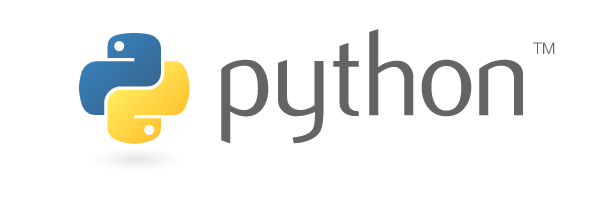
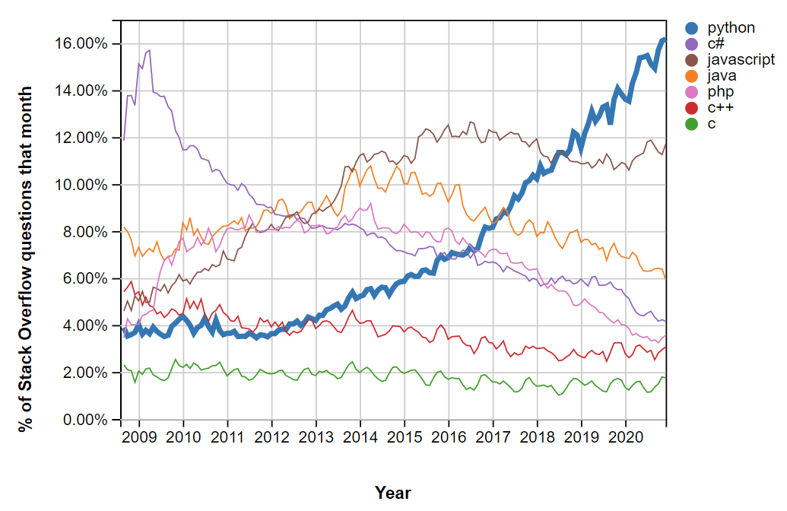

<!-- TOC -->
  * [🐍 Python для разработчиков на Java](#-python-для-разработчиков-на-java)
    * [Книги и ресурсы](#книги-и-ресурсы)
    * [Официальная документация](#официальная-документация)
    * [Шпаргалки](#шпаргалки)
  * [🐍 Что такое Python?](#-что-такое-python)
    * [Популярность Python](#популярность-python)
    * [Сравнение с Java](#сравнение-с-java)
      * [Сходства](#сходства)
      * [Отличия](#отличия)
  * [🐍 Установка](#-установка)
    * [Использование](#использование)
    * [Что такое Anaconda?](#что-такое-anaconda)
    * [Jupyter Notebooks](#jupyter-notebooks)
      * [Установка](#установка)
      * [Использование](#использование-1)
      * [Попробуйте сейчас](#попробуйте-сейчас)
  * [🐍 Основы синтаксиса](#-основы-синтаксиса)
  * [🐍 Типы данных](#-типы-данных)
    * [Числовые типы](#числовые-типы)
      * [Числовые типы 1/4](#числовые-типы-14)
      * [Числовые типы 2/4: Целые числа произвольной точности](#числовые-типы-24-целые-числа-произвольной-точности)
      * [Числовые типы 3/4: Математические выражения](#числовые-типы-34-математические-выражения)
      * [Числовые типы 4/4: Математические функции](#числовые-типы-44-математические-функции)
    * [Текстовые типы](#текстовые-типы)
      * [Конвертация строк](#конвертация-строк)
      * [Конкатенация строк](#конкатенация-строк)
    * [Логические типы](#логические-типы)
    * [Побитовые выражения](#побитовые-выражения)
  * [🐍 Коллекции](#-коллекции)
    * [Списки](#списки)
      * [Списки 1/2](#списки-12)
      * [Списки 2/2: Больше операций со списками](#списки-22-больше-операций-со-списками)
    * [Кортежи](#кортежи)
      * [Кортежи 1/2](#кортежи-12)
      * [Кортежи 2/2: Деструктуризация коллекций](#кортежи-22-деструктуризация-коллекций)
    * [Словари (Map == dict)](#словари-map--dict)
      * [Основные особенности словарей в Python](#основные-особенности-словарей-в-python)
      * [Внутренняя реализация словарей в Python](#внутренняя-реализация-словарей-в-python)
      * [Сравнение с HashMap в Java](#сравнение-с-hashmap-в-java)
      * [Удаление элементов и tombstones](#удаление-элементов-и-tombstones)
    * [Множества (Set)](#множества-set)
      * [Множества 1/2](#множества-12)
      * [Множества 2/2: Арифметика множеств](#множества-22-арифметика-множеств)
  * [🐍 Ввод и вывод](#-ввод-и-вывод)
    * [Ввод](#ввод)
    * [Вывод](#вывод)
      * [Вывод 1/2](#вывод-12)
      * [Вывод 2/2: Форматирование чисел](#вывод-22-форматирование-чисел)
    * [Чтение и запись файлов](#чтение-и-запись-файлов)
  * [🐍 Примеры](#-примеры)
    * [Основной контроль потока выполнения](#основной-контроль-потока-выполнения)
    * [Сумма всех цифр](#сумма-всех-цифр)
    * [Итерация по элементам](#итерация-по-элементам)
      * [Итерация по элементам 1/2: По значению](#итерация-по-элементам-12-по-значению)
      * [Итерация по элементам 2/2: По индексу](#итерация-по-элементам-22-по-индексу)
  * [🐍 Расширенные операции над последовательностями](#-расширенные-операции-над-последовательностями)
    * [Срезы последовательностей](#срезы-последовательностей)
      * [Срезы последовательностей 1/2](#срезы-последовательностей-12)
      * [Срезы последовательностей 2/2: Примеры](#срезы-последовательностей-22-примеры)
    * [Реверсирование последовательностей](#реверсирование-последовательностей)
    * [Сортировка последовательностей](#сортировка-последовательностей)
    * [Перечисление элементов](#перечисление-элементов)
    * [Вычисление налога на цену](#вычисление-налога-на-цену)
  * [🐍 Функции](#-функции)
    * [Передача по "Ссылке на Объект" / "Присваивание"](#передача-по-ссылке-на-объект--присваивание)
    * [Аргументы ВСЕГДА передаются по значению, в Java и также в Python.](#аргументы-всегда-передаются-по-значению-в-java-и-также-в-python)
    * [Что еще отличается в функциях Python? 1/3](#что-еще-отличается-в-функциях-python-13)
    * [Что еще отличается в функциях Python? 2/3](#что-еще-отличается-в-функциях-python-23)
    * [Что еще отличается в функциях Python? 3/3](#что-еще-отличается-в-функциях-python-33)
  * [🐍 Классы](#-классы)
    * [Что мы здесь замечаем?](#что-мы-здесь-замечаем)
      * [Конструкторы](#конструкторы)
      * [Функции и методы](#функции-и-методы)
      * [Статические методы](#статические-методы)
      * [Создание экземпляров](#создание-экземпляров)
    * [Неформальные интерфейсы](#неформальные-интерфейсы)
    * [Duck-Typing](#duck-typing)
    * [Но как я могу иметь "настоящие" интерфейсы и наследование в Python?](#но-как-я-могу-иметь-настоящие-интерфейсы-и-наследование-в-python)
  * [🐍 Организация кода](#-организация-кода)
    * [Запуск скриптов Python](#запуск-скриптов-python)
    * [Пакеты и модули](#пакеты-и-модули)
    * [Запуск скриптов Python](#запуск-скриптов-python-1)
    * [Основная "Функция"](#основная-функция)
    * [С этим вы в основном различаете, запускается ли скрипт напрямую или импортируется.](#с-этим-вы-в-основном-различаете-запускается-ли-скрипт-напрямую-или-импортируется)
    * [Пакеты и модули](#пакеты-и-модули-1)
    * [Зависимости обычно указываются в файле requirements.txt и устанавливаются с помощью pip. *](#зависимости-обычно-указываются-в-файле-requirementstxt-и-устанавливаются-с-помощью-pip-)
    * [Запуск модулей Python](#запуск-модулей-python)
  * [🐍 Библиотеки](#-библиотеки)
    * [Рекомендуемые пакеты](#рекомендуемые-пакеты)
    * [Использование библиотеки](#использование-библиотеки)
      * [Вычислить и показать параболу с помощью numpy и matplotlib](#вычислить-и-показать-параболу-с-помощью-numpy-и-matplotlib)
      * [Прочитать табличный набор данных с помощью pandas](#прочитать-табличный-набор-данных-с-помощью-pandas)
  * [🐍 Zen of Python](#-zen-of-python)
    * [Никогда не забывайте Zen of Python.](#никогда-не-забывайте-zen-of-python)
    * [А также попробуйте это.](#а-также-попробуйте-это)
<!-- TOC -->

## 🐍 Python для разработчиков на Java

- 🧑 Mario Kahlhofer
- 📧 mario.kahlhofer@dynatrace.com
- 🌎 github.com/blu3r4y/python-for-java-developers

xkcd Comic
(c) https://xkcd.com/353

### Книги и ресурсы
- 📚 Sarda, Deepak. Python for the Busy Java Developer. Apress, 2017. DOI: 10.1007/978-1-4842-3234-7 (к сожалению, использует устаревший синтаксис Python 2)
- 🌍 Real Python Tutorials. realpython.com

### Официальная документация
- "Как достичь X?" ... [docs.python.org/3/faq/programming.html](https://docs.python.org/3/faq/programming.html)
- "Почему Y отличается в Python?" ... [docs.python.org/3/faq/design.html](https://docs.python.org/3/faq/design.html)
- "Что предлагает стандартная библиотека?" ... [docs.python.org/3/library](https://docs.python.org/3/library)
- "Что означает термин X?" ... [docs.python.org/3/glossary.html](https://docs.python.org/3/glossary.html)

### Шпаргалки
- gto76.github.io/python-cheatsheet
- pythoncheatsheet.org
- pythonsheets.com

## 🐍 Что такое Python?

Python — зрелый, универсальный, объектно-ориентированный, динамически типизированный язык программирования.

- Выпущен в 1991 году, на четыре года раньше Java
- Доминирует в машинном обучении, статистике и анализе данных
- Популярная альтернатива MATLAB или Octave
- Популярность растет с каждым годом

### Популярность Python


### Сравнение с Java
#### Сходства
- Универсальный, обе имеют большую стандартную библиотеку
- Объектно-ориентированный
- Сборка мусора

#### Отличия
- Динамически типизированный, а не строго типизированный
  ("проверка типов происходит только во время выполнения")
- Интерпретируется с помощью CPython, а не компилируется в режиме реального времени с JVM
  ("больше гибкости, но медленнее выполнение")
- Интерактивный режим предоставляется из коробки
  ("я покажу вам это скоро")

## 🐍 Установка
Перейдите на python.org и установите 64-битную версию Python 3.8 или новее.

🚫 Не используйте Python 2.7 или старше!

### Использование
- Python можно использовать прямо из командной строки
- pip — самый популярный менеджер пакетов для Python, загружающий пакеты с pypi.org
- Самые популярные IDE — IntelliJ PyCharm или Visual Studio Code

### Что такое Anaconda?
Если вы собираетесь использовать много научных пакетов, вы можете установить Anaconda или Miniconda как альтернативу. numpy / scipy / sympy / tensorflow / ... обычно работают из коробки с Anaconda, особенно на Windows.

- conda — это менеджер пакетов, используемый Anaconda, загружающий пакеты с anaconda.org

### Jupyter Notebooks
Ноутбуки позволяют смешивать код и документацию, обычно для прототипирования или документирования.

#### Установка
Jupyter Notebooks — это "классические" ноутбуки, а Jupyter Labs — новый их преемник, похожий на IDE.

```sh
pip install jupyter jupyterlab

# или, если это не сработает
python -m pip install jupyter jupyterlab
```

#### Использование
Вы можете открыть файлы *.ipynb прямо в VS Code или PyCharm. Альтернативно, вы можете запустить автономный экземпляр в браузере из командной строки.

```sh
python -m jupyter notebook [--notebook-dir <path>]
python -m jupyter lab [--notebook-dir <path>]
```

#### Попробуйте сейчас
📜 [./python/m02_jupyter_introduction.ipynb](./python/m02_jupyter_introduction.ipynb)

## 🐍 Основы синтаксиса
```java
// ./java/M03_MaximumValue.java#L5-L15

List<Integer> numbers = Arrays.asList(1, -10, 0, -5, -1000, 100, 7);

int maximum = numbers.get(0);

for (int number : numbers) {
    if (number > maximum) {
        maximum = number;
    }
}

System.out.println("The maximum value is " + maximum);
```

```python
# ./python/m03_maximum_value.py

numbers = [1, -10, 0, -5, -1000, 100, 7]

maximum = numbers[0]

for number in numbers:
    if number > maximum:
        maximum = number

print("The maximum value is", maximum)
```

**Что мы здесь замечаем?**

- Нет точек с запятой ;
- Нет типов
- Нет фигурных скобок { } но есть блоки, начинающиеся с двоеточия :
- Нет круглых скобок ( ) вокруг выражений
- Список — один из многих встроенных типов в Python — инициализируется с помощью квадратных скобок [ ]
- ... на самом деле, в Python нет массивов
- Синтаксис for и if немного отличается
- Комментарии пишутся с помощью символа #

## 🐍 Типы данных
Мы рассмотрим только несколько типов данных, которые Java назвала бы примитивными типами. *
Найдите все "встроенные типы" на [docs.python.org/3/library/stdtypes.html](docs.python.org/3/library/stdtypes.html)

* **Числовые типы**
* **Текстовые типы**
* **Логические типы**

💡 В Python вы не указываете типы явно! Хотя, можно использовать подсказки типов.

> Вы можете думать о переменной в Python как о "теге" или "имени", которое прикреплено к какому-то объекту, а не как о "контейнере", который содержит какое-то значение. Все типы в Python по сути являются объектами, даже числовые, текстовые и логические. Однако, не задумывайтесь об этом слишком сильно - как вы увидите, все ведет себя довольно похоже на Java.

**Python является динамически типизированным**

В отличие от Java, вы можете переприсваивать значения разных типов одной и той же переменной по своему усмотрению. **

```python
x = 1416787301
x = "is"
x = True
```

** Говоря в терминах "тегов" и "имен", это означает, что вы можете свободно переприсваивать "тег" или "имя" к другой локации.
### Числовые типы

#### Числовые типы 1/4
Существует только три числовых типа float / int / complex в Python.

- float типы в Python ➡ эквивалентны double типам в Java *
- В Python нет short / int / long / "float" / double типов

```python
my_int = 5
my_float = 3.141
my_complex = 1 + 2j

# также есть несколько полезных способов записи чисел
speed_of_light = 299_792_458
us_national_debt = 28.9e+12
ascii_symbol = 0x3f
input_bitmask = 0b1011_1001
```

> Числа с плавающей запятой обычно реализуются с использованием double в C; информация о точности и внутреннем представлении чисел с плавающей запятой для машины, на которой выполняется ваша программа, доступна в sys.float_info" - см. [docs.python.org/3/library/stdtypes.html#numeric-types-int-float-complex](https://docs.python.org/3/library/stdtypes.html#numeric-types-int-float-complex)

#### Числовые типы 2/4: Целые числа произвольной точности
Целые числа в Python позволяют выполнять вычисления за пределами обычных границ целых чисел без потери точности.

И могут быть практически неограничены в размере, т.к. каждое int число занимает динамически расширяемое кол-во "блоков" памяти, размером по 30 бит каждый.

```python
# ./python/m04_arbitrary_precision_integers.py

lightyear_to_meter = 9_460_730_472_580_800
min_milky_way_diameter = 170_000 * lightyear_to_meter

min_milky_way_diameter_plus_one = min_milky_way_diameter + 1

print("Woooooow, the milky way is at least", min_milky_way_diameter, "meters in diameter!")
print("Adding one meter on that, we are at", min_milky_way_diameter_plus_one, "meters.")

# > Woooooow, the milky way is at least 1608324180338736000000 meters in diameter!
# > Adding one meter on that, we are at 1608324180338736000001 meters.
```

#### Числовые типы 3/4: Математические выражения
Найдите их все на [docs.python.org/3/library/stdtypes.html#numeric-types-int-float-complex](https://docs.python.org/3/library/stdtypes.html#numeric-types-int-float-complex)

```python
# ./python/m04_mathematical_expressions.py

x = 10.5
y = -3

print("x + y =", x + y)                  # сложение
print("x - y =", x - y)                  # вычитание
print("x * y =", x * y)                  # умножение

print("x / y =", x / y)                  # нормальное деление
print("x // y =", x // y)                # целочисленное деление
print("x % y =", x % y)                  # модуль

print("abs(y) =", abs(y))
print("int(x) =", int(x))                # конвертация в целое число
print("float(y) =", float(y))            # конвертация в число с плавающей запятой
print("complex(x, y) =", complex(x, y))  # конвертация в комплексное число

print("pow(x, 3) =", pow(x, 3))          # возведение в степень
print("x ** 3 =", x ** 3)                # возведение в степень (альтернативный синтаксис)
```

#### Числовые типы 4/4: Математические функции
Найдите их все на [docs.python.org/3/library/math.html](https://docs.python.org/3/library/math.html)

```python
# ./python/m04_mathematical_functions.py

# используем функции из этого встроенного пакета
import math

print("sqrt(16) =", math.sqrt(16))
print("5! =", math.factorial(5))
print("log(e) =", math.log(math.e))
print("sin(pi / 2) =", math.sin(math.pi / 2))
```

### Текстовые типы
Строки в Python неизменяемы `*` - как и в Java. При изменении строк выделяется новая память.

```python
first_string = "Hello World"
second_string = 'Hello Python'

multi_line_strings = """This can even
hold line breaks
now"""
```

`*` Неизменяемые объекты, т.е. объекты, которые нельзя изменить после их создания.

#### Конвертация строк
Многие типы в Python могут быть преобразованы в строку с помощью str() - аналогично .toString() в Java.
Как видно из примера, если вы объединяете строку с нестроковым объектом, вам нужно это сделать. **

```java
// ./java/M04_StringConversion.java#L3-L4

int num = 42;
System.out.println("The number is " + num);
```

```python
# ./python/m04_string_conversion.py

num = 42
print("The number is " + str(num))

# альтернатива, которая работает ТОЛЬКО для print()
print("The number is", num)

# print("The number is " + num)
# 💥 TypeError: can only concatenate str (not "int") to str
```

#### Конкатенация строк
Используйте str.join() в Python для объединения большого количества строк. *

```java
// ./java/M04_StringConcatenation.java#L3-L8

String a = "How";
String b = "to";
String c = "concatenate";
String d = "strings";

String result = String.join(" ", a, b, c, d);
```

```python
# ./python/m04_string_concatenation.py#L1-L7

a = "How"
b = "to"
c = "concatenate"
d = "strings"

# мы узнаем больше о списках в следующих модулях ...
result = " ".join([a, b, c, d])
```

`*` Эквивалентом StringBuilder в Java будет io.StringIO в Python.

### Логические типы
```python
# ./python/m04_boolean_expressions.py

x = True
y = False

print("x or y =", x or y)  # логическое или
print("x or y =", x | y)  # логическое или

print("x and y =", x and y)  # логическое и
print("x and y =", x & y)  # логическое и

print("not x =", not x)  # логическое не
```

### Побитовые выражения
Вы также можете выполнять двоичные вычисления с помощью побитовых операторов.
Найдите их все на [docs.python.org/3/library/stdtypes.html#bitwise-operations-on-integer-types](https://docs.python.org/3/library/stdtypes.html#bitwise-operations-on-integer-types)

```python
# ./python/m04_bitwise_expressions.py

port    = 0b1011_1011
bitmask = 0b0010_0000

is_bit_set = port & (bitmask >> 1)

# мы узнаем больше о форматировании в следующем модуле ...
print("dec:", is_bit_set)
print(f"bin: {is_bit_set:08b}")

# > dec: 16
# > bin: 00010000
```

## 🐍 Коллекции
Мы рассмотрим только несколько типов коллекций в Python.
Найдите их все на [docs.python.org/3/library/stdtypes.html](https://docs.python.org/3/library/stdtypes.html)

- Списки и массивы в Java ➡ это просто list в Python (но есть также tuple)
- Карты в Java ➡ это dict в Python
- Множества в Java ➡ это также set в Python

### Списки

#### Списки 1/2
Списки содержат несколько элементов в определенном порядке. В отличие от массивов, они могут менять размер в любое время.

```python
# ./python/m05_list_operations.py#L1-L15

numbers = [1, 2, 3, 4, 5]
names = ["Janine", "Ali", "Alice"]
mixed = [1, 2, "Max", 3.141]

names[0]                # получить элемент по индексу
names[0] = "Peter"      # установить элемент по индексу

names[-1]               # использовать отрицательные индексы для подсчета с конца

names.append(-5)        # добавить элемент в конец списка
names.insert(1, "Bob")  # добавить элемент в определенный индекс

names.remove(-5)        # удалить первый вхождение из списка
del names[0]            # удалить по индексу
```

**Что мы здесь замечаем?**
Коллекции в Python могут содержать данные разных типов

#### Списки 2/2: Больше операций со списками
Узнайте обо всех операциях со списками на [docs.python.org/3/tutorial/datastructures.html#more-on-lists](https://docs.python.org/3/tutorial/datastructures.html#more-on-lists).

```python
# ./python/m05_list_operations.py#L18-L26

"Alice" in names        # проверить существование
"Mario" not in names    # ... и отсутствие

numbers.count(1)        # количество раз, когда этот элемент находится в списке
len(numbers)            # общее количество элементов в списке

# объединить два списка в один
merged = [1, 2, 3] + [4, 5, 6]
```

### Кортежи

#### Кортежи 1/2
Кортежи содержат два или более объектов вместе в эффективной форме. Они не имеют прямого эквивалента в Java. Используйте их для группировки небольшого числа элементов, например, при возврате нескольких значений из метода.

```python
pair = ("Jonas", 12)  # создать кортеж
pair[0]               # получить элемент по индексу, аналогично спискам
```

💡 Кортежи всегда неизменяемы!

```python
# Вы не можете модифицировать, добавлять или удалять что-либо из них после создания.

# pair[1] = 13
# 💥 TypeError: 'tuple' object does not support item assignment

# pair.append(123)
# 💥 AttributeError: 'tuple' object has no attribute 'append'
```

Однако, вы можете конвертировать кортежи в списки.

```python
numbers = (10, 11, 12)
list(numbers)

# и обратно ...
letters = ["A", "B", "C"]
tuple(letters)
```

#### Кортежи 2/2: Деструктуризация коллекций
Деструктуризация помогает быстро извлекать элементы из типов, подобных спискам, в Python.

```python
# ./python/m05_destructuring.py

x, y = 1, 2
print(x, y)

# > 1 2

numbers = [1, 2, 3]
x, y, z = numbers

print(x, y, z)

# > 1 2 3

pair = ("Jonas", 12)
name, age = pair

print(name, age)

# > Jonas 12
```

**Что мы здесь замечаем?**

На самом деле, всякий раз, когда вы используете запятую , в таких контекстах, используется кортеж.

### Словари (Map == dict)
Словари сопоставляют ключи с значениями.

```python
# ./python/m05_dict_operations.py

grades = {
    "math": 2,
    "programming": 1,
    "literature": 3
}

# альтернативный синтаксис
grades = dict(math=2, programming=1, literature=3)

grades["math"]             # получить элементы по ключу
grades["math"] = 5         # установить элементы по ключу
grades["electronics"] = 4  # добавить новый элемент

# удалить элемент (вызовет ошибку, если ключ не существует)
if "math" in grades:
    del grades["math"]

grades.keys()              # получить все ключи в виде списка
grades.values()            # получить все значения в виде списка
```

Ассоциативные массивы (также известные как словари или `dict` в Python) — это структура данных, которая хранит пары "ключ-значение". 

В Python словари реализованы с помощью хеш-таблиц, что позволяет эффективно выполнять операции поиска, вставки и удаления.

#### Основные особенности словарей в Python

1. **Ключи и значения:**
    - Ключи должны быть хешируемыми объектами, т.е. объектами, которые имеют неизменяемый хеш-значение на протяжении их жизни (например, строки, числа, кортежи).
    - Значения могут быть любыми объектами Python.

2. **Операции:**
    - **Добавление/изменение**: `dict[key] = value`
    - **Удаление**: `del dict[key]`
    - **Доступ**: `value = dict[key]`
    - **Проверка наличия ключа**: `key in dict`

#### Внутренняя реализация словарей в Python

1. **Хеш-таблица:**
    - Словарь использует хеш-таблицу для хранения пар "ключ-значение". Каждому ключу сопоставляется хеш-значение, которое используется для вычисления индекса в массиве, где хранится значение.

2. **Резолвинг коллизий:**
    - Когда два разных ключа имеют одинаковое хеш-значение (коллизия), Python использует метод открытой адресации для разрешения коллизий. Это значит, что если место для хеш-значения занято, система ищет следующее свободное место в массиве.

3. **Распределение и перераспределение:**
    - Когда количество элементов в словаре достигает определенного порога, размер внутреннего массива увеличивается (обычно в два раза), и все элементы перераспределяются в новом массиве, чтобы уменьшить количество коллизий и сохранить эффективность операций.

4. **Упорядоченность:**
    - Начиная с версии Python 3.7, словари сохраняют порядок добавления элементов. Это означает, что при итерации по словарю элементы будут выводиться в порядке их добавления.

#### Сравнение с HashMap в Java

1. **Хеш-таблица:**
    - `HashMap` в Java также использует хеш-таблицу для хранения данных, где ключи хешируются для вычисления индекса в массиве.

2. **Резолвинг коллизий:**
    - В `HashMap` используется цепочка (chaining) для разрешения коллизий. При коллизии значения хранятся в связанном списке, который находится в ячейке массива. С версии Java 8, если длина связанного списка превышает определенный порог, он преобразуется в дерево (обычно красно-черное дерево) для улучшения производительности.

3. **Распределение и перераспределение:**
    - `HashMap` автоматически увеличивает размер внутреннего массива (обычно в два раза), когда количество элементов превышает определенный коэффициент загрузки (обычно 0.75), что приводит к перераспределению всех элементов.

4. **Упорядоченность:**
    - В отличие от Python, обычный `HashMap` в Java не сохраняет порядок элементов. Для сохранения порядка вставки используется `LinkedHashMap`.

**ВАЖНО**

* В HashMap в Java коллизии разрешаются с помощью **цепочек**, что позволяет хранить **несколько** пар "ключ-значение" в одном бакете.
* В dict в Python коллизии разрешаются с помощью **открытой адресации**, что требует поиска следующей свободной ячейки массива для каждой новой пары при коллизии. 
В каждом бакете может храниться **только одна** пара "ключ-значение".

#### Удаление элементов и tombstones

В случае удаления элемента из хеш-таблицы с открытой адресацией возникает проблема с поиском, если не принять специальные меры. 
Когда элемент удаляется, может остаться "дырка" (пустая ячейка), которая нарушает последовательность пробирования и мешает корректному поиску других элементов, 
которые были перемещены из-за коллизий.

В Python решением этой проблемы является использование "помеченных ячеек" (**tombstones**). 
Вместо того чтобы просто удалять элемент и оставлять ячейку пустой, мы помечаем её специальным значением, обозначающим, что ячейка была использована, но сейчас пуста. 
Это позволяет продолжать пробирование корректно.

Объяснение:
* **Пометка** удаленной ячейки: Вместо удаления элемента и оставления ячейки пустой, мы помечаем её специальным объектом self.tombstone.
* **Поиск**: При поиске, если встречается помеченная ячейка, пробирование продолжается. Это гарантирует, что элементы, вставленные после удаления, всё еще могут быть найдены.
* **Вставка**: При вставке нового элемента, помеченная ячейка может быть использована как свободная, что позволяет эффективно перераспределять память.

**Заключение**
Использование помеченных ячеек (tombstones) решает проблему поиска после удаления элемента в хеш-таблице с открытой адресацией. 
Это поддерживает целостность пробирования и позволяет корректно выполнять операции поиска и вставки даже после удаления элементов.

Таким образом, словари в Python и `HashMap` в Java имеют много общего, так как обе структуры данных основаны на хеш-таблицах, но имеют свои особенности и различия в реализации и использовании.

### Множества (Set)

#### Множества 1/2

Множества содержат несколько элементов, без дубликатов, но также без порядка.

```python
# ./python/m05_set_operations.py#L1-L10

numbers = {1, 1, 2, 3, 5}  # обратите внимание, как '1' добавляется только один раз

numbers.add(7)             # добавить новые элементы
numbers.add(1)             # добавить элементы, которые уже существуют (без эффекта)

1 in numbers               # проверить существование (намного быстрее, чем со списками)

# удалить элементы (вызовет ошибку, если элемент не существует)
if 2 in numbers:
    numbers.remove(2)
```

💡 Вы не можете извлекать элементы по индексу из множества!

```python
# numbers[0]
# 💥 TypeError: 'set' object is not subscriptable
```

Вы должны перебирать их или конвертировать множество в список с помощью list(elements)

```python
# ./python/m05_set_operations.py#L12-L14

# перебрать элементы множества
for val in numbers:
    print(val)
```

#### Множества 2/2: Арифметика множеств
Множества удобны, когда вы хотите применять операции из теории множеств.

```python
# ./python/m05_set_arithmetic.py

a = {1, 2, 3, 4, 5}
b = {4, 5, 6, 7, 8}

print("a | b =", a | b)  # объединение
print("a & b =", a & b)  # пересечение
print("a - b =", a - b)  # разность

# > a | b = {1, 2, 3, 4, 5, 6, 7, 8}
# > a & b = {4, 5}
# > a - b = {1, 2, 3}
```

## 🐍 Ввод и вывод
### Ввод
Вы можете читать ввод из командной строки с помощью input()

```python
# ./python/m06_input.py#L1-L2

name = input("Please enter your name: ")
print("Your name is", name)
```

💡 Не забывайте про преобразования типов данных!

```python
# ./python/m06_input.py#L4-L11

# эта функция всегда будет давать вам строку
number = input("Please enter a number: ")

as_int = int(number)
as_float = float(number)

print(as_int, as_float)
```

### Вывод

#### Вывод 1/2
Выводить что-то в командную строку можно с помощью print()

```python
# ./python/m06_output.py#L1-L14

pi = 3.141

print(pi)
print()
print("The value of pi is", pi)

# > 3.141
# >
# > The value of pi is 3.141

print("I hate: ", end="")
print("line breaks")

# > I hate: line breaks
```

Среди многих альтернатив, строки формата являются рекомендованным способом форматирования вывода.

```python
# ./python/m06_output.py#L17-L19

print(f"The value of pi is {pi} and the value of tau is {2 * pi}")

# > The value of pi is 3.141 and the value of tau is 6.282
```

#### Вывод 2/2: Форматирование чисел
Найдите их, когда вам нужно, на [gto76.github.io/python-cheatsheet/#format](https://gto76.github.io/python-cheatsheet/#format)

```python
# ./python/m06_number_formatting.py

pi = 3.14159265359
print(pi)

# > 3.14159265359

print(f"{pi:.0f}")     # без десятичных знаков
print(f"{pi:.2f}")     # два десятичных знака
print(f"{pi:.3e}")     # научная нотация

# > 3
# > 3.14
# > 3.142e+00

ratio = 0.25
print(f"{ratio:.1%}")  # процентное соотношение

# > 25.0%
```

### Чтение и запись файлов
Среди многих, вот один способ чтения и записи файла в Python.
Узнайте больше на [docs.python.org/3/tutorial/inputoutput.html#reading-and-writing-files.](https://docs.python.org/3/tutorial/inputoutput.html#reading-and-writing-files.)

```python
# ./python/m06_file_io.py#L3-L11

filename = "m06_file_io.txt"

with open(filename, "w+") as f:
    f.write("Hello\n")
    f.write("File!\n")

with open(filename, "r") as f:
    for line in f.read().splitlines():
        print(line)
```

**Что мы здесь замечаем?**

- Режим файла по умолчанию — r для чтения - используйте w для записи, w+ для чтения и записи *
- Кодировка по умолчанию — ascii, используйте аргумент ключевого слова encoding="utf-8" в противном случае

* Прочтите о возможных режимах на [gto76.github.io/python-cheatsheet/#open](https://gto76.github.io/python-cheatsheet/#open).

## 🐍 Примеры
### Основной контроль потока выполнения
```java
// ./java/M07_BasicControlFlow.java#L3-L17

int x = 0;

switch (x) {
    case 0:
        System.out.println("The value is 0");
        break;
    case 1:
        System.out.println("The value is 1");
        break;
    case 2:
        System.out.println("The value is 2");
        break;
    default:
        System.out.println("The value is something else");
}
```

```python
# ./python/m07_basic_control_flow.py

x = 0

if x == 0:
    print("The value is 0")
elif x == 1:
    print("The value is 1")
elif x == 2:
    print("The value is 2")
else:
    print("The value is something else")
```

**Что мы здесь замечаем?**

Python не имеет выражения switch, вам нужно сделать каскад if / elif / else утверждений *
* На самом деле, если вы используете Python 3.10 или новее, теперь есть новые выражения match и case.

### Сумма всех цифр
```java
// ./java/M07_SumOfAllDigits.java#L6-L18

Scanner scanner = new Scanner(System.in);
System.out.print("Enter a number: ");
int n = scanner.nextInt();
scanner.close();

int digitSum = 0;

while (n > 0) {
    digitSum += n % 10;
    n = n / 10;
}

System.out.println("The digit sum is " + digitSum);
```

```python
# ./python/m07_sum_of_all_digits.py

n = int(input('Enter a number: '))

digit_sum = 0

while n > 0:
    digit_sum += n % 10
    n = n // 10

print("The digit sum is ", digit_sum)
```

**Что мы здесь замечаем?**

- Чтение из пользовательского ввода выполняется с помощью input() и также может выводить подсказку
- Цикл while также существует в Python
- Мы используем явное целочисленное деление // в Python, но используем обычное деление / в Java
- в отличие от Java, деление всегда даст вам тип данных float
```python
assert 5 / 2 == 2.5

# если вам нужно явное целочисленное деление
assert 5 // 2 == 2
```

* assert вызовет AssertionError, если условие будет False - используйте его для проверки предположений в вашем коде.

### Итерация по элементам

#### Итерация по элементам 1/2: По значению
```java
// ./java/M07_IteratingElementsByValue.java#L3-L7

String[] names = {"Lisa", "John", "Susan", "Alex"};

for (String name : names) {
    System.out.println(name);
}
```

```python
# ./python/m07_iterating_elements_by_value.py

names = ["Lisa", "John", "Susan", "Alex"]

for name in names:
    print(name)
```

**Что мы здесь замечаем?**

Итерация по списку элементов довольно похожа в Java и Python

#### Итерация по элементам 2/2: По индексу
```java
// ./java/M07_IteratingElementsByIndex.java#L3-L7

int[] numbers = {10, 11, 12, 13, 14, 15, 16, 17, 18, 19, 20};

for (int i = 5; i < 8; i++) {
    System.out.println(numbers[i]);
}
```

```python
# ./python/m07_iterating_elements_by_index.py

numbers = [10, 11, 12, 13, 14, 15, 16, 17, 18, 19, 20]

for i in range(5, 8):
    print(numbers[i])
```

**Что мы здесь замечаем?**

- Python поддерживает только синтаксис x in y с циклом for
- Чтобы повторить поведение, которое вам может быть известно, вам нужно использовать range(start, stop), который даст вам числа от start до

stop - 1
💡 На самом деле, range() даст вам итератор!

Если вам действительно нужны числа в виде списка, вам нужно конвертировать результат.

```python
# итераторы позволяют получить только следующий элемент с помощью next()
range(5, 8)

# списки позволяют произвольный доступ по индексу
list(range(5, 8))
```

## 🐍 Расширенные операции над последовательностями

### Срезы последовательностей

#### Срезы последовательностей 1/2
Примеры, подобные предыдущему, обычно решаются путем разрезания коллекций, подобных спискам.
Это также очень полезно для математических приложений, например, при работе с большим количеством массивов и матриц.

```python
# ./python/m07_sequence_slicing.py#L1-L5

numbers = [10, 11, 12, 13, 14, 15, 16, 17, 18, 19, 20]

numbers[5:8]   # дайте мне новую КОПИЮ списка, начиная с индекса 5 и заканчивая индексом 7

# > [15, 16, 17]
```

Поддерживаемые варианты:
```python
a[start:stop:step]
a[start:stop]
a[start:]
a[:stop]
a[:]
```

Конечный индекс всегда исключается, т.е. элемент с индексом stop не является частью полученного среза.

#### Срезы последовательностей 2/2: Примеры
```python
numbers = [10, 11, 12, 13, 14, 15, 16, 17, 18, 19, 20]
# ./python/m07_sequence_slicing.py#L7-L14

numbers[1:]    # все, кроме первого элемента    > [11, 12, 13, 14, 15, 16, 17, 18, 19, 20]
numbers[:3]    # первые три элемента            > [10, 11, 12]

numbers[:-1]   # все, кроме последнего элемента > [10, 11, 12, 13, 14, 15, 16, 17, 18, 19]
numbers[-2:]   # последние два элемента         > [19, 20]

numbers[::2]   # каждый второй элемент          > [10, 12, 14, 16, 18, 20]
numbers[1::2]  # каждый второй, но начиная со 2 > [11, 13, 15, 17, 19]
```

Это также работает со строками, потому что они всего лишь список символов.

```python
# ./python/m07_sequence_slicing.py#L17-L20

name = "Hello World"
name[1:-1]

# > 'ello Worl'
```

### Реверсирование последовательностей
- Используйте reversed(a) для итерации по последовательности в обратном порядке
- Используйте a.reverse() на объекте, чтобы перевернуть элементы на месте
- Вырежьте перевернутую копию элементов с помощью a[::-1]

```python
# ./python/m07_sequence_reversing.py

numbers = [1, 2, 3, 4, 5, 6, 7, 8, 9, 10]

# итератор, который итерирует список в обратном порядке
reversed(numbers)

# перевернуть список на месте
numbers.reverse()

# вырезать перевернутую копию элементов
numbers[::-1]
```

### Сортировка последовательностей
- Используйте sorted(a), чтобы получить отсортированный список элементов
- Используйте a.sort(), чтобы отсортировать последовательность на месте
- Используйте аргумент ключевого слова reverse=True, чтобы изменить порядок сортировки

```python
# ./python/m07_sequence_sorting.py

numbers = [1, -10, 20, 11, 19, 0, -5, -1000, 100, 7]

# получить отсортированный список элементов
sorted(numbers)
sorted(numbers, reverse=True)

# отсортировать список на месте
numbers.sort()
numbers.sort(reverse=True)
```

### Перечисление элементов
```java
// ./java/M07_EnumeratingOverElements.java#L3-L9

String[] names = {"Lisa", "John", "Susan", "Alex"};

int i = 0;
while (i < names.length) {
    System.out.println(i + " " + names[i]);
    i++;
}
```

```python
# ./python/m07_enumerating_over_elements.py

names = ["Lisa", "John", "Susan", "Alex"]

for i, name in enumerate(names):
    print(i, name)
```

**Что мы здесь замечаем?**

Наш цикл теперь итерируется по двум значениям - enumerate() создает для нас кортежи

### Вычисление налога на цену
```java
// ./java/M07_PriceTax.java#L5-L16

List<Double> prices = Arrays.asList(12.3, 5.2, 8.7, 1.2, 8.0);
List<Double> gross = new ArrayList<Double>();

for (double price : prices) {
    if (price > 8) {
        gross.add(price * 1.2);
    }
}

for (double price : gross) {
    System.out.println(price);
}
```

```python
# ./python/m07_price_tax.py#L1-L8

prices = [12.3, 5.2, 8.7, 1.2, 8.0]
gross = []

for price in prices:
    if price > 8:
        gross.append(price * 1.2)

print(gross)
```

💡 List comprehension
List comprehensions сопоставляют каждое значение в списке с новым значением и таким образом создают новый список. *

```python
[x for x in sequence]

# ./python/m07_price_tax.py#L11-L12

prices = [12.3, 5.2, 8.7, 1.2, 8.0]
gross = [price * 1.2 for price in prices if price > 8]
```

> Так же Python предлагает множество функций высшего порядка для функционального программирования, 
> таких как map / filter / reduce / zip / all / any / ...

## 🐍 Функции
```java
// ./java/M08_RectangleFunctions.java#L2-L16

static double area(double a, double b) {
    return a * b;
}

static boolean isSquare(double a, double b) {
    return a == b;
}

public static void main(String[] args) {
    System.out.println("area(1, 5) = " + area(1, 5));
    System.out.println("area(1.5, 2.3) = " + area(1.5, 2.3));

    System.out.println("isSquare(1, 5) = " + isSquare(1, 5));
    System.out.println("isSquare(5, 5) = " + isSquare(5, 5));
}
```

```python
# ./python/m08_rectangle_functions.py#L1-L13

def area(a, b):
    return a * b

def is_square(a, b):
    return a == b

print("area(1, 5) =", area(1, 5))
print("area(1.5, 2.3) =", area(1.5, 2.3))

print("is_square(1, 5) =", is_square(1, 5))
print("is_square(5, 5) =", is_square(5, 5))
```

**Что мы здесь замечаем?**

- Функции определяются с помощью def
- Python не имеет модификаторов доступа и ключевого слова static
- Вам не нужно указывать какие-либо типы для параметров функции - это называется duck-typing

### Передача по "Ссылке на Объект" / "Присваивание"
В двух словах, Python имеет то же поведение при передаче, что и Java - хотя Python не имеет примитивных типов.

```java
// ./java/M08_PassByObjectReference.java#L4-L20

static void replace(List<Integer> numbers) {
    numbers = Arrays.asList(42, 43, 44);
}

static void append(List<Integer> numbers) {
    numbers.add(42);
}

public static void main(String[] args) {
    List<Integer> oneTwoThree = new LinkedList<>(Arrays.asList(1, 2, 3));

    replace(oneTwoThree);
    System.out.println(Arrays.toString(oneTwoThree.toArray()));

    append(oneTwoThree);
    System.out.println(Arrays.toString(oneTwoThree.toArray()));
}
```

```python
# ./python/m08_pass_by_object_reference.py

def replace(numbers):
    numbers = [42, 43, 44]

def append(numbers):
    numbers.append(42)

one_two_three = [1, 2, 3]

replace(one_two_three)
print(one_two_three)    # > [1, 2, 3]

append(one_two_three)
print(one_two_three)    # > [1, 2, 3, 42]
```

### Аргументы ВСЕГДА передаются по значению, в Java и также в Python.
- Когда ваш аргумент является объектом, передается ссылка

на этот объект.
- В Java, когда вы передаете примитивный тип, такой как int, значение копируется.
- В Python нет примитивных типов. Если вы передаете int, передается ссылка на объект и никакие данные не копируются.
- Но, поскольку int неизменяем, вы не можете изменить значение исходного объекта.

* Отсюда все становится сложнее. Узнайте больше о технических деталях у Robert Heaton. 2014. "Is Python pass-by-reference or pass-by-value?" и Sreejith Kesavan. 2012. "Understanding Python Variables and Memory Management".

### Что еще отличается в функциях Python? 1/3
Вы можете явно указывать имена аргументов - и даже менять их порядок.

```python
# ./python/m08_rectangle_functions.py#L17-L18

area(a=2, b=5)
area(b=5, a=2)
```

Вы можете указывать значения по умолчанию для аргументов.

```python
# ./python/m08_function_differences.py#L1-L12

def function_with_default_args(x, y, name="Unknown User", factor=1.2):
    result = x * y * factor
    print(f"Hello {name}, your result is {result}")

function_with_default_args(1, 2)
function_with_default_args(1, 2, name="Mario")
function_with_default_args(1, 2, factor=10)

# > Hello Unknown User, your result is 2.4
# > Hello Mario, your result is 2.4
# > Hello Unknown User, your result is 20
```

### Что еще отличается в функциях Python? 2/3
Вы можете возвращать несколько результатов с помощью кортежей и деструктуризации.

```python
# ./python/m08_function_differences.py#L15-L30

def function_with_two_return_values(radius):
    pi = 3.14159

    circumference = 2 * pi * radius
    area = pi * radius ** 2

    return circumference, area

c, a = function_with_two_return_values(5)

print("circumference", c)
print("area", a)

# > circumference 31.4159
# > area 78.53975
```

### Что еще отличается в функциях Python? 3/3
- Вы можете объявлять функции внутри функций
- Вы можете объявлять анонимные функции, называемые lambda выражениями
- Вы можете переопределять и изменять функции на лету, как переменные
  ("функции являются объектами первого класса в Python")
- Вы можете использовать *args и **kwargs для работы с практически любыми входными параметрами, которые вы уже использовали, например, в функции print()
  Узнайте больше о функциях на [docs.python.org/3/tutorial/controlflow.html#more-on-defining-functions](https://docs.python.org/3/tutorial/controlflow.html#more-on-defining-functions).

## 🐍 Классы
Python является объектно-ориентированным, но следует более легкому подходу к классам.

```java
// ./java/M09_PassengersProgram.java#L3-L40

class Passenger {
    final static Integer classField = 0;
    
    final String firstName;
    final String lastName;

    Passenger(String firstName, String lastName) {
        this.firstName = firstName;
        this.lastName = lastName;
    }

    void display() {
        System.out.printf("%s %s %n", firstName, lastName);
    }

    static Passenger fromInput() {
        Scanner scanner = new Scanner(System.in);

        System.out.print("Enter first name: ");
        String firstName = scanner.nextLine();
        System.out.print("Enter last name: ");
        String lastName = scanner.nextLine();

        scanner.close();

        return new Passenger(firstName, lastName);
    }
}

class PassengersProgram {

    public static void main(String[] args) {
        Passenger lisa = new Passenger("Lisa", "Ha");
        Passenger user = Passenger.fromInput();

        lisa.display();
        user.display();
    }
}
```

```python
# ./python/m09_passengers_program.py

class Passenger:
    class_attr = 10  # атрибут класса

    def __init__(self, first_name, last_name):
        self.first_name = first_name  # атрибут экземпляра
        self.last_name = last_name  # атрибут экземпляра

    def display(self):
        print(f"Passenger: {self.first_name} {self.last_name} {self.class_attr}")

    @staticmethod
    def create_instance_from_input():
        first_name = input("Enter first name: ")
        last_name = input("Enter last name: ")

        return Passenger(first_name, last_name)

if __name__ == "__main__":
    lisa = Passenger("Lisa", "Ha")
    user = Passenger.create_instance_from_input()

    lisa.display()
    user.display()
```

### Что мы здесь замечаем?
#### Конструкторы
- Существует только один конструктор, называемый __init__ с обязательным параметром self
- Python не поддерживает перегрузку конструкторов или методов
- У класса есть атрибуты(поля)
    - поля **класса** `class_attr` (аналоги статических полей в Java), они одинакавые для всех экземпляров этого класса
    - поля **экземпляра** `first_name` и `last_name`, которые мы не объявляем явным образом, но создаем их на лету в конструкторе или где-то еще

#### Функции и методы
- Что делает функцию методом, определяется только явным параметром self
- Вы всегда должны использовать self., если хотите получить доступ к свойствам класса
- Нет модификаторов доступа, и также нет final в Python

#### Статические методы
- Статический метод нуждается в декораторе @staticmethod и опускает параметр self
- Статический метод просто означает, что он не будет обращаться к каким-либо свойствам класса

#### Создание экземпляров
- Создание нового объекта работает аналогично, но вы опускаете ключевое слово new
- Основной метод в Python фактически является условием - мы узнаем больше в следующих модулях

### Неформальные интерфейсы
```java
// ./java/M09_ShapesProgram.java

interface Shape {
    double area();
}

class Circle implements Shape {

    final double radius;

    Circle(double radius) {
        this.radius = radius;
    }

    @Override
    public double area() {
        return 3.14159 * radius * radius;
    }
}

class Square implements Shape {

    final double length;

    Square(double length) {
        this.length = length;
    }

    @Override
    public double area() {
        return length * length;
    }
}

class ShapesProgram {

    public static void main(String[] args) {
        Shape[] shapes = { new Circle(5), new Square(10) };
        for (Shape shape : shapes) {
            System.out.println(shape.area());
        }
    }
}
```

```python
# ./python/m09_shapes_program.py

class Shape:
    def area(self):
        pass

class Circle(Shape):
    def __init__(self, radius):
        self.radius = radius

    def area(self):
        return 3.14159 * self.radius * self.radius

class Square(Shape):
    def __init__(self, length):
        self.length = length

    def area(self):
        return self.length * self.length

shapes = [Circle(5), Square(10)]
for shape in shapes:
    print(shape.area())
```

**Что мы здесь замечаем?**

- В Python нет типа интерфейса, вместо этого мы используем обычный класс и наследуемся от него
- Методы переопределяются без явной аннотации - они всегда заменяются
- Python не применяет проверки типов, попробуйте удалить Shape или переименовать метод area() ...

### Duck-Typing
Поскольку в Python НЕТ проверки типов во время компиляции, мы также можем полагаться исключительно на duck-typing.
Исключение AttributeError возникает во время выполнения, если метод, который вы вызываете, не существует. *

```python
# ./python/m09_shapes_duck_typing.py

class Circle:
    def __init__(self, radius):
        self.radius = radius

    def area(self):
        return 3.14159 * self.radius * self.radius

class Square:
    def __init__(self, length):
        self.length = length

    def area(self):
        return self.length * self.length

shapes = [Circle(5), Square(10)]
for shape in shapes:
    print(shape.area())
```

### Но как я могу иметь "настоящие" интерфейсы и наследование в Python?
- Используйте абстрактные классы через модуль abc
- Узнайте больше о формальных интерфейсах на realpython.com/python-interface
* Обратите внимание на подсказки типов, чтобы лучше проверять типы во время выполнения и даже до запуска кода.

## 🐍 Организация кода
Давайте кратко и интерактивно рассмотрим, как создать проект на Python, состоящий из нескольких файлов.

### Запуск скриптов Python
📜 [./python/m10_multiple_scripts/README.md](python/m10_multiple_scripts/README.md)

### Пакеты и модули
📜 [./python/m10_demo_project/README.md](python/m10_demo_project/README.md)

Узнайте больше о лучших практиках на docs.python-guide.org/writing/structure

### Запуск скриптов Python
Ваш код всегда выполняется сверху вниз.

```sh
python script.py
```

### Основная "Функция"
Условие `__main__`, которое вы пишете, будет истинным только при непосредственном запуске этого скрипта.

```python
# ./python/m10_multiple_scripts/main.py#L5-L6

if __name__ == "__main__":
    print("This will only run if you specifically started the interpretor on this file.")
```

### С этим вы в основном различаете, запускается ли скрипт напрямую или импортируется.
При импорте условие `__main__` импортируемого файла будет ложным.

```python
# ./python/m10_multiple_scripts/imports.py

import main

# вы также можете попробовать эти:
# import script
# from main import test_variable

if __name__ == "__main__":
    print("The value of the test variable is:", main.test_variable)
```

### Пакеты и модули
Вы должны структурировать свой код в пакеты ("каталоги") и модули ("файлы Python").

```
.
├── README.md          <-- краткое описание
├── requirements.txt   <-- список зависимостей (список имен и версий пакетов)
├── graphics
│   ├── __init__.py
│   └── parabola.py
└── user               <-- пакет с именем 'user'
    ├── __init__.py    <-- будет выполнен при 'import user'
    └── app.py         <-- модуль с именем 'app'
```

### Зависимости обычно указываются в файле requirements.txt и устанавливаются с помощью pip. *

```sh
python -m pip install -r requirements.txt
```

### Запуск модулей Python
Вы запускаете модули, когда ваш код состоит из нескольких файлов.

```sh
python -m user.app
```

Когда вы запускаете модуль, ваш корневой пакет загружается в путь импорта интерпретатора.
Таким образом, при каждой записи оператора import, пакеты и модули будут найдены и импортированы.

* Обратите внимание, что pip является самостоятельным пакетом и что мы используем режим модуля для его запуска. Многие модули также добавляются в системный путь при установке, что позволяет вам запускать их непосредственно из командной строки, например, с pip вместо python -m pip.

## 🐍 Библиотеки
Не изобретайте велосипед для различных задач, взгляните на существующие пакеты.

### Рекомендуемые пакеты
- numpy & scipy - высокопроизводительные числовые вычисления, многомерные массивы
- matplotlib & seaborn & plotly & bokeh - графическая визуализация для математиков
- pandas - работа с табличными данными
- sympy - символьная математика
- networkx - графы и сети
- requests - сетевые запросы, загрузка файлов
- tkinter & pyqt - графические интерфейсы пользователя

💡 Установите новые пакеты с помощью pip

```sh
python -m pip install <package-name>
```

### Использование библиотеки
#### Вычислить и показать параболу с помощью numpy и matplotlib
```python
# ./python/m11_numpy_demo.py

import matplotlib.pyplot as plt
import numpy as np

# получить 1000 чисел между -5 и 5
xs = np.linspace(-5, 5, 1000)

# применить функцию к этому numpy массиву
ys = xs ** 2 - 1

# показать график
plt.plot(xs, ys)
plt.show()
```

#### Прочитать табличный набор данных с помощью pandas
```python
# ./python/m11_pandas_demo.py

import pandas as pd

# быстро прочитать csv файл
df = pd.read_csv("https://archive.ics.uci.edu/ml/machine-learning-databases/iris/iris.data")
print(df)
```

## 🐍 Zen of Python
Если вам когда-либо понадобится помощь, введите help - используйте ресурсы, упомянутые в начале - или, спросите у Google.

```python
help(sorted)

# > Help on built-in function sorted in module builtins:
# >
# > sorted(iterable, /, *, key=None, reverse=False)
# >     Return a new list containing all items from the iterable in ascending order.
# >
# >     A custom key function can be supplied to customize the sort order, and the
# >     reverse flag can be set to request the result in descending order.
```

### Никогда не забывайте Zen of Python.

```python
import this
```

### А также попробуйте это.

```python
import antigravity
```