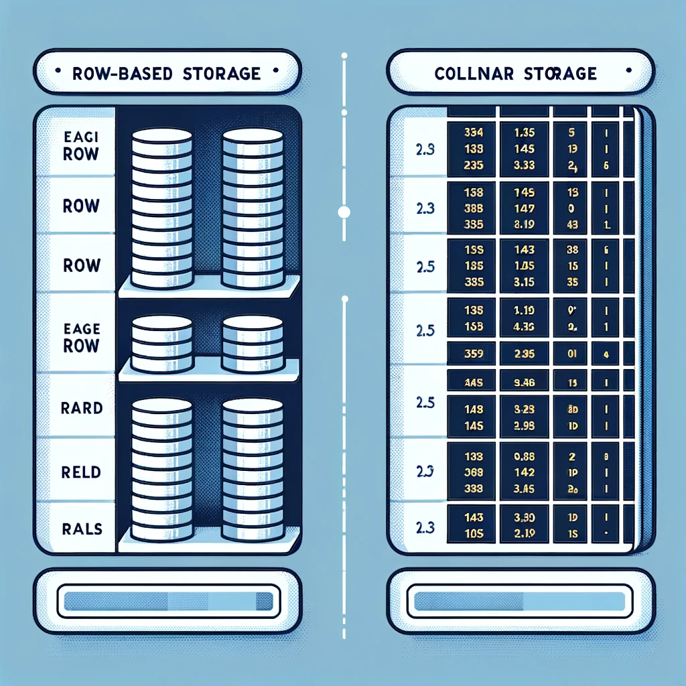

# Storage Layout

## Columnar Storage Layout

Columnar storage layout is a data storage format that is optimized for reading and writing data in columns, rather than
in rows. This approach is particularly advantageous for analytical querying and data warehousing, where operations often
involve aggregating or scanning large volumes of data across specific columns.

1. **Storage Method**:
    - Data is stored column by column, with each column stored separately. This is in contrast to traditional
      row-oriented databases where data is stored row by row.

2. **Compression**:
    - Columnar storage allows for high levels of compression because columns of data often contain many similar or
      repeating values. Efficient compression algorithms can significantly reduce storage requirements and improve query
      performance.

3. **Performance**:
    - Optimized for read-heavy operations such as data analysis and reporting. Columnar storage allows for faster
      aggregation, filtering, and sorting on specific columns.
    - Write operations (inserts, updates) may be slower compared to row-based storage due to the need to update each
      column file separately.

4. **I/O Efficiency**:
    - Reduces I/O load by reading only the necessary columns for a query, rather than entire rows. This is particularly
      beneficial for queries that access a subset of columns.

5. **Applications**:
    - Commonly used in data warehousing, business intelligence, and Big Data analytics where operations like OLAP (
      Online Analytical Processing) are prevalent.

6. **Examples of Columnar Storage Systems**:
    - Apache Cassandra, Google BigQuery, Amazon Redshift, and Apache Parquet are examples of systems or file formats
      that use columnar storage.

Row-based storage layout is a common data storage format where data is stored in rows within a table. It is widely used
in traditional relational database systems. Here are the technical details and potential interview questions with
comprehensive answers:

## Row-Based Storage Layout

1. **Storage Method**:
    - Data is stored row by row. Each row represents a record and contains fields (or columns) that correspond to
      attributes of the entity.

2. **Performance**:
    - Optimized for write-heavy operations, such as transactional systems (OLTP - Online Transaction Processing).
      Row-based storage is efficient for operations that need to access or modify entire records, such as inserting,
      updating, or deleting rows.

3. **Data Retrieval**:
    - When a query accesses a row, the entire row is fetched, including all fields, even if only a few are needed. This
      can lead to more I/O overhead for read-heavy analytical queries.

4. **Disk Utilization**:
    - Less efficient in terms of disk space compared to columnar storage, especially for tables with many columns where
      queries only access a subset of those columns.

5. **Examples of Row-Based Storage Systems**:
    - Traditional SQL databases like MySQL, PostgreSQL, and Microsoft SQL Server use row-based storage.

## Row-Based vs. Columnar Storage

The illustration above visually compares row-based and columnar storage layouts:

- **Row-Based Storage**: On the left side, data is organized in rows. Each row represents a complete record with various
  fields (attributes). This layout is typical for traditional relational databases and is optimized for transactions
  that involve the entire record, such as updates or deletions.

- **Columnar Storage**: On the right side, data is organized in columns. Each column stores all the data for a specific
  attribute across all records. This layout is particularly efficient for analytical processing where operations
  typically involve aggregating or scanning large volumes of data across specific columns.

### Comparison between Row-Based and Columnar Storage:

1. **Data Retrieval**:
    - Row-Based: Fetches entire rows, ideal for transactions involving complete records.
    - Columnar: Fetches specific columns, more efficient for analytical queries that access only a subset of attributes.

2. **Performance**:
    - Row-Based: Faster for write-heavy operations (inserts, updates).
    - Columnar: Faster for read-heavy, analytical queries (aggregations, scans).

3. **Storage Efficiency**:
    - Row-Based: Less efficient in storage if only a few columns are regularly accessed.
    - Columnar: Higher compression rates and reduced storage space due to similar data in columns.

4. **Use Cases**:
    - Row-Based: Suitable for Online Transaction Processing (OLTP) systems.
    - Columnar: Preferred for Online Analytical Processing (OLAP) and data warehousing.

5. **I/O Load**:
    - Row-Based: Higher I/O load for read operations, as more data may need to be read than necessary.
    - Columnar: Reduced I/O load for reads, as only necessary columns are accessed.

This visualization and comparison provide a clear understanding of the differences between these two storage layouts and
their respective advantages in different use cases.

## Q&A

### What Are the Advantages of Columnar Storage Over Row-Based Storage?

**Answer**:

- Columnar storage is more efficient for read-heavy analytical queries as it allows reading only the necessary columns,
  reducing I/O. It also offers better data compression, which saves storage and speeds up query execution. However, for
  transactional systems where row-level operations are frequent, row-based storage might be more efficient.

### How Does Columnar Storage Improve Query Performance?

**Answer**:

- It improves performance by reducing the amount of data that needs to be read from disk for column-centric queries.
  Since only the relevant columns are accessed, it minimizes disk I/O. Additionally, the high compression rates lower
  the memory footprint, which can significantly improve performance for large datasets.

### What are the Advantages and Disadvantages of Row-Based Storage?

**Answer**:

- **Advantages**: Ideal for transactional systems where the primary operations involve adding, updating, or deleting
  records. Provides faster write performance and is straightforward for applications that need to access complete
  records.
- **Disadvantages**: Less efficient for read-heavy analytical queries that only require a few columns from a large
  dataset, as it necessitates reading entire rows. Also, it may lead to larger data footprints due to lower compression
  rates compared to columnar storage.

### How Does Row-Based Storage Perform in Analytical Queries?

**Answer**:

- Row-based storage can be less efficient for analytical queries, particularly those that aggregate or scan large
  datasets across specific columns. Since these queries often access only a few columns, row-based storage results in
  unnecessary I/O by fetching entire rows.

### In What Scenarios Would You Prefer Row-Based Storage Over Columnar Storage?

**Answer**:

- Row-based storage is preferable in transactional applications or OLTP systems where operations predominantly involve
  creating, updating, or deleting entire records. It's also suitable when applications frequently access most or all
  columns of a table in their queries.

### Can Row-Based Databases Handle Large Volumes of Data Efficiently?

**Answer**:

- While row-based databases can handle large volumes of data, they may face performance issues in scenarios involving
  large-scale data warehousing or analytical processing. Performance tuning, indexing, and partitioning are essential to
  optimize their operation in handling large datasets.

### How Do You Optimize a Row-Based Database for Performance?

**Answer**:

- Optimization strategies include effective use of indexing to speed up query processing, normalizing the database
  schema to reduce data redundancy, and partitioning tables to manage and access subsets of data more efficiently.
  Additionally, caching frequently accessed data and optimizing query design can also significantly enhance performance.